# 01、如何合理制定“局部业务”的目标

**如何明确局部业务目标**

### 1 如何合理制定“局部业务”的目标

以上，随后我们进入到第二趴，更具体点来讲一下到底怎么合理制定我们的局部业务的目标。对第二节部分一开篇的时候想给到各位一个重要的忠告，核心我觉得在我们很多人的工作里面，很多时候我们遇到了障碍，都在于说我们的目标定得不因此，例如我们的目标可能说没有办法跟其他人形成很好的协同，所以会打架，或者说我们的目标定的不稳定，导致我们的目标就定下来之后，一两个月就得变，来回的去变了，三四次之后，然后我也疲了，然后我团队人也疲了，然后上级也疲了，后边再干起来

基本就没太有劲了。

，然后约是这样的这种认为，所以确实我觉得是说各位如果是说想奔着成为一个操盘手，想在一个局部去负责某一块业务，目标定得好足够清晰，是十分重要的一件事情。如果这件事你做到了，你的工作可能就成功了一半。

以上到底我们要怎么才能把我们所在局部的业务的目标要定得足够清晰，回到我们讲的三步来，就要做好自己的目标和局部业务的目标管理和规划，对首先我们先来看在明确目标部分，我们是说关注我们局部业务的目标定得好还是不因此，核心应该思考三方面的东西。

第一个叫做我们要确保我们的目标是能跟公司的战略需求和核心业务模型要是一致的，它要可支持我们战略目标的达成，不跑偏，这是第一个我们要保证的东西。，然后我们刚才那一节讲到的很多也跟这一点相关，然后第二个要保证东西是叫做说我们要保证确保我们的目标清晰可衡量可验收，这是第二个要确保的东西。

第三个要确保的东西，说我们一定要确保我们的目标跟相关的协作部门，因为我们的目标指向的一定是一个结果，指向的要么是说是某个具体的指标的提升，或者是说最终指向的它一定服务于我们的收入或者是别的什么东西，对我要完成目标上，是否有一些其他人的工作会是我们要完成这件事的前提？

，或者说我要完成目标，需不需要其他的一些部门的同学来协作来去支持对如果需要，我们的目标到底是否对齐的，会不会出现打架的情况，然后这也是十分重要的一件事情，所以核心要让我们目标定得足够明确和清晰，我们就要分别去思考和关注这么三方面的信息。

## **1.如何确保目标与战略需求和核心业务模型一致，不跑偏。**

### 1.一个合格的操盘手，每一件局部完成的工作，都一定能与公司的战略目标关联起来。

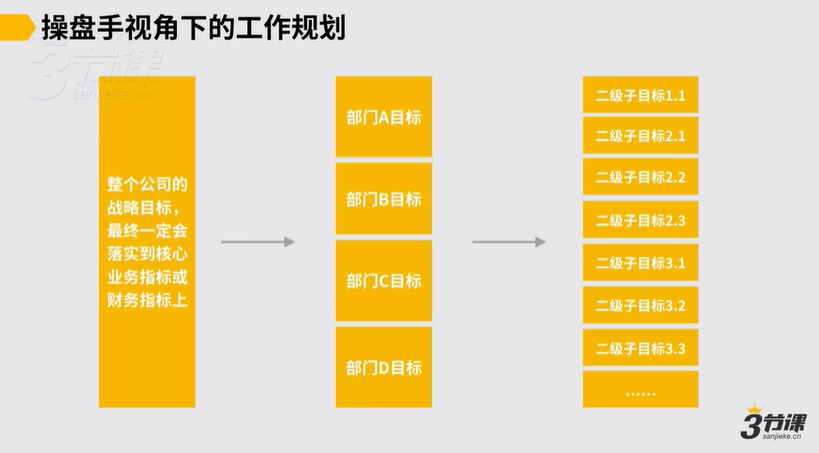

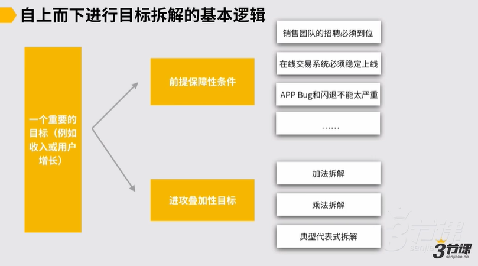

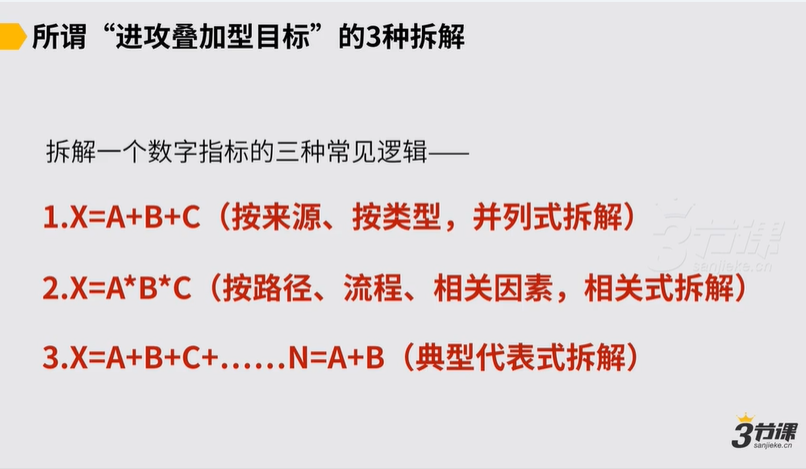

### 2.如何从战略到局部目标？

下一级的O要支持上一级的KR

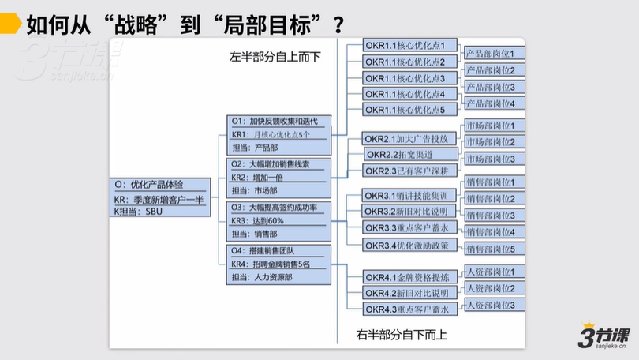

### 3.业务模型是否成型对于“局部”工作目标的影响

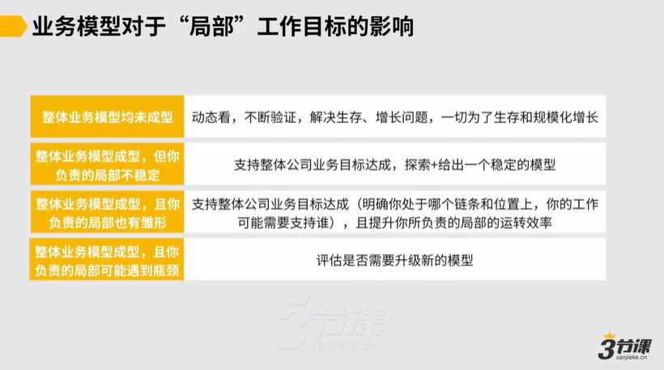

**如果你的目标已经可往上对应高层战略目标，且跟上级达成共识，那约率会是一个好目标。**

## **2.确保目标清晰、可被衡量**

身处局部战场，可能遇到4类目标

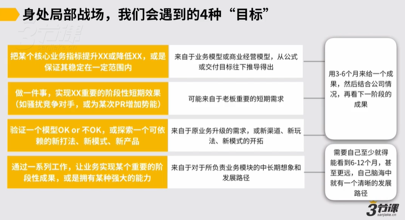

### **2.1.把某个核心业务指标提升XX或降低XX**

梳理清楚业务模型，按照增长公式和收入公式拆解

### **2.2.做一件事，实现短期重要目标**

这类目标一定要想明白：最后我们需要达成什么效果，如何衡量？

要达成什么效果，可以问上级。但是“怎么衡量”问题就不要问上级，而是拿一些选项让上级选择。

如：上级要融资，需要你去做PR。

那么，你需要向上级问清楚，想达到什么效果？

如果上级，想根据下半年市场情况那一轮融资。

随后就要自己推演，这次PR是需要面对投资人做PR，再进一步推演，要面对投资人做PR，行业里有几个渠道，有几个渠道会更好。

再继续推演：面向种赛道的什么样的投资人做PR？怎么才算是“好”？

最终拿着衡量工作成果的逻辑去跟上级达成共识之后，再去做。

### **2.3.验证一个模型OK还是不OK，或者探索新的打法、模式、产品**

一定要明白：如何评估模型有没有探索成功？

一般的“成功”和“跑通”，都需要稳定“可复制”、“可规模化”

### **2.4.通过一系列工作，让业务实现某个重要的阶段性成果或拥有某种强大的能力**

这要求我们要有长期的想象，要能看到半年或1年甚至更久之后，我们负责的业务模块会是怎样的，最终分成几个阶段去实现。

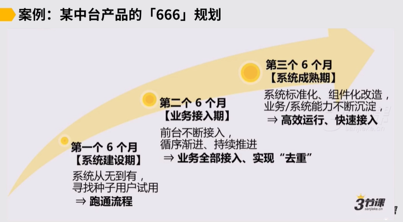

## **3.确保能与相关部门对齐，不打架**

### **业务团队下的对齐——**&#x65B9;式一

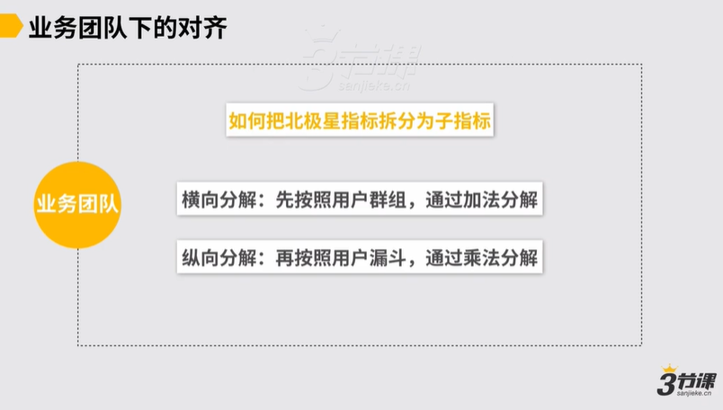

【举例1】

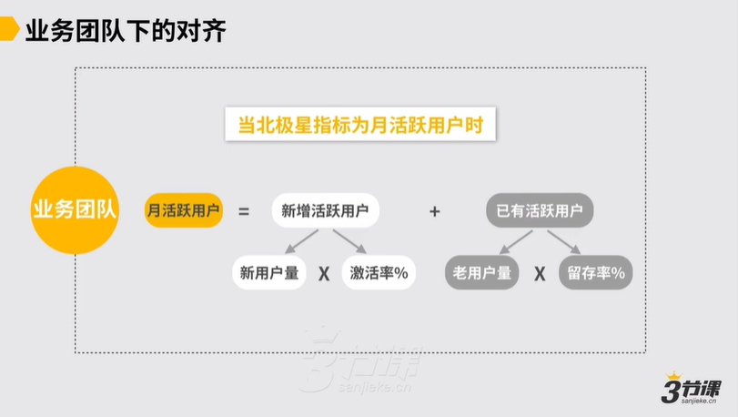

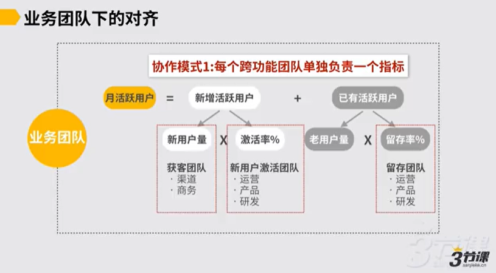

在每个团队内部，谁负责驱动，谁来背指标，其他成员共背指标。假如产品来负责激活率，运营主要是配合，那么运营的第一指标配合是否到位及时，然后才是激活率。

【举例2】

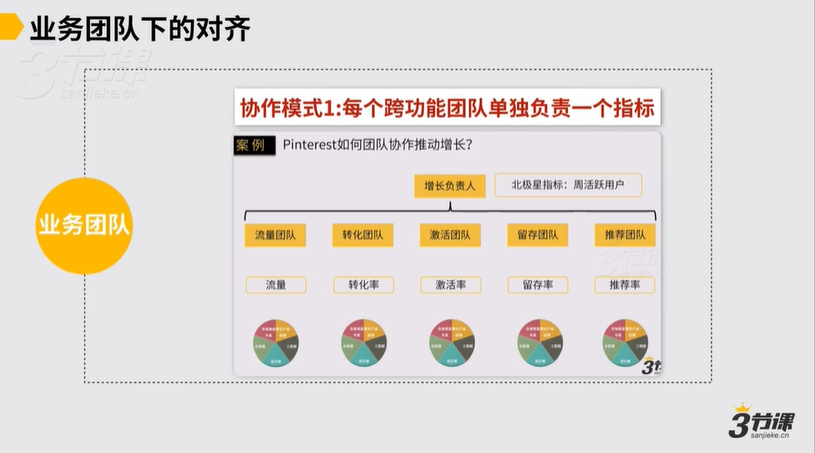

每个团队负责一个指标，每个团队内部既有产品也有运营，小团队leader背主要指标，其他成员配合为主。

### **业务团队下的对齐——**&#x65B9;式二

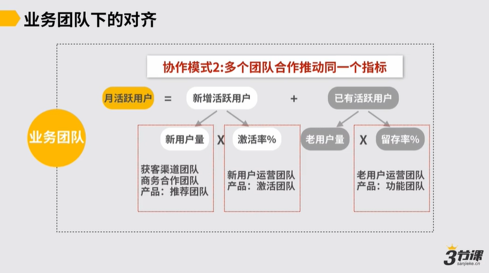

【举例】

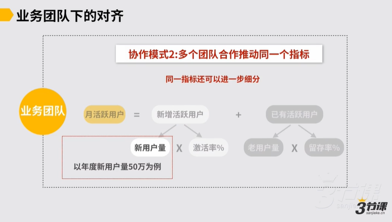

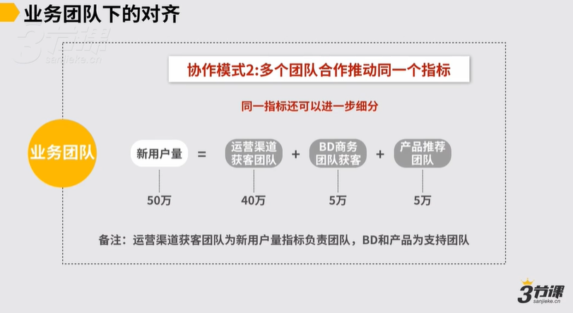

### **职能团队下的对齐**

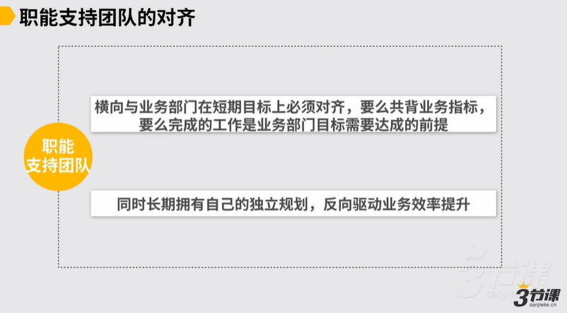

【举例】

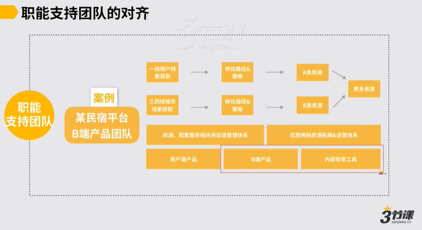

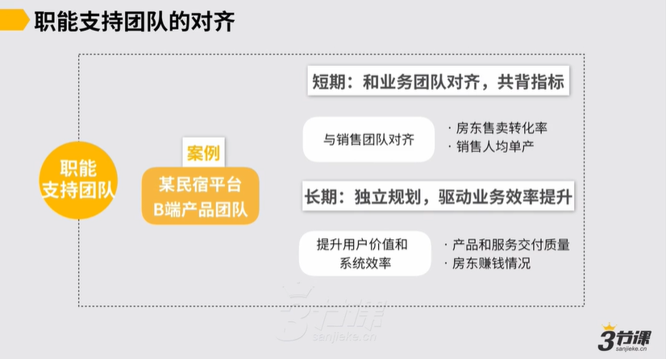

职能团队较好的状态是：短期与业务团队共背指标；同时长期要做独立规划。

比如要做一些行业调研，规划出能支持销售团队业务发展的系统模块，也对最终的支持系统有个想象，然后再拿着想象跟业务团队达成共识，做些模块能更好的支持发展。之后就可以规划版本来形成支持业务部门长期规划和发展的基本规律和诉求。
