# 02、如何把目标拆解为靠谱的行动计划

### 如何把目标拆解为靠谱的行动计划

因此，那么随后我们就进入到本章的三第三小节是如何把目标拆解为靠谱的行动计划。那就像我们的，请你做好一个局部工作或者局部部门的工作规划，核心就三部分，先明确目标，目标定因此，保证说对上能衔接住，对下是清晰的，这时候可能你的工作规划已经成功了一半了，随后十分重要的，我们要对目标做拆解

落实成我们自己的工作行动计划，或者是再分解给我们下集团队的工作行动计划，最后才是进度管理，而这里边在目标定以上之后，拆解为清晰的工作计划，是我们执行到位的一切保障。

所以随后在第三小节，也我们随后展开这节里边，我们会用较为大的篇幅跟各位讲一下，到底你有了一个明确目标之后，怎么把它落实为较为靠谱的工作计划？那么我们这一小节内容也将会分成三个段落逐次去展开。

首先第一个段落在2.1里面，我们会给各位去分享一下目标拆解为工作规划的常规逻辑。关于目标的一些拆解思路，我们在之前也多少有提到过，但是在这一小节里边我们会进一步延伸去讲，在你自己做工作规划的时候，面临很多资源的限制，比如时间、人力、钱等等，面对这些限制的时候，你该怎么去考虑它？

以及例如你的工作拆解为一些具体的规划了，它一定分成多条战线，在每一条战线上，如果考虑一些策略，你对每条战线该有些什么样的预期会更因此，这是我们本节的第一个小段落会给各位分享的内容。

在第二个小段落2.2里边，我们会给各位去讲两种工作规划落地的时候的十分规问题以及相应的应，包括说可能面临一个较为模糊较为抽象的问题，该怎么去拆解它，把它落实为具体的规划，也包括说如果上级对我们的预期是说我们的工作规划它的进度要远高于我们的竞争对手，它的速度和效率都要远高于我们竞争对手，这时候我们该怎么去思考，这是2.2里边我们会讲到的，而2.3里面我们则会给各位去展开来讲，三个不同层次的操盘手把一个较为宏大的目标逐次分解落地成详细的工作规划的这么三个实例。

就有这么三个实例，我们想再给各位去强调一些做好你的工作规划的核心注意事项，这是我们本节的内容。

## 1.目标拆解为工作规划的常规逻辑

### **1.1 完成目标达成路径的拆解**

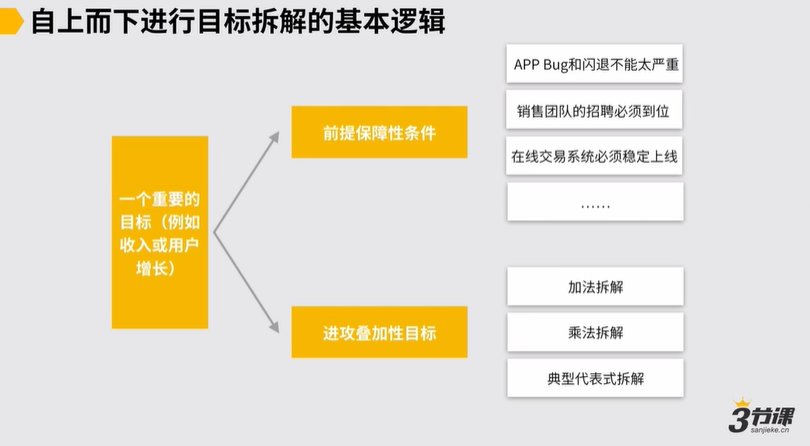

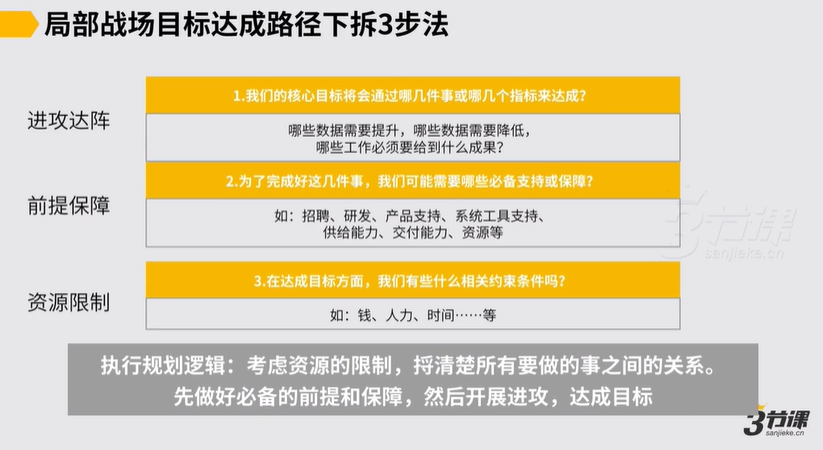

**【案例】**

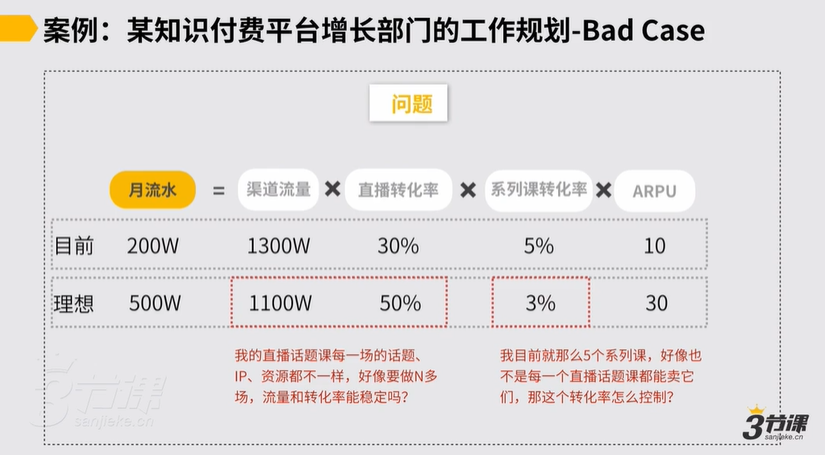

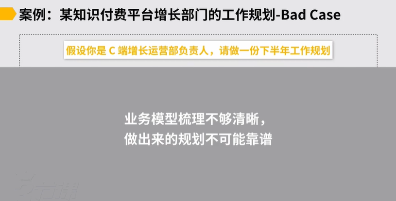

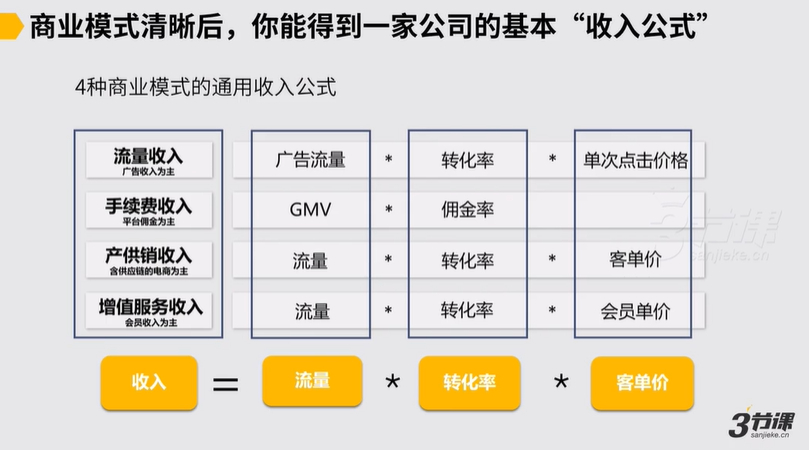

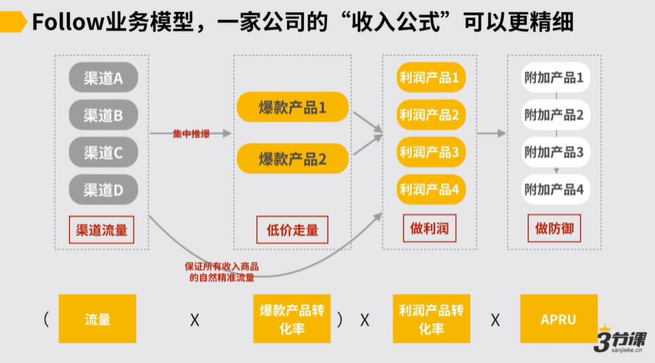

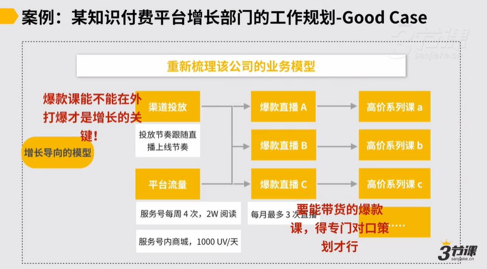

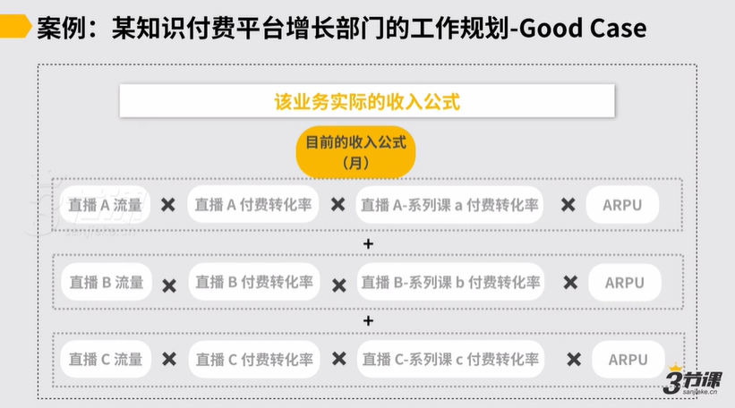

一次直播带来一波收入

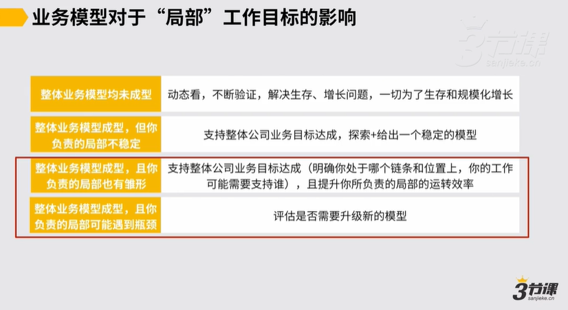

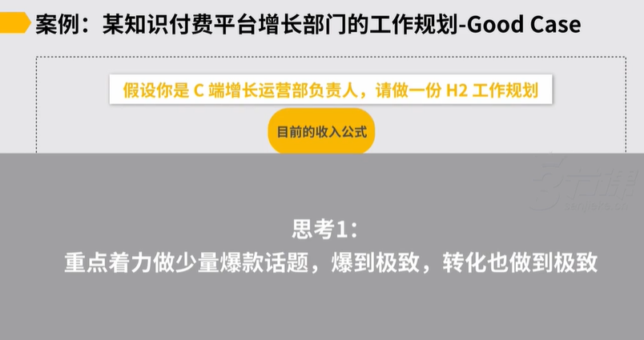

不能确保每一场都打爆👆不可持续

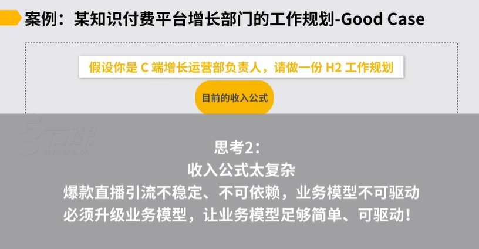

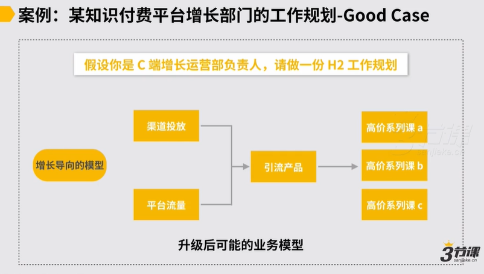

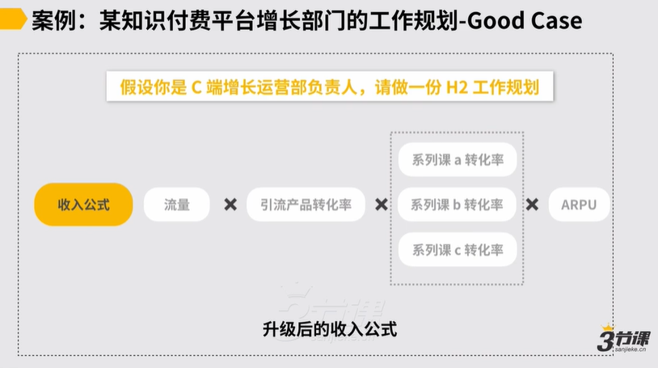

模型是更可驱动的👆

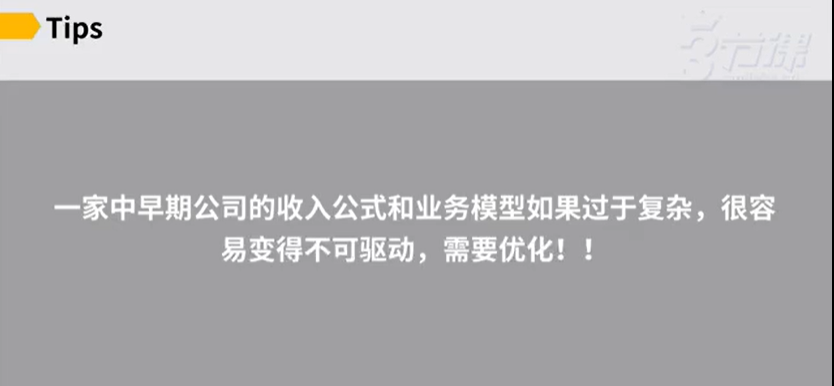

### **1.2 对各支线设定预期**

目标拆解完了，关于如何向下传递信息，让各位做好进攻达阵，通常有3种逻辑：

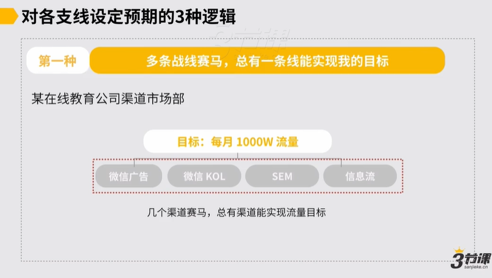

这种逻辑更适用于：不确定条战线是最适合自己的，没有确定预期👆

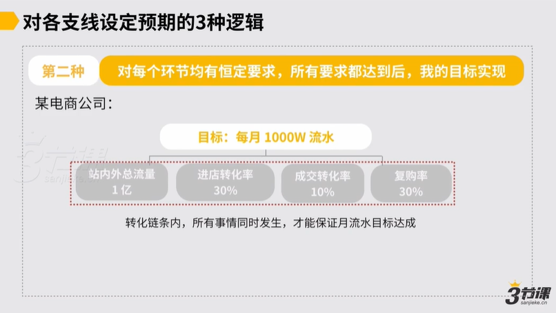

这种逻辑更适用于：对每个环节的情况有稳定预期👆

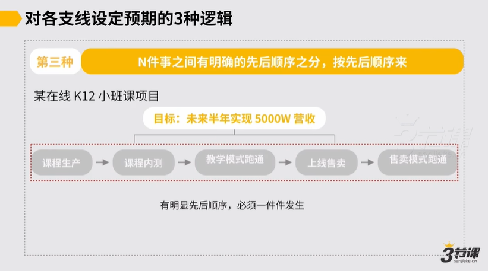

### **1.3 结合约束条件调处理目标达成路径**

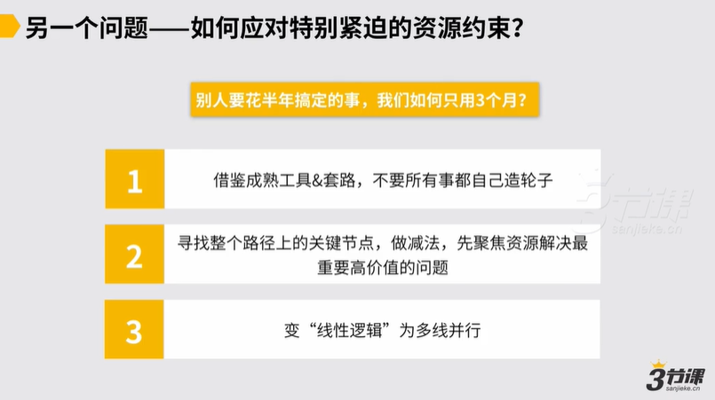

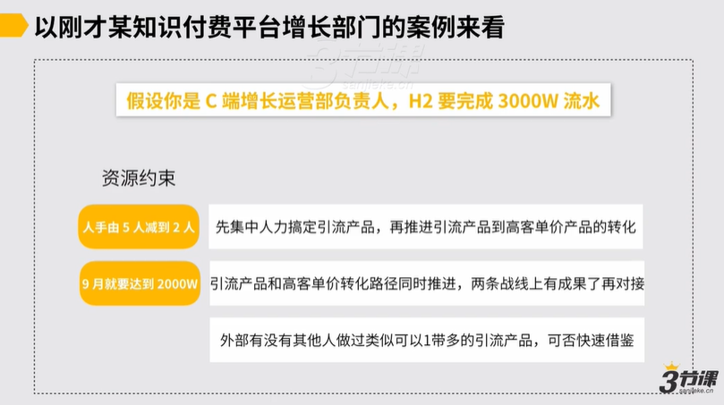

## 2.复杂、模糊、长周期的工作规划怎么做？

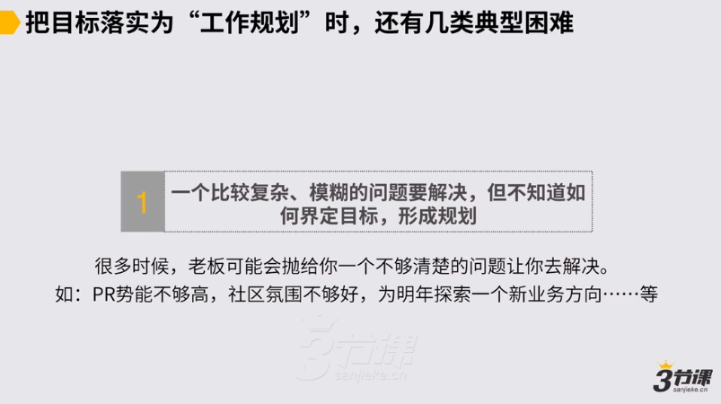

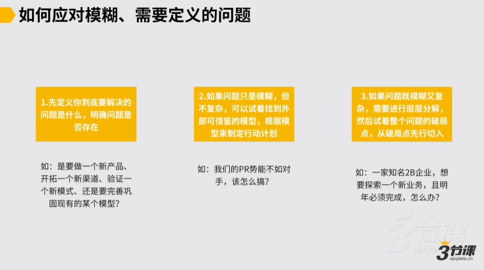

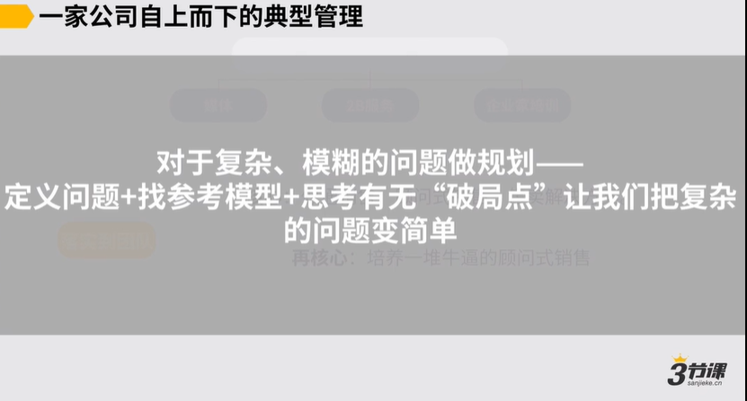

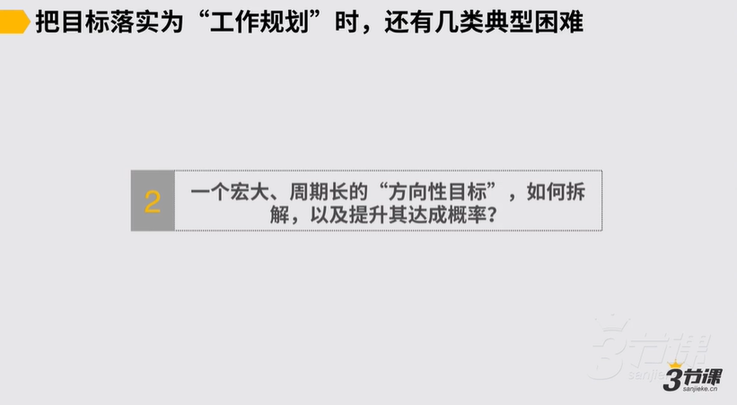

先定义→拆解为进攻叠加式目标+前提保障式目标+约束条件→量化目标，各支线的达成是否有先后顺序→有个基本路径后，找到最优实现路径

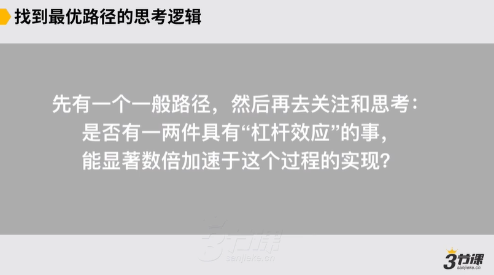

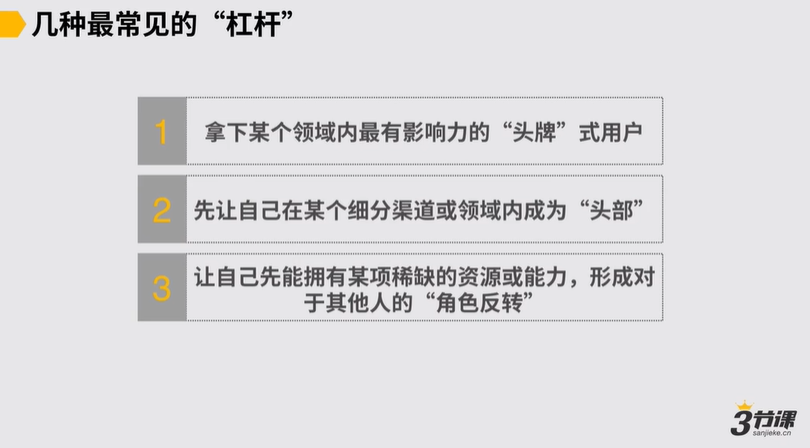

