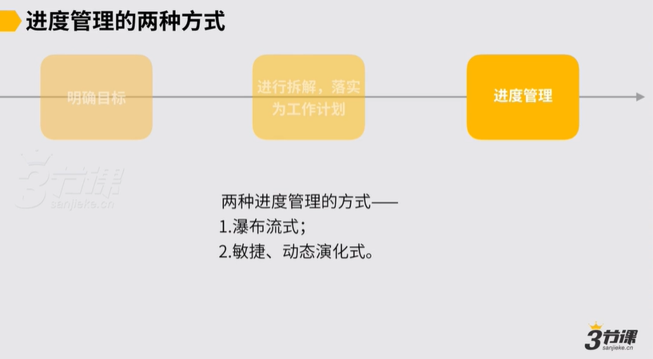
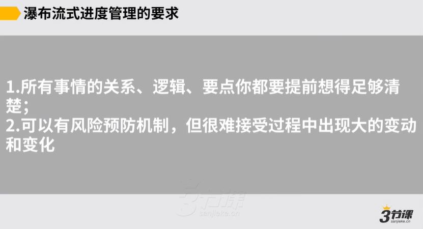
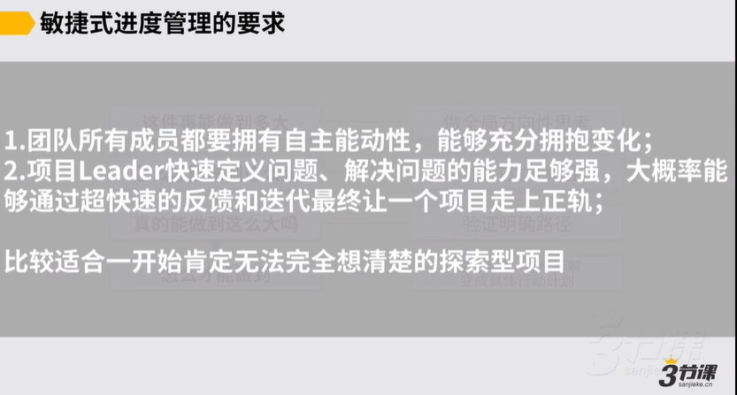

# 03、如何做好进度管理，确保计划达成

### 如何做好进度管理.mp4

以上，最后一小节快速的过一下，说如何做好进度管理部分，我们在这一章只是简单提一嘴，在后面在管理那个部分会给到一些更具体的工具。然后我们只需要简单理解一下，当我们的目标被落实为工作计划之后，我们做进度管理的方式无非就两种，一种叫做瀑布流式的这种进度管理，另外一种叫做敏捷动态演化式的项目管理。

，怎么叫做瀑布流式的项目管理简而言之，通常它说好比我们传统的软件开发，说我一定要先有个软件的概念，先做完需求分析，然后做架构设计，然后再来形成文档，再做详细设计，最后做代码，最后做测试，最后才能上线，这瀑布流式的项目管理。

瀑布流式项目管理一定是说一步接一步，一环扣一环。，这种也是我们最经常看到的项目管理的方式。瀑布流式的这种进度管理，它的要求会是要求说对于我们要干的所有事儿，我们要做的规划，所有事情的关系逻辑要点，然后我作为项目负责人，或者我作为leader都要提前想的足够清楚。

，然后这是第一个要求。

第二个要求是说在瀑布流式的项目管理里面，可有风险预防的机制，但是通常他只能做到说我做的事是a如果a出现风险，我备了一个b的解决方案，但是例如如果我的a它出的风险不是我预计风险， B的解决方案用不上了，对不起，这时候我无解。

，或者是说假设是说我的b解决方案用上去了不奏效，对不起，那有可能我也无解了。

所以它瀑布流式的进度管理，它通常是很难接受过程中出现很大的变动和变化的。所以这是第一类的进度管理的方式，一定会要求说我们提前要想的足够清楚。

，然后对于一些说我的达成路径十分明确，我过去也有过相关经验，我想的也足够清楚的这样的项目，是较为适合通过瀑布流式这样的这种强约束、强考核、强跟进的这种管理方式来去评估的。

对应的有另外一种项目管理方式叫做敏捷的这种管理方式，对敏捷的管理方式本质上是个什么逻辑本质上核心是说我们首先要先承认很多事情，我们初期就想不清楚，想不清楚怎么办，因此，我们就不要让自己说非得想清楚，我们再干就先干。

干的过程中，例如我们每天，然后敏捷有一个很经典的工作的方法和一个工作的模型，叫 Sprint。

随后 sprint，然后各位有机会就可以去网上可能去看一看，可以了解一下它核心是个什么逻辑，核心说我们团队里边说会有一个人是处理个项目的leader， leader会把我们处理个项目要做的事儿管理成一个需求池，这需求池是动态更新的，动态更新的需求会来自于上级，来自于我们自己，也会来自于用户，然后每当我们接到一个需求标，先把它丢到需求池里面去，然后我们可能以每周为单位可能去做一个阶段性的这种冲刺回顾，做完阶段性冲刺回顾之后，我们的需求池可能就更新了，所以我们是在每周都在迭代，所以我们要做的事儿到底是否这些事儿？

以及每天我们在内部开一个战会，开一个战例会，然后通过每天的战例会让各位充分的了解和同步说彼此各位各自到底都在干些什么，这是典型一个point的操作的方式。随后这张图是说我们的处理个的一个敏捷团队，它的构成和它的管理的逻辑约是怎样的，这张图我不展开一一细讲了。

要展开细讲，要讲的信息还十分的，然后有机会我觉得各位可以自行去搜索一下，或者是各位对于说 scrum东西，如果是说各位还有一些疑惑，或者说有一些兴趣想进一步了解，也许我们群里面可以再交流。

，然后处理个chrome它会有很多配套的工具，例如我们项目进度的看板之类的，然后会有一些配套工具，处理个敏捷式的进度管理，它的要求通常会稍微有些不太一样，他会要求说团队里面所有的成员都要拥有很强的自主能动性，并且各位也都能充分的拥抱变化，这是第一个要求。

第二个要求对项目leader有很强的要求，项目leader他会要求说你一定要可快速定义问题或解决问题，约率你是可通过超快速的反馈调处理和迭代，最终让一个项目走上正轨了。它的核心要求是这么两块，它会更适合初期肯定就无法完全想清楚的这种探索型的项目。，这是我们的两种做进度管理的基本方式，这两种方式。然后我们就简单提一嘴，后面有可能到管理那章节的时候，我们在一些具体落地工具上会讲得更细一些。

***

第2条，例如，A出现风险，我准备了B的解决方案，但如果A出现的风险不是预计的风险，B就用不上，或者B用上了但不奏效，这时候是无解的。所以，瀑布流式进度管理很难接受过程中出现大的变动和变化

