# 一、关于工作规划与此前N多“模型”之间的关系

## 商业模式与规划的关系

### 48 0.1 三种模型跟工作规划之间的关系.mp4

随后我们就直接进入到这一章的第一小节，关于工作规划跟此前n多模型之间的关系。在这一小节里边，我们会先回顾一下我们在之前的课程当中提到的三种模型，它到底跟我们的工作规划有什么关系，另外我们也会延伸稍微再讲一下，对于我们所希望在这门课程里边重点培养的ab类的操盘手，如果你要做好自己的工作规划，应该有的一些基础的思考逻辑和应有的心态到底应该是怎么样的？

我们就直接进入到这一章的第一个小的部分，我们在之前的几章里边先后提及到了像商业模式、业务模型、商业经营模型等等这样的一些核心的模型或者这样的一些概念，但是在之前的语境下，可能有很多的同学脑海里边虽然说跟着我们也做了很多的实践和训练，但有些人可能脑海里边还是会有些疑惑的，到底我们之前提到的这几大模型，它跟我所负责的实际的工作跟我要去做我的工作的思考和规划，到底它们之间有什么关系关系这是这一节我们要重点给各位讲的。

首先是说第一个我们讲到的商业模式对公司的商业系统里头三个模型，第一个是商业模式，对本质上商业模式它决定是什么？本质上我们之前提到4种商业模式，分别是流量广告收入，然后平台交易抽成产供销收入，还有说流量加增值服务构成收入。

我们我们讲到这4种商业模式，本质上是说每一种商业模式背后，当我的模式清晰了，我都能得到一家公司它的基本的收入公式，例如流量收入背后

它一定我的广告流量乘以点击的转化率，乘以单次点击的价格，最后构成了我这家公司它拢共的这种收入，所以回归到商业逻辑里面来去看，也许我有一部分工作是为了去提升我的单次点击的价格的，我们目标用户的这种例如付费能力更高，或者说我卡维尔住的场景，它有机会去实现的转化的概率更大，我的单次点击价格就一定会更高，它本质上是这么一个认为。

同理像下边不管是产供销收入，还像手续费收入等等，每一个模式下它都会形成一个基本的我的收入公式，反正回归到最本真和最简单的一个逻辑，最下边我们所看到的

收入它一定等于流量乘转化率，乘客单价，无非是说不同模式里边所谓对应流量对应转化率，对应客单价的部分它不一样的，例如你是一个流量收入的公司，对应到客单价部分我们提到单次点击价格，

你是增值服务的收入对应到客单价部分，肯定你会员的单价，甚至有可能如果你走的 Ltv的模型，那有可能它对应的是你说一个会员平均的LTV的值，约是这么一个认为，所以这是商业模式，它决定了什么？商业模式决定了一家公司它基本的收入公式长成一个什么样子。因此，这是第一个，有了商业模式之后，我们约能得到这么个东西。

我们提到了在一家公司里边，随后 follow商业模式往下对它一定会有所谓业务模型的部分，而业务模型本质上是说在不同的阶段它所起到的价值和作用不一样的，随着我们公司的发展，在中早期初创期的时候可能就还

但一般来讲到了a轮前后，我们的需求被验证了，市场被验证了，我们一定必须要形成我们增长方面的一个模型，要可实现规模化加上要可去算账，就我的收入或者我用户的增长，或者我处理个商业价值的增长到底是怎么被算出来的，

而到了成熟期之后，我们的业务模型有出现这种变更或者是升级

包括我们的处理个业务运转效率不断得到提升，也是我们之前讲到的东西，所以following东西我们又提到了说在一家公司里边，它处理个全局的一个模型约会有这三块来构成。

第一块是商业价值产生的路径，也就我们所讲的增长导向的业务模型，这么个东西。第二块是我们生产供给交付的保障体系。第三块是我们最下边的一些基础工具和效率提升的一些系统，对约是这么三块，构成了一家公司处理体完处理的一个这种业务模型。

这三个模型里边它的先后的顺序是怎样的？它先后顺序一定是说我们要梳理一家公司业务模型，一定要先把这家公司增长导向的业务模型要梳理出来，梳理完了之后，我们生产供给交付保障的这些部分，它通常是对应到我们处理个增长导向业务模型当中的某一个环节或某几个环节里边去支持它更好的运转的。

要么例如我们的生产的体系对是说我们业务模型增长的一个基础前提，要么例如我们像这种供应链的这样一种体系，它可能直接跟我们的增长可能也会是这种强关联在一起的，我们供应链它运转的效率可能足够高，也许我们在增长上面我们的空间和效率也就会变得更大，约是这么一个认为，所以这三层东西我们一定是自上往下去梳理，它才会更加的明确和清晰。

如果我要看清楚一家公司处理个的业务到底长什么样，约是这样，先把增长导向业务模型梳理出来，再往下梳理下边两个东西。

以上，梳理完了之后，我们有可能例如会得到这样的一个这种业务模型，对这我们也是在前边第二章第一章里头提过的某家电商公司，它的增长导向的业务模型，以及我们在第二章也有提过，说mbnb我们也简单可能去过了一遍，它可能的业务模型有长这样的，这是一个较为简单的业务模型。

以上，当我们梳理完了东西之后，他给到我们的帮助是什么？跟前面我们讲的商业模式有什么关系十分之简单。如果我们的业务模型增长导向模型梳理清楚了，一家公司的收入公式在我们手中就会把它变得更加的精细，例如拿我们梳理出来的这家电商公司的它的处理个业务模型来，它的收入公式是怎样的？

简而言之，follow于处理个的业务模型，我们约就能看到它处理个的收入公式基本就等于说流量乘以我们爆款产品的转化率，再然后爆款产品还是给我们利润产品引流的，所以乘以我们爆款产品的转化率之后，会得到一个基本的订单，订单再往下会再乘以我们利润产品的转化率，然后最终会乘以我们的APP，约它的收入模型，它的收入公式约就这么一个公式，当然这当中它一定可以被拆的更细，比如在业务模型上你一定可以看到我们的渠道， ABCD这是它的流量可以各自来算的

然后假设甚至说当中说a和b这两个渠道，重点是给我们的爆款产品一引流的，c和d是给爆款产品二引流的，

我们这两个引擎也可以分别拿出来去看了，它是这么一个逻辑，所以当我们的业务模型梳理得足够清晰了，你发现我们通常在我们手中就会拎出来一个我这家公司它更加精细的一个这种收入公式，这块约是这么一个这种认为，包括这里面最终我这家公司的收入一定可以在拆分到我的利润产品1234这上面去看，至于附加产品那个部分可能倒还因此，附加产品那个部分我们基本就不用单独算了，我们通常就把它当做一个处理体的APP来去看。

但这里边我处理体的APP到底是主要是由说利润产品1+2+3构成的，还是1+3+4构成的，这里边我们要去再做进一步的分析，约是这么一个逻辑，所以有了这么一个公式之后，请你去拆解这家公司它处理体的业务和它的商业价值的增长，你会发现你有个抓手了，这是我们业务模型真正的意义，包括说很大程度上业务模型梳理清晰，加我们收入公式更加精细的成型之后，也会影响到一家公司它的组织结构和职能的划分。

，我举个例子，比如在我们刚才所梳理出来的这么一个这种业务模型里边，一定毫无疑问是说在流量这端我有个小的团队在管，而且流量这端有分渠道，有几个人分别把这几个渠道可能给分走

在爆款产品这一端，我一定有一个爆款产品的运营的团队，他重点要关注的是爆款产品的选品跟我流量渠道的对接，重点关注的是我爆款产品的前端的转化和后端的转化，前端就在渠道推出去之后，它销售的转化后端是向各个利润产品的这种转化，中间还需要去订一套这种转化的策略。

例如10用户分别买了我的爆款产品，一最后我怎么把这10用户一点一点往我的利润产品123这三个产品去做往下的分发

我得有一套逻辑的，包括这里边如果是说我有两种不同的转化的方式和手段，两种方式和手段，有可能我又需要分别有人去看，它本质上是这么一个逻辑，所以业务模型梳理清楚，收购公司也成型之后，一家公司的组织结构职能划分，我们约是可以通过它业务模型来去理解的。

包括可再看一个例子，例如某跨境电商网站，它的指标体系是这样的一个认为，首先它一定是核心看GM v它的gmv可能又被拆成了说新用户带的gmv和老用户带的gmv新用户带来的gmv它是怎么算的？它计算的是说等于我的新用户数量乘以付费转化率乘以客单价，新用户的数量，他又拆成说日均访问数和注册转化率。

，然后老用户带的GM v是等于说所有已购的用户数乘以这些用户的，例如月均的活跃率，再乘以它的月均购买转化再乘以客单价，约是这么一个认为，当他的收入公式被拆成这样的一个这种认为之后，你发现它的分工也许就可以这么来去分，例如他的新用户的数量，从新用户的访问到新用户的注册转化，都由他的营销团队来去负责，这第一个团队。

然后第二个团队是运营团队，运营团队核心做什么？运营团队简而言之，就在站内每个月可能我就做一些这种活动对打折促销之类的，反正让站内我用户的付费转化率能得到提升，所以运营团队背的是我的付费转化率的这样的一个这种指标，而客单价指标是我品类管理品类运营的这样各种团队来去负责的。

再往下对老用户这边，老用户这边在付费转化率和客单价方面，都是我们刚才讲到的运营团队，品类运营团队对统一可以去解决这么两个问题了，但对于老用户的活跃率指标还需要有个部门来关注，所以我们在老用户这边会有个会员的部门，专门就针对说我们已购买的这种老用户做了一套会员的体系，针对这套体系最终核心指向的就提升我老用户的这种活跃率，所以这是我们讲到的第二个模型业务模型，业务模型梳理清楚了他能做什么，它能让我们得出这家公司更加精细的商业收入的一个公式。

当然如果你做的是像交付部门或者像我们的供应链部门，这样的一些部门中间可能得再转几套逻辑，说你有一个核心收入公式，在收入公式里边必须要求你的交付对稳定在一个什么样的这种指标的区间，你的供应链要达到一个怎么样的这种吞吐量，达到一个什么样的供给的效率之类的，

中间再有一层映射关系，对约是这样的认为，所以这是我们提到第二个模型业务模型以上，第三个我们所谓的商业经营模型，商业经营模型像我们之前讲的，他是把一家公司的业务就换了一个视角来去看，他换了一个说就从纯从钱利润和组织部门的角度来去看，所以在商业经营模型层面上，像我们之前讲的，我们就会去分说部门到底在这家公司的处理体的这种营收结构当中，它是属于成本中心还是属于利润中心，

我们就会这么来去分，拢共这么着分完之后，就像我们讲的成本中心可能说更多的时候反而会关注效率和基础保障会多一些，利润中心一定是说关注的说它带来多少收入对所以在一家公司里边，我们拢共按照刚才说的三个逻辑，把一家公司的业务处理体去梳理一遍之后，通常我们所处的团队处在一个什么位置，处在处理个业务链条的什么位置，包括我们所处团队到底属于成本中心还是利润中心，基本就清晰了。

清晰完了之后，我们团队就会背上指标，按我们之前说的对就会有两类指标，一类叫业务导向的指标，另外一类叫效率导向指标，业务导向指标就一定是从什么来的？一定是从说我们到底在业务模型当中是处于个位置，我们对处理个转化链条的一部分负责，我们业务上的指标是这么着来的。

，这是业务上的指标，而效率上的指标从说所谓的我们到底是成本中心还是利润中心是从逻辑来的，所以拢共这么着梳理完了之后，它最终可推导出来说我所在部门到底在处理个公司业务当中处于什么位置，我到底应该对什么负责。，所以这也是为什么我们一直在，说业务模型这一部分处理个这门课程它的灵魂和核心，对这么多串完一遍之后，各位可能对这件事会有更深的理解。

***

从商业模式，能得到一家公司的基本“收入公式”

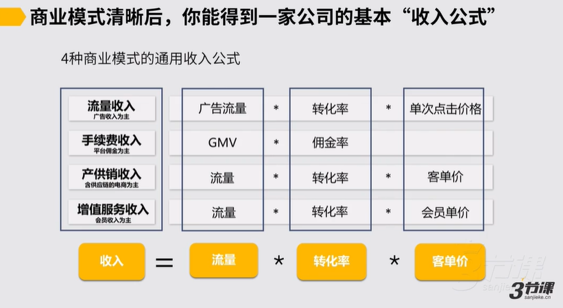

## 2.业务模型与规划的关系

从业务模型，一家公司的收入公式可以更精细

先把一家公司的业务模型梳理出来，梳理的时候一定是从增长导向的业务模型开始，从上往下梳理

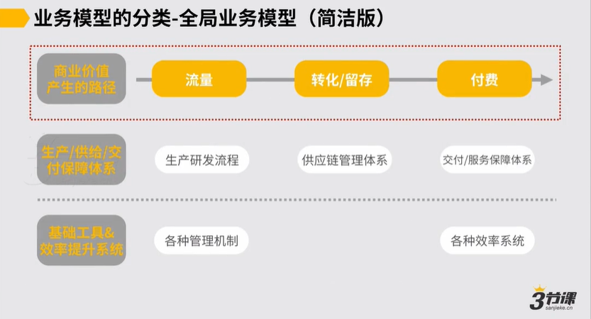

有了业务模型，收入公式可以梳理的更加精细

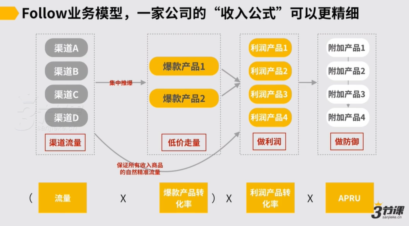

很大程度上，业务模型梳理清晰+收入公式成型后，也会影响到一家公司的组织结构和职能划分

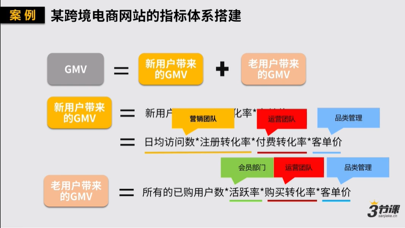

## 3.商业经营模型

从商业经营模型，主要从钱和组织部门的视角，看团队所处的位置（是利润中心还是成本中心），以及团队所负责的指标

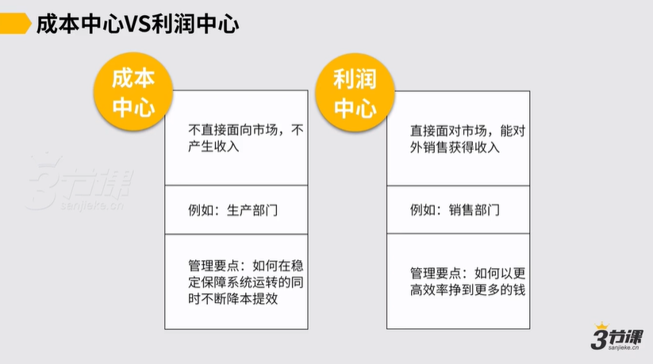

从业务角度和经营角度看不同的指标导向👇

业务指标来源于梳理业务模型过程中，为个转化链条负责

效率指标来源于是成本中心还是利润中心

### 【举例】业务模型和商业经营模型如何影响规划

**举例1：**&#x4E09;节课B端业务，怎么根据业务模型+商业经营模型制定团队目标和规划？

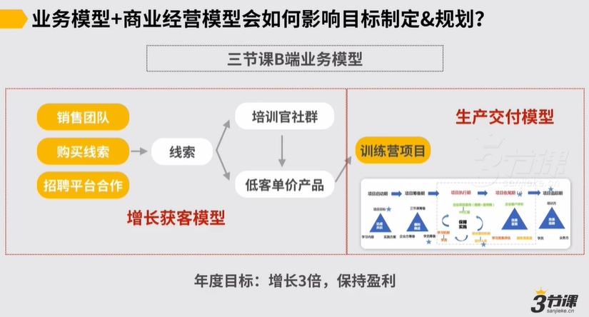

假如明年目标是实现3倍增长，并且盈利。

那怎么从两种模型分别来拆指标。

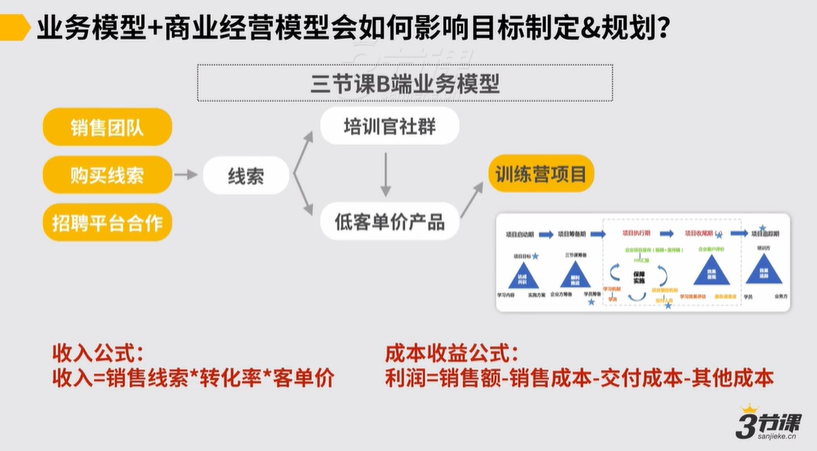

实现3倍增长，要回归到业务模型的收入公式来思考。应该提升线索量？提升转化率？提升客单价？还是提升客户续费？这需要增长团队好好思考。

要保持盈利，就要回归到商业经营模型来思考。那么提升保持盈利的成本结构是怎样的？有无机会支持客单价提升？如何在保证交付稳定的情况下提升效率？团队处在利润中心还是成本中心？这是交付团队需要好好思考的。

**举例2：**&#x67D0;电商公司，年度目标是要实现3倍增长，如何实现？

第一步：先画出业务模型

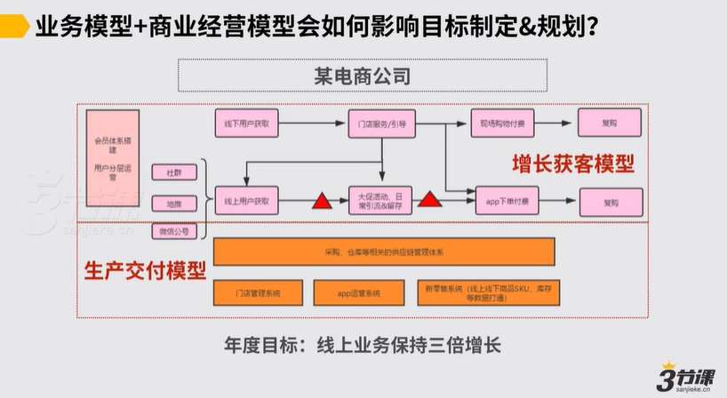

第二步：列出收入公式和成本收益公式

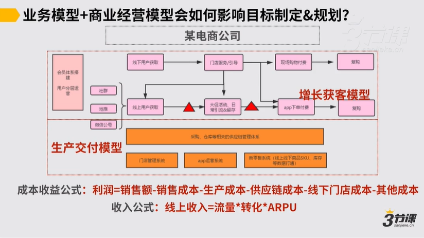

第三步：在增长导向业务模型下，思考如何实现3倍增长的目标

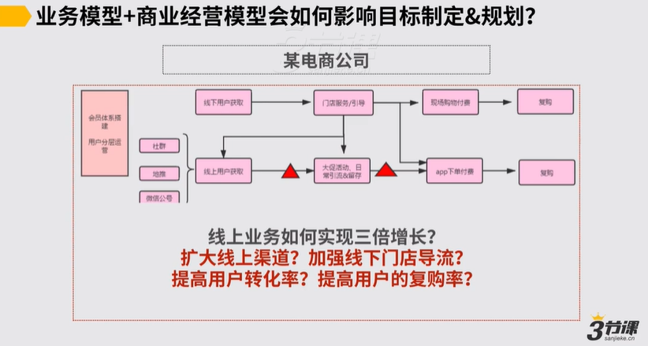

第四步：在交付模型下，思考如何实现3倍增长的目标

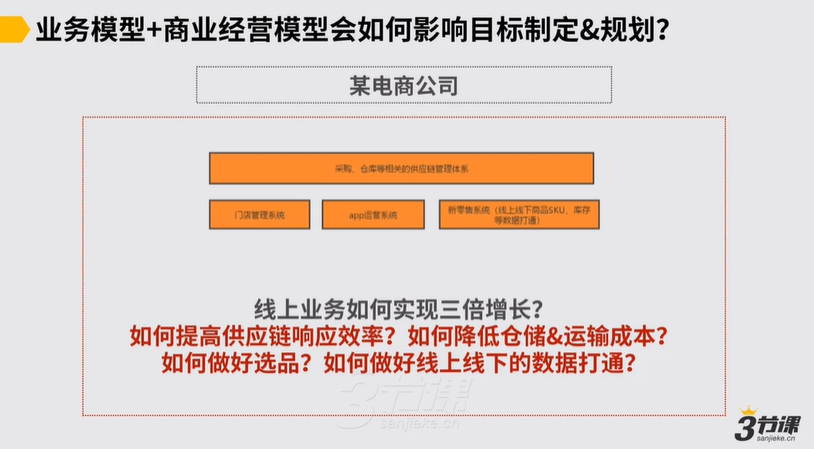

**举例3：**&#x67D0;K12教育公司的年度目标：GMV如何提升50%，ROI如何提升15%？

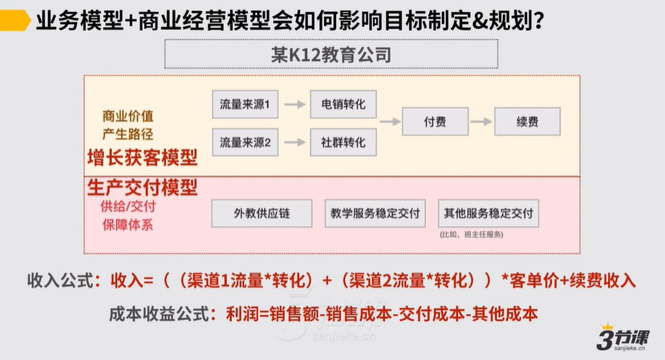

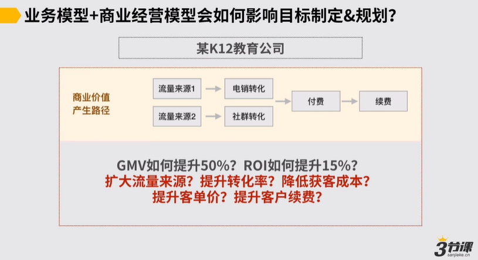

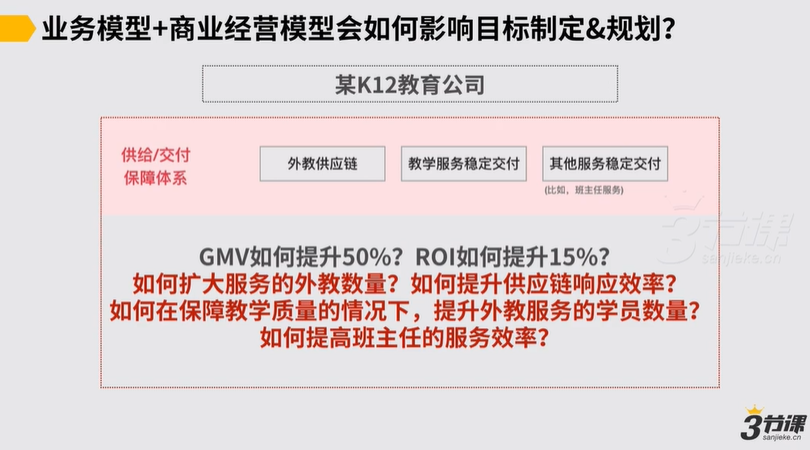

在分析的时候，要分别从增长导向的业务模型和交付保障业务模型分别分析：如何增长？如何盈利？只是前者更多考虑的是如何提升环节转化率，后者更多从钱的角度降本提效（灰色字代表自己的思考）

## 4.北极星指标的意义

当一家公司追求长期发展时，为了兼顾商业价值和用户价值，一个好的北极星指标可让各位拧成一股绳，也能避免虚假繁荣。但中间可能存在某个阶段处于生死存亡，情况有所不同

在跨部门协作之间，各位要能找到一些兼顾两方面需求和约束条件的指标，才能让彼此的合作更顺畅。北极星指标定的因此，可让不同的部门之间的协调和沟通效率更高。

## 5.总结

身在局部，如何做好自己所负责业务的工作规划？

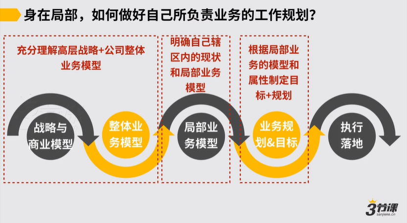

**实际，在成熟公司内制定目标和规划时，要问的问题：**

1.所处的局部业务模型是成型的吗？

2.你所负责的局部业务模型需要发生变化吗？

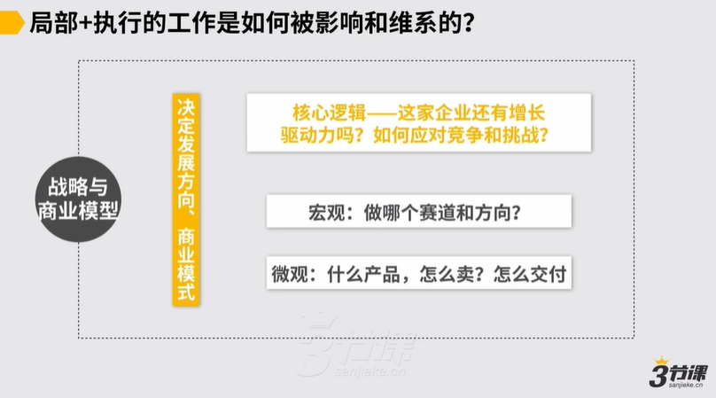

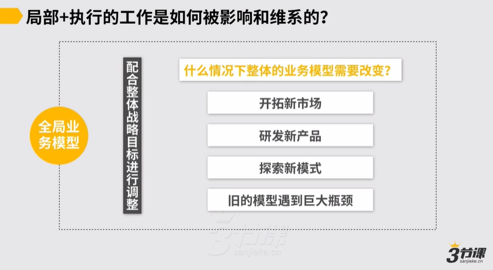

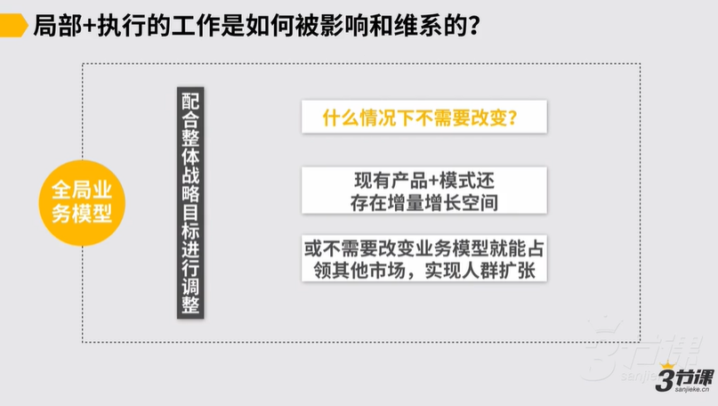

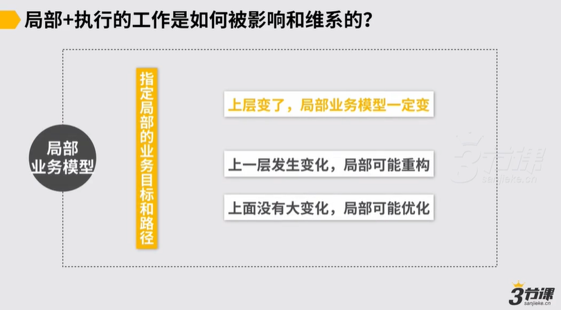

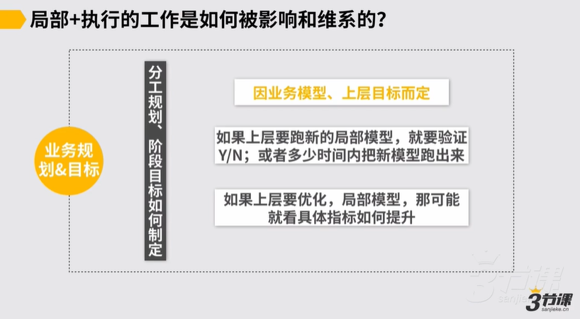

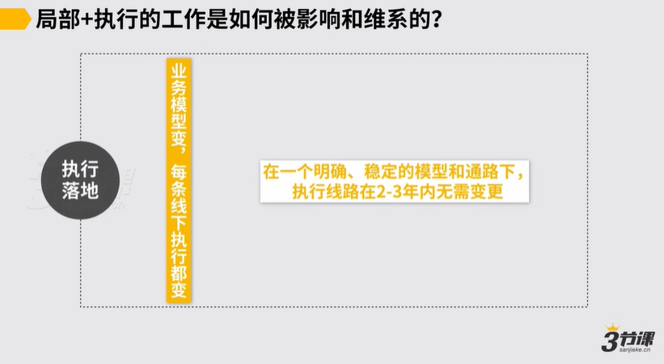

**总结：**

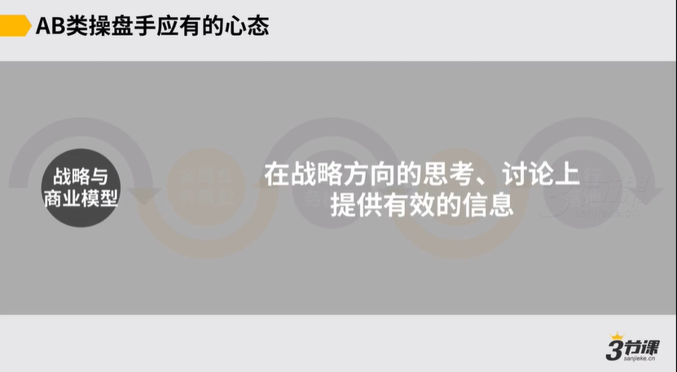

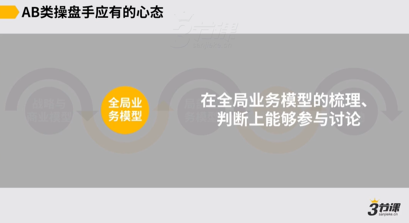

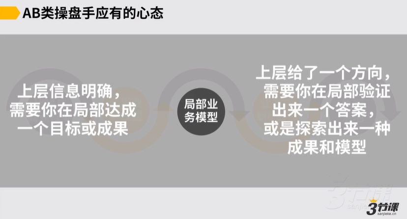

业务模型对于“局部”工作目标的影响

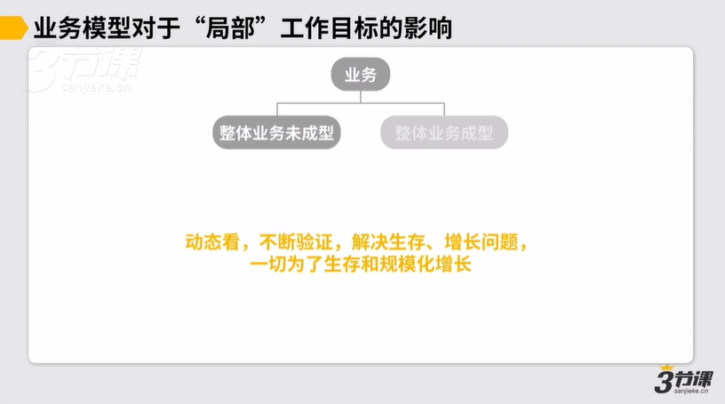

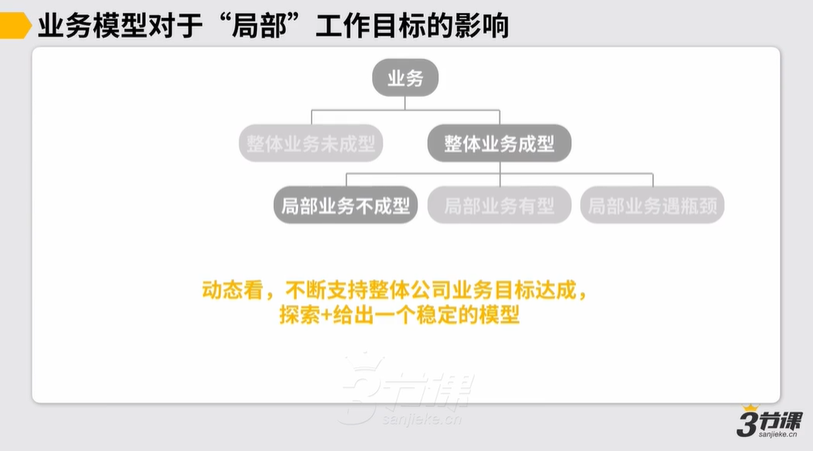

成型指的是有了明确的收入公式了，至少流量和收入是可被驱动的。

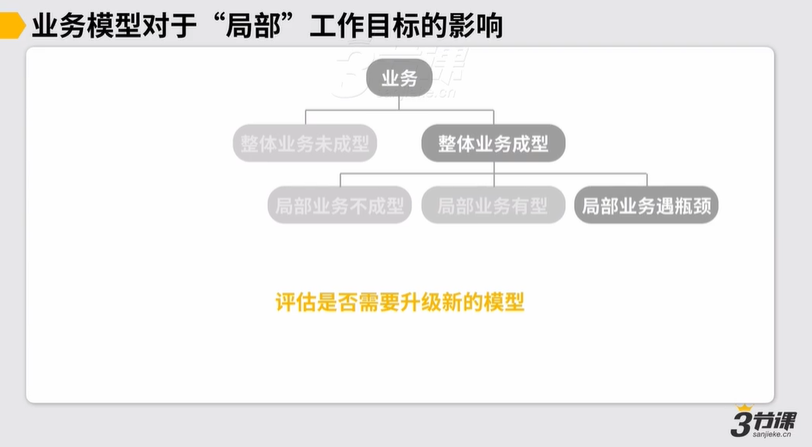

**制定工作计划的逻辑：作为操盘手，要保持把所有信息都回归到“模型”的习惯！**

