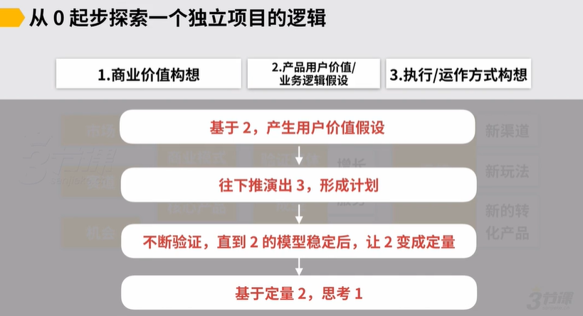
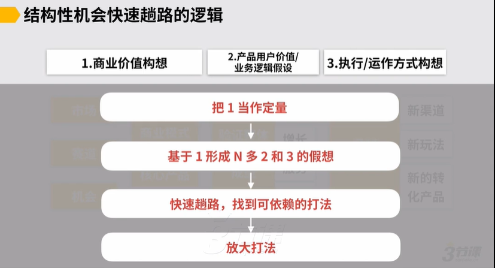
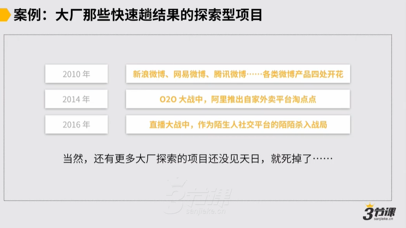
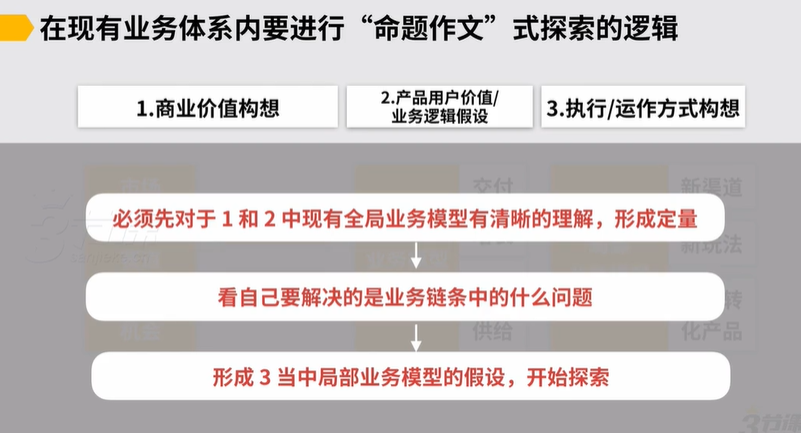
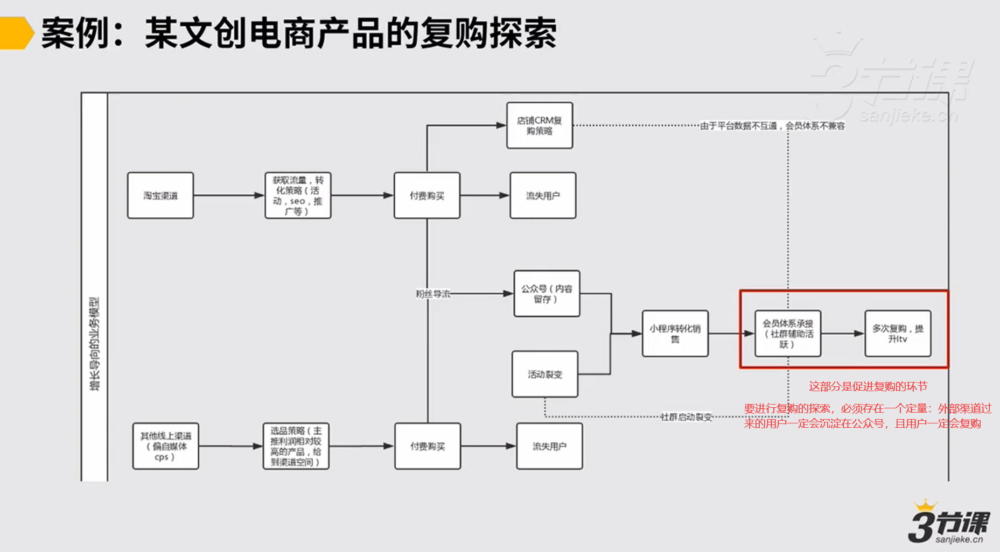
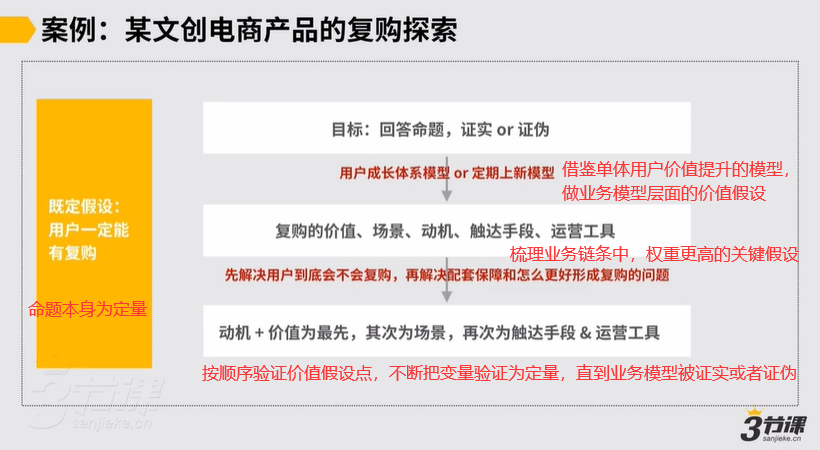
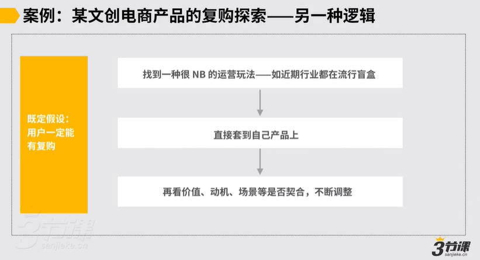
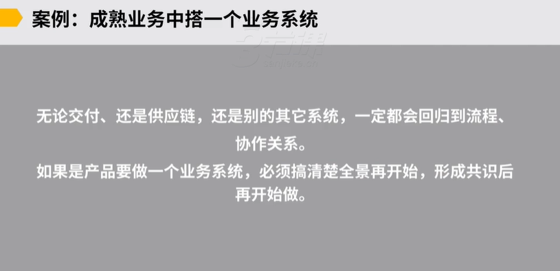

# 02、如何应对3类常见的探索型项目

### 如何应对三类常见的探索型项目

以上，随后我们的第二小节。然后第二小节我们会讲如何应对三类常见的探索型项目。首先我们还是简单回顾一下，商业探索里边我们前边开篇就讲了，然后本质上是要分别针对这三个层次的问题要有一个构想，对最终我们在商业领域里边这家公司要做一个探索，最终一定要描绘出来一个完处理的商业故事，我们在开篇的时候就讲到了，但是这里边会存在不同公司不同类型的探索性项目。

上述这三者，我们的商业价值构想，产品物价值和业务逻辑的假设和执行运作方式构想，这三者之间的关系有不太一样。以上，到底怎么个不一样法，所以这就引出来我们在工作当中会经常遇到三类常见的探索型项目，这三类，第一类是叫做从零起步做一个独立项目，这时候我们往往要先建立用户价值，再慢慢考虑商业价值，这是第一类。

第二类是说我们在商业角度上先发现了一个结构性机会，必须快速趟出通路。

而第三类我们基于现有成熟的业务和商业体系下，我们要明确解决一个问题，我们是就着上级给我们的命题作文来找解法，我们分别遇到这三类的不同的账目，不同的碳水项目。这三览疹目像我们刚才讲的，它的逻辑稍微有不同，虽然说我们上一节讲到的工作的方法是一致的，但是在梳理我们更上一层我们三种的价值假设的这种关系上有所不同，我们一个个来看。

## 1.从0起步做一个独立项目

从0起步探索独立项目的思考逻辑：

先基于用户价值/业务逻辑假设，往下推演出计划，接着在两者之间不断验证，直到用户价值模型稳定，变成定量，最后基于业务模型定量去思考商业价值。

另外，判断商业价值和用户价值个更重要，需要看需求侧和供给侧个更强势。如果是供给端更强势，是可以牺牲部分用户价值；如果需求端更强势，必须有好的用户体验才能驱动，那就必须要保证好的用户价值。

## 2.结构性机会快速趟路的逻辑

个行业存在什么样的结构性机会，机会能孕育出多大体量的公司，以及时间窗口约多久，这些要当成定量。基于定量，来形成全局业务模型和局部业务模型的假想，并不断验证，形成可依赖的打法，再放大打法。

结构性机会出现在2种情况下：1.资本追风口，大量钱投进去，快速看成果。2.技术平台的发展，用户基础场景的变迁，比如社交、视频服务、移动互联网，一般兴起的顺序：工具→社交和资讯→服务和电商（需要配套设施）

## 3.基于现有业务体系进行“命题作文”式探索的逻辑

命题作文比如：供应链的效率提升10倍、获客成本降低5倍、提升复购率等等这类问题。

复购环节：会员体系的搭建，以及多次复购

复购针对的是：沉淀在公众号的首购用户

探索复购的前提：前面导流的业务模型，比如公众号持续有用户增加，持续沉淀用户，形成首购，这件事一定要是定量。如果定量不存在，那么往后做复购的环节压力就会十分大，那时候命题应该是“怎么把用户导流到公众号”，把前边的问题解决因此，才能往后去看。

上级给的命题作文：如何增加复购？

上级给的命题本身定量。即：用户一定能有复购。最后目标是通过验证，来证实或者证伪命题。在行动之前不用怀疑命题本身。

一个处理体业务从前到后的链条，你做的每一个系统都要可在其中解决一个重要的问题。

