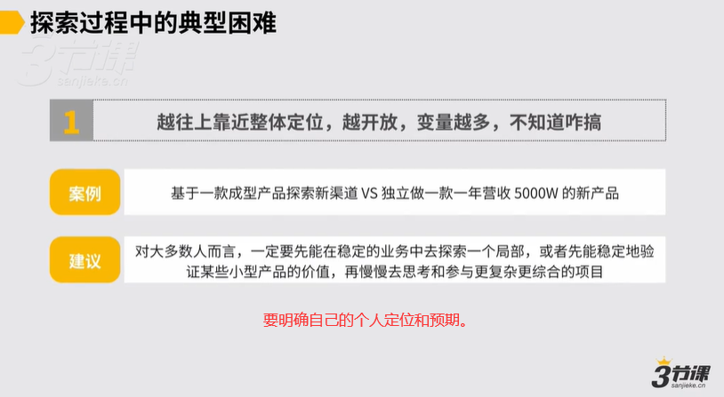
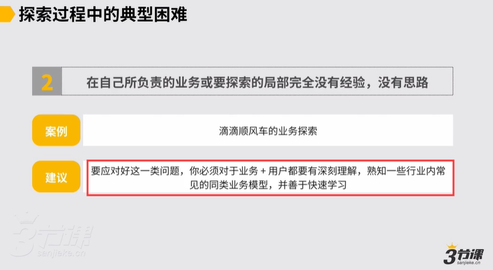
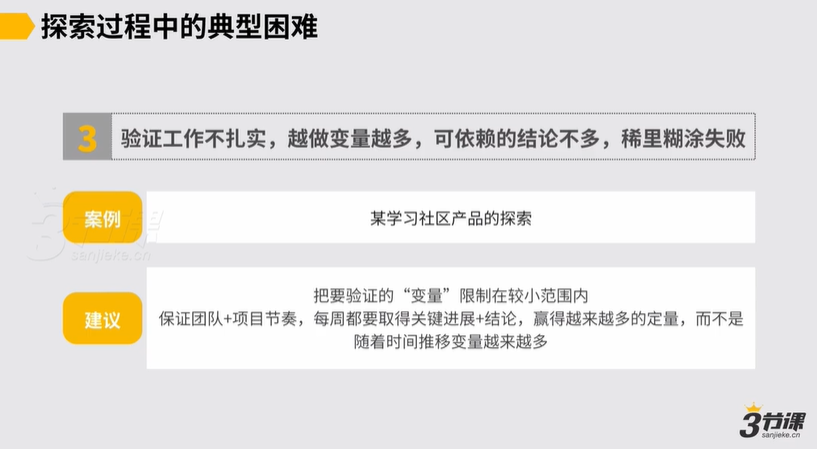
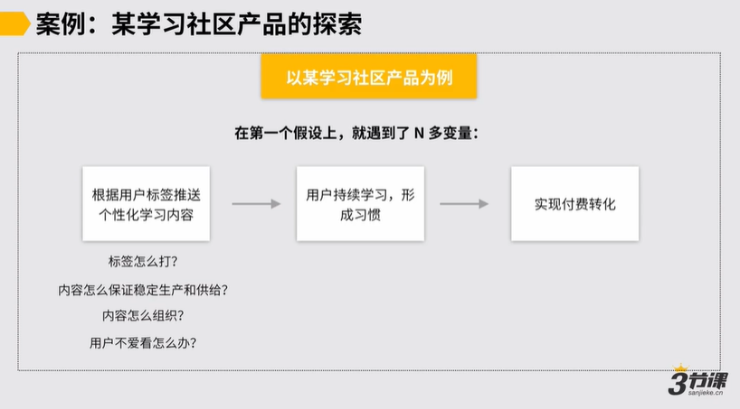
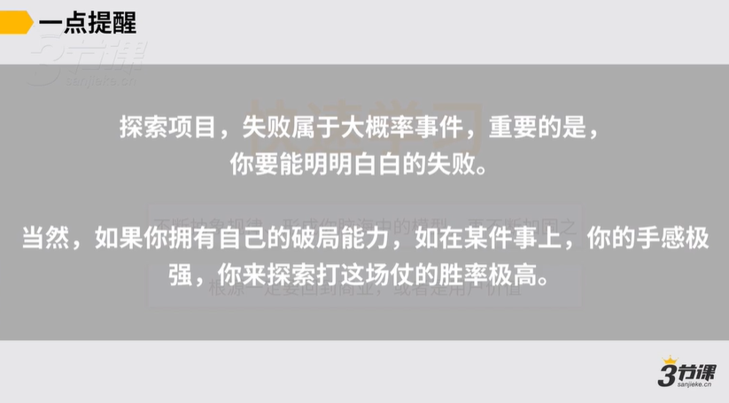

# 03、探索型项目会遇到的典型障碍

## 课程视频

**视频标题：** 探索型项目的典型困难
**课程章节：** 5.3 探索型项目会遇到的典型障碍

---

## 📋 课程导读

在商业领域探索中，最终会形成一个完整的商业故事，包括：
- 商业价值构想
- 产品用户价值与业务逻辑假设
- 执行运作方式构想

在探索项目中，会遇到**三种典型困难**，本章将逐一分析并提供应对策略。

---

## 1. 越往上靠近整体定位，越开放，变量越多

### 问题描述

当解决的问题越开放，越往上靠近整体业务逻辑的假设，甚至到商业构想层面时，变量会变得非常多。尤其在商业构想层面，比如：
- 哪个赛道下存在机会
- 机会的时间窗口有多长或多短

这些判断上的变量可能非常多，导致不知道如何推进。

### 案例1：基于成型产品探索新营销渠道

**案例背景：**
- 产品：已验证且售卖稳定的电商产品
- 原渠道：淘宝平台
- 探索目标：在抖音平台建立新的营销渠道

**案例特点：**
- ✅ 产品本身已验证且受欢迎
- ✅ 有明确的定量
- ✅ 只需探索新渠道的运营方法
- ✅ 风险相对可控

### 案例2：独立探索全新产品

**案例背景：**
- 目标：独立打造一年营收5,000万的新产品
- 命题：一年内达到5,000万营收

**未知变量：**
- ❓ 产品是什么
- ❓ 面向谁
- ❓ 产品长什么样
- ❓ 怎么生产、交付、供应
- ❓ 怎么批量营销

**案例特点：**
- ⚠️ 变量极其多
- ⚠️ 完全开放的探索
- ⚠️ 风险高

### 💡 应对建议

**对于大多数人而言：**

1. **先从局部探索开始**
   - 在稳定的业务中做好局部探索
   - 先验证某些小型产品的用户价值
   - 再慢慢参与更复杂更综合的项目

2. **合理评估自身能力**
   - 如果不具备独立负责大型项目的能力，可以如实告知上级
   - 在不适合当前阶段的项目上可以认怂
   - 认怂并不可怕，合理预期更重要

> **核心原则**：先能在稳定的业务中做好局部探索，或验证小型产品的用户价值，再参与更复杂的项目。

---



**📷 图片内容详细说明：**

这张图展示了商业探索的完整故事结构和三个层次：

**图中的三个层次（从上到下）：**

1. **顶层：商业价值构想**
   - 哪个赛道下存在机会
   - 机会的时间窗口
   - 商业规模的想象空间

2. **中层：产品用户价值与业务逻辑假设**
   - 产品能为用户创造什么价值
   - 用户的痛点和需求是什么
   - 通过什么样的业务逻辑来满足用户需求
   - 如何实现商业价值

3. **底层：执行运作方式的构想**
   - 具体的运营方式
   - 资源配置
   - 执行步骤

**关键要点：**
- 图中的箭头表示从上到下的逐层验证流程
- 越往上（顶层），变量越多，开放性越大，不确定性越高
- 越往下（底层），变量越少，可操作性越强
- 对于AB类操盘手，重点关注中层和底层
- 对于C类操盘手，需要关注全部三个层次

**案例对比：**
- 案例1（基于成型产品探索新渠道）：只需关注底层（执行运作方式）
- 案例2（独立探索全新产品）：需要关注全部三层，变量极多

---

## 2. 在自己负责的业务或要探索的局部完全没有经验和思路

### 问题描述

接到一个命题，但在自己负责的业务和要探索的局部完全没有经验，找不到可以指导的业务模型，没有思路。

### 案例：滴滴顺风车业务（2015-2016年）

**案例背景：**
- 时间：2015-2016年
- 项目：滴滴顺风车业务
- 难点：行业里找不到太多可以参照的成熟业务模型
- 状况：即使有一些小型顺风车项目，但体量不大、不够成熟

### 解决方法：跨界寻找可借鉴的业务模型

#### 第一步：形成业务基本假设

**顺风车的业务逻辑本质：**
- 供需两方撮合匹配
- 服务属性
- 可能带社交属性（不确定）

**需要的核心能力：**
1. **供给侧运营能力**：司机端的拓展和运营
2. **交易撮合能力**：供需匹配
3. **保障与品控体系**：确保服务稳定

#### 第二步：检索高度相似性的行业和业务模块

**可以借鉴的行业：**
| 行业 | 可借鉴的业务模块 |
|------|----------------|
| 出行行业 | 风险保障的业务模块 |
| 电商平台 | 交易撮合体系的业务模块 |
| 服务业 | 供应链管理的业务模块 |

**调研内容：**
- 他们的业务模型是怎样的
- 有哪些可以拿来参照的要素

#### 第三步：检索相似性问题的解决方案

**未解决的问题：**
1. **众包管理问题**
   - 顺风车的供应链不是全职员工，是众包模式
   - 在找到的几个行业中没有得到解决

2. **线下社交关系缔结问题**
   - 不确定顺风车是否会有些社交属性
   - 需要参考线下社交产品或交友活动

**可以借鉴的解决方案：**

| 问题 | 参考对象 | 可借鉴内容 |
|------|---------|-----------|
| 众包管理 | 猪八戒等威客平台 | 供给端的管理体系 |
| 线下社交关系 | 线下社交产品、交友活动 | 关系缔结的手段和方法 |

### 💡 应对建议

**前提条件：**
1. 对业务和用户有深刻理解
2. 熟知行业内常见的同类业务模型
3. 善于快速学习

**操作方法：**
1. 检索与业务具有高度相似性的行业和业务模块
2. 查看是否有可以参照的内容
3. 如果问题未完全解决，再找有相似性问题解决方案的行业
4. 找出权重最高的假设，验证它

> **核心思路**：对外找可借鉴的模型来支持思考、判断和假设。

---



**📷 图片内容详细说明：**

这张图展示了如何跨界寻找可借鉴的业务模型的三步方法论：

**第一步：检索高度相似性的行业和业务模块**

图中的左侧展示了三个可借鉴的行业：
- **出行行业** → 风险保障模块
- **电商平台** → 交易撮合体系模块
- **服务业** → 供应链管理模块

每个行业都有对应的业务模块可以参考。

**第二步：识别未解决的问题**

图中的中间部分展示了在顺风车项目中仍有未解决的问题：
- **众包管理问题**：如何管理非全职员工（众包司机）
- **线下社交关系缔结问题**：如何在陌生人之间建立社交连接

这些问题在前面找到的三个行业中没有得到解决。

**第三步：检索相似性问题的解决方案**

图中的右侧展示了解决未解决问题的参考对象：
- **众包管理** → 参考猪八戒等威客平台的供给端管理体系
- **线下社交** → 参考线下社交产品、交友活动的手段和方法

**方法论的三个层次：**

1. **行业层面**：找相似行业的业务模块
2. **问题层面**：找相似问题的解决方案
3. **逐层深入**：如果第一层没解决，就深入第二层

**关键要点：**
- 先检索相似行业和业务模块
- 再检索相似问题的解决方案
- 这是一个系统化的跨界思考方法
- 目的是找到可借鉴的模型来支持业务假设

---

## 3. 验证工作，变量越做越多

### 问题描述

探索项目比较复杂，验证工作做得不扎实，导致：
- 越做变量越多
- 可依赖的结论不多
- 最后稀里糊涂地失败

### 案例：学习社区产品的个性化推荐探索

**项目背景：**
某学习社区产品想做新产品的探索

**基本假设（业务逻辑链条）：**

```
1. 给用户打标签
   ↓
2. 根据标签推荐个性化学习内容
   ↓
3. 满足用户需求，用户持续学习形成习惯
   ↓
4. 用户留存更长
   ↓
5. 实现付费转化
```

### 遇到的问题：变量爆炸

**在第一个假设环节（根据用户标签推送个性化学习内容）遇到的变量：**

| 问题领域 | 具体问题 |
|---------|---------|
| 标签体系 | 标签怎么打？怎么打更合理、更精准？ |
| 内容生产 | 内容怎么保证稳定的生产和供给？ |
| 内容组织 | 内容到底该怎么组织？ |
| 用户反馈 | 推的内容用户不爱看怎么办？ |

**执行方式的问题：**
- 一个人负责内容的稳定生产供给（预计3-4周才能有结果）
- 一个人负责内容的组织
- 一个人负责打标签
- 一个人负责给用户推送

**最终结果：**
- 用户对推送内容不买单
- 内容生产供给没完成（原计划每周10个内容）
- 内容组织方式体验不好
- 标签打得不精准
- **项目注定走向失败**

### 💡 应对建议

#### 方法1：极致思考，明确定量和变量

**问题分析：**
这个项目本质上要验证的是：
> 假如给到用户个性化的内容，用户会不会持续看？

**验证方法：**
- 标签只是实现手段
- 内容组织也只是实现手段
- **核心是验证用户是否会持续消费内容**

**正确做法：**

1. **把变量限制在较小范围内**
   - 初期不要有多层假设嵌套
   - 只验证一个核心问题

2. **人肉方式快速验证**
   - 人肉跟一批用户沟通
   - 基于自己的认知帮用户定制化学习内容
   - 给100个用户推送内容
   - 看这100个用户会不会看

3. **根据结果调整**
   - 如果不爱看，问原因
   - 如果开始持续看了，再研究怎么打标签、怎么组织内容、怎么提效

#### 方法2：保持敏捷的工作节奏

**核心原则：**
每周都要取得关键进展和结论，赢得越来越多的定量，而不是变量。

**具体要求：**

1. **不要把战线拉得过长**
   - 不允许一个人在一条线上有3-4周的行动计划
   - 除非你当前只需要解决这一个核心问题

2. **控制长周期问题数量**
   - 如果同时要解决多个问题
   - 只能允许少量（最多1-2个）问题周期相对长
   - 剩下所有支线都要不断赢得定量，而不是制造变量

**项目节奏示例：**

| 支线任务 | 周期 | 目标 |
|---------|------|------|
| 核心验证 | 2周 | 验证用户是否会持续看内容 |
| 标签体系 | 4周 | 打出基础标签框架 |
| 内容生产 | 1周/批 | 每周稳定产出10个内容 |
| 内容组织 | 1周 | 测试不同组织方式的效果 |

> **重要提醒：** 探索项目失败属于大概率事件，80%以上的探索项目注定要失败。但重要的是**明明白白地失败**，基于明确的逻辑假设，即使失败也知道哪里想的不对，下次遇到类似问题该如何思考。

---



**📷 图片内容详细说明：**

这张图展示了三种典型的探索型项目障碍：

**障碍1：越往上靠近整体定位，越开放，变量越多**

图中展示了两个对比案例：
- **左侧案例**：基于成型产品（电商产品）探索新营销渠道（抖音）
  - 特点：产品已验证，只需探索新渠道运营方法
  - 变量：相对较少，风险可控

- **右侧案例**：独立探索全新产品（一年营收5,000万）
  - 特点：从0开始，产品、用户、营销都未知
  - 变量：产品是什么、面向谁、怎么生产、怎么营销...全部未知
  - 风险：极高

**关键提示：** 越往上靠近整体定位（商业构想层面），变量越多，越开放，不确定性越高。

---



**📷 图片内容详细说明：**

这张图展示了学习社区产品案例的业务逻辑链条和变量爆炸问题：

**业务逻辑链条（从左到右的流程）：**

```
第1步：给用户打标签
   ↓
第2步：根据标签推荐个性化学习内容
   ↓
第3步：满足用户需求，用户持续学习形成习惯
   ↓
第4步：用户留存更长
   ↓
第5步：实现付费转化
```

**在第一阶段遇到的变量（图中标注的N多变量）：**

1. **标签体系相关：**
   - 标签怎么打？
   - 怎么打更合理？
   - 怎么打更精准？

2. **内容生产相关：**
   - 内容怎么保证稳定的生产和供给？
   - 每周需要多少内容？

3. **内容组织相关：**
   - 内容到底该怎么组织？
   - 什么组织方式用户体验好？

4. **用户反馈相关：**
   - 推的内容用户不爱看怎么办？

**项目失败的路径：**

图中用X标记了失败的路径：
- 在第一阶段就遇到了N多变量
- 每个人负责一个支线（内容生产、内容组织、打标签、推送）
- 每个支线都在制造变量，而不是赢得定量
- 最终用户不买单，项目注定失败

**关键教训：**
- 千万不要一开始就有很多层的假设嵌套
- 把要验证的变量限制在较小范围内
- 初期可以用人肉方式快速验证核心假设

---

## 📝 知识要点总结

### 三种典型障碍

| 障碍类型 | 核心问题 | 应对策略 |
|---------|---------|---------|
| **变量过多** | 越往上靠近整体定位，变量越多，不知道怎么推进 | 先在稳定业务中做好局部探索，再参与复杂项目 |
| **无经验无思路** | 在负责的业务或要探索的局部完全没有经验 | 跨界寻找可借鉴的业务模型 |
| **变量越做越多** | 验证工作不扎实，变量越来越多，结论不多 | 极限思考+保持敏捷节奏 |

### 核心概念

1. **价值假设**
   - 业务模型层面的价值假设
   - 业务链条中的所有价值假设点
   - 权重更高的关键假设

2. **定量和变量**
   - 定量：已确定、可依赖的要素
   - 变量：未确定、需要验证的要素
   - 目标：赢得越来越多定量，而非变量

3. **跨界借鉴**
   - 检索高度相似性的行业
   - 找可参照的业务模块
   - 找相似性问题的解决方案

### 关键原则

#### 原则1：循序渐进
> 先能在稳定的业务当中去做好一个局部的探索，或者是先能稳定的验证某些小型产品的用户价值，然后再慢慢去思考和参与更复杂更综合的项目。

#### 原则2：跨界借鉴
> 遇到没有经验的领域，对外去找可借鉴的模型来支持你来做思考，来做判断来去做假设。

#### 原则3：控制变量
> 千万不要一开始就有很多层的假设嵌套，把要验证的"变量"限制在较小范围内。

#### 原则4：保持敏捷
> 每周都要取得关键的进展和结论，要让我们整个的探索的过程中逐渐地保持这么一种节奏。

#### 原则5：明明白白失败
> 80%以上的探索项目注定要失败，但是重要的是你一定要能够明明白白的失败，一定要能够基于一个明确的逻辑假设。

### 实践建议

1. **合理评估能力**
   - 不具备能力时可以如实告知
   - 在不适合的项目上可以认怂
   - 认怂并不可怕

2. **快速验证假设**
   - 人肉方式快速测试
   - 小范围验证（100个用户）
   - 根据结果快速调整

3. **保持项目节奏**
   - 每周取得关键进展
   - 控制长周期问题数量（最多1-2个）
   - 支线任务要赢得定量

4. **建立破局能力**
   - 拥有某些关键破局能力
   - 比如文案销售转化能力强
   - 可以提高探索项目的成功概率

---



**📷 图片内容详细说明：**

这张图总结了如何应对变量越来越多的困境的两大方法：

**方法1：极致思考，明确定量和变量**

图中左侧展示了两个关键点：

1. **明确定量和变量**
   - 定量：已确定、可依赖的要素
   - 变量：未确定、需要验证的要素
   - 不能让一个阶段里有太多变量

2. **把变量限制在较小范围内**
   - 千万不要一开始就有多层假设嵌套
   - 把要验证的"变量"限制在较小范围内

**案例说明：**
- 核心验证：用户是否会持续看个性化内容
- 实现手段：标签、内容组织（这些只是手段）
- 初期验证方式：人肉沟通，给100个用户推送内容

**方法2：保持敏捷的工作节奏**

图中右侧展示了项目节奏的要求：

1. **每周都要取得关键进展和结论**
   - 在很多支线上都要有明确进展
   - 要赢得越来越多的定量，而不是变量

2. **不要把战线拉得过长**
   - 不允许一个人在一条线上有3-4周的行动计划
   - 如果是探索项目，周期太长是不对的

3. **控制长周期问题数量**
   - 同时解决多个问题时，只能允许少量（最多1-2个）问题周期相对长
   - 剩下所有支线都要不断赢得定量

**项目的正确节奏：**
- 每周都有进展和结论
- 定量越来越多
- 变量越来越少
- 最终业务模型成立或被证伪

**关键数据对比：**
| 错误做法 | 正确做法 |
|---------|---------|
| 3-4周才能有结果 | 每周都有进展 |
| 变量越做越多 | 定量越来越多 |
| 所有支线都在制造变量 | 支线赢得定量 |

---

**课程：** 5.3 探索型项目会遇到的典型障碍
**主题：** 业务操盘手养成计划 - 第五章
**处理时间：** 2026-02-06
**图片说明：** 已添加详细的图片内容描述，便于AI读取和理解图片信息
