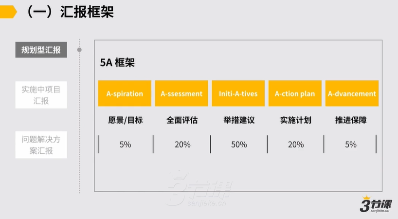
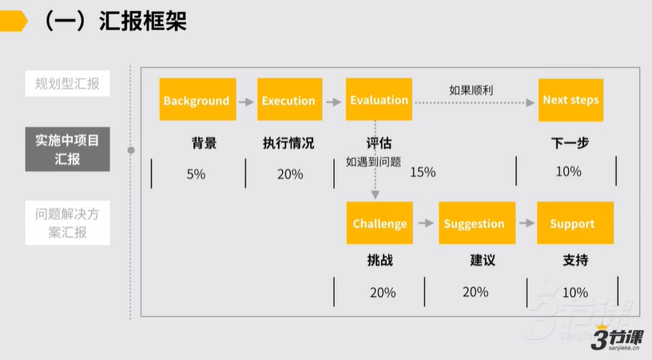
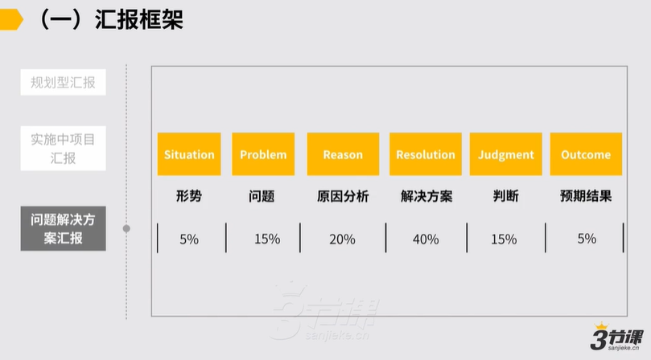

# 2.1.汇报框架

### 汇报模板：

<https://shimo.im/docs/w6CKG38vH6y9t6pw/read>

***

### 2.1 汇报框架

首先先说第一个部分，就我们向上汇报的一个框架，对部分并不复杂，我们快速的过一下。首先向上汇报，我们把它在部分我们给各位三个模板，这三个模板分别对应是三类场景，第一类场景说我要就某个问题，然后我有个规划，然后我就规划给我的上级来做汇报，对然后这是第一种汇报的场景。

第二种是说我已经有个计划了，对计划进展到了一半，然后随后是说在进展的过程中，我要跟我的上级去做一个说我的进度的这种同步和汇报，对这部分又有一个小的这种汇报的模板。

对最后是说我遇到了一些问题，然后我可能在推进过程中我遇到了一些问题，那就这些问题到底该怎么解决，我需要什么支持，我也需要向上级做一个汇报，包括争取到一些资源，这时候又有一个小的汇报模板，对约是这样的。

然后我们依次来看，首先是对于说规划型的这样的这种汇报，我说现在不管是说我的部门，我要去做我未来半年未来一年的这样的一种规划了，还是说上级有个问题我分析了一下，我最终给他一个说问题我要怎么来解决，我的规划是怎样这样一个汇报，这里边有一个5a框架。

，然后5a框架是什么？首先它是分为把汇报分成这样5部分，然后5部分里边从你向上来做汇报来，每个部分你的汇报里头时间占比我们也有个基本的建议。

，然后如果你是要做1规划型的汇报，理论上是说我们有5部分，首先是愿景和目标expectation，然后研究目标部分在你的汇报里边时间占比我们建议是说不要十分长，但是要有我们到底在这么一件事下，我们要解决一个什么问题，它的目标是啥？

解决完了之后我们的愿景是什么对约是这样的，以及对于这件事我们要有一个全面的评估，说通常我们要解决这件事儿，然后他所有的这种背景重点难点是怎样的，

我们要个全面的评估部分占比时长20%，然后再往下是我的具体的举措和建议，就针对前面提到的说我们当前面临些方面的这种问题和障碍，每一个问题和每一个障碍，我背后我的思考是怎样的部分建议，说占比是最多的，占比可能达到50%，再往下是我的action plan，我的实施计划。

对到底我的思路有了，我随后可能怎么来去做对3月或者5月我怎么来去做，这是我的实施计划。对最后是我的 Advancement，我的推进保障，然后这过程中有什么风险，那些风险我该怎么去防范？以上5部分构成了一个在向上做规划性汇报的时候，常见的一个框架叫做5a框架，然后这是第一类的这样的这种汇报。对随后我们看第二类的汇报。

第二类的汇报，如果我们是在实施的过程中去做项目的进度的这样的一个这种同步和汇报，对通常延续我们上边有过的5a这时候假设说我之前已经做完一个5a的汇报了，然后随后我牵起头来做了一个月

上级需要知道这件事的进度，我要向上级汇报，或者我要写一个报告去给到上级，这时候报告我该怎么写，我该怎么去向上级讲然后理论上也应该是这么一个结构，首先是说也是简单讲一下我们当前的这种背景

例如背景说两个月前我们为了解决一个什么问题，我们成立了项目，或者我们要做这么三件事儿对背景部分不用十分长，但一定要有帮助各位迅速的进入到语境当中来，随后是我们的执行情况，我们原计划对吧在两个月之后要达到什么成果，现在的状况是怎样的

要有个执行情况的同步，执行情况完了之后，随后我们就要做一个评估，对评估通常是说如果顺利，对这事儿可能就还以上，通常就没有什么问题了，上级只需要知道这事儿一切顺利就ok了，但如果有遇到问题

这时候你还是要针对问题可能要讲一下的，你就要讲一下说我们遇到什么挑战，例如有两件事儿，它的进度不如预期不如预期的这种原因怎样的，以及我们也不能光讲问题，作为一个中层的管理者，我们要可去不仅要提出问题，还要能回答问题，

所以针对挑战我们的建议是怎样的？有了这些建议之后，理论上我还需要向上级去要支持，然后我可能需要怎样的支持，上级能给到我还是不能给到我，这是一个项目实施中的这样的一个汇报的这种模板，这是第二个汇报的这种框架。

对第三个是针对，如果我要有一个具体的问题要去解决，就上级这可能提出来的一个问题，说我们当前面到一个十分重要的问题a对然后这件事我们得解决

如果是针对这样的一个这种问题，我们要做一个汇报，这样的汇报的框架通常跟上面有点类似，但略有不同，说我们先分析形势，然后界定问题，就像我们之前的，例如上级跟你，我们最近品牌势能不够高，和我们团队士气有点低，或者我们似乎老员工的离职率十分高，

你肯定要给上级去定义一下问题到底存在还是不存在，问题背后它真正的这种影响的因素是怎样的，

要界定一下问题，再往下要进行原因的分析，再往下提出解决方案，然后最后给出你的判断和预期的这样的一种结果，就这件事儿多长时间能解决，难度有多大，我预期这件事儿最后可能需要在什么条件下来去发生，对约是这样的一个认为，这是我们第一块给到各位的一个工具。

三类的汇报框架，因此，我们也用一个案例简单来查看。，假设我们还是回到前面我们讲的小h的这样的一个工作当中来他 q三做了调处理， Q4有了这样的一个他对他业务线的这样一个这种业务模型的假设，随后他要向他上级汇报对首先说做一个规划型的汇报，那可能就按照5a的框架对他汇报是这样的，说首先讲愿景和目标

然后首先说上级我建议我们q4集中探索小程序方向，先把高效用户拉进来对原因之前三点对我过了，然后目标是在q4达到小程序，日活可能3000，如果能做到这一步对我们就更有成为一个牛逼的这种纪录片的产品，他可能首先提出的愿景和目标随后是全面评估

说我梳理一下，分别从市场产品和模式参考借鉴的这几个维度来去做了一下评估，然后市场的状况是怎样的，产品模式是怎样的，参考我们过去拿到了什么样的数据，所以综上我认为目标是可以达成的，对这是全面评估。

好随后是举措建议，对为了达成目标，我的重点这么三点对三方面。然后那123讲清楚了，再随后是我的实施计划，围绕着这三点，我随后计划是说第一个月里面我先集中BD30家高校社团，然后在线下做一系列活动，看进展情况，再考虑后续模型是否可以规模化。

，然后这是我基本的实施计划，对以及为了保证项目顺利开展，我需要一些前提的保障

我可能需要说首先我团里面要加两个高校BD的人，然后其次假设说我们的产品经理不给力，我要换一个产品对类似这样的认为我就需要这么几个前提保障。这通常是它的一个说采用了5a框架向上级去做规划型汇报的这么一个小的状态。

我们再查看，假设说一个月后高校社团这条线它的BD的效果不佳，他需要向上级做一个进度的汇报了，这时候他可能又会怎样汇报？，也按照我们的处理个的模板汇报的这样一个这种结构，是说首先先讲背景，上级之前我们假设是以高校社团为破局点，打开小程序用户量，但一个月跑下来效果不太好对执行情况说高校 Bd了10社团成功拉新1000，月留存是20%，耗费人力情况这样的，然后执行情况。

然后按照执行情况来看， BD高效这条路不太行得通，然后挑战是怎样的？

挑战是说高校用户留存率低，我认为原因主要在这么两方面，对然后我们的产品目前有可能解决不了这种问题，这种打法人力消耗大，投入产出比不高，所以我提出了我建议我们高校的这种人群需要换个打法，怎样？这种打法，我想在下个月可能又快速验证，又需要可能几点的支持，对约是这样一个认为。所以这我们说我们给到各位一个基本的汇报的这种结构和模板。

汇报结构模板的它的好处是在于对于初期你在跟上级沟通这方面经常会碰壁，然后包括怎么把一件事给上级讲清楚，这件事也没有很成熟经验，按照这么一个这种结构来去向上级做汇报，通常可以做到说处理件事儿它还是有一个自上而下的逻辑结构的，较为容易让上级能进入到你要讲的很多信息里面去，对以及跟上级可能在目标在执行过程当中，可能也能不断的保持一个同频和review，对约是这样的认为。
