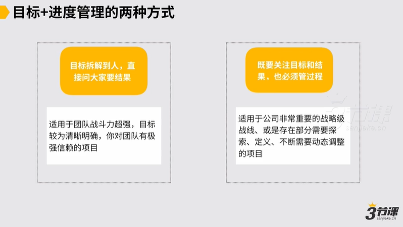

# 2.2 目标管理+进度管理

### 2.2 目标管理进度管理工具

第二个工具我们的目标管理和进度管理。目标管理和进度管理我觉得是作为一个管理者十分重要的一部分，十分重要的一部分。在目标管理和进度管理上，我觉得是说在一个团队里边，常见可能有两种方式，对第一种方式通常说我目标拆解到人，给各位提要求，我直接向各位要结果就以上，这样的这种管理方式是较为适用于说几个这种选项，要么我团队战斗力超强，要么就我目标是较为清晰明确的，这里边要去探索的东西不算十分多，要么说我对团队信赖十分强，要么说我在一个高层的部分，因为在高层的部分理论上就说我就定目标要结果就以上。

然后如果是说我作为一个高层，然后我经常还要冲到一线战场上去对如果长期这样，理论上状态是不太对的，状态一定会导致说我们在高层管理部分是缺位的，所以它适合这是第一种管理方式，直接要结果。

第二种说既关注目标和结果，也必须管过程，然后这样的这种管理方式较为适用于像中层管理者，包括说在公司十分重要的战略级战线，或者是存在部分需要探索定义，需要不断动态调处理的项目，这样的项目一般来讲肯定说我就要管结果也要管过程的。

，然后目标在进度管理的两种基本的方式，但对于说大部分人，尤其对我们ab类的这种操盘手而言，一定是说我们要先学会通过管好过程来取得结果，再来去看我作为一个管理者的识人用人一定是这样一个逻辑，对各位而言是更加顺畅的。

，所以我们一定要作为一个管理者，一定要形成两种意识，首先是说我们要的结果是什么，脑海中是清晰的，其次过程怎么管会更因此，我们也需要有一套方法，在这儿我们就给各位一个较为理想的团队进度管理的这么一个这种方法。

因为在我们绝大部分的公司里面，一般来讲，我们可能都会以周为一个工作的小的阶段和单位对来去看我们处理体的工作。对一般来讲我们在一个团队边工作，我们都会讲说团队的工作节奏要因此，工作节奏以上，他才更容易出成果对所以一般在我们团队里边，在我过去带过的所有团队里边，我也会较为习惯于以周为单位

以周为一个基本的节奏来去看我们很多事情的进展，对我会采用的一个进度管理的方式基本是这样的。

首先是说我们必须要有一个阶段性的目标，举例子说我们阶段性目标说假设我们在q4里面必须把例如必须在营销上把我们前端的获客的能力，要做到说每天可能至少能有500\~1000的获客，付费转化要提升到从5%提升到10%，

这我一个阶段性目标， Q里面阶段性目标。

目标对我而言，我如果要管过程，我一定要把它落实成每一周的计划。在我这儿我一定还是有一个项目管理的这样的进程和逻辑的，我当前的重点是怎样的对我就把它落实下来。

因为我团队里边的很多同学如果是一线的执行者，对不能让他们去分解这件事儿，得我来分解这件事儿，通常说我要把说我的获客能力提升，转化率提升这件事儿我落实到每个周，例如当前周我的工作要做几件事儿，举例子说当前周我可能重点去进行一下头条的渠道或抖音的渠道，

在未来三周这里边我们重点都进行渠道，这一周的计划我们要做出来三套投放的素材和模板，然后做出来5营销投放的计划，我们要上线去跑，下周我们要能看到数据

那周一我们就要把这计划全部定清楚，就这周我们一共有6件事要达成，作为一个管理者，我要管过程，一定要落到程度，我不仅要把目标下发给团队成员，还要帮助他们去推进过程，帮助他们去校正过程，所以这周有这么5件事要达成，我们进行明白了，通常就往前走，如果我作为一个管理者，理论上我找一个节奏，如果以一周为一个单位来去看，较为理想的节奏应该是说周一我们定好计划，周三在周中的时候我们要review一下，当周的计划我们的进展怎么样，

理论上你要慢慢做到说每一周定下的计划当中都能达成，就最理想了，但早期的时候我觉得是说中间你一定要多做一些review的，这样才能保证我团队里面成员他们的工作不跑偏，而到周五的时候我再来做一次review，就看我们这周定下来6件事儿到底达成没达成，对以及在周五的时候我们就可以做一些讨论了。

我们在执行过程中遇到了可能几项问题，对依据这几项问题，我们下周的工作要不要做一些调处理？，于是在下周一的时候，我们又凸显出来我们新一周的工作计划又是怎样的。在过程中，你作为管理者，你最应该关注的我的阶段性目标，我每个阶段工作计划的执行达成情况，以及过程中有遇到什么问题，这些问题该怎么指导我下一阶段的工作，这是你最应该关注的一条主线，而不应该是说具体在执行过程中遇到的很多具体的问题，当然执行过程中遇到问题，如果团队成员如果他有障碍了，你说他需要我支持我，我需要去支持他的，但是更多的你应该是一个说支持者的角色，一定要把上边那条主线要拎清楚。

，所以这是在这儿我们给各位分享了一种团队里边的这种进度管理的方式，如果按方式来去做团队管理，你的团队会是说每周一个工作的阶段和工作的节奏，节奏应该能做到较为紧凑的，所以基本的这种工作管理的框架分享给各位。

大部分人，要先学会通过管好过程来取得结果，再看识人用人。

作为管理者，一定要形成的意识：1.我们要的结果是什么，一定要清晰。2.过程怎么管，需要有一套方法。

注意事项：

项目初期，多做些review，确保工作不跑偏;

作为管理者，应该关注的是：阶段性目标、工作计划、计划达成情况、过程中遇到什么问题、这些问题如何指导下一阶段的工作
