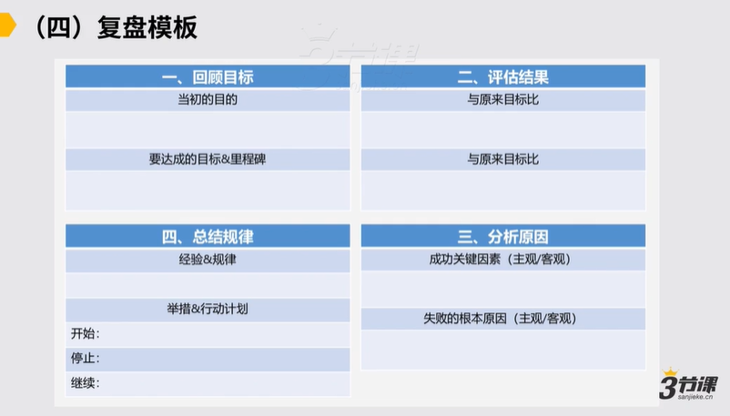

# 2.4 复盘模板

###

随后我们要讲到的是第四个工具，我们的复盘对我们项目进展到一定阶段有了一个结果了，我们要去做复盘。对我们在复盘部分怎么在内部，不管说你作为一个中层，还是说高层还是一个个人，怎么做好一个复盘的处理个的过程，来为你团队和为每一个个体能能提供更大的这种价值和收益，部分我们给各位一个模板。

，给各位这样一个这种复盘的模板。

，通常是说模板它分成4部分，通常你的复盘也会按照这么4模块来去展开，对第一个模块所有的复盘有一个十分重要的建议，就所有的复盘一定要基于目标，所以目标是十分重要的，复盘的第一步一定是回顾我们的目标，对当初我们是要做一件什么事儿，然后这件事目的是啥？要达成的目标和里程碑是什么？对然后这是第一步。第二步是评估结果，些部分跟原来目标比，我们达成了，些部分跟原来目标比，我们没有达成，然后这是第二步要做结果的评估。

第三部分说我们可能要分析原因，达成成功的部分，我们的关键因素是怎样的，这里边分析原因一定要分主观和客观的原因，最好把它区隔开来看

然后有一些可能说是这种十分客观的原因，例如假设我们这里边一个项目成功了，就存在运气好的部分，或存在说行业最近有红利对这样的部分是客观的，对这些客观的东西，成功的这些部分的客观的东西要把它拎出来单独看，主观部分就我们做的因此，

也要单独拎出来，到底些部分做得因此，一部分是因为运气好。对失败也是理论上我们在复盘的时候，成功应该多去关注客观的原因，失败应该多关注主观的原因，这样你复盘才能更好的让你去进步。所以这是随后第三部分，我们要分析原因，成功和失败的关键的因素也各自有些，主观客观的部分各自是怎样的。，这是第三个模块分析原因。

第四个模块就要总结规律，以及凸显出来我们下一步的举措和行动，对总结规律是首先第一个一定要看这里面在经历了这么一个阶段，我们能沉淀下来什么样的一些经验和规律，对这些经验和规律能怎么在指导我们随后的工作当中去行动，对这些要做一些总结，经验和规律是可以长期来帮助你在一些事上做得更好的。

我们很多的业务模型也都是通过慢慢的总结，慢慢的提炼，去逐次形成的，所以总结经验和规律也是十分重要的一个习惯，最后落实成举措和下一步的行动，

这里边我觉得是说可能我们要去看说有些事儿我们要在新的阶段里边要去保持，就要继续去做，有些事儿我们就不用做了，就要停止它，有些事儿我们要心去设计，心去策划，让它在新的阶段里头可发生行动计划和举措，部分应该也从这么三方面思考。

所以这是一个常规的复盘的模板，在很多的这种公司内部都在遵循着这样一个这种复盘的模板，来让各位在每个阶段都去做一些复盘。

我们在这也给各位一些小的案例，让各位可能简单的可查看这样的这种复盘模板怎么能指导我们的工作，对首先这是一个ok的阶段性的复盘，例如产品团队，然后他经过了一个q的工作，然后要去做ok2的复盘对首先是回顾目标，4\~6月的目标，o1O2O3o4各自是这样的，对这是在回顾目标部分，回顾目标这部分往下落会落到一些具体的数据对具体数据我们就不展示了，但回顾目标约是这样的，随后是评估结果

针对我们的o和k二分别客观评估情况，然后完成情况到底是超预期达预期不达预期还是怎样的，还是有些事目标就没定清楚，就不可评估

随后可能说分析原因，我们说的成功重点看客观不达预期，重点看主观，对然后我们要这么着去分析一下，然后在这里边依次呈现出来，认为这样的。

例如o一我们的目标达成度是100%， O2，o3是70%，o4是40%，对然后各自要总结一下说目标达成没达成的重要的这种原因怎样的。，然后我们就依次又做了一系列这种总结，我们就一一念了，然后随后是总结经验，

些东西有效的，对例如团队的复盘反馈机制能很好支持团队成员的成长，然后中台化的这种思考能力较之前可能有显著的进步，可能这几部分需要保持，然后需要改进的部分说是产品的这种协作的这样的一种工作，不管跟研发的协作还是跟业务的协作都不因此，产品的推进和设计没有节奏感

然后等等这样一系列的东西，这也是我们总结的这样的一种经验，好些不好？

随后在行动计划的部分开始做什么，继续保持什么，停止做什么对于是q三的工作重点有这么几件事儿当中有两件事儿新加的，以及可能在如何更好更高效协同上，我们可能也有一些这种思考，以及可能也推导出来一些具体的这种行动的这样的一种方案，所以这约也是一个案例，这是对一个说阶段性的ok做复盘的这样的这种案例。

### 一、回顾目标：

所有的复盘一定要基于目标。

### 二、评估结果：

达成的目标：

未达成的目标：

### 三、分析原因：

成功原因要多关注客观因素

失败原因要多关注主观因素

### 四、总结规律

### 模板

<https://shimo.im/docs/3jH6tKcYVxhvVWkD/read>

<https://shimo.im/docs/v8vGXKvGHkWWwqy9/read>
