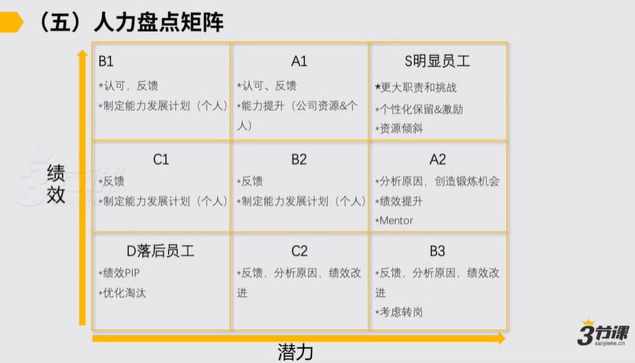

# 2.5 人力结构盘点+IDP个人发展规划

### &#x20;2.5 人力盘点

然后再往下我们会讲第五个工具团队人力结构的盘点和idp个人发展的规划。然后这两个事我们把它合到一起了，它是两个小的工具，首先先查看人力盘点这件事儿核心它解决什么问题。是这样的，人力盘点这件事儿它核心是在什么场景下，我们肯定要去考虑，核心是说我们做一个中层的领导，我承担了一个重要的任务和命题，任务和命题是较为有挑战的，我带着团队可能人又较为多，至少可能十几个以上

你要去两三个人可能就不用这么复杂了，至少十几个人甚至到了几十个人这样的一种状态，

在这种状态下，我就得去评估一下我团队里边的人的这种结构它约是怎样的，对借由团队人力结构的这样的盘点，我肯定要考虑说我当前团队的这样一个人力的这种结构，它能不能支撑我后边一年内目标的达成，我做这么一个判断，对。

一般来讲在人力盘点的时候，行业里边在hr的层面有这么一个工具是很好用的，工具我觉得各位也有个基本的认知就行了。

如果涉及到要用的时候，可以寻求hr的支持的工具约是怎样的？是说他会把公司内部的员工通过说一个年终的人才盘点，可能就评估说人的绩效或者这个人的潜力，基本就这么两个维度，通过评估这两个维度，最后把团队里边的成员，假设你说我管50人

这50人通过我对各位所有人都做了一些打分，做了一些年度目标的回顾，做一些打分之后，最后通常是说会有机会把团里边的成员分成这么9层次，通常是说sabcd约就这么几块， A里边分a1和a2，随后 b分b1、b2、b3。

，通常 b级别的成员，通常是说是我们团队里边的较为合格的这样的用人S的这样的这种员工通常是我们团队这边可能较为高潜的人。

对约是这样的，理论上肯定是说如果是我作为一个团队领导，我团里面有几十个人，我要承接的任务是一个很有挑战的任务，对我一定要保证说我团队里边员工的这样一种分布，对理论上肯定说在s和a这一级别的人，他们例如大约占比大约占比至少应该是百分之30左右是甚至可能之上对这件事对我而言更积极的，但如果盘点完了，我发现说我团那边很多人基本都在BC，甚至在d

你说我明年的目标怎么能预期它能实现

就很难了，所以在例如你团队里边的这种同学到了一定的基数，到了一定的程度的时候，通过这么一个人力盘点的举证，它是能在年终这样阶段的时候帮助你去更好的了解说我团队里面当前人力结构是这样的一个认为，以及说我当前例如到底我团队里面最缺的是一类人

到底我最缺的是说是例如潜力高，然后有更大的成长空间，确实这样的人还是我当前缺的说我虽然有一大堆团队没有潜力人，但就出不来业绩，一堆人可能业绩都没出来，还是这么一种状态。

我得清晰的理解我团队里边的当前人的这种状态，依据结论，我可以去再指导说我团里边的处理个的人员方面，我在随后一段时间我的工作重点是怎样的，这是一个小工具，叫做人力盘点的这种矩阵。

，然后随后是说我们会给各位分享另外一个工具，会有一个工具叫做idp个人发展规划，在这儿我们快速串一遍。

，首先idp个人发展规划核心是解决是什么问题，核心是说对我们团队里边较为重要的这样的这种同学，然后我们帮他去制定他个人的发展规划，以及让他个人的发展规划跟我们团队里边的基本的目标要能做到是一致的。

这样我们团队里边的这样的这种凝聚力，各位这种信任感之类的可能也会更好的得到加强。

，约是这样的，对怎么去用itp个人发展规划，它通常是这样的。

基本在年终的时候，首先我们说在年终的时候，让我们的一个团里边的员工填一张表，对他会做个自我评价，我们通过自我评价做他工作的回顾和对他的评价，然后我们从中会去总结出来一些他个人的优势和机会点，做一些分析，随后我们会跟他去探索一下，说他个人的职业兴趣和倾向是怎样的，最后一起去制定一个下一步他个人的发展和提升的计划，我们可能在年终的时候往往会跟团队里边一些重要的同学们去做这样的这种谈话，做完这样谈话之后，通常说明年我该奔着一方去，我自己的个人成长预期是怎样的，他就相对清晰了之后，他的这种工作的动力和热情就会变得更加的强。

约是这样，对个人发展规划的范例它通常会有一个表，一般来讲可能说让各位去填，说我过去一年业务组织模块上，我承担的具体指标和一些我负责过主要的工作的回顾，我会让各位去填，然后这里边他需要自己填，也需要上级来给他评价，自我评价和上级评价之间要做一个小的校正。

，然后这里边下边再让他去填一些东西，他个人的优势专长，个人成长的机会点，他看到的个人短期职业兴趣和长期职业兴趣是怎样的，

然后这些东西他可以先填一下，然后作为上级，你可以再做一个校正，以及再做一个小的建议，然后建议完了之后跟他一起聊一下，定出来下一步的他个人的这种培养计划就ok了。因此 Adp个人发展规划约这么一个小的工具。总而言之，adp个人发展规划的价值让下属跟你跟公司之间形成高度长期目标一致的认为，从而提升我们团队的战斗力，所以这是我们给各位分享的第五类的工具。

IDP个人发展规划的价值：

让下属跟你、公司之间形成高度的长期目标一致，形成更强的团队战斗力！

