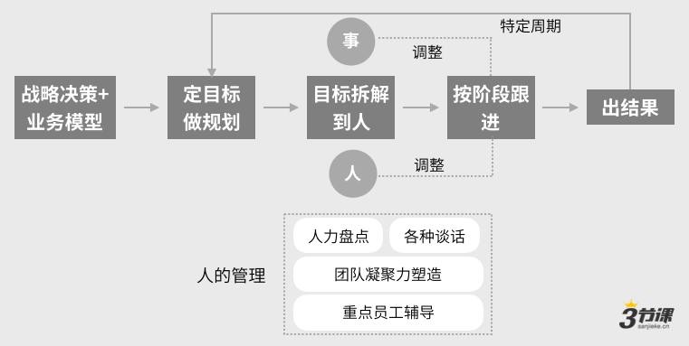

# 一、做好团队管理的基本工作方法和逻辑

团队管理的基本逻辑：

### 做好团队管理的基本逻辑

今天我们第六章是如何成为合格的团队管理者，我们会给各位去分享两块的这样的一种信息。第一块我们会给各位讲一下做好团队管理的一个基本的工作方法和它背后的一些逻辑，这是第一部分我们会给各位分享的。第二部分我们会给各位去分享一下，给到各位有8常见的这样的一种管理工具，管理工具，我们力求各位如果你对前面的内容有了深刻的理解了，拿来就能用，然后立马见效，我们力求做到这样的这种程度。

所以在今天晚上我们要给各位讲的两部分内容，对我们直接进入到第一部分内容，第一部分做好团队管理的基本工作方法和逻辑。我不知道各位在管理上有没有自己的一个基本逻辑或者叫一个方法论。，然后因为我们发现有很多的同学才刚刚去开启自己的管理者身份的时候，他他们的这种管理的方法是较为粗放的，然后通常也没有什么章法，对通常可能说也是较为零散，有个问题摆在我面前了，我就去处理，但处理件事儿它是一个什么样的逻辑，可能对各位而言也不是那么清晰。

所以今天晚上第一部分我们一定要给各位讲一下，团队管理背后有一个基本逻辑的，我们给各位把逻辑要处理体捋一下。

首先团队管理就像我们的，如果你作为ab类的操盘手，你往往在企业当中是处于一个中层的角色，中层就意味着说高层做出了战略决策，以及高层去定义了这家公司处理体的业务模型之后，往下落，往下落下来之后，最后一定要在局部的上线当中拿到一个结果。

所以从某种角度中层的管理者核心的职责就我一定要能出结果，我要能对结果负责对然后所以基本逻辑高层定义完了我们的战略，定义完了我们的业务模型，作为中层的同学而言，你一定要可去拿到一个最后就符合我们在战略决策和业务发展方向的一个结果，基本逻辑，结果是怎么拿到的通过一系列管理的工作来拿到的，管理的工作包括有些？我们一个个来看。

首先第一步是我们要定目标做规划对高层的战略决策和我们处理体公司的业务模型都出来了，落实到我们负责这条战线上，我们需要去定义我们的目标和规划，这是我们上一章讲的东西，对然后随后是说我们的目标要拆解到人，要拆解到我们团队里边的同学，我带了5人对他们各自到底对什么负责，他们各自到底背什么样的目标，这儿我们一定要做好这一步目标拆解到人，然后我们才可对我们下边的同学们去提要求，以及我们所承担目标也才可分解给到他们，这是一件十分重要的事情。

么再随后的，我们通常就会按一个阶段来去跟进，阶段，有些时候是一周，有些时候两周，有些时候是一个月对约是这样的这种认为。跟进的过程中，通常我们有遇到说事情的进展不如我们预期，这时候怎么办？我们要做调处理，作为管理者也还有一个很重要的管理的职责和管理的这样的这种方法。

在事情推进的过程中，如果我处理件事儿的它的执行的路径，它的处理个的所有的价值假设对我是清晰的，推进过程中一旦说事情的进展不如预期，我们就要启动我们的调处理，如果是要调处理，理论上要么就调事儿，要么就调人。

，因为最后事儿一定是人干出来的，事在人为，所以我们理论上肯定是说要么我们事儿工作方法和逻辑不，我们要重新调处理，要么说干这件事的人有可能不，

我们或者是说这中间处于出现了一些像人岗不匹配的这样的这种现象，我们发现这现象也需要迅速的去做出调处理，这是处理个因为管理我们经常讲两在管事儿这条线上，通常我觉得是说对于高层有了一个战略决策和有了一个业务模型之后，我们最后拿到一个结果，约是这样的过程和逻辑。

以及通常当我们在一个特定的周期之后，因为一般来讲在一家公司里边，我们的战略定义完了之后，我们就阶段性看我们目标，一般来讲一家公司里边都会有一个制定战略目标的这样的一种周期，有些公司是半年，有些公司是一个q来去看

但不管怎么样也会有个周期，通常是说当我们定义完了处理个公司半年的目标，然后半年目标拆下去到我自己身上，我牵起头来开始往前做了，半年之后回过头来处理个公司开始复盘，复盘完重新做调处理之后，我们又去制定我们下一阶段的战略，下一阶段的目标和下阶段的规划，处理体上是这么一个认为，所以这是在事儿的这种层面，就我们要管好一件事儿，他约是按逻辑来去推进和进展的，以及除了事儿之外我们也要管人

所以这当中作为一个管理者也会涉及到人的管理，通常涉及到有各种方面，包括了我们团队里边的，例如人才的这种结构是怎样的，因为我们要为一个战略目标的达成负责，我们团队里边的人的结构要能支撑这件事儿，他最后能达成

你还是要思考我的目标达成难度有多大，他需要的核心能力和核心的素质是什么？我们当前团队里边的这种人员结构是否能支撑我们能达成目标，是要想的。

所以这会涉及到人力的盘点，以及在既然是要管团队，一定涉及到会有各种各样的谈话，包括有谈绩效对谈个人的什么情绪状况不因此，甚至可能说极端来看谈辞退等等，还有各种各样的谈话，然后这些谈话也都是我们作为一个管理者要去应对的一些这种基本命题，以及对团队来讲，一个团队聚在一起，团队要有凝聚力，他的战斗力才可变得更强。

所以对于一个管理者而言，一个团队的凝聚力的塑造也是一个很重要的命题。

再随后我们作为管理者，我们也要可去支持我们处理个团队的成长和发展，这当中一定会涉及到有一些说重点员工的辅导，这些问题基本都是我们做一个管理者要关注的问题，但是在管理过程中，我想给各位树立一个基本的管理观，基本的管理观，我觉得说作为一个管理者，那核心的逻辑一定说你要对事儿的结果负责，而怎么管好人，最终是去支持你更好的对结果负责的是这么一个逻辑，所以你不能说我在团队里边

我跟各位相处的可以上，各位可喜欢我了，然后我们团队氛围可开心了，但是我们在团队拿不了结果对这样的一个团队我觉得它毫无意义。

，所以如果要给各位树立一个管理观，我希望这么一句话，你身为一个管理者，对你最基本的要求你要可为结果负责，在这当中能管好人，能让团队的凝聚力，他的这种氛围，他的信任感等等都能变得更强，那是为了更好的支持你能拿到这样的一个结果，然后约是这样的一个认为，这是我希望在开篇的部分为各位可能去塑造的一个关于管理的基本认识。

对开篇的部分可能简单给各位分享一下，我们作为一个管理者，我们基本的这种工作方法和逻辑，然后部分就先给各位可能就做这么一个小的分享。

随后follow逻辑，然后因为逻辑光这么讲，我觉得是说似乎还是有点单调

随后我觉得是说follow我们讲到逻辑，我们用一个案例完处理的去过一遍，让各位感受一下身为一个管理者在处理个过程当中，然后到底我要怎么应用，刚才提到的这样各种思考的框架，帮助把管理工作做得够因此，以及我们像管理这一章里边到底跟前面的什么业务模型，然后工作计划的梳理，探索项目的破局等等跟他们之间到底会有什么关系，我们通过案例来完处理的来走一遍。

以上，我们进入到我们的案例的部分，我们还是用一个我们处理个可能随后讲到案例算是70%是真实的，然后30%算是有一点这种yy的成分。

，然后约是这样的一个这种案例，我们直接来看案例是这样的，首先这是一家 A轮左右的一家公司对然后这家公司的主要的业务是专注历史人文地理的这种纪录片和短视频，当前的团队成员有160人，对如果有熟悉的人也许能猜到这是家公司，但不重要，我们接着往下讲，然后这家公司当前它有4条业务线

然后有纪录片、新媒体教育，还有APP这么4条业务线，对当前这家公司有一个业务负责人叫做小h他负责的业务线是APP，APP对他们公司而言是一个全新的项目，当前已经启动了有个三个月，小h作为APP这条业务线的负责人，他就要履行好他的管理的职责。

，那么回到前面我们讲的管理团队的基本逻辑里边来，各位可以看到他要是管理好他的团队，首先一定得从说业务模型要推演到说我阶段性的目标规划是怎样的，然后目标拆解到人，并且他做好按阶段的跟进，

他先要做好这么几件基本的事儿，所以我们就来查看这家公司的这条业务线在2019年的q三。

，因为它是一个新项目，所以他们脑海中是有一个假想的业务模型的，假想业务模型是怎样的，核心说然后这家公司他们还是想通过他们有大量的这种纪录片的内容，包括也通过定期的上新来去做一个说用户到他们这来持续的消费纪录片，所以会留存下来，所以他们有流量，有了流量之后让他们后续去做用户的付费转化，然后让用户在他们这付费去观看一部分优质的这种纪录片，最后再有个续费的这样的逻辑，约就假想了这么一个业务模型，业务模型它增长和获客的部分，前边主要通过三个方面的这种渠道和手段来去实现他们这种用户的增长。

依靠用户自发的分享是一部分，依靠渠道的投放是第二部分，依靠自然用户重复的访问第三部分，对核心他在第一阶段业务模型里边的关键他要做留存和活跃，要做流程活跃，他们脑海当中假想的逻辑他需要有大量的内容来去作为一个基础前提，以及处理个为了支撑它的留存和活跃

他们公司是需要定期上新来去驱动处理个业务模型的，这是他假想的一个业务模型。

对在处理个基于假想业务模型，随后我们查看小h它当前工作的重点，现阶段工作重点一定是在它的用户拉新和留存的部分，而它的付费转化部分，通常阶段有可能先不用想对约是这样的一个这种逻辑。

在它下端有需要去关注几件事情，例如稀缺内容的引入，例如它的内容推荐给用户的推荐体系，然后部分也是支撑用户的留存和活跃的，再有它的ugcpgc的内容管理，约有这么三块东西可能需要去关注对然后所以这是它的业务模型，我们约梳理就清晰了。随后他们公司在投这半年的工作的目标是说我们希望实现日活的这种用户可能1万以上，然后跟上级沟通完了之后，他们就定完这么一个目标，日活用户1万。

随后 Follow业务模型，它需要去把它的日活指标转换成一个基本的公式，对于是他梳理出来了这么一个公式，就APP的日活应该是等于说我前之前的这种新增用户数乘以我的次日留存，加上我当日新增的用户数，对。

这是它处理体的 APP的日活的一个基础的这种公式， follow公式，随后它一定就会看到它当前的数据指标是怎样的，以及它的如果要去增长日活，他的工作重点该在里对他会去看这么一件事儿。

于是他可能就看了一下说我当前用户次的留存率可能十分的，事我当前最大的价值洼地。

，所以我可能得提升一下用户的次留存率，在部分，我核心应该是通过两方面的事来驱动，一方面我要有大量的免费的内容，包括这当中需要有一些稀缺的这样内容的引入，

然后部分可能就需要可能去有人来看，以及我可能要构建一条这种内容消费的路径，包括刚才提到的说什么内容推荐，然后什么新用户进来之后的它典型的这种转化或者成长路径之类的，这些也需要有人去看，有人去持续调处理和优化。

，于是就分出来这么两条线，这两条线下，他可能各自就堆了有个几个团队。

首先有一个内容BD这么一个小的团队的人，然后他在这儿可能要对于我大量免费内容的数量和质量的这样的这种诉求可能去负责，他约就定了有这么一个人对这件事负责，随后是说我的内容消费路径，按我们刚才看到业务模型上，它用户说有用户是直接到APP的，有用户是直接从小程序社区里边先做了一些内容消费的体验，然后再转到APP上的

这里边说 APP本身的这样的这种路径，小程序到APP的路径，还有说内容管理和推荐上新的这样的这种一些基础的机制，这几部分是需要有人来关注的。

于是在这下边它也分别有产品经理和内容运营来负责这么几件事儿，对这也是一个基础逻辑，而对于说新增用户部分通常就纯强依赖于，因为他们当前产品还较为早，期，你说在早期产品里边依赖于说什么用户的什么老带新能给我带来多大的增长，

似乎也不太现实，所以他们在新增用户这块是强依赖于投放获客。

，所以投放获客部分也需要有个人负责，通常可能他们就按照这么一个逻辑梳理了他们公司核心的业绩指标，或叫处理个的商业价值指标的它的一个公式，以及公式当前每一块的一个指标到底是被怎么来去驱动的，他们也简单梳理了一下。

以上，梳理完了之后，随后就回归到说他要去定目标了。对在定目标环节，小h同学他是存在一些小的问题的，可看到他给团队里边的同学们，虽然刚才我们梳理了各自不同的同学他们工作的逻辑关系，但是小一起同学跟上级有个共识，说日活在q三达到1万，但是他又觉得说团队里边，当前我一线同学有好多人都是0\~1岁的人，我把指标丢给他们，我认为又不放心。

，然后给到他们似乎也不是十分因此，又怕他们肯定有压力

所以日活达到1万，指标就只放在了小企自己身上，然后他往下去做指标的传递，往下做目标的分解，他只给内容BD的同学给了一个指标，说你每个月要给我完成8家pgc机构，然后让他们能给我有什么稳定的这种内容的供给，他只下发了这么一个指标。

剩下在他团队里边所有的人各位可以查看，投放的同学没有指标，没有KPI内容运营的同学没有指标，没有KPI Ap产品的同学没有指标，没有KPI，h5这块同学就小程序那块的同学也没有指标，没有KPI。

，所以通常他们公司他们团队里边的工作模式基本小h告诉各位说你这周帮我干三件事儿，对然后干完三件事之后，回头这指标谁负责我来看，但干得是否可行可能我也不会追你们责，约是这么一个认为对。

然后所以他通常就往下做了这么一个目标的拆解和团队信息传递，这样的状态就持续了，可能一个q对从q二到q三结束到q三底的时候，小h来跟上级就有没有他的工作了。

因此，因为刚才我们看到他给团队里面同学们下发的目标是那样一个状态，所以一般来讲，当我目标都往下没有传递清楚，我都没有给团队提出要求，理论上团队是很难给到我一个结果的。所以不出所料当他们在q三review工作的时候，就发现说我APP的日活只有2000上下，并没有达到1万的目标，这是第一个发现他们的现状。

那么第二个再往下看就分析了一下，他们又分析了一下问题可能出在对然后分析了一下，可能说得到几个结论说第一个投放获客的用户群体太分散了，因为来的人例如有这种什么文艺青年，有什么老年人，又有什么高校的这种小年轻

然后每一类人他们希望看到内容可能又是不一样的，这里边因为来的用户太分散了，所以他们团队的一共可能早期也就十几个人，精细化运营的能力跟不上，所以导致了用户留存十分低。

另外他们又发现用户如果只是为了看纪录片，下载APP成本是较为高的，似乎用户如果是说用小程序来做留存，有可能比APP更有优势，对然后这是第二块的重要的结论。

第三块重要的结论是说他们做了一个用户分群的调研，和数据的这样的一个分析，通常就发现说在他们所有的用户里边，高校就大学生这样的用户，它的处理个的留存率是高于其他用户群体的留存率的，然后他们经过分析之后得到这么几个结论。

以上，基于这样几个结论，他就要做调处理了，对于是我们说了调处理一定是说要么调事，要么调人，对首先他就调调事儿，他可能就重新去制定他的这种打法和方向，然后基本说从 Q3到q4Q3的时候那么一种工作方式， q4他们希望第一个调处理通过小程序为主要的渠道和留存的这样的这种一个载体。

第二个是说重点希望打高校打大学生的这样的一种用户，在高校重点按照他们数据得到的线索，重点去进攻传统文化，还有一些这种社区等等这样的这种方向的内容，尝试以此来去做破局，于是约就有了这样的一个基本的这种想法。

有了基本想法之后，我们事儿和人要调处理到位，就意味着我们的业务模型和团队里边人的分工，我们也要有新的这样的这种理解和假设，

于是他们就重新梳理他们原有的业务模型，对梳理完之后的业务模型，它变成了这样的一个认为，在前边渠道投放自然用户这两块干掉了没有了，然后主要是通过原有建了很多的这种用户群，以及在高校他们希望发展一些社团，通过这两种方式来去给我们的小程序社区来去导流。

小程序社区里边的重点说通过圈子的运营，通过话题的运营，例如传统文化对假设是说我的什么琴棋书画，各自可能就构成一个小题小的圈子，这里边挑什么话题，我的圈子怎么来分对会是我处理个运营的重点。对他们就把处理个工作的方向换成了这么一个方向，这里边我们不讨论方向对还是不，我们只给各位去展示这么一个基本的这种过程和逻辑。

，最后再从小程序社区里边往APP的内容消费可能去引导，对约它的一个模型可能就变成了这样的一个认为。当它的一个模型变成这样一个认为，然后随后它的主要的关注的指标就不一样了，它主要关注指标就变成了是小程序的日活，而不是APP的日活。

，如果是小程序日活，它处理个的指标的公式跟之前没有十分大的区别的，是没有十分大区别的，但是这里面他的工作方法出现了巨大的变化，

然后例如去重点的去解决它次留存率的问题，按我们之前说的说它是要通过大量什么视频内容的引入，对加上什么推荐的这样的这种机制是定期上新的机制之类的来去提升次留存。而现在他打法变了，他重点希望通过圈子和话题的运营来去提升他的次留存率。在圈子话题运营部分，他希望是由一个社区运营的同学加上我们的产品经理来去为这件事负责，希望是这么一个认为。

而后面的新增的这块的这种用户数，新增这块权重在它处理个的工作规划里边可能也变得不一样了，新增这块的处理个的驱动，他是希望说通过高校的社团加上高校线下活动，加上原有的社群来去引入。

所以为了解决好这么几件事儿，他也做了一些分工，通常说有社群运营会去做原有的社群对有BD同学会持续BD一些高校的社团，加上可能有一些线下活动策划同学支持跟BD的同学可能绑在一起，然后去支持说在高校社团里边我每个月都能有稳定的这样的这种用户新增可能可去达成，于是有了这么一个结构之后，他又重新调处理了一版他们团队里边的分工和个人的目标

然后通常可能说高校的BD的同学和活动策划同学，然后通常就对于说每个月BD30社团，然后这件事要负责，他运营团那边一共有5同学，有2BD同学，他们的目标每月BD30社团，然后高校活动策划同学理论上他后边这块图上列的较为笼统，但团队边是有一些细分的，例如高校活动策划同学跟BD同学，他核心的目标就变成说每个月我在高校里面落地几场活动，每场活动平均给我带来多少的这种新增用户

然后我的社群和社区运营的同学通常也是社群，他说我要成立多少个群，然后这群稳定的往我小程序输送多少的这种新增用户。社区这块同学核心就关注的是说我的处理个小程序上我用户的次日留存到底是怎样的，那次留存指标应该是说运营跟产品一起来去共杯的，他就把他的处理个的这样的一个这种目标变成了这样的一个认为。

当他做完这样一轮调处理，他的人和事儿都做了一些调处理之后，随后他在q4里边至少基于当前的认知和假设他的工作的这种规划和他的目标的达成的这样一种情况，看起来至少我们心里边稍微会更有谱一些了，至少在这样的调处理之后，到底我目标最后如果没达成是块出了问题，是因为我高校部分

我的BD不给力，还是因为说我BD了一堆的高校的社团，但是这些社团的用户导不上来，还是因为说我的导上来之后，我的处理个的例如我产品里边的自留存太低了，然后这块有一个很大的漏洞，导致我产品接不住用户

在逻辑下你发现我是可去分辨的，我是可去界定我的问题到底出在里的，所以他约这一个说处理个从事儿和人的调处理上，我们按照我们刚才讲的这一套管理的工作逻辑，处理个做了一个梳理之后，我们处理个前后的这种对比，对以及这过程当中我们也提到会有很多人的管理的工作，例如小h同学他作为一个业务线的负责人，他也会面临有这么几块的这样的这种问题，

例如第一个叫做说基本每个人之前都是转岗而来的，他团队里边人基础运营能力匮乏，导致每个环节最终产出都很差，就团队里边现有的人，他的能力可能不ok的，于是我可能需要去做很多的员工辅导，以及它也会存在一个问题，叫做说接手运营部之前方向调处理三次了，导致各位方向感很弱，动力也较为缺乏，于是他也需要做一个管理者做好团队的激励。

再有上级是传统媒体人，在跟上级沟通汇报的时候，有些时候也会经常有不同频，所以这里边他也需要定期去做好向上的这样的这种汇报，这里边肯定说汇报的方式方法一个逻辑，另外我们第一章里面讲到了怎么跟上级同频部分

也是一个重要的逻辑。

，所以这里边它也会面临到十分多的跟人的管理有关的问题，人的管理的问题如果解决不好，是会影响到他事儿的这样的这种进程的，所以这样来梳理一遍之后，各位对于说一个团队管理者，他在处理个的管理过程中，他的工作的职责，他的工作方法是怎样的，以及说管事管人二者之间到底是什么关系，可能就会更加的有概念，更加的有谱。

，以及到这儿我们也想简单跟各位回顾一下，我们在第一章开篇的时候就给各位有讲过，身为一个合格的管理者或一个合格的操盘手，需要具备这样4种特质。

我们在这儿再简单回顾一下，第一个叫做左眼外部要可快速的杀伐决断，第二个叫运筹帷幄，决胜千里，要不断的建立和撬动放大某个业务模型。

第三个叫做化，不可能为可能，使命必达，强力破局。

第四个就见精锐之师，无坚不摧，所向披靡，对一个优秀的操盘手他身上应该具备这样4种特质的，对对应到例如刚才小h同学他的处理个的工作的过程来看，理论上第一个肯定是说外部的环境留给这家公司留给团队时间一定是有限的。

，所以理论上可能说都不只是小h下边的同学，包括小h自己本人，他可能他去回答处理个说我的APP到底能做好还是不能做因此，他有个既定的时间窗口

所以理论上我觉得他在这件事上，他的一些决策需要是果断的，对假设说他判断团队边的这些新同学支撑不了我的目标达成

从他的职责来讲，他要对结果负责，如果我团队里面的人不能支撑我对结果负责，理论上他只剩下一条选择，我要换人，而且我要果断的换人，升级我的团队，他一定要可去果断的做出这样的决策。

而对于说建立和撬动发展模型部分，我们刚才在调处理前后过程中我们就串的部分，

我们要不断的基于我们一些假设，调处理我们这家公司我当前业务模型到底怎样的，这业务模型有可能我当中会有一些这种假设，如果不成立，我要快速的再做进一步的这样一种调处理，形成我的新的假设，对然后这也是我们在探索型项目破局部分有讲到的信息。

然后强力破局部分也是我的行动，决策一定要敏捷对我的思考要极致要清晰，然后我的目标一定要可分解到团里面每一个人，我把要求提清楚，目标定清楚，我才有机会能拿到结果，我都没有对下边的同学们去定目标，要求我怎么可能可拿到我想要的结果，

最后建立起一支能打硬仗的这样一种队伍，对在过程中管事的能力，管人的能力，两者都必不可缺，所以所谓的操盘手肯定说能带出队伍打下硬仗，对然后我觉得结合case，我们再来回顾一下，我们在第一章的时候讲到的这么4点，各位有更有认为。

，所以我们这一章的第一节约这样，然后我们处理体上在第一节的部分给各位讲了，作为一个管理者，他基本的工作方法和一个逻辑，也用案例结合我们之前几章讲到内容，把管理部分又串了一遍，部分希望各位对于说我作为一个管理者，我到底该怎么去工作，我怎么通过我的一系列工作可做到我最后能为一个结果负责，希望各位对事儿能有更清晰的认为了。随后，如果是说各位对于部分已经有些了解了，下边我们要讲的就一系列管理工具了，这些管理工具应该可极大的提升你的这种工作的效率。
