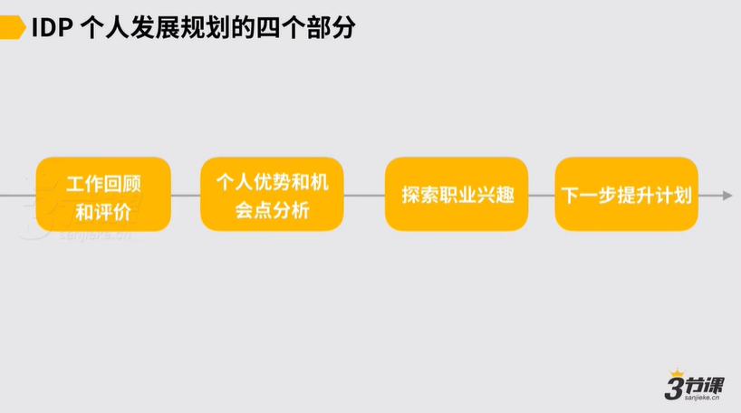
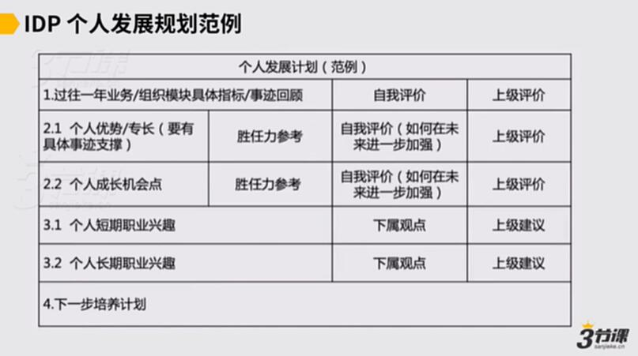

# 二、给操盘手的8大常见管理工具

### 给操盘手的8大管理工具.mp4

所以随后我们在第二节会去给各位讲给操盘手的八大管理工具，我们还是回到团队管理的基本逻辑，回到这张图里面来看，随后我们会给各位讲8重要的工具，这8它都是服务于我们在处理个这张图里边的不同的部分，不同的模块的，首先我们会给各位讲第一个工具，是有一个向上汇报的基本的框架，对框架通常也算是一个小的模板，可帮助各位说更好的去应，怎么在我项目进展的不同的阶段向上去更好的做好汇报，这是第一个我会讲的工具。

第二个会讲的工具是高效协作的文档，我们在团队管理过程中经常会涉及到说我们一个部门要跟多个部门要去协作，对中间有十分多的沟通是很复杂的，如果你能熟练地用好一些这种协作文档，可极大地帮助你去降低这种跨部门协作或者内部协作之间的这种沟通成本。

对第二个工具，第三个工具我们会给各位讲一个，工具我觉得是十分重要的，目标管理和进度管理的这样一个工具，也说怎么把目标下拆给我团队里边的人，以及怎么做好他们的进度管理，我作为一个管理者在这部分该有些什么样的这种工作的方法。

，然后再往后是一个复盘的模板，我们一个项目推进完了到一个阶段，阶段有了一个结果，结果甭管是好还是不因此，

理论上我们都要做一个复盘，做完复盘之后，我们要推演出来我们下一步的行动是什么，我们随后的新的目标规划是怎样的，我们沉淀下来什么样的经验，什么样的教训

所以怎么做好一个复盘，我们也会给各位一个模板。

，然后再随后是在人力盘点部分，人力盘点这部分我们会给各位两个小的工具，第一个是说团队做人力结构盘点的小的这样的小的方法和小的工具。

第二个东西叫做idp个人发展的规划，你做好团队人力盘点了之后，不同的人应该往里去，你约有个基本的判断，然后你也要应用好你的这种基本的判断，跟每一个人之间去达成共识，让他们每个人的发展方向和你团队的目标可衔接到一起来。

，然后这是这块的工具，然后在各种谈话部分，我们会有一系列的11的这样的这种沟通技巧来帮各位去解决各种不同场景下的一对一的沟通。，然后在团队凝聚力的塑造部分，我们会有一个团队发展阶段和团队激励的一个基本的模型来给到各位，以及最后在重点员工的辅导部分，我们会有一个edac的培训辅导法，然后约是这一部分，我们给各位依次去讲这么一些工具。

##

##

##

## 5.人力结构盘点+IDP个人发展规划

IDP个人发展规划的价值：

让下属跟你、公司之间形成高度的长期目标一致，形成更强的团队战斗力！

&#x20;

ed
