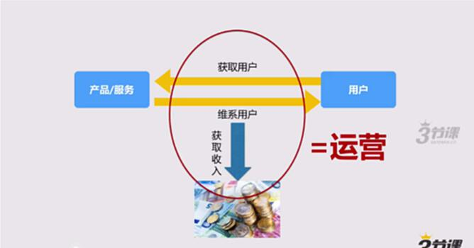
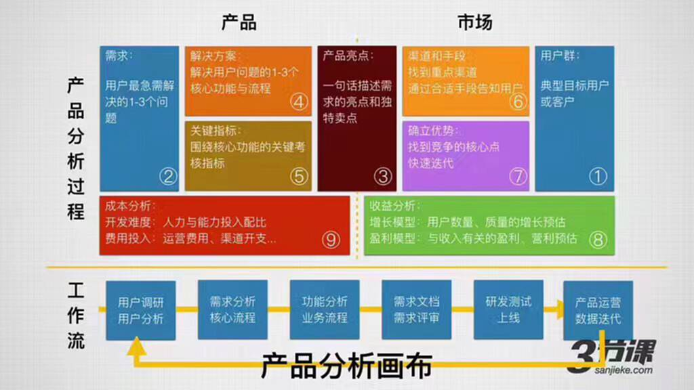
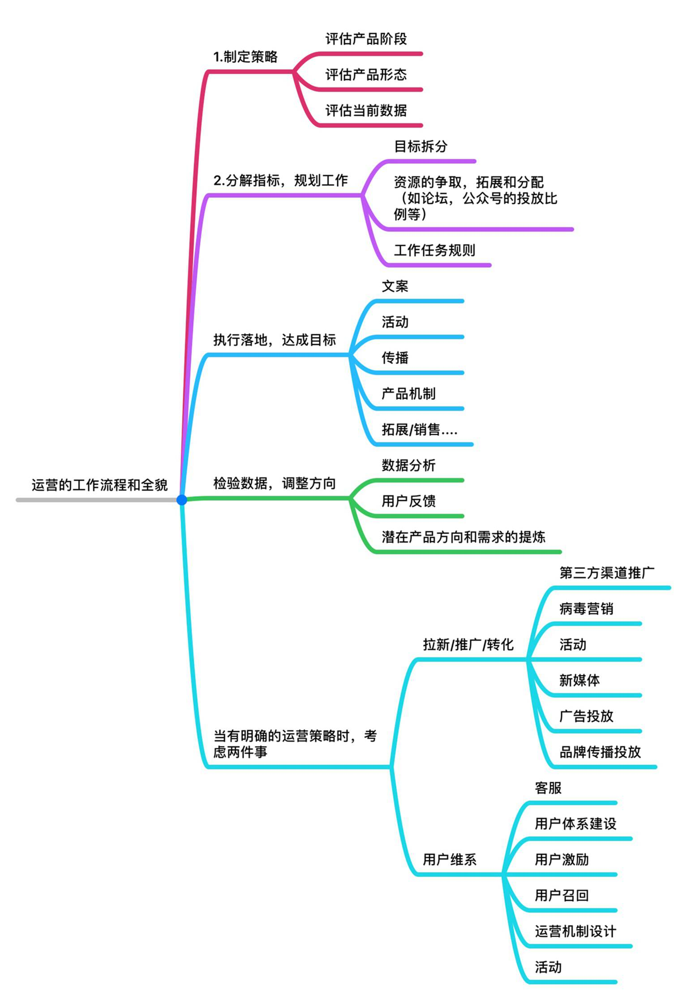
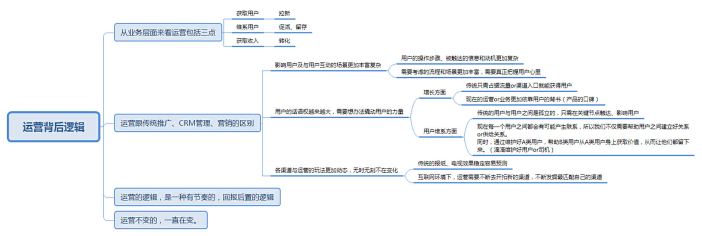

# S1.1 理解“运营”工作背后的逻辑

## 课程导读

作为开篇，我们先来认识一下运营，聊聊运营背后的逻辑。

**运营的目标：获取用户、维系用户、获取收入。**

**当下互联网语境下的“运营”到底跟传统意义上的推广、CRM管理、营销等有何区别？**

**它们的3个不同点：**

* **影响用户以及与用户互动的场景更加复杂。**

例如：传统推广：杂志、竞价，只要给用户一个动作就可以了。用户就可以下单、打电话等就可以了。

而活动运营：在微信大号做推广，用户看到了文章→点击【阅读原文】→进入一个H5→引导用户下载→用户需要注册。每一个用户动作都需要精细化的引导和激励。

* **用户的话语权越来越大，更需要找到办法撬动用户的力量。**

例如：传统获取信息，只依赖于报纸杂志、电视等，现在每一个用户都可以成为信息传播点。例如朋友圈。

传统只要占据好的渠道就好，而现在哪怕是占据了咪蒙、罗辑思维这样的大渠道，如果没有做好产品的价值，用户对其的评价是非常差的，大渠道也不能改变。

现在用户与用户之间的关系越来越密切，产品需要连接用户与用户之间的价值关系。

例如，我们维护好A，从而A传播给B，A把价值传播给B，做好这样的价值联系。

* **各种渠道与运营玩法更加动态，无时无刻不在变化中。**

例如：报纸杂志投广告，可预测效果。而互联网的效果会出现，半年一小变，一年一大变。

微博广告开始效果很好，随着发展，微博的价格提升获取用户的价格越贵。效果变差了。

后来又有人用九宫格方式获取了大量用户，后来也有人陆续学习，但是效果会越来越差。

**运营需要找到新渠道或者新玩法的红利：**

**①对新渠道的不断发展。**

**②对同一渠道不同玩法要不断更新。**

**运营是一项看起来接触的内容十分琐碎杂乱，但是实质上要求非常高的工种。**

**结论——作为一个运营，最应该具备的能力就是学习能力。**

