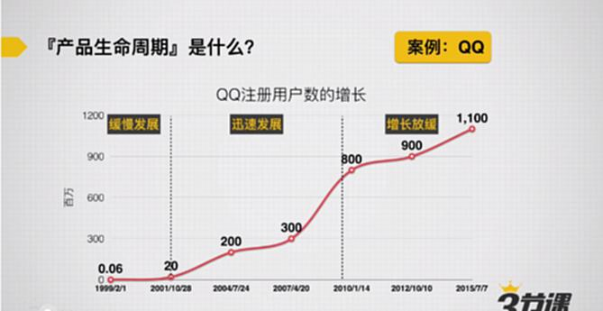
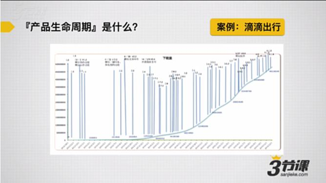
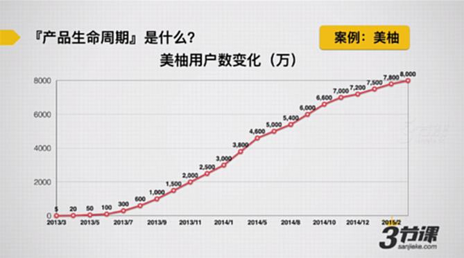
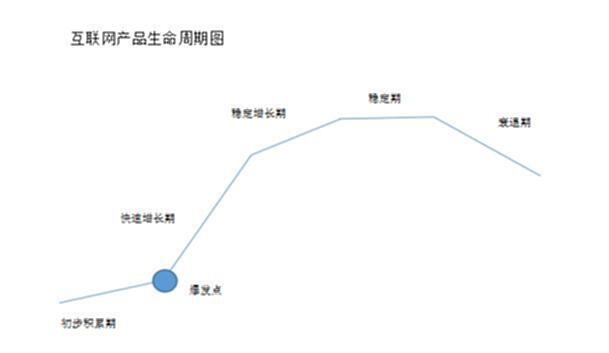
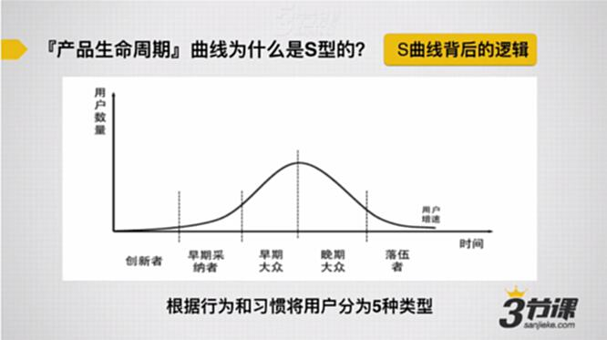

# S1.2 产品生命周期是什么？

## 📌 学习目标

本节课将帮助你:
- **理解**产品生命周期（PLC）的概念和模型
- **掌握**产品生命周期的四个阶段及其特征
- **了解**不同类型用户对S型曲线的影响
- **认识**产品爆发点的重要性

---

## 💡 课前思考

在正式学习之前，请思考以下问题：

- 从业务角度看，你熟悉的产品（如QQ、滴滴出行）的发展过程中，是否存在共性的因素？
- 对于你负责的产品，它的发展轨迹是否有周期性的规律？

> **托尔斯泰："幸福的人都有相似，不幸的人都各有各的不幸。"**
>
> 这句话同样适用于产品——**成功的产品都有相似的成长轨迹。**

---

## 📊 成功产品的共同特征

### 思考题
**成功的产品背后，有什么相似的地方？**

### 典型案例展示

#### 案例1：QQ

**增长特征：**
- **1999-2001年**：增长缓慢，用户数从0增长到100万
- **2001年底-2010年**：加速增长，用户数从100万增长到10亿

---

#### 案例2：滴滴出行

**增长特征：**
- **2012年10月-2014年初**：用户增长缓慢，约100万用户（下载量）
- **2014年-2015年底**：显著加速增长
- **蓝色竖线**：产品迭代的关键时间节点

> **数据参考：** 注册量/下载量 × 100% = 30%~40%（活跃用户占比）

---

#### 案例3：美柚

美柚主要面向女性用户，提供生理周期管理服务。

---

### 共性总结

**这三款产品的成长轨迹有什么相似之处？**

它们都呈现出**前期缓慢、后期加速**的增长模式，这就是我们要讲的**产品生命周期曲线**。

---

## 🎯 产品生命周期（PLC模型）

产品生命周期理论（Product Life Cycle），又称**S模型**，是理解产品增长规律的核心框架。

### 标准四阶段模型

---

### 第一阶段：引入期（Introduction）

**阶段特征：**
- 用户对产品不了解
- 用户量增长缓慢
- 产品处于探索期
- 市场前景不明朗

**关键任务：**
- 验证产品价值
- 完善产品功能
- 寻找种子用户
- 探索市场需求

---

### 第二阶段：成长期（Growth）

**阶段特征：**
- 用户对产品已熟悉
- 用户量快速增长
- 市场方向明确
- 竞争者纷纷进入

**关键任务：**
- 快速抢占市场份额
- 扩大用户规模
- 建立竞争壁垒
- 优化用户体验

---

### 第三阶段：成熟期（Maturity）

**阶段特征：**
- 用户量增长缓慢甚至转而下降
- 潜在用户很少
- 市场需求趋向饱和
- 竞争加剧

**关键任务：**
- 提升用户活跃度
- 探索商业变现
- 精细化运营
- 延长产品生命周期

---

### 第四阶段：衰退期（Decline）

**阶段特征：**
- 新产品或替代品出现
- 用户转向其他产品
- 原有产品用户量迅速下降

**关键任务：**
- 防止用户流失
- 维系核心用户
- 最大化剩余价值
- 考虑产品转型或退出

---

## 📖 拓展阅读：从积累到衰退

### 关键概念：爆发点

> **爆发点**：初步积累期和快速增长期之间的转折点

**重要意义：**

绝大多数互联网创业项目和企业都**死在爆发点之前**。能活到爆发点，才算是真正存活。

> 换句话说：**快速增长期、稳定增长期和稳定期很少有产品死亡**（被收购的情况除外）。

---

### 用户类型定义

理解产品生命周期，需要先理解五类用户：

| 用户类型 | 定义 | 特征 |
|---------|------|------|
| **目标用户** | 产品可以满足其需求的用户 | 市场需求有多大，目标用户群就有多大 |
| **有效用户** | 为满足需求而使用过产品的用户 | 排除仅体验一下的用户 |
| **活跃用户** | 近期使用过产品的有效用户 | 根据产品使用频率定义"近期" |
| **核心用户** | 有需求时将产品作为第一选择 | 会主动参与运营（内容贡献、传播等） |
| **种子用户** | 典型用户且具有影响力 | 核心用户都是种子用户；部分有效用户也是种子用户 |

---

### 产品发展的五个阶段

#### 第一阶段：初步积累期（探索期）

**阶段定义：**
产品初步进入市场，通过不断调整和磨合，最终形成较为成熟产品的过程。

**核心原则：**
> **以最快速度到达爆发点**

**关键策略：**
- 快速获取种子用户和核心用户
- 快速将有效用户转化为核心用户
- 因为种子用户和核心用户的数量决定有效用户和活跃用户的增长速度

**思考问题：**
> 如何运营才能做到种子用户获取和核心用户转化？

---

#### 第二阶段：快速增长期

**阶段特征：**
- 活跃用户及有效用户数量快速增长
- 核心用户快速增长

**核心原则：**
> **延长快速增长期**

**关键策略：**
- 更多、更快地将有效用户转化为核心用户
- 提升用户黏度
- 提升日活、月活等指标

> **此阶段运营的关键目标：** 产品功能和运营手段同时发力

---

#### 第三阶段：稳定增长期

**阶段特征：**
- 活跃用户和有效用户增长明显放缓
- 但依旧保持稳定增长
- 核心用户增长可能比活跃用户和有效用户更慢（也可能更快）

**三大核心原则：**

1. **提升和强化盈利能力**（最重要）
   - 开始关注变现
   - 例如：商城、周边产品等

2. **提升有效用户向核心用户转化的转化率**
   - 主要目的也是为了盈利

3. **改善原有产品服务和体验，重新进入快速增长期**
   - 案例：淘宝的瓶颈及支付宝的突围

---

#### 第四阶段：稳定期

**阶段特征：**
- **活跃用户增长几乎停滞**
- **有效用户增长已经很缓慢**
- 原因包括：竞争因素、目标用户被覆盖、产品模式不再适应市场等
- **核心用户依然可能保持一定增长**（用户惯性）

**三大核心原则：**

1. **提升有效用户向核心用户转化的转化率**
2. **提升和强化盈利能力**
3. **改善产品服务和体验，重新进入快速增长期**（最重要）
   - 或在已有用户和资源基础上，寻找能再次进入快速增长期的新产品

> **关键判断：**
>
> 进入稳定期说明在稳定增长期改进产品的努力失败了。
>
> 此时必须考虑**新产品**或对原有产品做**颠覆性创新**，改变原有产品模式。

**思考问题：**
> 稳定期与稳定增长期的原则有何区别？

**答案：**
- **稳定增长期**：在原有基础上完善
- **稳定期**：需要颠覆式创新

**案例理解：**
- 网易是否属于颠覆式创新？
- 微博属于基础上完善？

---

#### 第五阶段：衰退期

**阶段特征：**
- 活跃用户和核心用户整体呈现流失状态
- 往往是加速度流失

**核心原则：**
> **想方设法再次进入快速增长期**
>
> 无论是基于现有用户和资源做新产品，还是改进原有产品

> **如果决定放弃产品：** 利用这段时期将利益最大化

---

## 🔍 产品生命周期为什么是S型？

### S曲线背后的逻辑

S曲线的形成，源于不同类型用户在市场上的分布差异。

---

### 用户分类：创新扩散理论

根据行为和习惯，用户可分为5种类型：

| 用户类型 | 占比 | 特征 | 决策依据 |
|---------|------|------|---------|
| **① 创新者** | 很小 | 愿意率先尝试新产品 | 敢于第一个吃螃蟹 |
| **② 早期采纳者** | 较小 | 愿意体验新产品 | 喜欢新鲜事物 |
| **③ 早期大众** | 较大 | 谨慎接受新产品 | 周围有4-5人使用后才尝试 |
| **④ 晚期大众** | 较大 | 保守接受新产品 | 周围有6-7人使用且都说好才尝试 |
| **⑤ 落伍者** | 很小 | 对新鲜事物不敏感 | 反应迟钝 |

**创新者和早期采纳者：**
- 市场上新出的产品/服务，他们愿意率先尝试和体验
- 绝对数在市场上所占比例较少

**早期大众和晚期大众：**
- 需要社会证明才会接受新产品
- 占据市场的主要份额

---

### S曲线形成机制

**为什么产品生命周期曲线是S型？**

> **解答：不同类型用户在市场上的数量决定了产品的S型曲线。**

**具体解释：**

#### 引入期（增长缓慢）
新产品上线时：
- 只能吸引**创新者和早期采纳者**
- 这两类用户在市场上占比**较少**
- 所以用户增长**不可能快**

#### 成长期（显著加速）
随着时间推移：
- 产品功能、性能和体验变得更加完善
- 开始打动**早期大众**，然后是**晚期大众**
- 用户数量增速**明显加快**

#### 成熟期（增速放缓）
随着用户增加：
- 市场上可吸引的用户比例在**缩小**
- 后期能吸引到的都是**落伍者**
- 用户增速**变慢**

#### 衰退期（用户下降）
产品后期：
- 市场上出现**替代产品**
- 用户开始**流失**
- 用户数**下降**

---

### 核心问题

> **问题：怎么让产品进入到【早期大众和晚期大众】眼中？**

这是运营在成长期需要重点解决的问题。

---

## 📚 理论来源

### 产品生命周期理论

**理论提出：**
- **提出者**：雷蒙德·弗农（Raymond Vernon）
- **机构**：美国哈佛大学
- **时间**：1966年
- **出处**：《产品周期中的国际投资与国际贸易》

**核心观点：**
产品生命周期是产品的市场寿命，即一种新产品从开始进入市场到被市场淘汰的整个过程。

> **弗农认为：** 产品生命是指市场上的营销生命，产品和人的生命一样，要经历**引入、成长、成熟、衰退**这样的周期。

**互联网领域的应用：**

在互联网产品领域，对产品生命周期各个阶段特点的总结，可以参考阅读：
- 《从积累到衰退，产品生命周期的一般性规律》

---

## 📝 小结

### 核心知识点

1. **产品生命周期（PLC）**：又称S模型，描述产品从引入到衰退的四个阶段
2. **爆发点**：决定产品生死的关键节点
3. **五类用户**：目标用户、有效用户、活跃用户、核心用户、种子用户
4. **S曲线形成原因**：不同类型用户的市场分布差异
5. **五个发展阶段**：初步积累期 → 快速增长期 → 稳定增长期 → 稳定期 → 衰退期

### 关键理解

> **成功的产品都符合S型曲线**——这是产品增长的客观规律。

> **绝大多数产品死在爆发点之前**——活到爆发点才算是真正存活。

> **不同阶段需要不同的运营策略**——在正确的时间做正确的事。

---

*课程：S1.2 产品生命周期是什么？*
*主题：产品生命周期理论与用户增长规律*
