# S1.3产品生命周期背后的运营逻辑和操盘

## 知识要点

上一节，我们已经了解了什么是产品生命周期，现在来回顾一下：

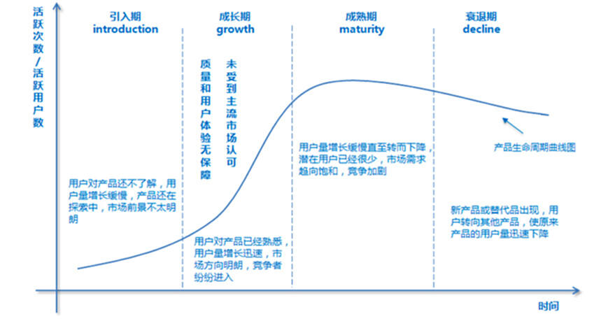

**在这一节中，我们将通过一些案例：**

* 了解产品生命周期背后有哪些运营人员需要把握的逻辑与规律

* 理解运营人员应如何根据产品生命周期进行操盘

## 思考

一款产品，用户数是不是越多越好？

### 案例1：

先看一个案例，是黄老师真实经历过的一个案例。横坐标是时间，纵坐标是站内活跃的用户数。

以下是2013年某一阶段的站内表现：

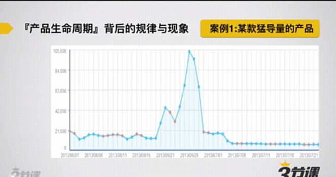

从图中可以看出，在2013年5月做了一波活动，让用户活跃度增加了5倍。但在活动结束后，用户活跃度下降到原来的数值，甚至比原来用户活跃数还要低。因为做活动时，此产品还未成熟时或者产品还不到时候时，用一剂猛药带动这个产品，因为产品时机不对或者药效过猛，导致产品直接死掉了。

### 案例2：

以下是某一产品的2015年的百度指数图，在2015年3月份爆红，但是之后就沉寂了。此产品就是足迹。

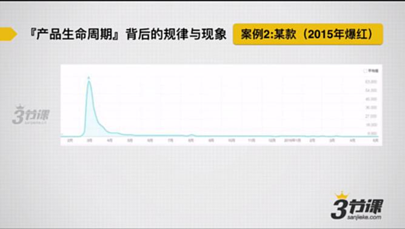

为什么在足迹这样的产品会出现这样事情呢？

有两个层次的原因导致这样的现象出现。

第一个层次原因：**很多产品在早期某一阶段，能服务好的用户数量天然就是有一个边界或者有上限的。那这个时候贸然拉动更大体量的用户涌入，会导致大量用户涌入，把产品挤爆了。**&#x8DB3;迹的表现来说，在那段时间，足迹的服务器是完全崩溃的，具体表现是大图发布出来、连接不上足迹、很多功能点使用不了等基本功能用不了，产品体验师非常差的。因为体验差，所以很难留住用户。所以很多产品在早期能服务好的用户数量是有限的。

第二个层次原因：很多产品在早期时候，更应该聚焦服务好的是创新者和早期采纳者，而不应该过早的去接入大众用户。而创新者&早期采纳者和大众用户的口味不一样的。比如说：足迹，一些用户在里面玩得很开心，这些用户会发一些大片、小清晰、文艺范的图片。突然有一天，有群人完全不理解文艺范和大片图片进入到足迹，他们完全理解不了这些足迹的这种调性。他们会发了很多乱七八糟甚至很low的图片，会发现新用户的增加无法给产品带来价值，反而会伤害了老用户的体验。导致老用户的离开。

类似的还有2016年的faceu。

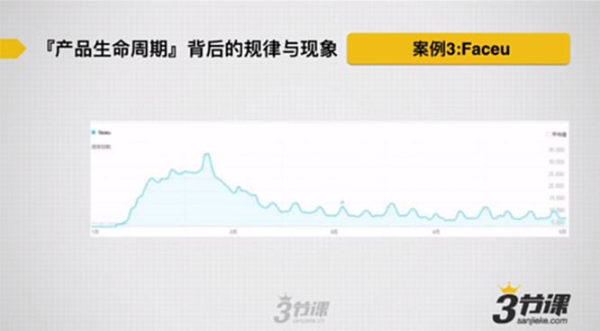

产品在早期贸然的引入大量用户，会对产品带来伤害。

### 特别重要的两句话

* **只有拥有自发增长能力的产品，才有运营价值！**——从产品的长期价值和运营的短期价值来说，如果产品的长期价值不明确，只是单一依靠运营创造短期价值来拉动增长，这种增长只能是短期的。只有当产品的长期价值确定了，不对它做主动推广，靠产品的价值和体验/服务就能吸引现有的用户，靠运营是可以放大产品价值，才能使用户留在产品。

* **要做符合【产品生命周期】的运营**——如果一款产品的发展偏离比较大的话，说明这款产品的运营风险比较大。常见的运营可怕曲线：

**第一种运营出现的可怕曲线**：探索期就拉动用户增长达到顶点。

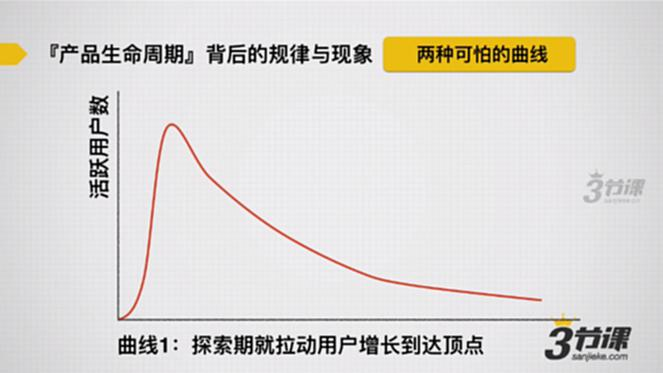

**第二种运营出现的可怕曲线**：产品缺少长期价值，活跃完全依靠运营拉动。

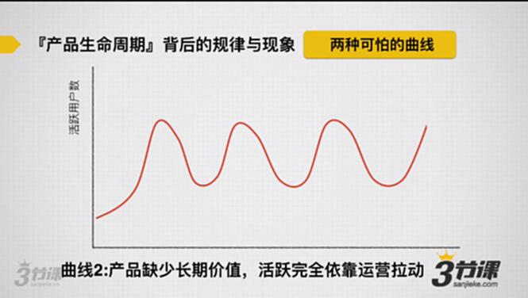

## 运营操盘：正确时候做正确的事。

### 引入期（introduction）

特征：用户对产品还不了解，用户量增长缓慢，产品还在探索期中，市场前景不太明朗。

**做正确的事：**&#x7531;于产品前期价值、市场前景不明朗产品以及功能不完善，需要思考产品的体验、性能、功能能不能满足用户，能不能给用户带来价值。

### 成长期（growth）

特征：用户对产品已经熟悉，用户量增长迅速，市场方向明朗，竞争者纷纷进入。

**做正确的事：**&#x5FEB;速成长，在这一时期，会有竞争者出现。如果跑得不够快，竞争者就会把市场蛋糕迅速吃掉。

**错误案例：**

①很多产品在探索期做大量增长，用户肯定会留不住，同时用户口碑非常糟糕。

②到了成长期时做大量探索，会导致老用户无所适从，用户体量大改版，会使用户大量流失。

用户体量数量参考：5万以下：早期，5万以上-市场用户数量80%：成长期。

### 成熟期（maturity）

用户量增长缓慢直至转而下降，潜在用户已经很少，市场需求趋向饱和，竞争加剧。

**做正确的事：**&#x589E;加用户活跃度，或者榨取用户价值，尝试商业变现。

### 衰退期（decline）

新产品成替代品出现，用户转向其他产品，使原来产品的用户量迅速下降。

**做正确的事：**&#x9632;止用户流失以及维系用户。

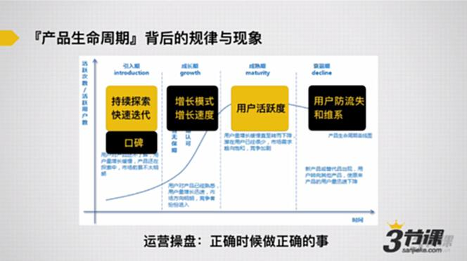

## 案例1：三节课

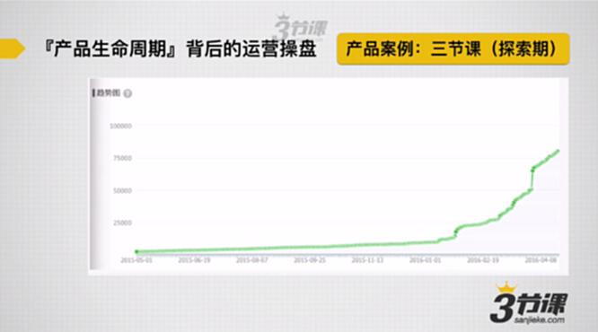

**【重要的事情】在产品探索期做出口碑，唯一要做的事情就是做出超出预期体验的事情。**

三节课做超出预期的体验事情：

①2天2000元的课程变成免费：有条件的免费：挑选用户、填写问卷等。

②在早期2014年底到2016年初，线下授课服务用户，其中80%的用户都会一对一的聊天服务。为用户解答问题、分享案例等。

## 案例2：成长期：滴滴出行的用户增长

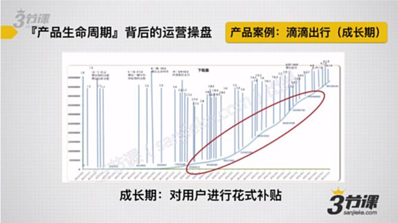

成长期常见用户增长的运营手段：

效果类广告投放、事件类策划、持续拉新的活动等。

对于消费类产品，最好的手段就是补贴。

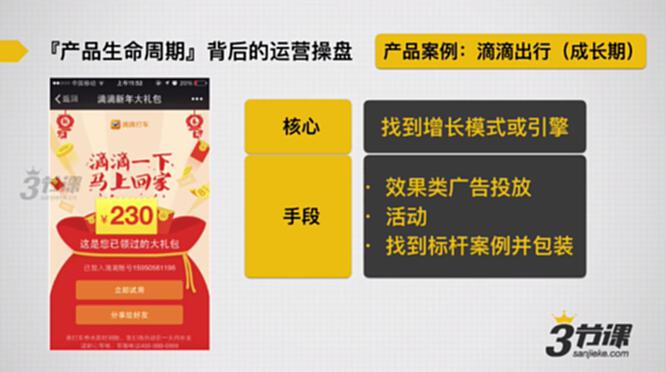

## 案例3：成熟期产品：美柚的用户价值榨取

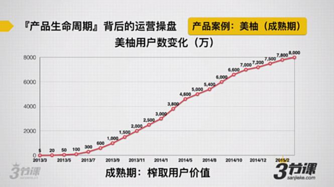

成熟期运营：用户的活跃度和商业模式的探索。

典型运营手段：

把整个运营体系精细化、用户细分。活动需要有规律进行、用户激励体系。

美柚做了：

①签到：榨取用户活跃度；

②站内广告：有推广标签；

③我的柚币：虚拟货币，榨取用户价值。

## 总结

互联网运营的逻辑，是一种有节奏的、回报后置的逻辑。

**具体说：**

互联网产品，都是通过早期大量补贴用户，大量给用户带来价值，在后期才能换来商业化的可能性。

所以：互联网运营的逻辑，是一种有节奏的、汇报后置的逻辑。
