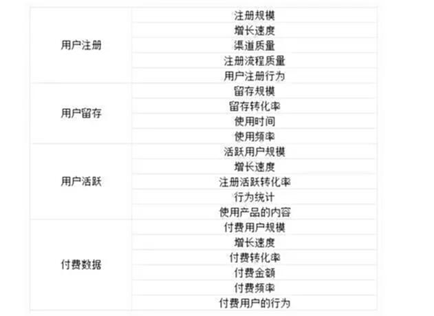
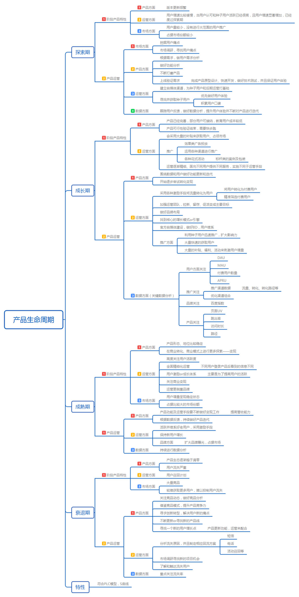
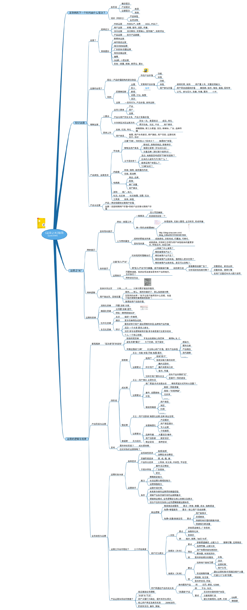
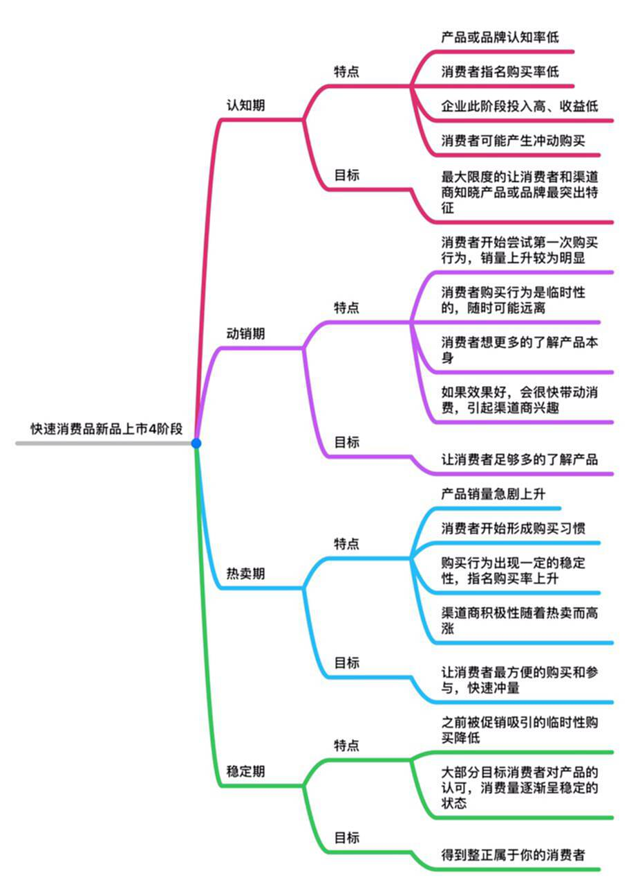

# 扩展阅读

关于产品生命周期背后的运营规律，有璨老师写过一篇文章，推荐阅读：

《微博、知乎、滴滴、映客，这些成功产品背后的运营，究竟有无规律可循？》

围绕着一款产品的生与死，运营工作该如何规划，以及背后是否存在一些规律可以被遵循。其实存在**两条主要的线索**可以进行探讨：（两个维度考虑）

* 第一，依据**不同的产品发展阶段**，或**当前占据市场份额的大小来判定运营策略和运营规划如何制定**；

* 第二，依据**不同的产品形态和业务类型**，来**判定运营策略和运营规划如何制定**。

**【总结】**&#x8FD0;营的策略和规划可以从产品的两个维度看，**产品自身的发展阶段（或者市场份额）和产品的业务/形态的类型。**

## 一、探索期产品

我们先明确一个基本论点：探索期产品的运营目的不是为了获取大量用户，而是为将来有一天自己能够服务好大量用户做好一切必要的准备。包**括：产品功能上的、产品使用体验上的、产品风格和氛围上的、服务能力上的。**

…………………………………………我是具体例子略过的分割线…………………………………………

我们或许可以总结一下，对于一款探索期的产品而言，常见的运营要点有如下几个——

1. **挑用户。**&#x5C3D;力通过各种方式把可能会对你的产品带来伤害的用户（比如那种典型的走到哪儿骂到哪儿的“喷子”型用户），或是你暂不具备能力服务好的用户（典型如知乎在早期只关注创业、互联网相关话题）在早期拒之门外。

2. **尽可能通过邀请、BD等各种手段找到一部分“活跃”、在小圈子内“有影响力”的名人领袖型用户成为你的早期种子用户，然后通过服务好他们，让他们愿意自发为你背书，传播你的产品。**&#x4ED6;们的信任和背书，对于一款早期产品的价值是巨大的。且，对于这样的用户，如果你能服务好一个，很容易就能影响到一群人。

3) **对你的种子用户一定要给予各种额外关注，让他们感受到，在这里做一个用户与在别的地方做一名用户的感受是显著不一样的。**&#x8FD9;个逻辑其实也很浅显：既然我们已经说了早期产品的体验可能会很烂很不确定，**自然需要运营端投入更多的精力去给用户一个愿意留下来的理由**。

## 二、快速增长期产品

2016年上半年的映客、2014年的滴滴出行、2012年下半年到2012年的陌陌，他们的共同特点就是：**开始动用自己可见的一切手段、资源等，尽一切可能迅速占领市场。**

至于为什么要开始加速占领市场，一是产品已经准备好了，部分用户对于产品已有认知和接纳，用户教育成本变低；二则是，因为已经验证完了可行性，这个阶段往往竞品也会大量出现，所以如果跑得不够快，就很容易被别人干死了。

从它们自身所处的阶段来看，我们也可以看到一些共性——

1. **关于推广层面。**&#x5404;种渠道的铺设，从应用商店推广到效果类广告（如广点通等），往往从这一阶段开始上量。

2. **围绕着产品的各种事件、话题往往在这一阶段层出不穷。**&#x5982;映客现在动辄两三周就会有明星名人直播，如陌陌2012年下半年开始给自己贴上的那个“约炮神器”的标签并围绕着这一标签延伸出来的各种话题和传播，再如滴滴出行在2014年开始积极联合各大品牌策划跨界营销、事件营销等（如韩红的红包广告）。

3. **往往在这一阶段会通过大规模的补贴等行为迅速拉动用户增长速度，培养用户使用习惯，典型如滴滴出行在2014年几乎持续了整整一年的红包。**

4. **这一阶段，面向用户的运营，开始由粗放转为逐渐精细。**&#x4F8B;如，2014年的滴滴出行，开始会根据地区、时间段等的不同面向不同用户实施不同的补贴策略；再例如，映客上的主播们，到了2016年上半年这个阶段，已经开始被分类进行维护和管理了。

**总结一下——**

对于一款已经渡过探索期，进入到快速增长期的产品而言，核心目标就是能够快速获得用户增长，为了尽可能快速地占领市场，在各种推广渠道、方式上，这一阶段产品往往会全面出击，甚至是实施大量补贴等方式，力求尽快占领市场。

**另外，这一阶段的运营，会逐渐精细起来，会开始面向不同的用户提供不同的服务，或实施不同的运营手段。**

## 三、成熟稳定期产品

所谓“成熟稳定期”的产品，**必备前提就是其在相应领域中的用户数增长空间已经很小**，**产品已经拥有了较为稳定的地位。**

对照一下，2016年上半年的微信、大众点评、美柚、大姨吗等这样的产品，都属于已经进入到了“成熟稳定期”的产品。

这个阶段的产品，共同特点往往在于：**高度关注用户活跃度，高度关注商业变现路径，同时，面向用户的运营也开始全面精细化。**

…………………………………………我是具体例子略过的分割线…………………………………………

**总结——**

一款成熟稳定期的产品，理论上会进入到一个全面的精细运营期——针对不同的产品模块，不同类型的用户，都应该会有专门的运营人员去负责，给用户提供相应服务和讯息。

同时，这一阶段的运营工作，总体上会**以品牌形象的树立、用户活跃度和商业变现**三大方向为导向。因而运营端的具体工作内容往往包括了：**大量品牌传播活动与事件、大量面向特定用户且周期相对固定的活动、各种潜在的商业变现方式尝试及围绕着增加收入的运营。**

## 四、衰退期产品

衰退期产品，通常是上一个时代的一方霸主，但很显然，未来已经不是它的了，它以往的用户，开始大量流失，并转移到各类替代产品上。

所以，**这类产品的运营重点，往往是老用户的维系和生命周期管理。**&#x901A;过各种手段尽可能减缓老用户流失的速度，，争取能在潜在替代产品发展起来之前，自己先能做出一款良好的替代产品。

…………………………………………我是具体例子略过的分割线…………………………………………

**总结——**

一款衰退期的产品，运营基本只能维持和强化此前的各种常规运营手段以延长自己的生命周期，同时，面向流失用户的召回、承接等可能会成为这个阶段中一块比较重要的运营工作，只是，这样的工作往往成效不会太大。

关于产品生命周期各个阶段的运营策略，可以阅读：

## 《四大产品生命周期 | 运营如何明确不同阶段的目标和效果》

### 不同阶段的产品策略

产品生命周期的每个阶段都是有其目标的，我们要想制定出针对各个阶段最有效的策略，那么就要清晰认识到这个阶段的目的或者目标是什么。只有从目的出发，我们才能知道我们要做什么！

### 1、启动阶段（引入期）

对于这个阶段的产品来说，最主要的目标就是：**找到用户痛点，做好功能分析，迅速上线验证，种子用户认可**。

如果要实现这个目标，那么我们可以采取这样的方法或者步骤：

①通过**市场调研的方法找到用户痛点**；

②根据用户需求，做好需求分析；同时建立自媒体通道，为种子用户和后期运营打基础；

③迅速完成原型，做好设计，快速开发，做好产品测试，保证用户体验；

④获取种子用户，跟踪并做好意见反馈，做好数据分析，不断改进和提升产品体验，以获得种子用户的认可。

问题4：产品初期运营需要哪些运营数据支撑？

我的答案：

这个阶段主要做好用户的体验，产品功能、性能以及价值对用户很重要。做好用户反馈、服务更重要。

对于产品消费类，需要做好的是产品质量、后期服务。运营指标可能会有：渠道来源、产品退货率、产品复购率、产品投诉、产品后期服务咨询量。提升口碑的服务：跟随产品赠送礼品、产品趣味说明、专属感谢信等手段。

对于服务类产品，需要做好的运营指标内容可能有：用户反馈、用户评价、用户内容阅读量、停留时间、跳出率、渠道来源。提升口碑服务：建群提供定期分享、解答服务，主要是关注每一个用户对产品问题的反馈和建议，及时给出合理的答复。

### 2、成长阶段

对于这个阶段的产品来说，**最主要的目标就是：获得用户，转化变现，建立品牌，名声远播。**

如果要实现这个目标，那么我们可以采取这样的方法或者步骤：

①利用前期积累的种子用户迅速推广，扩大影响力；

②加强运营团队建设。主要围绕运营展开工作，一方面做好拉新，促活和留存工作；另一方面搞好品牌建设；

③继续建设好官方自媒体通道，同时与外界媒体保持联系并搞好关系；

④**做好数据分析：【重点内容】**

* 用户方面要重点关注用户留存率，DAU（日活跃用户数量），MAU（月活跃用户数量），以及付费用户数据和ARPU（每用户平均收入）等数据；

* 推广方面要重点关注推广渠道数据，根据数据优化渠道组合；

* 品牌方面要重点关注百度指数等等数据；

* 产品方面要重点关注页面访问数据，跳转数据，访问时长，用户使用路径等等方面；

* 关于数据方面要关注的指标，这里有一个表格可以提供参考：

⑤产品方面，要围绕数据和用户做好功能更新和产品迭代；

⑥采取**各种激励手段将流量转化为用户**，将**用户转化为付费用户**，在这里需要精准的选择好付费用户对象，有时候并不一定所有的用户都是产品的付费转化目标。

### 3、成熟阶段

对于这个阶段的产品来说，最主要的目标就是：**活跃并维系好老用户，同时保持新用户增长，继续稳定地实现创收盈利。**

如果要实现这个目标，那么我们可以采取这样的方法或者步骤：

①活跃并维系好老用户，主要利用运营手段，**采取激励体制激活他们**；

②继续**数据分析以及产品迭代工作**；

③继续做好**用户转化变现工作**，**进一步提高营收能力**。

### 4、衰退阶段

对于这个阶段的产品来说，最主要的目标就是：**尽力做好用户回流工作，同时更新产品线，寻求创新和转型，以求解决用户新的痛点，从而继续占领市场**。

如果要实现这个目标，那么我们可以采取这样的方法或者步骤：

①想办法**了解和触达流失用户**，然后通过运营将他们最大程度的回流；

关于**用户流失数据的分析**，这里有一个表格可以提供参考：

②继续做好其他方面运营工作，数据分析方面重点关注回流率；

③关**注竞品的动态，做好竞品分析，借鉴竞品模式，提升产品竞争力**，以求从竞品手中抢夺用户，或者不被抢走用户；

④进行市场调研（包括竞品分析），寻求**新的项目机会，或者更新产品线**，想办法满足用户日益增长的新需求的目的。

\<END>
