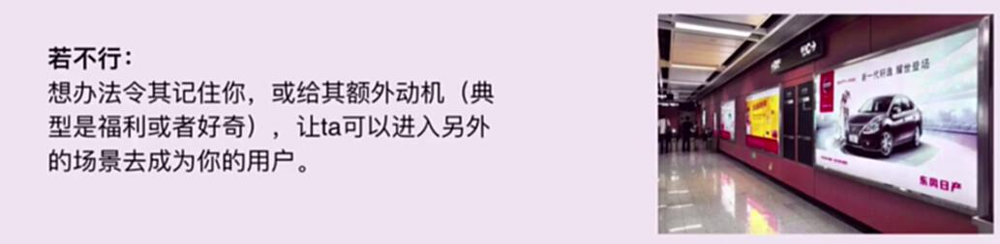
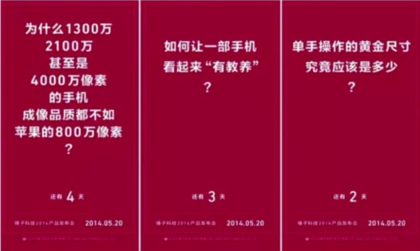
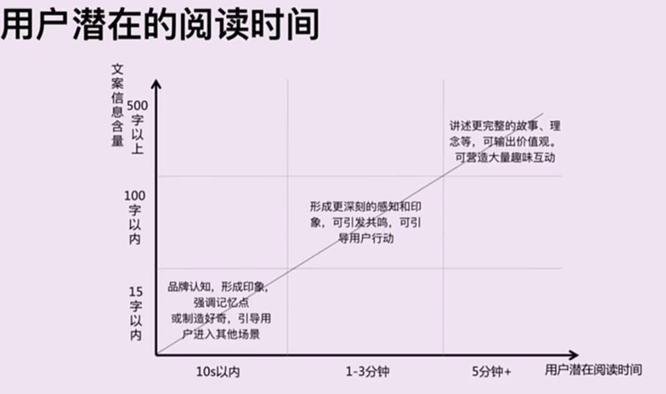
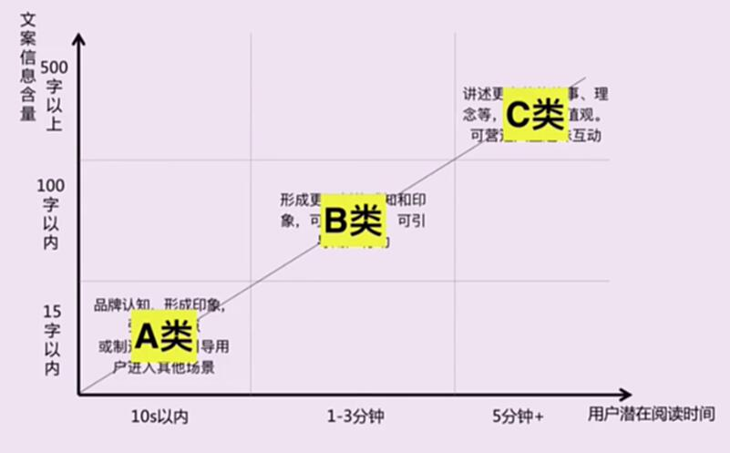
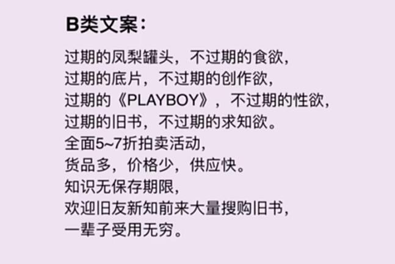
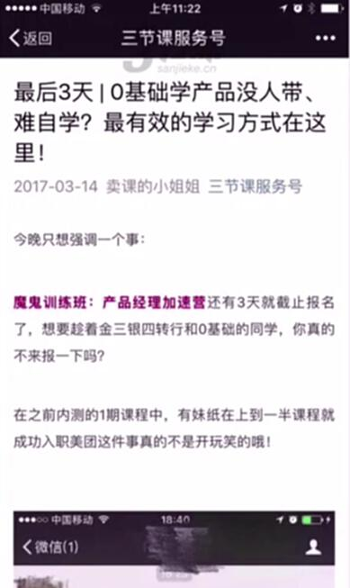

# S2.10 转化所处场景与潜在阅读时间

## 课程导读

本节课探讨用户所处场景与潜在阅读时间对文案策略的影响。

---

## 用户所处场景是否可以直接形成转化

### 情况1：可以直接形成转化

**策略：** 想办法让用户产生点击或购买等具体行为

**典型做法：** 在PC或手机上，点击就可以下单。给用户一个动机、优惠或痛点刺激，让用户发生下一步行为（下单）即可。

### 情况2：需要跨场景

**策略：** 想办法让用户记住你，或给予额外动机（福利或好奇），让用户进入另一个场景成为你的用户。

**案例：** 锤子科技发布会——利用海报引起悬疑，让用户持续关注。

---

## 用户潜在阅读时间

用户在不同环境、不同场景下，阅读文字的时间不同。不同场景需要不同文案来传递信息。

### 三种类型

| 类型 | 阅读时间 | 文字量 | 传达信息 |
|-----|---------|--------|---------|
| **A类文案** | 10秒以内 | 15字以内 | 品牌认知、形成印象、强调记忆点、制造好奇、引导用户进入其他场景 |
| **B类文案** | 1-3分钟 | 100字以内 | 形成更深刻的感知和印象、引发共鸣、引导用户行动 |
| **C类文案** | 5分钟以上 | 500字以上 | 讲述更完整的故事和理念、输出价值观、营造大量趣味互动 |

---

## 案例展示

### A类文案示例

- 怕上火，就喝王老吉！
- 三节课，一所不包就业、不包涨薪、不包学会的互联网人在线大学
- 不是所有的人都需要打开这份邮件，除非……
- 锤子手机，全球第三好用的手机

### B类文案示例

### C类文案示例

---

## 核心要点

当用户给予充分的时间时，需要关注的点是如何更好地说服用户，而不是文案字数问题。
