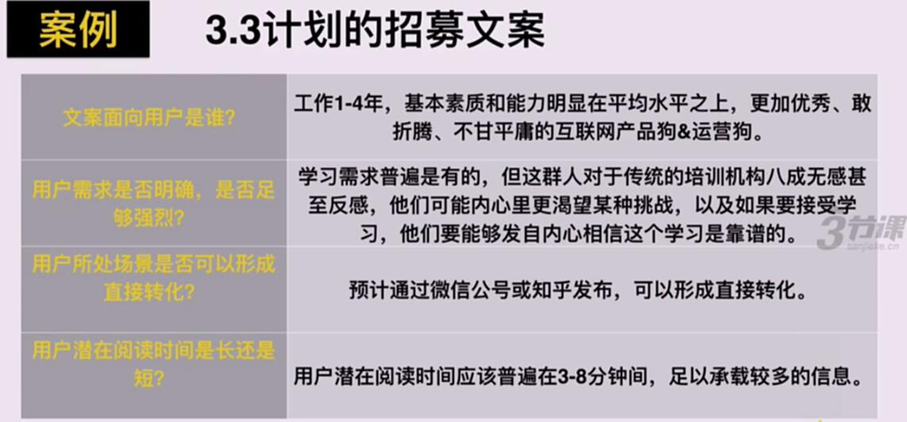
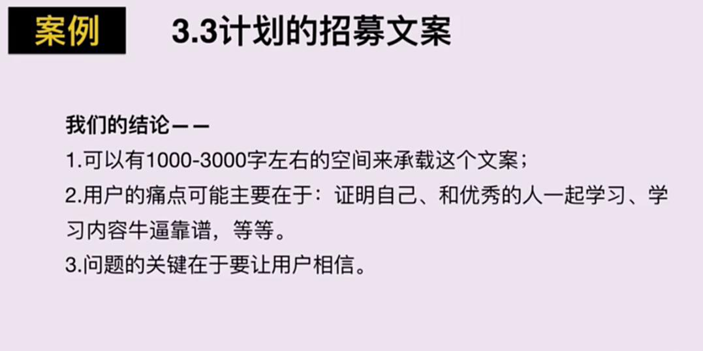
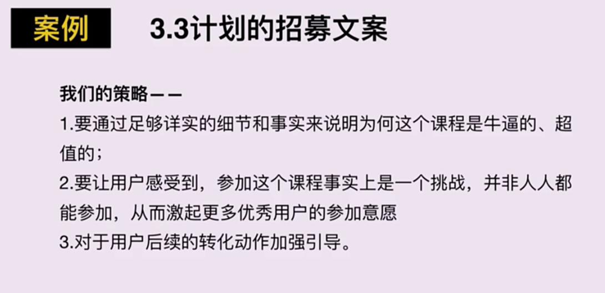
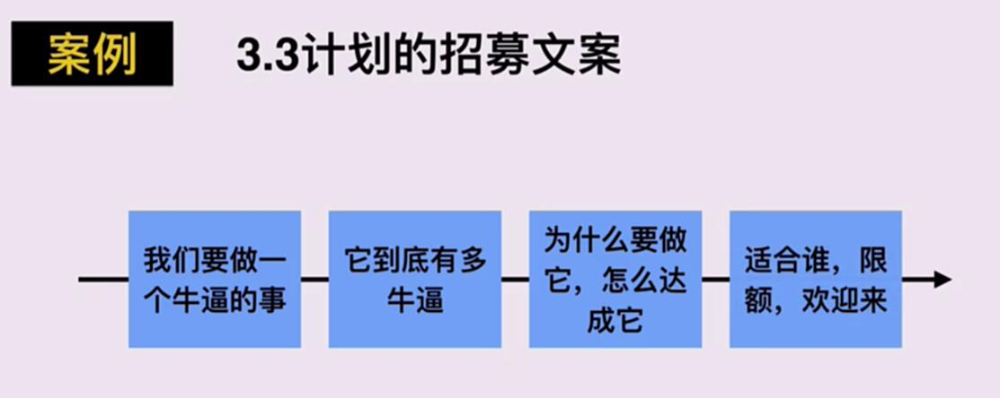

# S2.11 指定文案转化策略的总结

## 课程导读

前文介绍了用户所处场景与潜在阅读时间对文案策略的影响，本节进行总结。

---

## 策略制定四步骤

**【特别说明】** 在进行此步骤之前，必须明确用户痛点和卖点，再根据图中四个步骤逐步确认策略内容。

---

## 案例分析：3.3计划的招募文案

### 步骤1：明确目标用户

### 步骤2：分析用户需求

### 步骤3：确定场景和阅读时间

### 主要内容逻辑

---

## 实施效果

第一次发出此篇文案，有600-700个申请。

