# S2.13: 班会分享，逐字稿，BY 嘿罗

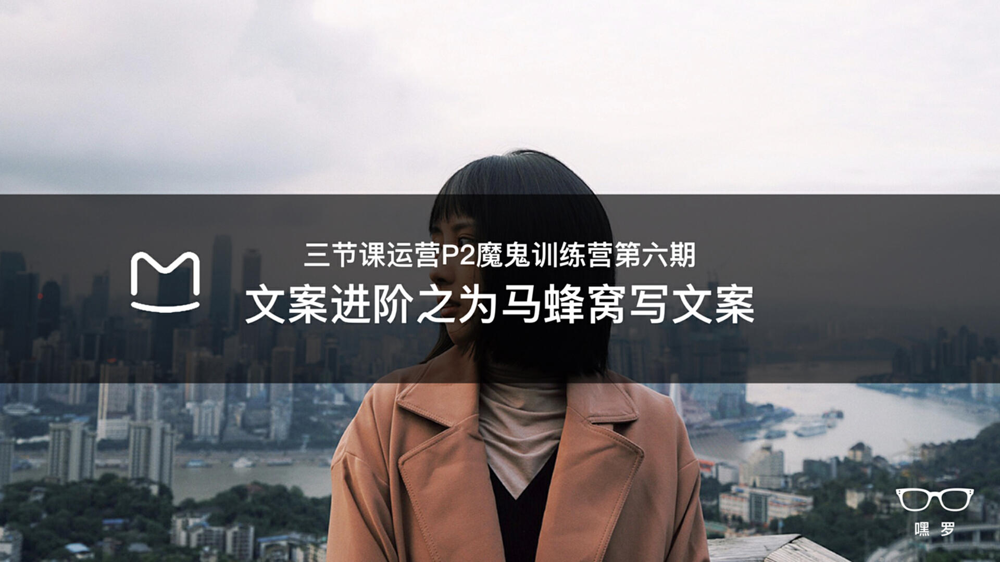

hello大家好，我是你们的助教嘿罗，今天由我来给大家做文案进阶课的课后分享。这是我第一次做这样的分享，如果在分享过程中，有什么问题或可以改进的地方，可以向我们的羽珂班班，或者我来提出反馈，欢迎大家一起来交流学习。

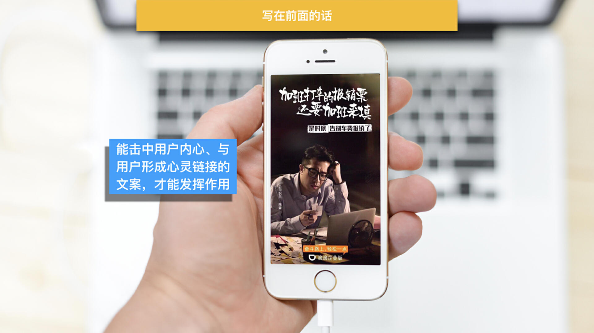

在分享之前呢，先恭喜各位小伙伴已经顺利完成前两周的课程学习，每一位认真学习课程、完成作业的小伙伴都非常优秀，也希望都能够坚持下去，三节课的班班们和每一位助教都将会陪你们走到最后，让我们一起加油！

在分享之前，我对这个文案其实有个感触的，就是“能击中用户内心、与用户形成心灵链接的文案，才能发挥它的作用”好比上面滴滴的海报，相信很多小伙伴如果曾经经历过这些因为出差回来还得加班贴发票的事就很有感触了，这也是为什么老黄经常强调的文案有感和无感。

好啦，废话不多说，我们正式开始今天的分享。

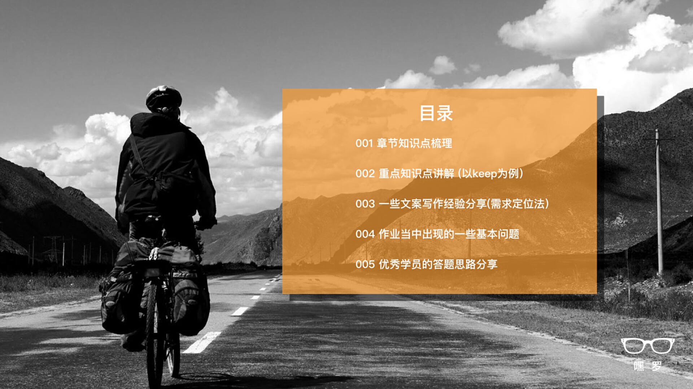

现在分享开始，今天的分享总共分五个部分，第一部分我们先来简单的梳理一下本次文案课程的知识点；第二部分我将分享一个的相关案例，并总结出来关于文案的套路；第三部分我们来分享一下我在一些文案写作中的一些经验，主要是遇到问题时候的一些思考分析方法，我会以用户画像来举例；第四个部分就是写作业时会踩到哪些“坑”；接着第五跟第六部分就是我们期待已久的优秀学员的表彰跟分享啦！

好，我们先进入第一个环节

文案课知识点梳理

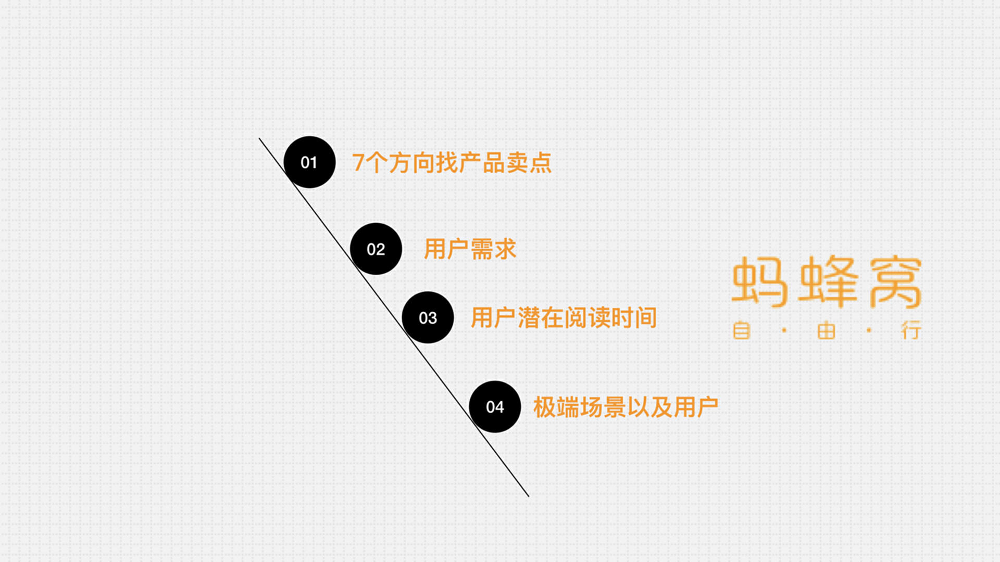

本次文案课讲了四个知识点，分别是：7个方向找产品的卖点；阅读文案的用户需求；阅读文案的用户潜在阅读时间和使用极端的场景及用户来写文案。

相信对于很多小伙伴来说，文案是最头痛的一项工作，但又是运营人员必不可少的技能。我们总认为写文案是内容运营或者小编的事，但是我们不管是做活动运营也好，用户运营也好，能写文案的优势也是非常明显的，所以我们父辈常常倡导的：学好数理化，走遍天下都不怕的理论对于运营来说有些过时了。

而对于今天的这四个知识点，我们看似跟平时写文没什么太大关系，可以细细琢磨却发现都是相辅相成的。

一个好的文案，需要对产品了解，找出产品的差异化，也需要了解潜在用户的需求；需要了解当用户在不同的场景下看到文案，所付出的时间不同，生产出来的文案也应该不同，更需要知道一个百试不爽的通用场景来将自己从琐碎的运营工作中解救出来。那么嘿罗兄选取了其中三个个非常重要的知识点给大家详细解决一下。

好，先来看我们的七个方向找卖点：

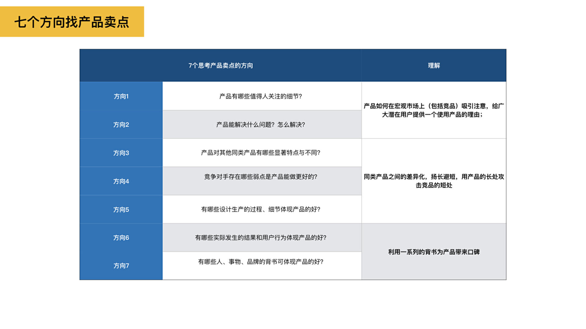

这里面总结出来其实分为自己产品的优点、制作细节、竞品的差异化跟用户背书几个方面。有些小伙伴可能会觉得比较难，但是你回想一下，这些点其实并不是你开始写文案的时候才开始总结收集的，而是当你开始准备要运营一个产品的时候，就需要开始考虑的。其实整个文案模块里头，出题思路也就是先想让你了解一个好文案应该具备哪些点，也就是文案的最终效果就是让用户读懂文案，那么接下来就是第一点，从头到尾感受一下基于产品的细节，事实和场景去找准产品的卖点，从而到制定策略到组织输出的全部流程。

需要注意的是，因为你最终的文案一定是落地到细节的，所以在你找卖点的时候一定要有细节没有细节很难写得出文案，要写好一个文案，往往要包含产品的一些细节事实，场景的卖点，然后再把卖点转化成你的文案。

另外一个就是，要注意用户视觉，往往很多时候我们是现在自己产品本身的角度去说话的，比如说马蜂窝获得多少轮融资，有哪些投资人。那其实这种对用户来说是产生不了价值的，用户对这种信息是忽略的，也就是说很有可能是在自嗨，所以我们需要站在用户的角度上给出产品的利益。

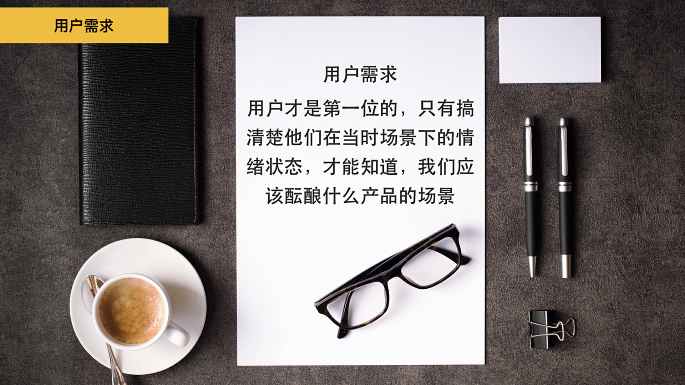

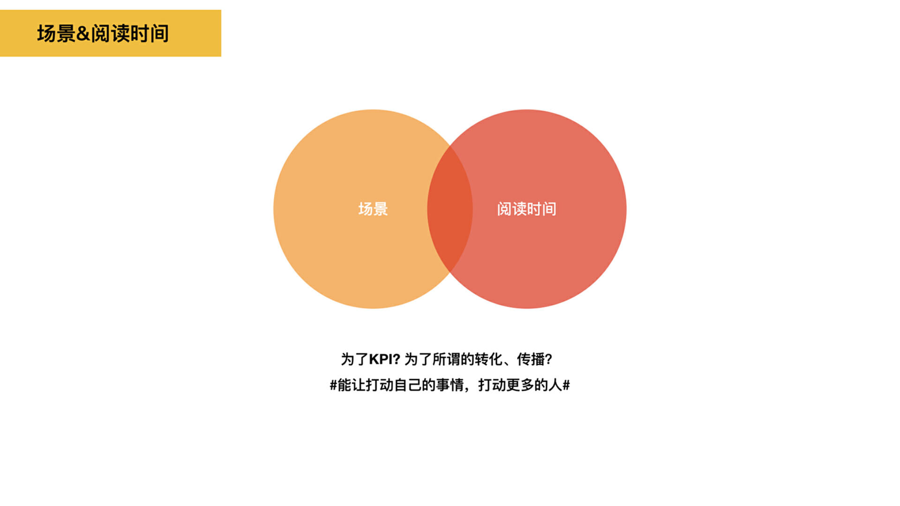

接着是用户的潜在阅读时间：

这里包含几个信息：用户所处的场景、用户的潜在需求、用户所能付出的时间及我们能提供给用户什么。细细回想一下，当我们最初做产品的时候，是不是也是需要这些点的信息呢？

其实我觉得做运营很多时候得要感性一些，好比是前网易云音乐乐评列车操盘手吴俊鹏，在地铁上“每个人都面无表情，像僵尸一样，互相孤立。”这是吴俊鹏当时最大的感受，他曾经在地铁和人打架，被带到派出所交了500元罚款才被放出来。“**为什么我们生活的够不容易了，还要在地铁里这么不开心？**”这段经历让吴俊鹏印象深刻，他暗暗地打算，“一定要做点什么拯救地铁的不开心”，乐评列车就此埋下了种子。

试想，要是脱离这个不开心的场景，反而把这些乐评在欢乐谷或者长隆动物园里面打广告，可能就没有这个效果了，因为人当时候的场景是处于短暂的快乐的，自然对这些无感。理解哈

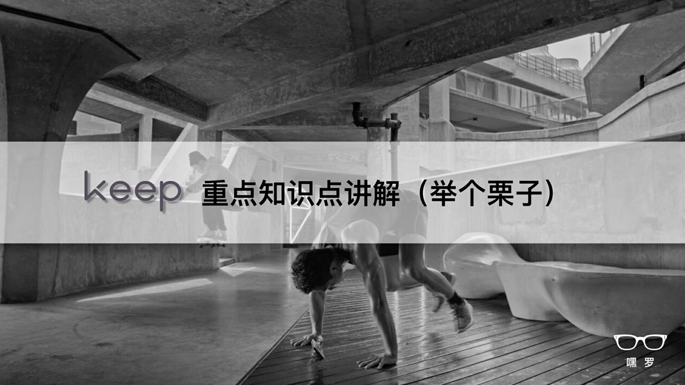

好，现在大家一起来看个栗子，我以keep为例，重头到尾把这两份作业过一遍，大家看看这样的理解和分析下，对7个方向思考卖点以及思考文案的转化策略是不是更加清晰了：

目标拉新用户群体为——移动互联网主力、且热爱健身的网民群体。

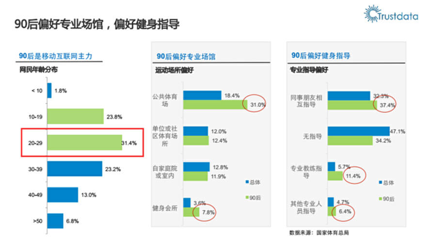

**从数据上看，我们锁定90后为目标拉新用户。**

**第二步，目标拉新用户的需求**

根据trustdata的数据，我们整理出90后的特点以及需求，如下图所示 

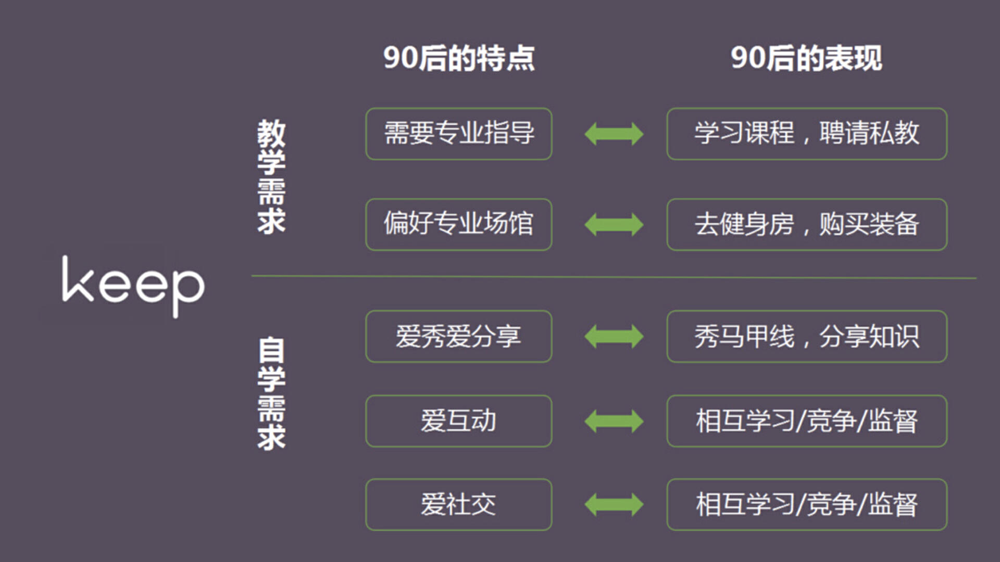

总结90后需求为 

1. **需要专业指导**

2. **偏好专业场馆**

3) **爱秀爱分享**

4) **爱互动**

5. **爱社交**

从“深层需求、人性需求”进行分析，得出 

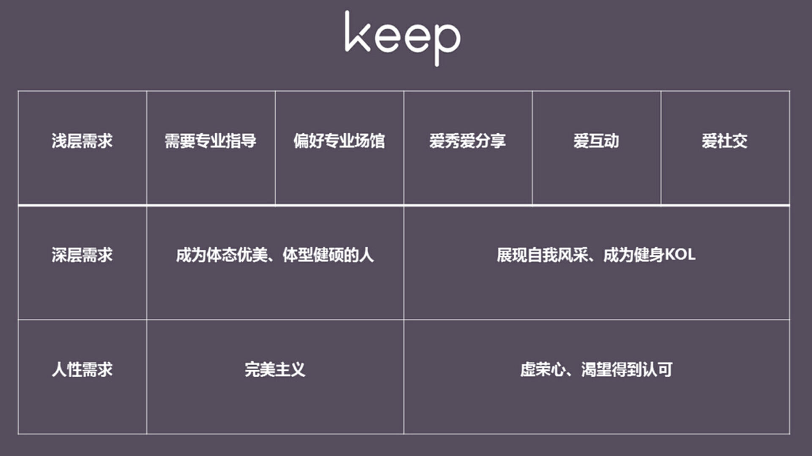

而这时候我们解剖了keep的核心产品逻辑之后，可以梳理出最核心的产品业务流程

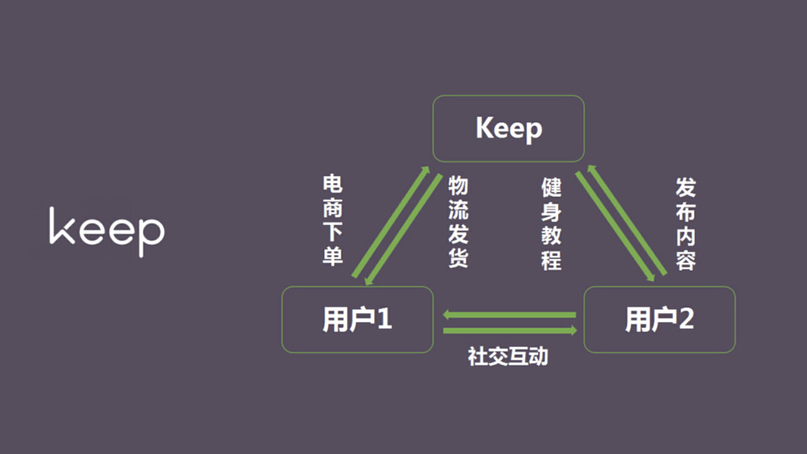

这是Keep的核心业务流程。为方便理解，简单说明一下，Keep为用户提供健身教程和专业的健身设备（商城），更好地让用户下单选购商品和锻炼塑形。同时，用户在健身时发布内容，形成UGC内容生产机制，提供给Keep。用户之间可在内容中互动，形成社交。

所以根据上面的定位分析，我们可以得到以下的7个方面卖点：

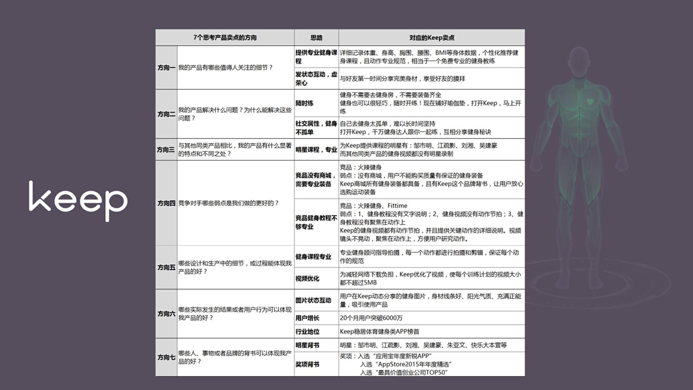

可以看出，所得到的卖点的思考方向，都是紧贴着之前的分析思路去进行的，这样子就可以保证在思考文案的时候，起到一环扣一环不会偏离了；

好这是7个卖点的分享，接下来就是转化策略方面，**转化型文案，需击中用户痛点、唤醒用户需求，进而达到转化用户的目的。**

假设我们文案要面对的是一群程序猿：

**一、目标用户的锁定及痛点**

**目标人群为IT程序员。**

IT程序员面临着两大问题是——**身体的健康问题和单身问题**，而这两种问题都能通过健身来改善。从健身的角度来分析问题的原因： 

**1、身体的健康问题——缺乏锻炼**

**2、单身问题——缺乏阳光、身材较差**

**既然健身能改善这两个问题，我们来看看能利用哪些痛点来撬动程序员使用Keep**

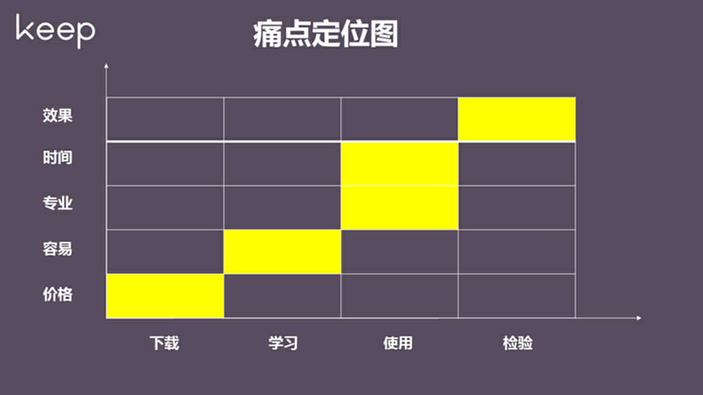

简单说明痛点定位图的含义： 

1. 价格：（下载）参加健身，是否需要收费

2. 容易：学习健身是否容易上手

3) 专业：健身教程是否专业

4) 时间：使用参加健身课程，每次锻炼需花费的时间

5. 效果：参加健身课程一段时间后的效果如何

**二、目标人群的需求分析**

接下来我们根据程序员对健身的痛点，提炼为需求，并对需求进行深度分析 

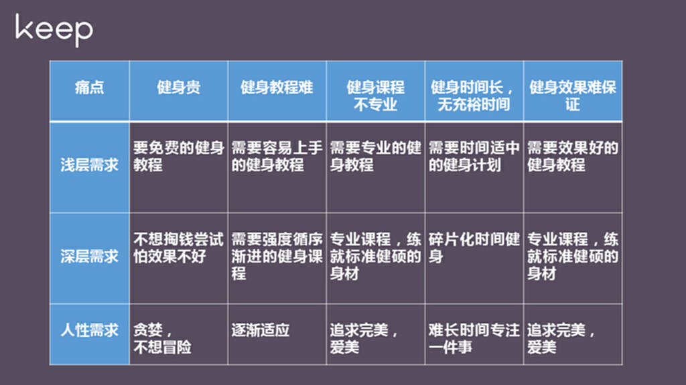

现在我们需要对需求的强烈程度进行判断，刚需？可有可无的需求？趋于没有的需求？ 

判断为可有可无的需求，理由如下

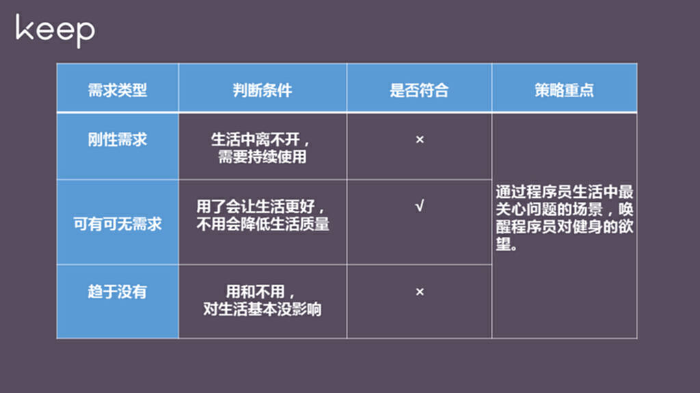

**三、匹配Keep的卖点**

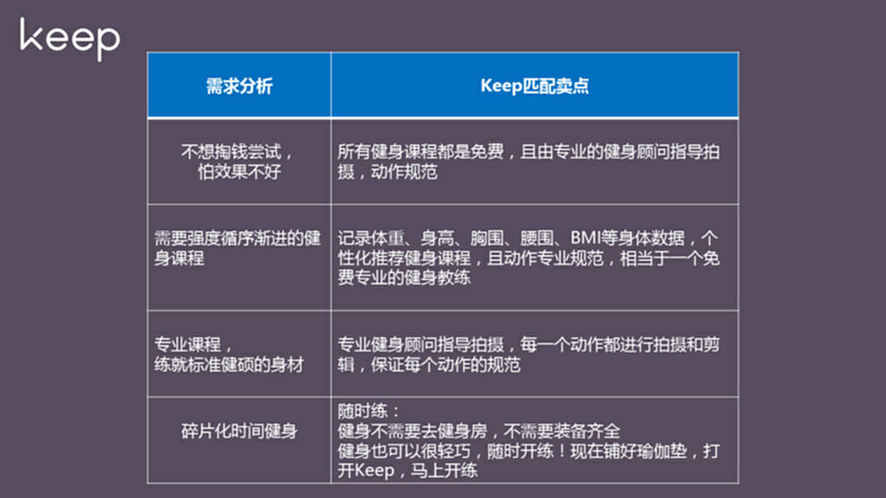

**四、制定文案转化策略及最终文案**

这需要我们了解三个渠道的人群对广告的阅读情况，要尽可能吸引到人们的注意，进而考虑转化or品牌宣传。 

还有一点，这三个渠道都是偏大众的渠道，所以文案除了转化程序员下载并使用keep，还要考虑大众对广告的参与性。 

1、渠道分析及策略

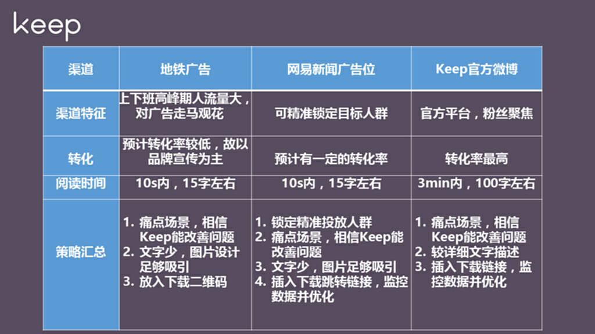

2、渠道文案 

①地铁广告 

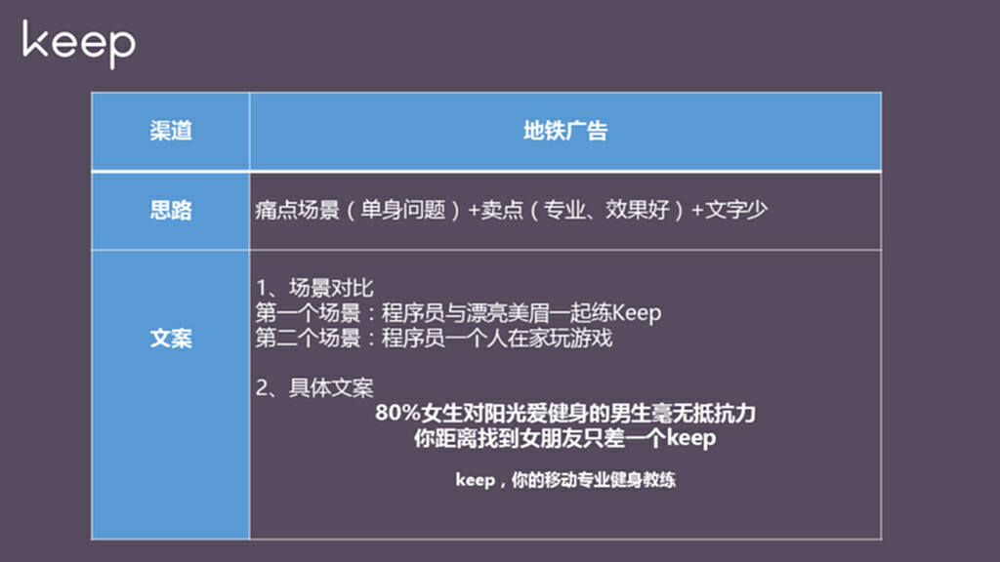

②网易新闻广告位

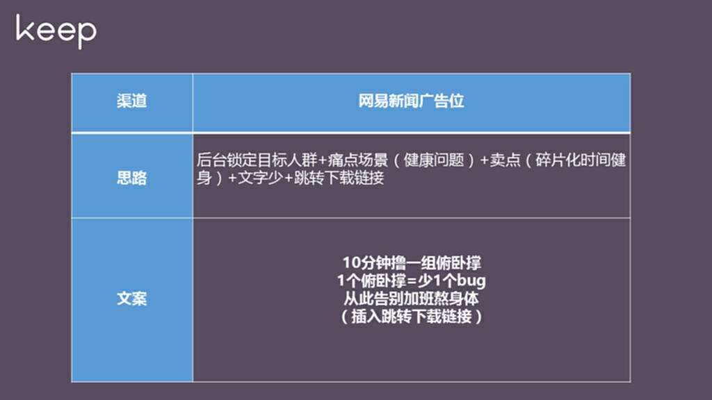

③Keep官方微博

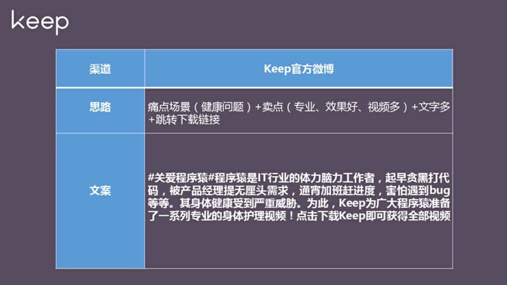

另外，也顺带讲一下极端场景的吧，首先也一样，从四个心里 出发，

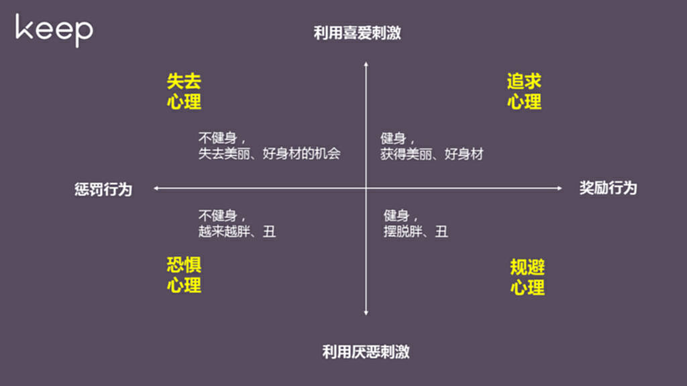

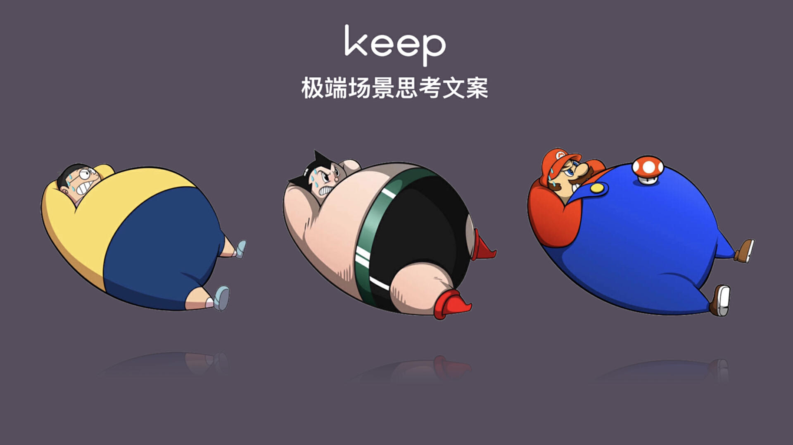

好，那么现在大家或许有疑问，上面这么多花样，到底这些用户心理都是怎么着手分析啊，应用到我自己的工作岗位上，怎么做？OK,其实方法都有很多，毕竟每个人的思考方式都不一样，但我今天就说一个比较简单粗暴的栗子，可以让大家快速掌握这个方法论，我们以分析用户画像为例：

事实上往往，当你有个很好的IDEA的时候，你一股脑筋往老板的大门敲，然后说了一通你的激动想法，结果很有可能迎来的是这个场景

那这时候，一个完整的分析是非常有必要的，好比如果让你对某个产品做个用户画像，那么这时候你的群体和需求该怎么把握呢？

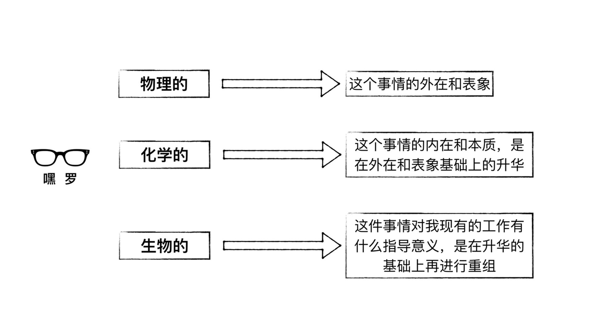

这时候我们可以从物理的、化学的、生物的三个角度进行考虑。

  首先物理的，就是我们目标用户的显性特征，如年龄、性别、地域分布等；

  其次是化学的，也就是我们目标用户的隐性特征，他们的潜在需求和行为喜好等；

  第三是生物的角度，就是基于目标用户的显性特征和隐性特征基础上制定出的运营策略。

So，通过这种思维方式让我们发现其实做用户画像很简单，只需要从三个方面切入即可，也就是从显性特征、隐性特征以及基于显性和隐性特征基础上的运营策略的制定

——这样是不是做用户画像就明确多了呢？

OK, 我们举个不太恰当的栗子

**假如你走在大街上，看到迎面走来了一个前凸后翘、长发飘飘、五官精致、皮肤白皙、大腿修长的美女，这时候哪些是显性特征，哪些是隐性特征？**

**假如这时候你拿到这位女生的微信号，最直接了解她的方式有可能是把朋友圈都研究一遍，她的基础特征，年龄，职业，地域，兴趣，发朋友圈频率，分享的公众号文章是什么，然后这些文章打个标签归个类，情感类别的多，实用干货的多，还是搞笑分享的多。隐性特征就是，她发这些图片，文字，分享文章背后的目的，偏好，浅性需求，深层需求，心理特征，分享当时场景猜测等等等，要是能折腾个一天估计第二次约女神出来，总不会没有话题聊吧。**

**好，这是我想分享的一个平常工作中比较常用的思维套路，用到分析工作上，管理上，复盘上，甚至是对老板的掌控和管理，对甲方粑粑的把控，对饭局的准备，等等。希望也对大家有所帮助。**

**好啦，下面我们回来我们的作业里头，看看都有哪些“坑”是大家要值得注意的**

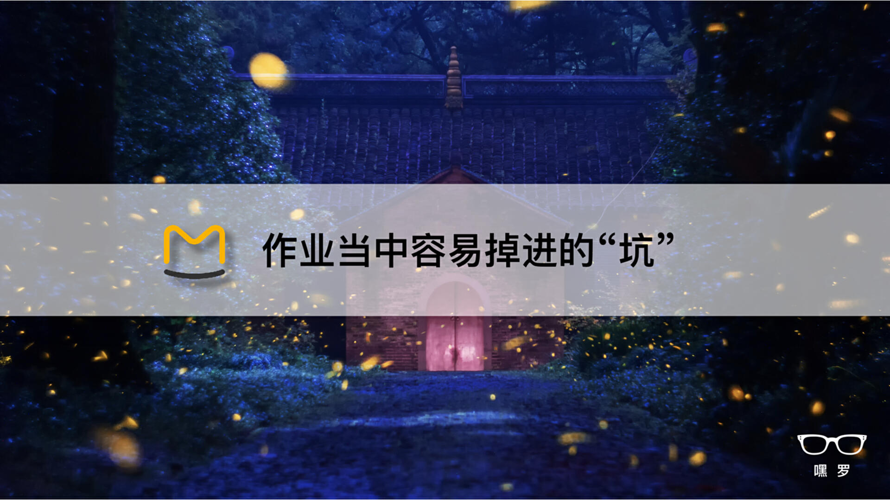

这次作业会掉的那些“坑”

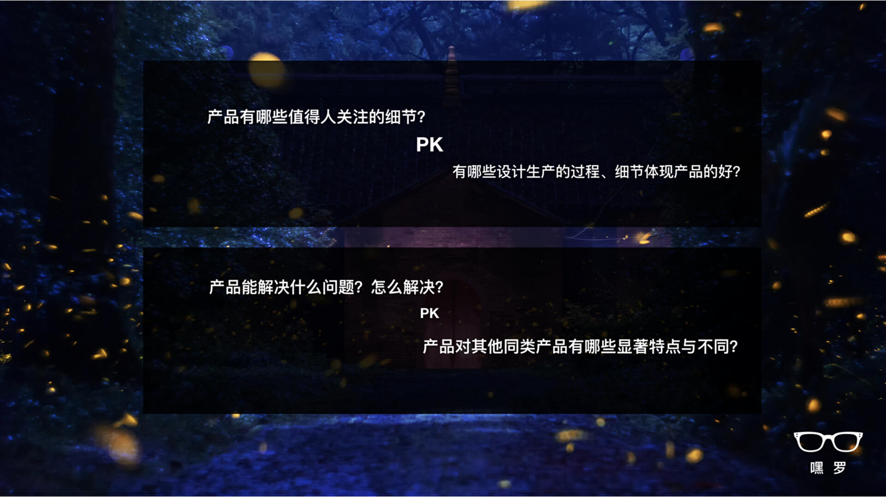

图片中所列出的是我们这次作业中会碰到的相对来说比较大的问题

问题一：我产品值得关注的细节与哪些生产细节或过程体现我产品的好，这两个问题不是同一个吗？为什么要列成两个问题。

先说前面的，我产品值得关注的细节，这个就是说，在马蜂窝APP里面，有哪一个功能板块上的哪一个点，指代的是这个产品本身的一个细节；

而后面的，哪些生产细节或过程体现我产品的好，这个就是比如在创作马蜂窝APP，收集一些用户感受的时候，采访了多少个人，然后徒步走了多少公里的路，怎么怎么样的，及时这个产品在研发设计的过程中的细节；

问题2：我的产品能解决什么问题跟与其它同类产品相比的特点比较容易混，其实我们可以这样理解，从细节入手，前面那个问题从方法入手，后面的问题从一些特点的细节入手来回答这个问题。我们同学在写作业的时候很多时候我们的产品解决什么问题，他把说得范围太大，比如解决什么出行旅游的问题，这种就是说如果在没有马蜂窝产品这个时候，你有可能发现这个行业的需求和痛点然后去研发一个什么东西去解决，但如果有了马蜂窝这个产品我们要去解决什么问题，这个就是要落实到APP里面的一些细节了，另外一点需要注意的是，很多同学回答了解决什么问题，但怎么解决这个方面没有回答到哈。 第二个方面和其他同类产品有哪些显著特点与不同，在这个方面，希望大家真正落实去找一下一些竞品，找到一些细节和事实，但这时候要给出的不要是一些判断性的描述，而是更多的是一些事实的描述，不然的话，最终出来的文案就会变空洞了。

这两个问题也是大家在作业中比较常出现的问题。

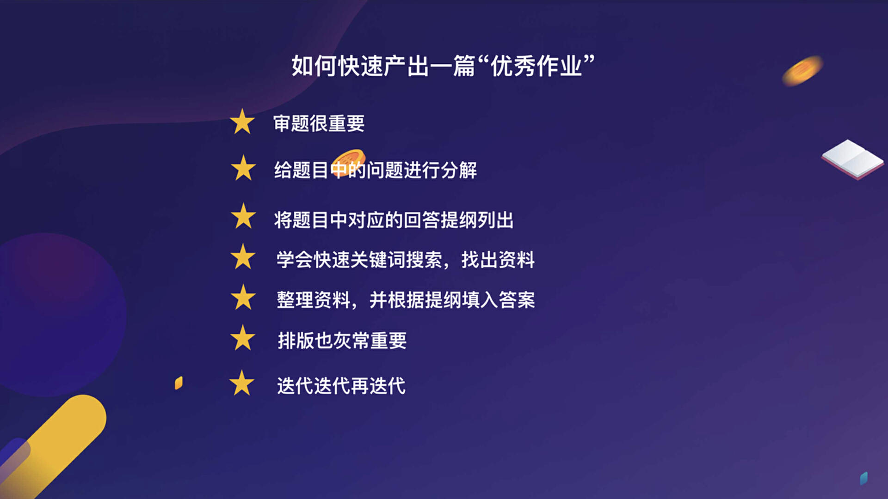

最近还有一部分的小伙伴常问：如何快速产出一篇“优秀作业”，嘿罗今天根据自己的学习经验和助教大大们提出的一些技巧，总结出一套方法，希望能在接下来的作业中，帮助大家快速产出一篇“优秀作业”。这里嘿罗建议小伙伴们可以把这个屁屁踢保存下来，在之后写作业的过程中作为一个自检清单，看看你做到这些了吗？也可以常常拿出来提醒自己哟！不过“优秀作业”很重要，把课程的知识点消化应用到工作中更重要，希望大家在后面的作业中，每一次都拿优秀，在接下来的工作中，也每一阶段都是优秀。

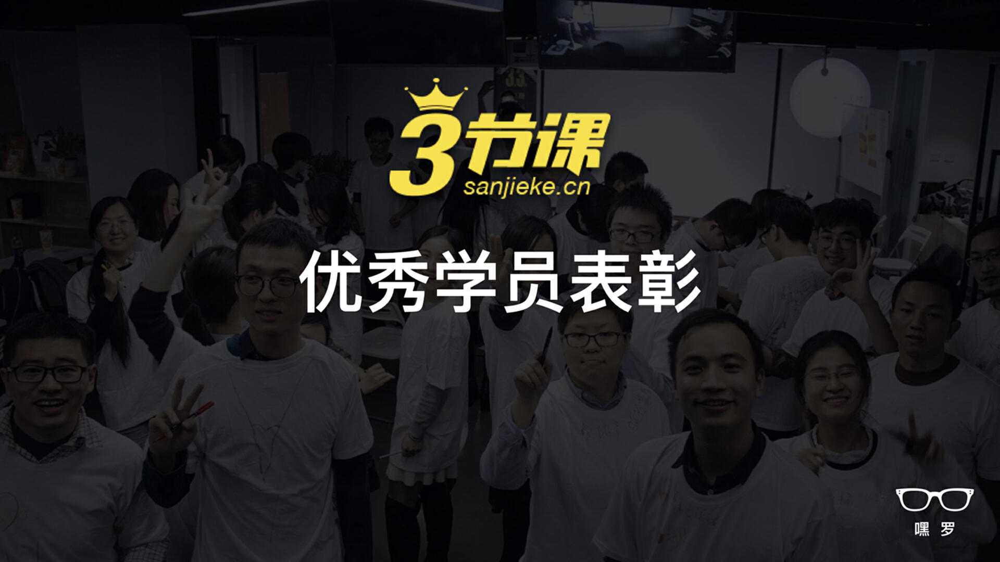

好了，到了大家期待已久的优秀学员表彰，恭喜这些小伙伴。

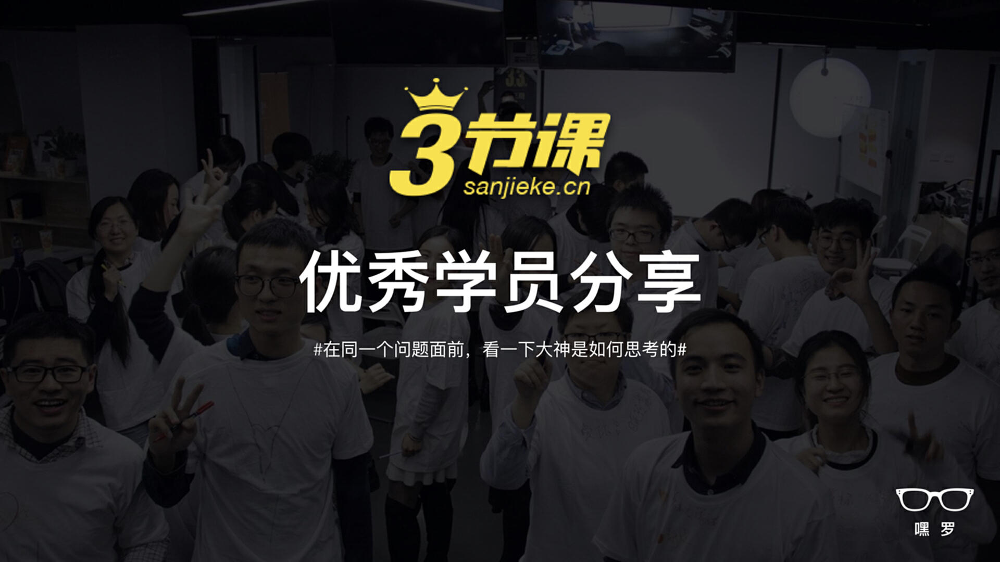

接下来，我们有请本次的优秀学员\*\*来给我们分享一下他在写作业时的一些思路，欢迎\*\*同学...

