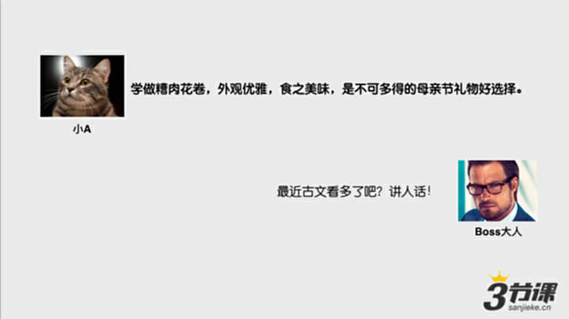
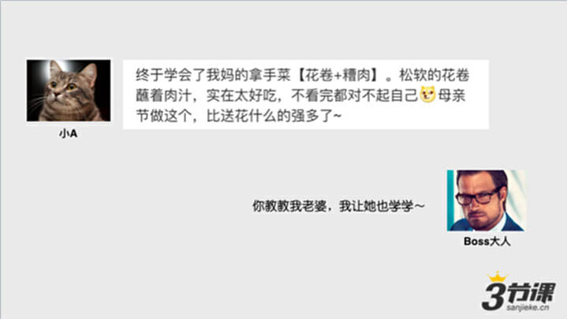

# S2.3：如何让文案讲“人话”

前面我们已经系统的说明了，为什么运营人员需要具备文案能力。这一小节，我们看一看文案与文案之间的不同，那些无感的不讲人话的文案是什么样子的？以及我们怎么让文案开始“讲人话”。

## 如何让文案从“无感”到“有感”

负面例子：

**案例1**

轻松办公，极致新体验

**案例2**

高端婴儿纸尿裤专家

**让宝宝自由**

**乐动每一天**

芯呵护·星体验

**案例3**

极致舒适AIRism

**升级后的AIRism**

**全新登场！**

极致柔顺，吸放湿效果更强！

**案例4**

品质生活  尊贵之选

欧琳水槽**净**升级

**案例5**

一群年轻人的

**无锅时代**

时鲜食客68元套餐全程免费配送

码上饭醉（有问题的地方）

一群年轻人的

**无锅时代**

**68元双人餐全城免费送**

昆明独家锡纸包烧菜，打开门，就购了。（有问题的地方）

**案例6**

时光荏苒

谁的面容将持久精致完美，灿若凝脂？

谁将掌控玲珑身形，每刻绽放高贵气质？

奢享之美，专属最为尊贵的您。

**案例7**

10,000,000白领

用**脉脉**实现职场梦想

被重用、找工作、长见识、涨工资、当老板

出现问题：给用户的信息太多了，还有不确定的内容：梦想，用户的职场梦想，不是一个具体的梦想。

给了用户5个认知。

## 基本原则

尽量在写文案时，尤其是文案使用场景是在线上做转化的时候，并不一定是发布会，媒体上面公关稿，**让你的文案看起来像哥们和闺蜜一样说话。**&#x8FD9;样的文案效果和感知力会更好的。

例如：

1000万白领用脉脉实现职场梦想

VS

艾玛，在这里找工作，回复率比招聘网站高5倍！

码上饭醉

VS

还瞅？每日限量100份，还不赶快下单就没了！

奢享之美，专属最为珍贵的你

VS

用了三个月，真的不必兰蔻小黑瓶差！

**案例：优衣库-正面**

轻飘飘

暖笠笠

贼拉轻

贼拉暖和

## 拓展阅读

到底什么是讲人话，或者说口语化的表达呢？下面看个例子：

* **不讲人话**

* **讲人话**

## 三个帮助你把文案变得更“有感”的方法

1. **把观点变成大量的事实**

2. **把空洞形容变成具体细节描述**

3) **把观点、专业术语等陈述转化为场景化表达**

* **把观点变成大量事实**

**案例**

这是一堂非常好的课程

VS

据统计，上完这堂课程的学员

在半年内月薪平均提升了2326元

最牛逼的大片，震撼来袭

VS

从构思到拍摄这部电影，他一共花了9年时间，

为了实现逼真的虚拟动画效果，

他和团队一共绘制了超过了20亿个多边形。

* **把空洞形容变成具体细节描述**

**案例**

最极致工艺的钛合金手机边框

VS

从一块钢板开始，它需要历经180道工序，

35小时雕琢打磨，

才能成为您手中仅重19克的手机边框。

饕餮美味，全城罕有

VS

平均来说，一顿饭的用餐时间是40分钟。但在这里，

这个时间是1.5小时。因为，这里的顾客总会在吃完自己的点的菜之后忍不住再加几道菜。

* **场景表达化**

**案例**

8大知识点，全面串讲PRD、后端产品逻辑、技术实现原理…

VS

如果您上完这堂课并认真完成了全部练习，我们保证，

您将拥有可以在产品经理岗位面试时全面碾压95%以上HR的能力。

夜拍能力超强，配备了XXX技术

VS

能清晰拍出银河的手机

黄老师在课程里已经给大家列举了很多“不说人话”的案例了，那么究竟为什么我们要用口语化的表达呢？如果文案不说人话对我们的工作会有什么影响呢？下面看个例子：

一只产品汪的观察：互联网11大产品账号安全之手机绑定流程

这是三节课订阅号2017年8月2日发布的一篇文章，内容很是优质的，但是文章的打开率却很惨，这是为什么呢？

我们来注意下这篇文章的标题，它是不是就属于我们课程中提到的不讲人话的典型案例呢？

这个标题读起来非常不口语化，让读者一脸懵逼，不知道他说的是什么，小伙伴们一定要引以为戒呦！

我们一起来看一下黄老师如何评价这个标题的。（截图省略，因为负面词汇过多）
