# S2.5 7个方向帮你找到产品卖点

## 课程导读

### 什么是卖点

优质文案通过传递企业或产品的独特价值、属性、功能、优势来影响用户。这些独特的、用来影响用户的要素称为"卖点"。

### 写文案前的准备

动笔撰写文案前，需要提前确认卖点。工作流程如下：

**明确特色&卖点 → 明确文案策略 → 内容组织&表达**

---

## 案例分析：小马宋——和士秀

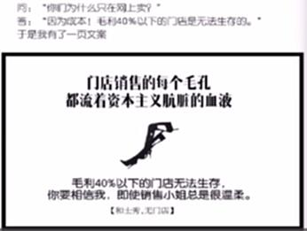

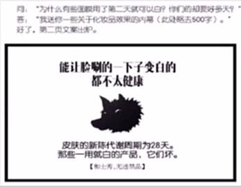

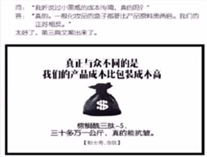

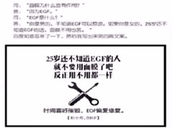

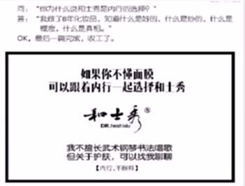

### 优点分析

1. **海报式文案结构**：一句主文案 + 一句附文案 + 一句精短Slogan
2. **善于提问**：提出的问题精准到位

**核心要点：** 找到卖点的关键在于提出正确的问题。

---

## 7个方向找卖点

**【关键提示】** 问题之间可能没有严格的逻辑关系，甚至存在交叉。每个问题都是潜在的思考方向，用于启发卖点挖掘。

### 7个核心问题

1. **我们的产品有哪些值得人关注的细节？**
2. **我们的产品能解决什么问题？为何能解决？**
3. **我们的产品对比其他同类产品有何显著特点与不同？**
4. **竞争对手存在哪些弱点是我们能做得更好的？**
5. **有哪些设计生产中的细节、过程可以体现我们产品的好？**
6. **有哪些实际发生的结果和用户行为可以体现我们产品的好？**
7. **有哪些人、事物、品牌的背书可以体现我们产品的好？**

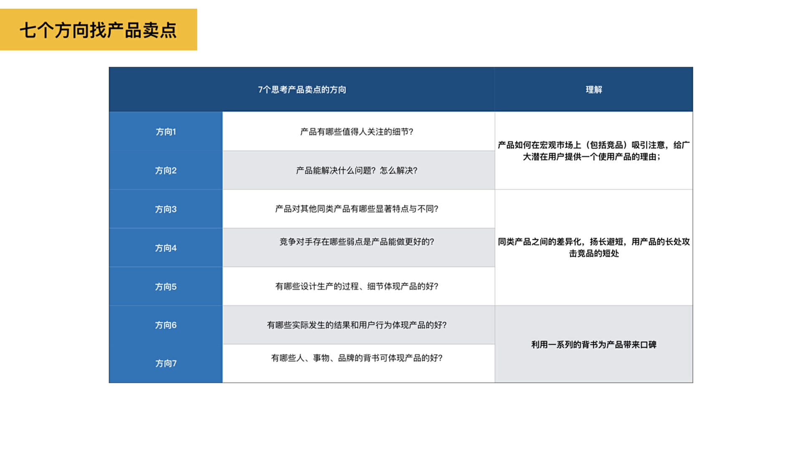

---

## 案例展示

### 1. 值得关注的细节

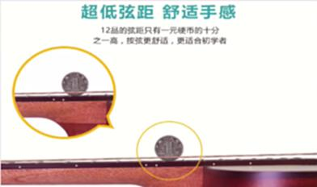

### 2. 解决的问题及原因

### 3. 与同类产品的差异

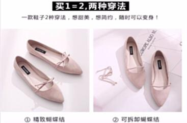

### 4. 竞争对手的弱点

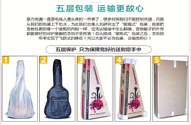

### 5. 设计生产细节

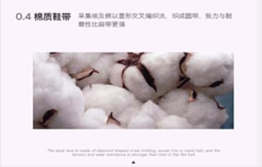

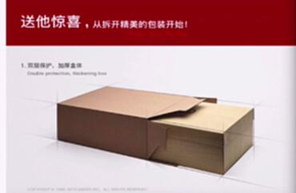

### 6. 实际结果和用户行为

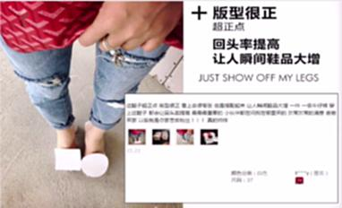

### 7. 人、事物、品牌的背书

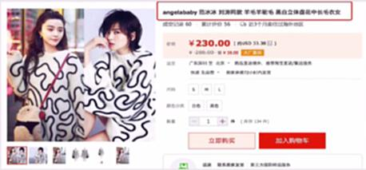

