# S2.7 从用户痛点反推出产品卖点

## 课程导读

除了"7个思考方向"找卖点外，还有另一种方法：**从用户痛点反推产品卖点**。

**【特别提示】** 这种方法可以帮助发现产品缺陷，优化产品功能方向。

---

## 如何找到用户痛点

### 两种主要途径

1. **相关产品的用户评价**
2. **搜索关键词**

---

## 案例分析

### 案例1：水杯

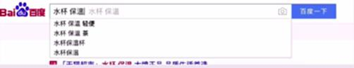

**关键词：** 保温、轻便、茶

### 案例2：男袜

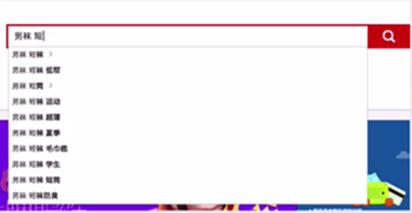

**关键词：** 男袜、低帮、超薄、运动、防臭等

### 案例3：羽绒服

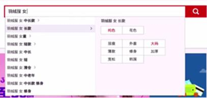

**关键词：** 羽绒服女、中长款、清仓、修身、大码等

---

## 用户评价分析

**重点：** 需要查看两类评价——特别好的和特别不好的

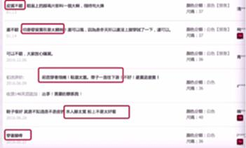

---

## 真实案例：三节课手账本

### 产品定位

运营之光主题手账本，包含运营之光的金句。

### 搜索关键词分析

#### 第一轮搜索：手账本

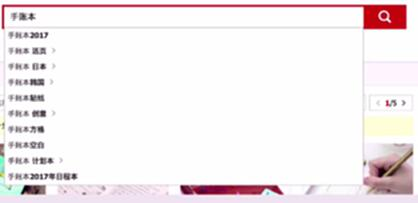

**关键词：** 手账本、活页、创意、方格、空白、计划本

#### 第二轮搜索：手账本 记事

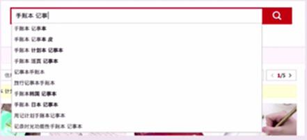

**关键词：** 皮、日本、时光功能

### 用户评价分析

查看其他手账本的用户评价：

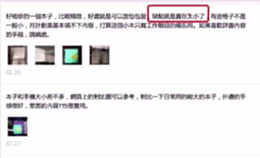

**结论：** 缺点太小

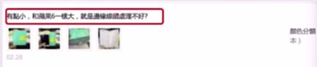

### 用户痛点总结

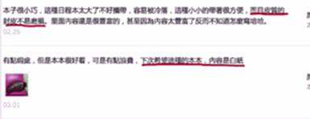

**痛点提炼：**
- 皮——希望皮质主要防止磨损
- 内容页空白

### 关键词总结

**小、便携、磨损、线头有瑕疵、内页白纸、创意**

---

## 最终文案呈现

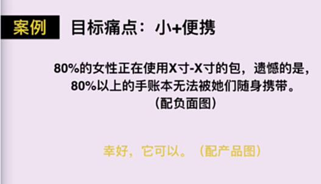

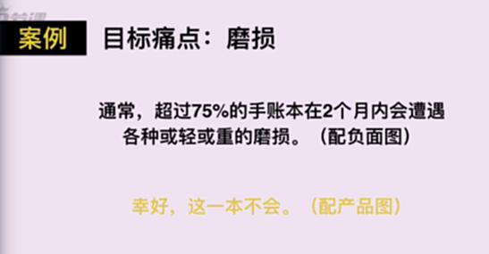

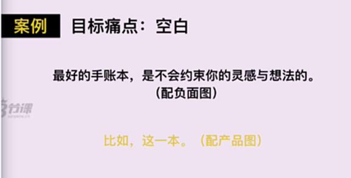

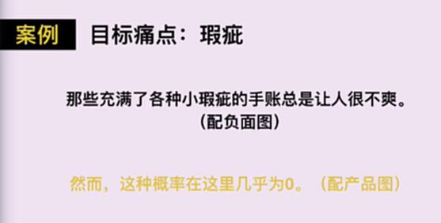

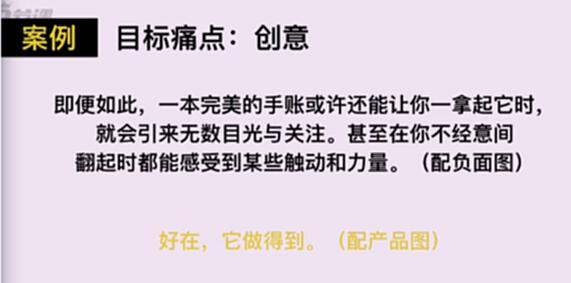

---

## 操作方法：从痛点反推卖点

### 四个步骤

1. **通过搜索、查看大量同类产品用户评价，找到用户当前的痛点**

2. **思考：哪些痛点是我们当前产品可以更好解决和满足的**

3. **思考：哪些痛点我们的产品进行优化后可以更好满足**

4. **找出明确卖点，开始围绕卖点创作文案**

   **最简单方法：对比**
