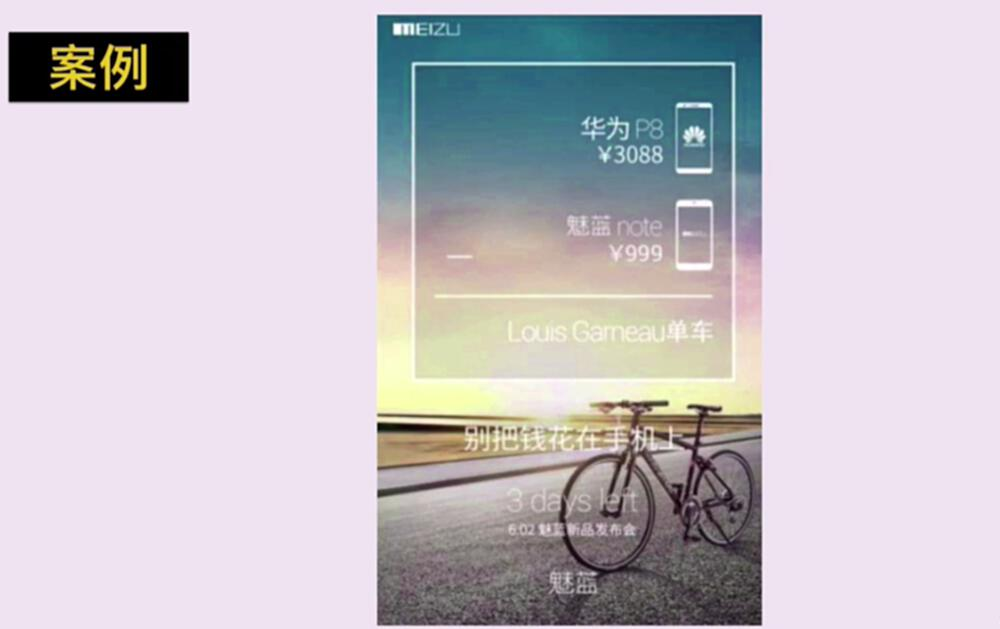
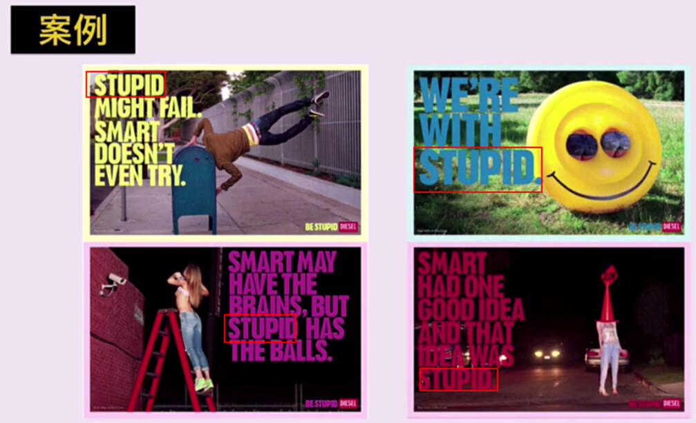
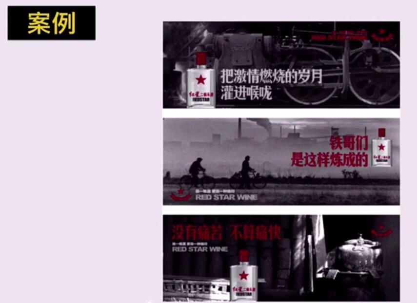
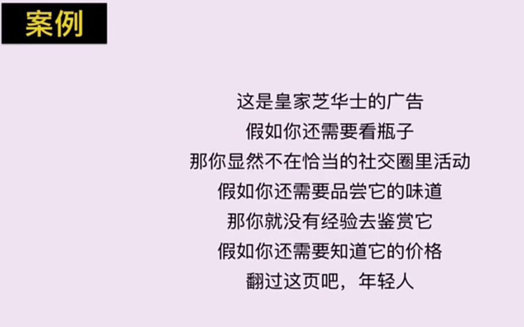
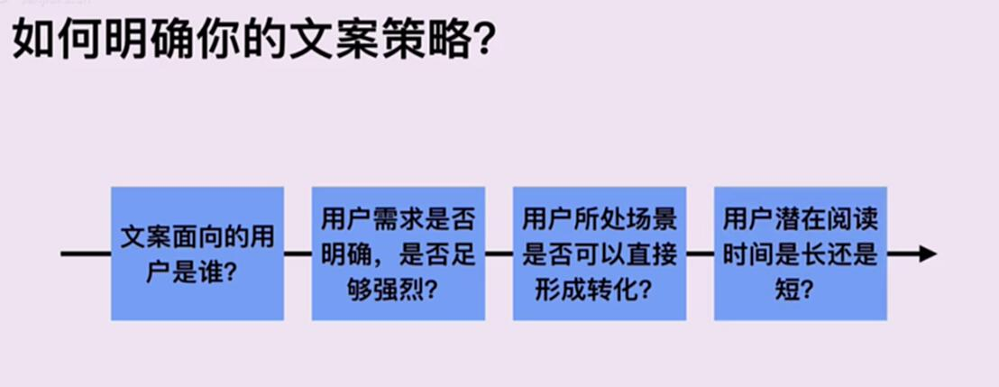
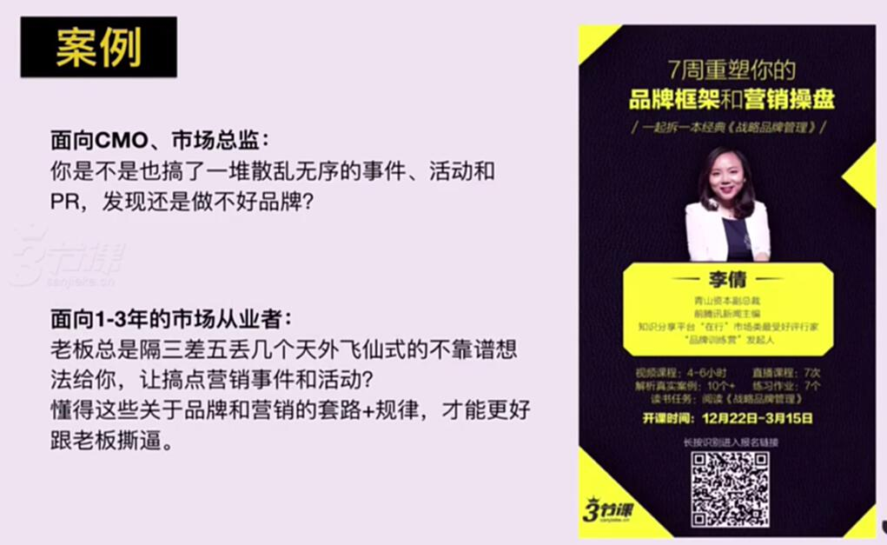

# S2.8 文案也需要策略

## 课程导读

找到产品卖点后，是否可以立即开始撰写文案？

**答案是否定的。** 在动笔之前，需要先制定文案转化策略。

---

## 什么是文案策略

**文案策略就是文案背后的逻辑。**

---

## 案例分析

### 案例1

**核心表达：** 既然花那么多钱买手机，为什么不省下来去旅行。

**策略分析：** 通过价值对比，引发用户思考消费决策。

### 案例2

**核心表达：** 这些看起来愚蠢但是疯狂的事情，往往是一群小众人群才会做的，而这些人能做出神奇和不可思议的事情。

**策略分析：** 激发用户的认同感和归属感。

### 案例3

**核心内容：** 通过文案和图片带入真实场景，使用户产生共鸣。

**策略分析：** 场景化表达，唤起用户回忆和情感。

### 案例4

**核心思想：** 如果没有品味，就不要来试用我的产品。

**策略分析：** 设置门槛，激发用户的好胜心和好奇心。

---

## 总结

以上案例中，每个文案试图传递的信息和感受不同，但目的都是为了让品牌留下认知。

---

## 如何明确文案策略

### 四个步骤

1. **文案面向的用户是谁？**
2. **用户需求是否明确、是否足够强烈？**
3. **用户所处场景是否可以直接形成转化？**
4. **用户潜在阅读时间是长还是短？**

---

## 步骤1：文案面向的用户是谁

### 基本常识

面向的用户不同，策略往往需要有所差别。

### 案例

三节课课程面对不同用户群体，写出的文案也不同。

**要点：** 在写文案前，先明确目标用户是谁，细分用户有助于更好地打动用户。
