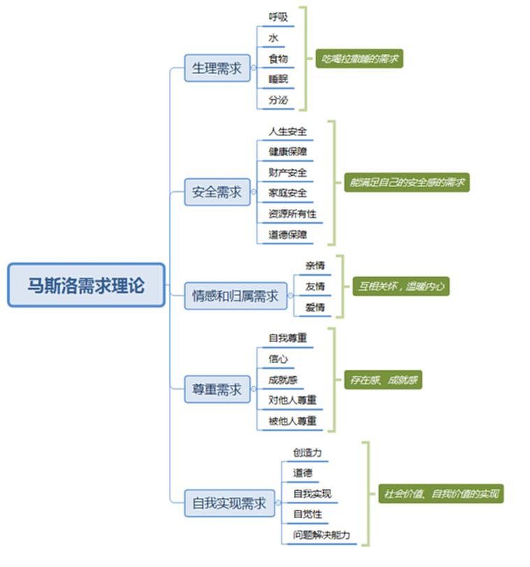
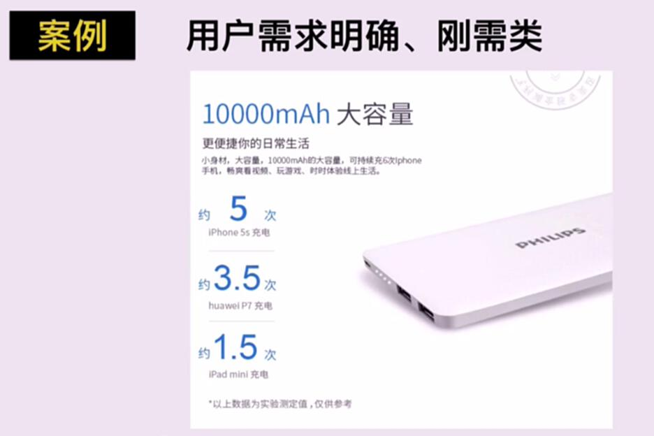
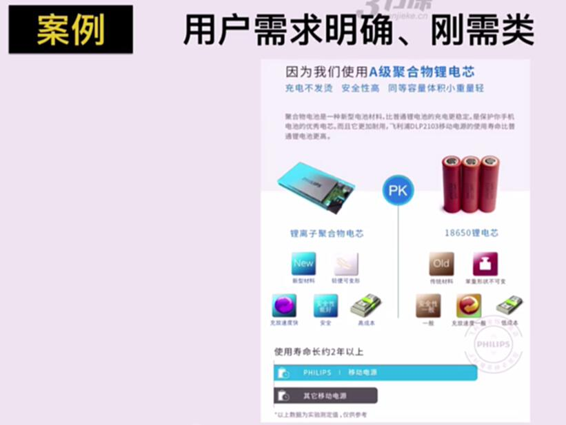
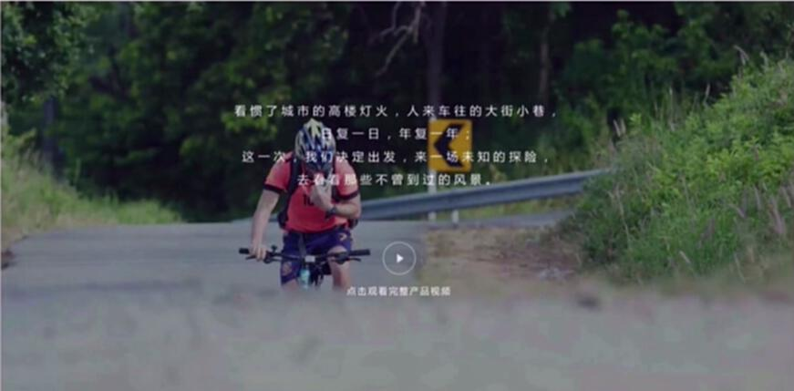
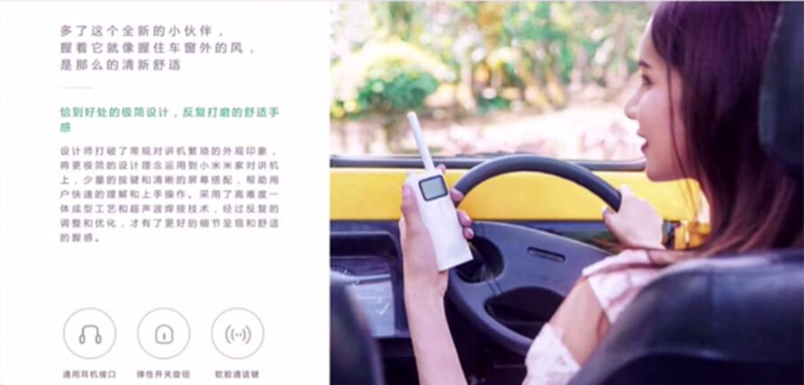
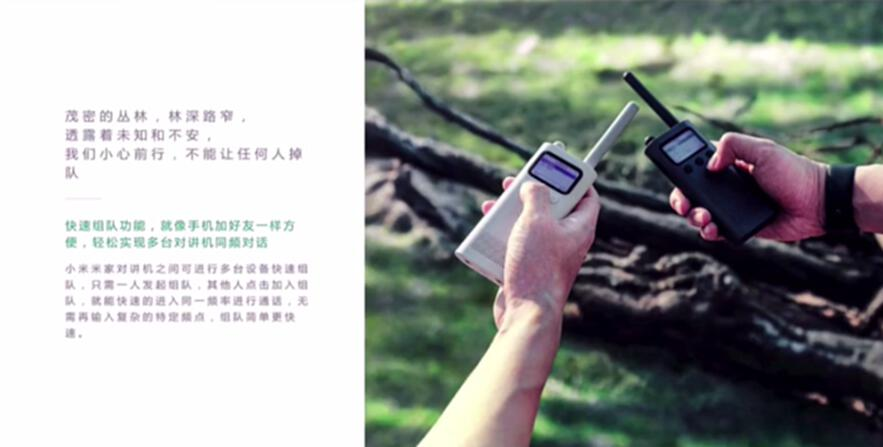
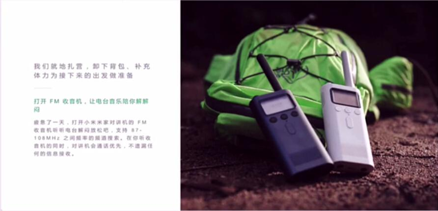
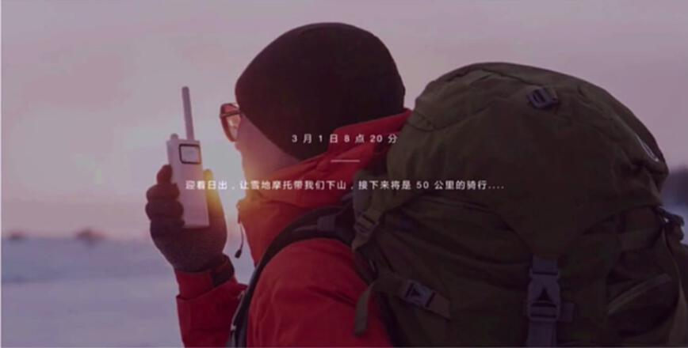
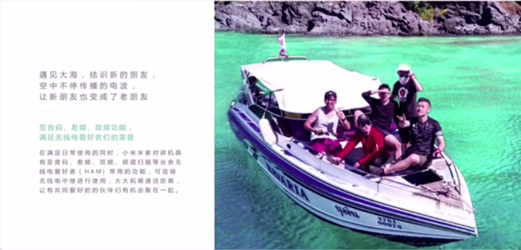

# S2.9 用户需求对文案的影响

## 课程导读

上节课讲解了根据目标用户特点选择相应卖点来制定转化策略。本节课将探讨用户需求对文案的影响。

---

## 用户需求是否明确、强烈

**核心观点：** 用户的需求和动机，决定了更有效影响他们的方式。

### 三种需求类型

| 需求类型 | 文案策略 |
|---------|---------|
| **明确、自主的刚需** | 解答用户的疑惑，说服用户 |
| **较弱，可有可无** | 通过更精细的场景植入，在特定场景下激发用户欲望 |
| **用户倾向于认为没有** | 制造某种认知失衡，重构用户的认知 |

---

## 案例分析

### 案例1：用户需求明确、刚需类

**影响方式：** 解答用户存在的疑惑

### 案例2：用户需求可有可无类

**文案方法：** 通过更精细的场景植入，在特定场景下激发用户的欲望

### 案例3：用户需求不明确或不存在

**文案方法：** 需要重新构建用户认知。推到用户的本源上一层逻辑，给用户一个新认知，才能说服用户。

---

## 真实案例：三节课课程推广

### 背景

老黄认为三节课不需要推广宣传，现在要做好的是服务。

### 前辈的说服逻辑

#### 第一步：颠覆认知

服务不是重点，营销和影响力更重要。

**论据：**
- 说明原因和具体例子
- 举例认为服务重要的课程培训失败的案例
- 给老黄一个认知上的冲击（别人这样做失败了）

#### 第二步：确立正确逻辑

要做营销和影响力，必须选择好的渠道。

**论据：**
- 在这个时代，渠道的力量被低估
- 举例：李翔的商业内参、李笑来的通往财富自由之路
- 如果没有得到做背书，不可能有这么好的业绩

#### 第三步：明确方法

好的渠道应该满足的条件及做法（包括渠道商的角色定位）：

- 一开始不应该铺面，不应该占领N多渠道
- 应该专注在一个渠道上做透
- 在一个渠道上做出标杆事情

#### 第四步：提供价值

作为一个渠道，能给对方带来什么？

---

## 总结

**说服逻辑：**

1. **先颠覆认知**（例如：如果按照原有做法会出现什么不良后果）
2. **然后摆出正确逻辑**（说明这件事的正确逻辑是什么）
3. **最后提供解决方案**（我们能给你带来的就是这样的正确方法）
