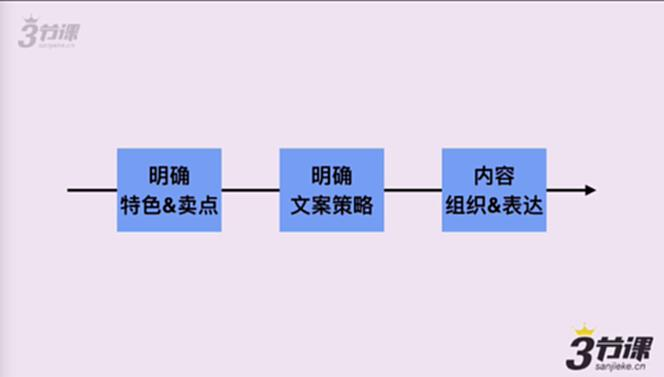
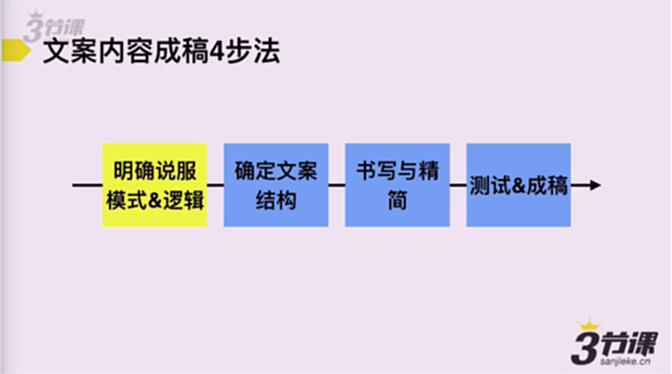
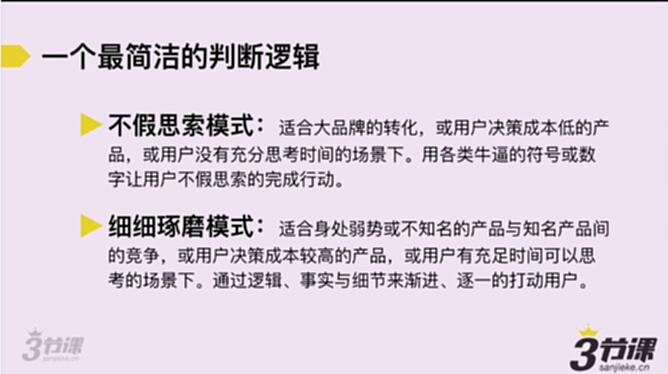
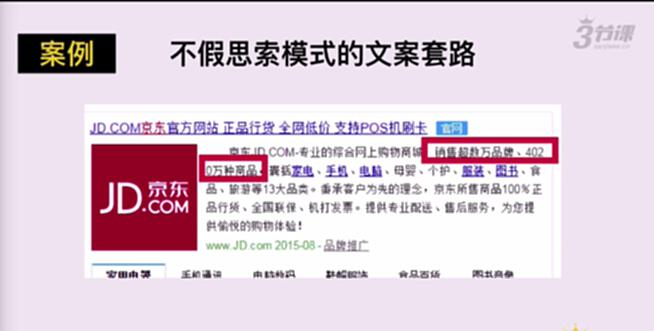
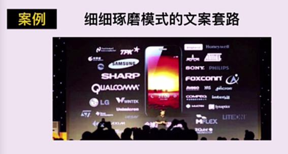

# S3.1：明确你的说服模式和逻辑

## 课程导读

文案的说服模式和逻辑，从本质上看也是一种文案转化策略。本章将探讨如何明确文案的说服模式。

## 文案内容成稿4步法

文案成稿包含四个步骤：

1. **明确说服模式&逻辑**
2. **确定文案结构**
3. **书写与精简**
4. **测试&成稿**

## 文案说服模式

根据用户决策成本和思考时间的不同，文案说服模式可分为两种：

### 1. 不假思索模式

**适用场景：**
- 大品牌的转化
- 用户决策成本低的产品
- 用户没有充分思考时间的场景

**策略：** 使用各类符号或数字让用户不假思索地完成行动。

#### 案例：不假思索模式的文案套路

**京东百度SEM文案**

**加多宝文案**

---

### 2. 细细琢磨模式

**适用场景：**
- 身处弱势或不知名产品与知名产品的竞争
- 用户决策成本较高的产品
- 用户有充足时间可以思考的场景

**策略：** 通过逻辑、事实与细节来渐进、逐一地打动用户。

#### 案例：细细琢磨模式的文案套路

**小米1发布会**

小米在发布会中详细展示了产品技术参数：屏幕采用夏普、处理器性能等，通过大量技术细节和事实数据说服用户。

