# S3.2：AIDA模型构建文案结构

## 课程导读

制定好文案策略后，接下来需要组织内容和书写。文案内容组织有两种结构可以选择：AIDA模式与4P模式。

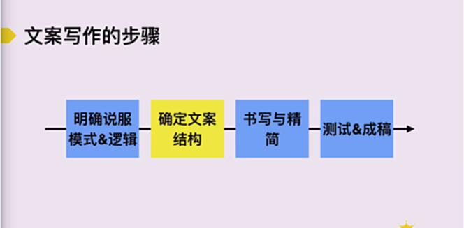

---

## AIDA模型概述

AIDA模型是经典的文案结构模型，包含四个阶段：

### AIDA模型四阶段

- **A（Attention）引起注意**
- **I（Interest）激发兴趣**
- **D（Desire）勾起欲望**
- **A（Action）促成行动**

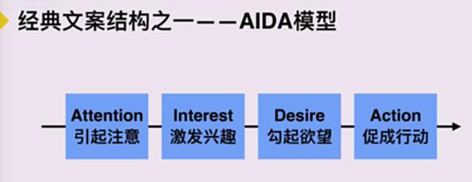

---

## 如何引起用户注意

引起注意是AIDA模型的第一步，也是关键一步。以下是六种常用方法：

### 引起注意的六种方法

1. **冲击力图片或词句**
2. **引发好奇**
3. **抱大腿**
4. **调动情绪**
5. **唤起共鸣**
6. **有力的福利**

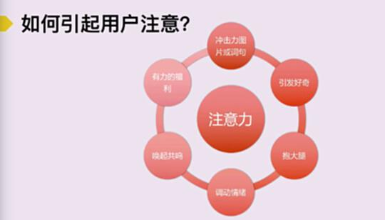

#### 方法1：冲击性图片或词句

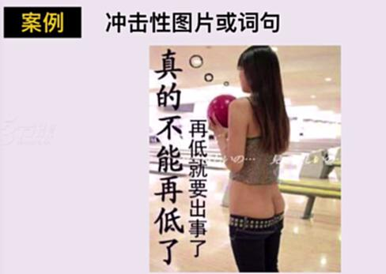

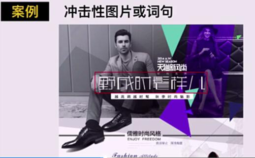

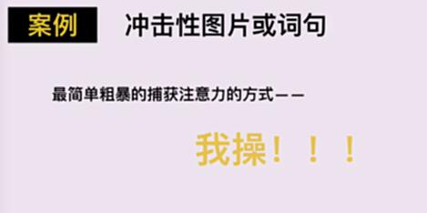

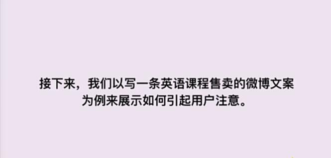

#### 方法2：引发好奇

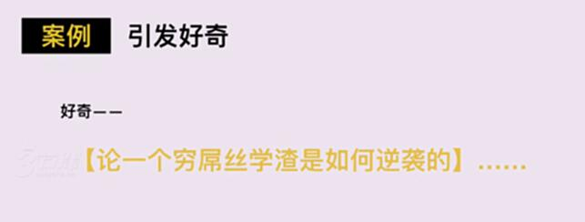

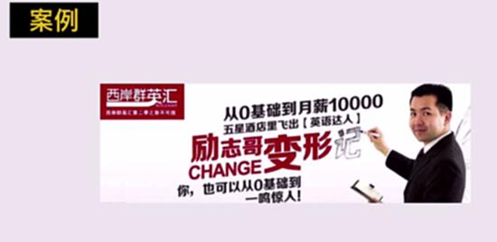

#### 方法3：抱大腿

借助知名品牌或人物的影响力来吸引用户注意。

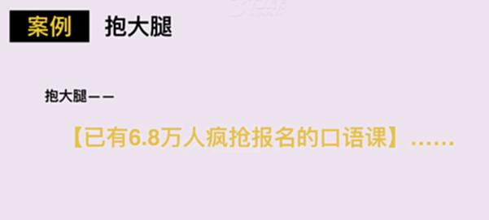

#### 方法4：调动情绪

通过情绪化的内容引发用户共鸣。

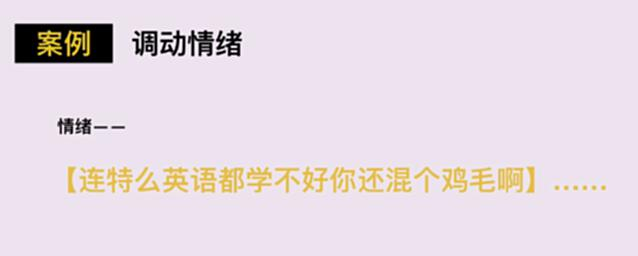

#### 方法5：唤起共鸣

直接说出用户在特定场景下的痛点，营造话题感。

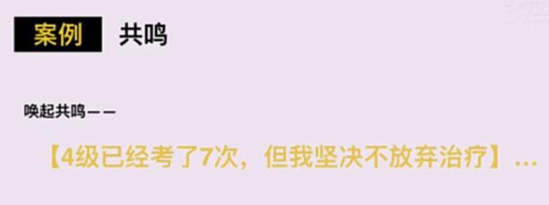

**共鸣常见手法：**

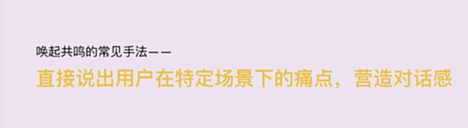

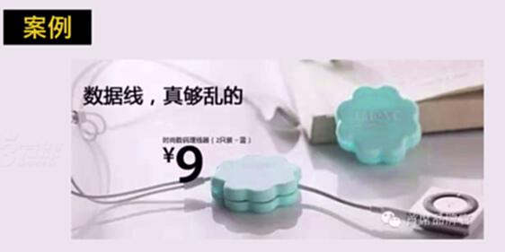

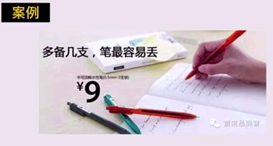

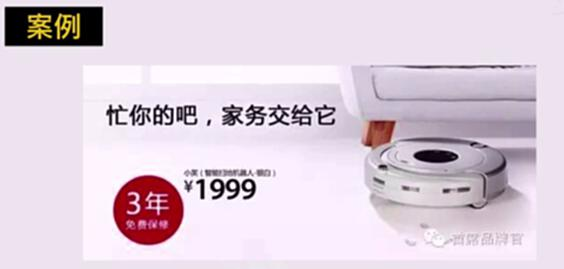

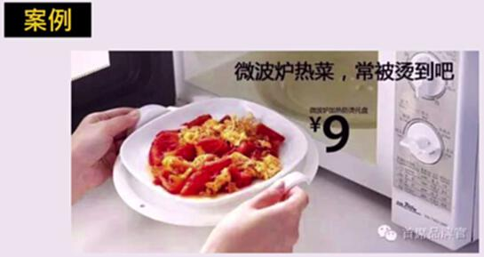

#### 方法6：有力的福利

通过优惠、赠品等福利吸引用户。

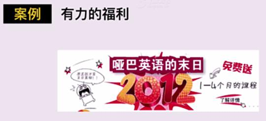

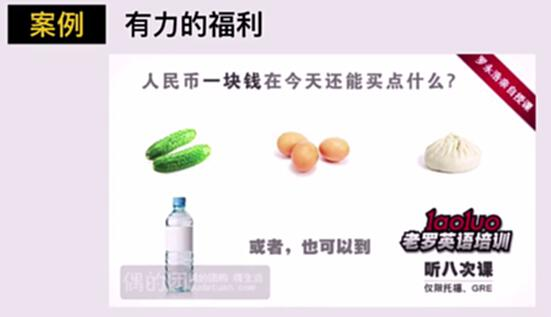

---

## AIDA模型完整案例

### 案例：淘宝产品详情页——包包

**引起注意：**

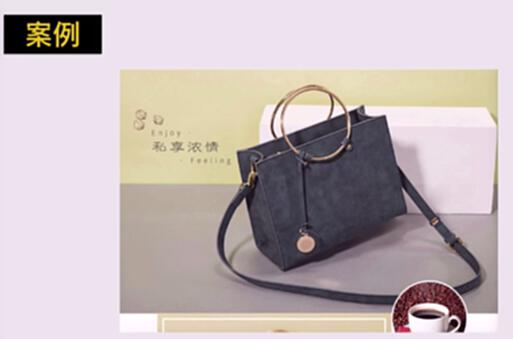

**激发兴趣：**

从设计师专业角度给出关于精致的解释。

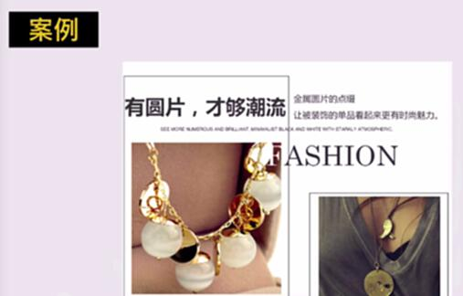

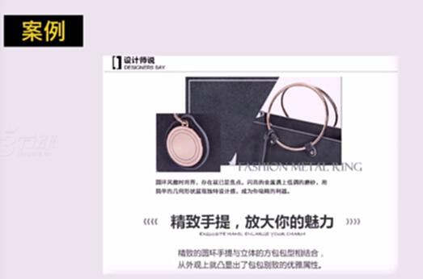

面料选取的专业说明——从季节角度。

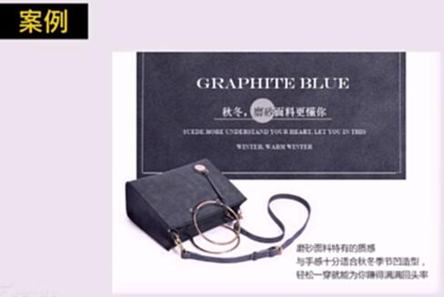

颜色的选择理由。

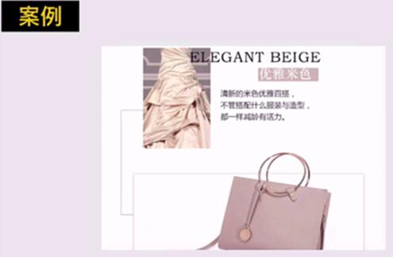

包包空间容量和具体可装物品。

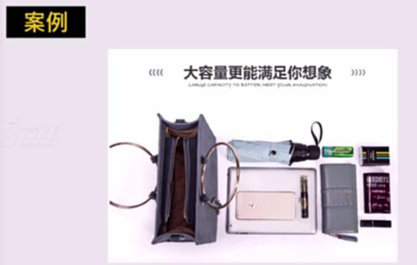

具体衣饰搭配。

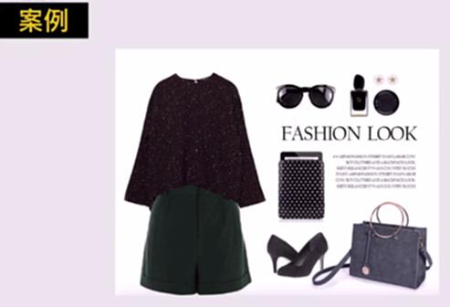

使用效果展示，给用户明确预期。

---

### AIDA模型改写案例

**原版文案：**

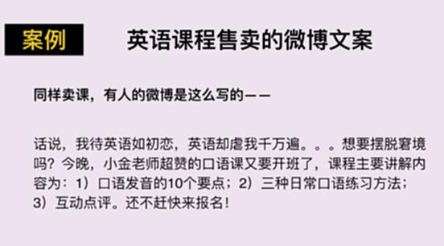

**使用AIDA模型优化后的文案：**

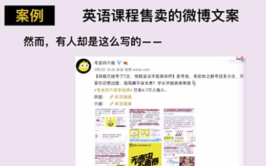
