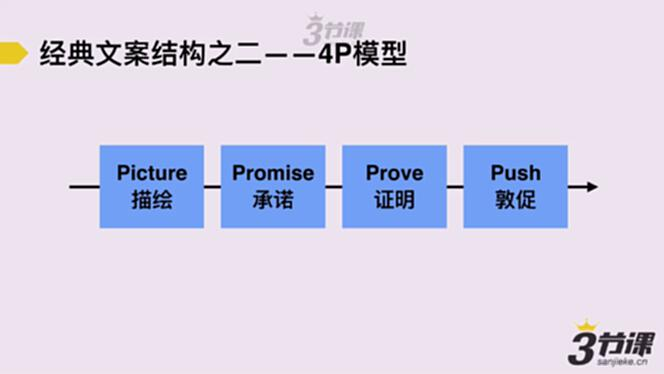
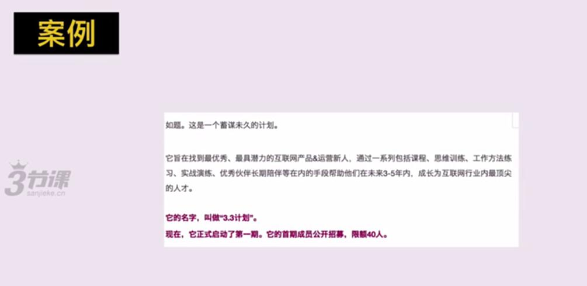
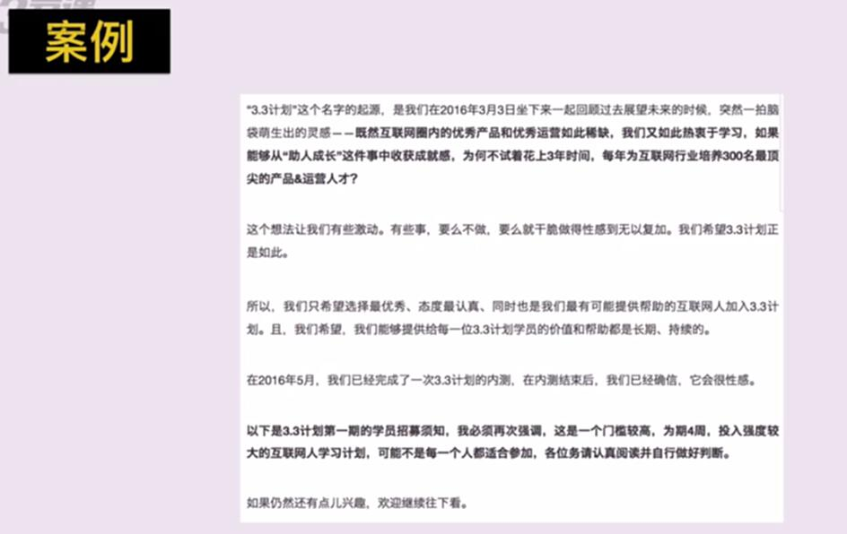
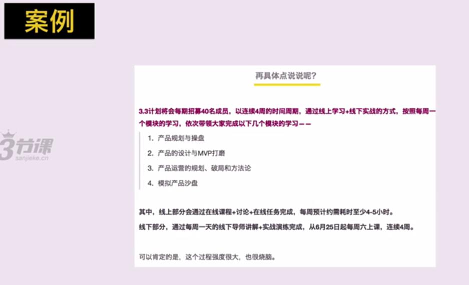
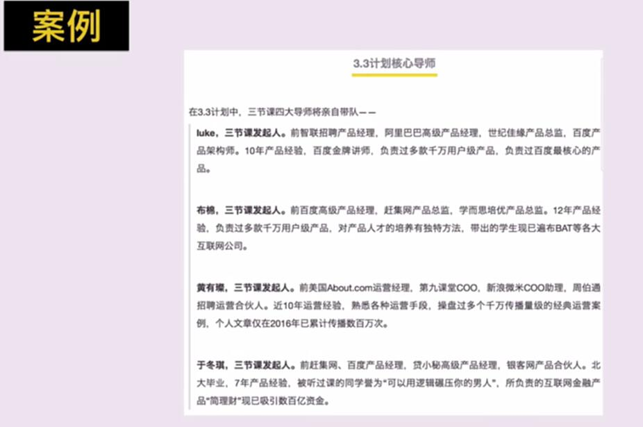
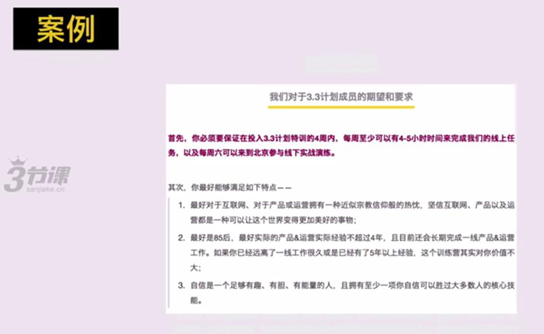
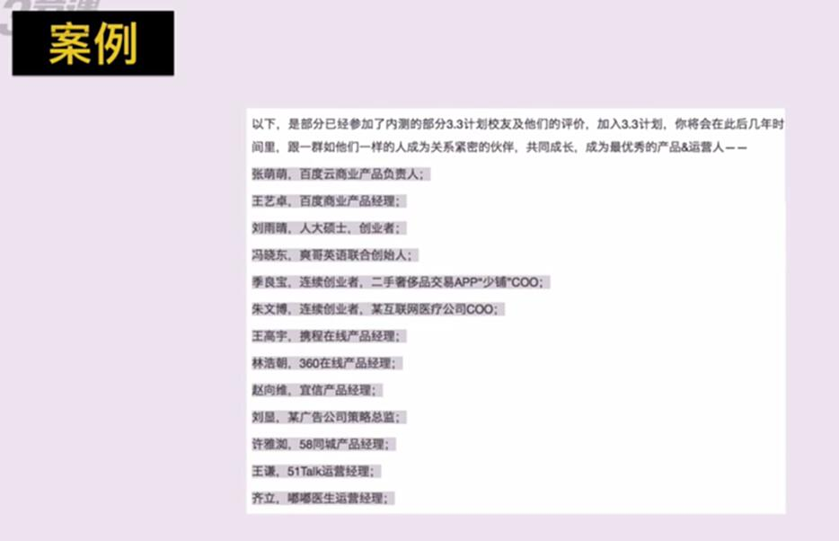
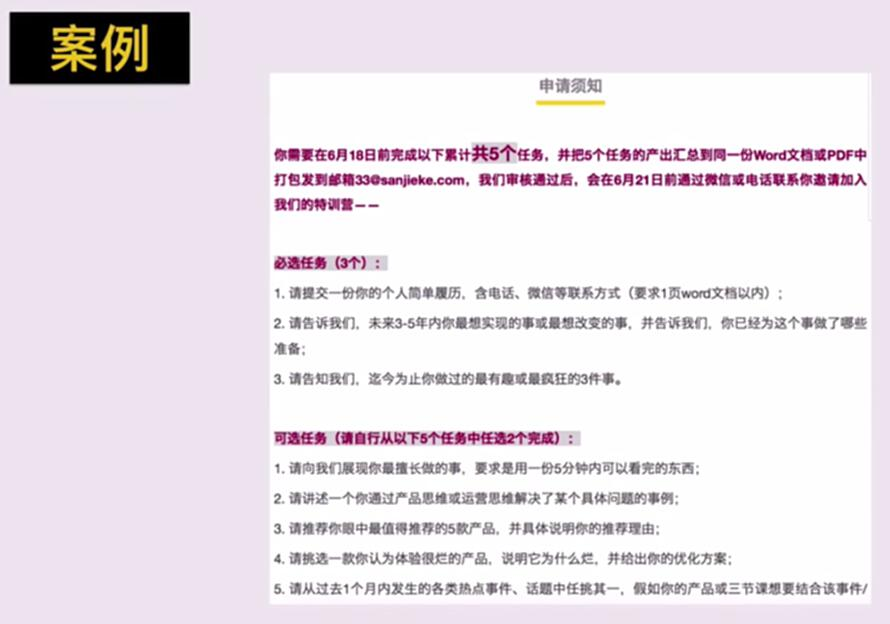

# S3.3：用4P模式构建文案结构

## 课程导读

上一节学习了文案内容组织的AIDA模式，本节将介绍第二种文案内容组织模式——4P模式。

---

## 4P模型概述

4P模型是另一种经典的文案结构模型，包含四个阶段：

### 4P模型四阶段

- **P（Picture）描绘**
- **P（Promise）承诺**
- **P（Prove）证明**
- **P（Push）敦促**

---

## 4P模型案例解析

### 案例：在线课程文案

#### 1. 描绘部分（Picture）

描绘理想场景或现状，引发用户共鸣。

#### 2. 承诺部分（Promise）

给出产品能够带来的价值承诺。

#### 3. 证明部分（Prove）

通过课程描述、师资力量等证明承诺的可信度。

**课程描述**

#### 4. 敦促部分（Push）

通过紧迫感、优惠等方式敦促用户立即行动。

---

## 4P模型与AIDA模型对比

| 模型 | 适用场景 | 特点 |
|-----|---------|------|
| **AIDA模型** | 适合营销推广、广告文案 | 注重用户心理变化过程：注意→兴趣→欲望→行动 |
| **4P模型** | 适合产品介绍、销售文案 | 注重逻辑说服过程：描绘→承诺→证明→敦促 |

**选择建议：**
- 如果需要调动用户情绪，选择AIDA模型
- 如果需要理性说服用户，选择4P模型
- 两种模型也可以结合使用，灵活调整
