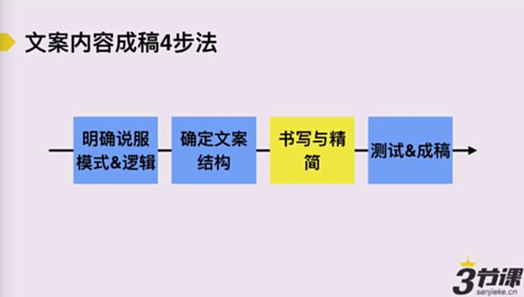
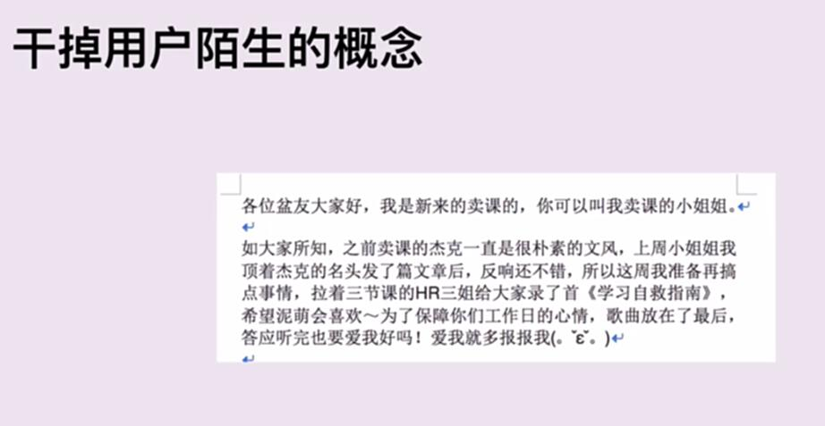
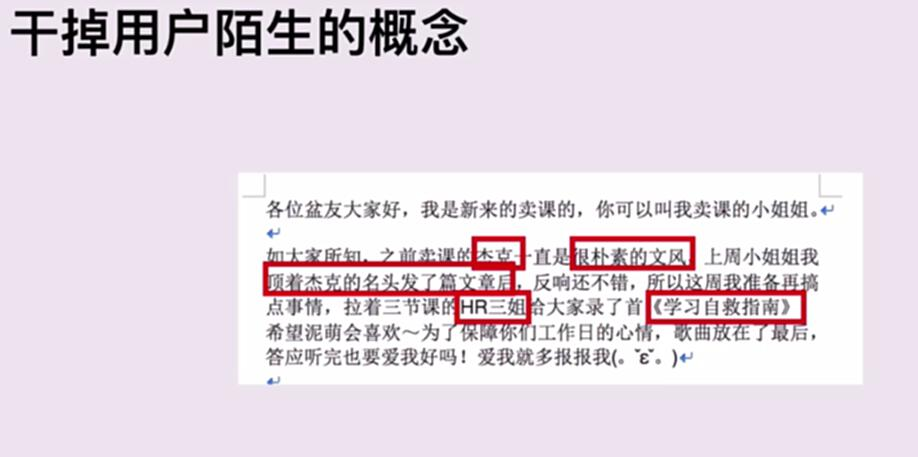
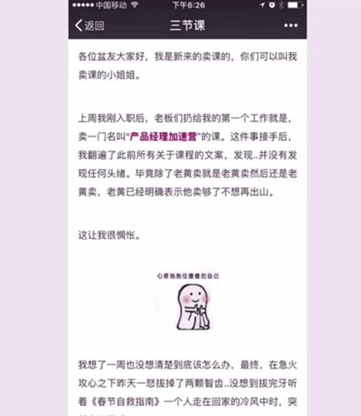
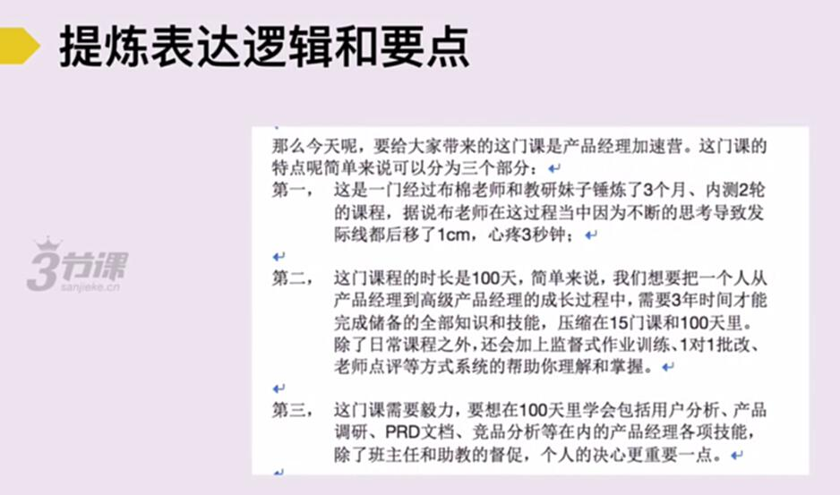
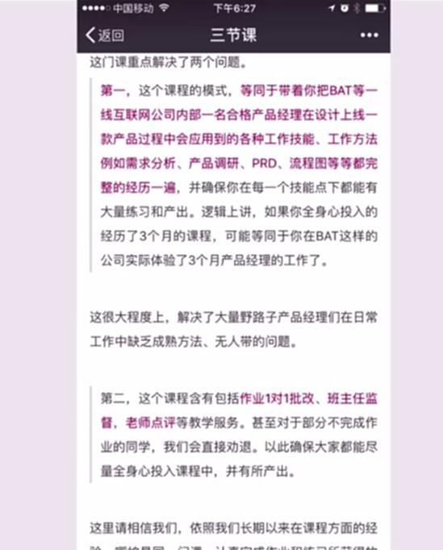
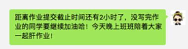

# S3.4：如何把事情说清楚

## 课程导读

确定好文案内容的组织结构并开始创作后，需要对文案内容进行精简和优化。精简文案有两条核心原则：

1. 把事情讲清楚
2. 增强用户感受

> **请参考第一节内容——写**

---

## 文案写作的两个原则

1. **把事情讲清楚**
2. **增强用户的感受和体验**

---

## 把事情讲清楚的两个重点

### 1. 干掉用户陌生的概念

### 2. 把表达逻辑和要点提炼得更清晰

---

## 案例解析

### 案例1：干掉用户陌生的概念

**原版文案：**

**问题：文案中存在陌生概念**

**修改后的文案：**

---

### 案例2：提炼表达逻辑和要点

**原版文案：**

**修改版：**

---

## 拓展阅读：陌生概念的产生原因

文案中存在陌生概念，往往是因为文案作者假设读者知道或理解某些内容，但实际上对方并不理解。究其本质，是因为双方视角不同，造成信息发出者和信息接受者之间的鸿沟。

作为信息发出者，通常会受以下三种视角影响而产生"陌生词汇"：

### 1. 内部视角

受到内部视角影响的词汇，通常是在一个公司或团队的特定背景下，通用的常识性知识。

**举例：**

当三节课的员工接收到企业合作相关事务时，都会去找"三姐"反馈。但如果对班主任和同学说："大家如果有企业合作的意向，记得去找三姐"，相信大家都会产生疑问：三姐是谁？我怎么找她？

**原因分析：**

同学们产生疑问是因为他们不是三节课的内部员工，没有内部视角，无法理解"三姐"这个词汇指代的人。

### 2. 专家视角

受到专家视角影响的词汇，通常是在特定行业背景下通用的专业词汇。

**举例：**

如果老板对你说："你去研究一下网易新闻广告是不是GD，如果是的话，确认下计费方式是CPM还是CPA。"如果没有接触过推广投放工作，听到这句话肯定会困惑：GD是什么？CPM和CPA又是什么？

这就是专业词汇的壁垒，没有特定行业背景的人无法理解。

### 3. 个人视角

受到个人视角影响的词汇，通常是只有你或特定小圈子才知道的词汇。

**举例：**

**说明：**

"P2封测班"同学圈子中使用的"肝作业"，是指"熬夜写作业"的简称。但把这个词发到"P2二期"同学的班级群里，很多同学因为不理解"肝作业"的意思，会感到困惑。

---

## 如何避免陌生概念

1. **换位思考：** 站在用户角度审视文案，识别专业术语和内部词汇
2. **通俗解释：** 对专业概念进行解释或使用类比
3. **用户测试：** 让目标用户阅读文案，收集反馈
4. **简化表达：** 将复杂概念转化为简单易懂的语言
