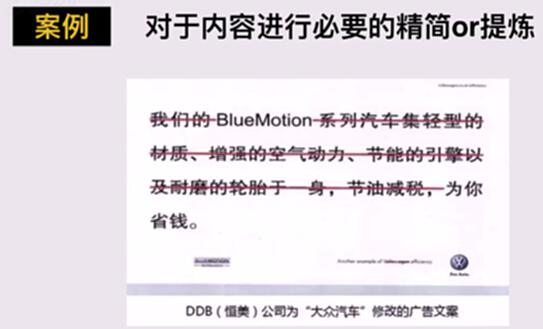
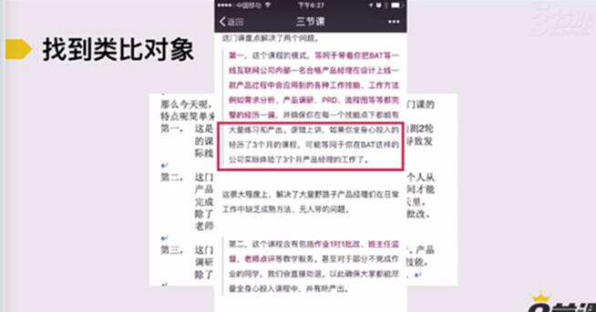

# S3.6：文案的删与改

## 课程导读

完成文案的"写"的部分后，还需要进行适当的删减和修改，才能产出优质文案。本节将介绍文案删减和调整的原则。

---

## 文案优化流程

**写完之后，还要——**

**删 + 改**

---

## 删减调整内容的五项原则

1. **紧密围绕场景和用户潜在阅读时间来调整内容**
2. **删掉一切不必要的修饰词**
3. **删掉效果和用户感知几乎完全相同的表达**
4. **如果是短文案，尽量考虑变成短-长句式表达或者对仗句式**
5. **一旦感觉表达生涩，尽量思考如何找到合适的类比对象**

---

## 案例解析

### 原则1：紧密围绕场景和用户潜在阅读时间来调整内容

根据文案展示场景和用户可能花费的阅读时间，调整内容长度和重点。

**案例：**

---

### 原则2：删掉一切不必要的修饰词

删除不影响核心意义的形容词、副词等修饰词，让文案更简洁有力。

**案例：**

---

### 原则3：删掉效果和用户感知几乎完全相同的表达

当多个表达方式传递的信息相似时，保留最有效的一个，删除重复内容。

**案例：**

---

### 原则4：短文案采用短-长句式或对仗句式

对于短文案，采用"短句+长句"的节奏，或使用对仗句式，增强文案的韵律感和记忆度。

**案例：**

---

### 原则5：表达生涩时寻找合适的类比对象

当文案表达生涩难懂时，通过类比让抽象概念变得具体易懂。

**案例：**

---

## 文案删改技巧总结

| 原则 | 关键点 | 目的 |
|-----|-------|------|
| **围绕场景调整** | 考虑阅读时间、展示场景 | 提升内容适配性 |
| **删减修饰词** | 删除不必要的形容词、副词 | 让文案更简洁 |
| **删除重复表达** | 保留最有效的表达 | 避免信息冗余 |
| **优化句式** | 短-长句式、对仗句式 | 增强韵律感和记忆度 |
| **使用类比** | 将抽象概念具体化 | 降低理解门槛 |

---

## 文案删改注意事项

1. **保持核心信息：** 删减时确保不丢失关键信息
2. **保持原意：** 改写时要保持原文的核心观点
3. **多次迭代：** 文案删改往往需要多轮迭代
4. **用户测试：** 删改后可进行用户测试验证效果
