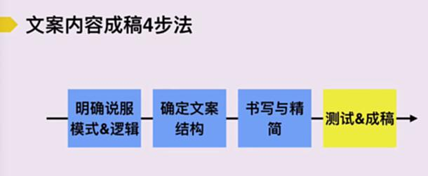

# S3.7：测试与成稿

## 课程导读

完成文案的撰写和删改后，文案即将成稿。为确保文案质量，需要应用自检要点重新审视文案，并进行适当修改。

---

## 文案自检七要点

在文案最终定稿前，应从以下七个维度进行自检：

### 1. 文案面向的用户是否明确？

**检查要点：**
- 目标用户群体是否清晰
- 文案是否针对该用户群体撰写
- 是否考虑了用户特征和需求

### 2. 面向用户的卖点是否清晰？

**检查要点：**
- 核心卖点是否突出
- 卖点是否与用户需求匹配
- 卖点表达是否简洁明确

### 3. 是否出现了用户不能理解的概念和名称？

**检查要点：**
- 是否存在专业术语或行业黑话
- 是否有内部视角的词汇
- 是否需要进行解释或替换

### 4. 是否能够吸引用户的注意力？

**检查要点：**
- 标题或首句是否具有吸引力
- 是否运用了引起注意的技巧（冲击力、好奇、情绪等）
- 开头是否能够快速抓住用户

### 5. 在特定场景下的展示是否有效？

**检查要点：**
- 文案是否适合展示场景（如社交媒体、详情页、广告位等）
- 视觉呈现是否合理
- 文案长度是否适合该场景

### 6. 在特定场景下是否已经足够精简？

**检查要点：**
- 是否存在冗余表达
- 是否可以进一步删减
- 用户阅读时间是否合理

### 7. 是否能够让用户形成感知或引导用户完成下一步行动？

**检查要点：**
- 是否能够激发用户情感或认同
- 是否有明确的行动召唤（CTA）
- 行动召唤是否清晰有力

---

## 文案自检流程

### 步骤1：完成初稿

按照文案成稿4步法完成初稿创作。

### 步骤2：应用自检要点

使用上述七个维度逐一检查文案。

### 步骤3：修改优化

根据自检结果进行针对性修改。

### 步骤4：再次自检

重复自检流程，直到文案达到标准。

### 步骤5：用户测试（可选）

让目标用户阅读文案，收集反馈并优化。

### 步骤6：最终定稿

确认文案无误后，正式发布使用。

---

## 文案自检注意事项

1. **客观审视：** 跳出作者视角，以用户角度审视文案
2. **场景模拟：** 想象文案在实际场景中的展示效果
3. **多次迭代：** 优秀文案往往经过多轮修改
4. **数据验证：** 发布后收集数据，持续优化

---

## 文案成稿标准

一份优质的文案应满足以下标准：

- ✅ 目标用户明确
- ✅ 核心卖点清晰
- ✅ 表达通俗易懂
- ✅ 吸引用户注意
- ✅ 场景适配度高
- ✅ 内容简洁精炼
- ✅ 引导用户行动
