# S3.8：对整个文案课程内容的总结

## 课程导读

通过S2和S3两个章节的学习，已经掌握了优质文案产出的全流程。本章将对文案课程内容进行系统总结与复习。

---

## 文案产出的核心步骤

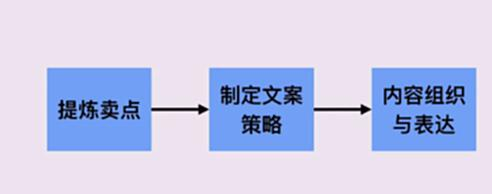

---

## 一、提炼卖点

### 提炼卖点的两种方法

1. **问出正确的问题**
2. **通过同类产品评价**

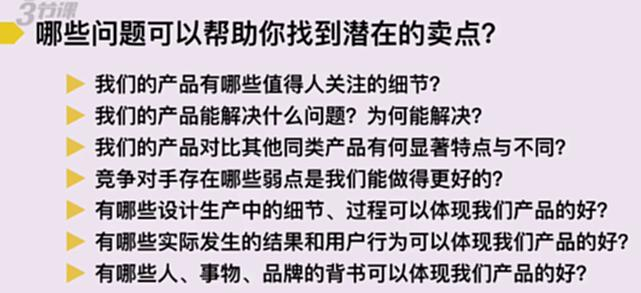

**关键要点：**
- 从用户角度挖掘需求
- 分析竞品评价发现痛点
- 结合产品特性找到差异化卖点

---

## 二、制定文案策略

### 文案策略的思考方向

1. **4个思考方向**
2. **极端用户、问题或场景**

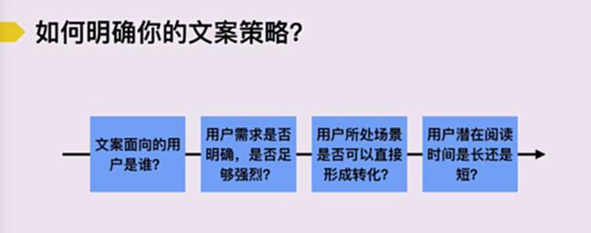

**关键要点：**
- 明确目标用户和场景
- 选择合适的说服模式（不假思索/细细琢磨）
- 制定差异化策略

---

## 三、内容组织与表达

### 文案成稿四步法

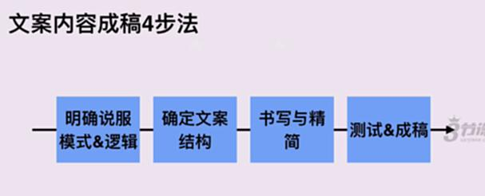

1. **明确说服模式&逻辑**
2. **确定文案结构**
3. **书写与精简**
4. **测试&成稿**

---

## 四、确定文案结构

### 两大经典文案结构模型

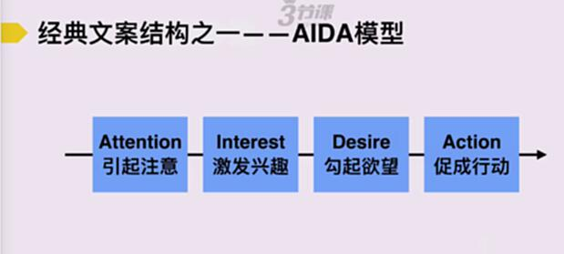

#### AIDA模型（适合营销推广）

- **A（Attention）** 引起注意
- **I（Interest）** 激发兴趣
- **D（Desire）** 勾起欲望
- **A（Action）** 促成行动

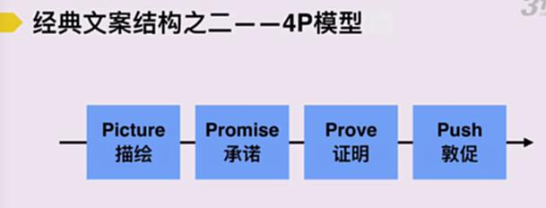

#### 4P模型（适合产品介绍）

- **P（Picture）** 描绘
- **P（Promise）** 承诺
- **P（Prove）** 证明
- **P（Push）** 敦促

---

## 五、书写与精简

### 文案写作的两大原则

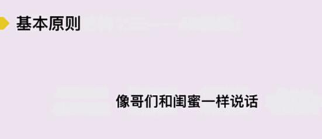

#### 原则1：把事情讲清楚

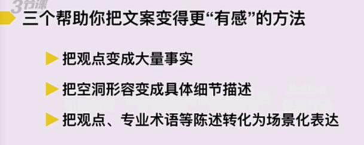

**关键要点：**
- 干掉用户陌生的概念
- 把表达逻辑和要点提炼得更清晰

**避免陌生概念的三种视角：**
1. 内部视角：公司或团队内部常识
2. 专家视角：行业专业术语
3. 个人视角：小圈子词汇

#### 原则2：增强用户感受

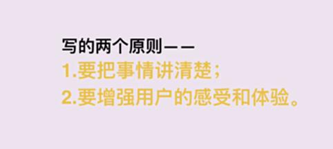

**增强用户感知的方法：**
1. **营造画面感：** 调动视觉、听觉、触觉等多感官
2. **影视化表达：** 借助热门台词或经典人物
3. **回归生活场景：** 触动用户真实场景
4. **巧妙对比：** 突出产品优势
5. **明确预期：** 给用户掌控感
6. **真实细节：** 代入人名、数据、细节

---

## 六、删减和调整

### 文案删改五项原则

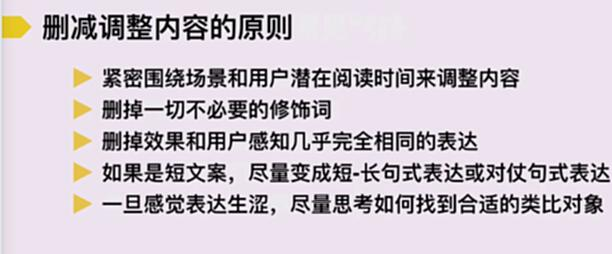

1. **紧密围绕场景和用户潜在阅读时间来调整内容**
2. **删掉一切不必要的修饰词**
3. **删掉效果和用户感知几乎完全相同的表达**
4. **短文案采用短-长句式表达或对仗句式**
5. **表达生涩时寻找合适的类比对象**

---

## 七、文案自检要点

### 文案自检七维度

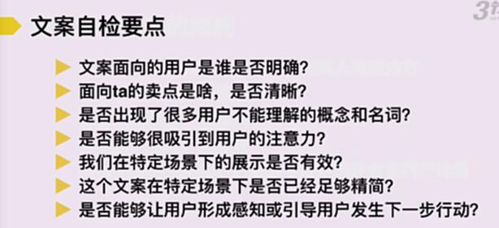

1. **文案面向的用户是否明确？**
2. **面向用户的卖点是否清晰？**
3. **是否出现了用户不能理解的概念和名称？**
4. **是否能够吸引用户的注意力？**
5. **在特定场景下的展示是否有效？**
6. **在特定场景下是否已经足够精简？**
7. **是否能够让用户形成感知或引导用户完成下一步行动？**

---

## 文案课程知识体系总结

| 阶段 | 核心内容 | 关键输出 |
|-----|---------|---------|
| **S2：文案准备** | 提炼卖点、制定策略 | 文案转化策略 |
| **S3.1：说服模式** | 不假思索模式、细细琢磨模式 | 确定说服逻辑 |
| **S3.2-S3.3：文案结构** | AIDA模型、4P模型 | 文案结构框架 |
| **S3.4-S3.5：写作原则** | 讲清楚、增强感受 | 优质文案初稿 |
| **S3.6：文案删改** | 五项删改原则 | 精炼文案 |
| **S3.7：测试成稿** | 七项自检要点 | 最终成稿 |

---

## 文案能力提升路径

1. **掌握方法论：** 熟练运用AIDA、4P等经典模型
2. **大量练习：** 通过实际写作积累经验
3. **数据分析：** 根据转化数据优化文案
4. **持续学习：** 研究优秀案例，总结规律
5. **用户视角：** 始终站在用户角度思考问题

---

## 结语

优质文案的产出是一个系统工程，需要从策略、结构、内容、表达等多个维度进行思考和优化。通过本课程的学习，应建立起完整的文案方法论体系，并在实践中不断精进。
