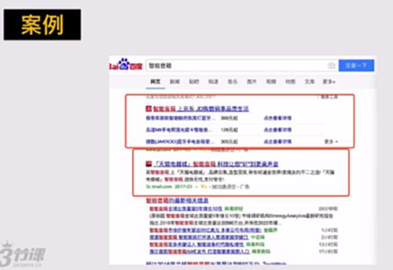

# S4.10：精准营销和效果广告类推广的操作方法

## 课程导读

在前面小结内容里，我们已经了解了3种营销推广方式及其逻辑

接下来，我们来学习最后一种营销推广方式，也是比较常见的方式：

精准营销、效果广告类推广

## 4.精准营销、效果广告类推广

本质是一种付费广告投放。

其一：这种精准营销效果广告类推广，给广告主了选择，选择很多参数来针对性投放；

其二，从效果上看，有很多计费方式是按照效果来计费的。

**案例**

**百度竞价**

**广告联盟或者门户的广告位**

**腾讯广点通：**&#x5FAE;信、QQ等里面的广告位，统一管理

## 精准营销、效果广告类推广基本操作流程或者步骤

1. 开通投放平台账号，熟悉投放平台规则：规则可能有如何计费，后台设置的参数如何设置

2. 配置投放规则及预算：按照规则设置自己的投放方案。

3. 上线测试，不断调整：开始少量投放，调整到较优的状态，主要看ROI的比率。

4. 完成投放

**问题：关于平台规则，该如何去了解？**

去知乎找答案

## 几种常见的效果类广告投放方式

* CMP：Cost Per Mille，千次展示成本，即按展示付费

* CPC： Cost Per Click，每个点击成本，即按点击付费，如关键词广告

* CPA：Cost Per Action，按照用户每个转化行为计费，如点击链接、拨打电话等（为了防止CPC里的竞争者恶意点击）

* CPS：Cost Per Sale，是指以实际销售产品数量来换算广告刊登金额。即根据每个订单/每次交易来收费的方式。用户每成功达成一笔交易,网站主可获得佣金。

* CPT：Cost Per Time，即按时长计费广告。按时长计费是包时段包位置投放广告的一种形式。
