# S4.11：提供推广效果：转发路径和场景的设计（一）

## 课程导读

到上一章为止，我们已经学习完了营销与推广的工作上基本操作层面的知识，但是任何工作都必须要有结果，也要有效果

接下来，我们来聊聊提升营销推广效果的3个原则。

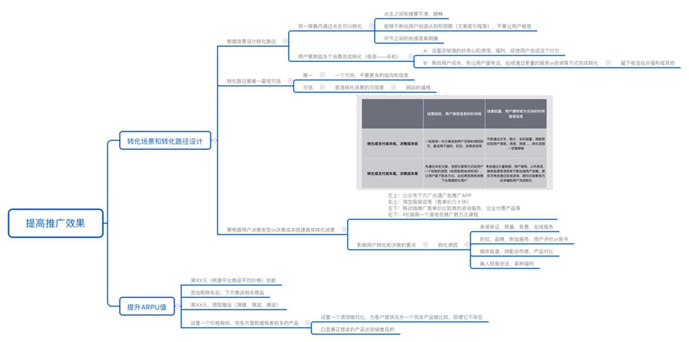

## 如何做好转化路径和转化场景的设计，提升营销推广效果

1. **原则1：要根据场景设计转化路径**

**场景1：同一屏幕内可完成转化**

**要点：**&#x6BCF;个点击与下一个点之间的衔接一定要平滑、顺畅，能够不断给用户创造认知和预期，不要让用户疑惑。

**案例**

**寺库**

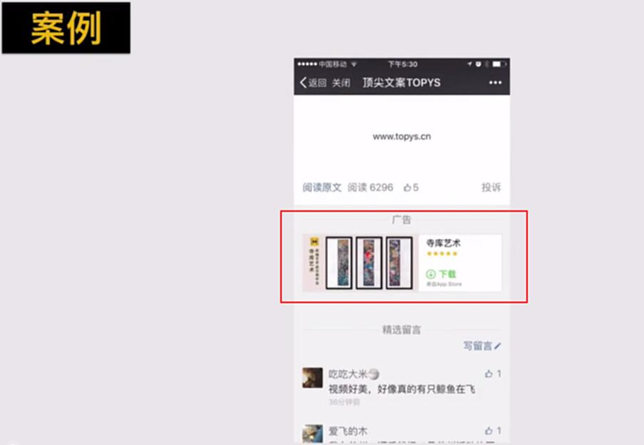

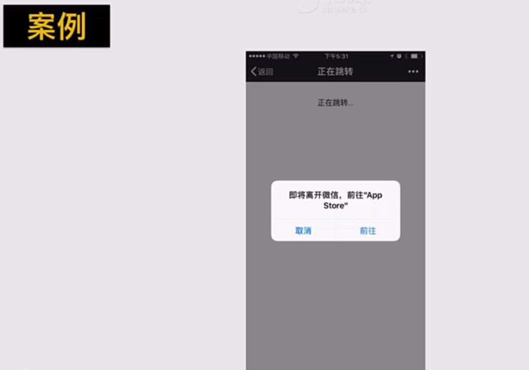

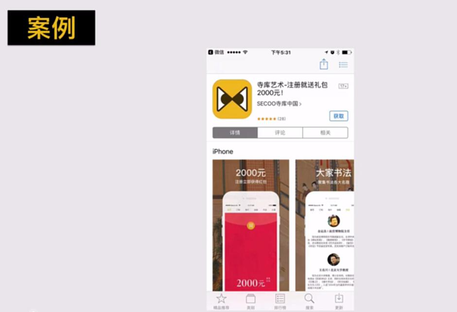

**摩拜单车**

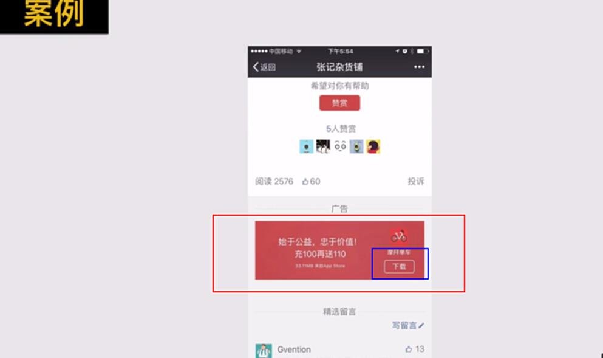

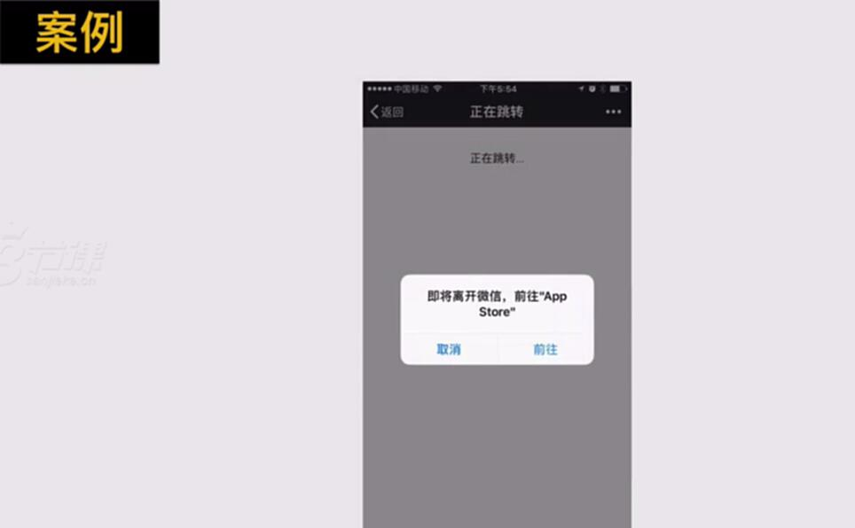

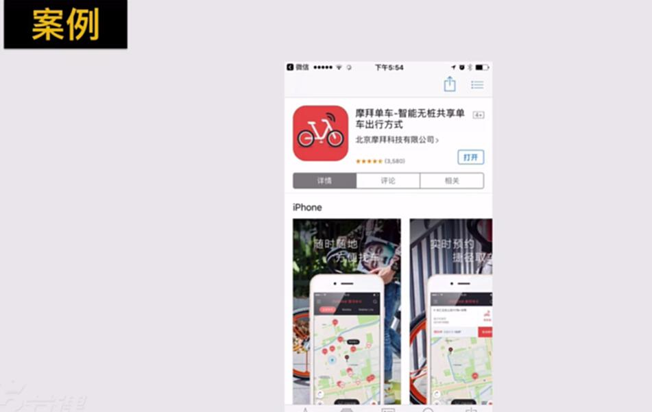

**失败案例**

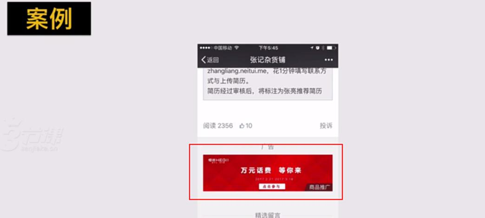

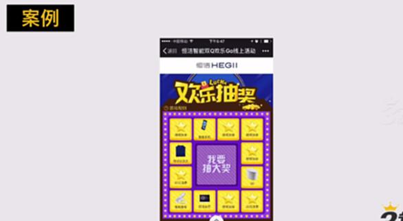

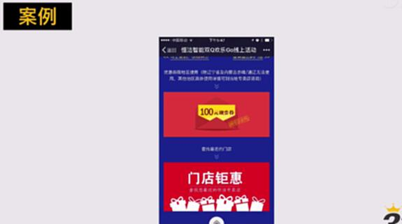

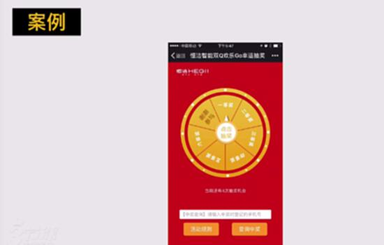

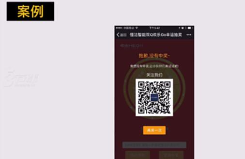

* **场景2：跨越多个不同场景完成转化**

方法1：设置足够强的好奇心、福利等诱饵，促成用户完成超越多个场景的转化行为

方法2：让用户先留下联系方式，后续通过更重的服务、咨询等方式完成转化

**案例**

**好奇套路的案例**

**地铁广告和传单**

**脉脉的营销：分众和新京报**

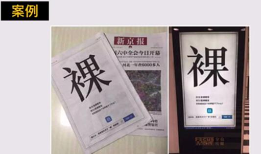

**福利套路：嘀嗒拼车**

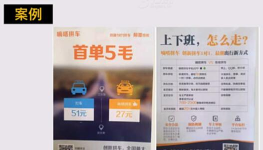

**采用降低用户成本的方式**

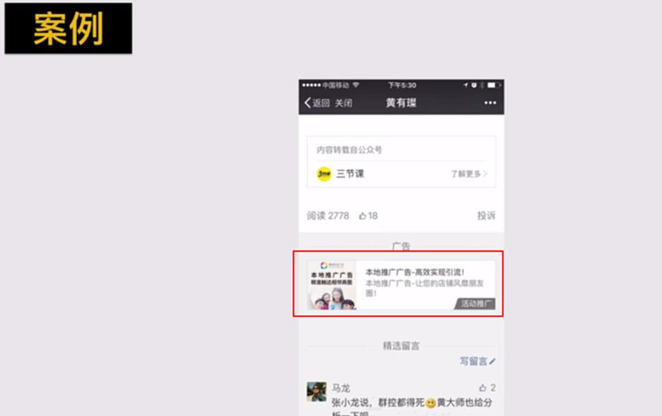

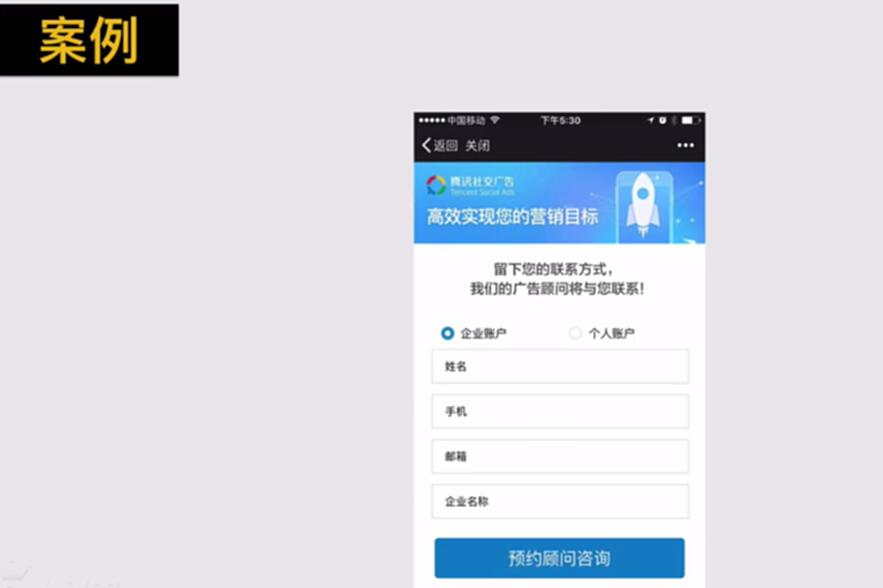

### 原则1常见的两种转化路径

**第一种：**

1. 发现广告，被文案图片等吸引

2. 发生点击

3. 进入Landing页

4. 完成转化

**第二种：**

1. 线下看到广告，被勾起好奇或者欲望

2. 线上通过搜索等行为找到广告标的

3. 通过搜索入口进入Landing页或者首页

4. 完成转化

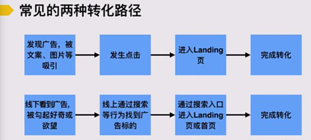

### 原则2：转化路径要尽量唯一、最短、可信

### 唯一

路径要给出用户一种前进的操作或者一种前进的路径

### 可信

要在转化场景里，要给用户可信的感觉

**负面案例**

**案例1：引导路径不唯一**

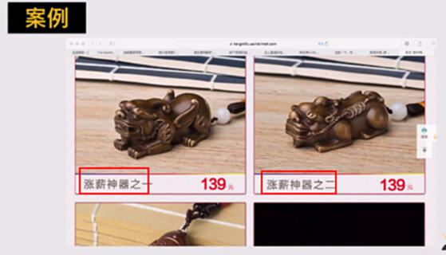

**案例2：不可信**

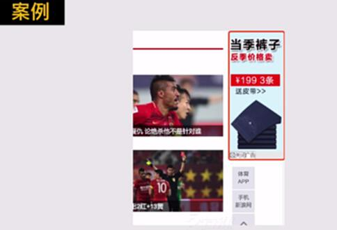

**页面配色让人觉得太土。**

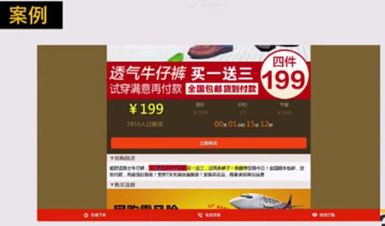

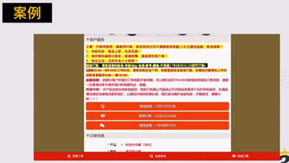

### 原则3：要根据用户的决策类型&决策成本搭建具体转化场景

## 【作业】达内教育从投放到转化的用户转化路径分析和数据统计

现在达内教育在做百度推广投放，其推广投放目标是希望用户购买课程。**现在请完成以下任务：**

* 问题1：请分析达内教育做百度推广投放的整个用户转化路径，其转化路径终点是用户购买课程；

* 问题2：请分析达内教育的推广路径上，有哪几个重要的转化节点和转化率？这些转化节点上，它设置的转化诱因是什么？

* 问题3：你现在需要对这条转化路径进行数据监控，你需要统计哪些数据来形成一个数据报表（EXCEL）好每天监控数据变化？

* 问题4：达内教育的百度投放ROI是如何计算的？请写出它的ROI公式

* 问题5：如果让你优化达内教育的用户转化路径，你会如何优化？

* 你提交的作业中必须包含：1）达内教育的用户转化路径分析  2）达内教育的重要的转化节点和相应的转化率公式，及设置的转化诱因  3）为了通过数据分析去监测转化效果，针对达内教育的转化路径你要统计哪些数据（例如：广告点击人数、landing 页UV等具体数据） 4）达内教育做百度投放ROI计算公式 5）你优化的用户转化路径的方向和具体做法

TIPS：

* 为了梳理出产品的真实转化路径，你需要亲自体量款产品的用户转化流程

* 达内在百度上的曝光（以java培训为例）

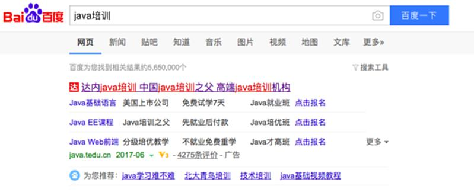

* 达内的Landing page

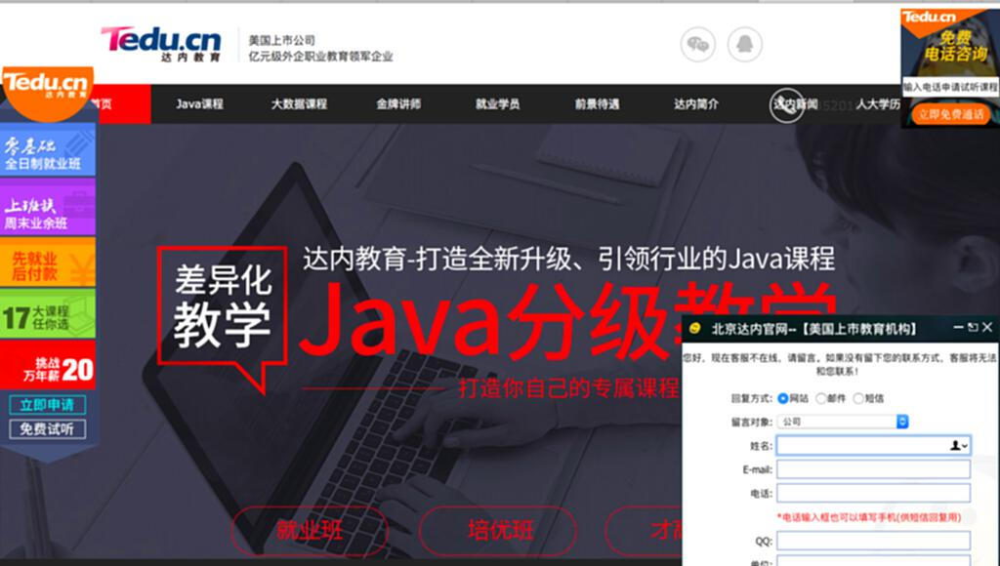

<http://bj.java.tedu.cn/zt/2016/?javabdtg=J01=150402327&ca_kid=18147415383&ca_cv=9653774240>

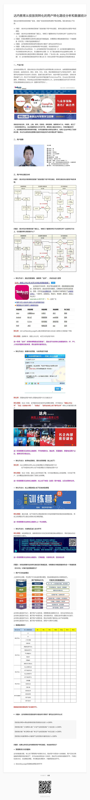

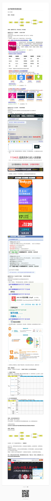

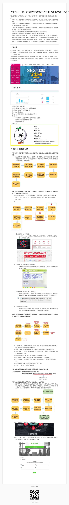

