# S4.12：提供推广效果：转化诱因和用户决策

## 知识要点

上一节的内容我们已经学习完了，你还记得提升营销推广效果的3个原则吗？我们来一起回顾一下：

* 原则1：要根据场景设计转化路径

* 原则2：转化路径要尽量唯一、最短、颗星

* 原则3：要根据用户决策类型、决策成本搭建具体转化场景

在原则3里有一个很重要的概念是“转化诱因”，接下来，我们来聊聊。

## 原则3：要根据用户的决策类型&决策成本搭建具体转化场景

**原则3里主要是转化诱因**

## 常见的转化诱因

1. 公开承诺

2. 限量

3. 免费

4. 在线服务

5. 福利折扣

6. 品牌：形象，公开承诺

7. 附加服务

8. 用户评价

9. 媒体报道

10. 真人现身说法

**案例：**

公开承诺

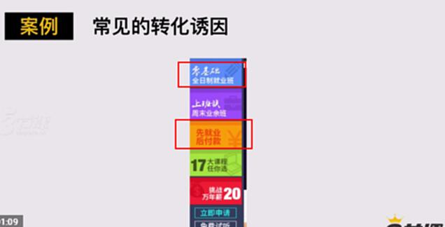

**免费**

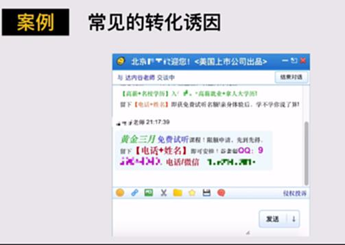

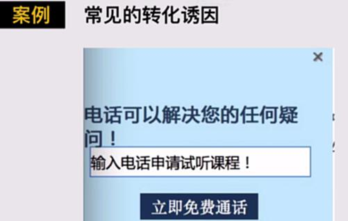

福利折扣

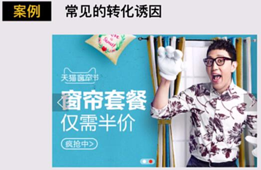

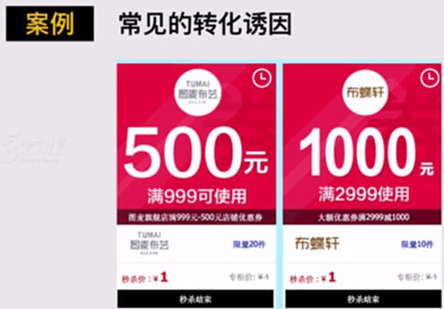

品牌形象，公开承诺

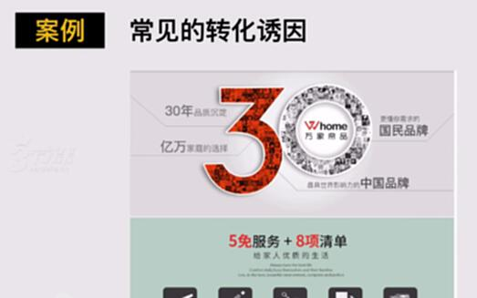

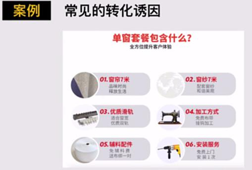

真实用户评价

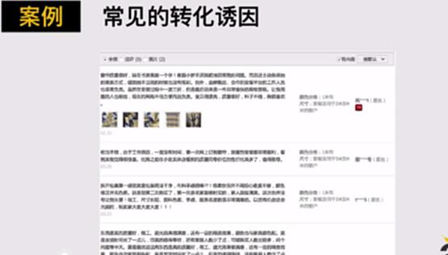

权威媒体评价

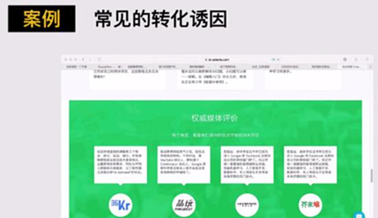

产品生产者，出镜真实可靠。

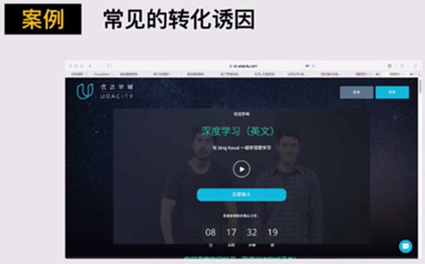

## 4类不同的场景

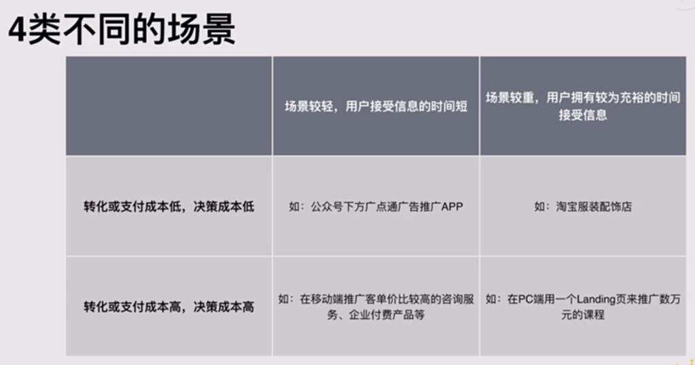

## 如何根据场景匹配诱因

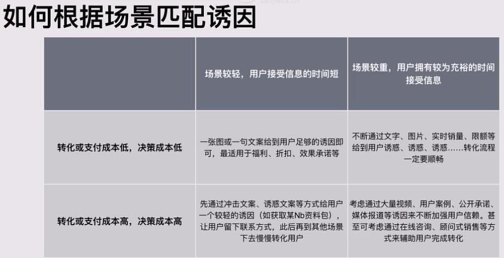

### 根据场景匹配诱因【重点内容】

**场景判断：**&#x8F6C;化成本低，决策成本低，场景较轻，用户接收时间较少

例如：公众号下方点击推广app

**转化诱因：**&#x4E00;张图或一句话文案给到用户足够的诱因即可，最适用于福利、折扣、效果承诺等。

**场景判断：**&#x8F6C;化成本低，决策成本低，场景较重，用户又有较为充裕的时间接受信息

例如：淘宝服饰配饰店

**转化诱因：**&#x4E0D;断通过文字、图片、实时销量、限额等给到用户诱惑、诱惑、诱惑……转化流程一定要顺畅。

**场景判断：**&#x8F6C;化成本高，决策成本也高，场景较轻，用户接收时间较少

例如：移动端推广客单较高的咨询服务、企业付费产品等

**转化诱因：**&#x5148;通过冲击文案、诱惑文案等方式给用户一个较轻的诱因（如获取某NB资料包），让用户留下联系方式，此后再到其他场景去慢慢转化用户。

**场景判断：**&#x8F6C;化成本高，决策成本也高，场景较重，用户又有较为充裕的时间接受信息

例如：在PC端利用一个loading页来推广一个数万元的课程

**转化诱因：**&#x8003;虑通过大量视频、用户案例、公开承诺、媒体报道等诱因来不断加强用户信赖。甚至可以考虑通过在线咨询、顾问式销售等方式来辅助用户完成转化。

## 如何通过转化诱因提升营销推广中国的ARPU值？

ARPU值：

ARPU值常见于电商类的产品

## 常见的提升ARPU值的手段

1. 包邮

2. 相关推荐

3. 满赠、满减、满返

4. 对比：设计一个产品，与主打产品作对比，让用户更快做出选择。

技巧：可以用户便宜来突出好，可以用过贵来突出性价比

对比：价格：只差4元；名称：豪华和普通；

缺货：普通缺货，豪华有货，而且预计明天就能送达

**案例**

**包邮，是一个辅助帮助用户提示ARPU值的工具**

不同产品的包邮的费用门槛是不一样的，有的9.9元包邮，有的是139元包邮等。这是根据不同的客单价来决定的

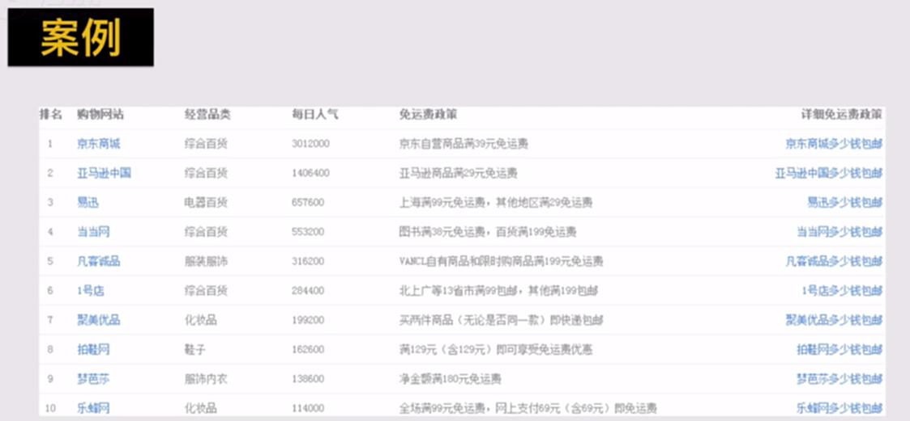

相关推荐：

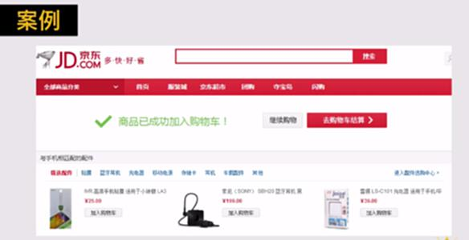

满赠、满减、满返

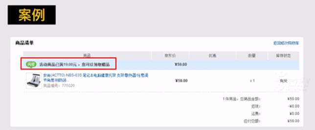

很有意思的方式：对比

对比：价格：只差4元；名称：豪华和普通；

缺货：普通缺货，豪华有货，而且预计明天就能送达

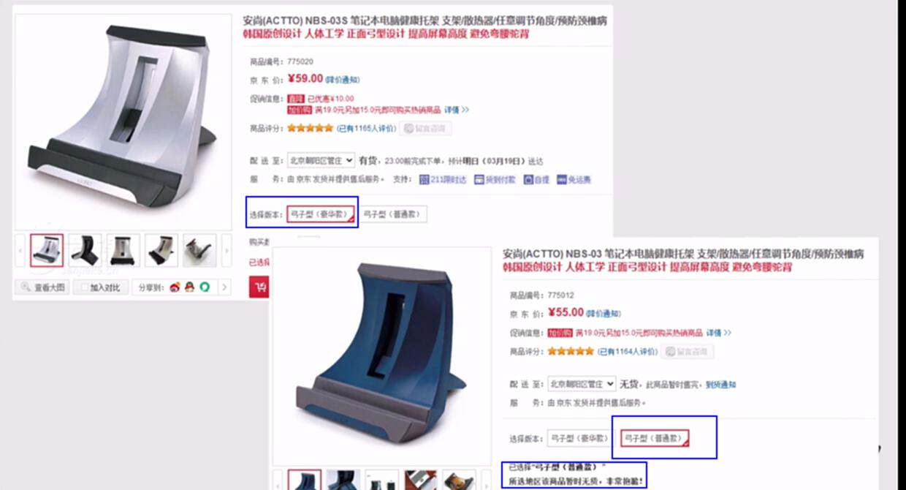

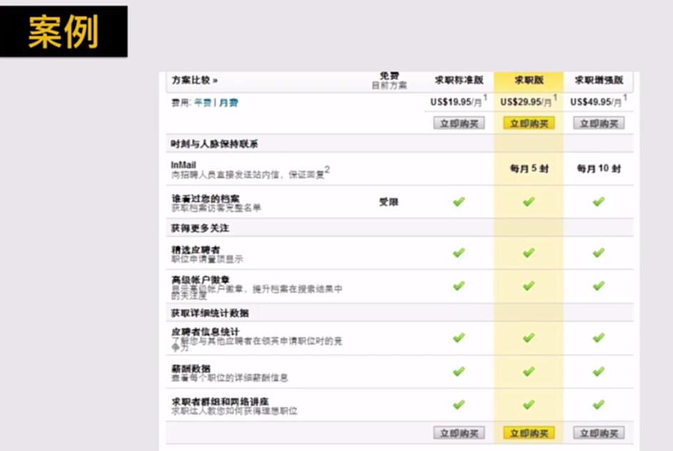

#
