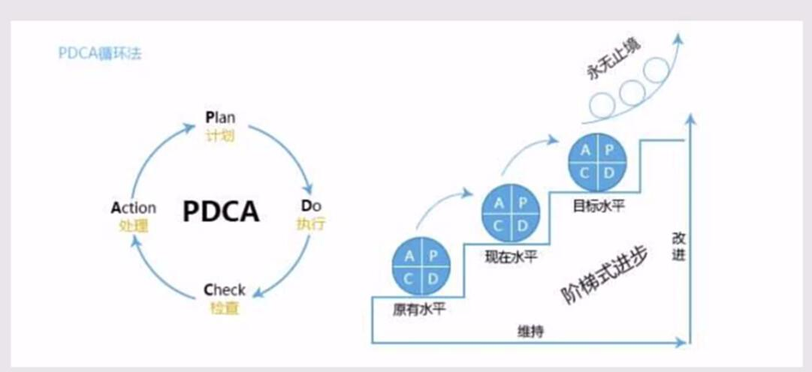
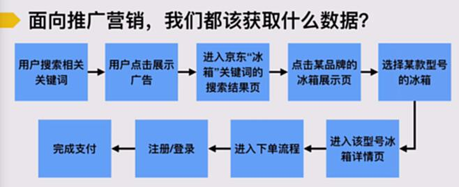

# S4.13：推广中的数据分析和优化的工作逻辑

## 课程导读

在前面的几章节里面，我们已经学习了大部分内容。

但是任何的运营工作都是持续性的，不是一蹴而就的，我们需要不断地根据效果来迭代优化。

那我们如何对效果进行评估，以及如何从评估的结果里优化我们的推广结果呢
接下来，我们来聊聊推广中的数据监测、分析与优化。

推广中的数据分析和优化的工作逻辑

## PDCA循环法

## 数据分析的本质

通过反馈来帮助你找到调整和改进的方向，最终实现产出的最大化。

## 数据分析基本工作逻辑

1. 获取到你想要的数据

2. 对于数据进行分析和比对

3. 对于推广行为优化和调整

## 面向推广营销，我们都该获取什么数据？

获取的数据是需要根据具体的推广流程来制定相应的数据。

理论上，整个转化路径中**每一个节点的数据**和转化，我们都应该能够监测或想办法获取到。

如果拿不到，至少想办法先拿到最关键的数据。

**提问：什么是最关键的数据呢**

针对推广的主要目的，基础的数据可以评估推广效果，就为关键数据

特别提示：如果推广的范围不大，或者推广效果提升的空间不大，并不需要太精细化的数据分析。

