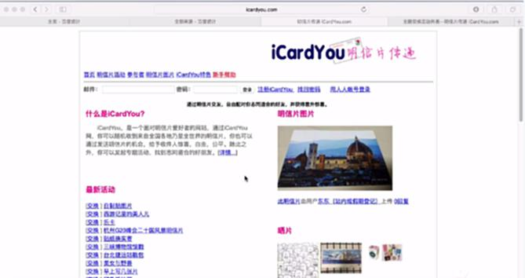
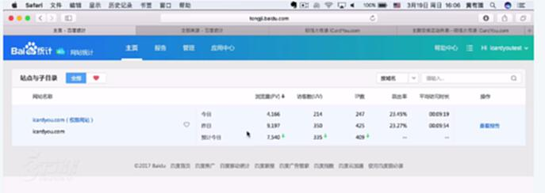
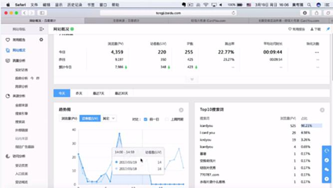
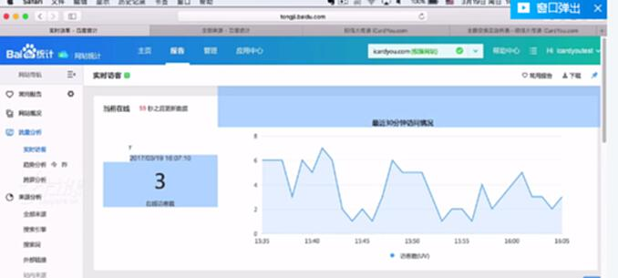
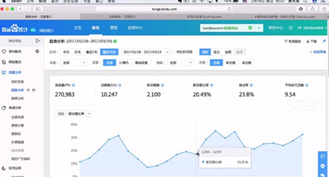
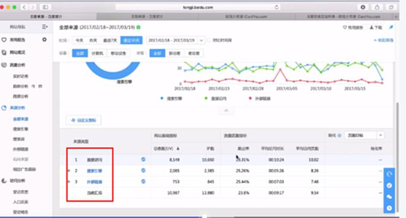
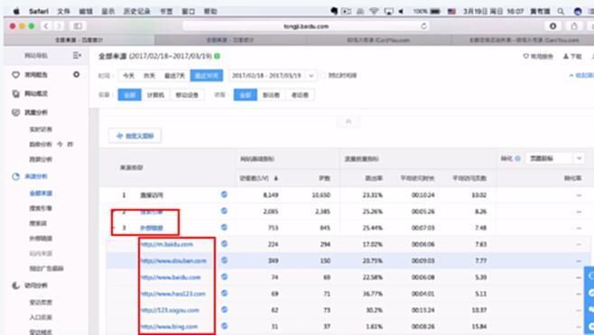
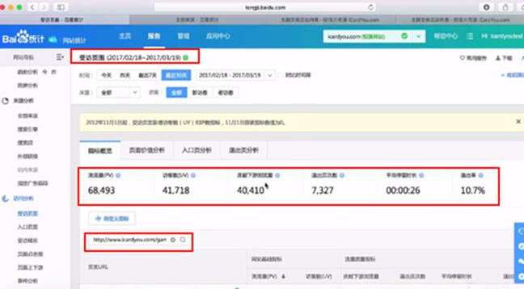

# S4.14：推广中获取数据的两种方式

## 课程导读

上一节，我们已经了解了推广营销数据分析的基本工作逻辑：

* 获取你想要的数据

* 对数据进行分析与比对

* 对推广行为优化和调整

接下来，我们来学习获取数据分析的两种方式

## 获取数据的两种方式

* 提出数据需求，由产品和研发实现数据埋点

* 通过接入第三方数据平台获取数据

## 一些常见的第三方数据平台

* 百度统计、GA、友盟（面对app的）、神策数据、GrowingIO……：每个平台如何接入会有具体说明

## 以百度统计为例说明如何获取到你想要的数据

第一步：先接入百度统计

第二步：可以从百度统计后天看到基本的概况

点击查看报告，可以看到更详细的数据。

