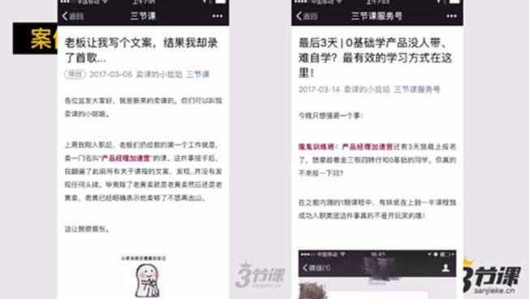
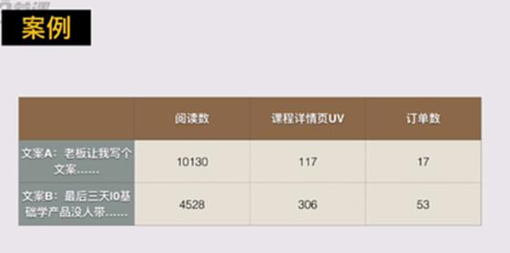
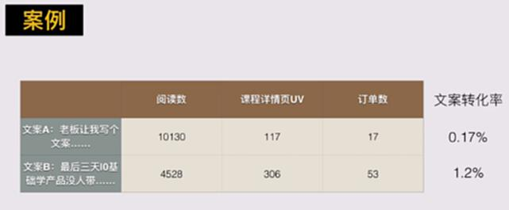

# S4.16：推广效果进行优化

## 课程导读

接下来，我们来学习对推广效果进行优化，主要内容：

* 穷举所有的理由，一一进行比对细化验证

* A/B Test

## 如何对推广效果进行优化？

* 穷举所有的理由，一一进行比对细化验证

* A/B Test

### 1、穷举所有的理由，一一进行对比细化验证

1. 进入页面时间长，页面加载时间长：

2. 没办法理解这个页面内容：去看一下百度数据里面的热点图（仍然需要埋点或者技术接入）

3. 对页面内容不感兴趣，或者说用户来源不精准

4. 来的用户需求，但是页面文案说服不了用户下单

### 2、A/B Test

**案例说明**

**案例背景**

**案例的Idear**

方案1：创意多，新奇

方案2：写的比较中规中矩

**案例实际数据**

除了推广很多东西需要经验，运营大部分都是需要执行力强的。
