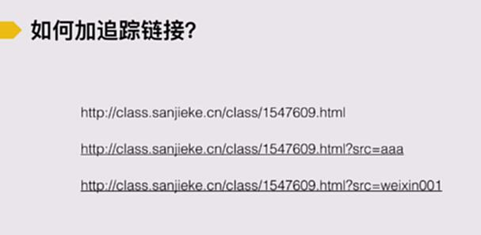

# S4.17：如何追踪链接？

## 课程导读

上一节为止，我们已经学习完了推广中的数据监测、分析和优化的全部内容。

额外补充下如何追踪链接来辅助我们进行数据分析。

## 如何追踪链接

具体操作步骤：

1. 确定要追踪的网址：http://class.sanjieke/cn/class/1547609.html

2. 在原有的网址里，用英文输入法或者半角方式加上【**?src=**&#x61;aa】

3. 加完之后，还会进入到此页面，如果是同一个页面，在不同渠道做推广，可以在【aaa】的部分自由定义**字母+数字**，并做好列表，这样可以详细的知道不同渠道来源的UV量。

