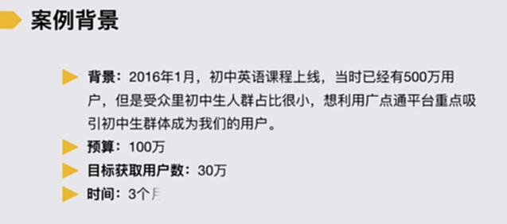
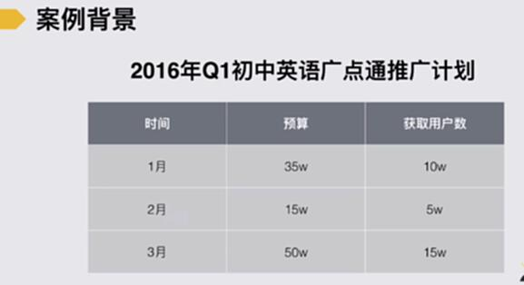
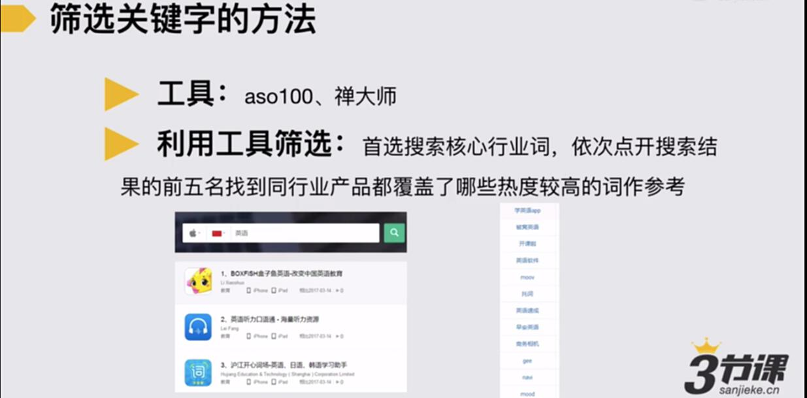
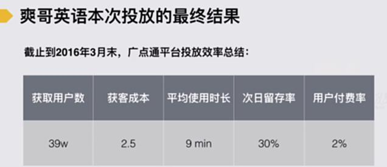

# S4.18：一次推广投放从准备到落地

## 课程导读

接下来，我们学习一次推广投放从准备到落地

## 效果类广告平台操作

如何利用广点通平台做到推广效果最大化？

案例背景

**推广计划**

广点通操作步骤

## 了解一个平台的操作步骤

1. 先通过各种方式了解这个平台：搜索、垂直论坛等

2. 选择核心代理：了解优惠力度和范围、代理能给的优化辅助支持

3. 准备物料和上线投放

### 3.关于物料和上线的要点

* 了解广告位置

* 根据广告位置准备物料

* 测试素材

* 定义投放设置

* 监测效果及优化

### 需要记录老师操作广点通的关键点的说明

### 筛选关键词的方法

1. 工具：aso100、禅大师

2. 利用工具筛选：首先选择搜索核心行业词，依次点开搜索结果的前五名找到同行业产品覆盖了哪些热度较高的词作参考。

### 效果监测的两个补充说明

1. 一定要单独出可监测的安装包以评估获客成本

2. 更精细化的评估渠道用户质量：了解该渠道用户的使用时间、次日留存率、7日留存率、在应用内活动的路径以及付费转化率和复购率等

**案例**

