# S4.19：熟悉一个陌生平台的推广规则

## 接触一个陌生推广平台时我们应该了解什么

1. 了解该平台的免费推广玩法

2. 了解该平台的付费推广玩法

**例如**

应用商店免费玩法：首发、特权活动、专题、新品推荐、精品推荐等

应用商店付费玩法：CPD、CPT、CPC等

## 陌生推广平台了解时，具体操作要点

* 了解渠道的信息分发规则：如微博、快手、知乎各平台的信息分发规则都不同（使用，并了解其特点）

* 多去接触核心圈子：及时了解最新渠道动向和玩法，例如：运营圈子，多去了解最新的渠道

* 了解渠道流量和性价比：找操作经验的大牛和前辈请教

* 多找几个渠道代理询价：拿到最佳折扣

### 找大牛请教经验的几点技巧

* 态度谦虚

* 问题发生的背景描述要清楚

* 明确自己已经做过哪些准备和尝试

* 问题不要太多

**案例**

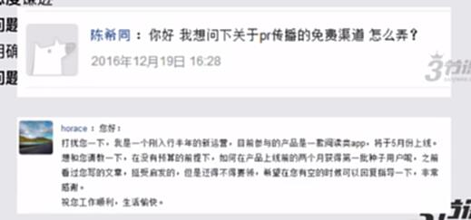

## 具体案例分析

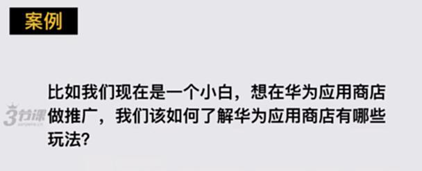

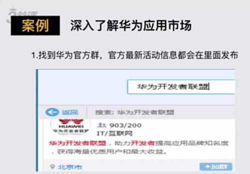

### 华为应用市场免费玩法

1. 找到华为官方群，官方最新活动信息都会在里面发布

2. 在官方后台详细了解该应用市场呃福利申请和活动发布规则

3. 找到免费玩法注入：首发、鲜品专辑、特权活动、周一见、启蒙计划

首发

鲜品专辑

特权活动

周一见

启蒙计划

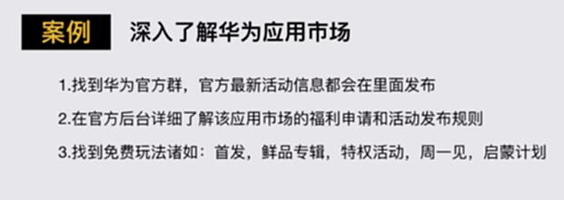

### 华为应用市场付费玩法

1. 付费玩法：CPD投放

2. 仔细阅读每个应用市场的文档，基本90%的应用市场问题都可以通过后台文档获取解答

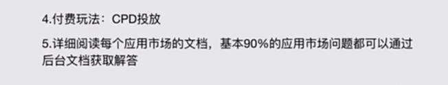

## 特别提示

**如果有急需解答的问题，可以通过两种方式：**

1. 通过QQ群找到官方运营

2. 通过后台的官方客服直接联系

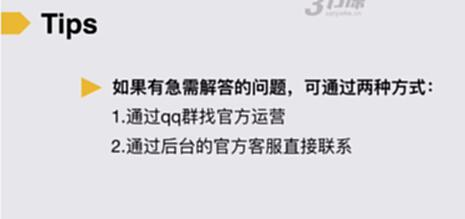

## 补充说明

### 目前主要流量分发平台：

1. 第三方应用商店：百度、360、应用宝、阿里系（豌豆荚、PP、UC）

2. 厂商：小米、华为、OPPO、vivo、乐商店、魅族等

### 持续思考如何配合应用商店的运营从而更好地获取流量：

更多的应用商店KPI都是品牌曝光

1. 首发时配合应用市场同步发PR文章，自媒体传播，官网传播，论坛传播

2. 平时有空的时候，在应用市场群里，积极响应应用市场需配合的活动

3. 在群里力所能及范围内帮助群里的小伙伴

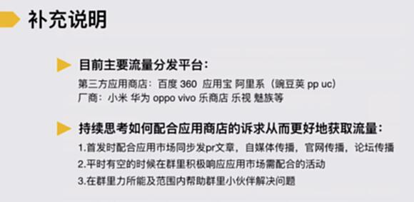

案例：首发

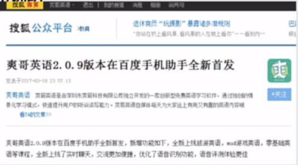

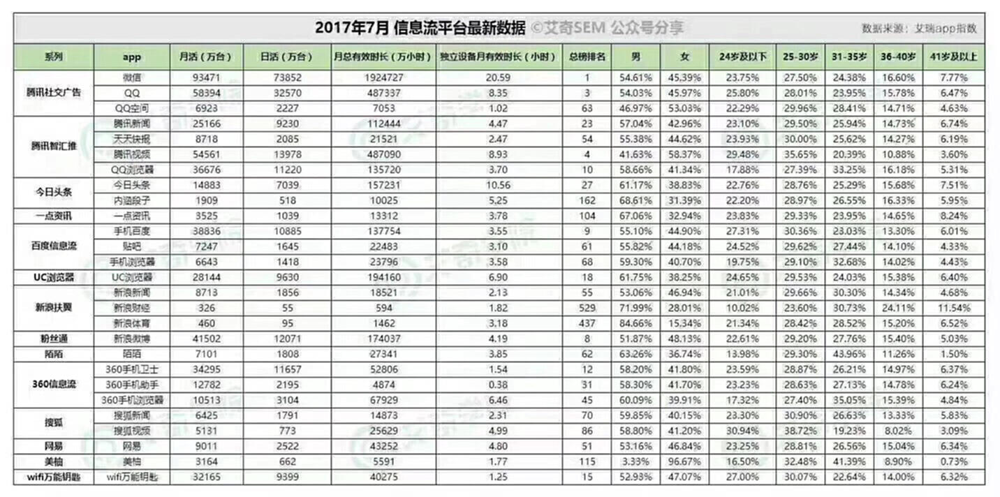

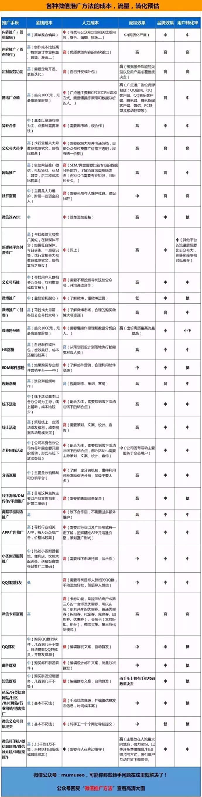

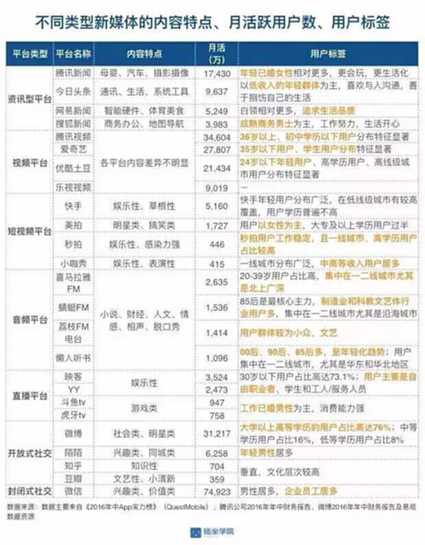

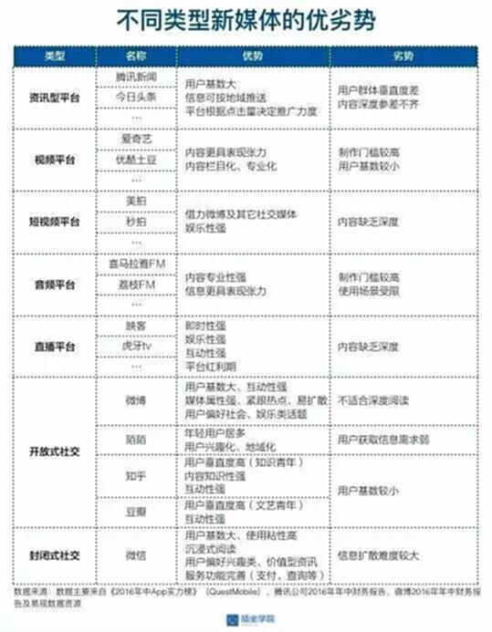

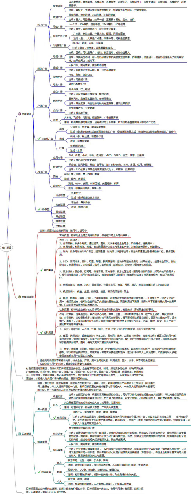

