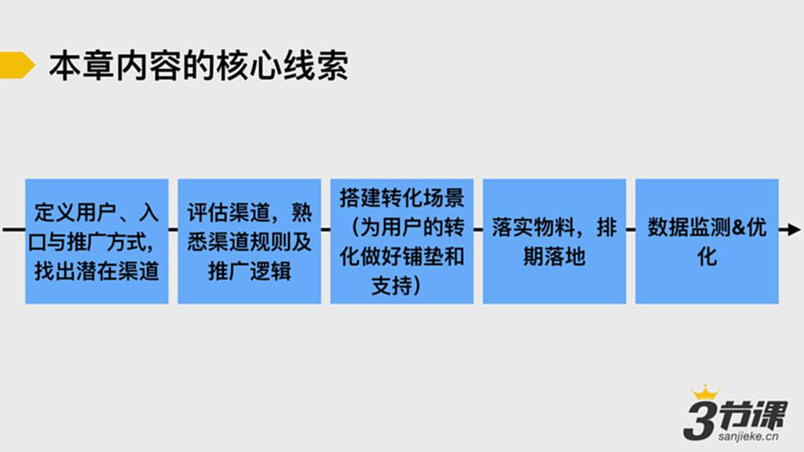

# S4.1 本章内容的核心线索

## 课程目标

在短时间内针对一个陌生推广渠道（例如今日头条），产出一份可落地的推广方案。

## 一份可落地的营销推广方案应包括的要素

1. **推广渠道的核心规则和推广逻辑**
   - 渠道的流量分发机制
   - 推广投放的基本规则

2. **用户转化路径和场景设计**
   - 用户从接触到转化的完整路径
   - 各环节的场景设置

3. **转化诱因设计**
   - 激发用户行动的关键因素
   - 促成转化的动机设计

4. **推广落地物料**
   - 所需图片、文案等素材
   - 物料规格和标准

5. **推广落地排期表**
   - 推广时间安排
   - 各阶段工作计划

6. **数据监控指标**
   - 核心监测数据
   - 效果评估标准

---

## 本章课程内容

本章围绕如何产出一份可落地的营销推广方案，带领大家逐步学习营销推广的核心方法。

---

## 本章作业案例产品：人人贷借款APP

### 产品定义

人人贷借款APP服务于手机借款用户，能够快速为需要小额资金的用户提供信用贷款服务。

### 用户特征

- **地域分布**：主要集中在北上广深杭5大城市
- **年龄分布**：
  - 30-39岁人群：49%
  - 40-49岁人群：28%
  - 20-29岁人群：20%

### 学习建议

建议下载注册后，亲自研究体验这款产品，以便更好地完成作业。
