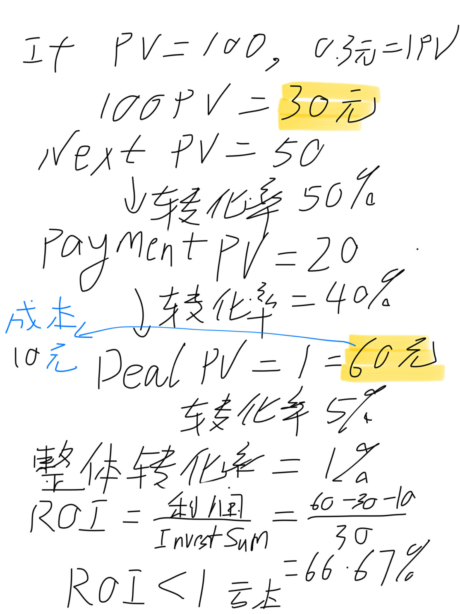
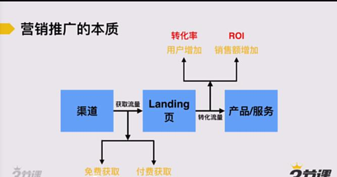
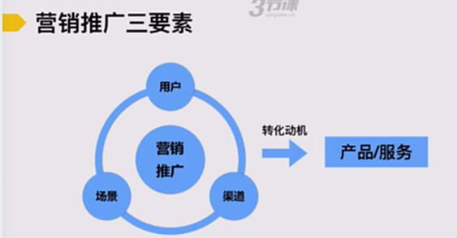

# S4.2 认识推广与营销

## 课程导读

本节将介绍营销与推广的基本概念：

- 什么是营销推广？
- 营销推广的三要素是什么？
- 如何制定营销推广的基本工作思路？

---

## 营销推广的本质

### 基本流程

```
渠道 → Landing页（着陆页） → 产品/服务
```

### 核心环节解析

#### 1. 渠道

**功能**：获取流量

**类型**：
- 免费获取
- 付费获取

#### 2. Landing页（着陆页）

**功能**：转化流量

**目标**：
- 用户增加
- 销售额增加

#### 3. 产品/服务

**核心关注数据**：
- **转化率**：访问用户中完成转化的比例
- **ROI（Return On Investment，投资回报率）**：投资/成本＞1




---

## 营销推广三要素

### 1. 用户

**要点**：用户细分化

**说明**：根据用户细分，才能选择用户常去的渠道。

**示例**：三节课用户画像
- 大学大三、大四学生
- 刚入行不久的从业者
- 有经验需要进一步提升的从业者

### 2. 渠道

**核心问题**：用户常去的渠道有哪些？

**分析维度**：
- 用户使用频率
- 用户停留时长
- 渠道流量规模

### 3. 场景

**定义**：用户在特定渠道下的具体使用情境

**示例**：三节课用户在知乎上的场景
- 闲逛浏览运营知识
- 了解大学生就业情况
- 寻求职业发展建议

**关键原则**：**在不同场景下，需要给到用户不同的转化动机。**



---

## 营销推广的基本工作思路

### 第一步：定义用户、入口与推广方式，找出潜在渠道

**核心任务**：
- 明确目标用户画像
- 分析用户行为特征
- 筛选潜在推广渠道

### 第二步：评估渠道，熟悉渠道规则及推广逻辑

**核心任务**：
- 了解渠道是否支持付费推广
- 掌握推广形式和规格要求
- 研究如何获得最大展示和曝光

**示例**：知乎推广规则
- 是否支持付费推广
- 免费推广的优化方法
- 内容推荐机制

### 第三步：搭建转化场景

**定义**：为用户的转化做好铺垫和支持

**核心任务**：
- 分析用户在特定场景下的诉求和动机
- 设计能够解答用户疑问的内容组织方式
- 构建符合用户预期的转化路径

**示例**：知乎场景下的转化设计

**用户提问**："无经验的大学生如何进入腾讯，做一个合格的产品运营？"

**转化场景搭建要点**：
- 理解用户的求职焦虑
- 提供可操作的行动建议
- 展示课程如何帮助解决问题

### 第四步：落实物料，排期落地

**物料包括**：
- 图片素材
- 文案内容
- 视频资料
- 其他推广素材

**排期考虑**：
- 是否需要提前预约
- 最佳推广时间
- 投放频次安排

### 第五步：数据监测与优化

**核心理念**：一个好的推广结果一定是通过反复的琢磨、优化得来的。

**关键动作**：
- 实时监测核心数据指标
- 分析数据波动原因
- 持续优化推广策略
- A/B测试不同方案

---

## 推广营销中的常见问题

| 问题类型 | 具体表现 |
|---------|---------|
| 渠道选择困难 | 找不到合适的渠道（尤其是新手） |
| 渠道评估困难 | 面对多个渠道，不知如何选择和判断 |
| 陌生渠道投放 | 有预算但找到不熟悉的渠道，不知如何花钱 |
| 效果提升困难 | 推广效果不好，不知道原因在哪里，也不知道如何提升 |
| 方案制定困难 | 独立制定推广方案时，完全缺乏思路 |

---

## 本模块主要内容

### 1. 如何发现及开拓与你匹配的推广入口
**解决问题**：找不到合适的渠道

### 2. 推广营销工作的核心工作思路和要旨
**解决问题**：缺乏可落地的营销思路

### 3. 常见的4类营销推广方式及其逻辑
**解决问题**：不熟悉市面上常见的推广方式和基本工作流程

### 4. 提升营销推广效果的核心思路
**重点内容**：转化场景的搭建，聚焦具体工作方法

### 5. 推广的数据监测、分析和优化
**解决问题**：如何科学评估和提升推广效果

### 6. 如何制定一个推广方案
**解决问题**：如何围绕目标规划推广方案

### 7. 如何快速熟悉一个平台的推广规则
**解决问题**：陌生平台的快速上手方法

### 8. 真实的推广案例解析
**学习方式**：通过实际案例理解理论应用
