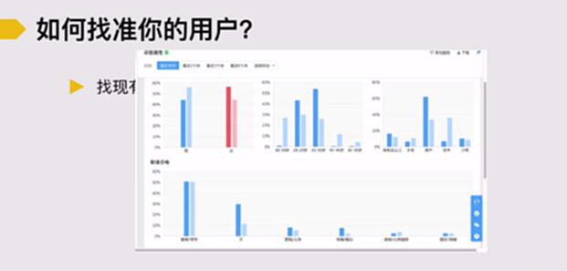

# S4.3 找到推广入口：精准定义潜在用户

## 课程目标

本节学习如何发现及开拓与你匹配的推广入口。

**核心原则**：先能够精准定义用户，才能找到合适的入口。

---

## 案例背景

假设某女性学习社群想要推广，如何找到合适的推广入口？

---

## 如何找准你的用户

### 方法一：分析现有产品数据

**数据来源**：
- 百度统计
- Google Analytics
- 站内后台数据
- 第三方数据分析工具

**分析维度**：
- 用户地域分布
- 年龄性别比例
- 访问来源渠道
- 用户行为路径

### 方法二：进行用户调研和用户访谈

**用户访谈**：
- 电话访谈
- 深度访谈录音
- 一对一交流

**用户调研**：
- 在线问卷调查
- 邮件调研
- 委托第三方专业调研机构（适用于预算充足的情况）

### 方法三：小范围测试验证假设

**适用场景**：在用户画像不清晰的情况下

**操作方法**：
1. 基于现有认知做出用户假设
2. 小范围投放推广测试
3. 收集反馈数据
4. 调整用户画像定义
5. 迭代优化

---

## 小结

精准定义用户是找到合适推广入口的前提条件。建议综合使用以上三种方法，通过数据分析和用户调研相结合的方式，逐步明确目标用户画像。
