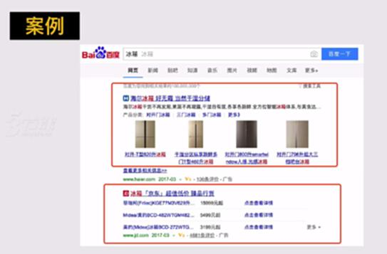
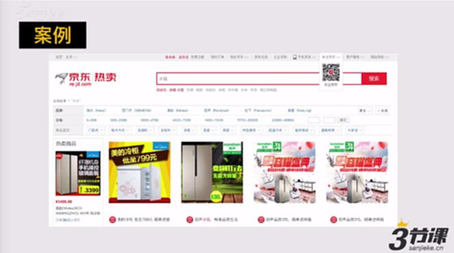
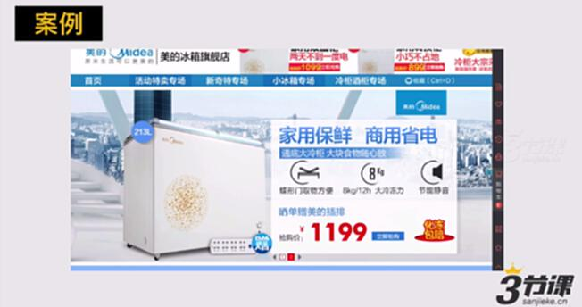
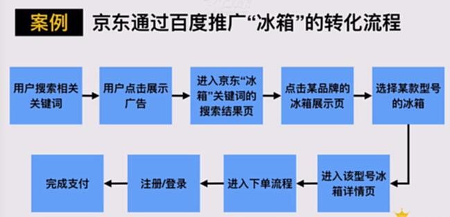
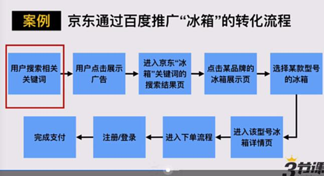
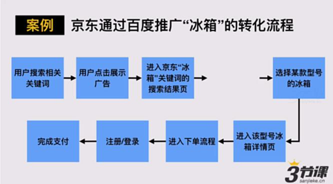
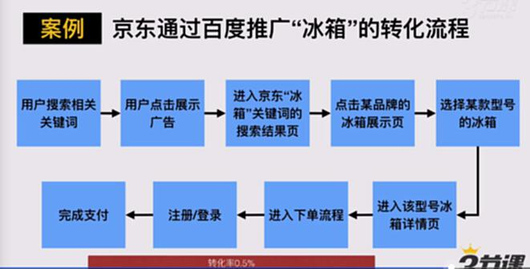
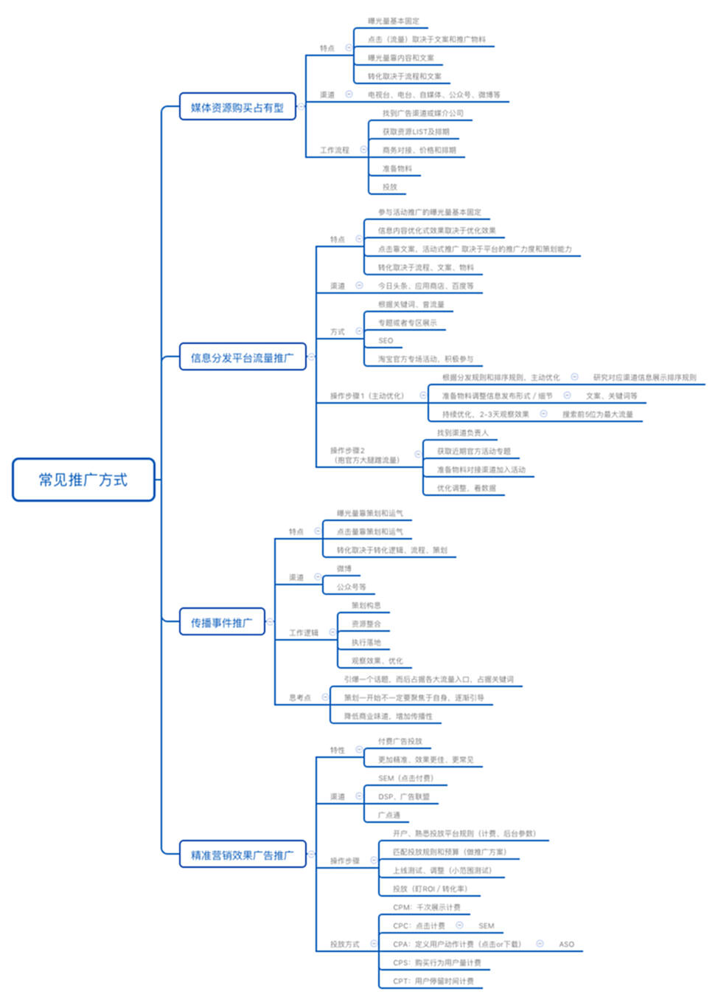
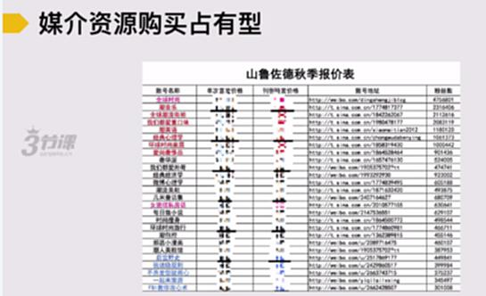
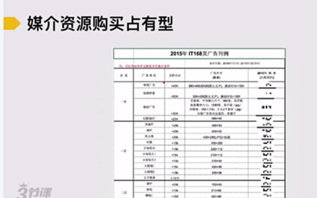

# S4.6：推广和营销工作的基本方法：三个核心关键词

## 课程导读

上一章，我们聊完了如何发现以及开拓与你匹配的推广入口

那在我们日常运营工作中，我们该怎么做呢接下来，我们来重点聊聊**推广营销工作的核心工作思路是什么？有哪些要旨？**

## 推广和营销工作的基本方法：三个核心关键词

* **曝光：**

产品展示的信息能被多少人看到，取决于以下两点：

第一：该频道的用户数量；

第二：推广的信息所做的工作和所处的位置，能得到多少人观看。

* **点击：只有用户点击，才有下一步的转化可能。**

* **转化：会有一定比率的漏掉**

**案例**

**展现**

**点击之后**

**再次点击**

再点击，最后才是转化

## 推广和营销的重中之重：转化流程

**案例**

**刚才案例里的转化流程：**

1. 用户搜索相关关键词

2. 用户点击展示广告

3. 进入京东冰箱关键词的搜索结果页

4. 点击某品牌的冰箱展示页

5. 选择某款型号冰箱

6. 进入该型号冰箱详情页

7. 进入下单流程

8. 注册/登陆

9. 完成支付

## 常见的三类优化思路

* **①优化流量：例如，百度搜索，可以拓展关键词，占据更多关键词。**

* **②优化或缩短流程：流程链条越长，用户流失的可能性就越高。**

**【特别数据】每增加一个环节，会带来至少20%的流失。**

**流程最好不要高于5步。**

* **③提升特定环节的转化率：每个步骤与下一个步骤之间就会有一定的转化率。**

数据做的足够精细，是可以观察到哪个转化率比较低，就可以进行优化。

**&#x20; ①优化流量：例如，百度搜索，可以拓展关键词，占据更多关键词。**

案例

**&#x20; ②优化或缩短流程：流程链条越长，用户流失的可能性就越高。**

**【特别数据】每增加一个环节，会带来至少20%的流失。**

**流程最好不要高于5步。**

**案例**

1. 用户搜索相关关键词

2. 用户点击展示广告

3. 进入京东冰箱关键词的搜索结果页

4. ~~点击某品牌的冰箱展示页~~

5. 选择某款型号冰箱

6. 进入该型号冰箱详情页

7. 进入下单流程

8. 注册/登陆

9. 完成支付

**&#x20; ③提升特定环节的转化率：每个步骤与下一个步骤之间就会有一定的转化率。**

数据做的足够精细，是可以观察到哪个转化率比较低，就可以进行优化。

**案例**

## 关于转化率的一些参考数字&标准

1. 一个详情页较为正常的转化率通常在1%-4%之间

2. 单篇微信图文推广的点击转化率正常在8%-10%左右

3. 对于APP，一般的流量平台的下载转化率在1%-2.5%左右

4. 学习类APP的下载转化率都在1%-1.5%左右

5. ……

# S4.7：媒介资源购买占有型推广的操作方法

## 课程导读

上一章我们了解了推广营销的核心工作思路

接下来我们结合实例来聊聊市场上常见的4类营销推广方式：

* **媒介资源购买占有型推广**

* 信息分发平台流量推广

* 传播、事件推广

* 精准营销、效果广告类推广

## 1.媒介资源购买占有型推广

## 媒介资源购买占有型推广操作流程

1. 找到广告渠道或者媒介公司

2. 获取资源List及报价

3. 洽谈资源、价格和排期

4. 准备物料：图片、文案等

5. 完成投放

## 媒介资源购买占有型推广特点

* **曝光量基本恒定**，变化不会太大

* 社会化媒体中的媒介资源可能曝光量还会取决于内容和文案

* **点击**基本靠**文案和其他推广物料**

* **转化**取决于**流程和文案、物**料等
