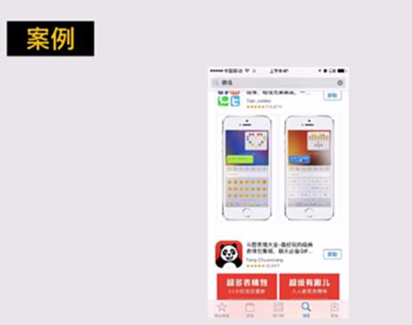
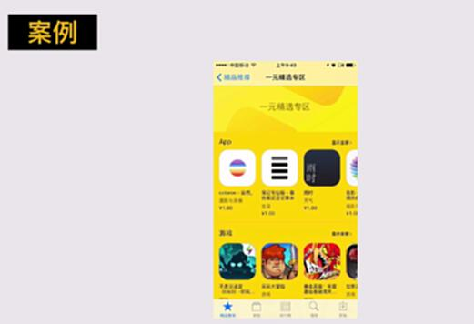
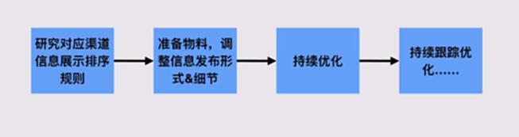
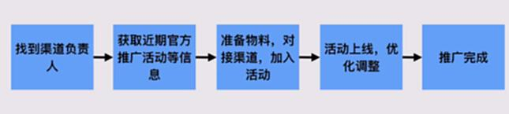
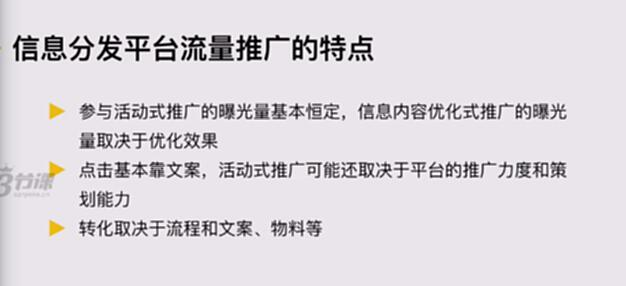

# S4.8：信息分发平台流量推广的操作方法

## 课程导读

媒介占有型推广是比较常见的营销推广方式，我们需要关注的重要工作流程：

* 找到广告渠道或者媒介公司

* 获取资源List及报价

* 洽谈资源、价格和排期

* 准备物料：图片、文案等

* 完成投放

接下来，我们来聊聊第2种营销推广方式：信息分发平台流量推广

## 2.信息分发平台流量推广

例如：今日头条、百度、应用商店等

**案例：应用商店：做了特定的优化，关键词。**

**应用商店里的专题或者专区**：1元精选专区

## 信息分发平台流量操作步骤

### 第一种：研究既定规则和持续优化

1. 研究对应渠道信息展示排序规则

2. 准备物料，调整信息发布形式&细节

3. 持续优化：排在前五位流量才会很大

4. 持续跟踪优化……

### 第二种：主动抱大腿，蹭流量

1. 找到渠道负责人

2. 获取近期官方推广活动等信息

3. 准备物料，对接渠道，加入活动

4. 活动上线，优化调整

5. 推广完成：活动下架

以上两种基本上都是免费了。

## 信息分发平台流量推广特点

* 参与活动式推广的曝光量基本恒定，信息内容优化式推广的曝光量取决于优化效果

* 点击基本靠文案，活动式推广可能还取决于平台的推广力度和策划能力

* 转化取决于流程和文案、物料等

