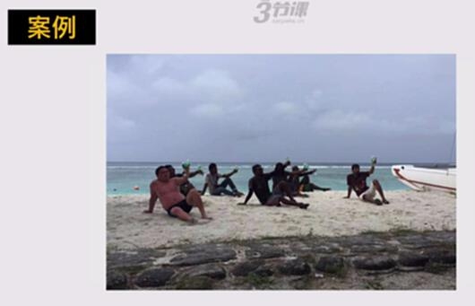
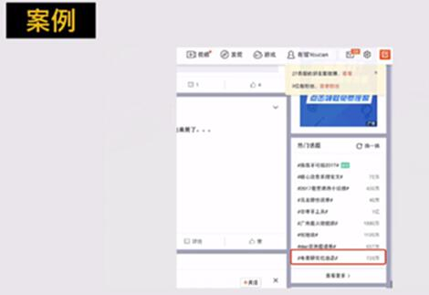
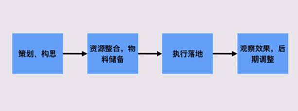

# S4.9：传播事件型推广的操作方法

## 知识要点

上一节的内容我们已经学习完了，你还记得信息分发平台流量推广的特点吗？我们来一起回顾一下：

* 参与活动推广的曝光量基本恒定，信息内容优化式推广的曝光量取决于优化效果

* 点击基本靠文案，活动式推广可能还取决于平台的推广力度和决策能力

* 转化取决于流程和文案、物料等。

接下来，我们来简单聊聊传播、事件型推广

## 3.传播、事件型推广

传播、事件型推广定义：

**案例**

**途牛事件营销**

**话题榜**

主要打品牌传播。

## 传播事件型逻辑

1. 策划、构思

2. 资源整合，物料准备

3. 执行落地

4. 观察效果，后期调整

## 传播事件型传播最主要的是策划

* 曝光量基本靠策划能力和运气

* 点击量基本靠策划能力和运气

* 转化取决于转化逻辑和流程，还是看策划能力
