# 从根本上提升你的流量、用户敏锐度与洞察

# 课程导入

　　2025年08月22日 18:45

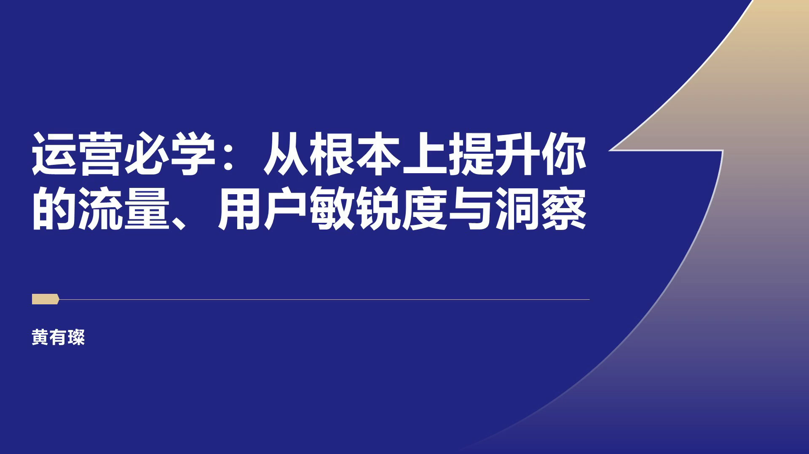

　　今天我们要开启的一堂课程，是一门非常有意思的课程。这门课程叫做从根本上提升你的流量用户互动的敏锐度和洞察。我是这门课程的讲师，有看学社创始人和CEO黄有璨。这一模块的课程也是我们建议所有0到3年工作经验的运营人，你必修的这么一个模块，所以还是非常重要的一个模块。好，下边我就花一点时间来讲一下，为什么这个模块它非常的重要。首先我们都知道其实所有的运营工作，它无非导向就是这四方面，传播、用户维系、流量还有转化，？

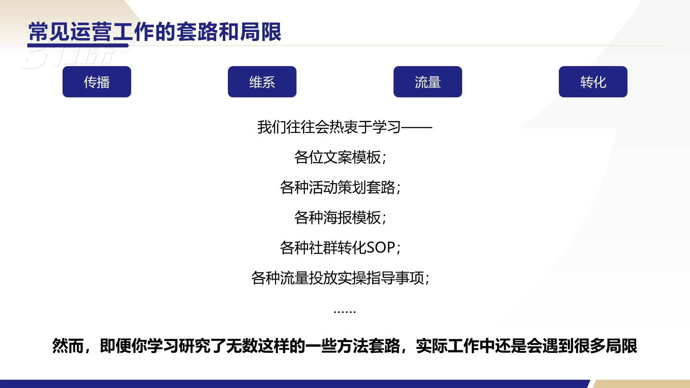

　　那往往我们作为运营的从业者，在刚开始工作的头几年时间里，都会特别热衷于去学习各种各样的技巧模板，还有套路。什么文案模板、活动策划模板，各种什么转化SOP等等等等。对不对？我们都会特别热衷学习这些东西。但是你会发现往往很多时候，即便你学习研究了无数这样的一些方法、套路、技巧，你实际工作中还是会遇到非常多的局限。我们不妨来看一个真实的故事，就是在过去五六年时间里面，因为我们自己本来就一直在面向运营从业者们去讲课，去做大家的能力提升之类的对曾经就是为了让我们的很多用户能够真正去实践落地，更好的提升自己的文案技巧，我们就对比了近百门行里边的课程，花了很大的功夫做了一门非常精细落地的文案的课程。包括像有看学社现在的文案课程。实际来看我觉得在整个行业里面，它的落地性，它的精细度应该都是非常高的。

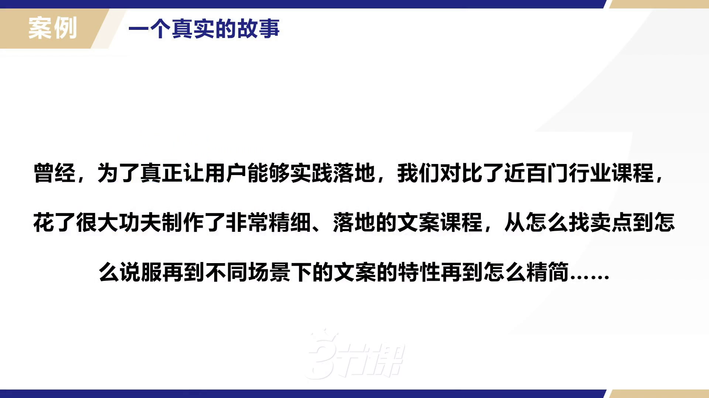

　　行业里边其他的文案课程一般都是说，你看写文案好的文案和不好的文案有什么区别，我们总结出来有三点，所以记住？就写完的时候你要注意有这么三个注意事项，一二三完了好了你自己去写。那我们的课程会做到什么程度呢？我们的课程就会做到。你看你写所有的文案，比如说现在有个水杯摆在你面前，？因为你要把这水杯卖出去，那你首先得找到它的关键的卖点在哪里，那到底怎么找这个卖点呢？好，一套方法。

　　找到卖点之后，你可能要面向用户完成一个说服。因为其实售卖的过程，成交的过程，其本质上是你要面向用户完成一个说服的过程，？那怎么面向用户完成说服？我们又给你一些具体的方法，具体指引。再到不同场景下的文案特性怎么来去做，怎么来去精简。比如说你是写一个APP的push，还写一个地铁广告牌的广告文案，还是写一篇微信公号的推文，？它其实不一样的，我们再具体来落地。所以各位你可以感受到一门文案的课程，其实讲到这个颗粒度真的已经非常细致了。

　　但是在我们的实战作业当中，就我们让用户就是你上完这门课程之后，试着做一个实战任务。就是你为一家这种花的品牌公司，可能写一组海报文案来用作这个产品的宣传，那这家公司就要花点时间，它的背景可能就是说这家公司在圣诞节前后，他可能要做一个产品的促销，原价99块钱送四束花的一个活动。那在圣诞节的这两天时间里面，要以59块钱的特价来去发售，并且要通过100个KOL的朋友圈推广，来去引爆这个活动。

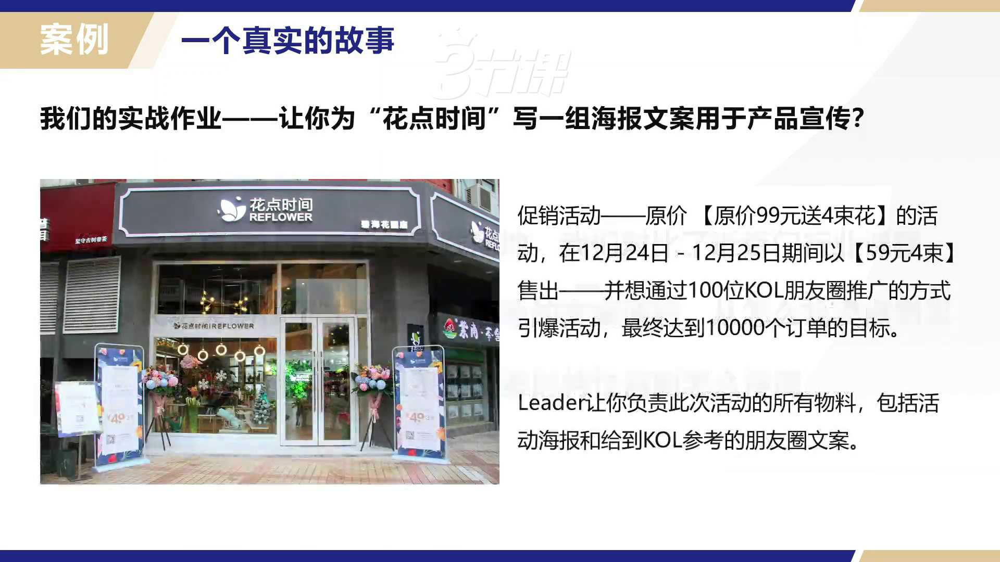

　　背景就是说你的老板先让你负责这次活动的所有物料，你来去写给KYO们的这个朋友圈的相关的一个文案，我们就让大家做这么一个实战任务。我们就发现很多的学员学完了这门课之后，他们写出来的文案可能往往会类似这样的，叫做什么呢？主题鲜花送给女神的不二选择，？

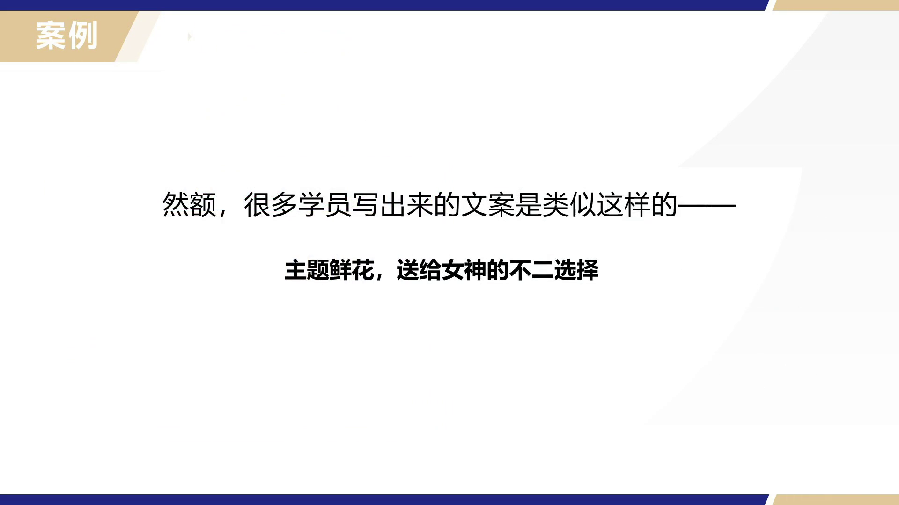

　　哎，你说这个文案，似乎你也不能说他写的对，但是你看起来总觉得就有点怪怪的，就不是那个味道或者不是那个意思，？包括我们的品牌方的工作人员，就这个花品牌方的相关的这个品牌的负责人，他们看这文案之后也觉得说这个似乎不是特别对？然后也觉得说这个文案似乎离用户还是有点远？所以后来我们就做了一些调整，我们就觉得说是否你看见人家他说我们的用户，我们的学员们似乎离他们的用户可能有点远，我们就做一些调整。我们就抛开这些文案的方法技巧，重新来教我们的学员，教我们的用户怎么去研究一群相对陌生的用户。然后就让他们对这个花品牌的用户去做了一些定向的调研，做一些定向的研究？

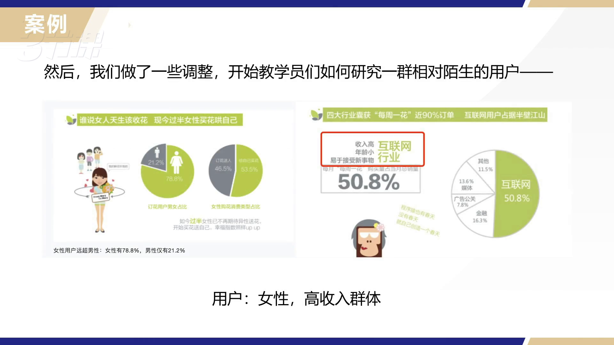

　　那研究完了之后，就得到一些似乎有点不太一样的结论了首先大家可能做了一些调研之后发现，其实对这个花品牌来讲，它的女性用户其实是占比是远超男性用户的。它的女性用户的占比达到了78.8%，男性用户只有20%出头一点，？而且这里边女性用户的购花的消费的类型，超过一半是给自己买花，并不是说他要把花送给别人？啊，然后是为了买给自己大概这么一个感觉，然后这些女性用户他是典型的画像和特征，往往是说收入高、年龄小，易于接受新鲜事物。像互联网金融、广告、公关、媒体？这样的一些这种高知的行业，高知的领域里边的用户可能占了绝大多数。

　　所以这是我们得到的两个基本的结论。其实用户他是女性用户，而且是高收入群体的用户？而不像我们原先假想那样，你看原先我们假想的是说什么主题鲜花，送给什么女朋友的这个不二选择。那个文案我们的假设其实说购花的对象可能主要是男性，你是用来去买花送给你的女朋友的，对不对？你看这已经出现了根本假设上的区别了。然后我们再进一步哈那我们就又让我们的学员们去，比如说像淘宝，像这个花品牌的公众号下面做了大量的调研，就去看说到底这些用户们他们买完花之后的评价，或者他买花是主要是用来干啥，那发现了这些女性用户们买花，他更多的时候真的是为了说装点自己的生活，留住美好，让自己开心心？

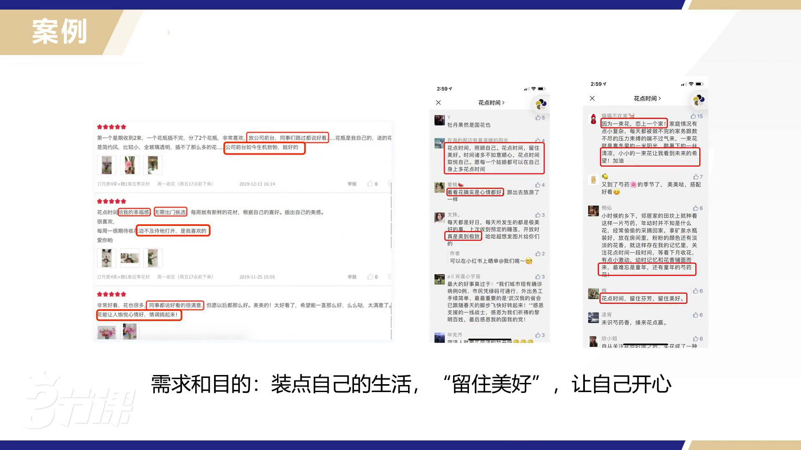

　　然后就很多人，你看他们的留言都是说我买了这个花之后，它开放的时候真的是觉得说美到极致，特别想发这个图片给你们，以及说我看到这些花就觉得说心情都好起来了。我买了些花之后会让我觉得说我留住了一些这种美好的瞬间，其实很多女性用户她买花背后大概是这样的一种诉求，或者是这样的一种心理。当我真的学员，我们的用户，他们了解完这些所有的细节，所有的这些信息之后，你会发现大家在写文案的时候，写出来的文案就靠谱多了。那这时候可能我们的一些学员他们写出来的文案就长成了类似像这样，就变成了说花点时间取悦自己。

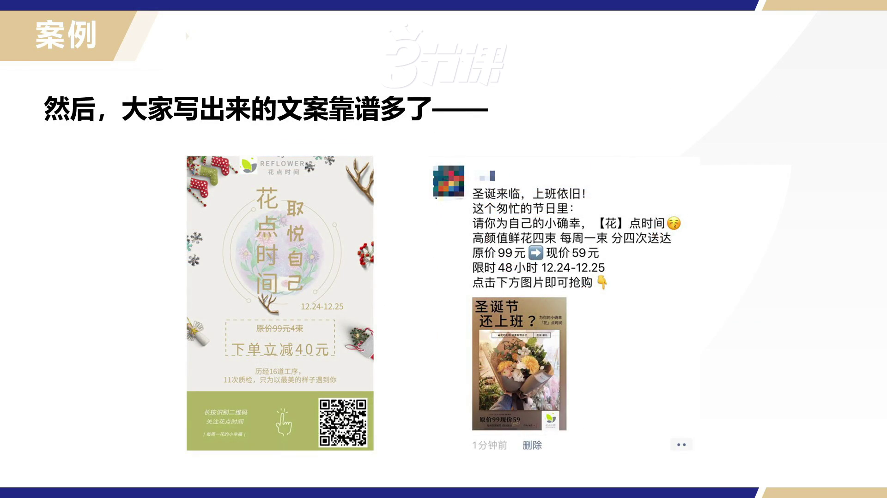

　　作为一个对生活拥有美好追求的女生，在圣诞节如此重要的节日里边，你一边虽然说很忙碌仍然还在上班。但另外一方面你也不能放弃自己的小确幸，你得花点时间高颜值的鲜花？这个只要五十9，然后你需要去满足一下自己，对，然后大概就变成了这样一个状态，叫做为你的小确幸花一点时间。所以这样的一些文案，其实后来再给这个品牌方的他的负责人再来看，他就觉得说似乎这个文案也确实有感觉多了，跟他们的用户的需求和用户的调性似乎就更加的匹配。所以这是一个真实发生过的一个故事，所以你会发现很多人学了少的套路和方法，但是不管你是做活动写文案之类的？

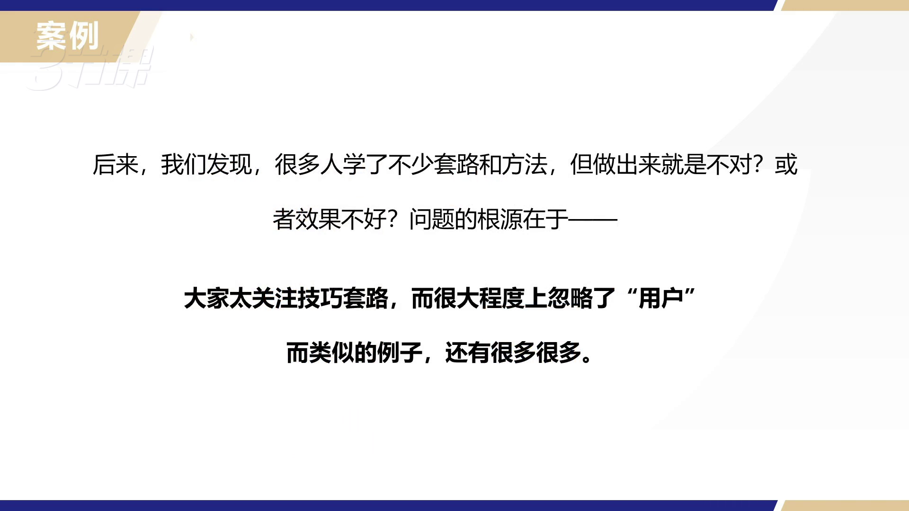

　　就感觉说你做出来的成果总是差点什么东西，或者效果就不好。那问题的根源到底在哪呢？问题的根源往往就在于可能能大家太关注于技巧和套路，但很大程度上你忽略了用户。当你可能根本不了解用户的时候，你一味去学很多的套路和技巧和方法，其实他未必能有很好的效果的。类似的例子还有很多很多，包括你在什么做活动的时候，写什么这个新媒体的时候等等等等，这些时候我觉得都会遇到很多这样的问题。所以这背后其实有一个真相，？

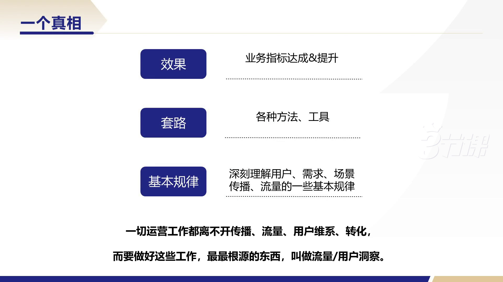

　　这真相是什么呢？我们把这个真相它抽象成这样一张图，你看一切运营工作，其实它的背后从我们去操作它，去实践它，去要做出一个结果来。这背后总是有三层东西，？分别是最下边的叫底层规律，中间的叫套路，最上边的叫效果。我们在实际工作中，往往都是要对效果负责，都要关注效果的，要提升一些特定业务指标的，对不对？

　　那为了达成效果，其实我们就会有各种各样的方法和工具。包括我们在有看学社给大家讲的很多课程。其提供的也是各种各样的方法和工具。但是就像我们刚才这个例子告诉大家的一样，其实在套路方法工具的下面还有一些重要的基本规律。

　　这基本规律就是你作为一个运营，你得深刻的理解用户需求、场景传播流量等等这些东西它背后的一些很基本很核心的这样的东西。所以你发现一切运营工作，虽然都离不开传播流量，用户维系转化，对不对？但是你要真的要作为一个运营想做好这个工作最最根源的东西，最下边的基本规律，我把它再简单一点来提炼，就叫做流量和用户的洞察。我们要对于流量，对用户有一些深刻的洞察，那我们才能更好的去驾驭好各种的套路、各种的方法、各种的工具。所以就像我们提到的一样，你在学习大量的套路技巧之外，你还特别需要去理解和消化一些基本规律。否则特别容易遇到了天花板，你又不知道问题到底出在哪里。这就正是我们这样一个模块课程它的重要性。因为我们这个模块课程，它给大家讲的就是我们所说的流量和用户的深刻的洞察力。

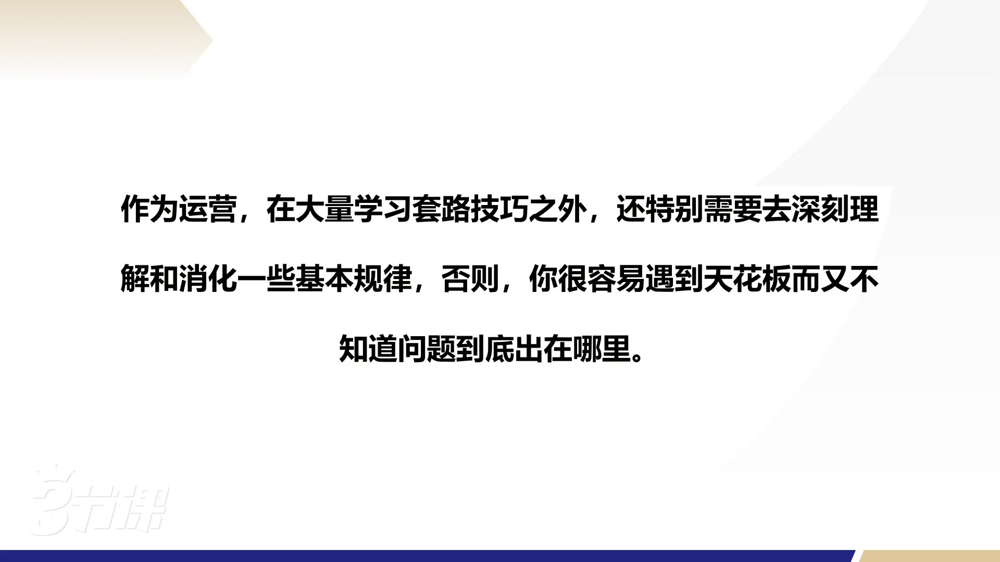

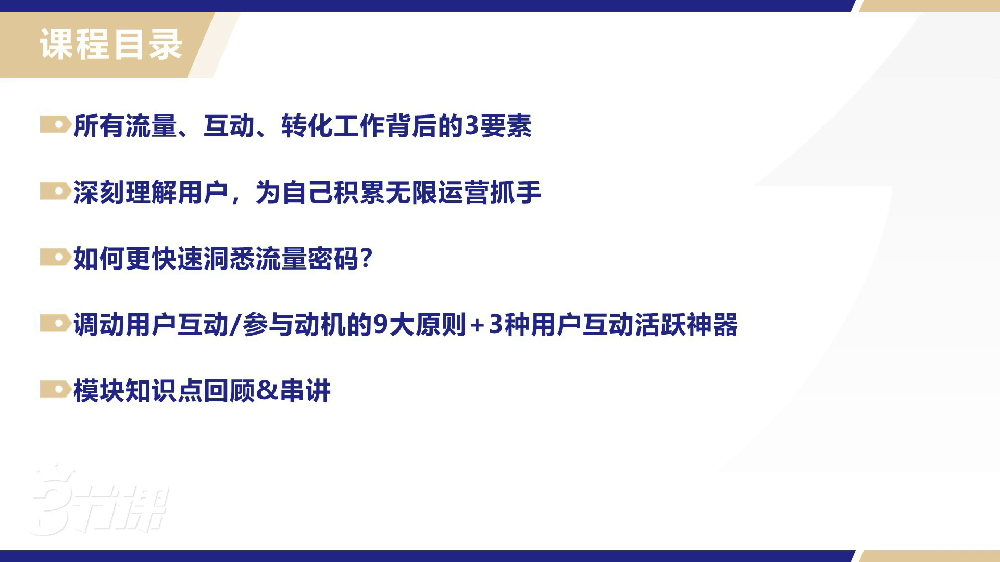

　　好了，我们这个模块的课程一共会分四个主要的小节。第一个小节我们会给大家讲一下所有流量互动转化工作背后都有三个基础性的要素，它是什么？第二这个小节就是我们要深刻的理解和洞察用户以为自己做一个运营，我们身上能积累无限的运营抓手。在第二小节第三小节我们给大家来讲一下如何更快的洞悉流量密码。而最后一个小节我们会给大家讲一下调动用户互动和参与动机的九大原则。还有3种用户互动活跃的神器，这是我们这个模块的所有的内容。

# 第一章 所有流量、互动、转化工作背后的基石3要素

　　2025年08月22日 18:45

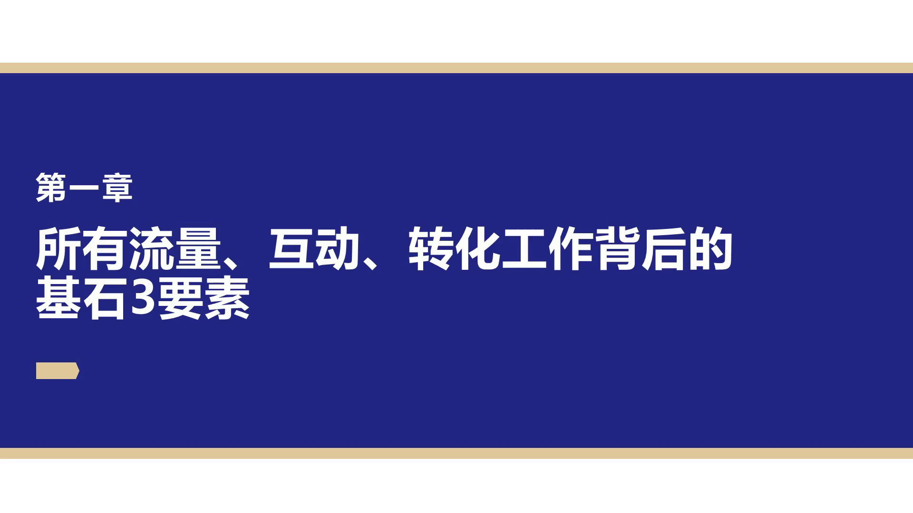

　　好，接下来我们就进入到我们的第一节课程，所有流量互动转化工作背后的基石三要素。我们直入主题。其实各位都需要知道，在互联网公司里面，无论你是做产品相关的工作，写营销文案，还是做什么促销活动，用户互动的活动的策划等等。那背后其实都有着三个最基本的要素。这三个要素分别是什么呢？其实就是我们经常提到的叫做用户场景和需求。用户就是谁场景在什么场景下，他有些什么样的需求可能需要被满足或者需要被解决。无论你是做产品经理还是做运营，这三个要素其实都是非常重要的存在。

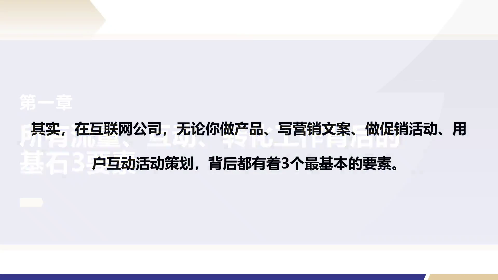

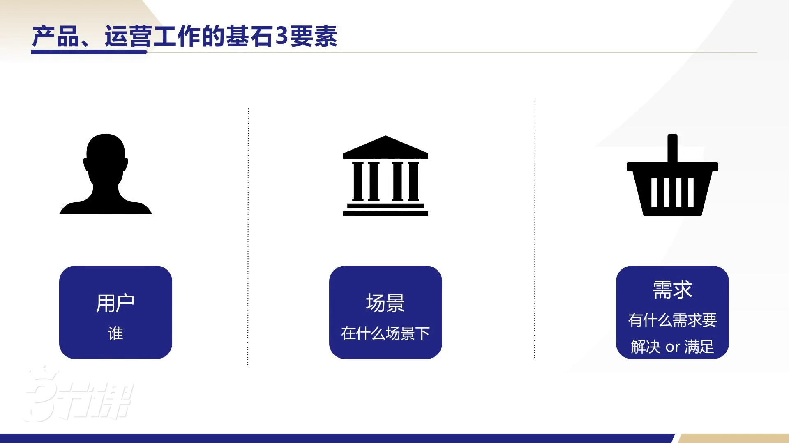

　　我们再具体来去说一下，用户典型就是说到底你的用户是一群什么样的人，比如说你说你是女性用户，好，那我们再具体一点，到底他是说一二线城市女性用户还是345线城市女性用户？到底是单身的还是非单身的，然后到底他们有些什么样的这种特征，比如说是一群二次元萌妹子，还是说可能是一些比如说中年的宝妈他们，然后这些可能都是不一样的这种界定。那你对用户的界定越清晰，那就会让你在实际的工作中，你去找一些点来戳中他们的时候，找一些点来跟他们互动的时候，那你也会变得更加的具体和具象。所以这第一个要素用户到底你用户是一群什么样的人。

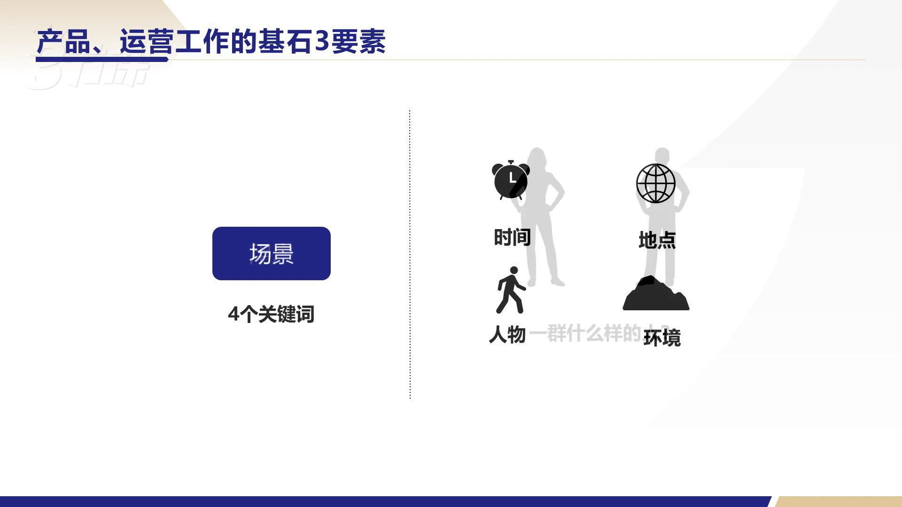

　　接下来第二个要素叫做场景。场景的背后有这么四组关键词，叫做时间、地点、人物、环境？所谓的场景就是你在什么时间什么地点，你身边边可能有什么样的人，然后你的环境有些什么样的特征。比如说我早上可能就是7点到8点半通勤的时候，那时候我可能会在地铁的车厢里面，我身边可能有一群同样匆匆忙忙，然后我也不认识的这些陌生人们。环境就是可能相对比较拥挤和局促，大概可能就在这么一个这种环境下，？你要知道人在不同的环境里面，在不同的场景里面，它会产生的一些这种心理状态，或者个人的一些感受，可能会是完全不一样的。所以当我们在做产品工作中和做运营的工作中，我们能不能把用户典型的场景来找准，吧？可能会是非常重要的。

　　包括说你同样给用户一个活动的页面，有可能这个页面它在一大早清早八九点钟发出来的时候，和你说晚上临睡前可能十一二点可能就发出去的时候，效果可能是完全不一样的，你需要表达的东西也是完全不一样的。往往比如说你说我在早上要做一个什么读书的活动，那有可能你早上的发出来那个活动的页面可能要显得说比较积极，然后比较的阳光吧，然后让人感觉是充满了能量，类似的感觉。而如果你是在睡前晚上这个时间来去做的话，那你那个页面上更多就要表现出来一种说安静、温暖，然后小治愈等等类似这样的感觉，他可能会更好，所以这是第二个核心的要素，叫做场景。第三个核心要素就需求了，？

　　一般来说典型用户身上的需求可能会分为两种，一种叫生理需求，另外一种叫心理需求。典型比如说我要买一件羽绒服，这背后看起来我的生理需求可能是说，我冬天了，天气很寒冷我需要保暖。但是你买羽绒服背后你可能还会有一些其他重要的心理需求，比如说它是否够时尚，它是否够潮，是否能彰显出我的身份的一些特征，或能彰显我的社会地位等等。这些东西是他的潜在的心理需求。那所谓生理需求心理需求，我们也可以换一种叫法，把它叫做功能性的需求和情感性的需求，所以这是在需求背后，它可能会有这么两种的区分。所以用户场景需求就是我们在运营过程中特别需要关注的及时性的三要素了？你到底面向于什么样的人，他们会在什么样的场景下会产生什么样的需求，以及这需求背后他到底是功能性的需求，还是说偏这种情感性的需求，只有你脑海中时刻装填着用户场景需求这三要素，你在你的运营工作中才不会跑偏。

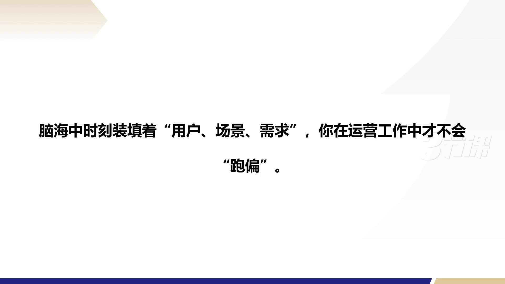

　　就像我们在开篇导语的时候提到的，给花的品牌写文案的那个例子一样，？如果你脑海从一开始就明确知道，你看我的用户可能是群女性用户。他的典型场景就一天忙碌的工作？结束之后我回到家中就觉得说特别的疲惫，又感觉说很孤单，就没有人来关爱我没有人来去呵护我，那这个时候我就觉得说我是值得更多美好的，？就产生了类似这样一种需求，所以他的需求典型是一个做一种类似情感性的这种需求。

　　当你脑海中明确装填的这样的一些信息的时候，你在写文案的时候就不太会跑偏，不太会写出来像我们说的一样，什么主题鲜花送给女友的什么不2选择，？就不太会写出来这样的一些东西，所以这是关于我们的三要素，基础性三要素到底是什么？并且大家也需要知道，在我们实际的运营工作中，只要你的用户名、场景需求都足够清晰。那作为一个运营，你还一定可以在这三个要素的分别的三个维度上来进行细分，以为自己延伸出运营工作中的N多的思路。

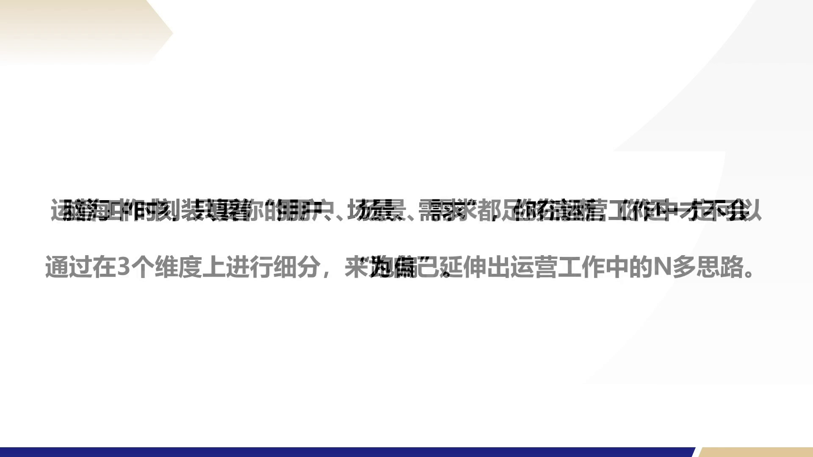

　　那这是什么意思呢？我们具体来看一个例子，比如说某个外卖APP，它的典型用户可能就是办公室白领，然后他的场景典型的场景可能是说工作日的午间，大家在办公室里边？因为都在忙碌于工作，所以没人说话，也一言不发，同事们可能都没有人外出吃饭，在这样的一个这种场景下，它的地点、环境、人物、事件大概是这样的。于是这时候我就产生了相关的需求，我的生理需求就是饿了的这种需求，我需要饱腹？那我的心理需求就是这时候你看同事们都懒得动，我一个人外出似乎也不是特别有动力，所以我就懒得外出了。这是这个外卖APP它基础的用户场景和需求。

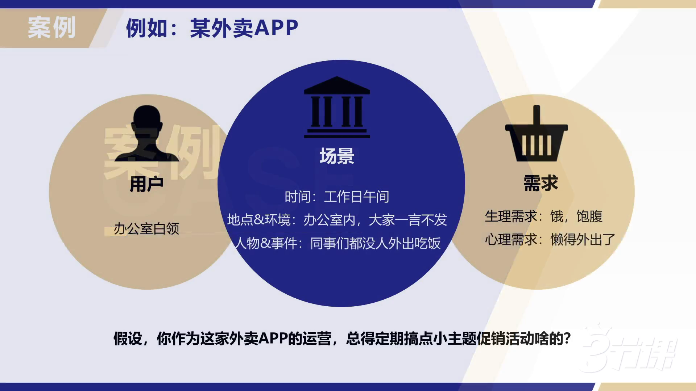

　　好了。假设现在你在这家外卖APP公司工作，你是他们的一个运营的一个同学哈那老板就告诉你说，你总得定期面向我们的用户搞点小主题促销活动什么的，？那这时候你该怎么来搞这些活动呢？

　　好了，我们就用我们刚才说的路。我们分别在用户、场景、需求这三个要素下，分别进一步去做很多的细分。比如说你看用户这儿，我们之前说我们的用户就是办公室白领，对不对？好了，我们在这个基础上对用户来做进一步的细分。可以分成了男性用户、女性用户，会有吃辣爱好者、面食爱好者，还会有我们的比如像中层管理者，老板，还有基层的员工等等等等。？你看我们的用户在这里面细分可以分成这么多的这些类型，它会有这么多的这种特征。而在场景上，我们之前的简单场景就是工作日午间，大概是这么一个场景。

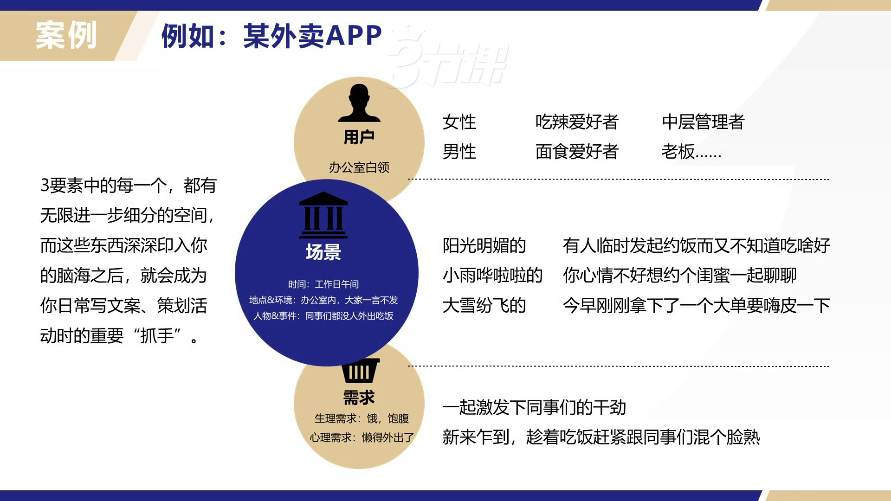

　　现在再来做进一步的细分。比如说从天气来讲，可能是阳光明媚的，可能是小雨淅淅沥沥的哗啦啦的？可能是大雪纷飞的，那还会有比如说我们的场景可能就是半公司里面的人物和事件，可能是说有人临时要发起约饭而又不知道吃啥好。也有可能是你心情不好想约个闺蜜一起聊聊，也有可能是说你今早刚刚拿下了一个大单，决定要跟大家要happy一下，可能所以这是在场景上我们进一步再做一些细分，可能找到的一些线索或能找到一些结论。

　　再往下在用户的需求上，除了饿饱腹这样的需求可能相对稳定，那其他的这种心理上的需求，或者是这种情感上的需求可能会包含哪些呢？可能会说你看我们作为这的老板或者作为管理者，我们想一起激发下同事们的干劲，或者是说我们初来乍到？觉得说要赶紧趁着吃饭跟同事们要混个脸熟之类的。可能会再细分出来N多这样的一些这种场景。当各位你发现说你把你的用户场景需求都分别做了很多这样的细分之后，你说我要定期搞点什么促销活动，我是可以从里边单独拎一类用户，找一类场景，结合某类需求，我来去做一个相关的促销活动的，对不对？就比如说我就专门面向吃辣爱好者，可能就在这种大雪纷飞？一个这种天气里面就专门做一个说大雪天里边无火锅不欢，类似这样的一个这种活动。那也许他就能够让你在自己内心里边就找到N多这样的一些这种运营的抓手。

　　所以就像我们说的一样，三要素中的每一个其实对你来讲，你要是把用户了解的足够深，他对你都会有无限进一步细分的空间。而这些东西逐渐深深印入你脑海中之后，一定会成为你日常写文案策划活动时候，你手中的一些重要的抓手。另外就在一些营销活动这样的工作中。如果你能够从用户需求场景上去不断的去戳中用户，？那用户就会跟你形成共鸣。

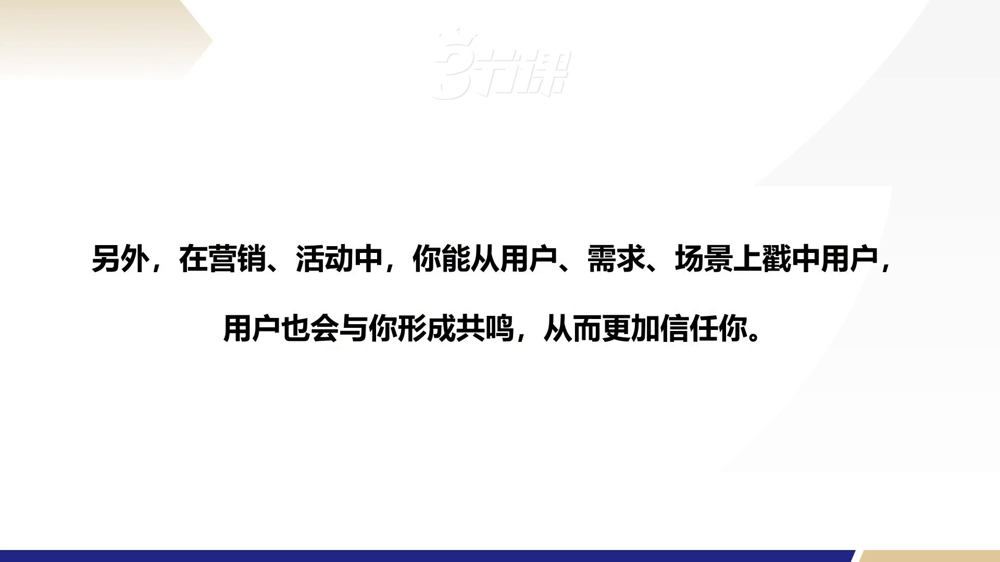

　　用户觉得说你真的了解我，你知道我在这样的场景下会遇到些什么怎样的问题，有一些什么样的痛苦，那他会跟你形成共鸣。当用户跟你形成了共鸣之后，用户就会变得说更加的信任你那比如说我们再拿有看学社来举个例子，我们现在可能会有很多的这种运营课程，在线上供大家来学习。那假设我们现在是要说写文案来卖这样的一些这种课程。我们可以简单看一下，梳理一下我们的这个基础性三要素，我们的用户场景需求分别对有什么。

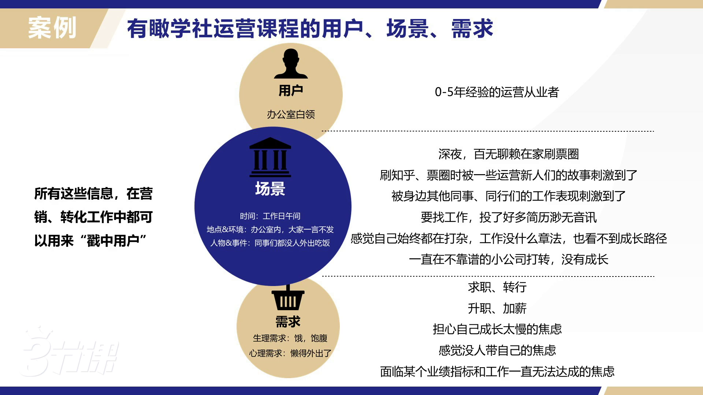

　　首先就简单的看啊，我们的用户可能是0到5年经验的运营从业者。我们在这儿就不做细分了细分的话你肯定还要分成很多，什么在校的求职的大学生，转行的这种转行者，还有说刚开始工作的这种职场新人之类的，都可以分成很多。我们就不做进一步细分了，我们就简单看一下。用户可能大概是这么一群人，那他的典型的场景可能会是什么场景呢？可能会有说就是深夜百无聊赖在家可能刷票圈，觉得有点空虚，也有可能是说刷知乎刷票圈的时候，被一些运营新人们，他又拿到了什么样的结果，他又获得什么样的成长，被这些故事刺激到了，或者是被身边其他同事同行们的工作表现刺激到了，或者是自己现在要找工作，投了好多简历，发现了渺无音讯，自己也不知道问题在哪里。

　　又或者是说感觉自己很长时间都始终在打杂工作，也看也没什么章法，也看不到自己的未来的成长路径到底该在哪里，很迷茫，失去了方向。也有可能是一直自己在不靠谱的小公司打转，就没有这个成长的空间，然后等等，这是他的典型的场景。他的需求的话，就是他的实际就我们所说的功能性的需求，或者说偏实在一点需求。可能是求职、转行、升职加薪。那背后可能会有一项情感性的需求可能就是焦虑。对，那焦虑的话可能是担心自己成长太慢了，虑感觉没有人带自己，没有人引领自己，失去方向的焦虑，或者是面临某个业绩指标和工作？老板一直在给你施加压力，但你一直无法达成这样的一些这种焦虑，吧？

　　那有看学生运营课程的典型的用户场景需求，它可能会有这些信息。好了，各位你感受一下。假设我们现在已经梳理出来了这样的一些信息，那我们是否在写文案的时候就直接能用这些信息去戳我们的用户呢？并且如果你戳中了他，如果你也真的就身处这样的状态下，你正好被我戳中了。那你是否会对于说有看学社这个品牌，它的信任感可能会更强一点点？就觉得说他懂你对吗？所以上述所有的信息在营销转化工作中，它都可以用来去戳中用户。那做一个运营的话，你脑海中就必须得深刻的时刻装填着用户场景需求背后的所有这些信息。

　　好，讲到这儿，大家应该对于我们的基石三要素到底对我们的工作有什么帮助，有什么价值，应该能有比较具象的理解了。最后的话我们可能再帮大家提炼一下，就基石三要素在写文案、做内容或者做一些活动的时候，那它的典型应用其实可能会有两种，最常见的应用可能会有两种，？那第一种的话就是你脑海中装填着你的用户场景需求。你时刻从这三个要素出发跟用户来去沟通和互动。那是能帮你建立起来快速的这种信任和快速唤起用户跟你互动，用户了解你的这种欲望的，然后这是第一个。

　　第二种典型应用的话，就是在营销的一些文案营销的一些场景下。当你锁定了用户的一类需求？可能用户就是想说求职或者就想获得更好的职业发展之类的那这时候你已经锁定了这样的需求。那你通过堆砌多个细分的这种场景来拼命去戳中用户，唤起用户痛点的话，它能给你带来更高的这种营销的转化率。

　　好，接下来我们不妨还是再通过两组例子，来去感受一下我们上边说到的这两种典型的应用。首先我们说了第一种典型应用？就是说你在做内容或者在什么做活动的时候，时刻脑海中的装填着你三要素。从三要素为原点来跟用户去沟通和互动？来快速获得信任，快速抓住用户的注意力。

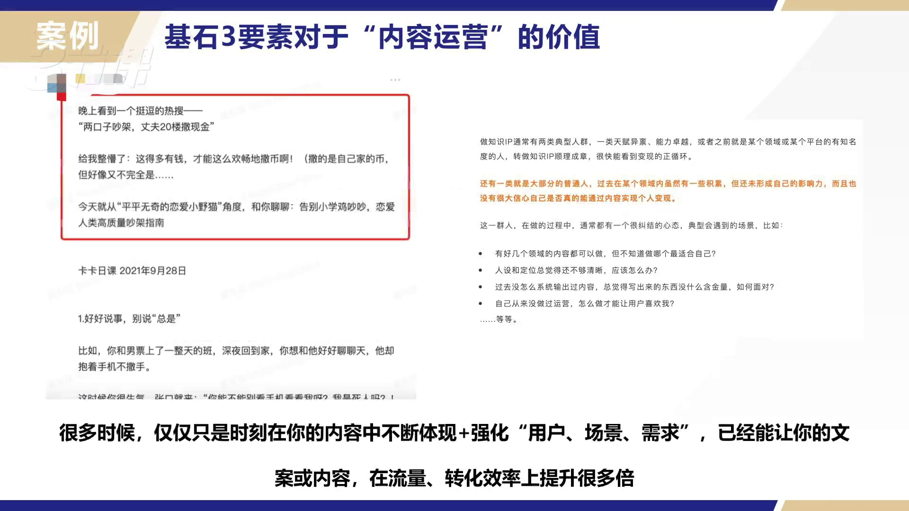

　　好，我们在这儿就来看这么一个这种例子了。这个例子的背景是这样的，就有两个做自媒体，做个人IP的同学，他们可能都想说我要写一个系列连载？来去建立说用户在我所处这个专业领域下对我的一个信任，大概可能是这么一个背景。但是其中一个A同学，他可能他的主要的一个专业方向是帮人解决什么人际关系问题这样的哈那这个同学他在有段时间里面，他自己可能写的连载内容里边，开篇往往可能会是这样的一个这种感觉。对，然后你看我晚上看到一个挺逗的一个热搜，什么两口子吵架，丈夫什么20楼撒现金等等，给我什么怎么弄，然后怎么怎么样，今天就从什么什么角度，我跟你聊聊，然后什么恋爱人类的高质量吵架指南。它的开篇可能是这样的。

　　然后另外一个同学的话，他的一个专业方向就是可能说教人可能怎么做，知识IP的打造？然后你看他的整个的开篇，可能大概就是这样的一个感觉，叫做做制裁P典型有两类人群。一类天赋异禀，能力卓越，之前可能就已经是某个平台的有知名度的人，然后这是可能一类的那另外一类就大部分普通人，可能就是还没有形成自己的影响力，而且没有很大信心，？那这类人在做的过程中，通常都有一个很纠结心态。

　　典型会遇到的场景，比如如你看1234什么人设定位总觉得不够清晰该怎么办？有好几个领域内容都可以做，但不知道哪个最适合自己等等。好了，你看这是这么两个同学他同样在做内容的时候他的开篇。各位你知道这开篇会有什么区别吗？其实同样在做支持IP，同样在做系列连载，就是A同学这个开篇，他会导致一在开篇的时候，他的读者可能就流失了可能有一大半。而且他这个开篇是无法帮他快速抓住他的精准用户的。而B同学就右边的这个开篇，一上来他就能牢牢的去帮他去圈住我自己的精准用户。

　　所以各位当你脑海中明确已经知道说我的用户就是一群什么样的人。比如说我的用户就是什么广州？某个区的什么中学生的家长？那你的标题，你的开篇，然后包括你的这个中间的一些场景的这种铺垫，你的描述？都可以专门针对这一类人来去强调来去强调说我这边内容就是为你们而写，我这边内容就是给你们带来价值？那我想告诉大家，很多时候你仅仅只是有这么一个意识，说实话时刻在你的内容中不断的去体现和强化你的用户场景需求。只是做到这么一件事儿，那就已经能让你的文案和内容在流量获取，在转化效率上提升很多很多倍了。

　　各位你要知道我们刚才说的A同学和B同学这两个人，他们可能同样写一个说8到10篇的这么一个连载哈那他们能获取到流量加上如果就按这个方式写，他们能获取到流量加上能堆积起来的用户信任度，中间的差距可能会是十倍以上的。所以这就是我们这一组例子对比想跟你去强调和传递的信息。要时刻以用户场景需求为中心来出发，去跟你的用户去沟通和互动。

　　同时在这组例子背后，我们还可以再延伸出来一个重要的关键词，叫做对象感。我们在运营工作中，其实有对象感和没有对象感差距是非常大的。有对象感就像我们刚才提到的一样，你脑海中就会装填着你看我写这篇文章，我做这个活动我是为谁而做，我脑海中是有一个具体的对象的，对不对？有了这种对象感之后，可以在你的这个活动策划，你的内容的表达当中，时刻的去有意识跟这个对象去做一些表达，去做一些互动，对不对？所以就是对象感这个词是非常重要的。当你脑海中对于用户场景需求足够清晰之后，那你必须要让自己脑海中就时刻装填着用户的存在。并且在你实际工作中写文案也好，做内容也好，做活动也好，更多的去产生一种你在时刻跟你的这些用户们去互动和对话的感觉。

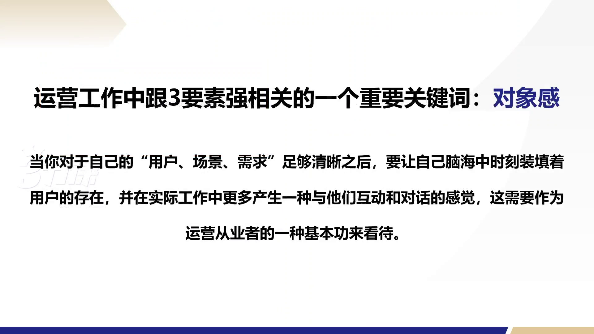

　　那这件事儿其实需要作为运营从业者的一种基本功来看待，包括我们刚才提到的A和B这两个例子也是一样吧？你看A它的那感觉就是说你看我今天晚上看了个什么东西，我觉得好嗨，所以我想跟你唠唠什么东西。这件事儿你发现它是以我自己为中心在出发的。而B的那个开篇，他是在说，你看就是典型你如果想做件什么事儿，你会遇到两种问题。那这两种问题背后你得听唠唠，？你看这个感觉它是以用户为中心来去出发的那它背后的区分就是A可能在写那篇内容的时候，它的对象感是不足或不够的。而B在写那篇内容的时候，它就有一个非常明确的一个对象感。所以各位你也一定要让自己在运营工作中有明确的对象感。好，接下来我们再看另外一组例子，就是我们说的G13 1素在营销文案中的应用哈那往往你可以说锁定一类用户需求后，你通过堆砌多个典型场景来不断戳中用户，那往往在转化类的文案上是会有奇效的。

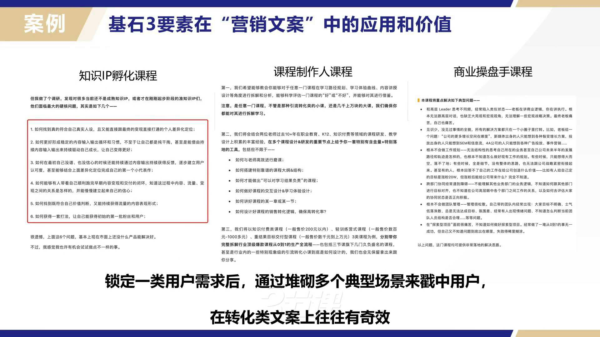

　　好，我们来看三个例子。第一个例子是有看学社我们自己做的知识IP孵化的这种课程，？你看这个课程，我们在写这个麦克文案的时候，然后我们就这么说，你看我做了一个调研发，发现很多不是制裁P，或者是刚刚才在起步阶段的这种准制裁P们。他们想做这件事儿最大的问题可能是下面这么几个。第一个叫做如何真的找到符合自己的真实人设，并且能最后直接跟变现打通的个人差异化定位。第二个是说如何更好形成稳定的内容输入输出循环和习惯，不至于让自己是纯干掏，甚至借由持续内容输入输出来驱动自己成长，第三个是说如何在最初自己没谱也没信心的时候，还能够持续通过内容输出来获得反馈，逐步建立用户认可度，以及完成自己第一个小的这种代表作等等。

　　所以你看当你在说一个人要做支持IP这一类需求这一件事儿上，你帮他把他会面临的很多的问题，他的很多具体的痛苦的场景？都给他描述出来了。甚至这里边你描述完了之后，可能一个用户他典型看到他会发现说我靠似乎这里边有些问题可能我自己过去都没有想过都没有看到过，？那这个用户对你肯定会产生了更强的信任。他会发现说你确实在这件事上，你讲的这个问题的具体程度和落地程度是会更高的？所以这是第一个例子。

　　第一个例子是我们另外一门课程，叫做课程制作人的这样的一个课程？就教你如何去做出一门好课，大概这么一门课？那你看在这个课的售卖文案里边，我们也说了说你看我们的这门课能帮你解决什么问题呢？包括但不限于如何跟老师进行高效磨课，如何搭建特别靠谱的课程大纲和结构，如何才能做出对学效果负责的课程，如何做好课程的交互设计和学填设计，然后如何讲好准某一章某一节？下边还进一步再跟你讲，我们会以像支付费类的课，轻训练营式的课，重结果目标交付类的课三类课程为例，分别来带你完整拆解行业顶级爆款课程，从零造一生产的全流程。你看就讲到这样的颗粒度，同样它也是会变得说我会更戳用户，我会让用户感觉到就是我更专业，我更加信任你的。这是第二个例子。

　　最后的例子，就是我们的商业操盘手的这么一门课程了。它主要是面向就典型工作了四五年往上，现在已经在带一个小团队，或者已经是团队里边的业务骨干，我希望往上成为这个团队里边的管理者，面向这样的一些用户。这个课程，你看我们描述的一些典型的场景和我们解决的问题也是非常细？就说我们课程能解决什么问题呢？第一个你跟高层leader思考不同频，经常就陷入到类似状态。老板在讲商业逻辑，你在讲执行。最后你跟老板之间沟通不同频，老板痛苦你也痛苦。

　　再有什么见识少，没见过事情的全貌，所有解决方案里都只在一个小圈子里打转。比如说老板问你说我们公司更多增长空间在哪里？？福瑞公司出身人只能想到各种广告投放、事件营销，投放出生人只能想到投SEM或者信息流等等等等，？那我就不再往下一一念了总之我就通过这么几个例子来跟大家来去传递一下。

　　我们说到的第二点，就基石三要素这件事儿在营销文案中，它典型应用就是你锁定了一类用户需求。比如用户需求像我们说的就是说我想成为个制裁P我想做好一门课，我想成一个合格的管理者，？这是一类用户需求。锁定这类用户需求之后，你要堆砌多个的典型场景来去戳中用户。这样的话在转化类文案上往往会有奇效。好了，到此为止，我们的第一节就是所有运营转化互动工作背后的这三要素，用户场景需求就给大家讲完了。希望大家真的能把这三要素重视起来，让这三要素时刻装填在你的脑海里。

# 第二章 深刻理解用户，为自己积累无限运营抓手

　　2025年08月22日 18:44

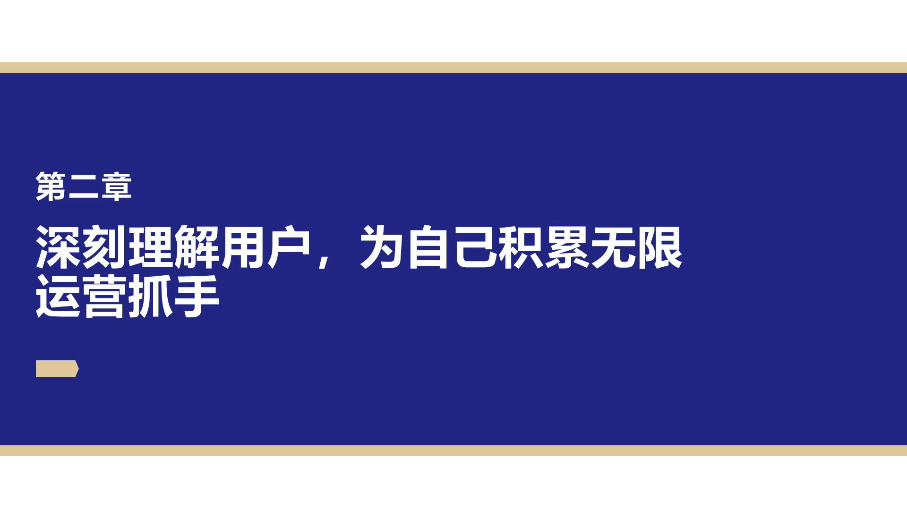

　　好，接下来我们进入我们的第二小节，深刻理解用户为自己积累无限的运营抓手。我们在第一节里边已经给大家讲了我们的基石三要素，那这节里边我们在开篇想跟大家分享这么一个观点，就是在基石三要素的基础上，作为一个运营如果你要更进一步，那其实是你要更加深刻的去洞察用户身上他们潜藏着的一些重要的情绪，还有用户身上的一些重要的心理敏感地。你要是对这些东西有更加深刻的一些洞察，那一定会让你成为一个更加牛逼的运营。

　　那到底怎么理解这句话呢？我们不妨也一起来看两个例子哈那第一个例子是两个母婴公众号，它的一个天差地别。左边我们看到的一个母婴公众号，它其实是现在行业里边非常知名，非常顶级的一个母婴工作的一个大号。但它也是从零开始起步，差不多在一年左右的时间里边就积累了大几百万小1000万的这样的这种用户。而右边我们看到的什么婴幼儿育儿知识这样的一个公众号。它其实就是一个长期平平无奇的育儿的一个知之后。

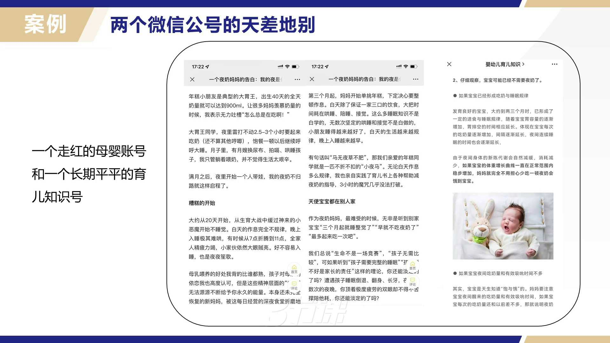

　　好，这两个号背后它的区别是什么呢？我们可以简单看一下，现在屏幕上大家看到这么两篇内容哈那其实这两篇内容它的一个主题都是相同的，都是有关于说宝宝吃这么一件事儿但你可以看到右边的这篇内容的话，它其实更偏理性和简单的一些科普？讲的可能也相对比较泛。就跟你讲一些如果宝宝夜间吃奶量和有效吸吮的这个时间不多，？然后该怎么办？如果宝宝已经形成吃奶和睡眠的规律，那大概又该怎么办吧？然后基本上就这种可能比较理性的一种方式。然后里面讲到的一些东西，可能也就比较点到为止，泛泛地提到就差不多了。大概是这那我们再看左边这篇内容，左边这篇内容它的标题叫做一个夜奶妈妈的告白，它的整个标题后边还有一半叫做我的夜是你不懂得黑。

　　其实整个这篇内容是作者以一个妈妈的身份，他就讲一件什么事儿呢？就讲说你看然后我也看了很多这种什么育儿相关的知识，我也希望我们家娃就别吃那么多夜奶，他的作息可能规律一些，然后我也花了确实花了好几个月时间，试着来整顿和调整我们家小孩子的这个作息。但是整个这个过程真的是太艰苦了，真的是太煎熬了。我跟他斗争了无数次，包括起初的时候，我是怎么下定决心要做这件事儿的，然后我跟他可能花了几个阶段是怎么怎么搏斗？然后最后可能就是我有一些什么样的这种成果。反正整个这个内容里面，大家稍微看一下他的一些描述的话，就是非常的具体，非常的场景化。而且中间就夹杂着非常多的这种细微的这样的一些这种情绪，包括你看他里边的一些描述哈他讲到说母乳喂养的好处，我比谁背的都熟，孩子对母亲的依恋我也高度认可，但是这些精神层面的认可完全无法源源不断给予一个妈妈永久的能量。作为我刚刚生产本身还没有完全恢复的一个新妈妈，被一个小孩子就是每天经营的这种深夜食堂，每天晚上醒来好几次要喂他喝奶，然后这样的这种折磨其实我是非常崩溃的。

　　然后包括他还说作为我们大人总是说什么生命不是一场竞赛，孩子无需比较等等，可是如果听到说什么孩子需要完整的睡眠，孩子睡不好是家长的责任这样的理论，你作为一个妈妈，你经历了这一切，你还淡定得了吗？你遭遇了孩子什么？睡眠倒退、翻身、长牙，然后夜间醒来。无数次的夜晚，你顶着极度疲劳的双眼，却不得不苦撑着陪他耗，你还能淡定的了吗？对，你看这些描述它是非常的有感染力，非常的有情绪的那这样两篇内容背后它的差异有多大呢？我想跟大家说，右边的这篇内容它只不过是一篇平平无奇阅读量可能也就几百或者小1000的这样的一个普通的内容。而左边的这篇内容其实就是我们说的这个走红的母婴育儿账号，在他身上出现的第一篇10万加。

　　而且正是从这篇内容之后开始，就是这个大号他就写了一系列的？就是这种专门去搓宝妈，搓母婴人群的，一些这种很私密的这种情绪敏感点的这样的一些内容。包含就是什么喂夜奶，妈妈一个人独自在家带娃的，可能一些重要场景下你会有的一些苦楚，你的一些孤独，你的苦闷等等，就写了很多这样的一些东西。由此开始，他就开始了巨大的粉丝的增长的一个周期。最后把自己做成了一个粉是几千万的行业的大号。

　　我们右边的这个科普号就长期来就是循规蹈矩，不温不火的，也就发泄这种不疼不痒的科普内容，？到现在为止，我觉得基本上也就没什么起色，还是一个平平的状态。所以这是我们想跟大家分享的第一个例子。大家可以感受一下，这两个公号背后的天差地别是由什么所带来什么所造成的。

　　好，我们再看另外一组例子哈那另外一组例子就是有两场评价差异巨大的跨年晚会。也许大家可能还知道还比较熟悉。其实这两场跨年晚会都发生在2019年的年底，一场就是湖南卫视的跨年晚会，另外一场就是B站的2019最美的夜。这两场晚会在用户和大众群体边评价差异是非常巨大的，大到什么程度呢？大家可以看一下，就是B站的这台晚会，豆瓣上的评分超过三万多人，评价评分是9点1分。而湖南卫视的跨年晚会，在豆瓣上只有三千多人评价，评价是5点5分，差异非常巨大。所以两个跨年晚会它的差距到底在哪里？

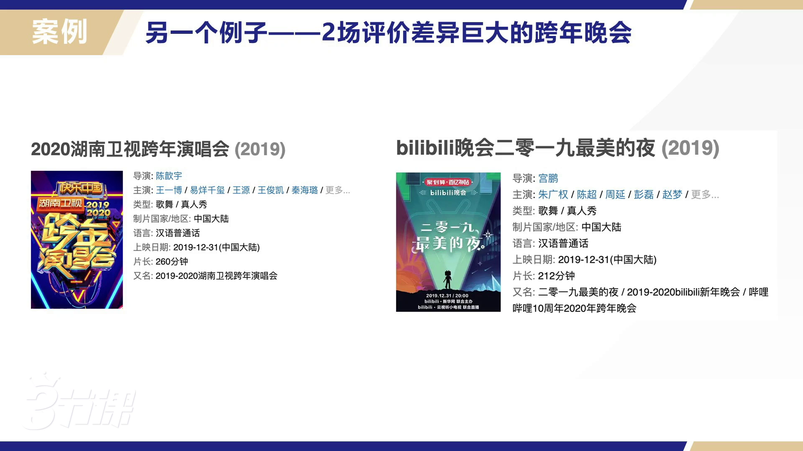

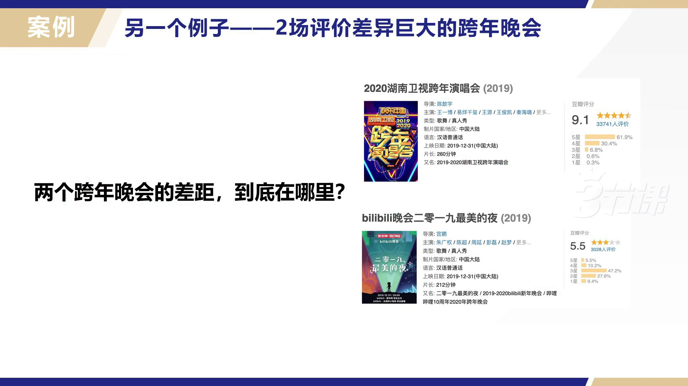

　　好，我们就不妨进一步来对比来看一下。首先先看湖南卫视这场跨年晚会，大家可以看一下阵仗，还是一如既往的非常之大？最强主持嘉宾团，一堆人，什么全民一起摇一摇，瓜分100亿大红包，以及嘉宾阵容，什么郭富城、韩红、黄子韬、大张伟？就追了一堆的人，还有什么当时特别红的TF boys等等等等，就追了很多的嘉宾吧？

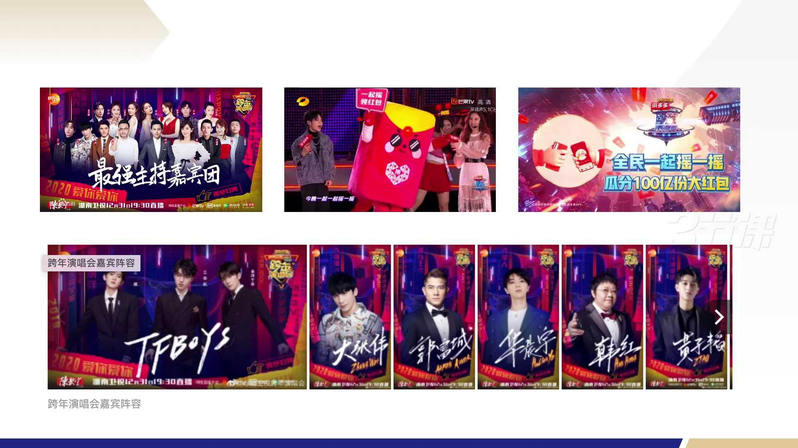

　　但是这么一场整个的晚会下来之后，大家可以看一下，实际上用户的评价会是什么样的呢？你看用户就说什么主持人众多导致很混乱，感觉流量的明星很多，可是却压不了场，感觉全程没有重点等等等等，然后还有说毫无特色的浪费钱等等。所以湖南卫视这样一场晚会看起来请了非常多的嘉宾，请了非常多牛的这种明星，？但是其实在用户心目中，大家并不知道这场晚会到底是面向谁的，如何戳中这帮用户，这个晚会有什么特色？然后这些东西对用户来讲都不清晰，所以用户的评价并不高。

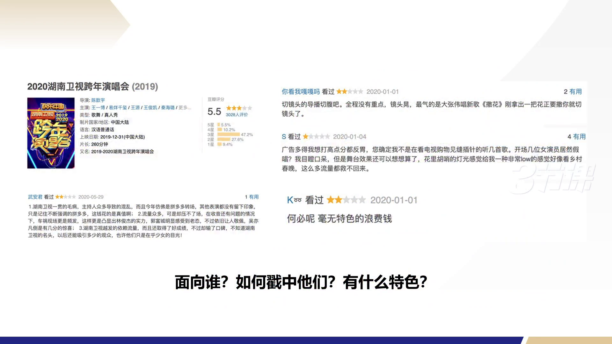

　　相反，我们来看一下B站的那个跨年晚会，他当时是怎么做的呢？那你会发现整个这场晚会完全都在全心全意的为年轻人，尤其是90后的年轻人来服务。首先晚会的开场，就是无数人的回忆。魔兽世界用一场既加入真人表演，然后又有蓬勃大气这种背景音乐，来了一个开场礼，让无数人开场就直接进入到这个回忆杀里面。然后接下来的话又通过像什么中国民乐大师方锦龙和虚拟偶像同台登场演奏这样的一种形式，以及像年轻群体边非常火的这个剧权力的游戏，它的一个主题曲，就放在一起中西合璧的这么一个风格，就让年轻人觉得说这个特别的受用，也特别的喜欢。你看这屏幕上大家弹幕，都说这个鸡皮疙瘩都起来了等等。对，然后再往下，还有什么哈利波特的这种主题曲，同样也是年轻人心目当中，非常有温度，非常有回忆的这样一种存在。

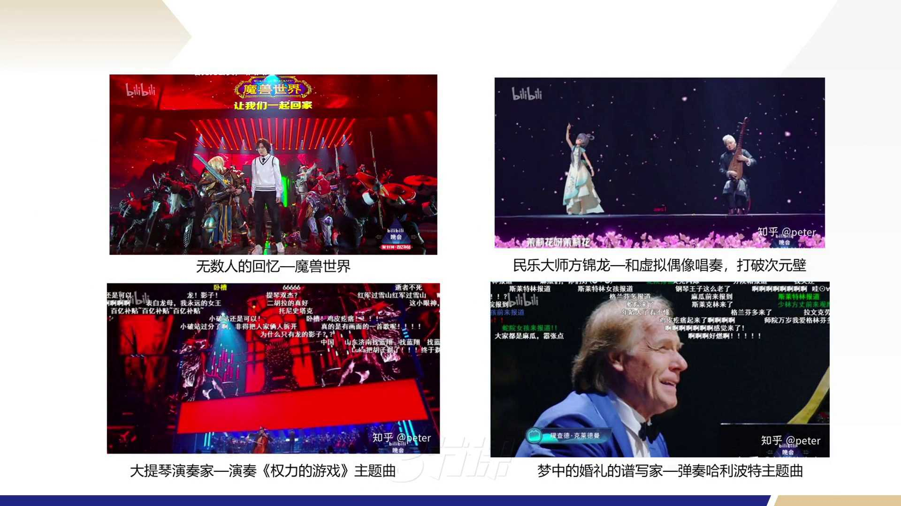

　　再加上整个这场晚会，他主持人请的是谁呢？请的是年轻人群体里边非常喜欢，然后非常有段子手著称的这么一个人，叫朱广权，？请了他来整个来做场，所以整个这场晚会最后他的感觉口碑和行业里边的的这种认可度都非常之高。我们可以来看一下，整个豆瓣上对他的评价，然后你看这些用户就在这说，感谢90年左右生的这些人们爬上了各行各业的管理层，感觉我太幸福了。有了一个专属于我们的一个晚会，有了被重视的这样的一个感觉。以及还有很多人就说？如果B站的晚会年年都是这个水平，春晚都可以不用办了。原创力是B站相比其他卫视和视频网站最大的优势。很多人也讲这是今年最优秀的跨年晚会去掉之一。

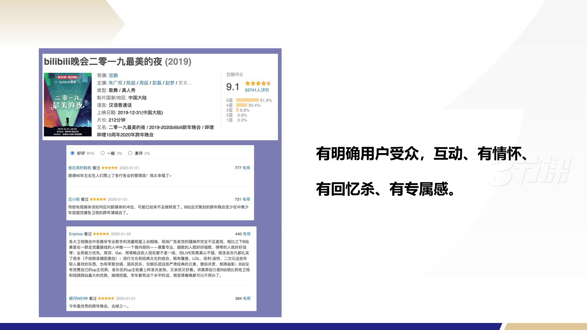

　　对所以就是你会发现B站这个晚会它整个在用户面前有明确的用户受众，就90后往后的年轻人，包括一部分的80后。主打互动，有情怀、有回忆杀，有专属感。很多的90后就是看这场晚会的时候，你知道大家什么感觉吗？大家都觉得说在这个世界上终于有一场为我们而办的这样的这种晚会了。所以某种程度上是这些东西造成了湖南。卫视的晚会和B站的晚会，他们背后流量、认可度、口碑等等这些方面的巨大的差异。即便这两场晚会它的成本的投入，有可能反而是湖南卫视那一场晚会还要更高一些的？但实际最后的效果，流量、认可度差异可能会是完全反转过来的。

　　所以我们在这儿也总结一句话，各位你要知道每一类用户身上，他们往往都会有N多平常不被圈外人关注和理解的一些痛点和情绪。包括很多他们专属的回忆，他们的痛苦、憎恨、赞同等等等等。如果你能激发和理解这些重要的情绪，那你才能够成为一个可以更好调动起来用户和流量的运营。这也是刚才我们这两组例子背后想给你展现和传递出来的信息。

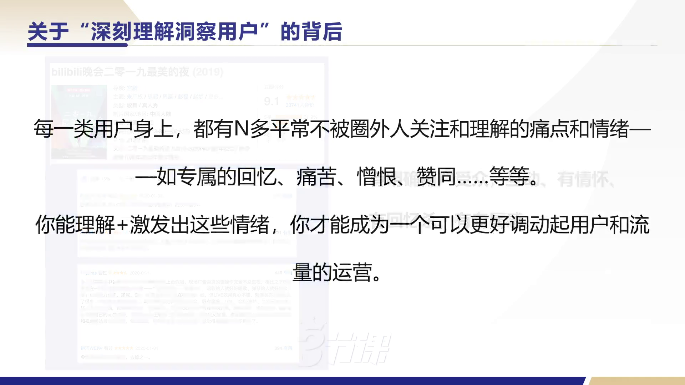

　　就像我们说的一样，你要在我们的基石三要素基础之上更进一步。对于很多用户的情敏感的心理敏感地要有更加深刻的洞察。并且我们再进一步说的话，那你也需要理解在互联网上，用户事实上也是越来越圈层化的，互联网上会存在着无数度的小众圈层。每一个小众圈层，都会有他们一些专属的情绪敏感地和心理敏感地。就像你现在屏幕上看到的一样。你看这是90后年轻人群体里边会有的一些圈层。你会看到这些90后的年轻人里边，他们会有很多的这种小众的一些爱好，包含一些什么手办模型、潮玩盲盒，然后汉服、洛丽塔、密室逃脱、剧本杀，还有像什么cosplay等等，？那每一个这种小众爱好，其实它都能够形成一个小众的圈层的这还只是90后的年轻人，事实上在什么中年人或者在一些老年人群体里边，也拥有着无数的圈层。

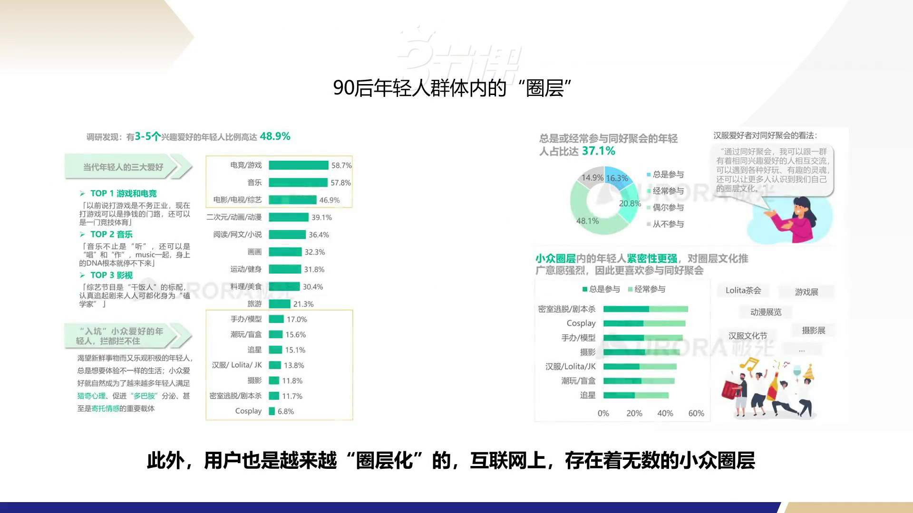

　　在这儿我觉得我也有另外一个非常重要的建议，就作为一个优秀的运营，你一定要保持着一些旺盛的好奇心和对这些小众圈层人群的关注。你要理解，到底互联网上存在着一些什么样的小众的圈层，他们一般可能都在干些什么？他们做这些事儿背后，他们的一些情绪和心理上的一些动机可能到底是怎样的那你要是能形成这样的一些习惯和能力，我相信对于你会非常重要，为什么呢？

　　好，我们再来看这么一句话，就是你要知道一个好的运营，如果你能深刻体察到一部分小众的用户，不管我们刚才提到的像一些二次元的用户，还是一些像宝妈，还是一些像什么骑行的疯狂的爱好者等等。你能深刻的体察他们，与他们形成深度的情感共振，那你大概率就可以抓住他们当中的一部分狂热发烧友这样的这种用户。那就这么一件事儿，也将会让你成为一个自带强大威力的运营，为什么呢？

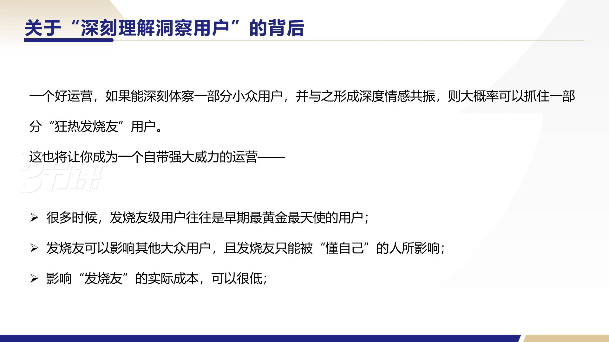

　　好几件事儿。第一件事儿你要知道，其实我们做很多的新产品，我们做很多的新项目，发烧友急的用户往往是早期最黄金最天使的用户，为什么呢？因为这帮发烧友们，他们往往是说只要我认可可能你做这件事儿的一个初始的动机，那我对于你的容错性就会更高。我是愿意陪你可能往前去走更远，往前可能去走更长的这个路的。而且我不仅陪你走，还愿意在中间？给到你很多的反馈或者是帮助。以及很多的发烧友他们的分享欲、表达欲往往也会比较的旺盛。

　　这意味着你是可以借助发烧友来影响其他的大众用户的。但是你要想借助大众用户影响发烧友，这事儿做不到，对不对？然后这事儿不能反过来，同时发烧友往往只能被懂自己的人所影响，大众是影响不了他们的。像我们说的，最后就是影响发烧友的实际成本可以很低，就影响发烧友们？你只要说你真的懂他们，你懂他们可能为什么这件事上发烧，为什么会为这件事儿倾注所有的情感，倾注自己N多的时间和精力，然后你跟他们讲一个说他们认可的故事，他们就愿意追随着你一路往前走下去的。

　　所以如果你作为一个运营，你能做到你能对很多的小众人群的用户有深刻的体察，那意味着什么呢？意味着你在办很多活动的时候，你在策划很多活动的时候，只要你想，你可以借由一个主题去撬动一部分小众圈层里边的发烧友用户。他们愿意跟你在一起的，他们愿意给你背书的，他们还愿意帮你去做很多的传播，很多的扩散，？最后其实能让你整体的一个运营付出的成本可以降到非常低。

　　这里边如果要说到，就是我通过早期搞电力棒发烧友，然后跟他们可能一起往前走，最后给我带来巨大的收益。这样的例子的话，我觉得最经典的例子莫过于于小米的米粉了。很多人可能都听过小米的米粉，但是最早小米的这批发烧友，这批米粉们到底给小米带来了什么呢？其实可以客观的说，小米这家公司它是从2010年左右开始成立，开始在做一些事儿。2011年小米一这款手机第一次上市。

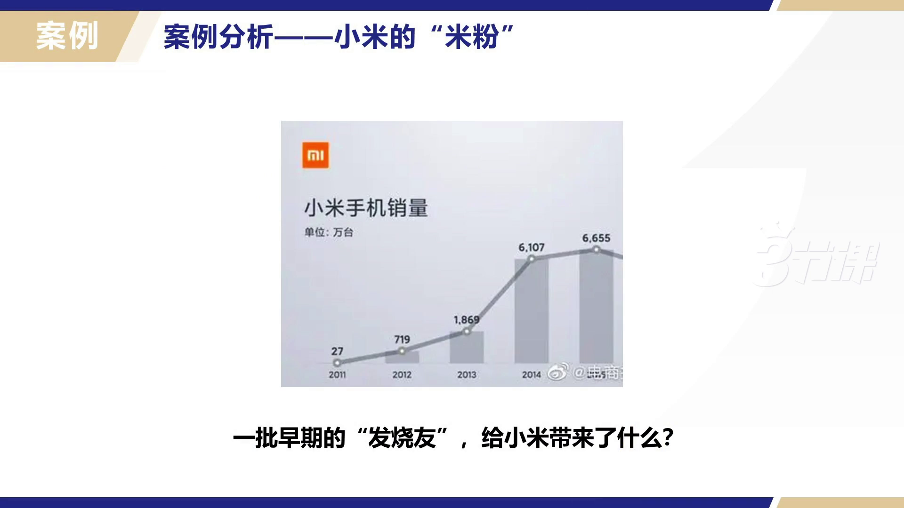

　　那米粉到底给小米带来什么呢？我觉得可能直观的讲，一直在2013年之前。其实小米在市场上他们用于说推广营销的费用的投入其实极低的。也就意味着在2013年之前，它的整个的手机销量突破了可能就是1800万台之前。那这其中的势能，这其中他手机销量里边很大的一部分，完全是早期这帮米粉的狂热自发的？在朋友圈、在微博上愿意帮他们背书，愿意帮他们做传播，愿意帮他们做分享，都是这么着带来的那也许有人对于小米的这帮米粉到底是个怎么回事儿，到底他当时是怎么做的，还是不那么清楚哈那我们不妨也一起来简单回顾一下这个故事。这个故事它整个的背景其实是这样的，就是2010年前后，虽然说苹果已经开始推出它的智能手机了。但那时候作为智能手机的另外一端就是安卓手机，它的整个的UI界面，其实是非常的体验不好的，既不好看也不好用，大概就长成屏幕上这样的一个这种样子，？

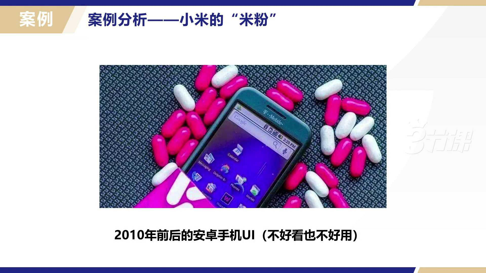

　　那就在这样的背景下，小米当时就主动站出来，他们就说我们想做一个不一样的安卓的UI的这个系统？我们想把这系统做的不一样。所以我们希望找到一帮全中国最懂手机，最挑剔手机，也最挑剔这种UI系统的这样的这种发烧友跟我们一起来去做这件事儿，？他们当时可能就是在各种的手机论坛上就找重点找什么人呢？就找那些对于什么苹果手机、三星手机使用上不满意，而且还能说出不满意的理由和细节到底在哪里，能用一些技术语言去表达的这样的用户，往往是这样的用户？他们就认为说这群人肯定是手机的发烧友，然后他们就一个一个去跟这群用户聊，然后就说我们想找这样的这个用户跟我们一起来去做一点事情，并且我们要找的就全中国可能最最懂手机的人，然后就这样一个聊就大概就聊了可能有个一百多个用户愿意跟他们来参加早期米UI的一个打造和测试。然后他们就建了一个米UI的论坛，？

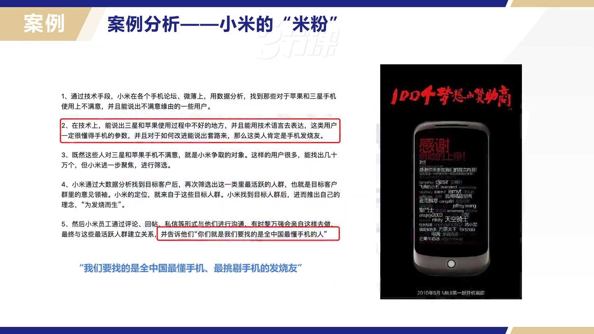

　　就在那论坛上，然后就说我们要做一二三这些东西，然后大家就来帮我们去测试使用和评估，还有提反馈意见。所有的用户提的反馈意见，基本上他们都做到以周为单位来去做迭代，以周为单位来去做改善，就做得非常的极致。等到2010年年末，2011年上半年的时候，米UI系统正式发布的时候。他们第一次米UI的开屏界面上，然后就呈现出了说100个梦想的赞助商。这100个梦想赞助商其实就是早期跟着小米一起来去内测米Y的这100个手机的发烧友们。各位你想想看，这帮用户此前都是在其他这些手机论坛上，在各种吐槽，然后感觉也没什么人搭理自己，也没什么人重视自己这样的一帮人。现在突然有一家公司，他们愿意这么尊重自己，这么重视自己，还邀请他们加入到手机的开发设计和UI系统的开发设计。整个这过程中来说，我们一起来做一款中国人做的好UI中国人做的这个好手机，最后还把他们的名字打到了手机的开屏界面上，你想他们得多感动，对不对？所以这一百多个人就毫无疑问的死心塌地就成为了小米忠实的这种脑残粉。他们就是第一波的忠实的米粉们。

　　此后的时间里边，米UI和小米这家公司经历了五年左右的时间。基本上就保持说每周我们都在做迭代，风雨无阻。每周升级。五年迭代了249个版本，然后就取巨大的成功。米UI这个系统，确实我觉得在中国安卓机的整个这个领域里边，在很长时间里面都成为了最受欢迎的UI系统和UI界面。小米的为发烧而生这个口号，也就逐渐的变得深入人心。小米的米粉这个群体，慢慢就从最早的可能一百多人就积攒到了可能有个50万人、100万人，再到可能大几百万人。

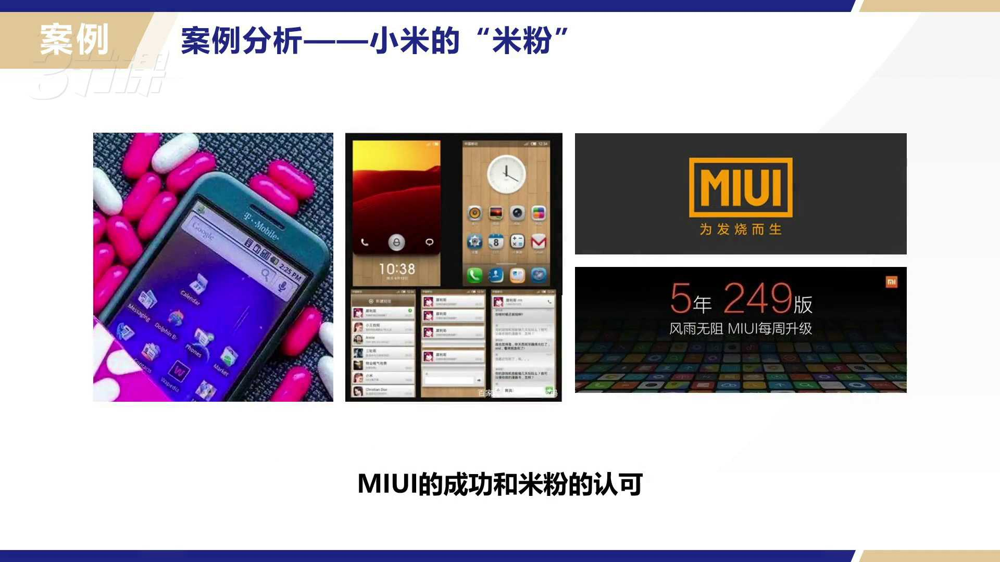

　　所以通过以上的这些例子，我们想向你传递的无非就是这么一件事儿。在三要素之上形成更加深刻的用户洞察。对一个运营来讲是巨大的潜藏能量，也往往能够撬动起巨大的流量可能。

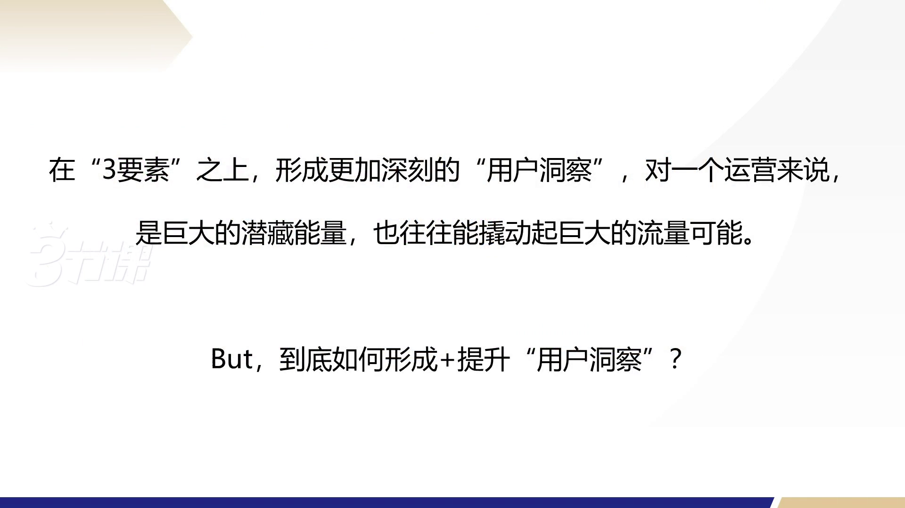

　　但是问题就来了，那到底我们该如何去形成和提升用户洞察呢？说到这儿，我觉得我们就要有一个重要的工具要分享给大家了。这个工具我把它叫做用户洞察画布。如果你是刚开始入行不久的一个运营，你还没有能够说把你对用户的一些理解就很自然的内化在你脑海里面。那不妨先用这个用户洞察画布来去慢慢的积累和提升你的一些用户洞察。

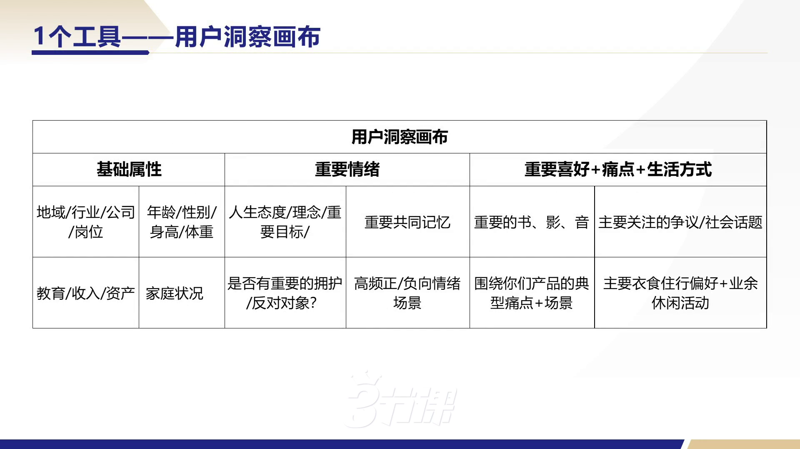

　　在画布长什么样呢？我们依次看啊，在画布从左到右其实分三个部分。第一个部分把它叫做用户的一些基础属性。基础属性里边包含了你的目标用户他所在的地域、行业，什么样的公司，什么样的岗位。如果有必要的话，还有他的年龄、性别、身高体重，他的教育背景，家庭收入、资产情况，还有像家庭里边那些基础的情况，包括婚姻、子女等等，这一部分是基础属性。

　　接下来中间的这部分叫做用户身上的一些重要的情绪，重要情绪包含了他的人生态度、理念，还有他对他来说非常重要的一些目标。这些用户身上是会有一些非常重要的共同的记忆，他是否有非常重要的拥护或者是一些反对的对象。他们的日常的生活和工作中是否会有一些高频出现的正向和负向的这种情绪的场景。这是中间这部分叫做重要的情绪。最后就是你的用户身上的一些重要的喜好痛点，还有他们的一些生活方式了。这里面包含比如说这帮用户身上有没有一些对他们很重要的，像书影音，还有他们非常关注的一些争议，还有社会话题。以及用户围绕着你们产品它的典型的痛点，还有场景可能会有什么，这部分可其实跟之前的三要素就差不多基本等同了以及用户的一些主要的衣食住行的偏好，还有他的业余休闲的活动可能主要会有哪些，这是整个用户洞察画布。

　　这个用户洞察画布，其实你可以把它当做是我们之前的基础性三要素的一个升级版，？基实现三要素作为刚入行的新人运营，你脑海中建立起来对用户一个初步的理解，我觉得是很好的。但是在那个基础之上，你如果想要再进一步的话，那也许我觉得你把它升级到用户洞察画布这个维度，对你的用户有更多全面、更加深刻、更加客观的这种理解。那对你做一些工作来讲可能是会更有帮助的那好，我们不妨也以说有看学社为例，我们来填一下这个用户洞察画布，我们填完之后再感受一下，就是它有可能会带给我们一些什么东西。对，那我们就依次可能就一个一个空格来填。

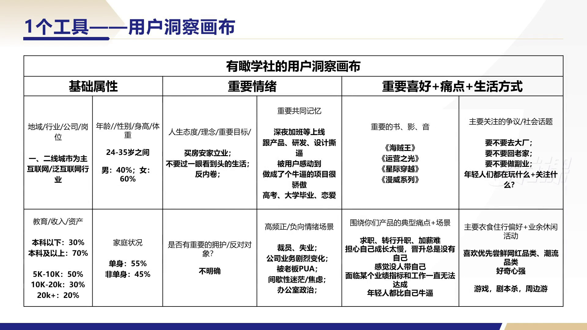

　　先从最左边开始，基础属性。首先我们的用户他所在的地域、行业、公司岗位可能是一二线城市为主，互联网泛互联网行业可能为主。年龄段基本上可能是24到35岁之间，然后基本上按照过去我们总结的经验和我们总结的用户画像，男性用户占比40%，女性用户占比可能60%。

　　那我们的这样群用户，他有些什么重要的目标、人生态度和理念呢？基本上这帮人，因为大家都处在24到35岁之间，？所以他们往往买房安家立业，又在一二线城市。这些事儿对于他们来讲是一个重要的目标。很多人可能心中是有些理念的？他们的理念就是不想过一眼看到头的生活。包括很多人是抛弃了国企事业单位的一些工作，进入到互联网这个行业里边来工作的对那他们比较的反对内卷，比较的反感内卷这样的一个这种现象。

　　那对于一些重要的共同记忆，几乎所有的互联网行业运营都会有这样的一些共同经历和记忆。比如说深夜加班等上线，比如说跟产品研发和设计撕逼，比如说被你的用户们感动到，被用户的一些重要的反馈或者用户一些留言感动到？或者做成了一个牛逼的项目，很骄傲等等。再包括可能再推久远一点的话，高考、大学毕业、恋爱等等，这些有可能对大家来讲都是一些重要的共同记忆。再往后对他们来讲，重要的书影音可能会有哪些呢？这当中也许比如说很多人都看海贼王，很多人都看过运营之光。包括因为在互联网行业工作，很多人肯定都比较喜欢像星际穿越、漫威系列，甚至可能看三体类似这样的一些书，？

　　目前他们主要关注的一些争议和社会话题，包含了比如说要不要去大要不要回老家，要不要做副业，还有就是00后、05后的年轻人们现在都在玩什么，在关注什么等等。这些是他们最近在关注的一些争议或一些社会话题。再往下他们的这个教育背景还有收入资产大概是什么情况呢？本科以下学历的人可能占比只有30%，大多数是本科及以上学历的这种人群占比到70%。

　　收入上的话，我们的24到35岁之间的用户哈那他的月收入5到10K之间可能那50%，10到20K之间可能30%，20K往上可能20%，大概是这样一个状态。家庭状况基本上就是单身青年可能占比55%，非单身可能45%，大概是这样的状态。是否他们有一些重要的拥护和反对的对象，这一点上我们目前感受下来不是特别明确。再往后他们有没有一些高频的正负向的这种情绪的一些场景呢？其实是有的。比如说经历了裁员和失业，经历了公司业务的一些剧烈的变化，被老板PUA，间歇性会感觉到对未来迷茫或者非常焦虑，还有深陷办公室政治中不能自拔等等。这些都是他们可能高频的一些正负向情绪会出现的一些这种场景。

　　再往下围绕着我们产品的典型痛点和场景，这个其实前面已经说过了然后基本上就是这些，暂时就不再赘述了。最后就他们主要的衣食住行偏好，还有一些业余的休闲活动哈那可能会是说他们更喜欢优先尝鲜一些网红的品类，潮流的品类，好奇心比较强。业余时间可能在休闲活动上喜欢打游戏、玩剧本杀，喜欢去周边游等等。

　　各位可以感受一下，当你面向你的用户，你绘制出来这么一个大的用户洞察的花布。你是否会觉得说你对这群用户他的了解，他的感知就更加的具象。所以这正是我们这个用户洞察画布它的意义所在。它能让你对你用户的了解和感知变得更加的深入和具象，并且它一定还不止如此。事实上当你针对你的每一类用户，你试着完整填充好这张画布之后，那这张画布的存在本身就会给你在无形中提供无限的运营抓手。

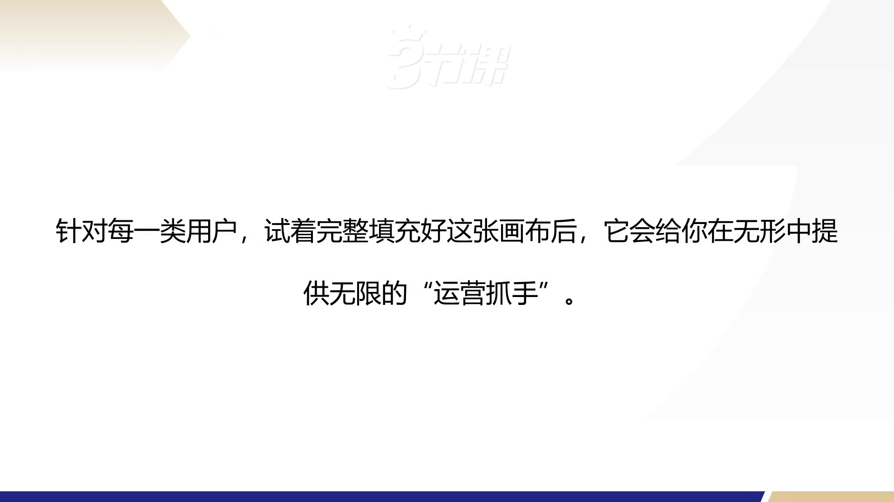

　　这是什么意思呢？就是说我们日常的运营工作中，我们要比如说写一些新媒体的文章，要策划一些活动，要跟用户搞一些互动等等，？那日常的时候，我们也许很多时候都会想不到说，我要办一个活动我该怎么弄，对不对？好，当你有了这样一张画布之后，这张画布里面的很多信息它都会成为你的运营抓手。

　　我们再来看例子，还是以有看学社的这张画布为例，假设我们有了这张画布，那接下来我们现在面对一个命题，就有看学社有我们的用户社群，对不对？我们要在我们用户社群里边组织策划一些互动活动。那我们能去怎么去想到一些idea，怎么去想到一些创意呢？来组织一些什么样的活动会比较合适呢？好了，我们就可以从这张画布里边来去找灵感。比如说你看我们可以就围绕着用户的人生态度理念这块，我们搞一个反内卷撕逼大会，？是否一听就觉得还比较有意思，想关注一下。我们同样也可以围绕着用户的一些重要的共同记忆，策划这么一个活动叫做还记得那些深夜陪你一起加过班的他，对不对？

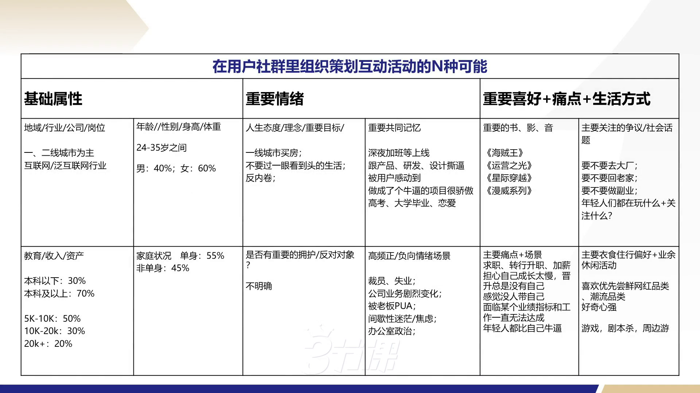

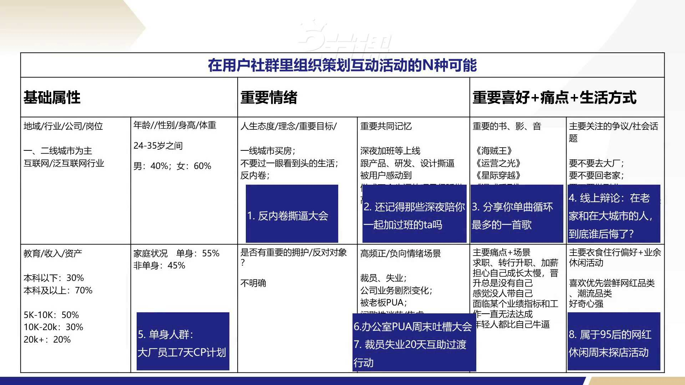

　　那还可以什么呢？就分享你自己在歌单里边单曲循环最多的一首歌，以及也可以搞个什么线上辩论？现在已经回老家和在大城市的人到底谁啊已经后悔了。

　　那以及可能还可以搞个什么针对单身人群的大厂员工七天CP计划，然后还可以搞什么办公室PUA周末吐槽大会，裁员失业20天互助过渡的这么一个行动？邀请大家来互相帮帮忙，互相可能支持一下。对还可以就搞个什么属于95后的网红休闲周末探店的活动，？

　　各位你看当我们有了这么一个画布之后，我们想要策划活动的时候，我们是否可以迅速就从这个画布身上来找到很多的灵感。好，那我们再往后看啊，假设你现在不是一个社群运营，你是一个新媒体小编了，对不对？你可能面临到的问题是我每周可能都要写文章，或者搞有些内容，拍一些什么视频，？我需要找选题，那通过这个用户画布，用户洞察画布，是否也能快速帮助我们去找到一些特别好的选题呢？一定也是可以的。比如说哈那你看就围绕着这个人生态度理念这个部分，我们就可以策划这么一篇选题，叫做这届年轻人一边反内卷一边挤破头想要进大厂，那接下来在重要共同体上，我们也可以搞一个运营和产品撕逼的8种最佳姿态，你看这个是否也很有吸引力。那再往后，我们还可以搞这么一篇选题和内容，叫做运营之光这本书到底过时了吗？

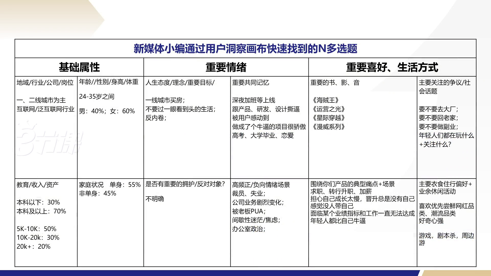

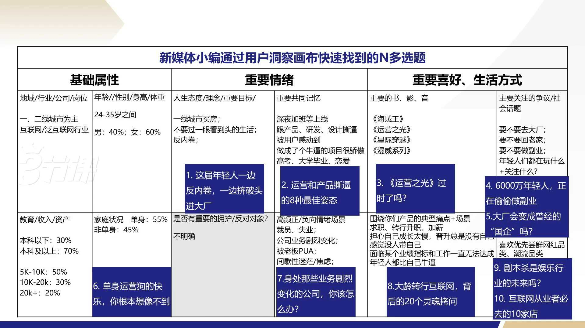

　　然后再往后，可能还可以搞这么两篇选题。第一个叫做6000万年轻人正在偷偷做副业，还有大厂会变成曾经的国企，吧？啊，然后是否听着也还蛮有意思的对，那再往下什么单身运营狗的快乐你根本想象不到，还有什么？身处那些业务剧烈变化的公司你该怎么办，吧？然后以及说大龄转行互联网背后的20个灵魂拷问，以及还有什么什么剧本杀行业是娱乐的未来？互联网从业者周末必去的十家周边店等等，？

　　你看就是我们作为一个新媒体小编，同样可以用这张用户画布快速帮我们找到N多的选题。并且这个画布里边的所有这些信息，你还可以与时俱进的不断来去做更新，？不断的可能来去分析里边的什么主要的争议社会话题，主要的这种高频正负向的情绪的一些这种场景。但所有这些东西，所有这些点你放在画布里面的，它都可以成为你运营商的一些重要抓手。因为这张画布里面所有的信息就是我们典型的用户，他们最关注最容易戳中他们的一些信息。好，说到这儿，大家应该对于我们用户洞察画布这个工具，它的价值和意义应该感知就比较明确了。接下来问题又来了，所以我们作为一个从业者，怎么才能更好的去填充好这么一张表，这么一张画布，对不对？我给的答案和建议就是近身观察反思加上以身试毒。

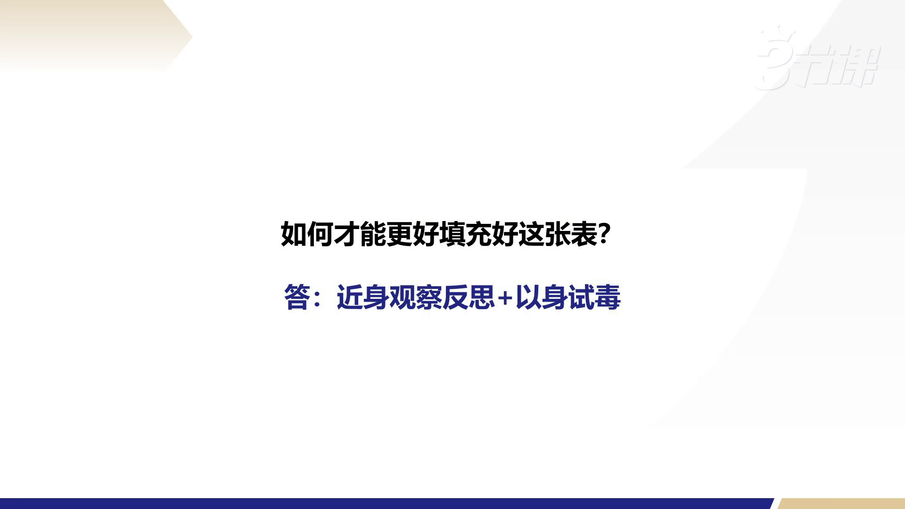

　　那这么两句话怎么来理解？我们再来进一步的来解释一下。这两句话第一我会比较建议如果你现在就是一个刚入行不久的运营，你面对着一群新用户，你之前新用户的了解确实特别有限。那第一步你可以先做什么呢？先找到一些目标用户特别扎堆的群或者一些社区等等这样的地方。进到里面去之后，晋升观察他们重点观察一些什么呢？观察他们特别热衷的一些话题、事件，收集就过往可能就是这个群体身上曾经有过的一些热贴、事件，包括他们的一些语言交流的一些风格等等。在这个基础之上你推测和理解试着推测和理解他们背后的一些情绪心理敏感点都有哪些。

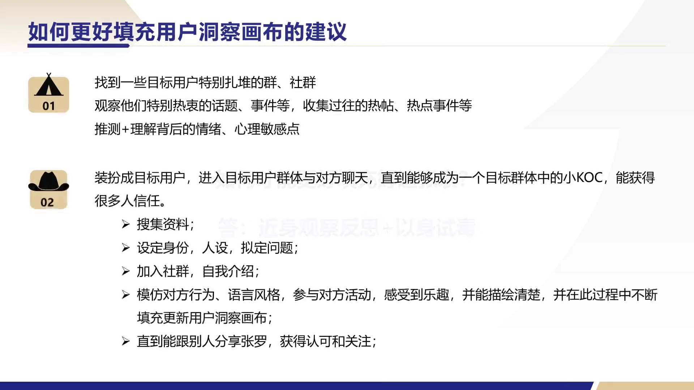

　　在这基础上，试着去填充我们那个用户洞察的这么一个画布，所以这是在第一个层级上你可以去做的事儿。这一步做完之后，如果你感觉说还不够，你确实离用户还有点远，你对这帮用户们的了解还是觉得有点有限的话，那接下来你可以再做第二步。第二步是什么呢？你可以装扮成目标用户？进入到你目标群体里边跟对方去聊天。直到有一天你能成为你的目标群体里边的一个小KOC，或者一个小的一个社群里面的活跃分子，能被很多人信任和认可？好比说你现在的目标用户就是一群广场舞大妈，那要把自己去假装成一个广场舞大妈，进到用户群里边去跟对方聊天。直到说对方都认可你了，很多人都认可你了，说你确实就是我们当中一份子，我们都是好朋友好姐妹，你要做到这个层面，那你对于你的用户们可能就会变得说更加的理解。

　　在这件事儿上，你可以首先收集一些资料，试着去设定你的身份人设？包括说你可能要进入到这个社群里面跟别人交流的话，你可能会跟大家互动聊些什么样的问题，问题背后你可能会说些什么，你可能有些什么样的资料，加入社群跟大家去自我介绍，然后模仿你这些用户人群的行为语言风格，参与对方的一些活动。并且能够去描述清楚这些活动背后那大家心里边的乐趣是什么，大家在不同场景下，他们特别开心的时候，他们特别悲伤的时候，分别是些什么样的感受。并且在这个过程中，就不断的去填充更新你的用户洞察画布。直到最后你在这个社群里边，你能跟别人去分享张罗，获得大家的一个认可和关注。做到这个程度，你对你的用户名的理解和洞察就一定会变得非常的深入了。所以各位如果听到了这儿，你也觉得说你对你的用户们确实还没有那么强的洞察或者是深入的理解的话。那不妨可以试着用用户洞察画布这样一个工具，来帮助你去填充一些信息，更好去了解和走进这帮用户们。

　　当然在这儿我觉得也有一个特别重要的注意事项。大家千万不要以为说我们的用户洞察画布是一成不变的，绝对不是。用户洞察画布它肯定是需要不断更新，与时俱进的每隔一个阶段？我们用户身上那些重要的情绪点，重要的关注的话题，他们热衷的休闲生活都是会改变的。所以你要保持在你脑海中，对用户动态画布也要不断的有更新，绝不要说用户正常发布。填完之后它就是一个绝对正确的标准答案，？日后所有东西反正我都不变，它就一定是对的，没有这样的道理，这点大家一定要理解。

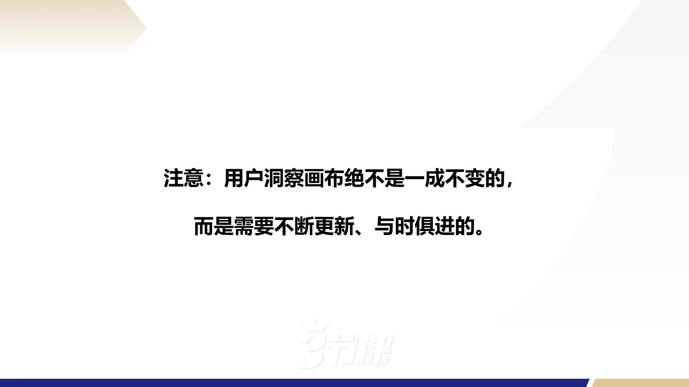

　　好，我们这个小节的内容就接近尾声了。我们最后再来总结一下关于本节的两个重要的建议。第一，各位像我们提到的一样，在你的用户群体周边作为一个运营，你一定要优先关注那些小众新潮的细分人群需求和圈层，并且要有意识的去深入了解他们。这一定会让你成为一个更有能量的运营。第二就如果你当前还无法对你的用户群体拥有深刻而敏感的洞察，那不妨把用户洞察画布快速的使用起来。它能让你在简单的用户场景需求这三要素基础之上，对于你的用户群体有更加深刻的一些洞察和理解。能捕捉到他们身上一些更加重要的情绪和心理敏感地。从而让你在运营工作中有更多的一些抓手，能绽放更大的能量。好了，我们本小节的内容就到此为止。

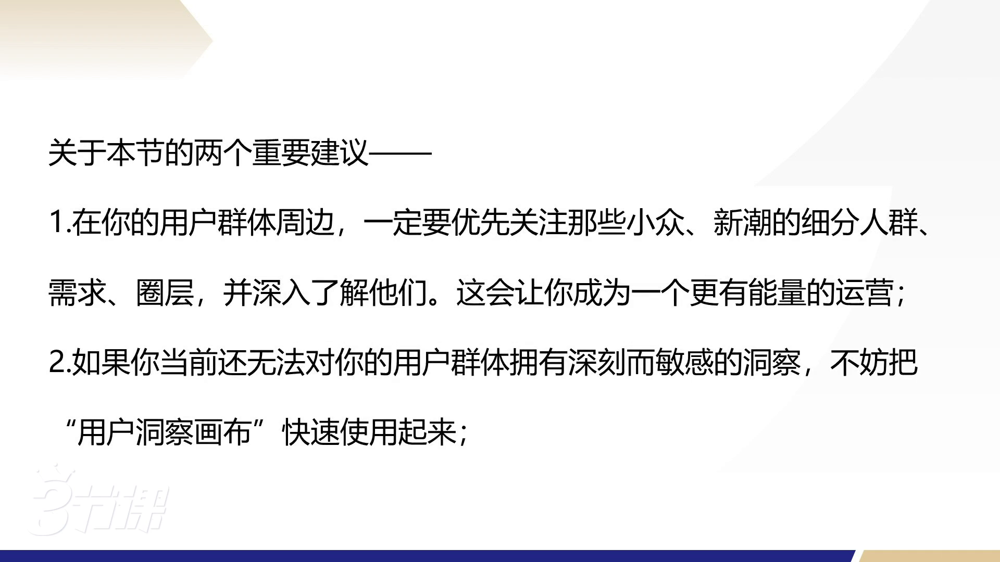

# 第三章 如何更快速洞悉流量密码？

## 3.1 如何更快速洞悉流量密码？（上）

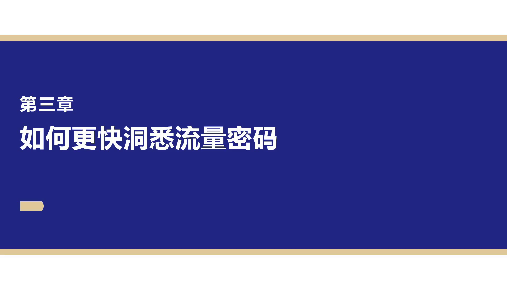

　　好，接下来我们进入到我们课程的第三节，如何更快洞悉流量密码。这一节的标题一听就非常吸引人，对不对？你作为一个运营，也许在很多地方都已经听过流量密码这个词了。但是到底什么是流量密码？它到底是个什么东西呢？我们先给他一个简单的解释。

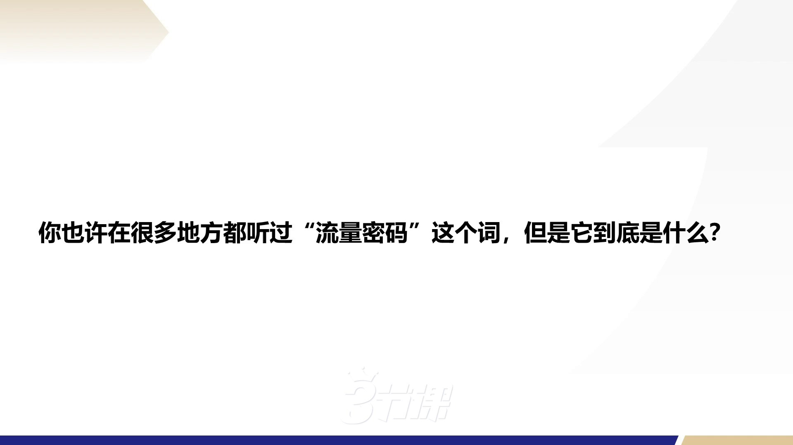

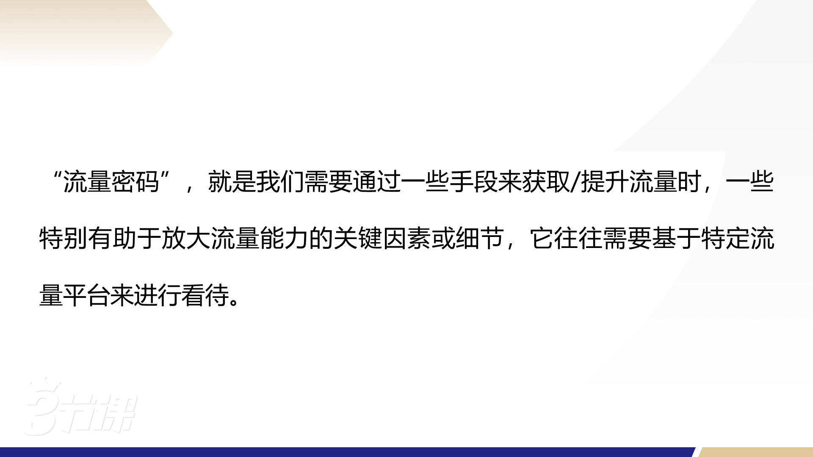

　　所谓的流量密码，事实上就是我们作为运营需要通过一些手段来去获取或提升流量的时候，可能会有一些特别有助于放大流量能力的关键的因素或者是细节。它也往往需要基于特定流量平台来看待。比如说你说你做百度那在百度上可能就会有一些特定流量密码。你说你做微信，在微信上也有些特定的流量密码。在知乎或者在抖音上，也会有一些特定流量密码。所以流量密码是需要基于特定的平台来进行看待的。

　　好，这是概念层面的解释。那么抛开概念具象一点来看，到底流量密码会长成什么样呢？它具象化了之后会是些什么东西呢？

　　我们再进一步来看一下，流量密码背后其实往往显性化的会有四个关键元素。第一个关键元素叫做话题和选题。你要知道你在很多流量生态里边去做流量哈那踩准好话题，踩准好选题，它是天然自带流量的。所以第一类流量密码就是好话题、好选题。

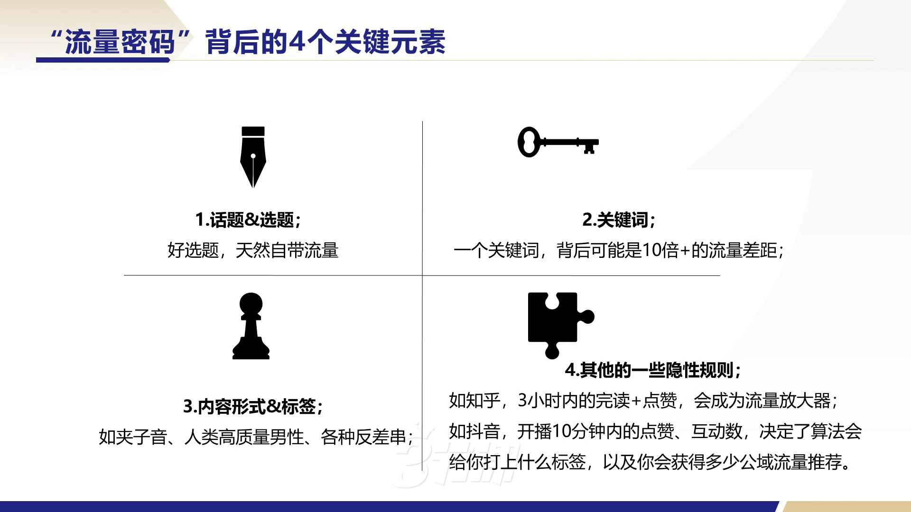

　　第二类流量密码是什么呢？就是关键词。很多时候你要知道就是我们可能在一个平台里面去做流量，可能我们就那个标题，文章的标题或者是文章的开头，就多了那么一两个关键词，背后可能会是十倍以上的流量差距。我并没有开玩笑，我们在身边见过无数的朋友，同样一篇内容可能发在什么知乎，发在小红书里面，可能就是它标题边加了一个关键词，或者没有这一个关键词，那背后就真的是十倍以上的流量差距。所以这是第二类的流量密码。

　　第三类流量密码，就是特定的一些内容形式，或者是标签。比如像短视频里边曾经很火的夹子音，？你发现你在某一个时间段里边，用夹子音这样的形式来去做视频，天然能获得巨大的流量。还有像什么人类高质量男性等等，这些事儿可能发生之后，？你在一段时间里边，用同样的一些内形式来去做这个相关的内容，那你也天然能获得巨大的一些这种流量。所以这是第三类的流量密码。

　　第四类流量密码可能就是一些流量平台下的一些隐性的规则了，？比如说也许有人不知道，像知乎你发一个新帖子，在一个热门问题下哈那这个帖子发出去之后，3小时内，然后你的完读和点赞率中和加重起来。那会决定说接下来知乎全站会给到你多大的流量推荐的权重。所以3小时内，它的完读和点赞会是一个重要的流量的放大器。或者像抖音上，你要是做直播，有可能开播前十分钟内的点赞和互动数，也决定了抖音的算法会给你直播间打上什么标签，也决定了你会在抖音今天晚上同时段的直播里面获得多少公域流量的推荐。所以显性点来看，常见的流量密码，它就是这四类话题和选题、关键词、内容形式和标签，还有平台上的一些其他的隐性规则。

　　好，到这儿，什么是流量密码我们大概就理解了哈那接下来我们再进一步来看一下，我们想要试着去洞悉或找出流量密码的话，我们该怎么去理解它，我们该怎么去找呢？首先得理解理流量发生背后它的一个核心的逻辑了。那这个核心逻辑，就是我们现在看到的这么一张图。事实上就是我们的流量产生背后，它其实是经由说我们这个世界上总有一些重要的信息源。这些信息源它会在特定的媒介渠道或者叫流量平台，以一些特定的传播形式去传播，最后会引发了大众的反应。换句话说，他说如果从这个角度来理解，就是流量最后在大众反映的是什么样的东西，它能够获得更多人的关注，能获得更多人的互动，能获得更大流量。它的一些核心的影响因素，也许就在前三者里面，就在信息源里面，在传播形式上，还有在媒介和渠道这方面上，所以我们这一节接下来要跟大家就从这三个方面来讲一下，我们该怎么去理解这背后的一些流量。

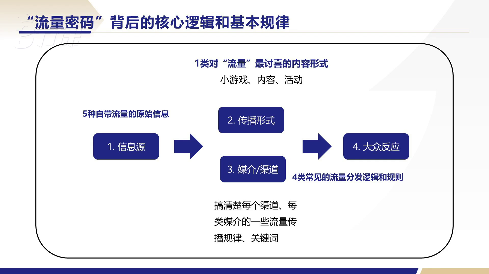

　　面码。我们会跟大家讲5种自带流量的原始信息，以及可能一种对流量最讨喜的内容形式。对新手来说，这也是最容易理解的内容形式。因为就是从传播形式上来讲，可能传播的形式可能会有像小游戏，会有内容，会有什么活动等等之类的。我觉得我们这一节篇幅肯定有限，没办法说事无巨细全都展开给你讲明白？但是我觉得我们可以帮大家提纲挈领一下来讲一类对流量最讨喜的内容形式，以及最后你要去搞流量的话，你也必须要搞清楚每个渠道，每类每一届的一些关键的流量传播的规律，关键词等等这样的一些东西。所以我们也会结合说四类不同的这种流量分发的逻辑，还有它背后的一些相应的规则来跟大家展开来聊一下。这三方面都展开聊完之后，那你大概对于自己来讲就会更有思路去说。

　　我现在在一个特定平台去做流量，那我该怎么去找到属于我自己的流量密码了？好，接下来我们先来看5种自带流量的原始信息。各位换句话说，你做运营，你要做流量，你要提升流量，？你手里边总是得有一些原始的信息或原始的一些素材的，对不对？那我们接下来要跟你讲的就是说，你要面向你的用户群体，刻意的去关注这么5种的原始信息。这些原始信息你要是抓住了，？

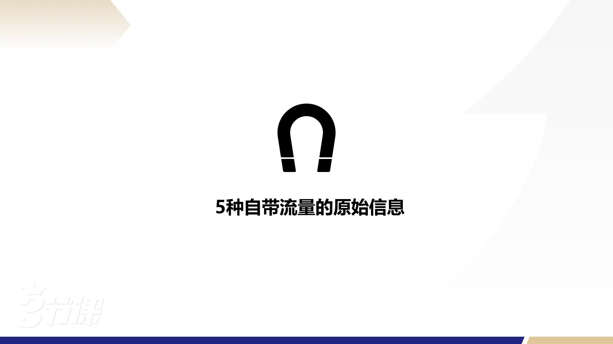

　　你用它来去做流量，那天然就是更有利的，因为他们本身就是自带流量的。好，那我们不妨就一起来看一下，这5种自带流量的原始信息到底分别都是什么？我们不妨就先直接给大家五句话，然后再分别举例来去说明。这五句话是这样的，第一重要情绪对立即流量。第二高反差式趣味互动即流量。第三叫做带来幸运的神秘力量加上高识别度人物事件叠加在一起即流量。第四是大众社会事件，大众娱乐事件即流量。第五叫做共识性时间节点即流量。

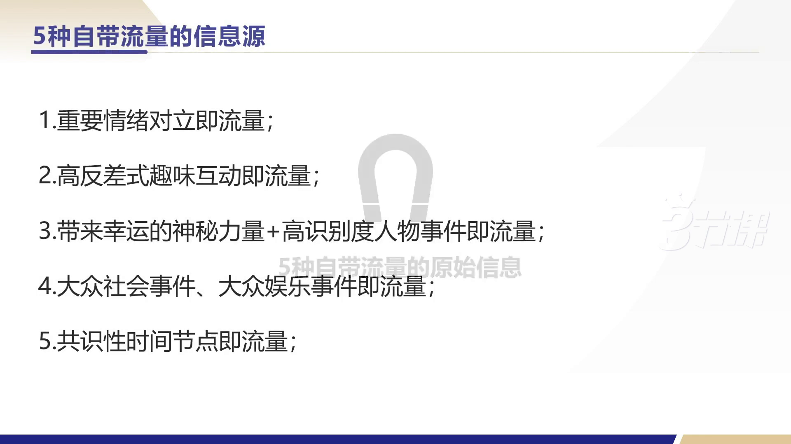

　　好，这是五种自带流量的信息源，我们接下来再依次分别用例子来去说明一下。首先是重要情绪，对立即流量，这个什么意思呢？各位你要知道，你做运营面向特定的用户群体，最容易获得流量的话题永远都是这类群体。他们对现实，对某些现象有某种不满或不接受，或者他们坚定的认可，反对或者赞扬某些事情，又或者在你的用户群体里边存在着就是两群人之间会有一些对立和撕逼。一旦你捕捉到这样的一些话题之后，你把他们抛出来，那这些东西面向你的用户群体天然就是自带流量的。

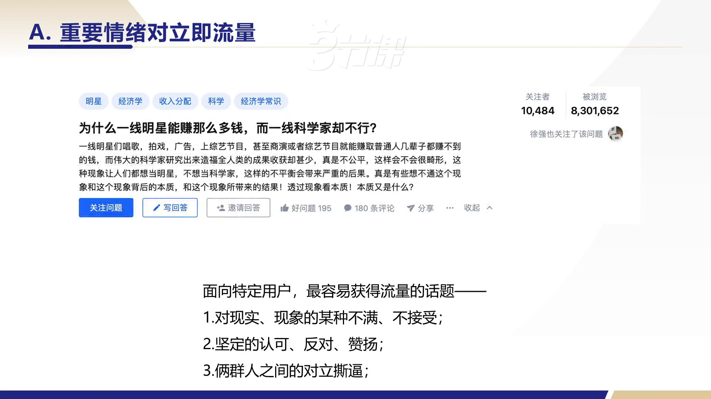

　　比如举几个例子哈那像我们在知乎上会看到这样的问题，叫做为什么一线明星能赚赚那么多钱，而一线科学家却不行？假想一下，如果你是一个像做什么科研人员的这种社区的这么一个运营哈那这样的问题一旦抛出来，在你的用户群体里面一定是会引爆的。因为他们对这个现象背后就是不满的？凭什么一线明星能赚这么多钱，而我们科研就不行呢？对不对？他们天然内心里面就有着这样的不满，有着这样的不接受。所以这样的问题一抛出来，迅速就能引爆他们。

　　那同理接下来一个问题，叫做说凭什么很多好游戏都没有王者荣耀火，？那同理也是一样的，这样的问题一抛出来之后，可能在王者荣耀的这个粉丝群体里或用户群体里边，或在其他一些同类型的小众游戏，小众好游戏的用户群里边，也是会特别容易引爆的对那这些东西我们就把它叫做重要的情绪对立。另外在重要情绪对立这你看我们这也说了，两群人之间的对立撕逼，它天然也是自带流量的那我们接下来就给大家分享一个我们之前曾经实际操作过的一个案例。这个案例我们是在知乎以大本营来去做哈他从知乎开始扩散到了各种的社群，各种的社区。

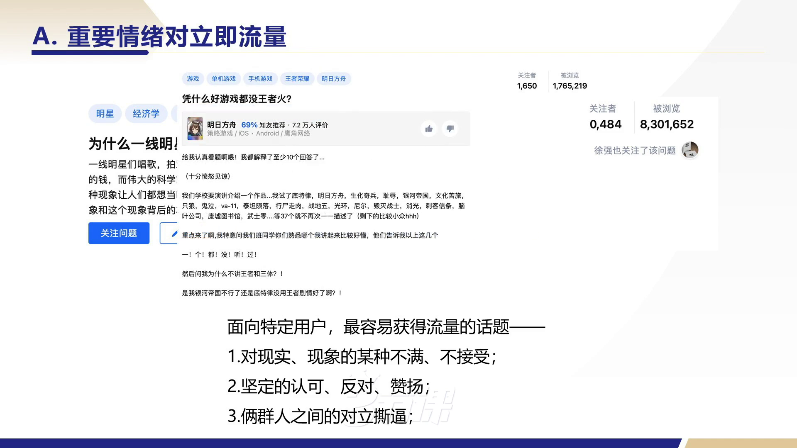

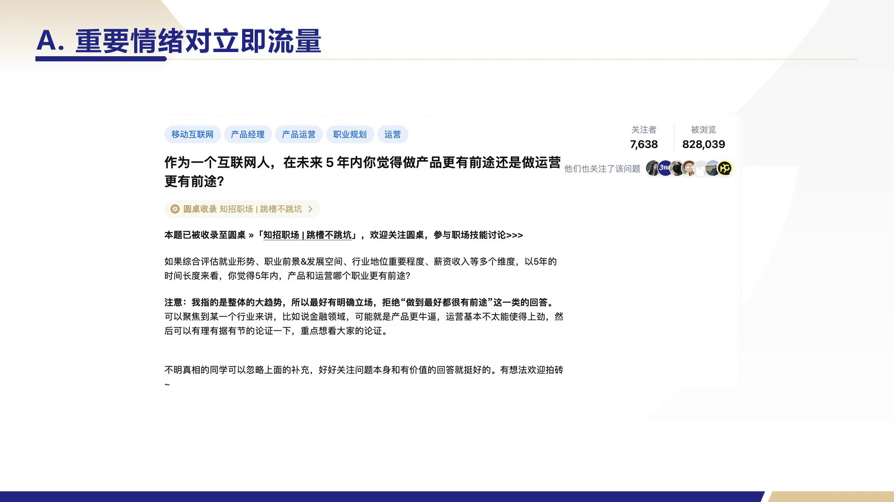

　　这个案例它大概是这样的，就我们可能在2017年前后，就策划了这么一个产品和运营之间的一个撕逼对抗的一个大在那当时有一个重要的环节，就是我们要在知乎来去做一场辩论。这个辩论主题就是作为一个互联网人，在未来五年，你觉得是做产品更有前途，还是做运营更有前途呢？对不对？我们就发起了这么一个辩论赛。

　　当这个话题在知乎可能就发生了之后，我们就可能邀请了几个朋友啊，有运营方的代表，产品方的代表？就在里边做了几个初始的回答。当这些初始回答发出来之后，迅速就引爆了很多的产品经理，很多的运营都来围观，都来讨论。然后你看这里边就是有人就会说这个显著是产品经理更有前途，？单纯的运营可能你看在美国存在感都是偏弱的，在中国可能就也不会好到哪里去。

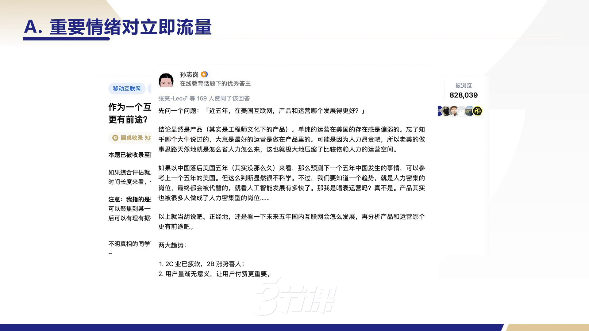

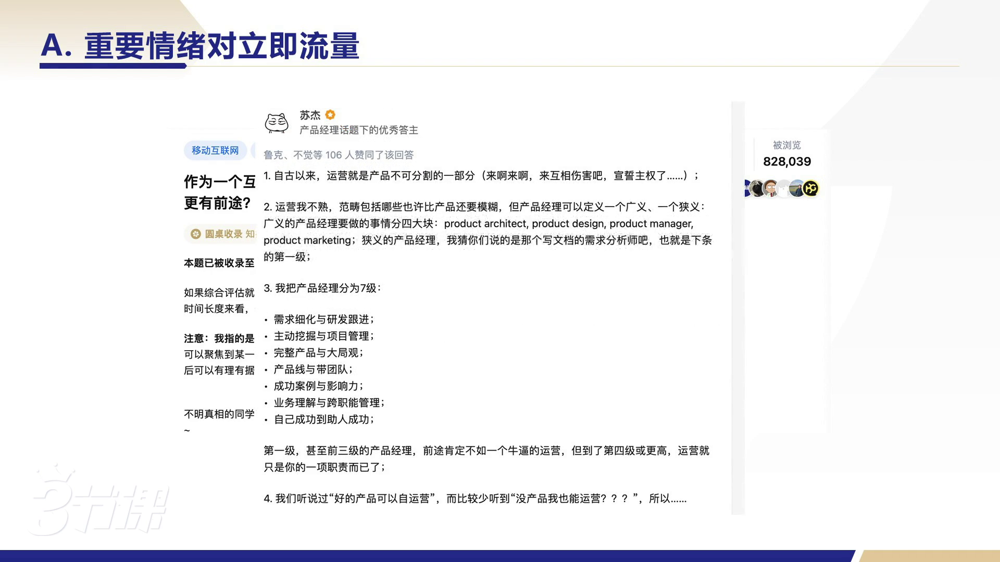

　　对，包括可能像产品经理这里边的可能一个知名的KOL？苏杰老师？他也来回答，然后他就说你看自古以来，运营就是我们产品不可分割的一部分，来还说来呀来，我们来互相伤害，？就特别有意思。对。包括可能也有一些其他人就讲说，你看产品经理醒醒，产品狗未来是没有前途的？包括可能我也会来回答，说我就顺手伤害一下产品王文，肯定是运更有前途，？产品将来是没有前途的。

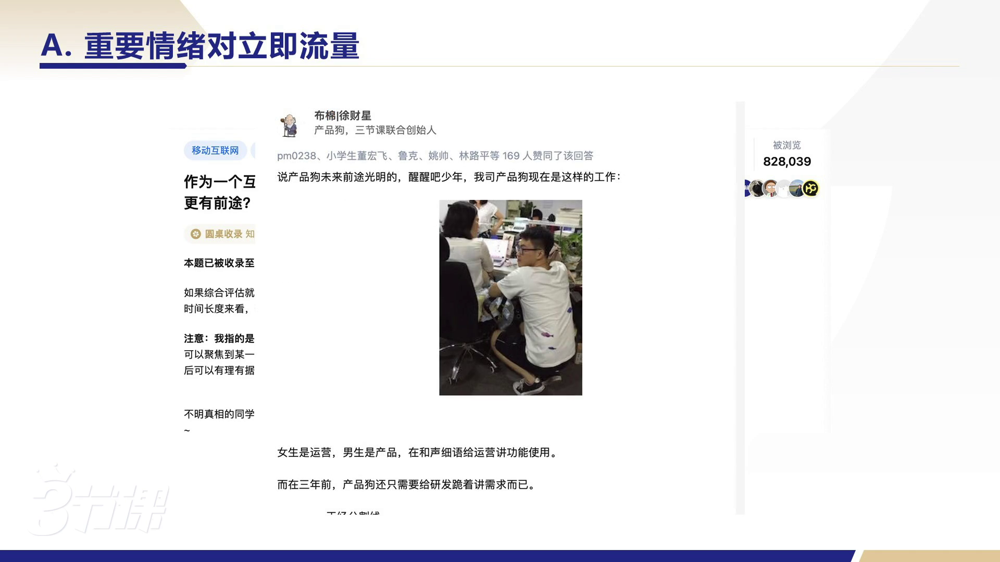

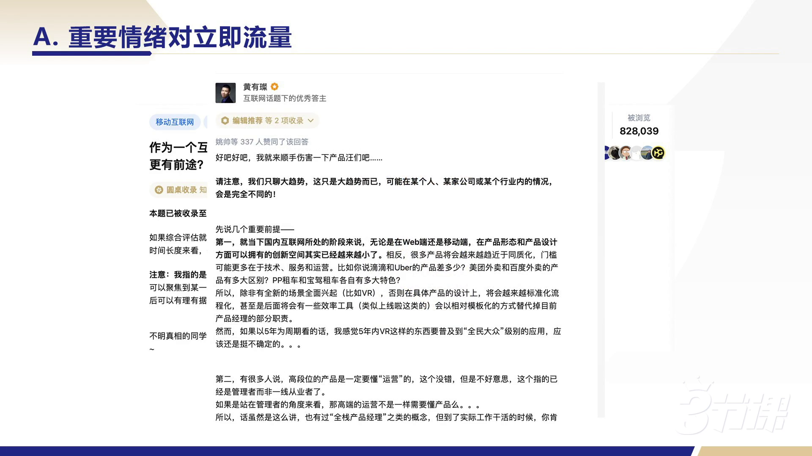

　　所以就这么一个辩论，他在知乎就发起来之后，迅速就吸引了无数的人来围观。而且这里边因为辩论中就有了非常多精彩的论点观点的碰撞，那这个辩论赛他就一再的可能有很多内容就持续在外为来做传播。在很多社区里面，在很多垂直社区里面都不断的在传开，就有越来越多的人知道，可能这场辩论赛就来围观。最后单这一个辩论赛，就为我们当时就拉了可能大概也是有个十几万的精准的用户，精准的流量和关注。所以这是一个我们实际操作过的案例。

　　事实上各位你要知道，其实在很多的社区，很多社群里面，就是抓这种大家之间的会吵架大的话题，或者会争议的话题，会撕逼会对立的话题，一贯都是运营上的一个非常重要的侧重点。比如在很多汽车论坛里边哈那大家可能会聊说到底可能是奥迪好还是宝马好，到底可能是什么本田好还是丰田好啊之类的对，那就围绕这话题的讨论，大家就能聊上半个可能几周，甚至可能几个月的样子。只要这样的话题的争议产生了，那其实这个网站流量都在坑坑往上涨。对，甚至可能在微博上或者在一些其他地方上，包括什么豆腐脑到底是甜的还是咸的这样的话题都能引起非常多的这种讨论，非常多的这样的这种争议，？所以他就是天然的一个人性里边的一个自然规律。所以大家做运营在日常工作中，在你的用户群体身上一定要刻意的去关注这样的一些点，这样的一些潜在会带来争议，会带来对立的一些话题。

　　好，这是我们讲到的第一种自带流量的信息源。好，第二种叫做高反差式趣味互动即流量。这个什么意思呢？各位我不知道大家还有多少人会有印象或知道这件事儿。就曾经在京东上是有一个客服美眉是非常火的，这大概应该是在恨不得都08年到10年期间，那个时候的事儿了？当时这个京东上客服美眉，她曾经引发了数百万人在线天天到京东也不干别的，就围观这客服美眉在线聊天，在线来去答疑，？就回答这些用户们提出的各种各样的疑问好了。

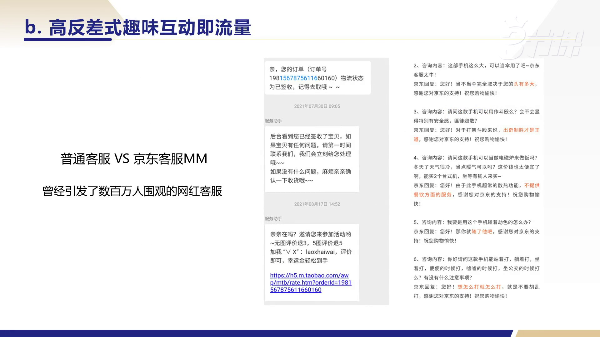

　　那这个客服美眉她是怎么走红起来的呢？其实逻辑也很简单，就最早有人在京东买了一些手机之后，就在京东网站上留一些客服的咨询，？那就出现了一个客服美眉，这客服美眉她对一些客服问题的回复和回答就特别的奇葩，也特别的脑洞，充满了一些调戏的意味？比如说有人问他说，这个手机的这个充电线为什么这么长？然后他可能就回复讲说为什么这么长这事儿呢？说实话我也不知道。但是我转念一想，就手机的充电线长这件事儿，也许非常好的，？比如说你可以把它当做什么晾衣绳来去使用等等这样的，所以就让人感觉说就很奇葩，也很逗比，然后也充满了跟用户之间调戏的意味。

　　慢慢的当用户发现这个客服美眉他每个问题他的回复的画风都是这样的，就有越来越多的人跑来问他一些奇葩的问题，就为了去看说他到底会怎么来回答，？啊，所以你看现在屏幕上右边的这张图，就是当年很多人在京东上去问这客服美眉一些问题，就问说这部手机这么大可以当伞用了，？或者是说请问这部手机可以用作斗殴吗？会不会显得特别有安全感，匪徒必散等等之类的？然后客户美眉她的回复就是说你看你好，当不当伞完全取决于您的头有多大。感谢您对京东的支持，或者说对于打架斗殴来讲，出奇制胜才是王道。感谢您对京东的支持。等等，？所以就显得就特别有意思。

　　那就这么一个客服美眉跟我们平常看到其他客服，平常其他客服肯定那种比较正，或者就比较无趣的那种状态。你猛一间遇到这么一个客服美眉，会觉得说还挺有意思的这就我们所讲的，在一些网站或在一些产品内部，如果你能刻意去制造出来一些，或者你去发现一些，？可能有某些人或有些地方，你是可以营造一些趣味反差式的这样的这种互动的。本来用户预期说这就是一个很boring的一个客服或一个小编，或者说用户预期说我在这儿就是一个很正经的这么一个行为，你刻意把它去营造出来一种说反差的，很有趣、很逗逼的、很脑洞，充满调戏意味的这样的一种互动，那也许就会引发特别多人的围观，所以这是我们第二种自带流量的信息源。我们在再往下，我们第三种自带流量信息源叫做带来幸运的神秘力量，再加上高识别度人物事件，两者叠加在一起就是流量了，？

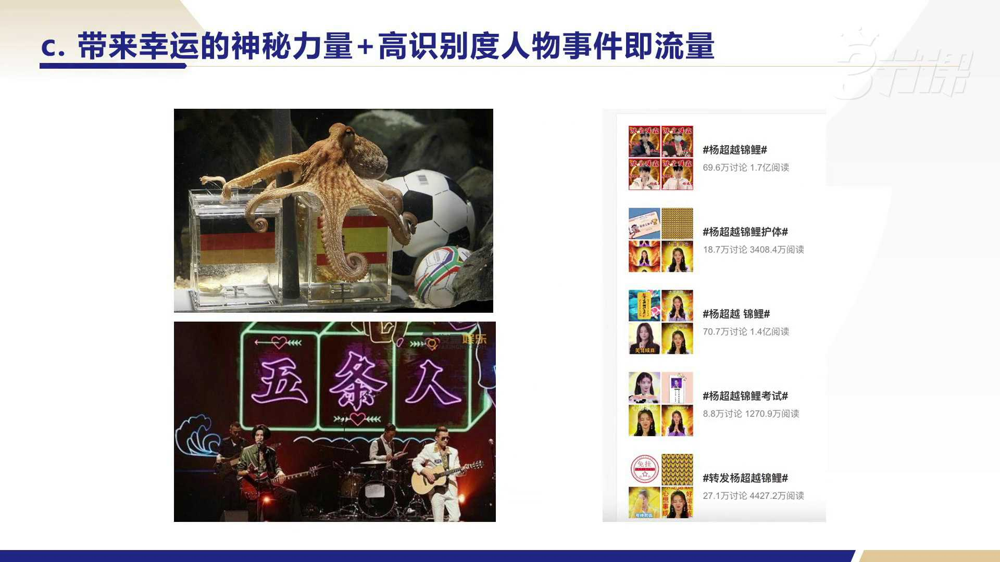

　　这事儿怎么理解呢？就是各位你要知道这个世界上，在大量的普通网民普通用户心中，大家对于一些玄学力量的期待其实是潜意识的。就潜意识里边大家都会期待着有一些玄学式的力量出现，能带给我们幸运，？所以一旦在互联网上，就是你发现出现了这样的一些迹象。比如说你喜欢一支球队，你发现这支球队里边有某个人上场的时候，似乎我们就会赢，这支球队就会赢？并且上场的这个人，如果他的识别度又还比较高，他身上还有一些重要的特征，？比如说他上场之前就特别喜欢用某个手势来祈祷，那自然的慢慢大家就会把说他上场这个手势，就会变成一种说潜在的起伏式的行为。这个东西就会传播开，就会成为一种巨大的流量源，大概是这个意思。

　　我们还是拿几个例子来讲哈那首先第一个例子，我不知道大家看这幅图还有没有印象。如果是看球的同学们可能还会有点印象。这个例子是某一年的世界杯，？大家要有印象的话，当时就在德国还是在哪个国家就出现一只章鱼。对，这个章鱼的话每逢大赛之前，大家都让他说，你来在这两盒子，两个盒子各自不同国家的国旗了，你来选择其中一个。

　　这个章鱼就非常的神奇，他每次选中的这一方都能够获得胜利，而没选中的另外一方都会失利回家。所以这个章鱼在很长一段时间里面，就成为了大家的锦鲤，也成为了大家津津乐道的一个话题，？就在网上成为了一个网红的章鱼。以至于后来这个章鱼他去世的时候，这个水族馆还给他办了一个盛大的一个葬礼。

　　对，所以这是第一个例子哈那第二个例子就是乐队的夏天，应该在2020年和2021年这两年的时候都办了这么一个节目哈那这个节目里边就涌现出来一个乐队，叫做五条人，？五条人这个乐队也很有意思，每一次他们都是说濒临要被淘汰了，就打到了淘汰那个组别里面去。但每一次都能够起死回生，再加上这个乐队它本身就像我们说的一样，它的识别度就很高。他的这些歌的风格，他的音乐的风格对大家来讲是识别度非常高的。

　　所以在当时乐队夏天那一季开播的时候，五条人这个乐队也完全就在整个的大众群里边就走红了，？那最后一个例子，最后例子就是杨超越和锦鲤了。也是一样，自从有人在微博上发起了杨超越的这个锦鲤的体制等等这样的一些话题讨论之后。一方面由于这个话题本身，另外一方面确实杨超越也是一个识别度非常高的人，？大家但凡对娱乐圈有点了解，都应该知道，我在这里不再赘述了。

　　迅速的就是杨超越和锦鲤这俩词儿就合在一起就开始爆红起来。对，就出现了无数这样的一些这种梗，就变成了一个非常热的一个梗，？很多人都在说转发这个杨超越的吴水运图片，然后让你什么霉运退散，好运通通降临。转发这个杨超越不仅不努力就能考第三，？第一第二还立刻转学等等，就产生了无数这样的一个。这种梗？

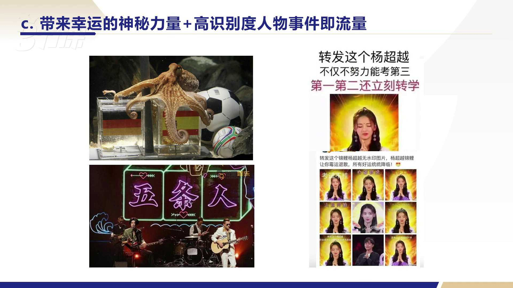

　　就一时之间这个锦鲤的画风就风靡全网，所以这是我们说的第三种自带流量的信息源。你要可以去关注在你的用户群体里边，或者在他们周边会不会出现一些？然后带来信的神秘力量，并且背后还能跟一些高识别度的人物事件能够去关联衔接起来。如果出现这样的一些信息的话，你是可以把它创造成你手里的一个重要的流量密码的那我们要说的第四个这种自带流量的信息源，就是大众的社会热点事件和娱乐事件。

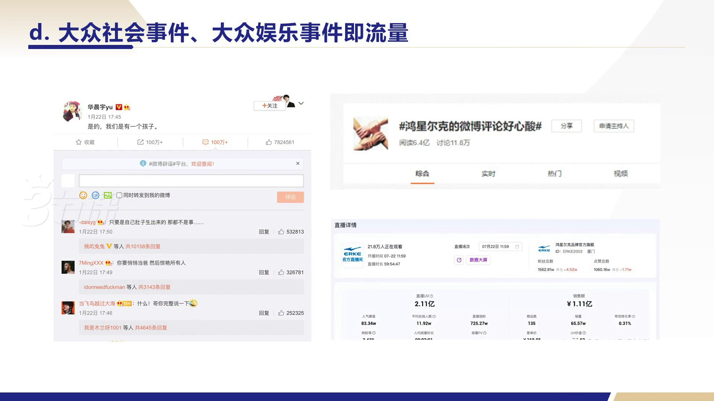

　　然后这个我觉得大家就比较容易理解，我们也不用花特别多的功夫来去叙述了，每一年都会有N多？娱乐明星的各种大瓜和社会的各种的大瓜和新闻。那每一年这些事件发生，它背后都意味着至少可能是几亿以上的这种流量。换句话说，你在可能一个热点事件发生N的过程之中，只要说你借由这个热点事件可能来去发表了一些内容，或者做了一些相关的活动，？那你能获得的流量的可能性和概率天然就是更大的。有机会？从那几亿的流量大池子里边能瓜分到其中一些，所以这是我们的第四种自带流量的信息源，这就不再过多赘述了哈那我们的第五种自带流量的这个信息源的话，我们把它叫做共识性的时间节点，记流量什么意思呢？

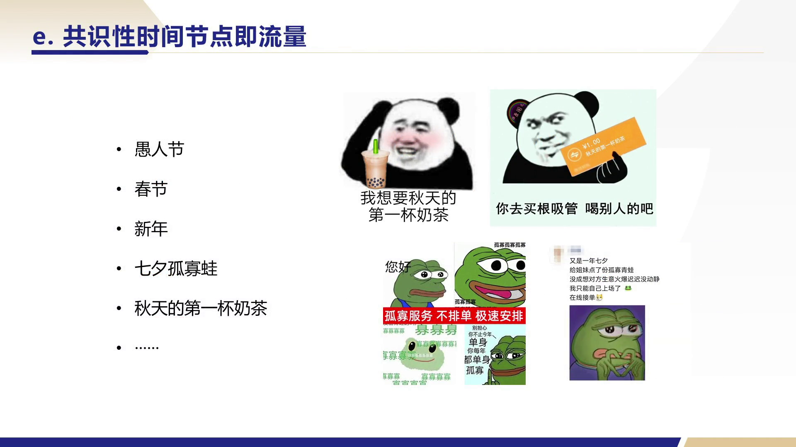

　　就在每一类用户群体身上哈那他们一定会有一些对他们是比较重要的时间节点。对，在这个时间节点的背后，是他们对某些事情其实是有所期待的那换句话说，只要你在相应时间节点背后，你可能发起了一些他们潜意识里边期待的那些事儿，有机会能获得更大的一些流量，？包括围绕着可能一些特定话题来做调侃？

　　然后比如说像愚人节、春节、新年，什么七夕情人节等等。所以这些时间节点都是每一年都会自带流量的共识性的时间节点。那就像我们说的一样，你要是抓住这些时间节点，我要是他做出来一些你们用户潜意识里边期待着的一些内容，来做一些有趣的调侃，那基本上你都会获得非常多流量。就像每一年愚人节可能都会有些公司发布一些就看起来亦真亦假的新闻，然后说我们公司又推出了一个什么特别牛逼的产品，然后看起来还挺真的？然后实质上它是一个假新闻。那这样的东西可能获得巨大的流量，并且在这些巨大流量背后，往往这些用户还会觉得说这家公司其实很有意思，？啊，然后包括说每一年的新年，也一定会有像什么新年签这样的一些小游可能会走红。再包括像什么七夕孤寡，什么秋天的第一杯奶茶等等，这样一些东西的走红，其实它背后都是这个逻辑。

　　所以以上就是我们给大家分享的5种自带流量的信息源。重要情绪对立，高反差式趣味互动，带来幸运的神秘力量，叠加高识别度人物事件、大众社会事件和娱乐事件，还有共识性的时间节点。如果各位你是要关注流量的运营，那不妨就围绕着你的用户群体，更有意识的去关注和收集跟上边这五个方面相关的一些信息素材。它会让你手中的流量武器天然就会变得更多的。

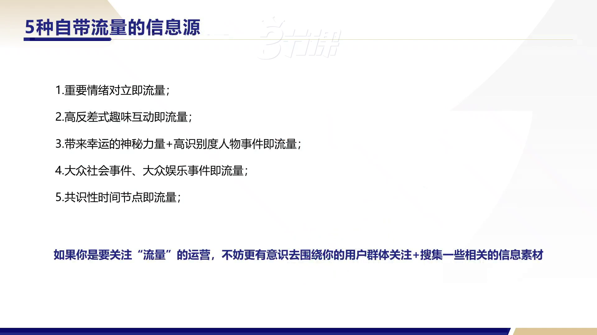

## 3.2 如何更快速洞悉流量密码？（下）

　　接下来我们再进入到本节的另外一个部分，我们来讲一类对内容最讨喜的内容形式。就像我们前面提到的一样，在整个其实传播的链路上，内容形式可能会分为说像小游戏，像活动，还有我们日常消费的内容。我们在这个部分就重点只讲一类对于流量最讨喜的内容形式。

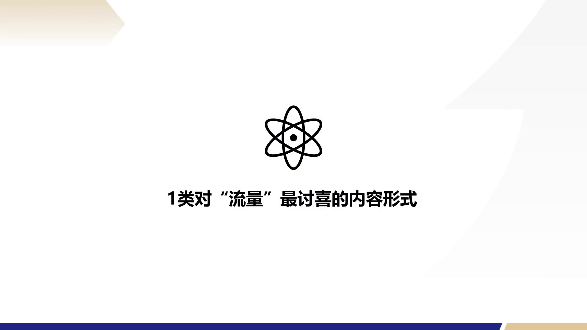

　　这类内容形式其实非常的简单，就两个字叫什么呢？叫做反差。怎么理解这两个字？某种意义上你要知道在所有互联网的流量生态下，但凡你做了一个内容，这个内容背后它带有巨大的反差。比如说有一个人出来？这个人讲的话跟他的衣着，或者跟他的什么语音语调，甚至跟他的一些姿态可能会有巨大的反差。那这个人或者这个内容就会比较容易火。

　　包括说有一家公司或有个组织？他一方面可能说我们公司是干这个的，但另外一方面，比如说他的什么logo，它的什么设计？然后他的什么画风可能跟他声称的他要做的那件事儿背后有巨大的反差。一般可能也会火，反差可能从内容形式上来，就互联网上最容易捕捉最常见的一类流量密码。

　　好，我们不妨也来看两个经典的反差带来大流量的这样的例子。这两个例子都是走红于2 0221年，我们来分别来看一下。第一个例子是人类高质量男性。徐勤根？这哥们儿大家还有印象的话，就是梳着一个整齐的一个分头，然后脸上画着一个淡妆，摆着一个奇怪的姿态？拿着个手机在自拍，然后说我是人类高质量男性，我现在可能要来去求偶？所以这哥们儿他为什么会火？

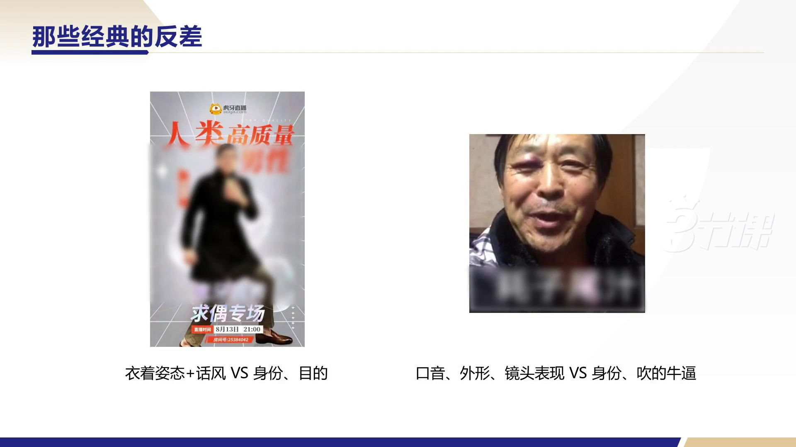

　　很简单，就是他的衣着姿态，还有他的画风？他的声音里面还有一些浓厚的那种口音，反正就很很搞笑很搞怪的那样的一个这种语音。那对比起来就是他自己声称的自己的身份，他说他是一个非常成功的国内顶级的投资人，？以及说他的目的，他目的说他要来求偶？一个求有的人穿成这样，打扮成这样，光着脚搞着一个高档的皮鞋？就整个反正感觉说他身上穿的每一样东西，反正都是啊很高档的名牌。但穿在身上加上他的打扮看起来就非常之奇怪，所以他就火了？这就是一个非常经典的反差带来大流量的一个例子。

　　好，我们再来看另外一个大家可能也非常熟悉例子，就是我们的耗子尾汁马保国老师。那马保国老师大家可能就更加熟悉了，他是混元形意太极门的掌门？然后是顶着一个掌门人的称呼，结果上了几次面向大众直播的这个PK赛，被人家打的反正就是不堪一击，大概这样的一种表现，？然后后来又不断在镜头里面出现，说年轻人什么不讲武德，说自己还要去拍什么大电影之类的。所以马老师走红的背后也是就他的口音，他那一嘴浓厚的口音？耗子尾汁这样的口音，它的外形，它的镜头里边的实际的表现，对比起他自己自吹的这个身份，他包括写过什么书，去英国教过什么太极拳，然后吹了很多的牛逼。

　　这些东西背后形成巨大的不对称，形成巨大的这种不一致，有个巨大的反差？所以这些东西的反差构在一起，造成了整个这个人或者他背后的这个事件，成了一个核心的大的一个这种流量风口。一时之间所有人都要来蹭这个梗。事实上在互联网上，但凡这种巨大的反差性事件和人物出现的时候，他们往往会成为一个非常热的耿。

　　当然了，这两位走红的背后多少都有一点这种恶搞的意味。我们肯定也就是主张说大家都要去学他们去恶搞，？肯定不是这么回事儿。但是我觉得这背后大家一定要深刻的去体会和理解，就是反差这两个字背后潜藏着的魔力。事实上其实在任何一家公司里边，你要想去刻意去策划，刻意去思考的话，那你也许都能找到N多跟反差有关的，能带动大流量的这样的一些环节或这样的一些人。

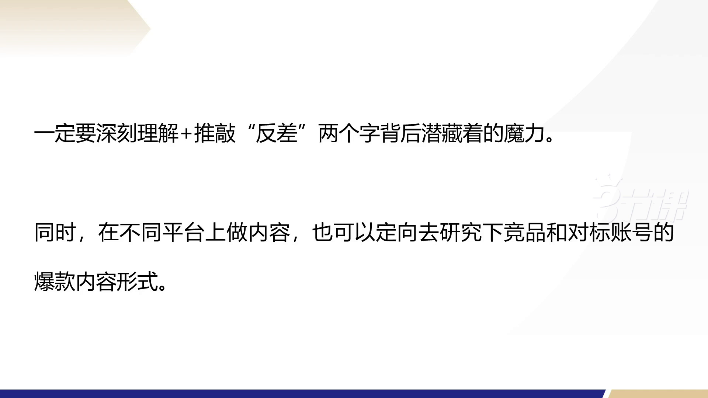

　　包括像环球影城的走红的变形金刚，？也是跟反差这两个字是有直接的关系的。大家试想一下变形金刚什么威震天？通常在我们脑海中他是一个什么样的人物形象呢？他是一个恶派，然后是一个冷酷无情，是一个恶人？大概这样的一个种形象。但是在环球影城的现场，威震天操着他的机器人的这种口音，突然间变成了一个温暖的一个大叔，？那一下子就让整个威震天就火起来了。所以反差这两个字背后天然就潜藏在很多的流量模拟的，大家一定要反复去推敲和理解这件事儿。

　　同时我们也说过了，反差只是一种可能最容易被大家理解，最容易被大家看到的自带流量的内容形式。我们想说，如果你是在不同的平台上去做内容，你希望去找到更多自带流量密码内容形式。那你一定也可以定向去研究一下该平台下你的竞品，还有对标的一些账。好，他们做出来的一些爆款内容在形式上到底有些什么样的特征，有些什么样值得你去关注逻辑。按照这个逻辑来去做些分析，你也一定能找到一些潜在的流量密码。

　　好，接下来我们进入到这一节的第三个板块，四种常见的流量分发逻辑和规则。就像我们说的一样，在不同的流量渠道，不同流量平台上，它的流量分发的规则和逻辑是不一样的。而从互联网诞生以来至今，其实也就存在四种最常见的流量分发逻辑和规则。那他们到底是什么呢？以及怎么通过搞懂他们来去理解每个平台它的一些流量规则、流量密码？我们就依次来看一下。

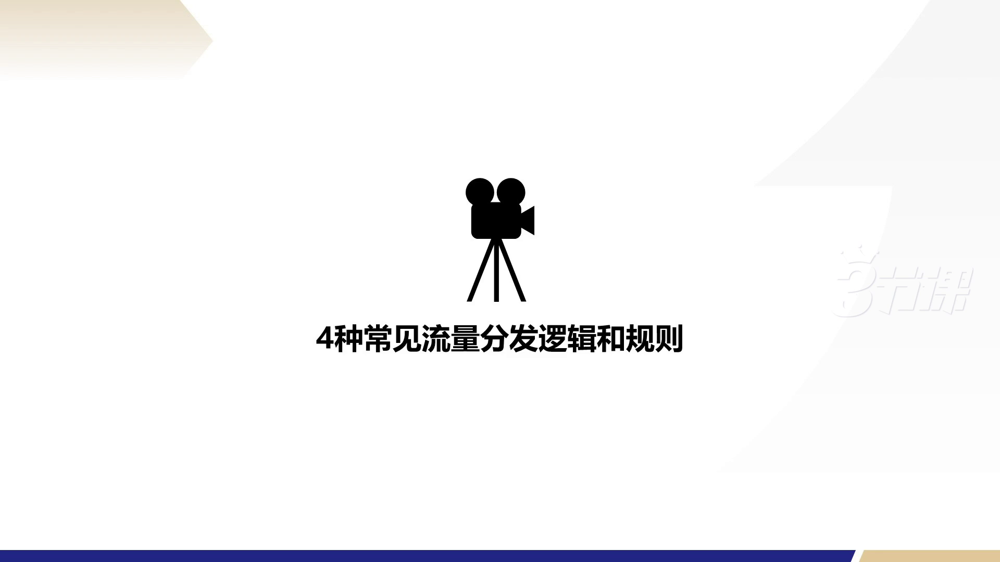

　　首先我们第一种流量分发的规则叫做说编辑推荐和分类索引的分发。这样一种流量分发的规则，它一般更多出现在一些像门户网站，媒体或者一些分类索引的这种网站，？然后包括一些什么同城的这种分类网站等等，一般出现在这样的一些这种站点上。

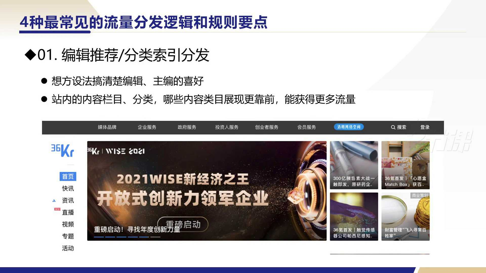

　　那对于你如果是说在这类流量生态下，你要去做流量，你想获得更多流量的话，那它的要点是说你得想方设法。第一要搞清楚这个站内的编辑主编他的喜好，尤其他对内容的喜好，他对一些类目的喜好大概是怎样？这个要搞定关键人，因为它的流量分发很大程度上是依赖于人的。除了人之外，你也需要去搞明白他站内的内容栏目还有分类，哪些类目展现可能是更靠前的那这些展现比较靠前的类目和栏目，它一定在站内就能获得更多的一些这种流量了。比如说你说我要做了一个内容上某媒体，那一定是这个媒体它有N多的分类，你说在同城的一些分类网站上，它也会有N多的这种分类，？所以你到底要让你做内容挂上哪一类类目？这个是有讲究的，它也会有助于你能获得更多的流量，所以这是第一种流量分发的逻辑和规则。

　　第二种流量分发的逻辑和规则，就是搜索排序分发，？典型就常见于一些搜索引擎。如果你是要做搜索流量的话，我们这儿就提一下简单的逻辑。你做搜索流量某种程度上你必须就盯死两件事儿来做对第一件事儿就是你要盯死热词或者就是关键词。因为搜索搜的是什么呢？就是我们的关键词一定有些词它被搜索的频次是更高的？那搜索频次越高就意味着这些词本身就是自带流量的那另外的话就是可能会有这个搜索引擎它的收录排序的算法，就是它会把一些什么样的网站会抓入到我的搜索引擎引擎到这个列表里面，以及什么样的网站在搜索结果页它的排序会是更高的这背后，一定会有它的一个搜索排序的一个算法，会有它的规则。

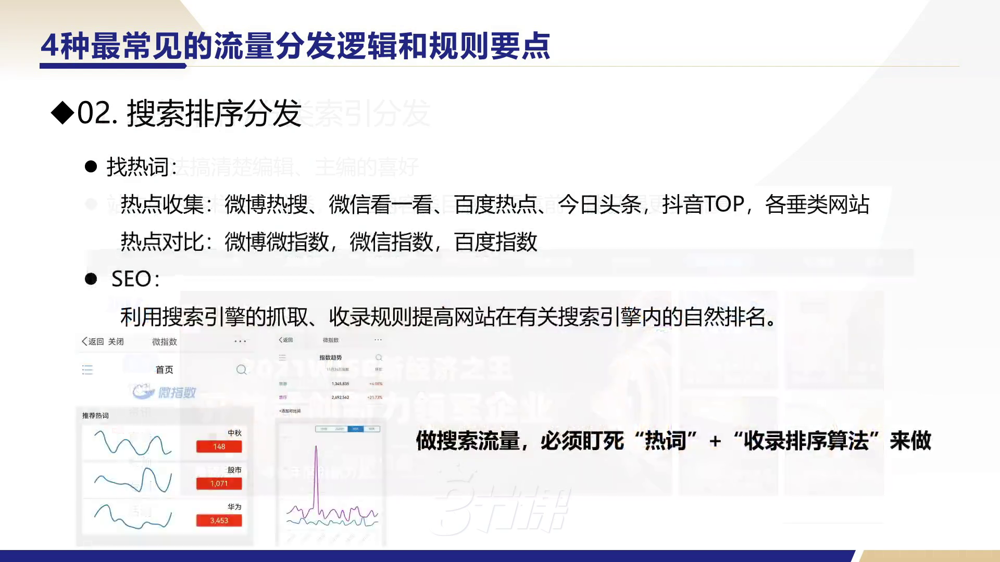

　　所以，其实在做搜索这件事儿上，行业里边有一个岗位叫做SEO，就做搜索引擎的优化，它是干什么的呢？就是来去调整我自己这个网站它的一些代码，它的一些内容的排序，它可能含哪些这个关键词，它链接怎么能对搜索引擎的抓取更友好，做这样一系列的优化，最终的话让我这个网站能更好的被一个搜索引擎来去收录。从而，我能获得更多的自然流量。所以某种程度上你要做搜索流量的话，那一般，就是要盯死热词，钉死说这个搜索引擎它的一些收入排序的算法，这样来去做。不断在关键词，还有我的整个站点的一些代码，一些细节上来去做调整，我才能拿到更多的一些这种流量。这是第二种流量分发的逻辑和规则。

　　第三种流量分发逻辑和规则就叫做社交关系链分发。这种我们应该也很熟悉，？像什么微博，朋友圈什么。知乎、小红书，其实某种意义上都是这一类。就是我基于我关注的对象，我能获得一些内容的这个相关推荐，？大概是这样。

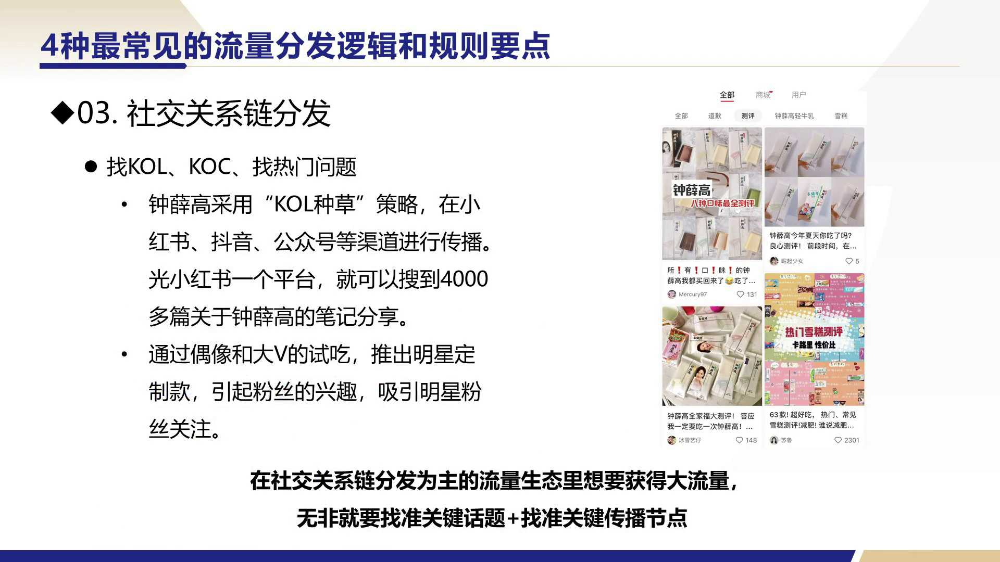

　　如果你是在这一类流量生态下，你想获得更多的流量的话，获得更大流量的话，那其实就两个关键点。第一个是要找准关键的话题。因为在这一类社交关系链为主的流量生态下哈那大家一定会对一些重要的话题在一段时间里边是有热度的，是大家都愿意关注的那你能找准这些关键话题的话，能够引发在站内引发更多人的关注，更多人跟你的互动，这是第一第二。那就一定要找准关键的传播节点，在整个这一类流量生态下，一定会有很多的大V你做的内容能获得他们的分享，能获得他们的点赞，那这个内容就一定会更火。

　　所以你也会发现，在这一类流量生态下，也有一类典型的推广营销的模式，叫什么呢？就叫做KOLKOC的这样的这种营销？然后就通过找一些热门问题，找一些QLKOC来帮助你可能在这个平台下，在这个流量生态下来去造势，？那也许能够获得更多的流量典型，比如说像小红书这样的这种站点内，那我们搜索了一下，像钟薛高作为一个品牌，那它就在站内采用了KOL种草的这么一个这种策略。就是找了几千个KOL同时在小红书或其他的一些新媒体站内，来去做相关的这种投放，相关的内容的营销，从而吸引到更多粉丝的关注。最后的话效果也还不错，所以这是第三种我们讲的流量分发的逻辑和规则。

　　最后一种常见的流量分发逻辑和规则，就叫做信息流和算法推荐分发了。这一类流量分发逻辑也是近几年越来越主流，越来越常见的一种流量分发的逻和规则。典型像什么抖音，或者像以前的今日头条等等，都是采用这样的一种流量分发的逻辑的那如果你是在这样的流量平台下来去做流量，那它的关键是什么呢？那一定要知道，就是整个流量平台下，它一定是有个算法的，而且算法背后它一定会有一个说你的内容只要达到某某条件，就一定能在我们算法的流量池推荐里边拿到更多的这样的一个这种权重。因为算法背后是什么呢？算法背后它就是我这个平台有几个大的流量池，一个内容产生了？只要它符合A条件，我给它先推到一个较小流量池。在符合B条件我又给他推荐了一个更大的流量池，一级一级往上去滚，直到说最优质的内容，它能获得最大的推荐权重，所以大概是这样。

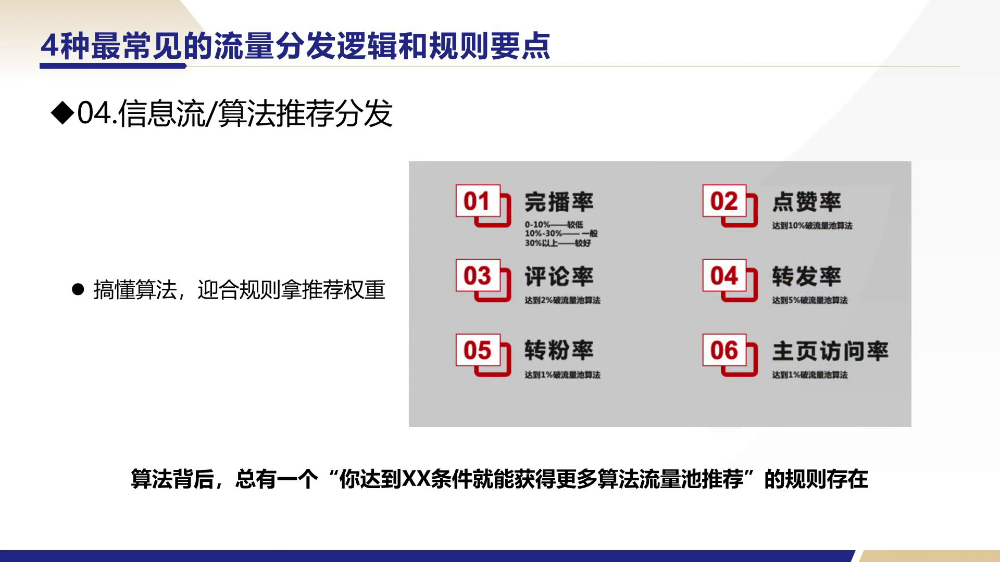

　　所以你要是在这种信息流算法推荐的这样的流量生态里边来去做流量的话，那一定要想办法搞懂算法，要迎合规则去拿你的推荐权重。比如说我们现在屏幕上看到的就是某个短视频平台，然后它他的一个算法判定的一个规则？就是他会看这么几个核心的内容的指标，完播率、评论率、点赞率、转发率、转粉率、主页访问率？

　　那只要这些相关的指标上到达某个阈值就触发了某个阈值。那这个账号或相关的内容它就能够获得更多的一个算法推荐。当然这个算法在每个平台上它也会一直在变，一直在进化，？所以你要是在这样的平台上去做流量的话，那就要一直去不断保持对算法的一个关注。这样你才能更好的去理解这个平台的流量密码到底是怎样的。

　　好，以上就跟大家分享了四种最常见的流量分发的逻辑和规则。但是我觉得我们要跟大家再说一句，时至今日你要知道有很多平台里边，它也可能同时会有多种流量分发的规则在存在。多种流量分发规则同时都在生效着，？所以今天你要是在一个渠道或一个平台上去做流量，你怎么搞清楚这个平台它流量分发逻辑到底是哪一种？然后怎么来去更好的在平台上来获得流量呢？

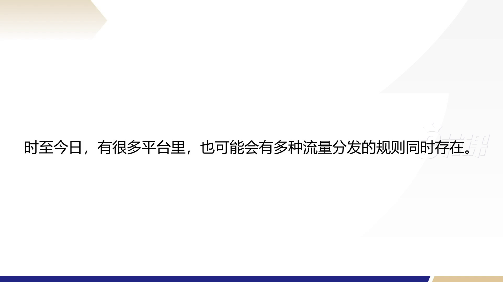

　　我们给大家一个简单的逻辑，某种程度上在任何一个流量平台，你要通过做内容来获得流量。它的起点一定是我内容的生产和发布。终点的话一定是说这个内容获得更多的曝光，获得了更大的这样的这种流量，？那中间要梳理清楚，从我的内容发布到获得流量曝光，可能会有哪些关键的节点。你把这些关键节点都梳理清楚了，那能基于整个流量分发的链路去想说，也许我可以在哪些环节去做一些相关的工作，让我能在站内获得更高的流量分发的权重。这是一个基础的思路？

　　好，接下来我们不妨就以知乎为例，我们来具体看一下。在知乎这样的一个大的流量生态里边，如果我们是要通过做内容在站内获得更多流量的话，那它整个流量分发的链路里边会有哪些关键节点，以及我们该怎么去捕捉到里边的一些规则，来去做一些关键的动作，以让我们在知乎站内能获得更高的流量推荐的权重，好，那我们就来看一下知乎还是从内容生产发布到最终能获得曝光，获得流量，从前到后，那会有哪些关键的流量分发？那整个流量分发的链路上会有哪些关键的节点？第一个其实是我们要筛选高关注高权重的问题。因为我们发现在知乎站内一定是那些关注度越高，然后它的权重就最近的新增关注人数可能越高的这样的问题。其实他能获得更多的曝光，他能获得更大流量。所以首先如果我们在知乎要做流量的话，我们一定要先筛选出来这些高关注高权重的问题，这是可能第一个环节了。

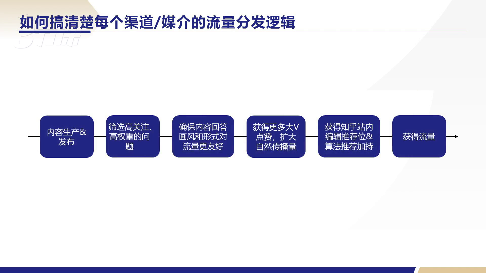

　　再往后的话，我们可能也要确保我们的内容回答的画风和形式，在知乎站内对流量是更友好的。其实在知乎站内，其实它是有一些特定的文体，特定的文风，更容易获得一些赞，更容易获得一些大的这种流量的？比如说最常见的知乎在内，要么就那种抖机灵体，要么就那种很严肃认真的旧的老的这种知乎体，对不对？所以我们也要尽量保证我们的内容回答的画风和形式在知乎站内对流量更友好。

　　因为我们可能分析了大概可能说知乎站内几百个高站的问题，发现说几百百个这些高赞的回答背后他们的文风，他们的内容的形式可能还是有些共性，所以我们要尽量向这些共性去靠拢，这是可能第二个。第三个就是我们也发现，我们的内容一旦在知乎站内发布，那我们一定要能够获得更多知乎的大V的点赞，才能扩大自然的传播量。因为知乎站内是有这种社交关系链分发的逻辑的，所以如果我们的内容能获得更多大V的点赞，在知乎站内就一定能获得更多的自然传播量，自然曝光量，？

　　好，再往后最后一个环节，我们也发现知乎站内同时也存在说站内编辑推荐，还有说算法推荐这两种逻辑。站内编辑推荐会有一些知乎的这种精选，知乎的一些这种专栏之类的？那站内编辑可能会挑一些他们喜欢哪些内容，加进去来做全站推荐。同时算法可能也有一些逻辑，会把说符合某些条件的内容，符合某些条件的回答来再放到流量池里面做一些分发，做一些推件？所以我们也需要在知乎站内去搞懂说编辑到底会喜欢一些什么样的内容，它的算法的运行的规则到底可能会是怎样的。

　　好了，到这为止发现我们把知乎这样的一个流量平台，它的整个的这个流量分发的一个逻辑，或者这个链路中间有哪些关键环节，它背后逻辑是怎样的，我们基本就梳理的差不多了。根据我们梳理出来这个结论，我们在知乎里边就一定能够更有针对性的去做一些工作。我们筛问题，我们去调整我们的内容形式，我们要去BD更多的大V来帮我们点赞，？我们也许还需要去研究一下知乎的算法，这样的话我们才能在知乎站内获得更多的一个流量。好，假设我们在一个流量生态下，我们已经研究完了所有这些东西之后，那接下来我们可以再做一步，就是形成我们自你在这个流量平台下的一个流量密码地图了。我们现在就以说有看学社，做知乎为例。

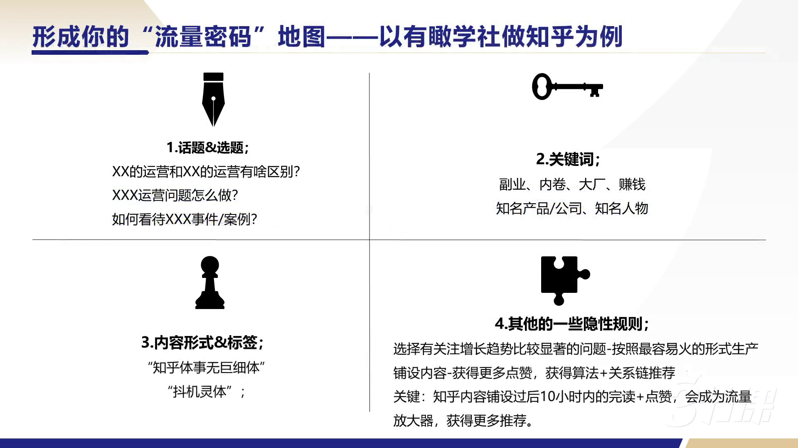

　　我们来去梳理一下，我们在乎这个平台下，我们的流量密码地图可能会长什么样。大家还有印象的话，我们在这一节的开篇就跟大家说了，常见流量密码可能有4种类型，对不对？第一种就是话题和选题。所以我们在知乎在内，也结合说我们的目标用户他的关注量最大，点击量最大，最容易火的这样的一些这种问题？我们简单就拎了一下，可能常见的这个话题选题有这么几类。

　　第一类。就是说某某运营和某某运营有啥区别？比如说月薪3000，月薪3万元有啥区别？或者说社群运营和用户运营到底有什么区别，策略运营和产品云到底有什么区别等等，这是可能第一类问题。第二类问题就是说什么什么运营问题该怎么做或该怎么解？比如说私域流量到底该怎么做，或者说什么短视频到底该怎么做等等。

　　第三类话题和选题就是如何看待某某某事件，就是说最近发生的一些热门的这种事件？这些事件背后也自然是自带流样的，所以这是第一类流量密码，就是我们的话题和选题。第二类流量密码就是关键词，关键词这背后我们也能找出来这样一些关键词，包括像副业内卷大厂赚钱，还有一些知名产品和公司，像什么微信、抖音，或者一些知名的人物，比如像张小龙。这些东西一旦出现在不管在问题里面，还是出现在可能我们的回答里面，它可能也都是自带流量的一些关键词，这是第二类流量密码。

　　第三类流量密码就是我们的内容形式和标签。像我们刚才提到的一样，知乎上有两种文体是比较容易火的。一种就是知乎体，事无巨细体，就一个问题的回答背后，我得先给你来界定说这个问题到底是个啥问题。这个问题背后有几种可能性？第一种可能性你该怎么解？第二种第三种可能性你又该怎么解？背后我再给你附上一个详细无比的一个资料库，那这样的一个回答的话，典型是比较容易火的，比较易高站的。还有一种就抖机灵体，这个在知乎后期反正一般也都出现的比较多，我就不解释了。所以说内容形式和标签上，最后就是我们的一些其他隐性规则了。

　　就像我们刚才分析的一样，在知乎站内做流量从前到后几个关键的节点。首先你要选择关注增长趋势比较显著的问题，这些问题是自带流量的。接下来你要按照说最容易火的形式来生产铺设内容。那再往后你要去找人来帮你点赞，获得更多点赞，以让你自己的内容获得算法和关系链推荐，这样你才能获得更多流量。同时这里边的知乎战略的算法上，我们研究过后发现说知乎我们把内容铺设过后，假设10小时内它的完读数加点赞数，综合的一个加总会成为流量放大器。只要你的玩独家点赞数就过了其中一个值之后，能够在站内获得更多推荐。以上这几块我们整个梳理完了之后，也许就会成为我们在知乎去做流量工作的一个核心的流量密码。

　　好了，到此为止我们关于如何更好洞悉流量密码这一节的内容就讲的差不多了。最后我们也给大家一个建议，就是作为一个运营，你在任何一个流量平台下去耕耘做流量。那我们建议你都一定要逐渐形成你脑海中的一个流量密码的地图，就像我们刚才给大家分享的这样一张地图一样。大家要有意识的慢慢去构建起来自己的这么一张流量地图。好了，我们本节内容就到这为止。

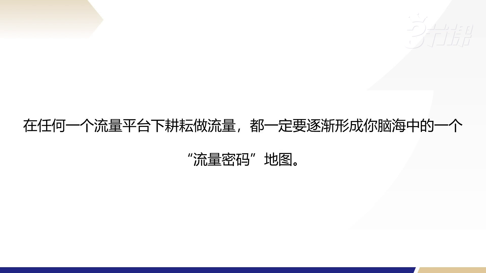

# 第四章 调动用户互动/参与动机的9大原则+3种用户互动活跃神器

## 4.1 9大秘诀+3种用户互动活跃神器（上）

# 

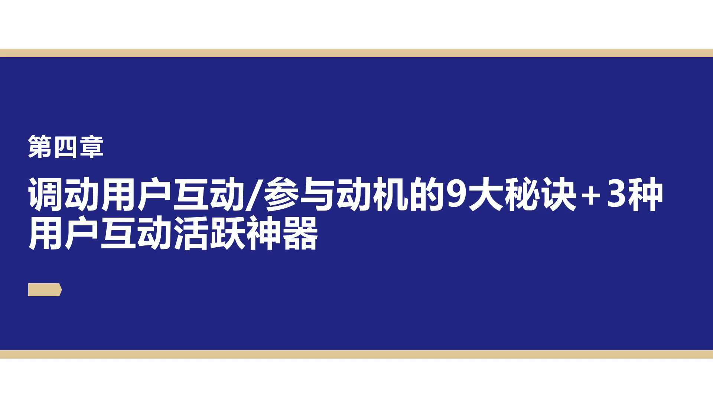

　　好，我们接下来进入我们这一模块课程的第四节。这一节的标题看起来就非常的有吸引力了，叫做调动用户互动参与动机的九大秘诀，以及3种用户互动活跃的神器，这是我们这节的主题。就像我自己在重新理解运营这个模块课程里边解读的一样。其实运营和产品之间的关系，产品更多时候是提供长期价值的，而运营是要面向用户创造短期价值的。很多时候我们一个产品长期价值即便非常稳定了，我们也需要运营来去创造一些短期价值，吸引用户来去更好的试用这个产品。就像我们的课程，即便说我课程内容做的很好啊，课程内容做的很精良，对不对？但是用户能不能学完是另外一回事儿，要让用户能够学完的话，我们就需要运营来去做一些相关的工作，来吸引用户，给到用户更多的动机？让用户愿意跟着我们往下走，来去学完这门课，它才能得到这个产品的长期价值，很多时候都是这样的。

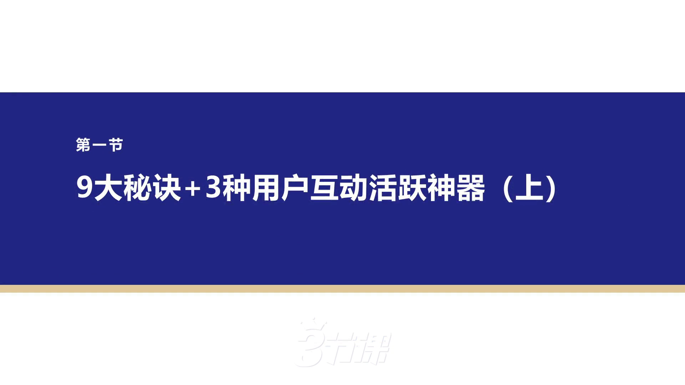

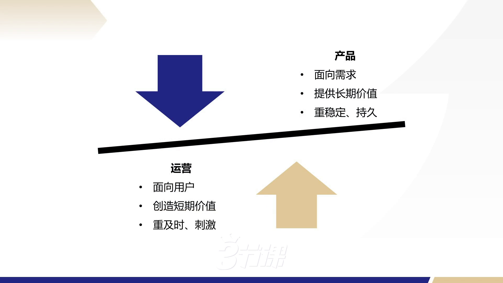

　　所以作为每一个运营从业者，如何更好的创造短期价值，调动用户的参与员。不管你是做了一个活动，还是说你要给某个产品功能？可能去做一些运营，来吸引更多用户使用这个产品。那这些事儿都是摆在每一个运营面前的重要的考验。所以我们这一节的课程就得依次跟大家逐一聊聊？

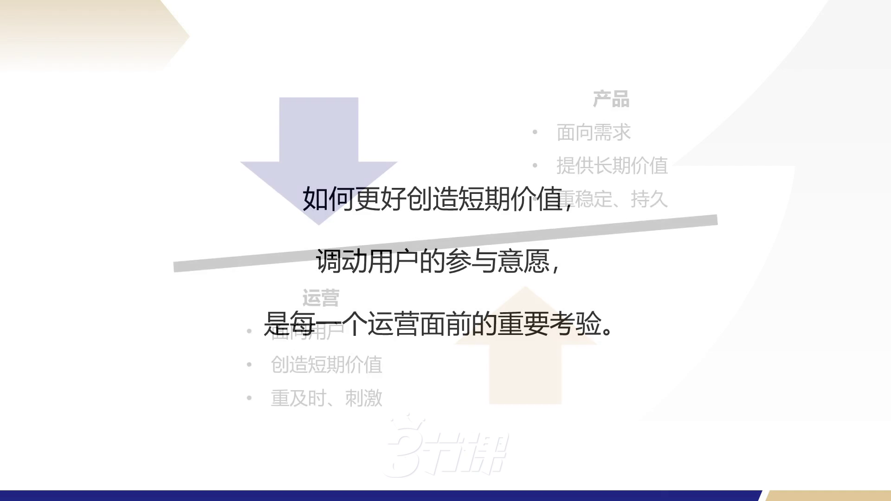

　　到底我们在日常运营工作中有效影响用户，撬动用户参与动机背后有九大秘诀，我们就要跟大家依次烙。这九大秘诀各自是什么？好，我们接下来不妨就一个一个来看案例。我们先看案例，再逐次来跟大家总结这九大秘诀到底是个啥。

　　首先先来看两个案例，这两个案例左边这个案例是支付宝有名的中国锦鲤，这个大家或者多多少少应该都听过。右边是苏宁818的登录，苏宁APP的登录时候的一个抽奖，？大家可以看到这是这两个活动，这两个活动参与的人数，参与的用户的活跃度其实都是非常高的。左边这个就不用说了，右边这个，反正当时我在苏宁站内看到参与的人数，它的活跃度还是非常之高的对那这两个活动背后某种意义上，我们分别来解读一下。左边这个活动，你只要一看到，说我靠支付宝中国锦鲤抽一个人，抽完之后你看他能获得这么一大堆的各种各样的福利。然后在国外怎么着又免单，然后怎么着肯定又能获得一些奢侈品的这种赠礼等等之类的？你看这活动毫无疑问我一定要参加了，很多人都是这样的，第一时间看到我就一定要参加了。

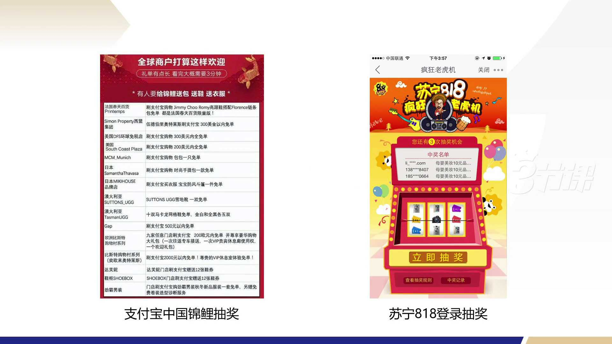

　　右边苏宁818的这个登录抽奖，用户在他面前是个什么样的心理呢？就是你看我登录了苏宁易购APP，打开之后跳出来这么一个小的一个类似小游戏的一个形式。这个小游戏其实它是什么呢？

　　就是一个老虎机，对不对？我一看这个老虎机，反正还挺有趣，挺好玩的。随便点一下立即抽奖，那我就点一下呗，点完之后又没啥损失，对不对？

　　好了，那点完之后你可能就能抽得一些可能各种品类的一些代金券，或者一些限时满减的一些券之类的？那抽完之后你后边会怎么着呢？各位这就不好说了，因为你已经拿到了这样的一些这种优惠券了，？那这券又是限时的，又是限量的。你要不用，感觉到自己可能就损失了点什么，这时候会有损失厌恶的这样的一种心理，对不对？所以苏宁可能就借由这么一个小小的抽奖活动，就撬动了你可能在站内往下进一步互动，进一步购物的这样的一个这种动机。

　　所以借这两个案例的分享，我们想给大家总结撬动用户互动参与院的第一个重要的秘诀，那是什么呢？叫做有吸引力的奖励和概率事件。一般来说，你只要给到用户一个对他们有吸引力的奖励。这个吸引力要么就是它看起来特别的超值，要么就是说这个奖励看起来挺有趣的，对不对？都可以。那这个奖励配合上概率事件，它能撬动的用户参与度，能撬动的用户的关注的热度，一般来说就会变得很高。所以这是我们用来撬动用户互动和参与意愿的第一个秘诀。

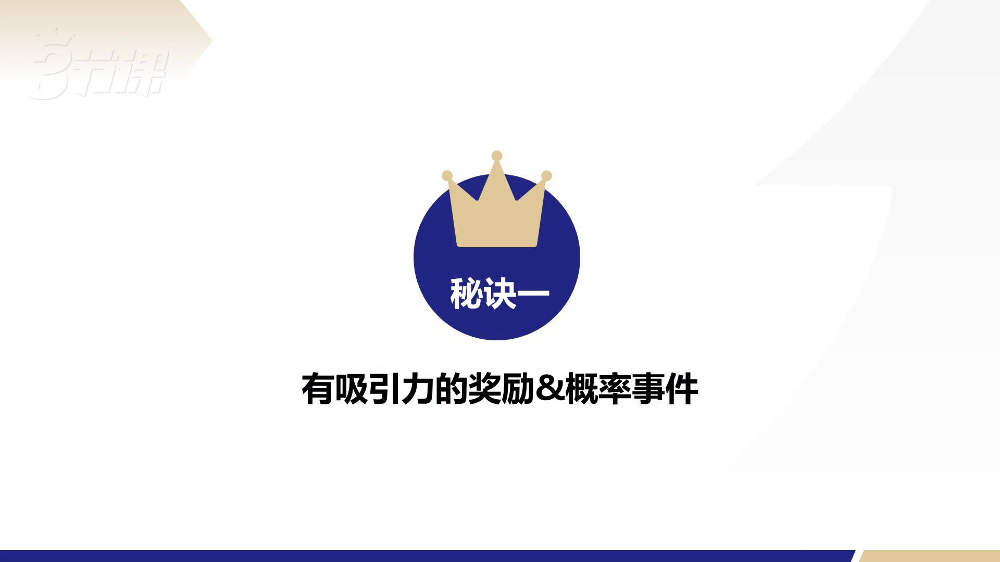

　　好，接下来我们继续看案例。我们的第二个案例是我自己亲自经历过的一个真实的事情。那这个事情，发生在2012年，2012年，我自己第一次创业？那时候，可能就做了一个技能交易平台，就是邀请一些人到平台上来分享他们的技能，然后就卖出去，就能收费。但是你要知道，各位那时候也没有什么知识付费，也没有什么o to o？所以那时候做这件事儿其实还是非常早的。

　　那时候我就经历了一件这样的事儿。因为你看我们肯定要去BD很多的老师到我们这个网站上，到我们平台上来去开课，？有一天我就很开心的找到了一个老师，我觉得在老师身上特别有点，这哥们儿他当时是一个五百强公司的销售总监，他的经历也很传奇，可能听起来跟我稍微有一点像，也是那种说似乎高中就辍学了。后来在街边什么摆过摊路边可能卖过什么羊肉串，然后机缘巧合之下进了IBM，再后来在500强公司里面一路做到了中国区的销售总监。他当时愿意出来讲一堂销售课，？于是我们就跟他讲，就跟他达成了一个合作，然后就说你来开一堂销售课。在销售课的话，我们最早它的命名是这样的，叫做500强销售总监的独门销售秘籍。然后这堂课开了之后，我们就开始去推广，就开始去各个地方卖。

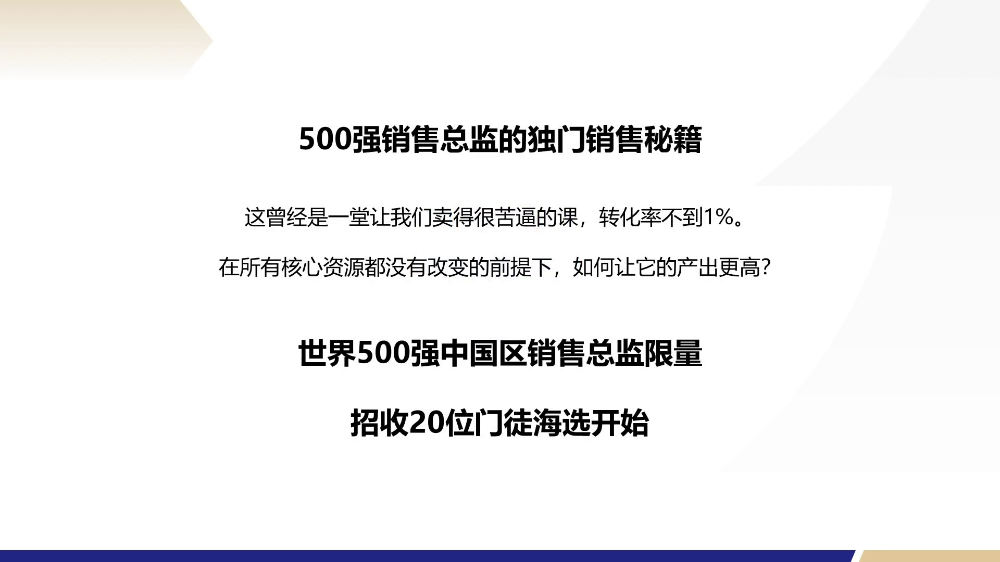

　　结果就没想到这门原本我们觉得说会很有点的一门课，它推起来非常的痛苦，效果非常的差。我们当时应该是在线上的多个渠道，？像当时到什么微博，当时一些其他社会化媒体上找了很多的渠道做付费推广，推了十几个渠道。结果发现这门课让我卖的非常的苦逼，转化率就不到1%，这是一个非常低的一个这种转化率了。所以当时这个项目也一度让我们内部觉得非常的沮丧。

　　但是沮丧过后我们就坐在一起来复盘，然后我自己就认真的思考了一个问题，说这课他到底是否一个好课？这老师到底是否一个好老师呢？我们认真思考一下，我自己发自内心觉得说那些老师一定还是个好老师。他还是有点的有经历的，也有货的？这课应该也还是一个好课的。所以如果说你看课本身也是好课，老师也是好老师，再加上当时其实我卖的也不算特别贵，我们一个人也就收个可能不到1000块钱的样子，其实不算是一个特别贵的价格的？所以我们就觉得说你看课是好课，老师好，老师价格不算特别贵，那产品的基本面是好的。所以如果产品基本面是好的，这课卖的不好，那大概率是我们的工作有些地方没有做好，没有做到位。

　　所以后来我就在思考一件事儿，我们所有的核心资源如果都不变，就老师也不变，课也不变，？那这些东西都不变情况下，我们到底怎么能让它的产出能变得更高，就思考这么一件事情。最后在这门课程上，其实我们所有东西就真的一点都没有变，渠道也没变，课也没变，甚至定价也没有变。我们只是换了一个卖法，就换了一个卖法，就让这门课它的整个的产出就翻了可能十几倍还不止。那我们做了什么呢？其实我们就做了一件事儿，我就把当时我们调整完之后，这门课程售卖的那个标题分享给你，知道我们做了什么了。

　　各位请看啊，我们调整完之后，这门课程售卖标题变成了世界五百强中国区销售总监限量招收20位门徒，海选开始？你看前边的这个逻辑可能是说你看我这一门课我要给你去卖给到用户，是这样一种感觉，对不对？后边我给到用户的预期是说，我有一个特别牛逼的人，他要来招收20位门徒。那这件事儿你得来申请，我们要海选，你要资质不过关，没有入我们的法眼。对不起，你没有这个机会的。各位，你要知道我们其他所有东西都没变，只是把这个卖法，把这个招募的方式就稍稍的换了这么一项。来报名的人一下子就趋之若鹜，我们的转化率从之前的不到1%，一下子提升到了将近10%的样子。你看这是一个多么巨大的提升。

　　好了，所以借这个案例我想跟你总结我们的秘诀二。秘诀二是什么呢？叫做稀缺感。

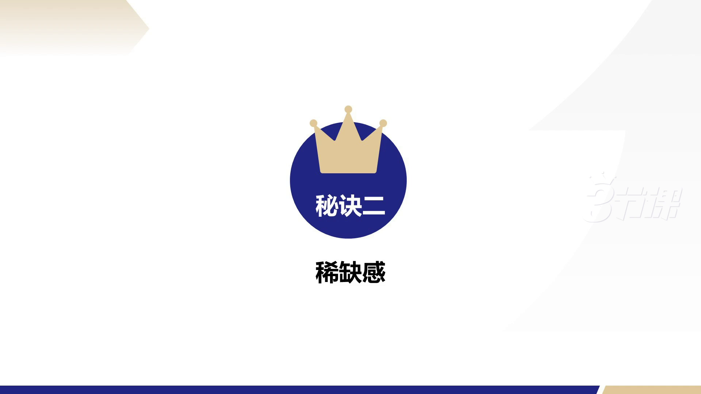

　　很多时候当你手中在卖一个东西，你发现推起来似乎有点费劲。但是你自问这个东西其实确实是个好东西的时候，也许这是然后你可以给他增加一些稀缺感，让用户感受到这个东西他是得来抢的，他是得来争取的？那这时候也许能让你的很多工作一下子就柳暗花明，变得更加的简。

　　简单，变得更加的极致。包括很多时候你在刚上线一个新产品，或者上线一个新课程。你觉得似乎在新产品新课程的售卖你相对不那么有谱的时候，你也同样可以用这种限额限量招募的方式？来去推动他的第一次售卖。或许能让你新产品的启动变得更加的简单，这是我们要分享的秘诀之二。

　　好，我们接下来继续来看案例。下边这个案例是我们在2015年的时候做过的一个活动。当时我在一家互联网招聘网站叫周伯通招，在这家公司负责整个的运营工作。在当年夏天的时候，我们就做了一个613互联网合伙人招募节。

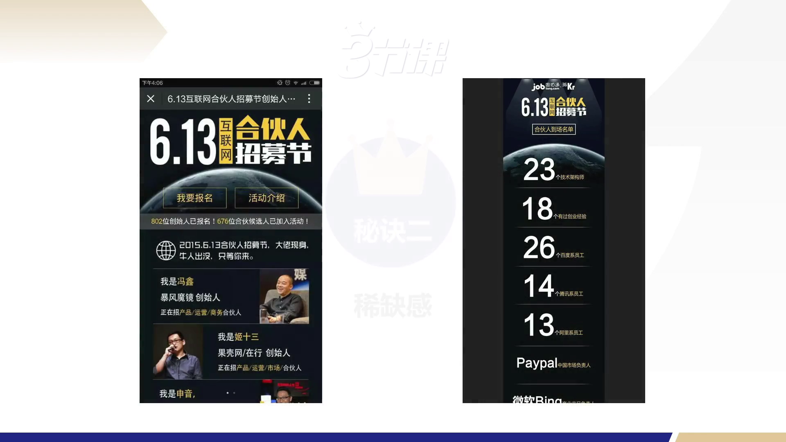

　　因为各位你要知道，15年那时候还是互联网创业的非常高峰的这个节点的那时候有无数的创业公司？都是说，我飞黄腾达，我上市就缺一个什么技术合伙人，就缺一个产品经理了，？拿钱肯定非常好拿，无数的创业公司在招人上可能都非常范畴。所以我们当时就做了一个合伙人招募节。这个招募节我们就邀请了很多的行业里面的大佬，包括当时可能很多A股上市公司的老大，都来到了现场。

　　但是各位你要知道，其实整个这个活动从决定做到最后完成，我们其实只有短短三周的时间。而我自己的团队，包括我自己在内，一共只有不到三个人的样子，就两个半人，还有半个人可能是说能抽一点时间来支持我们。最后这个活动在不到三周的时间里边，我们实现了线上传播30万次。加上可能有1800多个公司的CEO和合伙人都要亲自来报名参加，？包括我们当时到场的人里边，你看右边的这个整个的到场的名单，我们线下其实最后是办了一个一百多人的一个活动。其中就是创业者CEO可能大概有个50人左右，剩下的可能有七八十个？

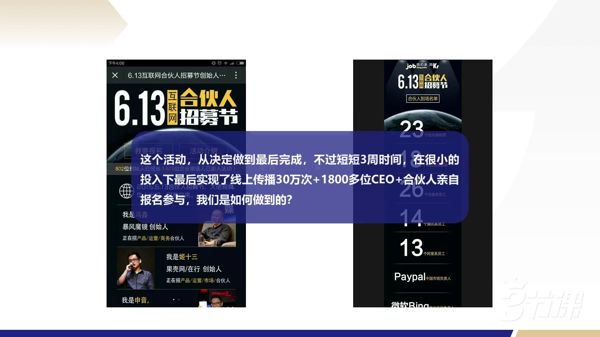

　　想加入创业公司的合伙人。在这些合伙人里边，你看右边的名单，23个技术架构师。你知道在2015年的时候，技术架构师其实是非常值钱的？有18个有个创业经验，其中26个也是百度系的员工，14个腾讯系的员工，13个阿里系的员工。有paypal中国区的这个市场负责人，有微软必应的这种商业产品的负责人等等等等。这个名单看起来是非常豪华的这只不过是在短短三周时间里边我们做到的事情。所以各位我们到底怎么做到的呢？

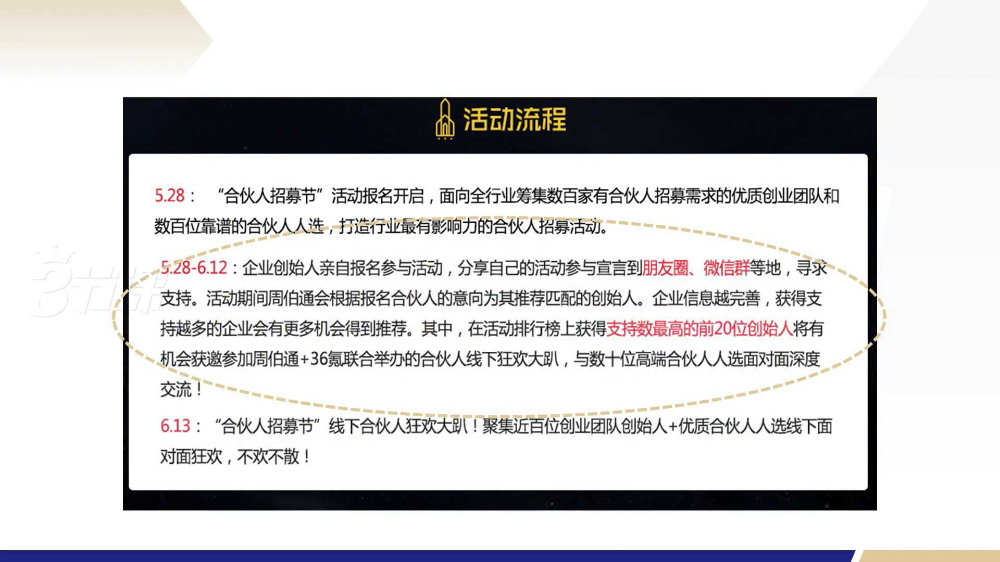

　　其实这里边也有一个关键，我给大家看一下我们当时的一个活动规则。其实我们当时活动规则里面，有一个重要的事情，叫做说一部分的企业的创始人和C你要报名这个活动，那你得亲自填写表单来参加。而且要分享我们的一个H5，分享你参与宣言到朋友圈、微信群寻求支持。简单说就寻求可能你的员工们或的朋友们来给你点赞然后呢，如果你点赞数量排名越高，我们还做了一个排行榜？排名越高越有机会获得我们在线上为你推荐匹配的一些这种合伙人。最后在排行榜上获得支持数最高的前20位创始人。那会获得我们最后在6月13号举办的这场合伙人线下面基大会的参与资格。

　　因为当时我们这场线下的活动，他可能有大部分的这种创始人。CEO是我们定向邀请的。定向邀请都是行业里边特别知名的这些公司们的大佬。有当时行业里边反正最棒的这种游戏公司的这种创始人和CEO？也有说当时行里边反正就是最牛逼的这种VR公司，它的一个这种CEO和创始人等等，反正就有很多这种行业的大佬。所以只有你在排行榜上排名进了前20，你才能来参加。好了，那就这一个规则，各位就带动了我们整个活动的火爆，你知道吗？

　　因为当时这些CEO们对于所有的这些合伙人真的是求贤若渴，再加上当时也真的是创业的特别的这种高峰期和高潮期。所以真的有很多CEO他们报完这个活动之后，就真的是每天要发到他们的员工群发到他们的什么家属群里边，？让很多人来给他们点赞，来给他们去排位，我印象特别深刻。

　　当时应该有一个公司的CEO，他应该自己是一个富二代，自己可能家里边有几个工厂，？他后来就做到一种什么程度呢？他就在他们那个工厂的群里边就发了一个言？就说你看我们工厂里面有几千号员工，大家从今天开始，每天得来这个H5上边来给我点赞，保证我的排名进前三。一旦你没有完成每天点赞任务，那就要受到处罚。所以他就把这件事儿变成了一个行政命令。最后这哥们儿就真的在整个排行榜上排进了前三，他就来线下参与了我们的活动。而且这件事儿还不止如此，？

　　我们还发现有很多的这种创始人和CEO1旦有了一个排行榜之后，他们就开始明争暗斗了。你理解吧？就是我们总会发现说在这个榜单上，你看有两家公司，他们在同一个行业里边本来还是竞争对手，？那今天可能A公司就往前票数往前赶了一步，明天B公司就非得抄上来，那后天A公司又要抄上去，就发现这两家公司他就较上劲了。

　　但凡有个什么竞争榜、排行榜之类的，很多时候人性总是在内心里边会天天有这种竞争和比拼的这样的一个这种潜在的诉求的，对不对？所以就在这样一个小小的机制的驱动下，我们就以极低的预算，极低的这从人力极少的成本来带动了整个活动，获得了非常巨大非常显著的一个成功。所以那就借这个活动，我们想给大家总结一下我们的秘诀之三。那秘诀三是什么呢？叫做你要调动用户竞争和攀比的这样的一个这种心理。竞争和攀比会成为用户可能去参与你的一些活动，或者他要完成某些行动，完成某些进一步的动作背后的一个核心的动机，核心的一个利益诉求点。

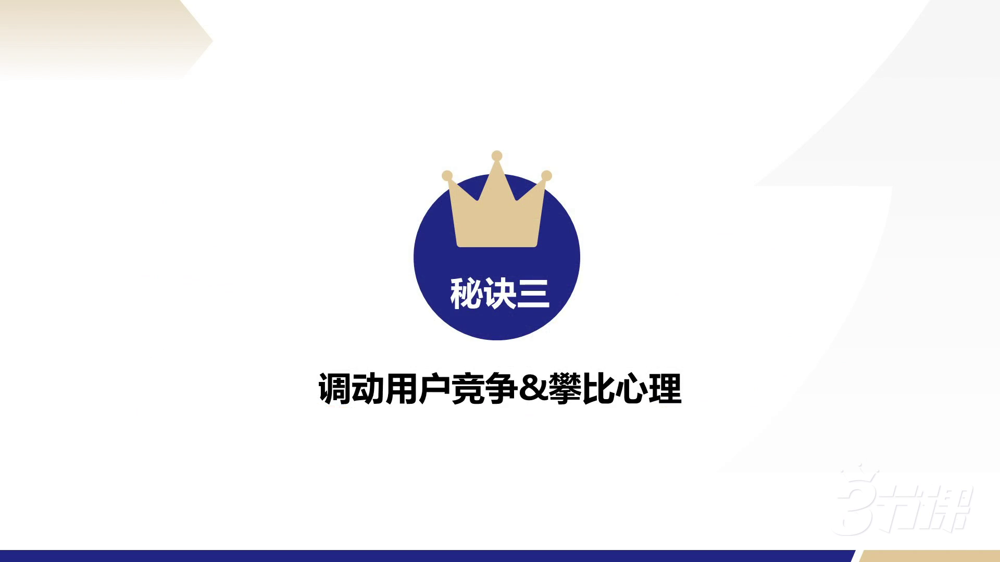

　　好，我们接下来继续再看案例。下面我们看到这个案例，可能有的人也会比较熟悉了。这是我们在2016年的时候，2016年的愚人节的时候，？

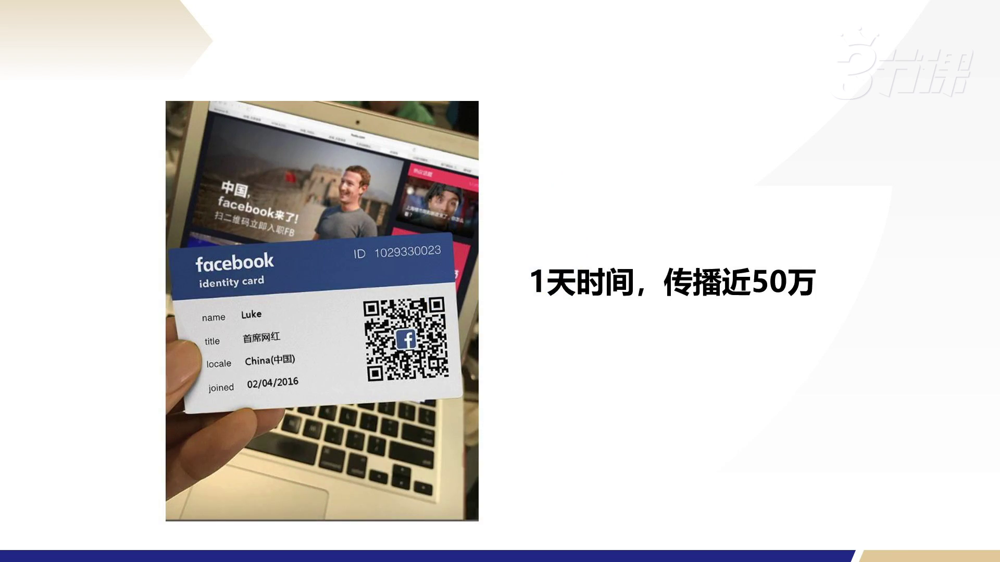

　　我们做的一个很经典的案例叫做疫苗入职facebook。当时就在国内，本来就在传言说facebook可能怎么着要入华了，又正好赶上愚人节这么一个时间节点。于是我们就做了这么一个小的H5，它非常之简单，就你扫描这个二维码，然后就有一个小的表单，可以填说你在facebook？你要担任什么样的这个岗位，你的姓名是什么？然后接下来一键可能就生成你的名片，那生成完之后大概就这么一张图图上大概就是你拿这个名片？然后你是谁啊？你的title是什么？你的什么入职日期可能大概是什么时间之类的那就这么一个小的H5，在2016年当天的时候，一天时间传播量接近50万。然后给当时我们的公众号哈拉新可能直接就有个小几万的粉丝的样子，这是这么一个很经典的例子。

　　但其实这个例子再往前推，还有一个也类似的一个例子，它取得的成功可能更大？那这个例子就是在2015年，也是4月1号，也是愚人节的时候。当时也是我们在这个周五中招聘，我们就做了一个也是很类似的一个小H5，叫做什么呢？叫做一秒带你敲钟上市，也非常简单？就是你可能点进来求的页面里面去，也是可能就有几个资料你可以填一下，就是你公司的名字，以及说这个你是谁。然后那接下来就是点一个按钮，就告诉你说一键马上敲钟上市。然后就生成一个页面，就告诉你说某某公司已经成功在纳斯达克上市了，市值达到了多少亿，？就生成这么一个这种小的H5发在朋友圈里边，大概就长这样？

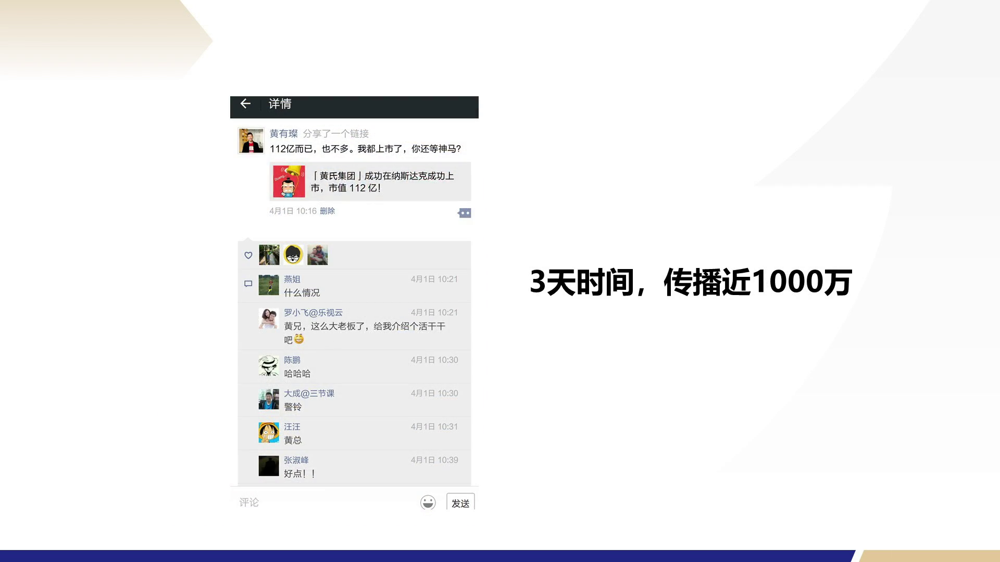

　　很多人在当年愚人节的时候，就纷纷生成了自己这个小H5发到朋友圈，跟自己的朋友们就完成一个很有趣的这么一个互动，？你看当时我发在朋友圈的这个文案大概这么写的，说你看112亿而已，也不多，我都上市了你还等什么呢？正赶上当时又是这种创业的高峰期，所以这个H5就也变得非常的火。这样一个小游戏，你知道他当时的传播量达到了一个什么样的量级吗？我告诉你，他当时在三天左右的时间里边传播接近了1000万，这是一个非常可观的数字。而我们投入的所有的资源成本，也就是投入了可能一个研发的同学。大概一天半不到的时间，我们就获得了超过1000万的整个的一个品牌的曝光。对我们来讲是非常性价比高的。

　　好了，这两个案例背后我们就想象你去总结我们的秘诀之四了。你想调动用户参与，调动用户的互动，？那秘诀之四是什么呢？那就叫做你要调动用户炫耀和猎奇的一个心理。

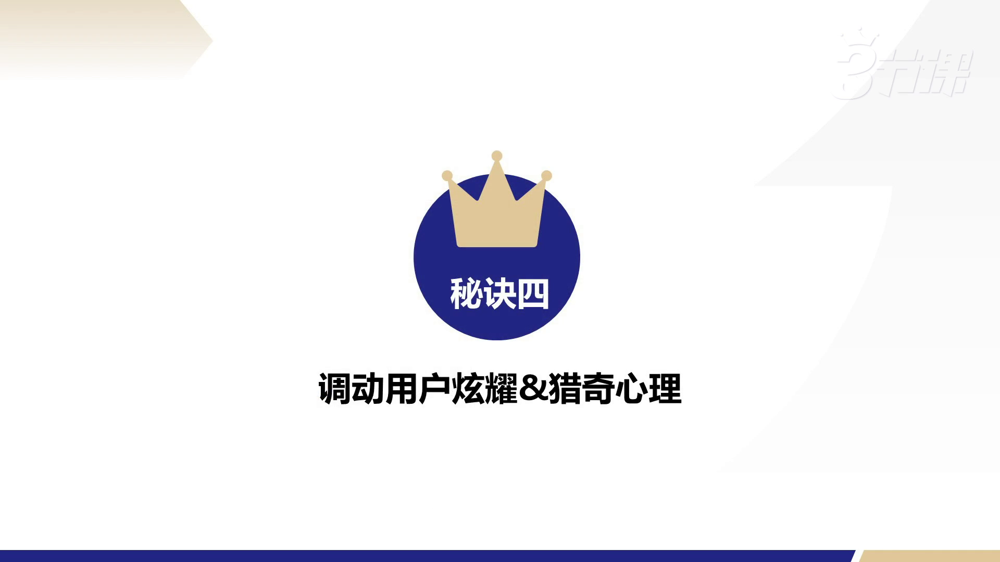

　　你回想一下刚才的这两个小H5游戏？它的背后对于参与者来讲都是一种炫耀的心理。你看就是我入职facebook了，我可能又怎么着，就是我的公司敲钟上市了，？发在朋友圈这事儿，他是能装逼的，说不好听一点就能让我炫耀的，对不对？那对于其他看到的人，他会觉得说这事儿会让他感到好奇，说我靠这哥们儿昨天他不是还跟我在一起吃饭吗？今天就告诉我说什么公司上市了，或者今天就告诉我说去facebook了，？那我会感到好奇说我要点点进去之后，我就发现这是这么一个东西。那接下来就回归到我也要炫耀，所以很多时候调动起来用户的炫耀和列这些的心理会是一种非常重要的手段。

## 4.2 9大秘诀+3种用户互动活跃神器（下）

　　2025年08月22日 18:45

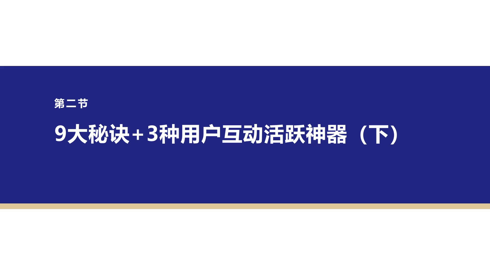

　　我们再接着往下再看案例，下边我们要看这个案例，就是一个非常经典的一个运营案例了。这个案例发生在2016年的3月29号，当天就发生了一件还挺不可思议的事情。在中国足球界，就是中国国家男子足球队在出线概率原本已经非常小，几乎没有人看好的情况下，最终居然战胜了卡塔尔足球队，就从这个亚洲区的预选赛出现了，进入了十二强赛，？这是所有人都没有想到的。所以当天晚上几乎整个中国的全国的球迷都觉得兴奋极了，都疯狂了？所以这个案例就是懂球帝APP在3月29号那天晚上以及到第二天的样子，他做出了一个非常经典的一个这种运动案例。

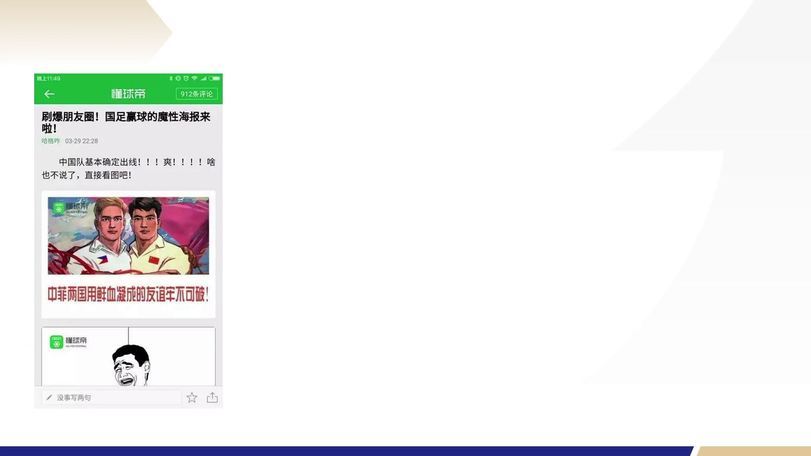

　　当天晚上，中国队应该是在十点钟多一点的时候就结束了自己的比赛的。而且在结束自己的比赛的同时，另外一场相关的比赛，就是菲律宾确保了自己不输，从而就保证了说中国队在当时十点多的时候就已经能够确定基本出现了。所以当时十点半左右的时候，懂球帝就开始推送了这么一条消息，叫做国足吟秋的魔性海报来了。大家可以看一下，这里面全是一些主图，什么中菲两国用鲜血凝成的友谊牢不可破，？什么东风吹战鼓擂，中国球迷怕过谁，头可断血可流，中国足球不低头，全是那种非常鼓舞人心的，这样的一些这种内容，这样的一些海报，？

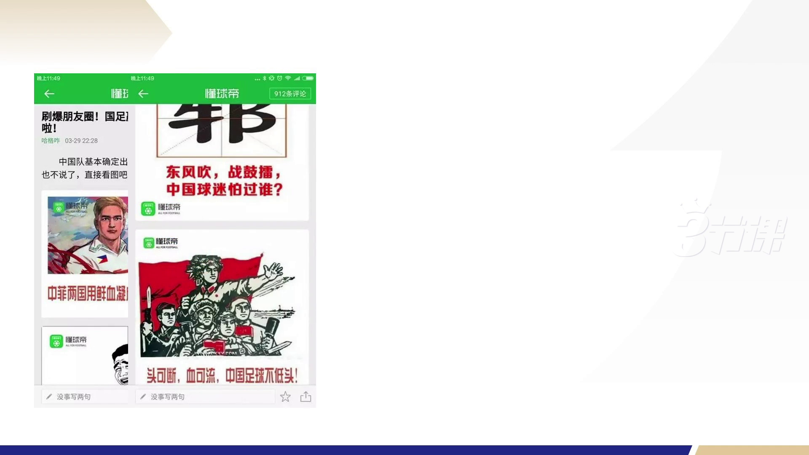

　　这是可能晚上十点半左右发的第一件事儿。接下来在十点半多了一点点的时间，整个懂球帝站内他的首页就调成了这样的一个这种视觉的一个呈现。就是他首页所有的新闻头图都改成了这样的样子。中国队牛牛牛牛？就也是就非常调动这个用户的情绪。所以当时那天晚上所有的人，所有的中国球迷打开懂球的手，一定也都会被这样的一个氛围所去感染到的对那再往后的话，又过了不到5分钟的样子。那懂球帝它整个APP的这个推送的开屏的这个页面，它也就换成了一个说中国国家队主教练高洪波的这么一个这种样子，这么一个卡通的一个画像。

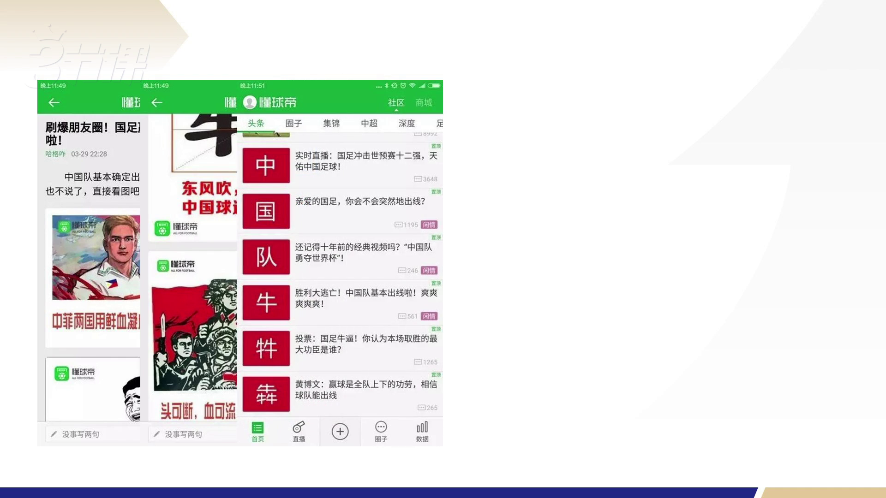

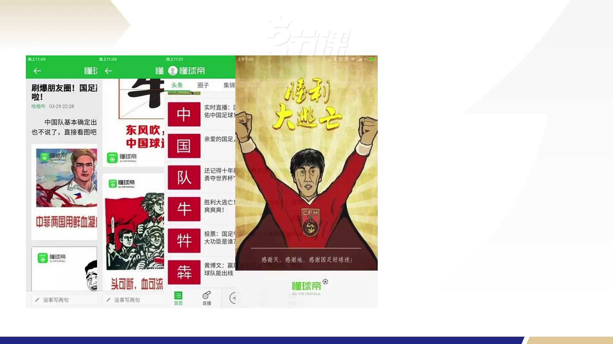

　　大家可能有人不知道当时的背景，当时背景其实是高洪波执导。作为中国国家队的主教练，他在此前两年里边，他的经历其实非常坎坷起伏的。而且当时他是在前一个外教，就把中国队的战绩带的，已经让人觉得非常绝望了，？已经让人觉得完全看不到希望了。那个外教可能就下课了，就辞职了。

　　当时是没有人愿意接手中国队的，高洪波主动站出来。高洪波是唯一愿意接手中国队的人，他就站出来说，那这件事儿没有人带我来带，没有人愿意来这个风险很高，可能会被骂的这个位置上，那就我来。所以他是承担了很大的压力，承担了很大的风险，？从非常低的低谷中走出来说，我到这个位置上，我来试着来解这道题。最后的话他就给了所有中国的球迷一个惊喜，带着国足就出现了，所以当时就是懂球帝把他的开屏页改成这么一个页面对所有的中国球迷，对所有知晓这个背景中国球迷来讲，也是会觉得说还有点感动的，还非常的感动的。你看上边写着胜利大逃亡，下边写着感谢天感谢地感谢国足好球迷。

　　那么再往后，到可能将近12点左右的样子，？终于另外其他比赛的结果都出来了。国足正式宣布说时隔15年重新回到世预赛亚洲区决赛的这么一个阶段，进入到12强赛。这之前已经一二年国足都没有参加过世预赛最后阶段的这种比赛了。所以这个时候董球帝第一时间就推送了相关的新闻，也让大家就非常的振奋了一下。

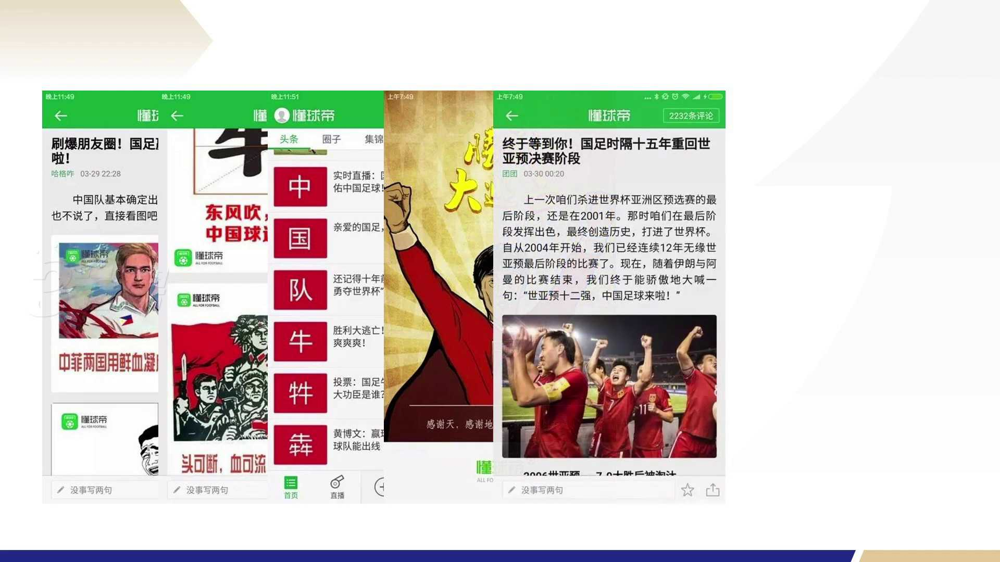

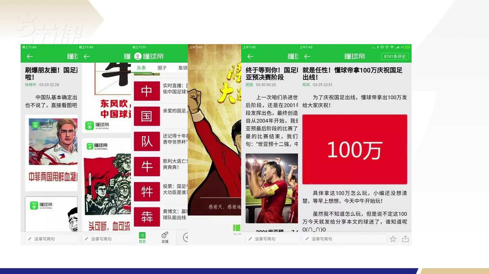

　　再往后，董球帝这一系列打法还没有完，在当天晚上临近12点的时候，懂球帝发了这么一条新闻，说就是任性。董球帝决定要拿出100万来庆祝国足出现，这一下子就完全把很多球迷的热情就完全调动起来了。而且当时你看他发布这个内容，还是一种非常任性的口吻的说具体这100万怎么玩，小编还没想清楚。早上想想，第二天中午我们再开始玩，？所以就大概这么一个比较随性的一个态度。所以当天晚上看到这条消息的所有的球迷，在懂球帝站内看到这条消息，所有的球迷都被懂球帝的这样的一个氛围所感染，也都被懂球帝在站内这样的一些精细化的运营可能所打动动。所以你会发现整个这一条就懂球帝做活动的这条内容，他转发和参与的人真的是非常多的。你可以看到就这一条活动的相关的消息，站内的消息，分享的人数，这是往站外分享的人数超过了可能三万多人这些一个非常可观的一个数字了。

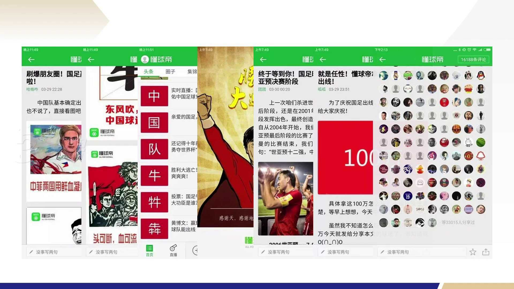

　　当天晚上懂球帝其实因为他做的这一系列的运营的活动，他整个的APP的服务器其实都崩了个好几次。所以这场活动是非常经典，做的非常出彩的这么一个这种活动。所以我们借由这场特别成功的一个运营活动，我们要给大家分享我们日常运营中要调动用户的互动和参与动机。那秘诀之舞是什么呢？其实就是我们一再说的，我们要去戳中和营造面向用户的一些强烈的情绪。刚才的这个案例就是如此，面向用户完美的去戳中，也完美的营造出来一种非常强烈，非常浓烈的一种情绪。让所有的球迷都觉得说我身处一种狂欢的感觉之中，？所以这是我们的秘诀之舞。

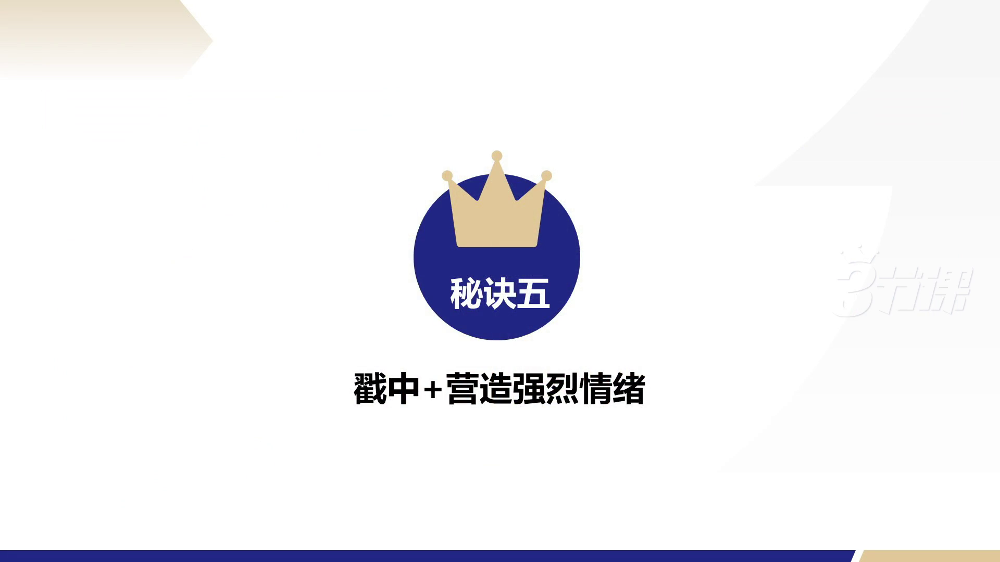

　　好，我们继续往后来看例子，往后这个例子就比较容易理解了，？你看这是我曾经收到过的一个活动，它的一个邀请函。我相可能有很多人也曾经看到过或者见过这样的一个邀请函。这个邀请函，你看他会告诉你说，我们要在国家会议中心开一个什么什么发布会，？那专门诚邀就是你亲自可能过来去参加，把你名字还大大的打在上面，代表说，你是我们尊贵的一个这种贵宾。

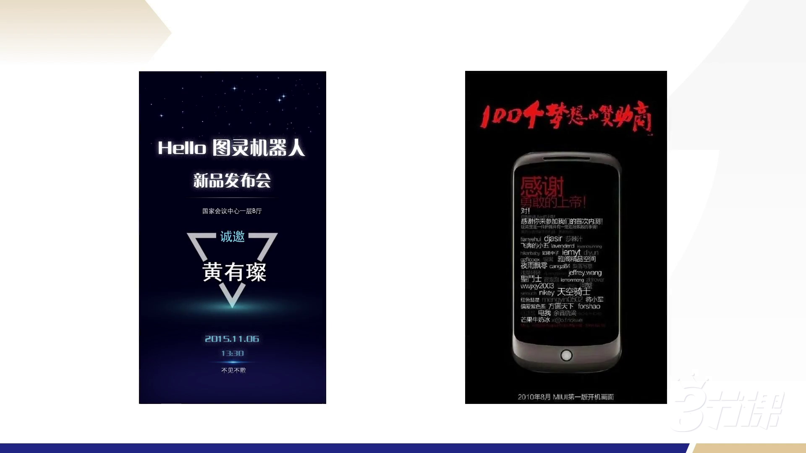

　　当你收到这样一个邀请函，你会感觉说自己被重视了，因为你自己被重视，加上可能这个会议这个活动可能还有点逼格，？你看又是什么机器人，又是什么国家会议中心。所以我把它分享到我的朋友圈，或者我把它分享到其他的地方，那我不跌份儿，反而我也觉得说自己还与有荣焉，可能会是这样的感觉？所以这是一个海报。

　　同样类似的还有我们前面提到过的小米的100个梦想的赞助商，就像我们提到的一样，当时这100个早期米粉，真的是因为小米这个举动感动的就不行不行的，感动的就不要不要的。小米居然把他们的名字放到了米Y第一版开机开屏的画面上，还有搬到了整个小米的发布会上，？所以这些用户就真的是被感动到了。所以在这两个case背后，就要跟大家分享我们的秘诀之六。

　　我们的秘诀之六就一目了然，非常的简单。它是什么呢？就叫做我们要给予我们的用户尊崇感和这种被重视的感觉。当用户感受到专属于他的尊崇感和被重视感的时候，他一定是会更愿意跟你来互动，更愿意帮助你来去做一些事儿的。所以这是我们的秘诀之六。

　　好，我们接下来再继续来看案例，下边这个案例是我们经常在电商购物的时候会遇到的可能一类情形了。你看这是假设我在逛天猫的时候，我要买一个相关的一个数据线，？我们就看到你看这个数据线可能28块钱一个，我们就在这逛。那在逛的时候，你可能就会在他天猫、淘宝的详情页上，也许你会刷到这样的信息。会看到哇塞这里边还有个套餐，真的是太值了。

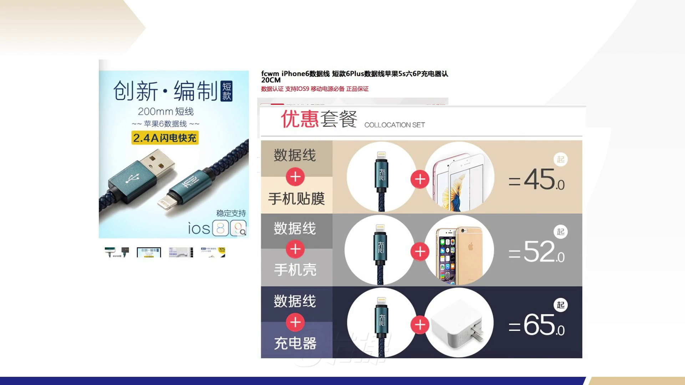

　　原本我买一个数据线就要28，现在一个数据线加上一个手机贴膜或者一个高端的手机壳在一起，？只要四十多五十多的样子。你要知道平常一个这种什么钢化的手机贴膜，单独卖的话，有可能也得个二十多小30的样子，？所以这俩东西放在一块儿，我就觉得它非常的超值。

　　因为我感受这种超值感，那我会做什么呢？我可能就会一下子决定就买一个套餐了，？我就被这个信息潜移默化的被引领了。

　　那是什么引领了我这时候的行为呢？很简单，就是我们要跟大家分享的秘诀。七这时候你要给予用户，让他感觉到自己占便宜了。用户会因为这种我似乎占到了便宜的心理，而决定说我可能要多买一点，或者我要多干点事儿，？好，那我们再往下接着看，我们来看我们的秘诀之八。

　　秘诀之八背后，我们先来看一个特别奇葩的活动。这个活动不夸张的讲，可能是我有史以来看过我觉得最让我觉得无语的一个活动了。这个活动是我有一次在一个朋友圈，看到我有个朋友他发的一个活动。这朋友他当时做了一个项目，是可能就帮别人，可能就上门搬家的，这么一个o to o的一个服务？他们的工号就叫做你搬，他们就做了一个活动，然后大概的意思就是说这个活动也是请大家就转发可能这篇文章，可能就是帮他们可能拉拉粉，大概是这么一个诉求。但是当我点进去看到他这个活动的整个文案的时候，我觉得我崩溃了。

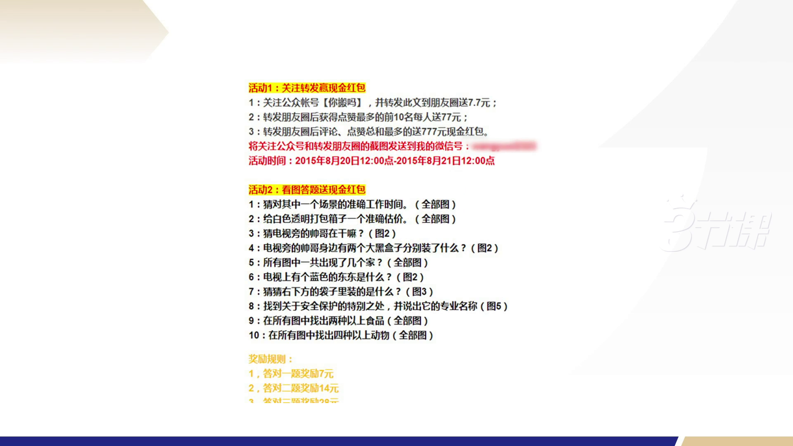

　　为什么崩溃了？各位你看一下他现在整个屏幕上所呈现出来的这个活动的规则。你能搞清楚这个活动是要你干啥，？你看首先他让你关注公号，你班吗？转发此文到朋友圈，送什么7.7块，然后转发朋友圈之后要什么获得点赞最多的再送多少钱。我不仅要关注要转发，我还要把关注转发之后的截图发到可能一个人的这个微信号，然后还有一个特定的活动的时间，？我微信号可能还要我手动去记录下来，手动复制一下，再跳出这个屏幕，再去可能完成一个添加。

　　除此之外哈那下边居然还有个活动2，活动二可能是说他这个推文里头有一些截图让你去猜，看图答题。那么猜对其中一个场景的准确工作时间，然后能获得一些奖励。答对一题得多少奖励，然后答对两题得多少奖之类的？

　　各位你看到这个活动什么感觉？我看到的活动我觉得我真的是头大我完全不知道这活动我要做什么。而且这个活动一看起来，我就觉得说参与实在是太复杂了，我都不知道该从哪去参与起。请问我现在是先要转发，还是我先要去看图答题呢？还是我要先加个微信呢？我也搞不明白？

　　所以这时候当你脑海中出现这么一团乱麻的一个感受时候，那你会怎么办呢？很简单，你会关掉这篇推文，你会放弃这个活动然后走掉，这是一个很自然的一个反应。所以各位我想跟你说，我们很多时候在做运营活动的时候，都会不自觉的去犯一个错误，是什么呢？就我们会把一个活动的参与成本、参与方式搞得特别的复杂，这种复杂让用户看到就不想参加了。不仅如此，我们还可能会犯一个什么错误呢？

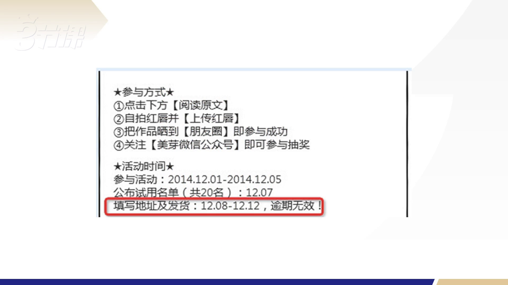

　　好，我们再来看另外一个例子哈那这个例子又是另外一个公众号它的一个例子了。他当时可能就是说是一个美妆的一个公众号，就让大家说点击下方阅读原文，我们参加一个什么烈焰红唇的这一个比赛？你可能自拍一下，拍下您红唇上传，然后晒到朋友圈，然后就可以来去参与抽奖，？然后这个活动看起来还是看得懂的，是没问题的，比上个活动好一点。但是你要知道这个活动他在工号里边去发布信息的时候，他也犯了一个错误，犯了一个什么错误呢？你看他在活动里边写了参与方式，下边就写什么活动时间，然后什么公布试用名单，还有什么填写地址及发货，还告你说逾期无效，？

　　各位我告诉你这个填写地址及发货这件事儿，在这儿完全是一个多余和不必要的信息。为什么？因为你此刻在你的公众号的下方，你要做的只让用户快速点击按钮，先去参加你的活动，先去完成说上传他的什么自拍照，然后参与这个活动，对不对？至于说后边他是否要填写地址，要发货之类的，你等他把他的这个自拍发完了，你再在后边的页面上再去告诉他。这不好吗？为什么要在这儿就告诉这样的信息呢？各位如果你在这儿就告诉我说什么填写地址及发货，那我作为用户我会怎么想呢？我可能不自觉就会想说，在哪填写地址，什么时候发货，吧？

　　把我的思考，把我的关注点带偏了，理解吧？我也会因为这种带偏，可能我就绕了半天，或者我找了半天，我发现似乎我找不到这个地址，找不到什么发货的入口在哪里，我就放弃参加这个活动了，理解吗？各位？

　　所以上边这两个案例，看起来是两个负面案例。但实际上在我们自己工作中，我们也经常会犯这样的一个错误。所以借这两个负面案例，我就想给你总结，我们调动用户互动和参与的秘诀之八叫什么呢？

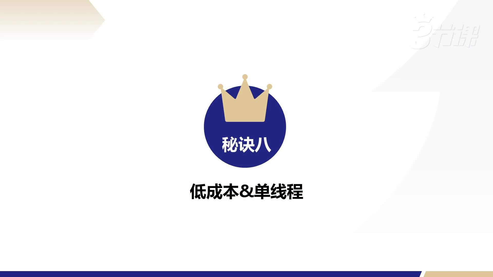

　　就叫做低成本和单线程的一个原则。那就是我们要在所有的活动中，在我们给予用户的所有的互动页面中，尽可能的让用户参与的成本要低。并且让用户尽可能是在单一一个县城下去工作，不要给他冗余的信息在一个页面下？如果有个信息我们能放到后边的流程里边再说，那我们就放到后面。千万不要在一个页面，尤其在初始页面下，就把所有的什么活动规则，后边你的注意事项，什么抽奖发货的原则全放上去。这样往往是增加了用户他的一个信息消化和信息复核的一个成本的。

　　好了，接下来我们来看我们的最后一个秘诀，还是一样，我们先看案例，这个案例是这样的特别有趣，这之前我们在三节课的时候运营过的一个全体同学群。这个群突然有一天，然后我自己就在这个微信的聊天界面里面看到这么一个消息，？突然上边闪现出来这么几个字，叫做你被陆壳厚移出群聊。陆可厚当时是三节课的C然后也是我的合伙人也是这个群的群主？突然你发现这个聊天群里边出现这么一个信息，你是否觉得很惊诧？你是会赶紧说我要点进这个群里边去看看说到底发生了什么。

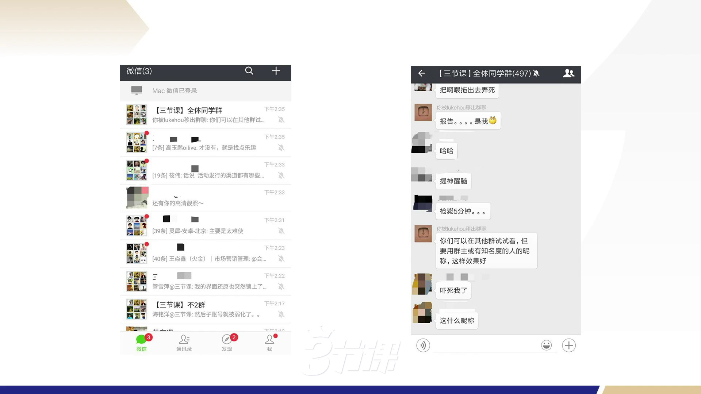

　　结果我们点进这个群里边，就发现说这是一个哥们儿，是我们的一个同学？他改了一下自己的群名，就做了一个有趣的一个这种小实验？他的意思就是说你看改这个昵称，改这个群名，可能会是一个活跃整个群的一个重要的一个手段。你看就是这个群里边一下子很多人就被炸醒了，？很多人都说这个提神醒脑，吓死我了等等，？所以这是一个非常有趣的一个这种小的一个例子。

　　就在群聊这个场景下，通过改我的群昵称给到了其他用户？一个意想不到的这一个刺激或意想不到的这么一个这种反差，这是一个小的case。除此之外，可能还有另外一类大家比较常见的case。就我们经常在微信公号里边会看到这样的一些逗逼搞笑的推文，？比如说国庆去哪里既小众又便宜，点进去一看里边两个字公司，或者是什么新款苹果刚刚发布，为什么我坚决不买？原因在此，点进去看一个字穷，？所以这样的内容往往它的打开率可能也会很高。

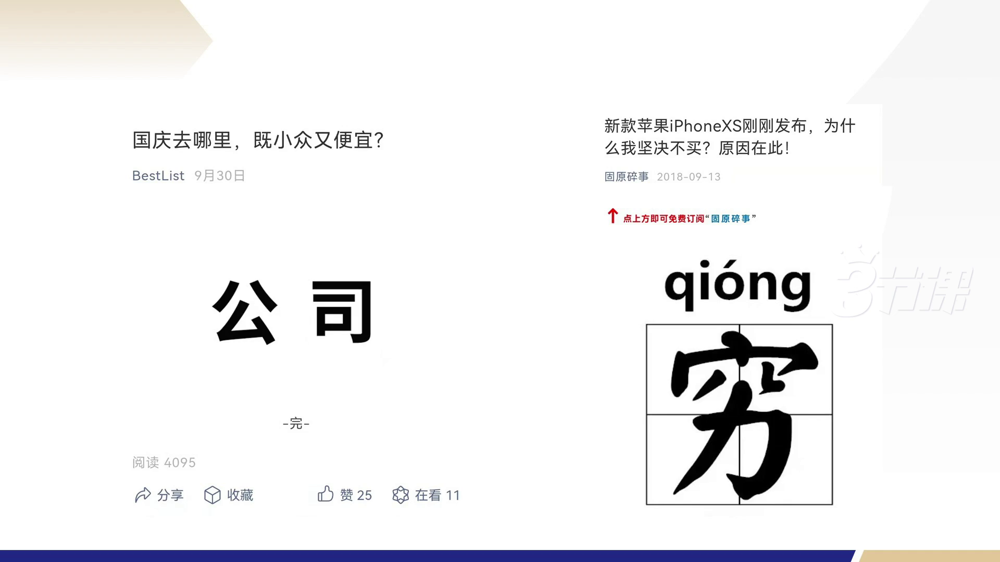

　　下边可能跟你留言，跟你糊弄的人可能还会挺多的？所以借此我们也想再总结一下哈那我们调动用户参与互动的秘诀之久是什么呢？那就是我们所说的创造趣味性的反差。用户在趣味性的反差面前，他一定会被你勾起来，自己的好奇心一定也会被你勾起来。就我跟你的一个这种互动的这么一个这种意愿，所以以上是我们的所有的九个秘诀。

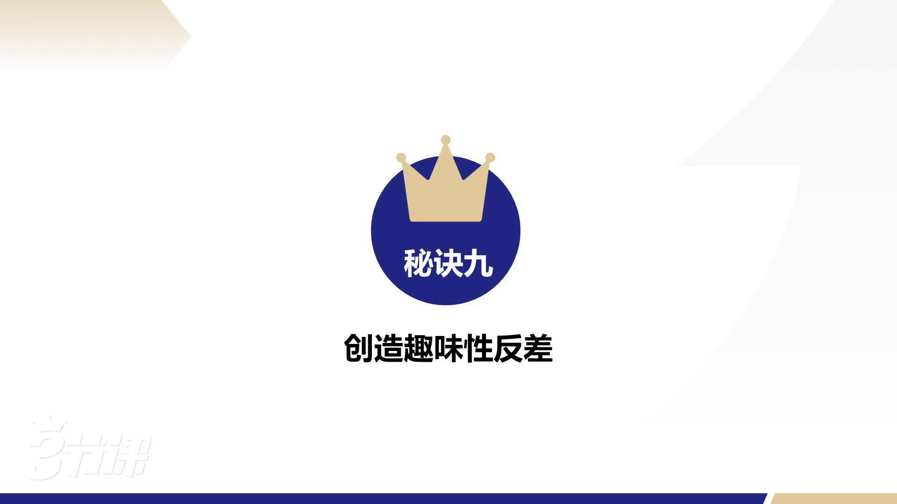

　　我们再把这九个秘诀放在同一张PPT上来去回顾和总结下。第一个有吸引力的奖励和概率事件，第二个创造稀缺感，第三个调动用户的竞争和攀比心理。第四调动用户的炫耀和猎奇心理。第五，戳中加营造强烈的情绪。第六，给予尊崇感和重视感。第七，让用户感到占便宜。第八，低成本和单线程的原则。第九趣味性的反差。

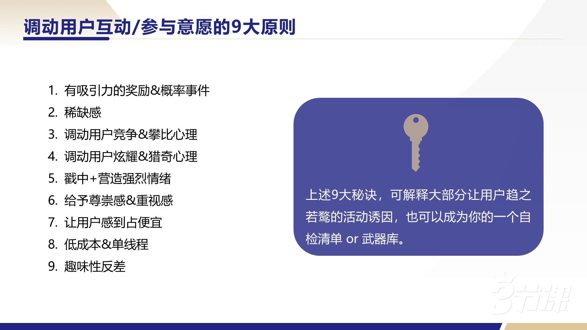

　　上面这九大秘诀，基本上可以解释大部分让用户趋之若鹜的一些活动的诱因，到底如何形成的那完全也可以成为你自己的一个做活动，做用户互动时候的质检清单和武器库。但凡你说我做一个活动，或者做一些其他的这种小的一个互动的运营，我发现说似乎我想不到怎么能让用户的参与动机能变得更强。基本上你可以回归到这九大原则，九大秘诀当中去看看说有哪个秘诀它是可以为你所用的，可以让你去借鉴一下？来调动起来用户的参与和互动的动机。

　　好，上面的九大秘诀讲完了之后，我们接下来在本节的最后再给大家讲一下三种运营工作人员手中的互动活跃的神器。什么意思？就我们经常可能要管社群，或者要做一些用户的互动，做一些用户的活跃，？那我们都希望说有更多的人愿意来跟我们一起玩，愿意来跟我们一起可能就是打交道，打成一片，对不对？这时候你手中总得有一些互动活跃的神器。这些神器从最常见的角度来说，就分成三类。第一类耿，第二类表情包，第三类叫做一些特定的互动机制。你把这三类神器用好的话，很多时候你都可以说自带用户活跃用户互动的一个基因，你走到哪儿那哪儿可能就会热闹起来。

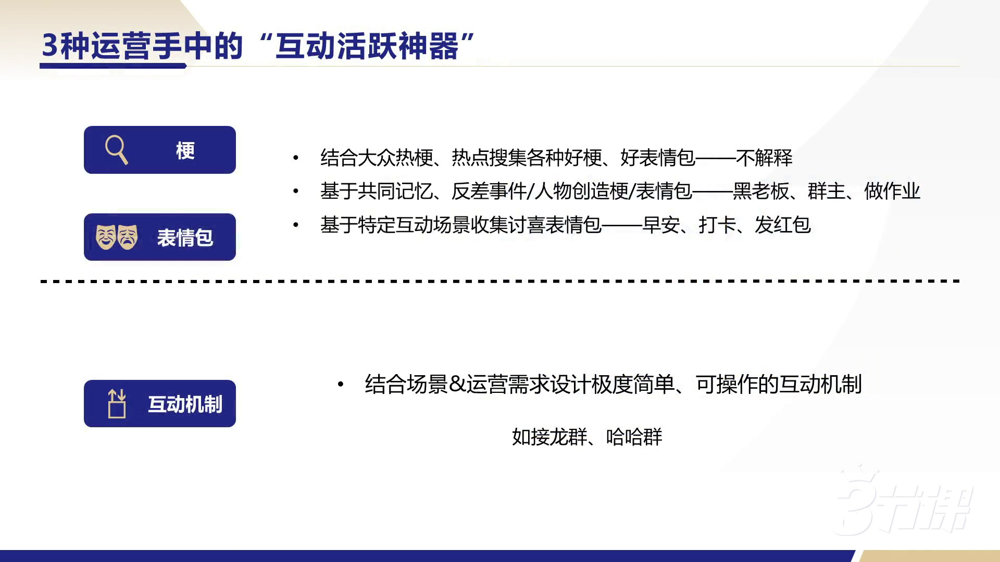

　　大概这样，我们再进一步展开来去说一下。首先在梗和表情包这个部分，你应该收集或者你应该去定向关注的一些梗和表情包包含一些什么呢？首先当然是一些大众热耿，？你根据一些目前正在热点的一些这种大众热梗，来去收集各种各样的好梗，好的表情包，把它放在你的整个武器库里边，你随时就拿出来？用户看到之后就会跟你也有互动的一些这种意愿，那在这一点上，很好的一件事儿就是在互联网上，每一年大众热梗都是不会断的，总有源源不断的这种热梗可能会冒出来，从最早的神马都是浮云，no作no带了常会玩了？再到我们前面分享过的什么人类高质量，男性耗子尾汁等等这些东西。每一年每个阶段都会有众多的心梗，众多新的这种好的表情包会出现。好，作为一个好的运营的话，你应该对这些网上的热点热梗要保持敏感，这件事儿就不多解释了。

　　所以这是第一个角度，在梗和表情包这里边你该去收集一些什么样的好耿好表情包。第二个角度就是你其实在一个社群或者在一个用户群体里边，你是可以基于共同记忆，基于一些反差的这种事件和人物来去自己来创造耿创造一些表情包的。典型。

　　可能在公司群里边你可以黑老板，或者在一个群里边你可以黑群，或者在有看学生这样的群里边，你可以基于说一个重要的大家的共同记忆做作业，或者是大家曾经一起做过一件什么样的事儿，或者是一起听过一个什么样的歌之类的。基于这样的一些重要的共同记忆，或者是整个这个群体里边一些重要的人物，你主动来去创造一些跟他可能有点反差的这样的梗，这样的表情包，一般也会特别有助于整个群体里边的氛围会起来。所以你会发现在我们的群里边可能我的那张什么作业交了吗？？作业完成了吗？那个表情包可能在很多场景下都是会被大家拿出来看来去做一些趣味的互动，做一些趣味的调侃的。所以这是造梗造表情包的第二种思路。

　　第三种思路的话，就一定是基于我们在群里边或在用户的这个群体里头一些特定的互动场景。我们来收集一些讨喜的表情包，典型的可能在一个社群里边哈那典型的一些互动场景包含了像早安打卡或者什么晚间的讨论，还有像发红包，？可以专门定向针对可能这几个事件，这几个互动场景收集一些比较好玩的表情包。那每天早上或者有人发红包的时候，当你把这个表情包可能去发出来，那这时候往往就能调动起来群里边一些很有趣的活跃，尤其你的表情包可能还比较有意思？典型像有个阶段比较流行的什么老年人专属的早安问候表情包，？可能在一段时间里面就会特别火，引发大家可能一堆的表情包的接龙，或者是一些这种斗图之类的。

　　好，再往下的话就是还有一些社群或者用户群体里边的互动机制，？那这一点上我想跟大家讲，你如果能够结合场景和你的运营需求，设计出来一些非常简单，极度简单，也非常可操作的这种互动机制的话。那一般也是能够迅速带动起来整个群里边大家的一些活月。

　　典型如果你是运营群的话，有两种群其实都是特别容易能够带火的。一种群叫做接龙群。比如什么红包接龙或者成语接龙？它的规则非常简单，就是你在群里面发个红包，那接下来抢到金额最大的那个人，他要另外再发一个可能等额的一个红包，？那这样的一个机制就是在整个群里边无限的循环下去，能让大家就玩的很嗨。

　　还有一类群叫做哈哈群，这类群也特别的有意思？就群里边只能发两种东西，一种就是有趣的笑话，另外一种就是哈哈哈。当你在群里边看到一个笑话你觉得还不错，那就请你发一个哈哈哈。群里边不能发其他的东西，？所以这样的群也让你觉得说会非常的轻松，没有什么压力，没有什么负担，他还能够很快的就能够玩起来，那同样相似的还有什么夸夸群之类的？那考虑到我们这门课程它肯定不是一个社群运营的课。那我们只是在说你在流量或者在用户互动这样的工作背后，你必须得有一些底层的更加基础、更加本质的一些洞察，才能帮助你在这一些工作上做的更好。所以在这一部分我们也就点到为止，暂时不多展开。

　　如果大家对像社群运营这样的一的工作，还有更深的学习需求，那欢迎去参加我们社区运营这个模块的相应的课程。好了，到此为止，我们这个模块第四节的课程也就差不多结束了。我们最后用一句话来去收尾这个第四节的内容。这句话是这样的，一个运营当其对于用户有了更深刻的理解洞察，脑海中又装填了更多的基本用户互动的原则和武器库之后，那它就必然能够自带流量和互动活跃的能力，从而他自身也将会更加的具有竞争力。我们希望你能够朝着这个方向，作为一个运营新人，朝着这个方向可以持续的去精进。好了，我们第四节的课程就给大家讲到这儿，希望大家有一些收获。

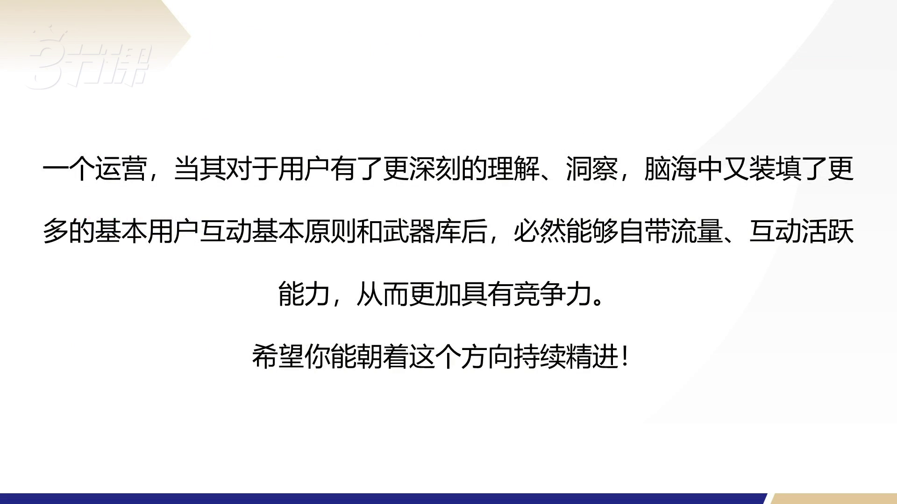

# 第五章 模块知识点回顾&串讲

　　2025年08月22日 18:45

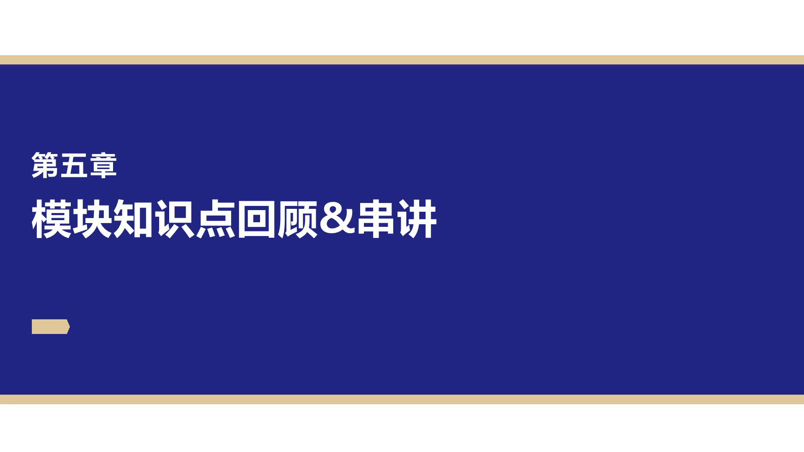

　　好，最后我们再来花一点时间，把本模块课程提到的所有的重要知识点来做一个回顾和串讲。在这一模块课程里边，我们首先给大家揭示了一个真相，那就是在运营的工作当中，大家不要只一味关注各种的技巧、方法、工具和套路。因为一切运营工作它底层都会有一些基本规律，而这些基本规律里边最最根源的东西叫做流量和用户洞察。在我们一开始就跟大家来分享它的。

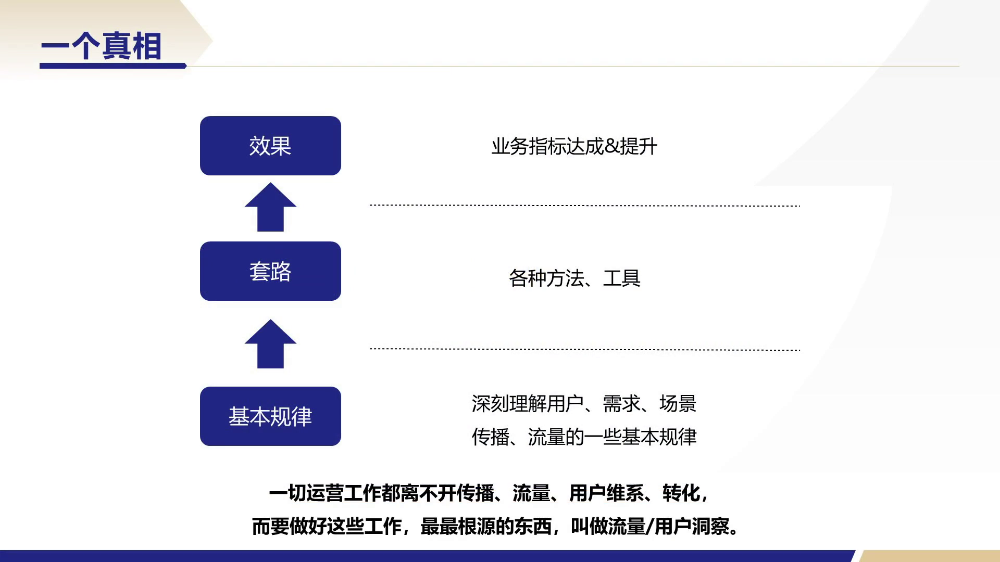

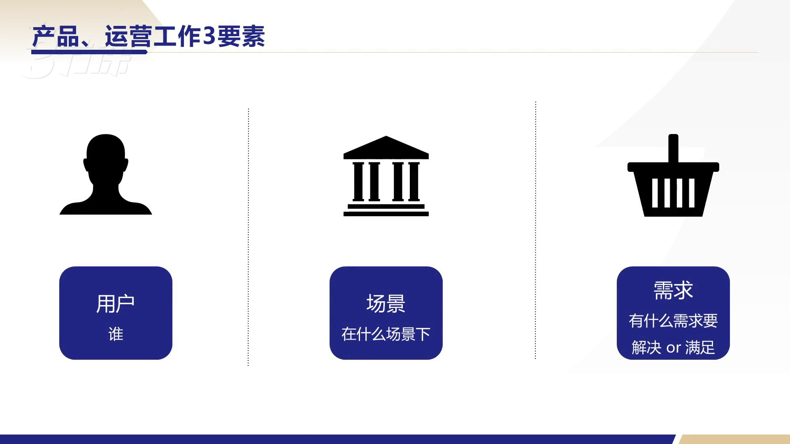

　　接下来的话，我们进入到说到底该怎么去更深刻的洞察用户，洞察流量呢？我们首先给大家一个重要的工具，叫做产品运营工作的基石三要素，用户场景需求。这三要素当你在工作当中，面向你的用户，你把它梳理的比较的清晰，让你心中有数。这三要素当中的任何一个，你都有无限细分的空间。且这些信息映入你脑海之后，就会成为你日常写文案策划活动时候的一些重要的抓手了。就像我们给大家举过的例子一样。

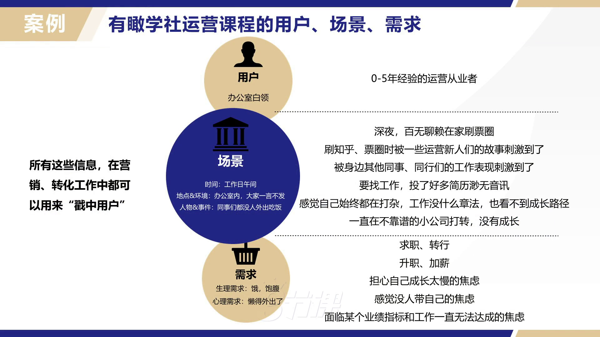

　　而这基石三要素在写文案、做内容，包括你做活动的时候，又有两种典型的应用的方式。第一种就是你脑海中时刻的要装填着你的用户场景需求，从这三要素出发来跟用户去沟通和互动。这时候能快速建立你和用户的信任，包括唤起用户的一个欲望的那当你脑海中真的不断装填的用户场景需求的时候，你不管做活动还是写完的时候，你都可以不断的用这些信息来去戳中用户，那这样的话，用户就会更容易被你唤醒，这是第一个。

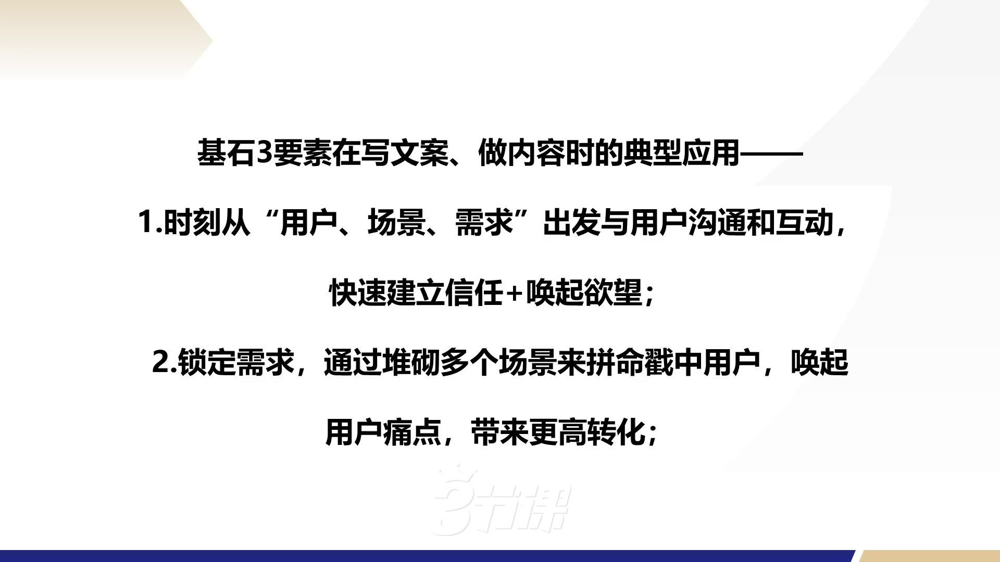

　　第二类的话，就你锁定用户的一类需求。通过堆砌多个场景来拼命的去戳中用户，唤起用户的痛点，那就能带来更高的转化。那这样的应用，可能在一些营销类的文案上，可能会比较的常见。这是基石三要素在写文案做内容时候它的两种典型的应用。

　　在基础三要素的基础上，我们也跟大家分享了哈那如果你想要更进一步的话，就是你要更加深刻的去洞察用户潜藏着的一些重要情绪和心理敏感地了。如果你能做到这一点，那会让你成为一个更加牛逼的运营。为什么呢？就像我们给大家分享过的例子一样，每一类用户身上都会有N多平常不被圈外人关注和理解的一些痛点和情绪，包含他们专属的回忆、痛苦、憎恨等等。当你能激发和理解了这些情绪之后，那你才能够在用户面前拥有更强大的信任力，也拥有更强大的感召力，可以更好调动起用户，调动起流量。

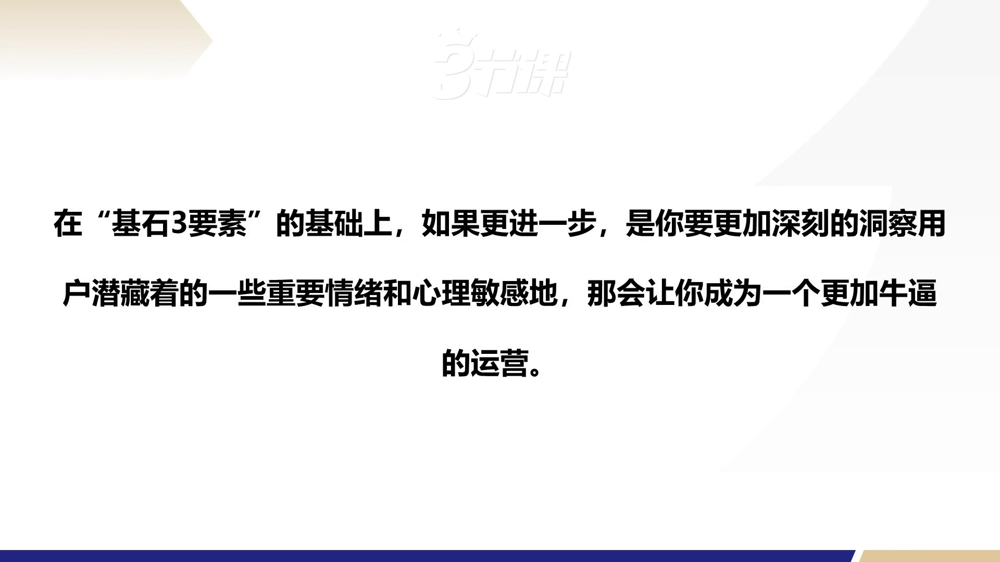

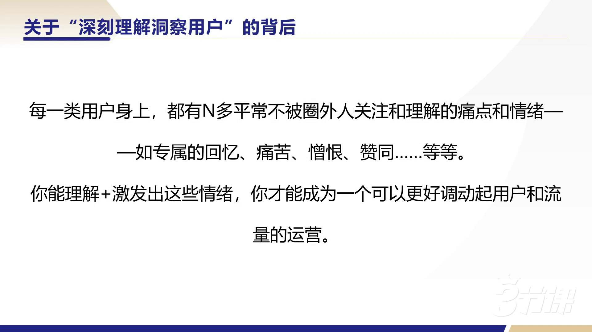

　　好了，假设我们已经圈定了某类特定的用户，我们该怎么去对他们形成更深刻的洞察呢？我们又给大家提供了一个工具，叫做用户洞察画布，这个画布一共分三个部分，基础属性、重要情绪，还有用户的一些重要喜好和生活方式。当你真的面向一类用户，把这个画布完整的填完，这个画布里边的很多的信息又都会成为你运营工作中的武器库，和你重要的一些弹药的来源。不管你是要做一些什么社群用户互动的活动，还是要做一些新媒体的选题。你看这张画布里面你的用户的一些重要的目标，他们的人生态度和理念，他们重要的拥护反对对象，他们一些高频正向负向的一些情绪的场景，？你把这些东西抓住之后，牢牢攥在你手里头。那你说你做活动也好，做内容也好，他们就毫无疑问都源源不断的是你的武器库好了。

　　这么重要的一个用户洞察画布，我们要填充好它，到底怎么来填充呢？我们给了大家一些重要的建议哈那分两方面。首先是你要找到一些目标用户特别堆的群和社区，你要去晋升，去观察他们？去不断的观察和反思。在这个基础之上，如果你感觉还不够的话，你可以再进一步的装扮成目标用户。进到一个目标用户的群体里边去跟对方聊天和互动。

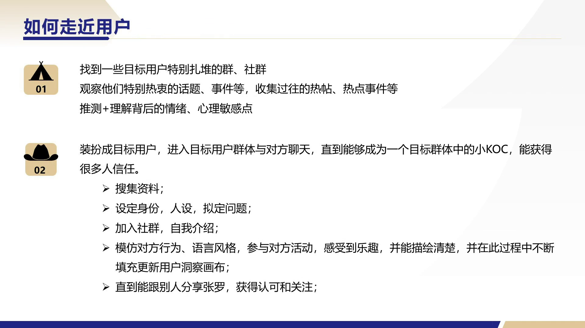

　　直到有一天你能成为目标群体中的这种小QC，或者一个很受大家认可和欢迎的人。那这时候你距离你的目标用户就一定会更近，你对他们的理解一定会变得更加的深刻。所以这是关于如何填充好我们的用户洞察画布。

　　再往下我们又开启了新的一节，跟大家讲了一件事儿，如何更好的洞悉流量密码。而流量密码这件事，我们把它显性化的话，它一般可能会有四个关键的元素。第一个是话题和选题，第二个是关键词，第三个是内容形式和标签，第四个就是一些其他的隐性的规则。换句话说，我们在任何一个流量平台里边想要去做流量。那基本上上述这四个关键元素都会是我们要非常重点的去关注的东西。

　　好了，那怎么能够洞悉怎么能够更好的洞悉流量密码呢？我们又跟大家说了，流量密码背后它是有一些核心逻辑和基本规律的那进一步我们就跟大家讲了5种自带流量的原始信息。一类对流量最讨喜的内容形式，还有四类最常见的流量分发规则，还有逻辑。依次来看，首先是五种自带流量的原始信息。我们分别跟大家说了哈那五个原则或者五句话。

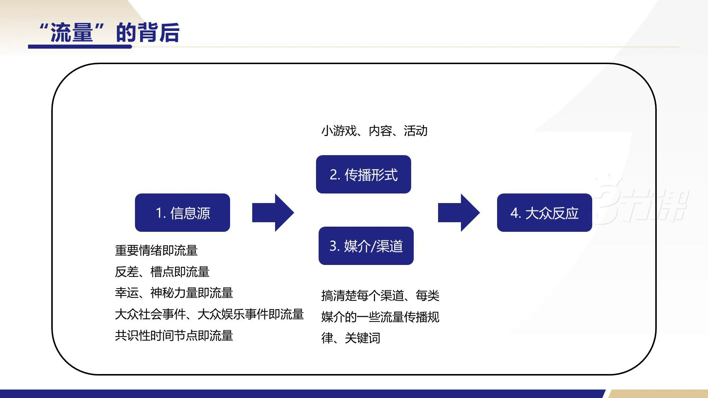

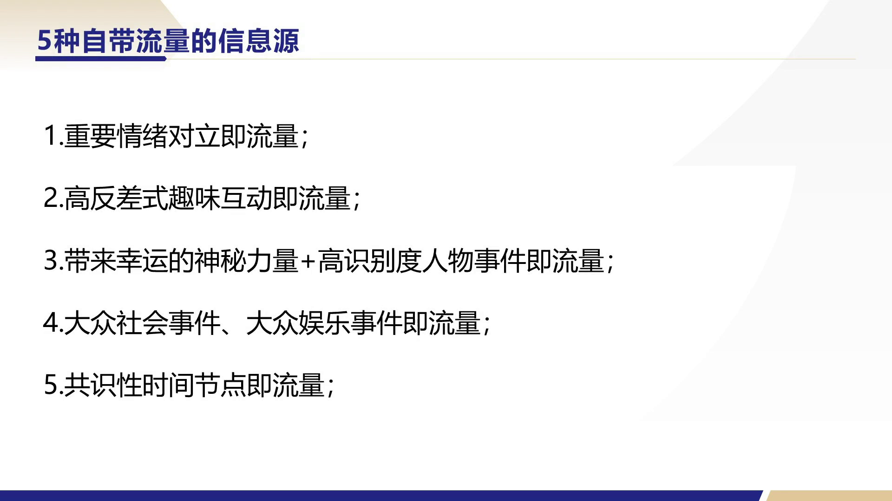

　　第一个重要情绪，对，立即流量。那你要有意识去关注你的目标用户群体里面有没有一些他们旗帜鲜明非常反对，非常对立的一些事物。或者是你目标群体跟另一类群体之间，他们会不会有一些重要的争议？这些东西你要能抓住他们，他们背后就是巨大流量。

　　第二个叫做高反差式趣味互动，即流量。就像我们提到的京东的那个曾经引发无数人关注的客服美眉一样。而且在互联网上，反差这两个字其实有流量的魔力的，后面还会再进一步的提到。

　　第三就是带来幸运的一些神秘力量，加上了高识别度的人物事件，？这两者结合在一起也意味着巨大的流量，包含像什么杨超越和锦结合在一起？就引发了巨大的这种流量的效应。

　　第四个大众社会事件，大众舆论事件即流量，这个不解释了。第五个共识性的一些时间节点及流量。所以像什么愚人节、情人节、新年这种时间节点。如果他跟你的产品，跟你的业务结合的还比较紧密，那这样的时间节点一定要劳牢的抓住它。这是我们说的5种自带流量的信息源。

　　接下来我们给大家分享了一类对流量最讨喜的内容形式。那是什么内种形式呢？就是我们刚才提到的两个重要的字，反差。就像我们说过的，在互联网上很多走红的人，或者事件或者内容背后你要去研究他们的话，他们背后应用到的一个核心的逻辑就是反差效应。就这个人比如说他原本有一个身份，但他的衣着表现、语气、语音语调、行为举止等等，可能跟他原本原有的那个身份之间产生巨大的反差。往往这样的人就会被很多人拿来调侃，或者他会一下子吸引到非常多人的关注。不管像我们提到的什么耗子尾汁，人类高质量男性等等，其实全都是这样的一个这种代表性的存在。

　　再往下我们跟大家进一步说了，有4种常见的流量分发的逻辑和规则。第一种叫做编辑推荐和分类索引的分发，第二种是搜索排序的分发，第三种是社交关系链分发，而第四种就是我们提到的信息流和算法推荐的分发。那你身处不同的流量平台里边来去做流量，你得去了解这个平台它背后的流量分发的逻辑和规则到底是怎样的那你才能够对症下药，去更好的捕捉住这个平台里边它到底有些什么样的流量的机会或流量的红利可以去抓住。

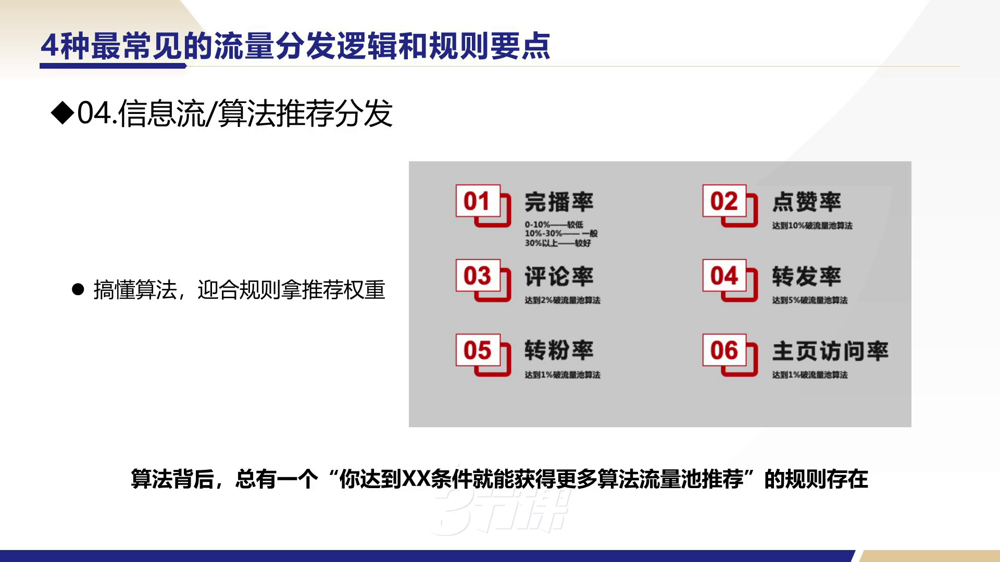

　　那到底在每个流量平台下去做流量，我们该怎么去搞清楚它的流量分发的逻辑呢？我们又给大家一个小的思路哈那就是你可以把内容生产和发布作为起点，而整个你的相关的内容在这个平台上获得流量，作为一个终点？那你可以在这个流量平台下去细细的梳理，你的内容从发布策划到获得流量曝光到底有哪些关键节点。那这些关键节点背后它的一个流量分发的逻辑到底又是怎样的？包括我们也提到了，其实在一个流量平台里边哈那可能会有多类流量分发的逻辑同时存在。像我们举的例子一样，像知乎这样的流量平台上边，它可能既有社交关系链的分发，也有一些算法的推荐分发，也有编辑的这种喜好的这种推荐分发，所以你得把每个关键的节点找到，那它背后到底是什么样的逻辑，你才能够更好的去捕捉它，更好去抓住它，这也是我们给到大家的一个思路。

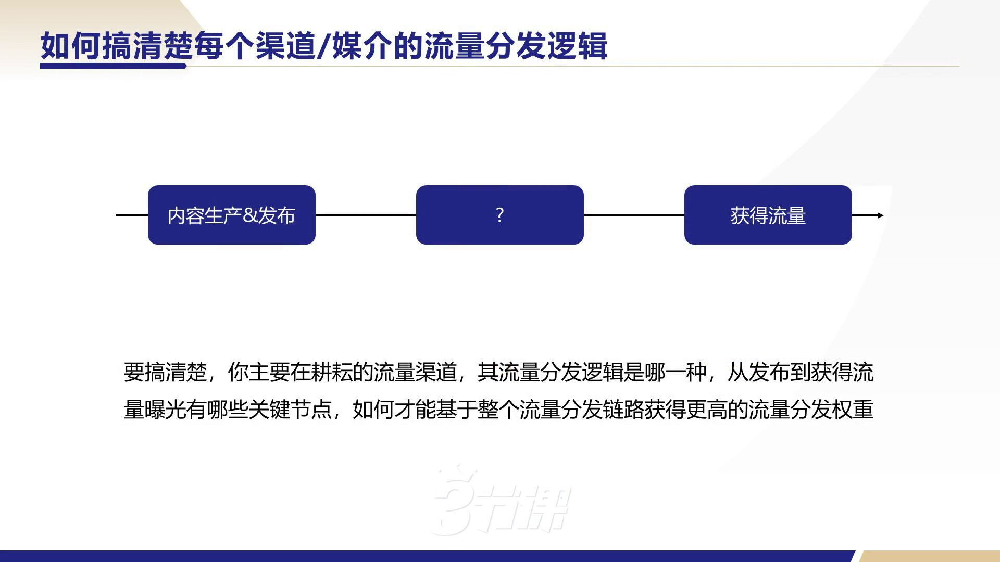

　　最后我们又在最后一节跟大家说了调动用户互动和参与意愿的九大原则。任何时候你要做活动也好，或者你上一个什么小的产品功能也好，想引发更多用户去关注他，想让更多用户跟你来互动，或者是你上了一个新的产品，感觉说这个用户并不是特别买账，你都可以应用这九大原则或者九大秘诀对自己来做一个质检。这九大原则和秘诀分别是，第一个有吸引力的奖励和概率事件结合。第二个稀缺感，第三个调动用户的竞争和攀比。心理。第四个调动用户的炫耀和猎奇心理。第五个戳中和营造用户的强烈情绪。第六个给予用户的尊崇感和重视感。第七个让用户感到占便宜。第八个低成本和单线程原则。第九个趣味性的反差。

　　好，在这一模块课程的最后，我们又跟大家再进一步说了三种运营手中的互动活跃神器，分别是什么呢？梗、表情包，还有一些简单可操作的互动机制。在梗和表情包这儿作为一个运营，你到底该怎么去收集它们？我们也给了大家一些思路，你可以结合一些大众的热梗和热点来去收集。可以基于说你们用户群体里边的一些共同记忆，还有反差事件，或者一些重要的人物来去创造梗，创造一些表情包，？这些东西可能在你的用户群里边会非常容易引发共鸣。也可以基与一些固定的特定互动场景来去收集一些比较讨喜的表情包。

　　当你手中拿着这样的一些互动活跃神器，你也深刻的理解了用户。然后你对于做互联网平台上边流量分发传播的一些规律，还有一些逻辑和规则，又有一些深刻的理解。我相信你在流量，在用户互动面前，你的驾驭力，你的主动性一定会变得更强大。好了，以上就是这一模块课程的所有的内容了。也再一次感谢大家的投入和认真的学习，希望在后续接下来的课程里边跟你们再见面。
