# 深刻理解4种常见的运营“数据漏斗”

# 第一章 所谓流程化思维及流程梳理的要点

　　2025年08月22日 18:31

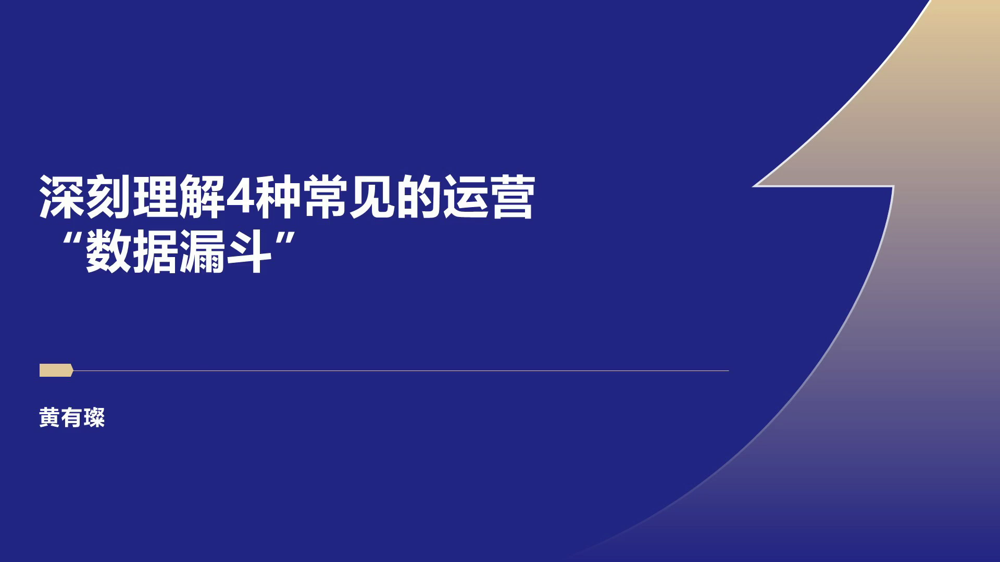

　　你好，我是有看学社的创始人和CEO黄有璨。今天我们要来学习的是一门非常有意思的课程，叫做流程化思维与价值数百万的案例拆解学习法。各位一定要知道，我们一切的运营工作，我不管你是写一篇营销推文，还是做一个活动，还是你要优化你APP的某些页面。那你要知道流程都必然是其背后的一些重要的元素。并且你要知道一些优秀的运营和普通小白运营之间的核心区别之一，其实就会在于他们脑海中是否能够时刻装着流程。

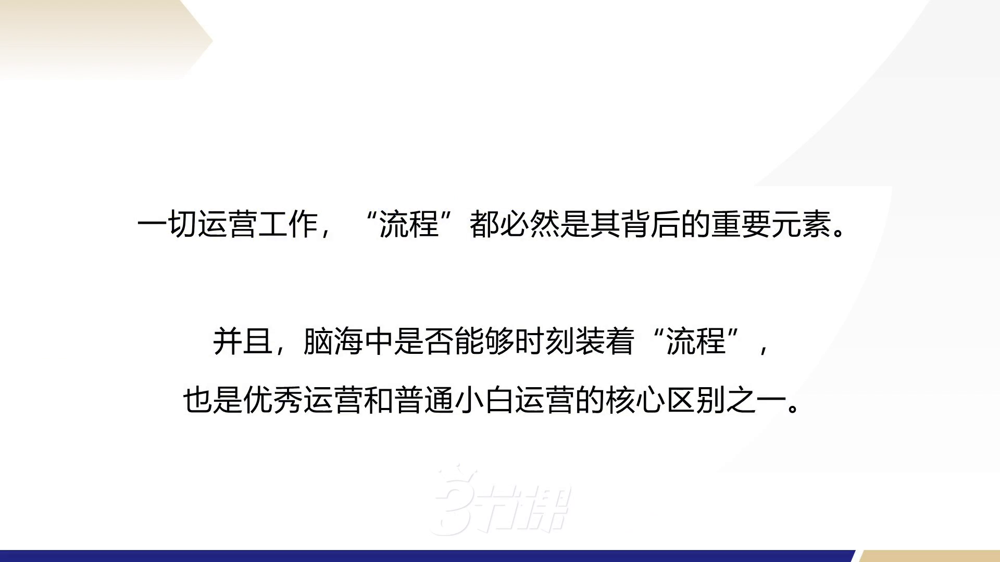

　　当我提到一个活动，当我提到说我现在要做一个什么用户留存的优化，或者我要做一个什么用户的召回，对不对？那一个优秀的运营脑海中第一时间蹦出来的可能是这整件事儿的流程。他到底12345会有哪些重要的环节？这些环节里面每一步重要的一些关键的因素又是什么？这是优秀运营第一时间的反应。

　　而普通小白运营可能这时候脑海中就是一堆的散点。比如说提到我要做用户的留存，？那我就也许就想到说，我是否就多做一些活动，可能就完事儿了。或者是当我要写一篇什么营销的推文，这个我可能也是第一时间就想到，是否套用某个什么套路，某个什么模板就完事儿了，大概是这样。所以优秀运营和普通小白运营之间核心的区别一定是在于他们脑海中是否能够时刻装填着流程这样两个字。

　　我们再往后看啊，你会发现很多的运营新人在工作中也经常会面临这样的场景。就是他们会发现自己的工作中跟运营有关的一些东西是学不完的。比如说你在某个二手车APP负责运营，老板想让你策划一场老带新的活动，至少带来几千个新增用户的下载。但是你之前从来没有做过类似的活动，所以也就没有解决相关问题的思路。那你的老板工作又忙，并不会手把手教你。你初出茅庐面对老板，很多时候咱也不敢说，咱也不敢问？最后就搞了一个不靠谱的方案，悲剧收场，被老板噼里啪啦批评一顿，然后打回重做。

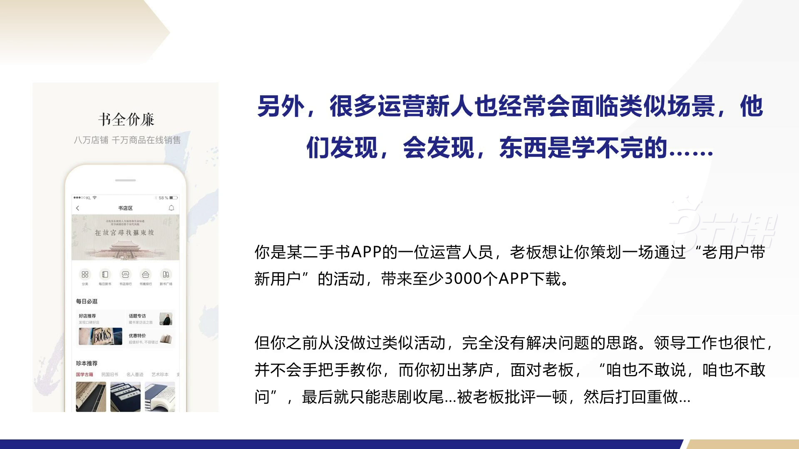

　　所以很多运营新人在工作中都会遇到过类似这样的情况，就是老板派给我一个活，但对不起，这个活我过去没有做过。那这时候我该怎么办呢？老板又没空教我，？我该怎么办呢？你会发现这样的场景是非常多的。

　　某种意义上你要知道，其实我们遇到的绝大部分的运营的问题，都已经被前人解决过很多次了。市面上也都会有比较成功的案例。所以能帮助你应对这样的困境的核心的一个逻辑就是你要学会如何通过拆解案例来更好的学习。甚至通过持续的拆解案例来积累起自己的运营弹药库。

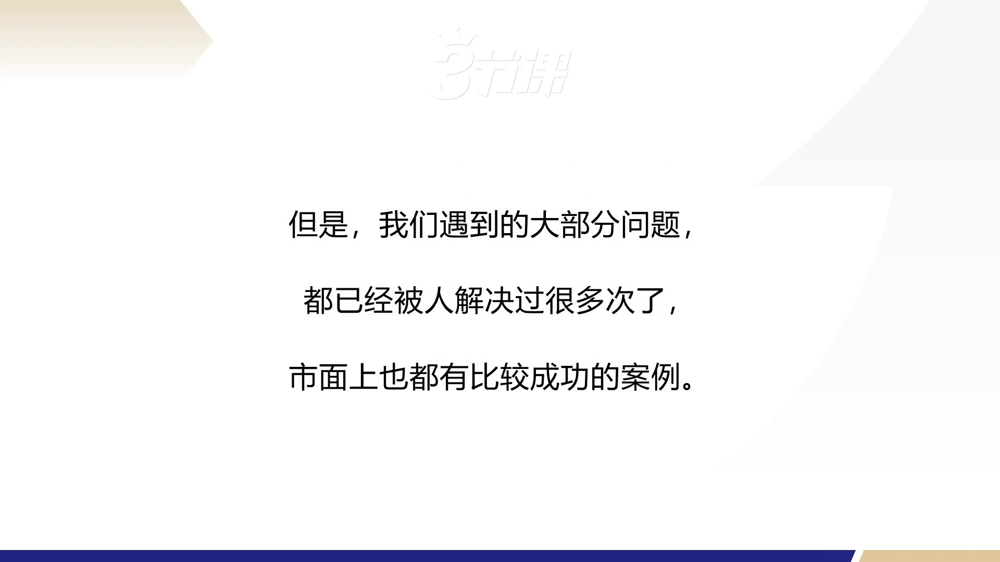

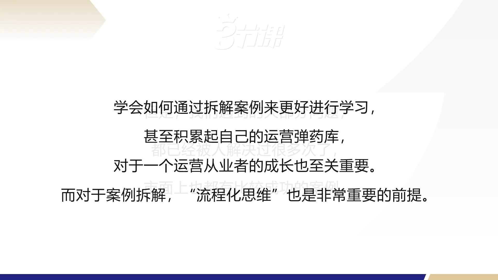

　　这件事儿对于一个运营从业者的成长是至关重要的。有没有这样的能力？某种意义上，你的成长背后它可能会是一个乘法的逻辑。有这样的能力，你的成长可能乘以一个重要的系数，得到很快的一个加速。没有这样的能力，那你基本上就是我看过一我就会做一，看过二我就会做2，没有看过三对不起，三交给我我就不会做了。但如果你有这样的能力，有可能是说即便我过去只做过12345，我过去都没有做过。那我也能在遇到2345的时候，迅速的自己整理出来一个思路去应对它。

　　所以这是一个非常重要的事情，而对于如何做好案例的拆解，流程化思维也是一个非常重要的前提。所以这就是我们现在的这一门课程为什么如此重要。如此之前你把这门课程消化好了，那它就能让你具备这样的能力。让你能够持续通过案例的拆解，积累起来自己的运营弹药库。也让你能够在面对很多哪怕你过去从来没有解决过的问题的时候，一点都不慌。还能快速的找到很多的很棒的一些解决的思路。

　　这是关于我们这门课程，所以说到这儿可以简单介绍一下我们这门课程的内容了。我们这门课程一共分成四个部分。在第一小节里面，我们会跟大家来聊一下所谓的流程化思维以及流程梳理的要点会有哪些。而第二小节，我们可能会跟你聊一下流程化思维背后最常见的一些数据漏斗的应用都有哪些。因为其实流程背后往往就是我们的数据漏斗。而第三小节就是这门课程里面最有含金量的学会拆解案例，建立个人的运营弹药库。而第四小节我们也会现身说法，来带你拆解三个高价值的经典案例，给你示范一下到底怎么来去拆解案例，让这些案例对我们的价值变得足够的高。最后就是我们的整体的模块的知识点回顾和串讲了。

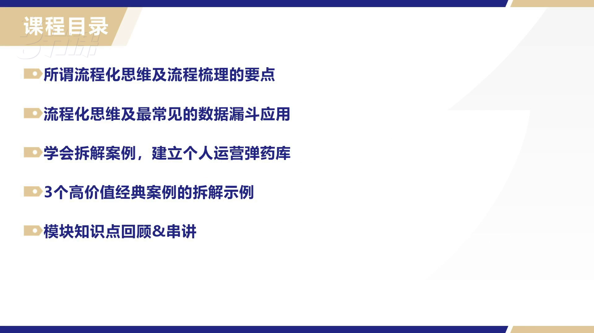

　　好，接下来我们先进入到我们的第一节，所谓流程化思维和流程梳理的要点。首先我们先来聊一下，到底如何通过流程化思维来帮助我们更好的解决我们在运营工作中遇到的很多的问题。在这一节的开篇，我们先要建立这样的一个意识。就是流程是互联网工作还有商业事件里边的一个重要的基石性的存在。这个世界上一切商业价值的产生，背后都必然有一个流程。这句话怎么理解呢？我们来看一下，比如说我们在商业世界当中，最常见的一个逻辑就是我们用户可能会从A走到B最后给我们完成付费吧？那你发现从用户最初了解到我们到最后用户完成付费，这中间一定会有若干个环节的体验引导和服务。而把这些N多的环节去串联起来，它背后就一定是一个流程。

## 1.1 如何通过“流程化思维”更好解决问题

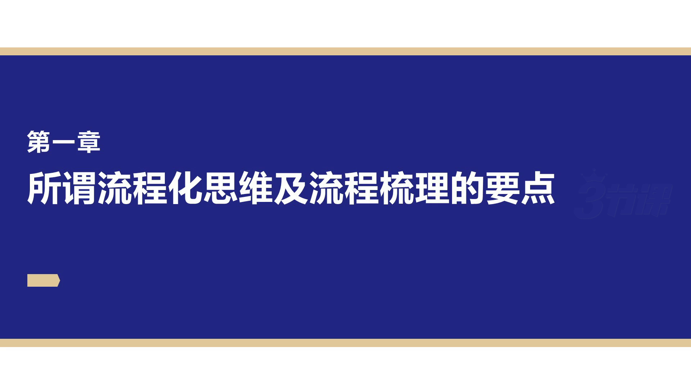

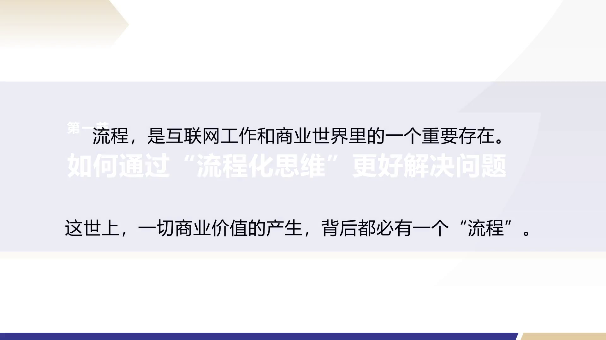

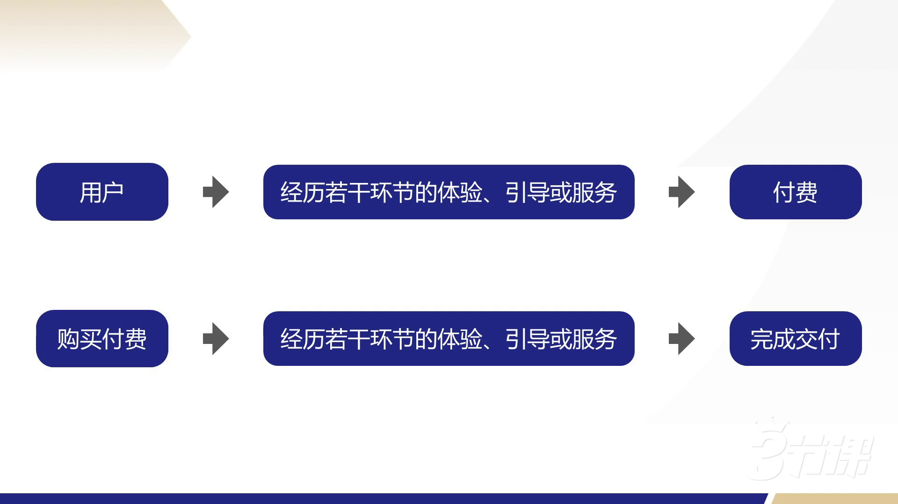

　　同理当用户完成购买付费之后，最后到我们去给他完成交付，这中间也会经历若干个环节的体验引导或者是服务。就像比如说你在一个家政服务的APP上下单购买了一次家政服务，？那也许你在上边你会收到服务的确认，会有人事先联系你，跟你确定时间，上门之后他又有若干的这种服务的细节，或者缓解结束之后？还会给你比如说送上一句祝福，或送你一个什么小礼物之类的，最后完成一个交付。所以一切的商业行为，一切商业事件背后都必然会存在一个流程。

　　我们再来进一步看一下哈那落实到更细节一点，更具体一点的。比如说互联网里边我们做流量和转化的这样的工作，？背后它就一定会是一个大的流程漏斗，我们一定会去思考说前端我们的流量的渠道来源会有哪些。流量引到我们的网站，引到我们的APP上，它可能会访问一些什么样的页面？在相应页面上会让他们得到一些什么样的体验和互动。以及最后在消费和转化这一步里边，我们是给到一个什么样的出口。是直接让他们去付费，还是说让他们可能留下自己的电话，然后我们通过电话来完成一个咨询，还是说给他们一些优惠券，还是说在线我们就跟他们及时的来做一些沟通等等。

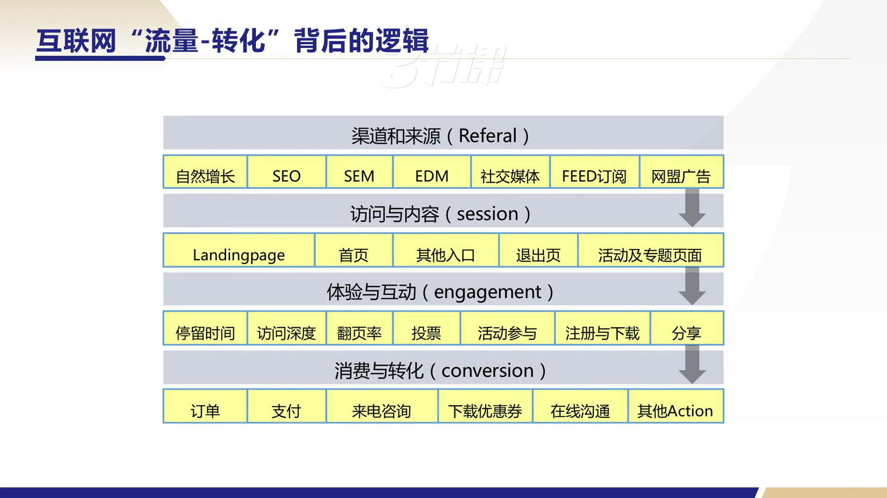

　　但是总而言之，你会发现在流量转化相关的工作背后最重要的事情就是我们去设计好这么一个转化的流程。让这个流程能够通畅，并且基于这个流程再来持续的去做一些优化。这是这样的例子。

　　我们往下再来看另外一个例子哈那这个例子就是大家非常熟悉的一家家居品牌，就是宜家，？宜家的商场，但凡去过的人可能都会比较印象深刻。就他整个商场里边，用户在其中的游览的一个路线是完全被事先设计好了的。用户要从A区域走到B区域，再从B区域走到C区域，再到C区域到D区域，最后可能去完成家具的自提和结算。那他为什么要这么设计？

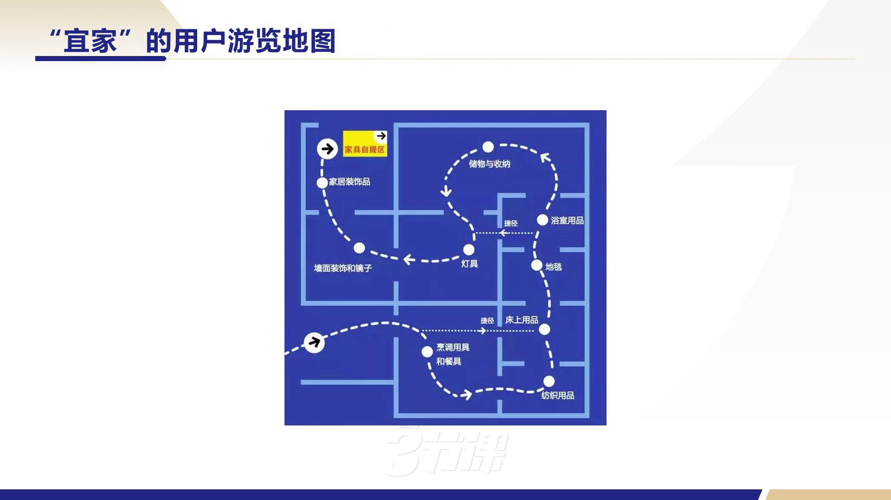

　　其实很简单，也是当你有了这么一个清晰的流程之后，你发现这过程中一切的用户行为都是可以监控的。一切的用户的行为也都可以依照数据和相关的一些互动来去做一些精细的优化。比如说当我们发现有更多的用户在B区域停留时间很长，但是他们购买的相关的商品却并没有那么多，？这背后就一定有一些重要的线索，特别值得我们分析了。

　　又或者是有用户在D区域里边？他们购买某一类商品的概率可能非常之高。那这类商品也许就特别值得我们去重视。我们也一定可以围绕着这样的一些线索来对于整个用户浏览的地图，甚至是一些商品的摆放等等，持续来去做一些优化。这样的优化背后它也一定能帮助我们提升整个商场里边商品的销量。所以这是我们的另外一个例子。

　　再往下看，这儿还有一个例子是某个品牌线下门店的从用户下订单到最后完成整个订单交付的这样的一个流程。你会发现在这样一个例子里边，基本上我们也能很清晰的看到，就是用户可能在我们门店的这个系统里边完成一个下单，？然后这个下单之后，我们中后台的一些像配送中心或者一些支付中心，还有订单中心，它是如何去协同展开工作的。我们如何从其他的部门那边获得一些数据，调取到一些反馈，并且把相应的数据信息流转到其他部门那里，让整个订单的交付的过程能够非常有保障，非常有序的能得到展开。所以你会发现流程不仅能帮我们梳理最前端用户的整个消费行为，也能帮我们去梳理像中后端我们一些数据的流转。或者我们内部多个部门之间的协作关系，协作机制大概是怎样的，这是这么一个例子。

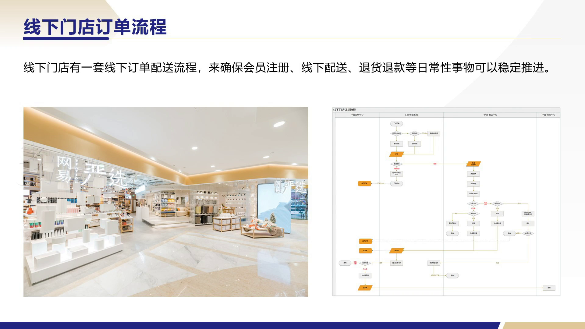

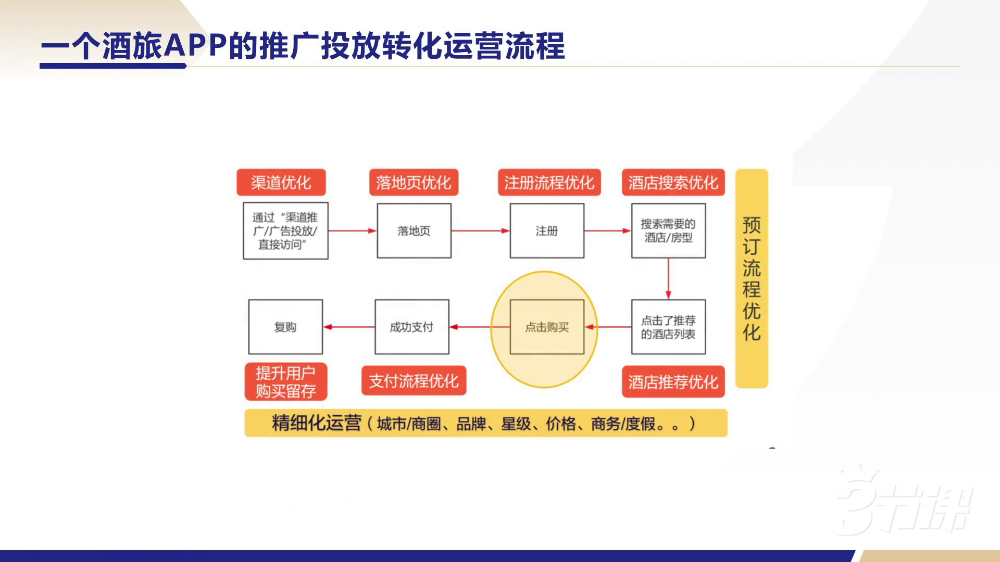

　　再有我们再看一个例子的话，就是最常见一个酒旅APP它的推广投放转化的这么一个流程，就从最前端在渠道这边，然后做广告投放引流到落地页，再到可能用户完成一个注册。完成注册之后，搜索需要的酒店和房型，再可能点击购买下单，再到成功支付。后边可能是这个复购和转化。围绕着这么一个流程一旦梳理清楚之后，那你一定是可以在每个环节里边都来做一些精细化的运营，都来去做一些相关的页面或流程硫化的。从而能帮助我们放大整个转化链路的一个效率。所以上边是几个例子，都是我们在日常工作中会经常看到的一些例子。这些例子看完了之后，我觉得我们可以稍稍做一下总结。

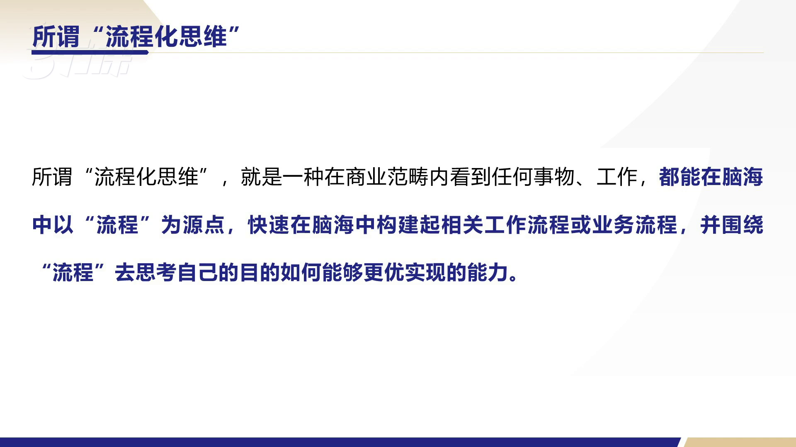

　　所以所谓的流程化思维就是一种在商业范畴内，你无论看到任何事物和工作，你都能在脑海中以流程为原点，快速构建起来相关的一些工作流程或者业务流程。并且围绕流程去思考自己的目的到底如何能够更优，实现这样的一种能力。就像我们说的，在商业世界当中，几乎一切工作背后一定都有一个流程，流程也是我们可能日常沟通或者去推进工作的一些核心的基石性的存在。所以你一定要让自己慢慢的形成这样的一种能力。

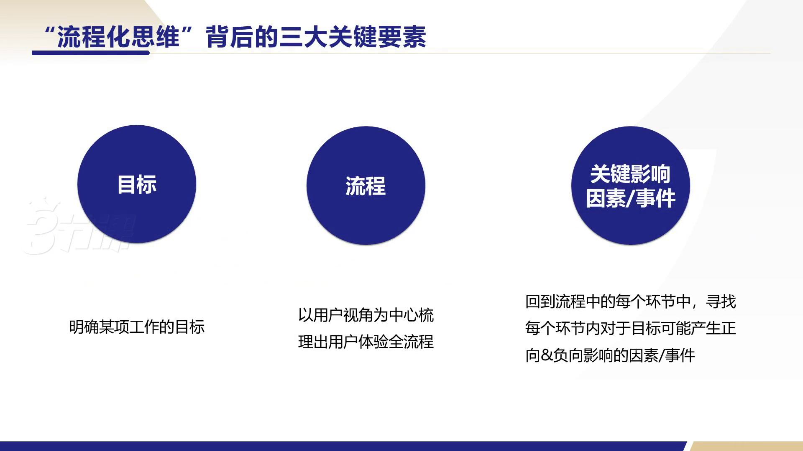

　　我们再进一步往后看，流程化思维。如果我们要用这么一个东西，这么一个听起来有点虚的东西，帮助我们更好的去解决问题的话，其实背后会存在三大关键的要素。哪三大关键要素呢？我们依次来说。首先第一个关键要素就是我们的目标。我们做任何一件事情背后都一定有个我们重点看重的目标。所以当我们可能拿到一个事儿的时候，拿到一项工作的时候，首先我们要明确他的目标到底是什么。

　　接下来就是我们的第二个关键的要素，就是我们的流程。当一件事儿放在你面前或一个问题放在你面前，你首先明确他的目标之后，接下来在第二步你可以做的就是以用户视角为中心，来去梳理出来整个用户体验的一个全流程到底是怎样的那梳理完这个流程之后，接下来第三个关键的要素，就是我们的关键影响的事件或者是因素。这个怎么理解？就是你看前边我们有了一项工作的目标，或者一个待解决的问题。接下来我们也梳理出来了？用户视角下的一个体验的全流程。接下来你就一定可以回到流程中的每一个环节里，来去寻找说我的A环节B环节里边，对于我的目标可能产生正向负向影响的一些因素事件到底有哪些。如果我们是要促进我们的目标更好达成，那我们一定就可以说放大那些可能带来正向影响的这样的因素度或者事件，规避掉那些可能会带来负向影响的一些因素和事件就完事儿了。

　　好，我们不妨也仍然来看两个具体的例子。首先我们先看第一个例子，假设你现在这家公司面临到这样的一个问题，说老板要告诉你说我们要举办一些线下活动，给我们的微信公号涨粉。你现在就面临到如何通过举办线下活动给微信公号涨粉这么一个命题，对不对？你知道有很多人拿到这么一个命题的时候，然后他们第一时间可能脑海中会浮现出来的都是说，那我们是否线下就做过什么抽奖，来促进现场用户的转发就完事儿了，都会浮现出来这么一种答案。但是当你有了流程化思维之后，这件事儿背后我们可能会如何来思考呢？我们简单一起过一下。首先像我们说的一样，我们的第一个要素目标，我们目标就涨粉，这个很清楚了，不用过多解释。接下来第二个核心的要素是我们的整个的流程，而且他应该是说以用户视角为中心的流程，对不对？

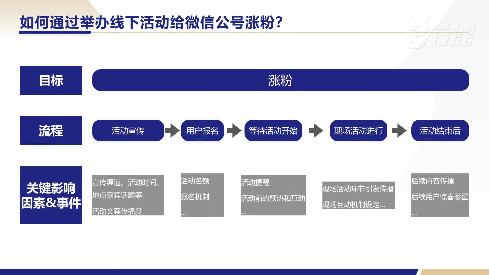

　　好，那我们就要看一下了，以用户视角为中心的整个流程。它其实是从最早的活动宣传，用户看到这个事儿，到用户说我申请要报名这个活动，再到说中间我报完名之后，我要等待活动开始，对不对？再到说我去到现场，我要参加这个线下活动，以及活动结束之后可能还会有一些潜在的什么互动之类的，对不对？好，整个以用户视角为中心来看待这个活动，它的全流程是这样的。

　　好了，现在你有了目标，也有了流程，那接下来你可以做什么呢？接下来我们就要进入到我们的第三个关键的要素，就是我们要进到流程中的每一步去看啊每一部里边可能存在着一些什么样的关键影响的因素或者是事件。比如说我们依次来过一下，在我们的活动宣传这一步，我们可以依次来看一下有哪些关键影响的因素和事件，对于涨粉可能是会起到一些相关的作用的。比如说这里边我们的宣传渠道，我们到底在哪里宣传，对不对？然后我们活动的时间、地点、加宾，还有他们的话题？这些东西决定了有多少人会愿意来参加这个活动，然后以及他的话题也决定了有多少人可能说会想要去分享和传播这场活动。

　　再有的话就是我们活动的这个宣传文案，它本身的传播度到底怎么样。有些活动的文案可能是很棒的？让人看完之后就觉得说我考这活动真牛逼，我也想分享一下？然后会有这样的感觉。

　　所以在第一步活动宣传这一步里边，你看我们就拎出来有这么几个关键的要素。可能它对于涨粉是会产生正向或者负向的影响的那就把它拎出来。换句话说这些要素上就是我们在工作中中，如果我们真的以涨粉目标，就是我们可以考虑的潜在的工作的发力点了，所以这是在第一个环节，那接下来第二个环节，关于用户报名这个部分？我们也细想一下，这里边我们的活动名额，包括我们的一些报名的机制，其实它对于成分也是会产生一些正向或负向的一些影响的作用的。

　　比如说我们这个活动，假设说名额很少，一共就几十个人的这个名额。但是想参加人又非常多。那这时候我们就可以采用一种可能就是那种有门槛的报名的一个机制，？比如说你可能要完成一二三这么几件事儿，或者要满足什么样的条件，？你才能够来报名参加这样的线下活动，包括我们自己可能在2016年的时候，就曾经做过一次类似的活动。线下只有80个人可以参加。我们面向一些创业者，就让这些创业者们，你必须要邀请你的亲朋好友们来给你点赞。在一个排行榜上，你最后的排名排进前20 30，你才有资格来参加这个线下活动。

　　类似这么一个小的机制，就让我们那个活动的传播量一下子可能就到了大概几十万上百万的样子，所以这是在用不报名这个环节上，我们可以考虑的一些关键的因素。接下来第三个环节，在等待活动开始这个环节上，我们又有哪些关键影响因素呢？这时候你会发现我们的活动开始前的一些提醒，活动前是否可以设计一些预热和跟用户的一些互动。这些东西也是有机会会带来一些用户自发的分享和传播的。所以他也许也可以是我们在工作中的一些重要的考。有一点。

　　再往后就到了活动的现场，？在活动现场有哪些东西会影响到涨粉呢？首先肯定是现场的一些环节，它是否能够引发传播。包括你现场是否有一些看起来很可爱的一些玩偶，或者有一些很牛逼的名人在现场，大家能跟他拍照，拍完照之后大家肯定想晒朋友圈，？晒完朋友圈之后，如果你顺带假设帮我们分享一个什么链接或分享个二维码，你现场就能领取一个什么小的奖品或福利之类的。这样一些小的机制也是能大量的促进传播涨粉的，所以现场里边也许就有，比如说活动环节是否引发传播，现场是否有一些互动的机制的设定，它是否也能引发一些更多的分享和传播，这样的一些东西也能帮助我们去涨粉。

　　最后就是活动结束后了，？那活动结束后，第一肯定也是说我们现场活动的一些精彩的内容，我们对外做传播，它也许能给我们带来涨粉。再有的话后续在活动结束后，我们是否可能还会留下一些给用户们的惊喜的彩蛋。比如活动结束后第二天，然后告诉你说其实我们在现场还给你买了一个什么什么彩蛋，你只要进到哪个地方，你就能够快速领取它。这样的彩蛋设计的比较好的话，也能引发用户可能在一轮的传播。所以你看同样是拿到做线下活动，给我们微信公号涨粉这么一个目标，对不对？

　　有可能当你没有流程化思维的时候，你可能就只能想到说现场我给大家发点红包，让大家帮助我去分享和传播，然后给我带粉丝增长。也许就只能拍脑袋想到这样的答案。但是当你有了流程化思维之后，你能从流程中的每一个环节里边去细细思考，说每一个环节下到底有哪些关键的影响因素和事件可以帮助我们来涨粉，这就是一个本质的区别。

　　好，接下来我们再来看另外一个案例。这个案例可能又是另外一个场景了。就是你现在如果在负责一个社群的运营，那老板给到你目标就是我要提升我社群的用户忠诚度和活跃度，？这时候我该怎么办？

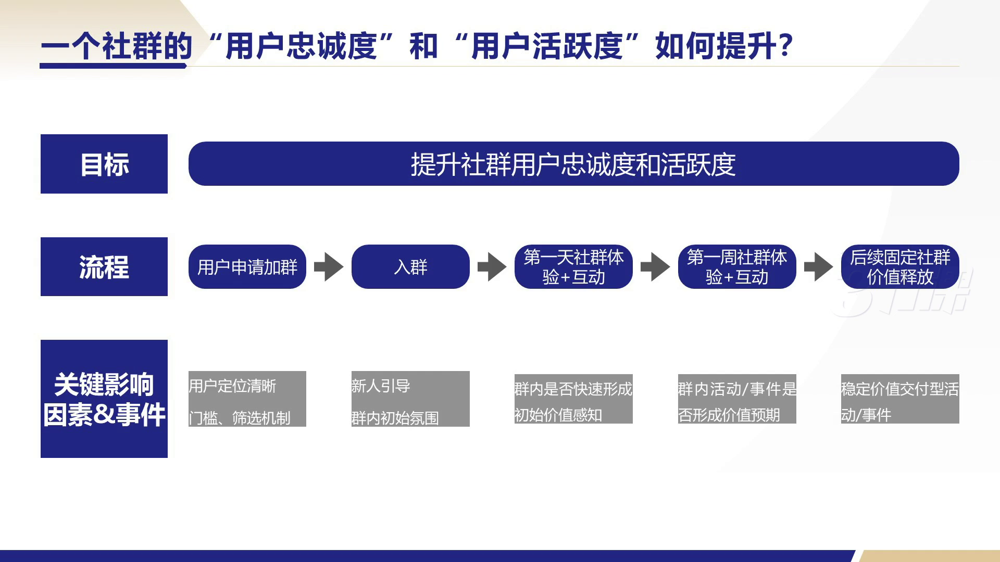

　　同理，我们应用流程化思维来去完整梳理一下的话。首先我们的目标提升社群的用户忠诚度、活跃度，这个不用说了。那接下来以用户视角为中心的流程可能会是怎样的呢？

　　在一个社群里面，你会发现整个的流程，首先肯定是说用户看到这个群的消息申请来加群。用户完成了入群。入群之后，第一天里边用户会在社群里边得到一些体验和互动，？然后往后可能是第一周，他会在社群里边又得到一些体验和互动。再往后可能就是后续社群里头可能会有一些固定的稳定的这种价值释放了。比如说什么每周可能都有一些分享，或每个月都有一些什么线下聚会之类的？他就会进入到一个说稳定的这么一个状态。

　　换句话说，当我们有更多的用户体验到了我们社群里边的一些比较好的价值，并且在社群里边跟其他人形成了互动，也对社群里边一些稳定的活动有感知、有预期。那他们在社群群里边的忠诚度、活跃度就会能得到提升。大概是这样，这是整个的一个流程。

　　接下来我觉得如果我们是真的要提升用户忠诚度活跃度，我们就可以回到流程里边的每一个环节里面。再依次来看。首先在用户申请加群这个部分，有哪些事儿会影响我们的用户忠诚度活跃度呢？毫无疑问，就一个群里边我们的用户定位是否精准，？其实直接决定了说这群人聚在一起，他们能不能碰撞出来火花。所以我们在申请加群这一步，比如说我们的用户定位是否清晰，我们是否有一些申请的门槛或者一些筛选机制，这些东西其实天然就决定了说用户进来之后会不会很快的就能跟其他人打成一片。因为如果我有明确用户定位和门槛筛选机制的话，才能保证反正我进来的用户基本都是同一类人，他们可聊的话题就会更多。所以这在第一个环节。

　　接下来第二个环节，在入群这个部分。毫无疑问刚入群的时候肯定会需要说有些新人的引导。包括你刚入群的时候感受到群内的初始氛围，是否足够热烈，是否有很多人在欢迎你，是否有很多人积极的在向你抛出橄榄枝，有一些互动之类？这些东西对一个新加入群的用户，他的体验和感知是至关重要的，所以这在第二个环节。

　　再往下我们第一天里边社群的一些体验和互动上，很简单，就我们在群内是否能够快速给一些新用户形成一些初始的价值感知。不管是他在群里边快速认识的一些新的朋友，或者在群里边一些话题的讨论，他快速得到了一些干货或得到了一些重要的群里边的这种内容的价值沉淀，这些都算。那再往后可能就是说我们在第一周里头，群内是否能有一些活动和事件在稳定的发生，并且能带给我们的新用户们一些稳定的价值预期，这个事儿就非常重要。再再往后，无非就是说我们的这些价值交付型的活动和事件，它是否能够稳定的发生了。所以你也会发现，当我们带着流程化思维来思考这么一个问题的时候，我们也能够依次从每个环节当中去找到一些大量的关键影响因素和事件，也把它作为一些线索来指导我们的工作如何去开展。

　　好了，经过上面这么两个案例，相信大家对所谓流程化思维能带给我们的价值会有一些更具象的感知了。我们也来稍微总结一下。所以你会发现在所有跟商业相关的工作中，如果你拥有明确的目标和目的，又能够拎清楚这整件事儿它发生的一个整体的业务流程，同时又能从中找到一些重要的相关关键要素的话，那你就总能找到无穷无尽的细节和线索去进行调试和优化。从而帮助你更好实现自己想要的这个目标，或者拿到你自己想要的这么一个这种成果，然后大概是这样。

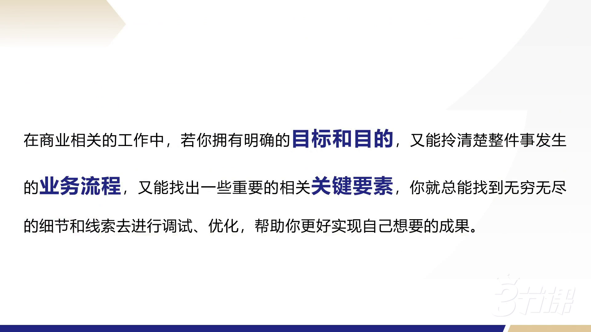

　　同时我觉得在这个语境下，我们如何来理解所谓流程化思维给我们自己带来的价值呢？其实我觉得可以用这么一张图，我们就直观的就能感受到。就是我们过去当我们没有一个所谓流程化思维，没有一个思考的体系和系统的时候，你会发现我们在一个问题面前，我们的很多思考可能都是这种零星散点式的。我们会蹦出来一个一个的想法，一个一个的主义，？但这主义和主义之间他们有什么关系，其实是不清楚的。

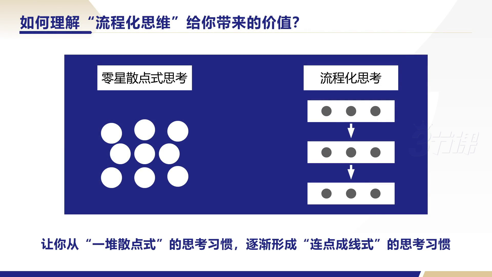

　　而当我们有了流程化的这么一个思维之后，至少你会发现流程就成为了你所有思考的一个核心的一个逻辑。你可以把很多你的想法按照流程去做组织，？就像我们说的一样，你在整个流程的第一步、第二步、第三步、第四步，你能找到些什么关键的影响的事件和一些要素？来驱动你的目标能更好的达成。这样的话，你就会开始拥有初步的一个体系化的思考。

　　所以流程化思维这件事儿给我们如果作为一个运营新人，我觉得带来最重要的价值就是让你能从一堆散点式的这种思考习惯，慢慢的能逐渐形成这种连点成线式的思考习惯。而且确实对于新人来讲，当你带着流程化思维来看待很多的工作，来看待很多的目标的时候，你真的会发现你比过去其实已经能开始看到更大的世界。看到一件事，一个目标达成背后有更多的可能了。

　　就像我们上边的这两个例子当中让大家感受到的一样。所以流程化思维这件事儿对于一个新人来讲，我觉得是非常重要的那所以流程化思维我觉得几乎是一个运营新人可以最低成本让自己的很多思考可以开始变得体系化、系统化，而不是杂乱无章的一个最佳的起点。我们也非常建议我们所有的同学们，如果你是一个运营新人，在你的日常工作中一定要刻意去练习，带着流程化思维去看待你很多的工作和很多的目标达成。慢慢的可能你这样思考过几个月之后，你也许在你身上就会发现一些重要的有价值的变化就出现了。

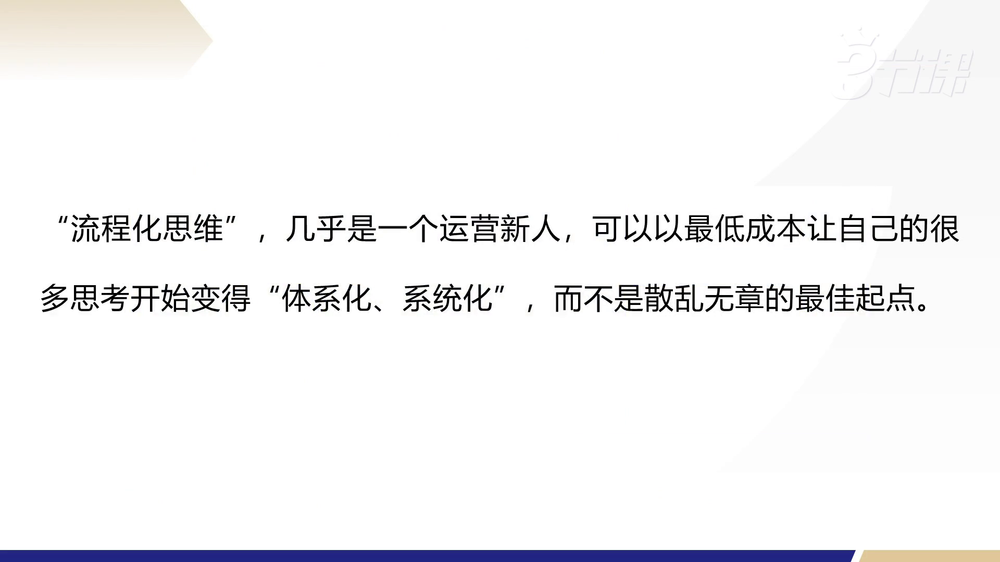

## 1.2 流程梳理——运营从业者的最重要基本功之一

　　2025年08月22日 18:31

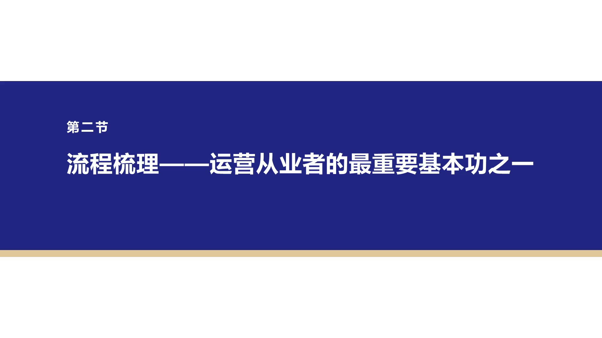

　　好，上面我们就整体聊了一下流程化思维对于我们的价值和重要性。接下来我们就来进一步更落地的来聊一个东西，那就是流程梳理。因为实打实的说，上面我们讲了很多流程化思维如何重要，如何有价值，对不对？但是回到日常工作中，如果不管你在一个活动面前，在一个什么事件面前，你连基本的流程都你不清楚，或你梳理出来的流程特别的杂乱无章，对不对？你说你拿什么去进一步往下去细致的落地呢？对吗？

　　所以大家一定要意识到，其实流程梳理和流程优化是一个运营从业者最应该扎实训练好的基本功之一。我们可能要做一个活动，得关注这活动背后的流程。我们要面向用户去完成一个服务交付，也需要关注这个服务交付的整体的一个流程。我们有个什么新的产品，有个新的版本要上线了。上线之后用户的体验流程同样也非常重要。所以流程梳理在运营工作中真的是无处不在。我们再进一步具体来看一下流程梳理这件事儿，它给我们的工作会带来哪一些重要的价值，还有说它的重要性会体现在哪地方？我觉得可能有这么几方面。

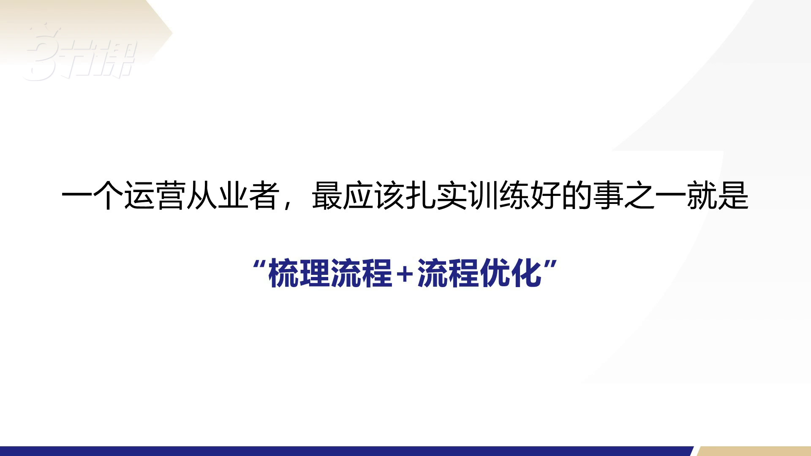

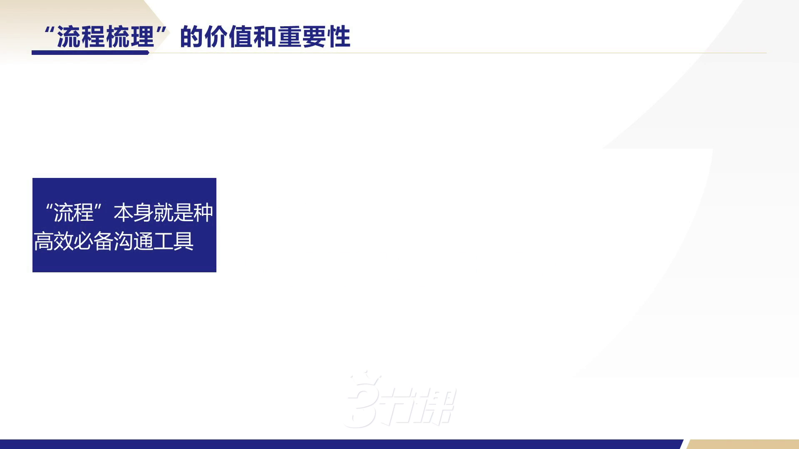

　　首先大家要意识到，可能对于运营，甚至对于所有的互联网人来说，流程这个事儿它本身就是一种高效必备的沟通工具。因为在你日常的工作中一定涉及到我是一个运营，我要给我产品经理提需求，？我要跟我的研发们探讨说，有个活动或者有个什么玩法，到底该怎么来实现。那到底怎么实现这个事儿？我们拿什么跟对方聊呢？你会发现我们往往得基于流程来跟对方来沟通和确认，才更容易跟别人把事儿聊清楚。

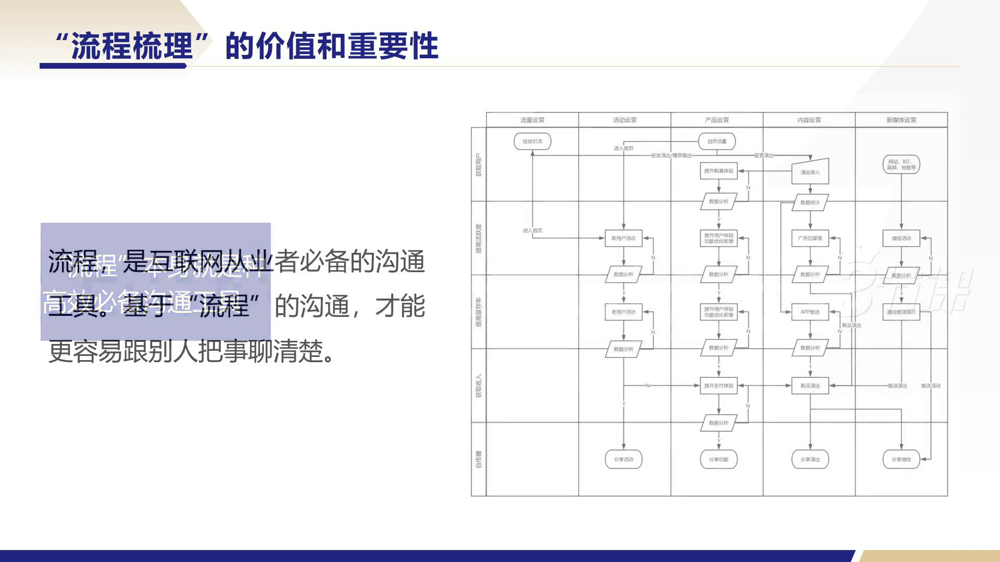

　　包括你跟你的研发和产品经理们要提需求的时候，你直接告诉他说我现在要上线一个什么老带新或一个优惠券发放的这么一个功能，？这个功能背后发放优惠券的流程，我设想可能是这样？那对方拿这流程直接就能快速跟你来对话，说这流程里面哪些东西可能不靠谱，技术上实现不了，哪些东西一定能做？而不是说你就直接跟对方讲说，我想要一个发优惠券的一个功能，怎么做，你们来帮我想。那这时候对方也会觉得说就很挠头，？或者至少对方会觉得说反正你不懂产品，你也不懂研发，你的沟通不够严谨，不够专业。这些很小的细节往往会给你的工作和跟其他人的协同带来很多的帮助，或者是一些很多的无形的损害。

　　所以首先流程梳理它就是一种重要的必备对的沟通工具。接下来第二就是流程对于你的价值。就是当你把流程梳理清楚之后，你往往也更能够清晰的定义问题和抓住一些重要的重点。

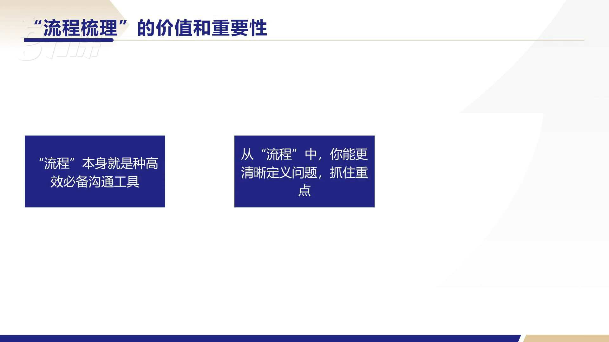

　　比如说现在我们在屏幕上看到的是一个微商运营系统的一个流程图。上边是说这家微商他线下的合作怎么来展开，？从这个消费者来到他们办公室登记，要判断他是否已有什么商城的会员账号，再到说我要不要给他开通账号，再到说他可能要缴纳相应的贷款，财务再审核通过，在后边怎么样。除此之外，还有线上合作的这么一个流程图，？各位试想一下，假设你现在这家公司主要负责的工作，就是说去开通相应的申请者他们的一些平台的商城的这种账号，对不对？如果你看到这么一个流程之后，其实你是更能够知晓这个业务运作的全貌是怎样的。你的上游都有谁？你的下游又要跟谁来协作，然后包括你现在如果跟你的上下游协作不顺畅的话，可能会是哪儿出了问题。

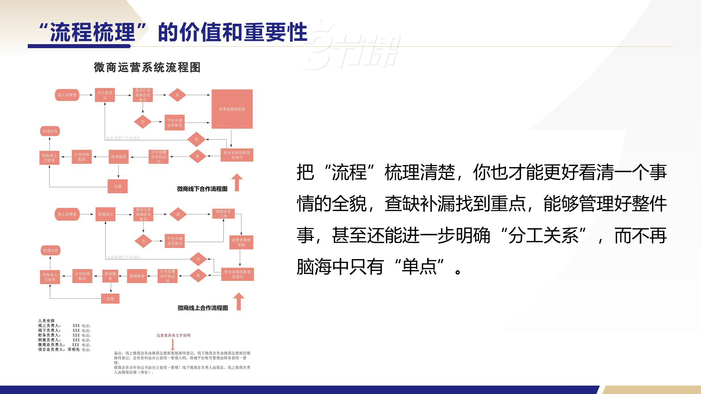

　　甚至说你可能跟你的上游协作不顺畅，可能再往前推，他的问题的根源可能会出现在更前端更早先的可能某一个环节上。所以当你具备这样的视角，你把流程梳理清楚之后，你是能够更加看清一个事情的全貌的。你也能在其中去查缺补漏，找到重点，还能进一步可能依照这样的流程图来去明确你跟其他人之间的分工的关系，而不再是说脑海中只有重点。所以流程梳理的很清晰，对于你去看到事情的全貌也会具备非常重要的一个价值，这是第二。

　　第三就是流程这件事儿，一定也是你可以去高效借鉴一些成功案例的基础。我们也来看一个案例，比如说你某天在朋友圈或者在一个社群里面，你看到有一家公司他可能做了一个什么海报裂变拉新的这么一个案例。你发现了这个海报它传播的很广，它非常的成功，对不对？如果你想对他进行借鉴，或者想对这个案例进行研究，你得怎么做呢？很简单，你一定得是说去细致的梳理这背后这个海报背后它整个的一个裂变拉新的流程是怎样的？如果梳理清楚之后，你会发现它整个海报的传播引流前端一共可能会有四个不同的起点。可能会有说现有的社群，有用户朋友圈，有他的工号，还有一些外部的渠道，？

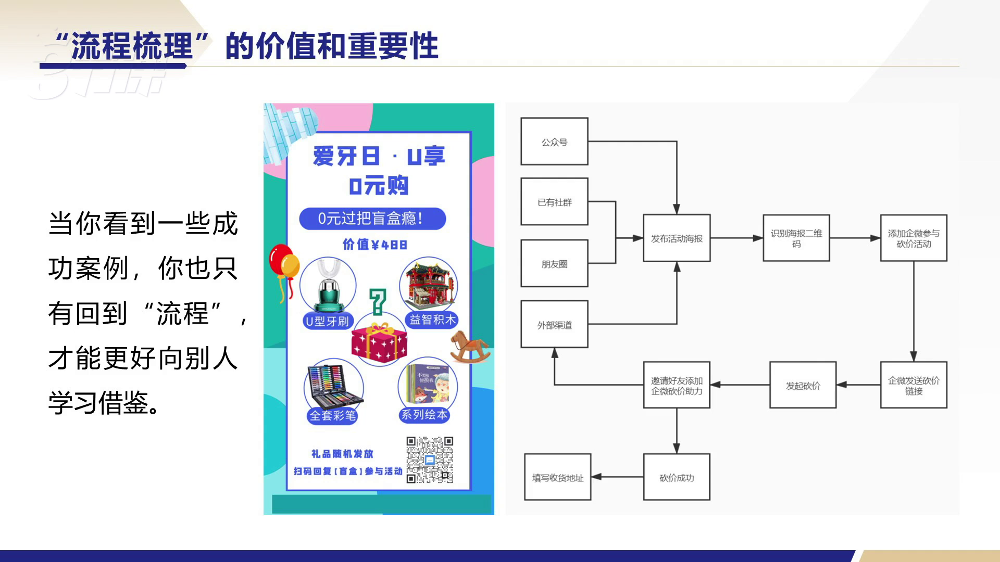

　　用户扫码之后，那就添加企微，在企微上会收到个自动回复，然后去参与砍价活动。那你回复了他一个消息，启巍就会给你发送砍价的一个链接。然后你发起砍价，这时候会再邀请你的好友来添加企微去砍价，来为你来助力。当你邀请的好友达到一定数量级之后，砍价才会成功。砍价成功之后，你才去填写收货的地址。你要知道这么一个活动，如果你想要去完全的copy借鉴，那你你就一定得把他的整个的这个流程全部体验完。并且把整个的流程都梳理出来，变成一个这样清晰的流程图。

　　只有这样你拿着这流程图，再跟你们的产品研发去沟通说，你看我们想做这么一个活动，他该怎么办？他该怎么来进一步落地，这样的话才会更加的清晰。而不是说你就看到一张海报，就是说这活动很棒，我也想做。但望下我到底该怎么做呢？难道我也做一个一模一样的海报附个体位就完事儿了吗？？肯定不是这样的。所以流程梳理很多时候也是我们向其他城官吏进行借鉴件的一个重要的基础。

　　所以说到这儿，我们就要把事情进一步往下落地一下了，我们就得更具体来聊一下。我们要做流程梳理的话，到底如何才能梳理和绘制好一个流程图呢？所以我们继续往下哈那这里边我们首先得知道流程图它到底都有些什么基本的要素来构成。常见的流程图最主要的一些在其中会出现的符号，大概就是这五种符号。第一个是圆形的一个框，它叫起止框，它通常表示流程的开始与结束，这是第一个。第二个就是方形的矩形的一个框，这个叫做处理框，它表示流程中我要执行或者我要处理的某些重要的内容，这是第二个。第三个就是一个菱形，它叫判断框。它基本上是用在对于流程中某一条件进行判断，用来决定执行。

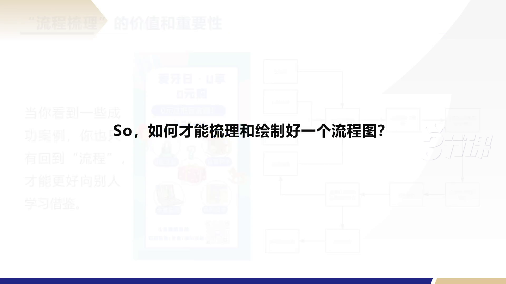

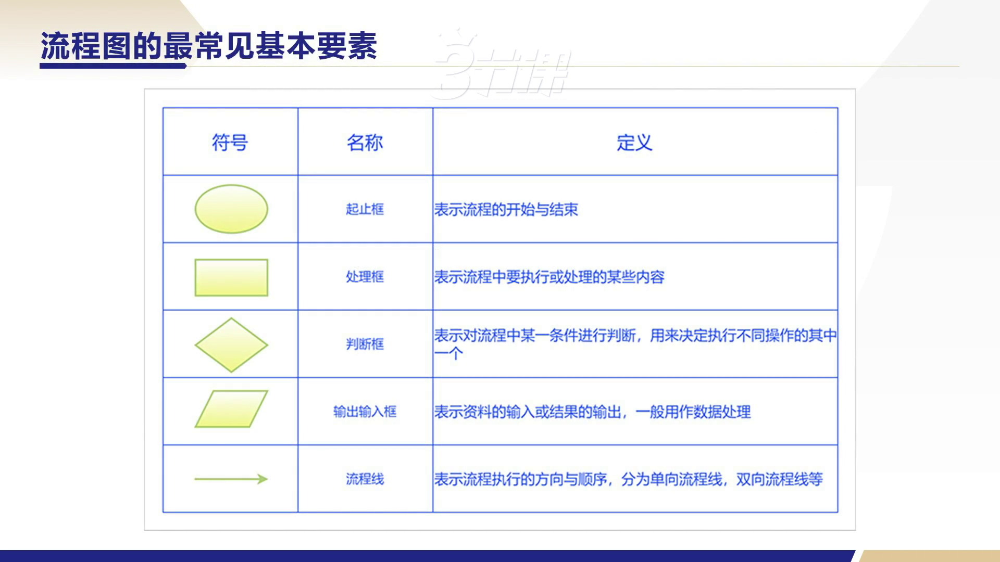

　　说我不同操作当中的其中一个。比如说一个用户在一个电商的页面？当他点击支付的时候，其实这时候可能会有个判断，就判断这个用户是否已经是登录状态。如果它已经是登录状态，那就往下进入调起支付流程。而如果它还不是登录状态，？那也许会弹出来一个注册登录框，这就是涉及到相应的一个判断。

　　那再往下第四个就是输出和输入框。它基本上在流程中用来表示我们有些资料的输入，或者有些结果的输出，它一般都用做这个数据处理。比如说我们在有一个流程当中，当这个流程走到第三步的时候，可能需要我们在后台调取一个相关的数据或者一个信息来进行输入，来支持这流程往后来去更好的完成。也许我们在第三步这个部分，也许在下边就会有一个输入输出框，它调取出来跟上边的流程能去衔接起来。

　　最后就是我们的流程线，它一般就用来表示我们流程执行的方向和顺序，它一般也分为说单向流程线和双向流程线。通常我们见到最多的还是单向的流程线。所以首先这是流程图当中最常见的5种的基本要素。就像我们学习一门语言要先掌握一些重要的词和句式一样。如果把流程图当作是一种沟通协作的语言，那上边我们看到的这五种符号，其实就是它里边一些重要的句式，或者一些重要的这种词。我们先记住了它，才能用它们来去组织成我们要跟其他人沟通的一个完整的流程图。

　　好，我们已经知道了这5种基本要素之后，接下来我们就来具体聊一下。如果现在我们就拿到说有一件事儿我们要梳理它的流程，这时候我们到底怎么来做具体的梳理呢？其实绘制流程图也有几个重要的基本原则，我们依次来说一下，其实并不复杂。

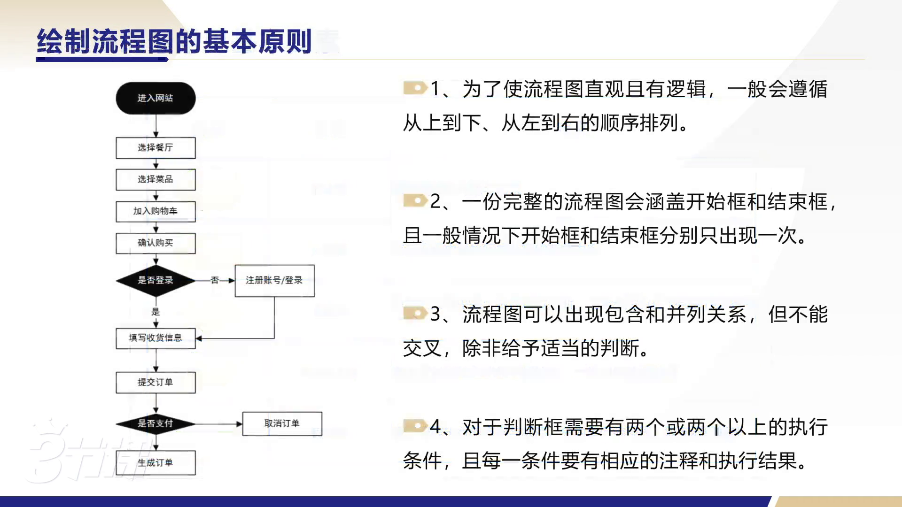

　　首先第一个，为了使我们的流程图直观并且有逻辑，我们绘制流程图的时候一般都会遵循从上到下，从左到右的一个顺序。也就是我们流程的起点一定在我们整个图的最上方或者是最左部，我们的流程图的往下的延伸，它的一个流程发展的顺序就是。上到下，左到右，大概就按照这么一个顺序来去往下推进，这是第一个。

　　第二个的话是一份完整的流程图，通常会涵盖开始框和结束框，？开始框、结束框就都是我们刚才说的那么一个圆矩形的这么一个这种符号，？用它来去代表就OK了。并且一般情况下，我们的开始框和结束框在整个流程中分别只出现一次，而不能是多次，然后这是第二个重要的原则哈那第三个就是我们的流程图可以出现包含和并列的关系。但一般我们不能交叉，也不建议流程当中有大量的交叉，否则这个流程看起来就会显得非常的混乱。除非我们是在交叉过程中给予说有适当的一些判断，就加入了有我们的菱形的这种判断，说它满足A条件，那这个流程可能会跟另外一个流程可能稍微有点交叉之类的。否则的话一般我们的流程图当中是不能有相应的交叉的这是第三个。

　　第四个就是对于判断框需要有两个或两个以上的执行条件。并且每一条件最好我们要有相应的注释和执行的结果，？就比如说你看我们现在左边这个流程图，它基本上是一个我们在某个这种点餐的APP或网站上，？它整个一个创建订单和支付完成的这么一个流程，那这里面就会有一个说，当我点击了购买之后，这个网站要判断我是否是登录状态。如果是啊，那就进入到我要填写收货信息。如果是否，那就调取到我们的注册登录的这样的一个这种流程，？所以就判断框它需要有两个或两个以上的执行条件，每一条件背后我们都要有相应的注释。

　　注释就是说你看我可能是说满足什么条件的时候我走这个流程，满足另外一个条件的时候我要走那个流程，？那走每个流程之后，我最后的执行结果是什么？我得把它去注明清楚。这基本上就是我们绘制流程图的四个基本原则。

　　好，我们再进一步往下，就是我们在绘制流程图的时候，其实流程图又有3种常见的结构。第一种是顺序结构，这个比较容易理解哈那就是一条线我往下走？然后整个流程肯定是不走回头路的，也没有分叉？这第一种结构。第二种叫做选择结构，就是我流程图可能走到一定的环节之后，它会有一个分叉，出现了一个岔路？那这两个分叉会导致两种不同的结果，这是第二种选择结构。

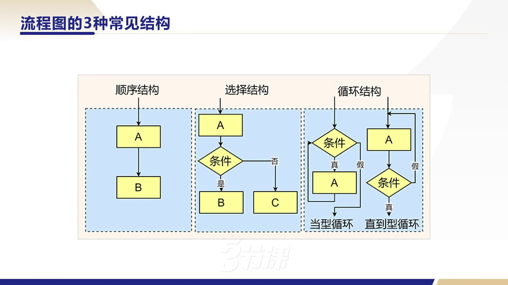

　　第三种叫做循环结构，也就是我流程图走到可能某个地方之后，那也许会做一个判断。这个判断的条现如果他是其中的某个分支的话，那整个流程会进入到某一种循环当中，然后循环又有两种，一种叫做当行的这种循环，就是当我的条件满足什么什么这个状态的时候，那我的流程才会往下继续执行，否则流程继续循环。那另外一种，就是直到型的这样的这种循环，就是我整个这个条件可能在运作，直到我这个条件可能满足了什么什么这个状态，那我的流程继续往下走。否则如果我条件还没有满足的时候，那我整个流程就在无限的循环。所以流程图又有这么三种常见的结构。当然我们通常在绘制和梳理一个流程的时候，一个大的流程里边它可能同时会包含这么三种结构。

　　但无论怎样，我们整个流程图的绘制和主要的组成原则，基本就是我们刚才说的有五大核心的要素，？有四个绘制流程图的基本原则，还有三种常见的这种流程图构成结构。但是我们也得说一下，就流程图的梳理和绘制，它也必定是个需要大量练习的活。里面潜藏着N多的坑。有很多的新同学我们在梳理流程的时候，经常会遗漏掉很多的元素，遗漏掉很多的信息。或者是我梳理的流程在呈现和对外的表达上，里边可能有很多的信息误差，会导致你的沟通协作的效率会大大降低，？所以这里边我们也来一起看几个例子，稍微感受一下。

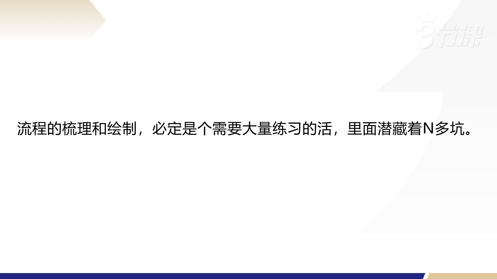

　　我们感受一下梳理流程里边需要的细致和完整性，到底可能会到一个什么样的程度。首先我们先来看一个例子，这个例子的话是某个某家大公司，它的一个线下活动的一个执行流程。这个流程在一家公司里边有小A小B这两个人同时分别来做一下梳理。我们来感受一下，这两个人梳理出来的流程有些什么样的差别。首先是小A梳理流程？你可以大概看到整个的线下活动策划执行的流程基本就是这么一个感觉。确认活动目标，确认活动方案，确定活动分工，活动执行，最后活动复盘就完事儿了。这是小A梳理的一个所谓的流程。

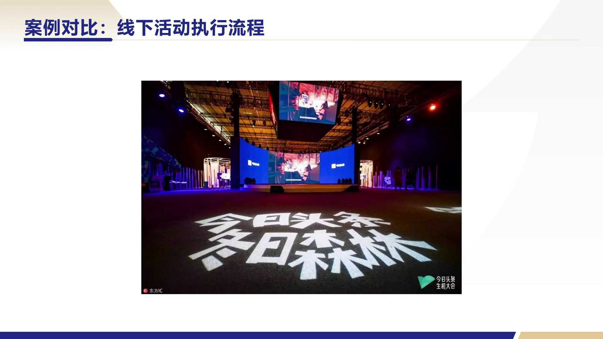

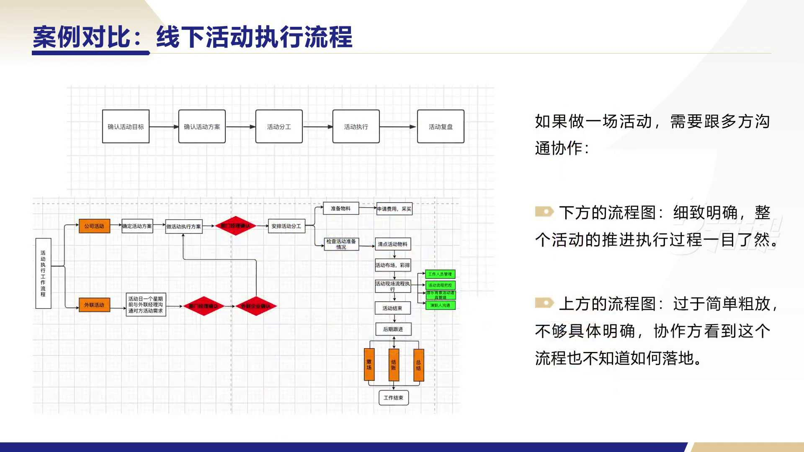

　　那我们再来看一下，小B可能也做了这个流程梳理，他梳理的流程大概长什么样呢？你可以感受一下，它是带着一个内部的视角来看待整个活动的流程。首先是说在公司层面上，我确定活动方案以及做活动的执行方案。这里边涉及到可能说我要跟一些外部的合作方来去联动，那我要跟外联的这些合作方们，可能在活动日前一个礼拜之前，跟他们来去沟通相应的一些活动的需求。这样的话两边可能稍微还有一个确认，确认完了我要安排活动的分工，这里头涉及到我要准备活动的物料，物料要申请费用，做采买。采买完了之后，我肯定要去清点和检查活动各种物料的准备情况。再是现场我们要做活动的布场和彩排。

　　再往下这个可能是活动现场流程的执行，这里里边涉及到有我们现场人员的分工，有活动流程的整体的把控，有官方什么背景音乐的相关的管理，还有说一些涉及到相关的这种人员的演职人员的一些沟通。最后是活动结束，活动结束之后，后期还要有些跟进，比如说我们的撤场结账还有总结，这之后才是我们整个的工作结束。所以大家你可以感受一下，小B梳理的整个流程大概是这样的那这两个流程一对比，你可以感受到如果你在这家公司里边，你涉及到跟多方来做沟通和协作的话，那下方的这个流程图很明显，它是更加的细致明确的。

　　我们整个活动的推进执行的过程，其实可以在上面一目了然。但我们上方小A的这个流程图，它就过于简单粗放了，里边也不够具体明确。它会导致即便我们的协作方看到这个流程之后，他也不知道整个我们这个活动该怎么落地。他在哪个环节它该去做什么，它属于哪一部分？所以我们也提到了流程图存在的很大一个价值是帮助我们去做一个沟通协作的工具，所以既然是要做沟通协作，我们的流程图的梳理一定要细致明确并且完整，所以这是第一个例子，大家可以先感受一下。

　　接下来我们再看第二个例子。第二个例子我们不妨来看一下，假设你现在可能在某家电商APP里边来做运营的一些工作，？现在你可能涉及到说我要去梳理整个我们这个电商从首页到详情页的这么一个整个用户浏览购买的一个流程，并且要试着去优化这个流程，？老板就跟你说，你要可能把这个流程图先梳理出来。

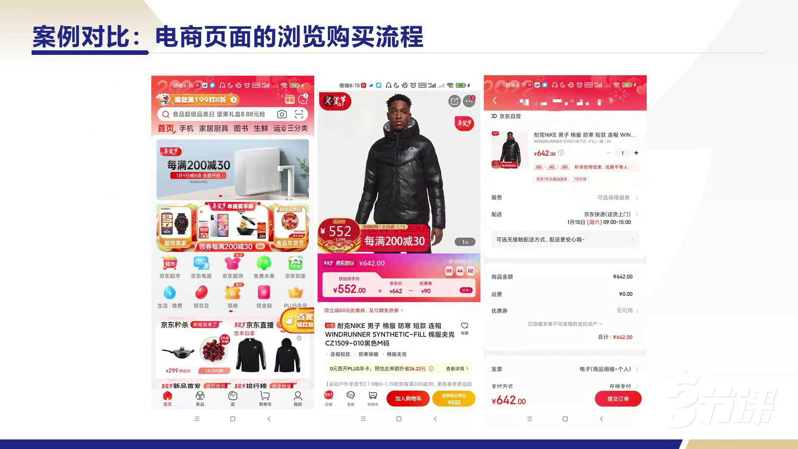

　　同样这时候也有小A小B两个同学，他们分别都去做了这个流程的梳理。那他们梳理出来的流程又分别长什么样呢？我们也大概对比一下感受一下。首先这是小A梳理的一个流程，？它这个流程首先在方向上就有点别扭，它是从右到左的这么一个方向。商品详情页到添加购物车，再到生成订单，开支付，最后是成功支付。

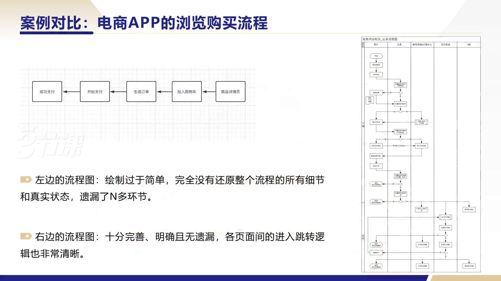

　　没了你看这是小A梳理的整个这么一个流程哈那对应的我们来看一下小B梳理的流程长什么样。你可以感受到小B梳理这个流程基本上好用户从首页进到我们的商品详情页，他点击立即购买？然后接下来的话可能是说我们要做一个判断，要检查我们相关商品的参数是否已经选择完全。什么叫参数？就像我们商品的尺寸、数量、颜色等等这样的一些东西。如果我们还没有选择完成的话，那我们应该提醒用户去做参数选择。如果选择完成了，吧？

　　那接下来的话，就要检查我们的用户是否已经是登录状态。如果没有调取注册登录页面，如果已经是登录状态，那就进入到我们确认订单的页面。再往下是检查我们是否已经有默认的收货地址，如果有，那就自动推荐填充我们的默认收货地址。如果没有，那就添加我们的这个收货地址。然后再往下的话，就是我们的商品参数选择的确认，并且可能正式提交订单。那再往下的话，就是检查我们的订单是否符合要求，以及往下进一步去调取我们的各种的这种支付流程。你看这才是一个电商APP从我们的产品的角度来去完整的呈现了它的一个整个的一个工作流程。

　　那你也可以感受到，如果你是在内部在做相关的一些工作，尤其涉及到说你要跟产品部门一起协作来优化整个这个流程的话。我们左边的这个流程图它的绘制肯定是过于简单的。他完全没有还原整个流程中的所有的细节和用户的真实的状态，遗漏掉了N多的环节。这些遗漏会导致你在你的同事，你在你的其他伙伴面前显得特别的不专业。而我们右边的流程图就显得非常的完善明确，并且没有遗漏各个页面间的这种进入跳转的逻辑。我在哪一步？我的哪些参数哪些状态没有配置好，我要去到什么样样的一个页面，会收到什么样的信息，它的跳转逻辑非常的清晰。这样的一个流程图才是高效并且完整的一个流程图。

　　说到这儿的话，你可能会发现，我们右边给你分享的小B所梳理的这么一个电商购物的流程图。你发现它似乎跟前面我们看到流程图稍微有一点点不一样，不一样在哪里呢？它在上方似乎在流程图基础上又增加了另外一个维度，？它会有说你看我流程中的每一步，到底是属于说这一步是发生在用户还是发生在我们的交易端，还是发生在我们的后台的账户系统订单中心里边，还是说支付系统里面，还是说是在CIM的这个系统里面。他大概做了这么一个划分。

　　所以由此我们就要引出来另外一个要跟大家分享的东西就是流程图的一个加强版，我们把它叫做甬道图。泳道图是什么概念呢？各位你大概看过游泳比赛对不对？游泳比赛基本上就是说我可能有N多的泳道，每个泳道都是一个选手？他在里边可能在去比赛。所以甬道图其实就是流程图的一种加强版。

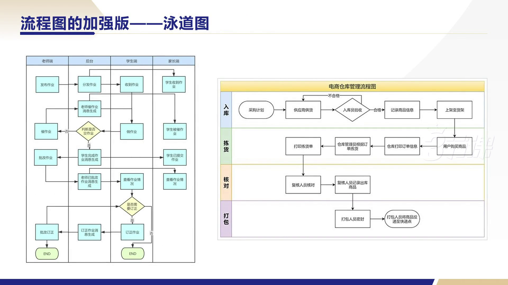

　　它通常用于说我们可能梳理了一个核心的流程。同时这个流程里边又分属于N多不同的人员或N多不同的部门，他们要一起来协作完成这样整个的一个流程，？所以我们就可以在这个流程图基础之上，用几个甬道把它去框定起来。每个甬道就属于一个角色或一个协作方。用这样的方式，我们把整个流程再去串联起来。

　　他对于我们去理解一家公司里边N多部门之间的协作分工可能会变得更加的清晰。比如说你现在在左边看到的，他就是一个某个教育APP？学生和老师在上面他们可能是如何去完成说围绕着作业的提交批改和发布，围绕着这么一个行为？己方是如何可能在个APP上完成所有的交互的。这里边有老师端，有后台系统，有学生端，也有家长端，他们之间会有各种各样的一个这种交互，那整个用甬道图来呈现这么一个逻辑关系就会变得非常的清晰。

　　而右边我们看到的是一个电商仓库的管理的这么一个流程图。这里边我们也会发现，你看他把整个这个流程，就是按照我们的这个角色分工来依次就变成说我们入库、拣货、核对和打包，？大概有这四组人，这四组人他分别负责的就这流程里边的，可能就各自有几个环节，这样的一些呈现也会变得非常的清晰。所以各位在你的工作中，如果你涉及到多方协作的流程图，并且这个流程还稍微有点复杂的时候。其实为了方便大家更好的去进行沟通和信息对称，你可以考虑使用甬道图这样的方式来去做呈现。

　　好了，关于流程图的梳理我们大概就给大家分享到这儿了。最后还是要强调一下，流程梳理这件事儿本身就是一个熟练工作。任何人一定都需要大量的刻意训练，才能确保自己能够形成。在流程面前我们不遗漏任何关键环节，加上可以让我们的流程图真正成为一个高效沟通工具。据的这么一个能力。所以也建议大家听完这门课之后，绝对不要只是听过就算了。一定要在自己的工作中，或者你在做很多案例的拆解时候，有意识的去多次训练自己流程梳理，流程绘制的一个能力。这样才能真正的把所谓流程化思维内化成自己的一种核心能力。好了，我们的第一节大概就给大家分享到这儿。

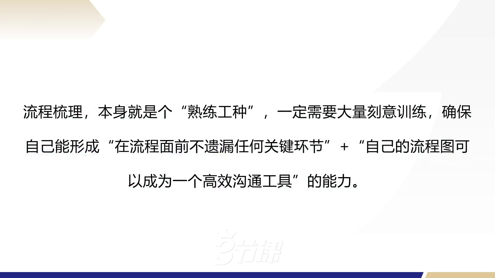

# 第二章 流程化思维背后最常见的数据漏斗应用

　　2025年08月22日 18:32

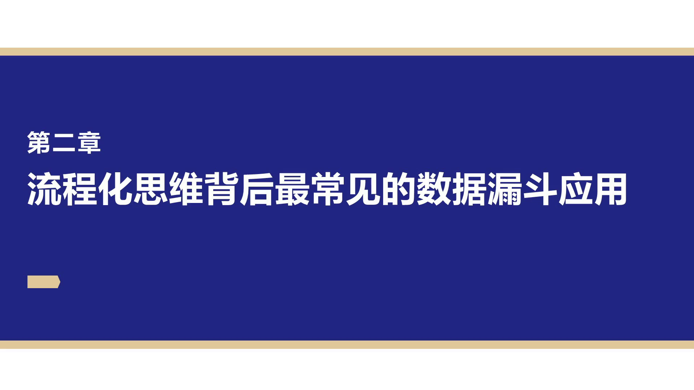

　　好，接下来我们进入到这门课的第二小节，流程化思维背后最常见的数据漏斗应用。在上一节里面，我们已经给大家介绍了什么是流程化思维，以及为什么它非常重要。这节里边我们更进一步，我们把流程化思维这件事儿跟数据漏斗去结合起来。

　　大家但凡是做运营工作，一定都知道数据对于运营其实非常重要的。而在所有的数据应用当中，其实漏斗可能是最常见也最重要的一种数据应用了。所以你会发现流程这件事儿和梳理流程它为什么重要？其实还有一个很重要的原因，就是我们一切流程背后都意味着它是一个数据漏斗。我们做任何业务都需要为业务去构建起来一些关键的数据漏斗，并且围绕着数据漏斗来进行相应的数据分析，去不断的优化和调试，这才是运营工做的一个常态。

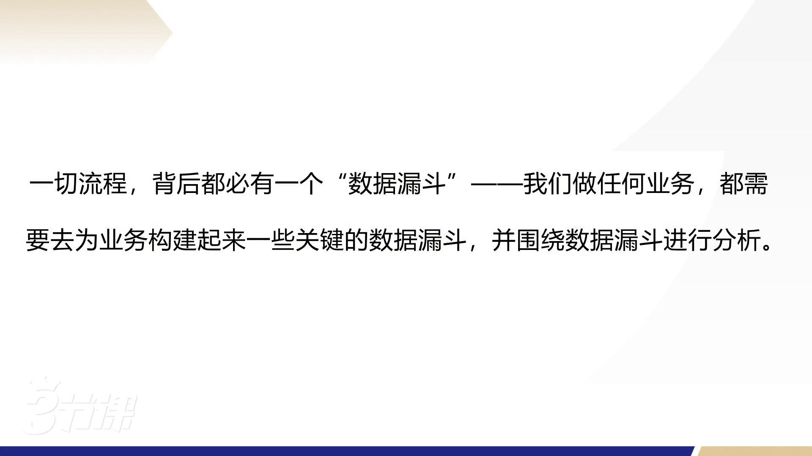

　　比如说我们最常见的一个数据漏斗可能就是AARRR这样的一个模型了，？在用户增长里面，然后从用户的获取到激活，再到用户的留存，再到用户可付费产生收入，最后可能是自传播。你看这样从上到下，它就是一个漏斗。你把这样一个漏斗去定义清楚了，相关的数据模型建立起来了，你能看到每一步的数据，那你就不能监测到你整个用户增长工作的一个健康度，以及他的问题可能会出现在哪里。

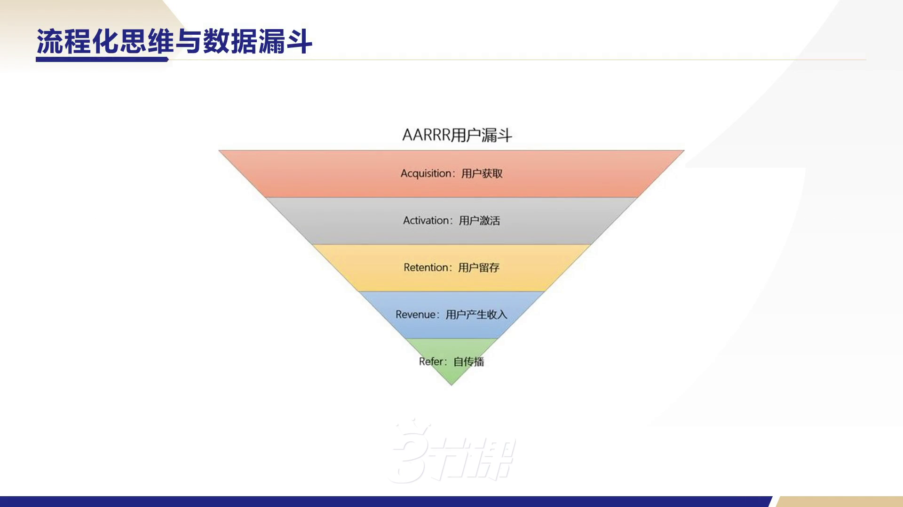

　　同理可能从我们一个APP的推广和引流来说，它从启动到用户进入首页，再到说他在首页里边去浏览我们的什么直播列表，再到进入直播播间，再到他观看直播，甚至再到最后他直播间的停留的时长等等。这样一串流程下来，它背后你会发现也有一个清晰的数据漏斗。同理你把这个数据漏斗去拎清楚了，？从最初你看启动打开APP这儿大概有2000个人进来了。再到进入直播间，可能有1200多个人。观看直播的人可能就差不多，？然后再从前到后，基本上我们就能大概知道，用户他在漏斗的整个哪一个环节，哪一步可能流失的比较多。我们在其中有没有一些更多更好的一些优化的空间，也会变得一目了然，所以这是第二个例子。

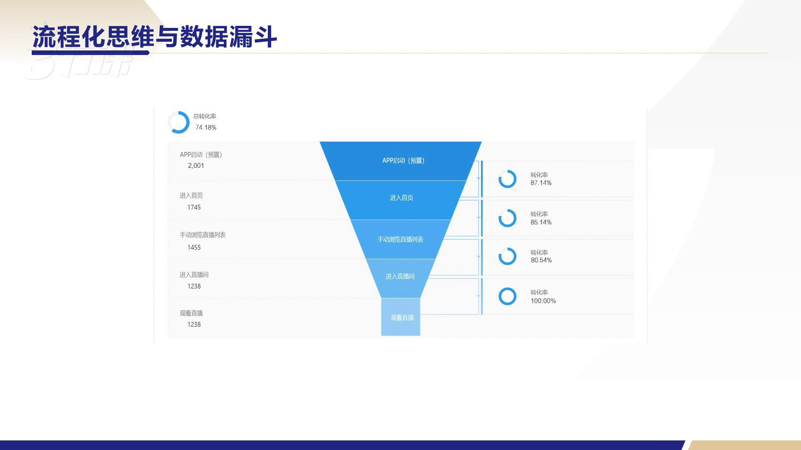

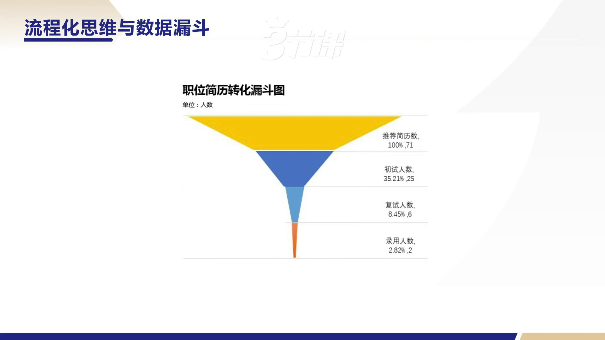

　　再有的话，其实可能像日常的一些工作中，大家看起来跟运营不是那么相关的。比如说我们的团队里面的人员招聘，？其实你真把它拎清楚了，背后也是一个数据漏斗。比如说在招聘的工作中，从我们最早前边收到简历，再到我们的初试，再到我们的复试，再到录用，甚至最后说我们发offer和接offer等等这些环节。如果你全都细致的梳理出来，那它其实也是一个数据漏斗。有了这样一个漏斗之后，它也能去指导我们的招聘工作。

　　到底我们的问题可能出在哪一步？我们是最前面根本就收不到简历，还是说简历的质量不高，？从简历到初试这个环节，它的流失就特别大，还是说我们可能在发了offer之后，最后接offer的人可能太少，那这样一系列的一个漏斗看下来，也会让我们的很多工作变得非常之清晰。

　　所以各位一定要知道，漏斗这个事儿在运营工作中是无处不在的，也是最重要的一种数据应用。而所有的流程，我们所讲的流程化思维背后，它所有的流程背后一定都有一个数据漏斗。我们一定要养成这样的意识。我们看到所有的工作？脑海中把它聚化成一个流程。那流程背后我们自然第一时间就会去要相应的数据。就会有一个漏斗的模型指导我们去怎么看，怎我们去分析这样的一个数据。

　　好了，这个意识建立起来之后，我们接下来可以跟大家简单介绍下运营的工作中最常见的四种数据漏斗。这四种数据漏斗分别是哪四种呢？第一个就是我们的投放转化，就是我们在别的一些网站，在信息流或者在一些比如说什么微信公号的这种投放上，？我们可能买一个广告，然后投放营销背后有个转化漏洞，这是第一种。第二种就是我们的社群运营的转化的这么一个漏洞。第三种，就是我们APP的用户留存的这么一个漏斗。而第四种，就是我们通常做内容？可能会有内容完读和分享的这么一个漏斗。

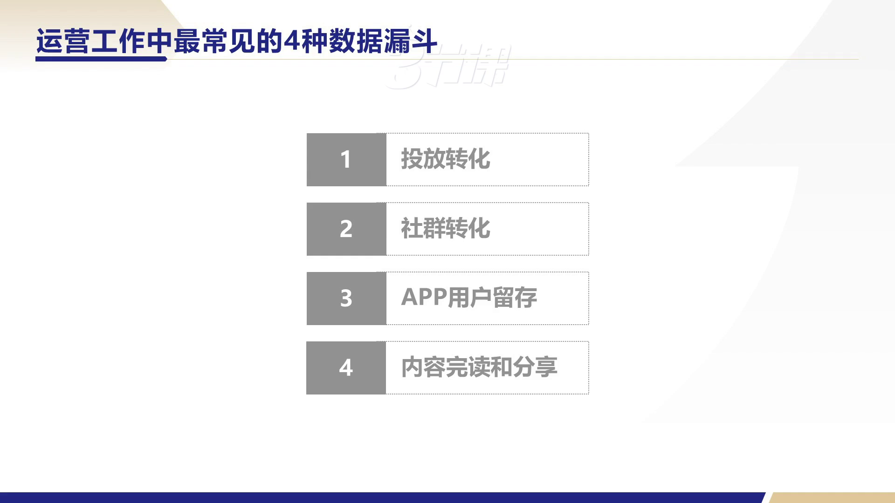

　　我们接下来会通过案例来带大家快速过一下这四种数据漏斗，以及也顺带说明一下，这四种漏斗背后我们如果看数据的话，通常可能会怎么看。给大家总结一些最朴实的一些基本逻辑，让大家对它们四种数据漏斗简单的能有个概念，好吧？好，那我们就一起来看我们的第一种常见的数据漏斗，投放转化的数据漏斗。我们先直接总结一下，其实投放转化数据漏斗它通常会长成什么样呢？它通常可能会有这么一个逻辑，就从最前端既然我是投放，那就我广告展示的数量。再往后那就是我广告被点击的数量，再往后我所有的广告背后都一定有一个着陆页或者叫landing页，？那这个landing页它浏览的一个完成的这么一个数量和相关的数据。再，浏览完landing页之后，用户肯定会点击进是我们的支付或者注册的一个流程，？

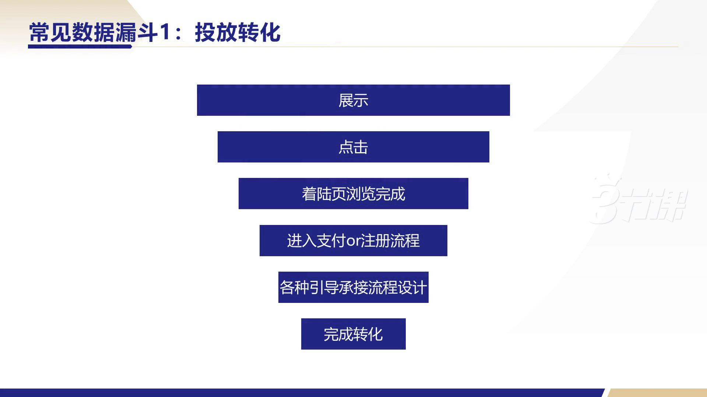

　　那当用户点击做了支付或者注册之后，后边通常我们会有一系列的各种引导承接的这么一些动作。那这些动作可能每家公司或每个业务里头可能都会不一样。比如说有些业务里头他投放转化可能是说用户先付费之后再进群。有些业务就是用户直接付费之后，填完资料就等着我可能发货，然后就完成了？然后还有一些业务，可能是说我可能还得让你来添加我的微信，可能再跟我聊两句，或者在线上直接就跟我可能直接通过电话来聊两句之类的。所以这里边会有一些不同的流程的设计，而最后就是完成转化了。

　　所以通常投放转化数据漏斗，它的大概的逻辑会有这么一个逻辑。最前端一定是展示，最后端一定是完成转换。中间有各种的点击，还有就是有各种我们所设计的引导和成接的这么一个流程。这是一个投放转化漏斗的一个基本的状态。好，接下来我不妨也再具体来看一个例子，感受一下投放转化的整个一个过程，中间可能会有哪些环节，以及我们在看数据的时候到底会是一个什么样的感觉。

　　这个例子大概是这样的，就是某家在线教育公司。其实大家知道现在有很多在线教育公司，都会通过像信息流，抖音之类的再投一些广告。他们的广告展示完了之后，可能用户就点击就会进入到一个体验课的这么一个详情页，？然后详情里边会告诉你说，你看我这有个什么什么很棒的这样的一个课程，我有哪些什么退款的这种保障之类的？然后反正就引导你可能点击完广告之后，去详情上就购买我的体验课。

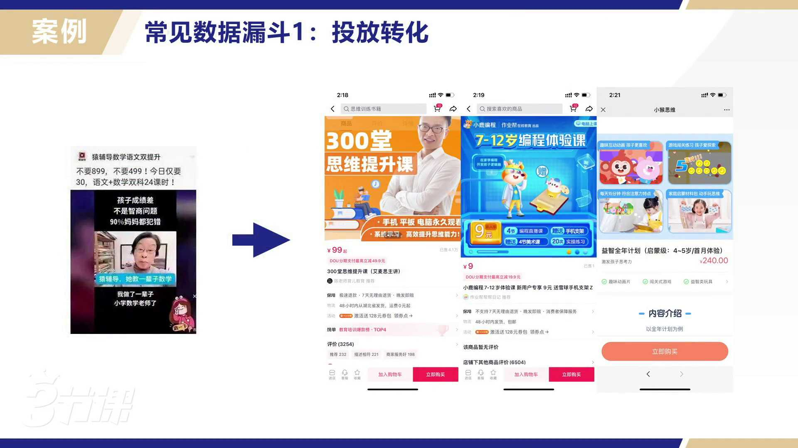

　　那一旦购买完体验课之后，我点击了购买之后，这时候我就需要去填写我个人的一些资料，？然后我的姓名，我的什么手机号，然后我的什么学生的信息之类的，他就要求我填这么一个表单，填完之后就确认支付。确认支付完了之后接下来就是我要添加班主任，或者是等着这个班主任他来加我的微信，？加完微信之后进到群里边，那群里边班主任就会开始跟我去做一些简单的介绍说，你看我们这课是怎么样，可能需要你做些什么什么样的这种准备。对，然后大概可能是这样一个状态。而此后的话，班主任基本上就是在群里边来服务于我，作为一个用户，让我来听课。

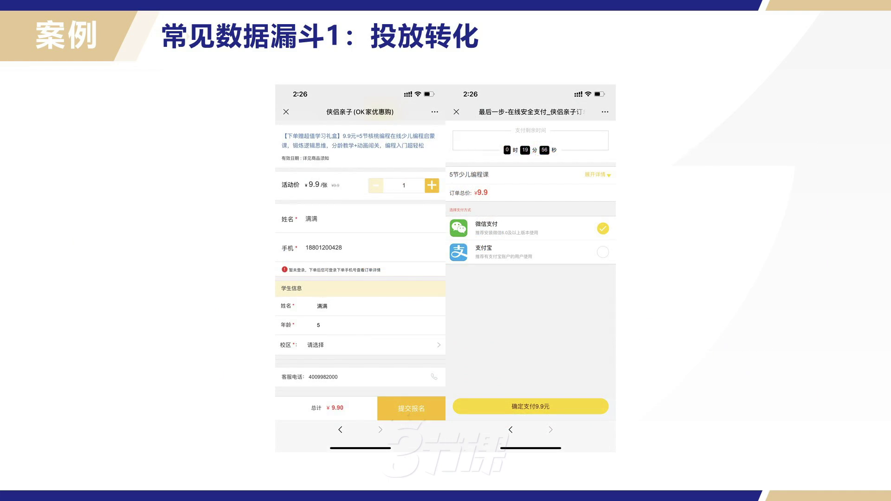

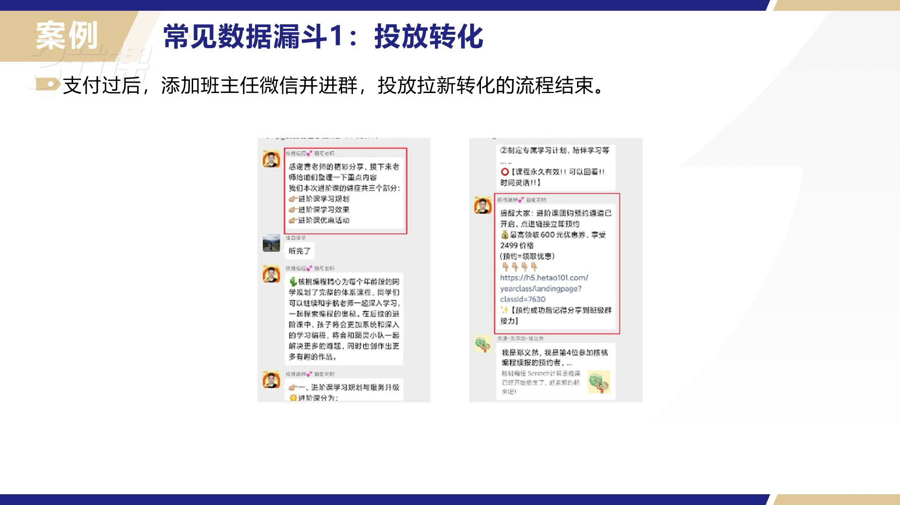

　　听完课之后，又给我推一些相应的正价课，最后来完成一个相应的转化，这是一个基本的一个整个的过程。好了，在这样一个过程的背后，如果我们把整个流程都梳理清楚了，你看这背后会有个什么样的转化漏斗呢？其实这背后他整个是这样的，从说我们广告的展示，再到用户点击广告，再到用户填写表单留下电话号码。我们作为广告主，我们要对电话号码做一些过滤和去重。我们要对电话号码进行分配，分配给不同的销售。销售要打电话给用户跟进来确认，再那就约用户来进行体验课的试听。最后用户完成体验课。完成体验课之后，我们再有一波的转化的引导，让用户去完成课程的购买。

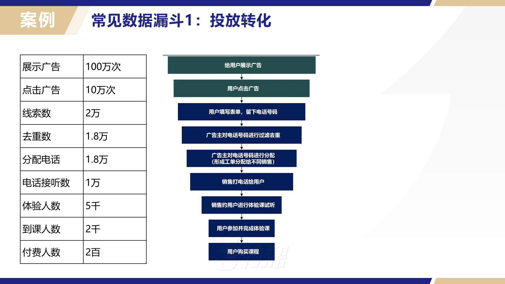

　　你看这样一个漏斗整个梳理清楚了之后，整个漏斗里面每一个环节它的数据到底是多少？我们基本上也就会变得非常清晰。迅速就能拉出来这么一个清晰的数据漏斗。

　　据此我们来看整个流程当中，整个在链路上哪个环节，然后我们的问题可能是比较大的，所以再往下我们基本上就是一步一步一个一个环节的来做一些比对了，去看我们哪个步骤的这个流失率是比较高的。比如说在上边的整个这个链路，整个这个数据漏斗里面，我们会看到从分配了电话到电话接听的这个环节上，我们的流失率是比较高的。它的流失率差不多有个40%往上了，1.8万的。电话线索数，最后接听电话的人只有1万。然后再往下体验的人只有5000，？你看这两层漏斗下来，我们的用户一下子就流失了百分之六七十的样子，对不对？

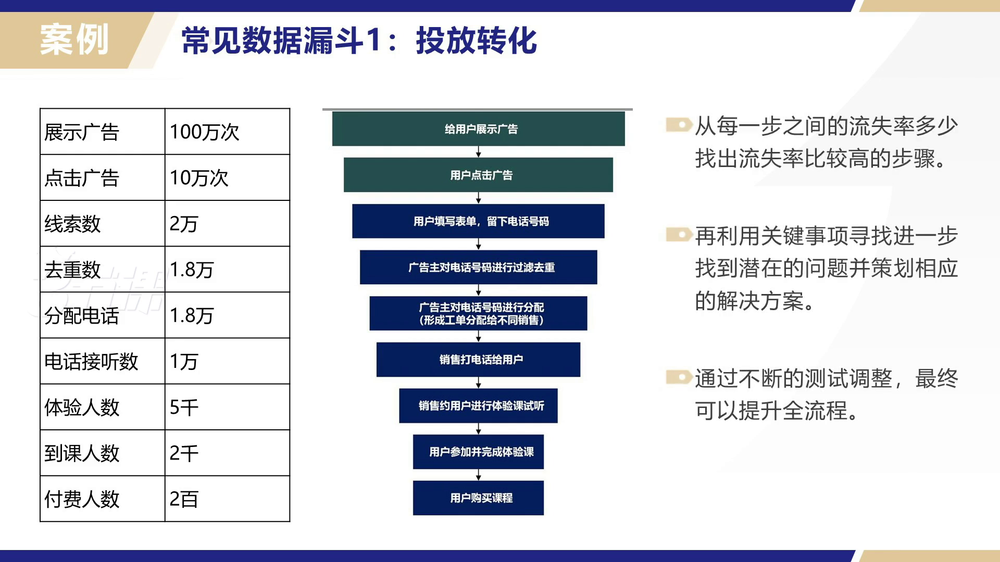

　　所以这两个环节上，它的问题可能就会比较的大，值得我们去进一步精细的去观察分析一下，到底这两环节上那发生了什么发生了什么让我们的用户流失了这么多人？为什么用户不接电话？给我们打电话时间不对吗？还是说是我们自己的这个电话呼出的号码，会被人家会自动的进入到一个黑名单还是怎么样？以及电话接通完了之后，来填人也不多，？这个不多又是什么样的原因？我们也要做一些用户的回放。找到这样一些线索之后，我们再通过不断的测试调整，最后就可以去提升我们整个数据漏斗的一个大的转化率。

　　所以这是我们给大家分享的第一种常见的数据漏斗，投放转化的这么一个漏斗。接下来我们看第二种常见的数据漏斗，就在社群内的一些转化的数据漏斗。在这一个环节上，我们可能针对社群里面的转化，把它大概是一个什么样的过程，大概社群里面我们会看一些什么样的数据，怎么来看，我们简单的来拎一下。其实各位你要知道，今天社群对于我们来说，已经越来越是一种非常普世的营销转化的这么一个这种场景或者是工具了。有非常多的公司都会把用户引到自己的社群里边，在社群里边再来做一些转化和成交，对不对？所以在社群转化背后常见的一个数据漏斗，它会是一个什么逻辑呢？然后我们用这张图来给大家串一下，其实最常见的社群转化的一个漏斗。它从前到后大概可能会有这样的一些过程和这样的一些背后的逻辑。

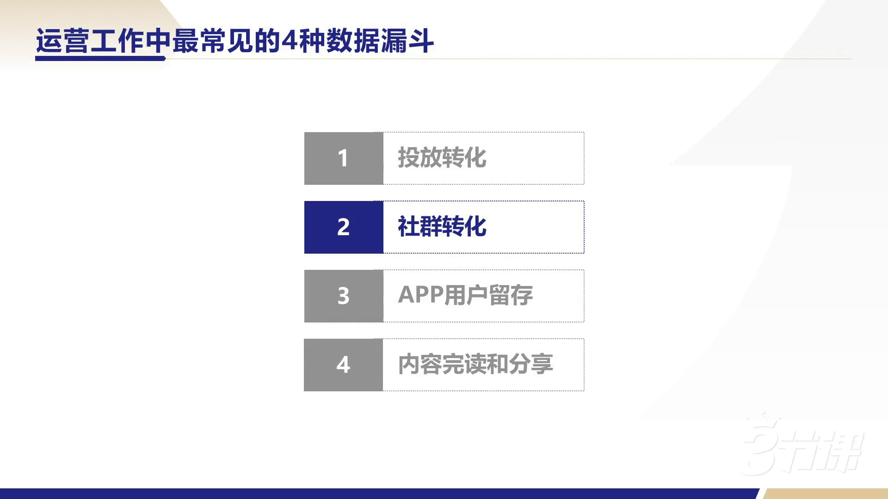

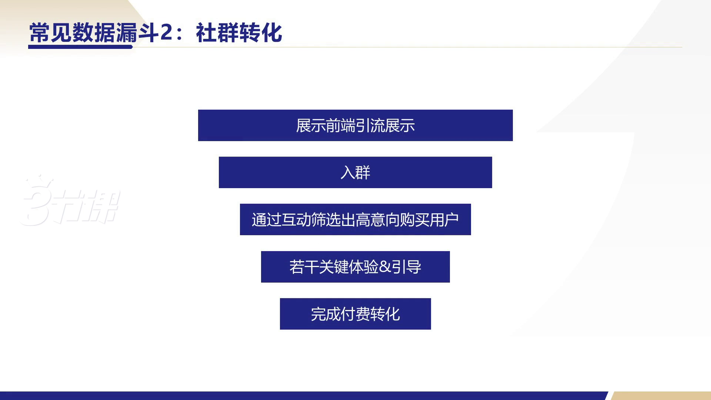

　　首先一定是前端的引流和展示，就我一定要在某个地方去找我的用户，并且向他们展示说你看我这有这么一个群。然后接下来的话肯定会有说用户要入群。在接下来非常重要的一个环节，就是我要通过群内的一些互动来去筛选和过滤出高意向购买的用户。因为你100个用户进了群，有些用户哈他最后其实基本上是不会有购买意向的那我们也许就不需要去骚扰人家，也不需要把我们的时间精力就放在他们身上，因为人家连购买的意向都没有，对不对？相反的，我们应该是把高意向购买的用户筛选出来，面向他们往下去做一些关键的体验和引导的这种设计。这个关键体验和引导可以是在社群里面，也可以是把他从社群里头从线上引导到线下来，让他再来做一些实地的体验。最后再是我们的完成付费转化，大概是这么一个过程。所有的社群转化背后基本上都遵循着这么一个逻辑，所以我们我们要看一个数据漏斗的话，也基本上会是按照这个逻辑来看。

　　从最前端我们的引流展示的这个数量，到我们的入群的人数，再到说我们的高意向购买的这种用户人数，再到说我们可能设计了一些什么样的关键的体验，有多少人来参与了这种体验，有多少人接受了我们的引导，他又给我们留下了什么样的反馈。最后完成付费转化的人又有多少？这也是社群转化的一个基本的数据漏斗的逻辑。

　　好，接下来我们不妨也来看一个具体的例子来稍微感受一下。这个例子的话是一个4S店，汽车的4S店。他们可能最早就通过线下的像什么车展或者别的一些活动？让大家来加微信领福利，于是就积累了2 2000名对于该品牌的这个车比较感兴趣的这种微信用户？马上就要迎来整个这个品牌它年终的这种大促了，所以他就要想办法对这2000个领了福利的，对他品牌感兴趣的这种用户想想，可能要通过微信群来做一些运营，来做一些相关的促销和转化。于是接下来他就是针对这2000人发朋友圈和私聊，然后做了一系列的这种群发宣传。说你看我们有一个我们品牌车友的这么一个交流群，？就组建起来了一个200人的这一个社群。

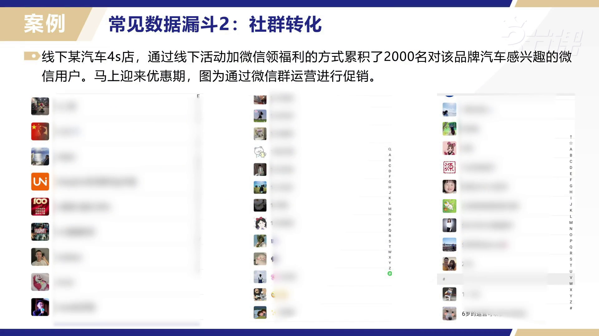

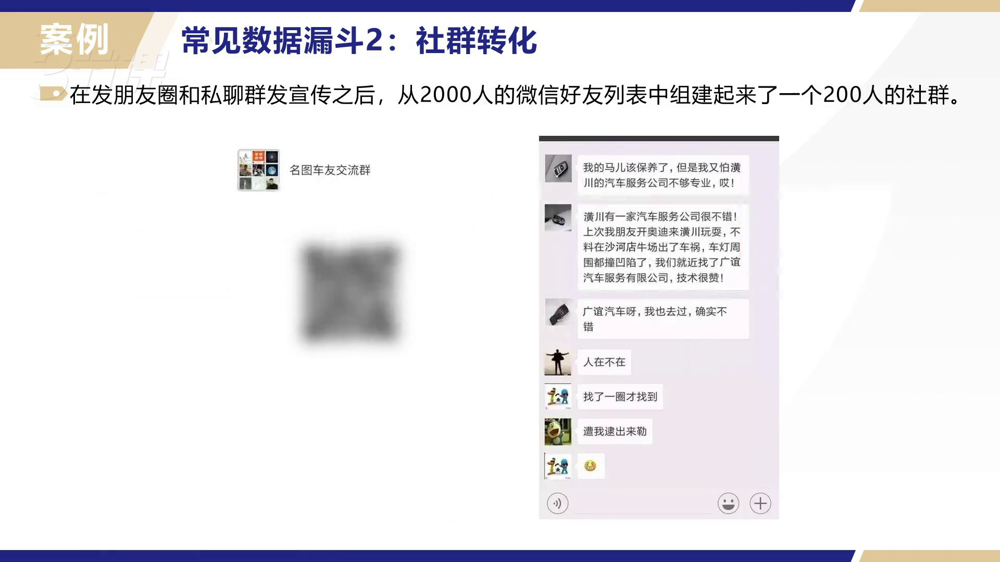

　　接下来的话，在群内他就围绕着我这个品牌一些要新款上线的车，定期会发起一些讨论。并且他会将经常参与讨论，表示出这种换车意向的用户来进行一些标注打标签。这些人就是我们的高意向的用户了，？

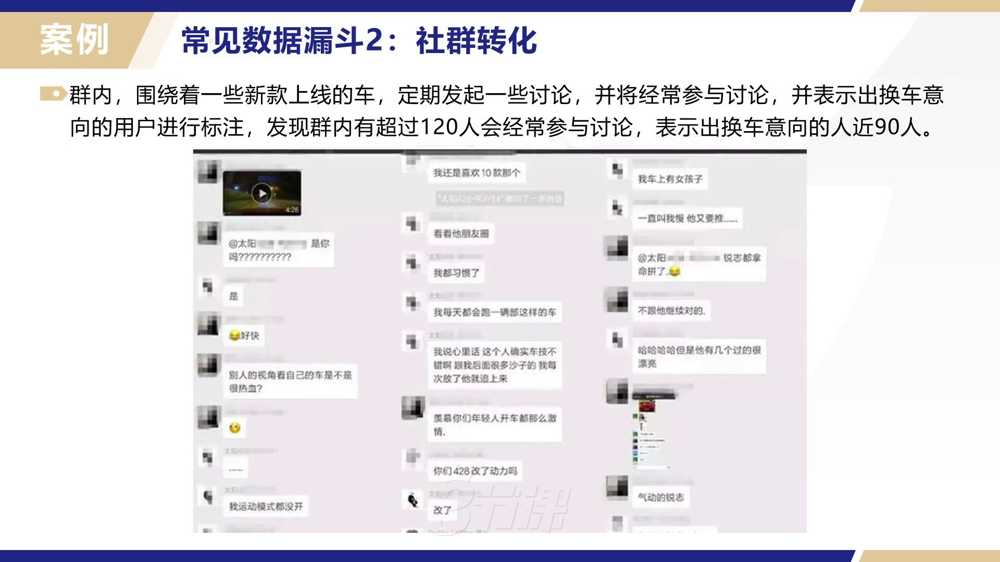

　　他发现了群内会有120个人会经常参与一些，比如说我新上线的车的这种讨论？这个车性能怎么样，那个车车和这个车相比是否它会更省油等等？会有120人经常参与讨论，表示出明确换车意向的人有将近90人，所以你看高意向用户在这200人的群里边就慢慢的浮现出来了。

　　再接下来的话，他就开始邀约有过标注的这些群的成员来到4S店，进行我新款车的试驾。并且承诺我的群成员一定会有相应的优惠，而且也可以参与我们的活动抽奖。最终有50个人来到线下参与了他的试驾的活动，最后有20个人购买了他这个品牌的汽车。所以整个他的一个社群运营在这个case里面大概就是这么一个过程。

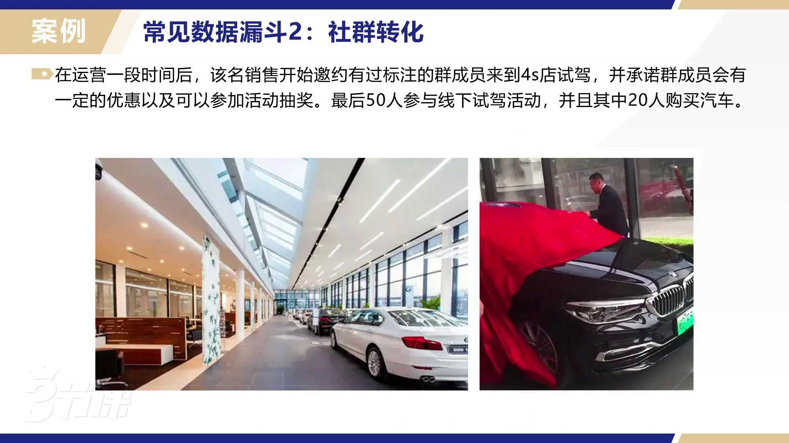

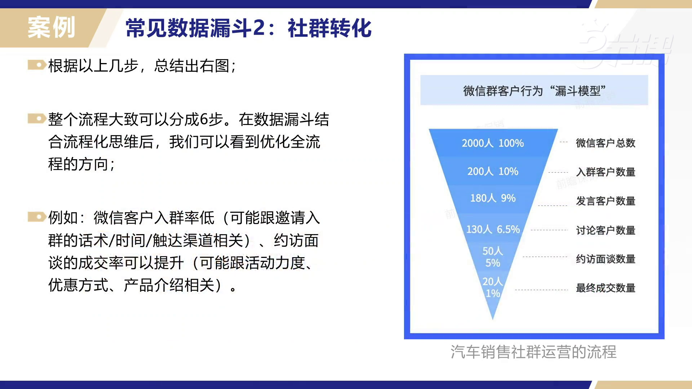

　　围绕这个过程你会发现我们稍微总结一下的话，就能得到右面的这么一张图？大概这么一个漏斗的一个模型。从最前端我们一共微信添加多少好友，到最后我们有多少人成交，整个过程中大概分成六个环节。

　　每个环节里面我们也可以看一下这里边有哪些地方是值得我们去关注一下，是否有可以提升的空间的。比如说我们2000个人，只有200个人进群，那只有10%的这么一个转化率，90%用户在我们第一步其实就流失掉了。这就是一个特别值得我们去关注的点。我们也要去定向看一下？到底没有进群的这1800个人是个什么情况？是我们的信息触达不够有效，还是说我们这个群的吸引力对他不够，还是说可能是一个什么样的状态，我们也要进一步可能再去看一下。所以社群转化的数据漏斗背后一定是我们所说的从展示入群。

　　然后我们一定要筛选出来高意向的用户，以及也要设计一些定向的这种互动体验和引导。最后来看一个成交。所以这是我们跟大家分享的第二种常见的数据漏斗。

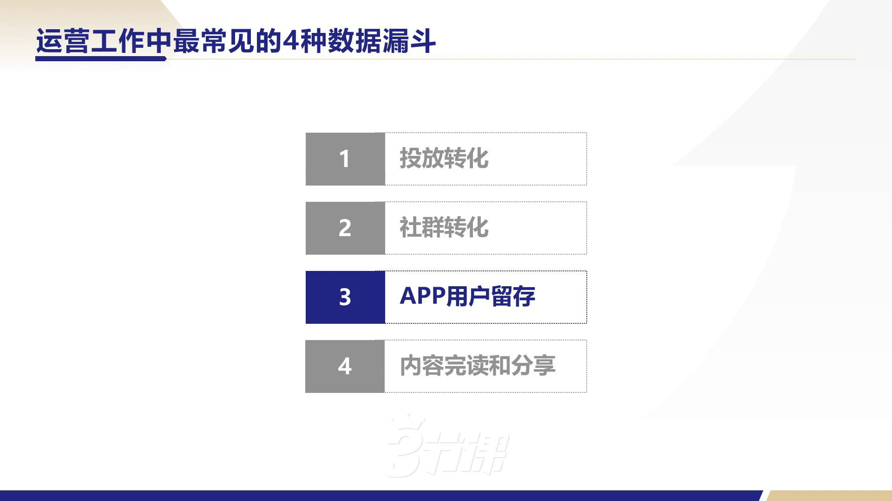

　　接下来我们再来聊一下第三种常见的数据漏斗，APP的用户留存。我们都知道对很多APP来讲，留存和活跃其实是一个非常重要的指标。而针对APP的用户留存通常的一个数据漏斗，它大概是这样的。从最前边用户可能访问知道APP，到用户可能就是注册，成为这个PP的正式的用户。接下来的话就是若干的站内的关键行为体验和引导，最后才是实现留存。

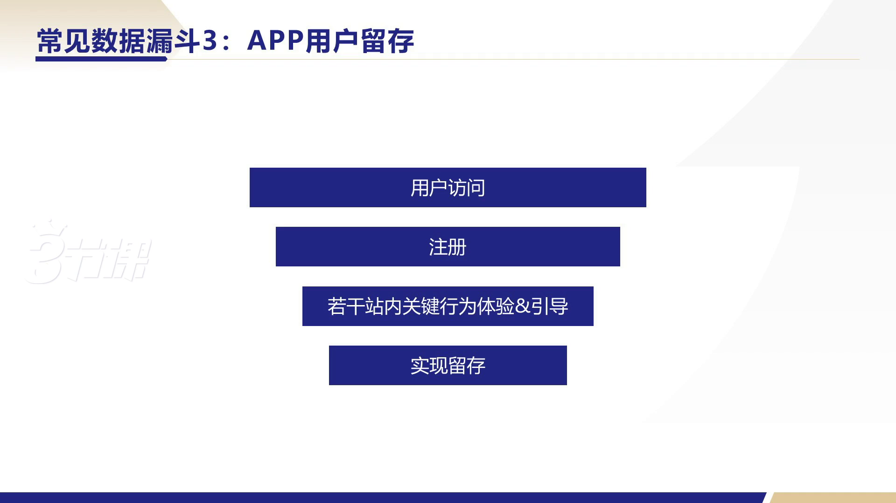

　　这里边确实我觉得比较复杂或者比较重要的事儿，就是我们针对每个APP它给用户提供的核心价值，一定要去做好一些关键行为的这种引导。让用户快速在APP上边能感受到说这个PP确实它是有价值的。就好比说一个看电影的APP？那一定是说你进来之后，要让用户快速的能看到一些他喜欢他感兴趣的电影。或者是让用户在上边快速通过说你看我同样对这部电影感兴趣的人，可能有这么些人，？于是我跟他们之间产生了关系或形成了互动，所以用户长期才会愿意留下来。

　　所以针对留存背后的这么一个数据漏斗，最重要的事情就是在于说用户的留存他需要发生一些什么样的行为，他需要可能在APP站内走一个什么样的路径。这个设计其实非常重要的。而这个设计实打实的说，确实需要结合具体不同产品，不同业务，它到底给用户创造了什么价值？这个产品有什么样的一些特色，有些什么样的重要功能来具体来去看。我们在这儿大概有个印象就行了。

　　我们不妨也简单来看一个例子，这个例子就是可能很多人非常熟悉的一款读书类的APP了。微信读书？那我们会发现微信读书它本身是一款读书类的APP。它要让用户做的事儿就是进来之后快速找到自己感兴趣的书，而且在上边来开始读，对不对？所以用户进到这产品来之后，然后怎么着能够快速的找到一些书，怎么着能够说以最低成本的方式能感受到一些价值，这件事儿可能会是非常重要的。

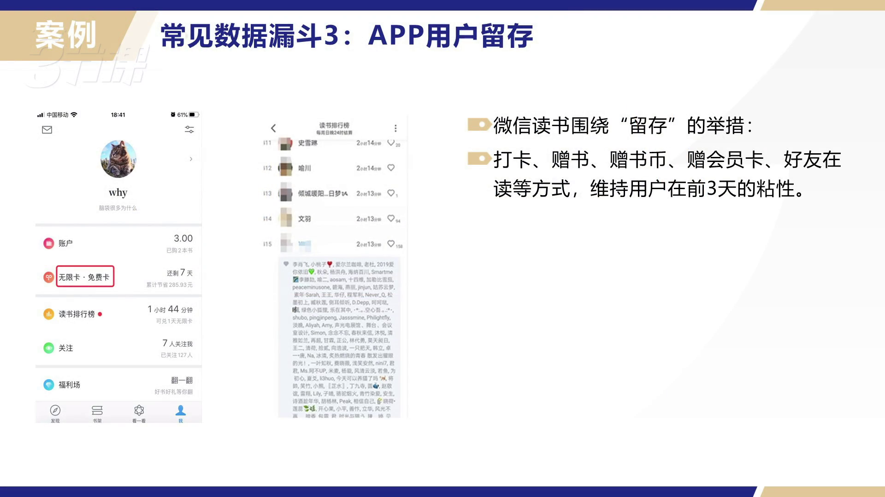

　　所以你会发现就一个新用户他注册了微信读书之后，围绕着留存微信读书会做些什么呢？它会引导用户说，你看读书打卡，或者我赠你可能几本书，赠你一些书币，赠你一些像无限卡会员卡。因为微信读书其实有一个无限卡的东西，是可以读他站内的所有的这种经典的这种好书？包括有些这种好友在读之类的，就你的微信好友谁谁谁在读些什么样的书，来引导你说你可以通过读书为一个纽带，跟你的好友更好的互动。通过这样的方式维持用户在前三天的一个粘性。在前三天里面快速在这产品里头能感受到一些价值，愿意留下来在他前三天里边做的一些事情。而接下来的话围绕着用户的长期留存，长期留存就一定是说我们要让用户感受到一些稳定的长期价值了。

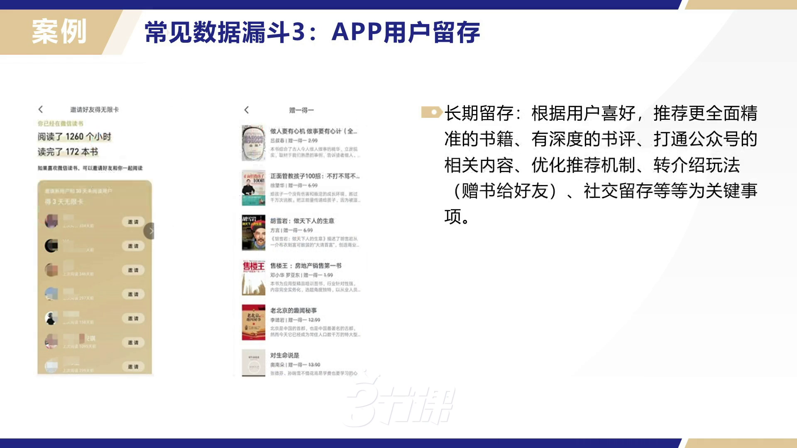

　　所以对于一款读书类的APP来讲，长期根据用户的喜好能够推荐更全面更精准的一些书籍，有深度的书评。包括可能在站内打通跟公众号的一些相关内容，优画他的推荐机制，包括可能有些转介绍的玩法。通过让你说你可以赠送你的好友可能几本书你们一起来读，？那让用户可能在里边也能产生一些社交互动的关系，通过这样的关系让用户愿意长期的能留下来。所以你也能看到这是微信读书做一款读书类的APP。它在用户留存这件事上，它设计的一系列的给到用户的体验和一些互动。

　　当然在那你可能也会有疑问了，就是因为有的APP它确实站内的功能非常复杂，能给到用户的体验似乎非常的多，？所以你说我拍脑袋说我用这个体验或者我用那个服务让用户留存。那最后我怎么判断我脑海中想的这个东西它对还是不对，是否真的能让用户留存下来呢？所以这就涉及到我们通常在看留存的时候，其实看数据的逻辑可能会有一点点的不一样。我们通常在看留存的时候，如果现在我站内？比如说有1234这么四种方，是我们假定能让用户留存下来。

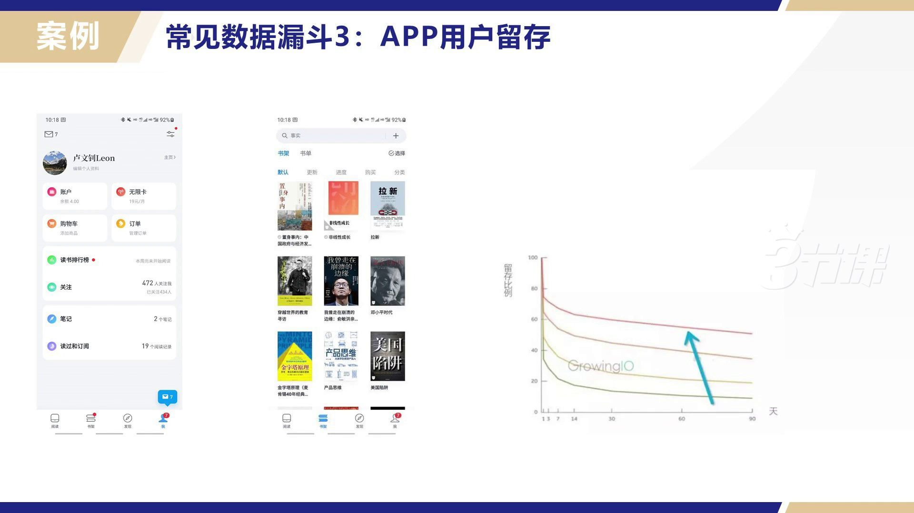

　　比如说第一种就是说让用户跟他好友一起读书。第二种的话就是我们直接送用户，可能就是两本相关的这种书。第三种的话可能还有一些别的什么什么方式。第四种可能是参与一个活动，对不对？好了，我们假定这四种方式也许都能让用户留存，但是我们也不知道到底哪一种方式效果更好。

　　所以接下来我们再看数据的时候，其实是我们要把用户可能去分类分开。我们来看你看用户在A行为下，然后他后续的比如说四日、三日、7日，然后30天的这个留存的曲线是怎样的那用户可能在B行为下，它的一个留存曲线又是怎样的？用户在C行为下，他留存曲线又是怎样的？我们要这么来去做比对。通过这样的反复的比对，我们才能够找到说，似乎就是有这么一两个行为，其他对于我们用户的留存是会价值更高，是能够显著提升用户留存的这么一个数据的这是关于用户留存这件事儿背后的一个数据漏斗和我们看数据的一个逻辑。因为我们这门课确实不是一个数据分析的课程，所以我们就点到为止，大家大概理解这个逻辑就好了。如果大家有进一步学习及数据分析相关的需求，那也许可以去参加我们数据分析的相应的课程，好吧？

　　好，我们接下来再进入到我们最常见的第四种数据的漏洞，那就是我们的内容完读和分享。各位都知道在现在的社交网络上时代和新媒体时代，通过去做好内容来让内容获得传播，获得流量，其实是一种运营当中也非常常见的一类场景了。我们有无数的新媒体运营的同学们，一定都会每天面临到，到底怎么来做好我的内容，让我内容获得更多的这种分享和传播。其实在内容的完读和分享建设上，我们也会有一个常见的数据漏斗的逻辑。这个逻辑其实并不复杂，也很简单。就从最早的内容展示到用户要点击打开这个内容，再到可能用户他看完10%，看完50%，再到百分之百，看完最后再有个分享传播。其实这背后也有一个数据漏斗的，我们可以一环接一环的来去精细的看这么一个数据，并据此来去帮助我们不断调整。说到底我们的内容有哪些地方还可以优化，还可以调整，让我们的内容最终能获得更多的一个流量，这会是一个很基本的逻辑。

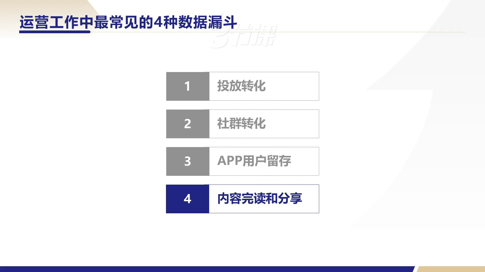

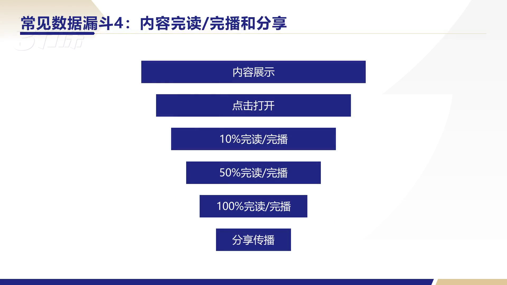

　　比如说我们也来看一个例子，假设你是一个微信公号的运营的小编，？你可能发现你自己可能就是推送了很多的内容，但是它的阅读量和传播量流量其实都不是特别的高。这时候你该怎么办呢？其实这时候我们就可以按照刚才说这个逻辑来去看一下数据了。

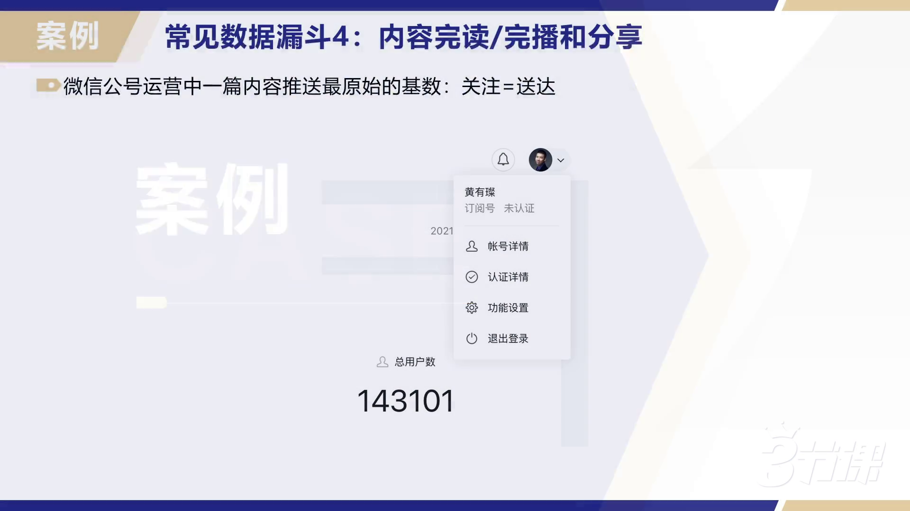

　　首先各位你要知道公号运营当中一篇内容推送，它有个最原始的基数。这个基数就是你的关注用户数，？你有多少粉丝决定了说你这篇内容他会送达到多少人的消息列表，有机会被多少人看到。这肯定是一个最原始的这么一个基数。

　　那这样一个奇数我们往下再一步的话你要知道内容被送达之后，它不一定都会被点开，对不对？你要知道在微信公号里面，绝大多数推文它的送达打开率都只有在5%以内。也就是说你送达了100个人，？大概可能有不到5个人，最后会点击打开。那到底什么东西会刺激你的点击打开率呢？通常可能是像标题、配图，然后我们的摘要，还有推送时间等等这样的一些东西。其实这些东西背后你也是能做一些相应的数据对比的，对不对？所以这是关于打开。打开完了之后，接下来的话，用户肯定会因为各种各样的原因就没有看完这篇内容。只有一部分人会看到最后，整个在微信公号的后台，它也有一个阅读完成的这么一个情况的分析。

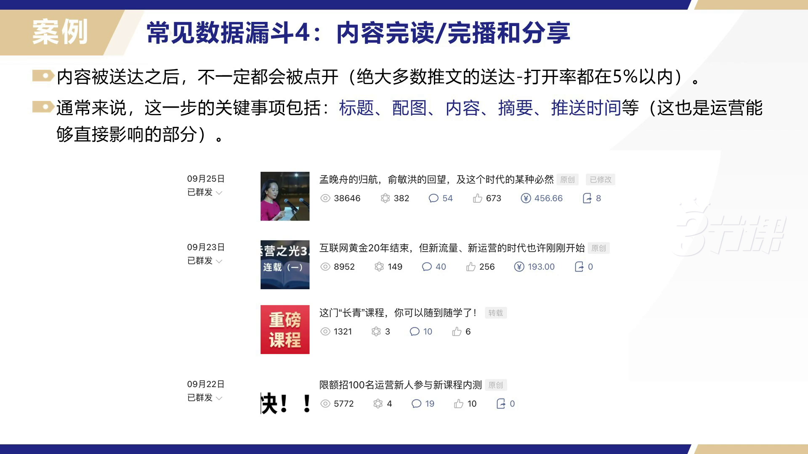

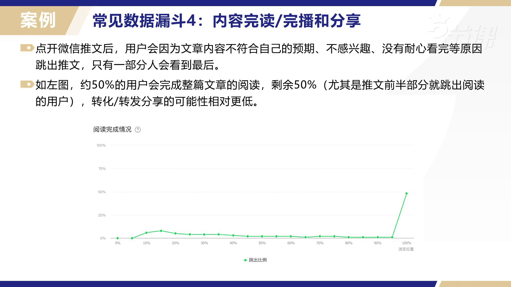

　　有多少人看了10%，有多少看到50%，有多少人看完了百分之百，对不对？比如说以某一篇文章为例，我们会发现这篇文章里边有50%的用户完成了整篇的阅读。剩余50%他可能就跳出了。换句话说，你要寻求用户帮你做一些传播和分享。那一定是看完了整篇内容的这些人，他帮助你去做传播分享的概率可能会更大，对不对？好，如果你一篇文章一共只有不到10%的人能看完，那对不起，你说你能有多少传播和分享呢？这个就很难了吧？所以这是在玩黩上大概这么一个逻辑和漏斗。

　　再往后的话可能就是你的分享的这么一个次数，加上阅读过后的这么一个关注的人数。这个也是有个数据链路，我们可以往下来去看到的。比如说这有一篇文章我们会发现，它整个的一个逻辑就是我们有14万的送达数，送达之后赢得了4.6万的阅读率。4.6万人当中有50%人是完成了整篇文章的阅读，也就有2.3万人完读。那2.3万人完读里边，一共有3335人分享。也就是我们在这完犊人当中，如果把它作为分母的话，最后的分享转发率为14.5%。

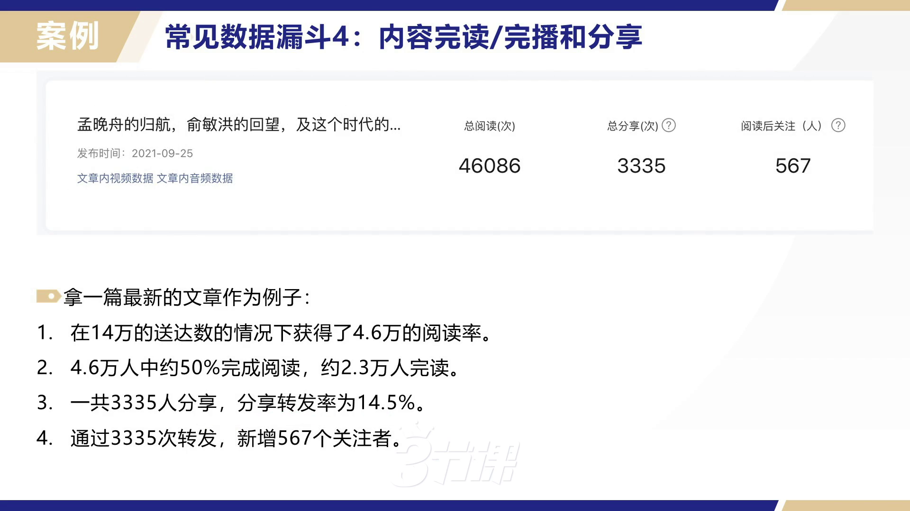

　　这三千多次的转发给我们新增了有个567个的这种新的粉丝和新的关注者。你看这就是公号背后我们所看到的这么一个相应的数据漏斗。一旦我们把整个这个漏斗去拉出来，我们连续对比了多篇文章，或者连续对比了某一类型的文章之后，我们就可以看到这个文章被背后它的一个整体的数据漏斗。然后这样的类型的文章它整个在这个数据漏斗上有哪些环节？是值得我们关注的，也许我们可以再去做一些优化。比如我们其实能看到，如果以刚才这篇文章为例的话，其实我们会看到一共23000个人读完了整篇文章，但分享的人只有3300多人，？这里边14.5%的分享率是有机会可以提升的那在提升上，比如说我们也许可以加入一些哈多戳中用户情绪的这样的一些描述，或者是给到用户一些转发分享的更强烈的动机。这些事儿都是我们可以考虑的一些优化的空间。

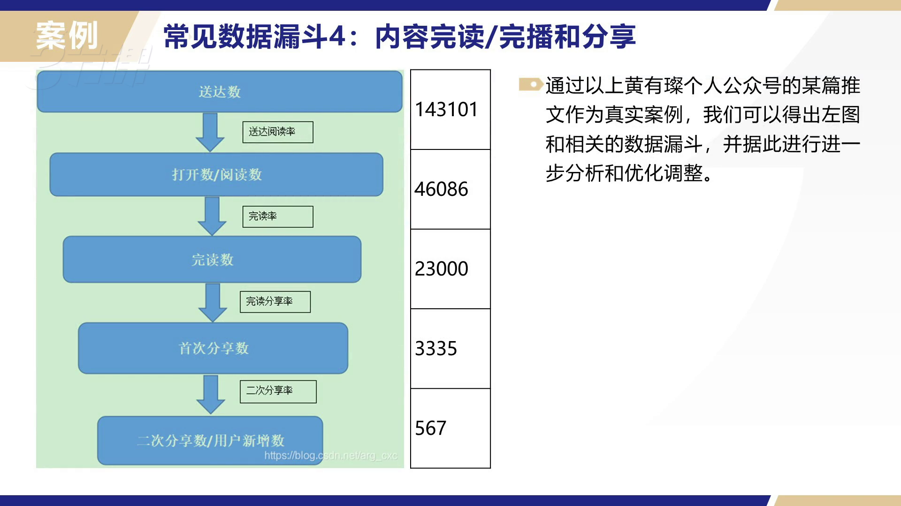

　　再者的话就是三天多次分享出去，一共只带来567的关注。这件事儿背后也许也可以再考虑是否有些细节我们还可以优化。加强说用户看到文章之后，他去点击关注的这样的一个欲望和这样的一些动机？那也许也能够帮助我们把分享之后的关注这么一个数据去拉伸到可能一个量级和一个高度上。所以这是关于内容的完读和分享传播它的一个典型的数据漏斗的一个情况。好了，到此为止我们基本上就给大家把四种运营工作中最常见的数据漏斗都简单的拎，让大家对他们能有个大概的印象和概念。

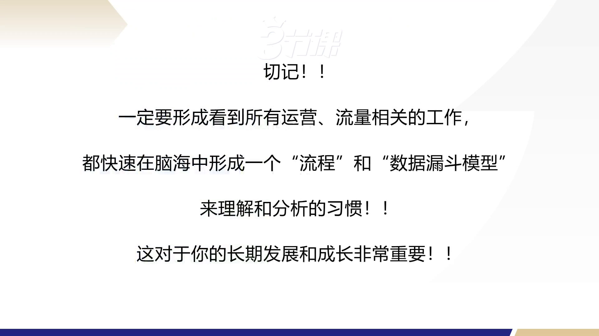

　　最后我觉得我们在第二节的这个部分，还是想强调一下各位，我们这一节到底在讲什么？我们希望你一定要记住，你作为一个运营，一定要能够形成当你看到所有运营流量相关的工作，都能快速的在你脑海中形成一个流程和数据漏斗模型，来去理解和分析他们的习惯。要知道这件事儿对于你的长期发展和成长是非常重要的。而这件事背后一定也需要你不断的去做一些课刻意的练习。好了，我们整个第二节内容就给大家分享到这里。
