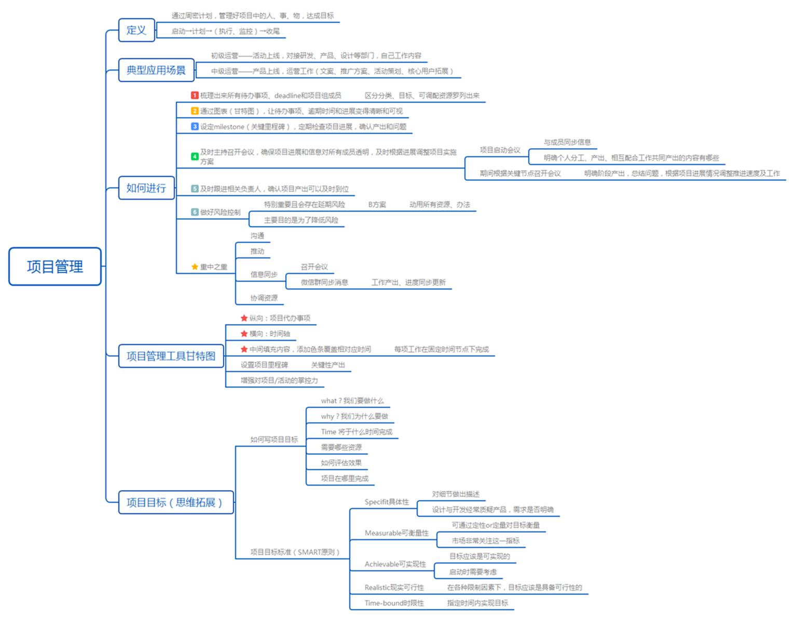
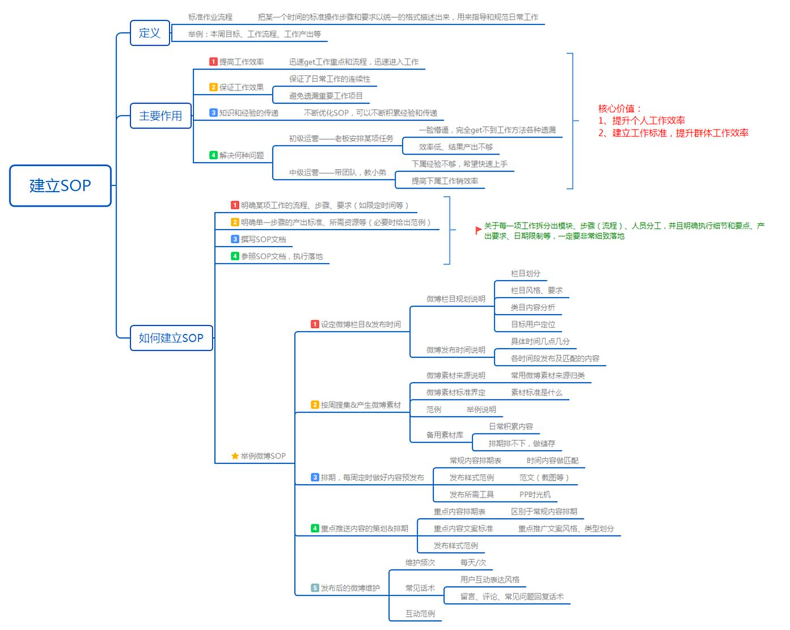
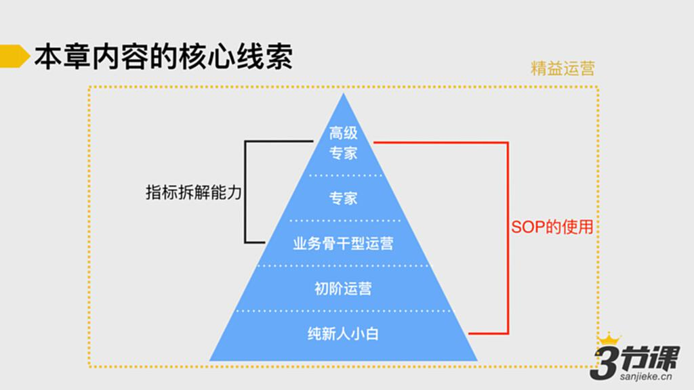

# S6.01：本章内容的核心线索

## 工作管理：运营人的通用工作方法

本章节的核心目标是帮助你掌握高效工作的方法。

围绕这个目标，课程设计逻辑如下图：

### 三大核心能力

**1. SOP的建立和使用**

从初级运营到高级运营都需要掌握的基础技能。通过标准化流程提升工作效率。

**2. 指标拆解能力**

业务骨干及以上级别运营必须具备的核心能力。将KPI合理拆分为可交付的团队任务，确保团队按时高效完成。

**3. 精益运营思维**

适用于所有运营阶段的指导思想。

接下来将进入本章内容——【工作管理】运营人的通用工作方法。
