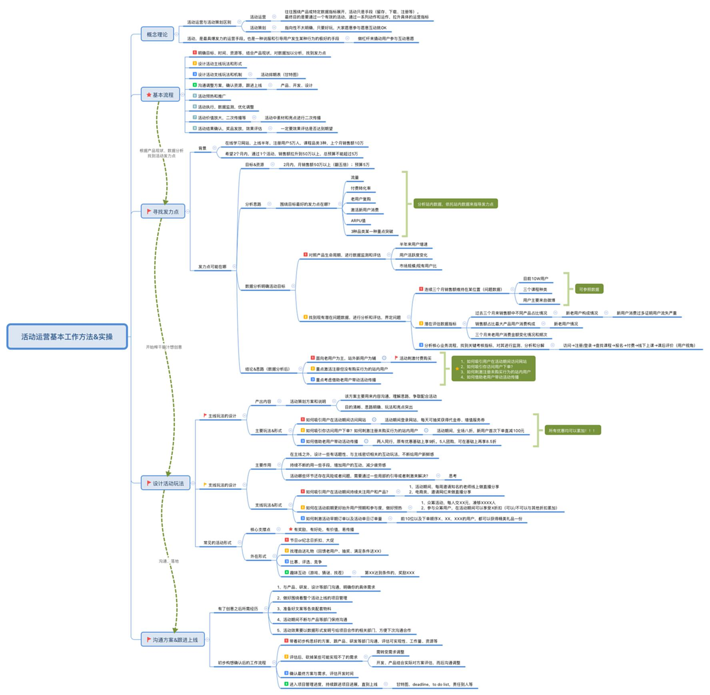
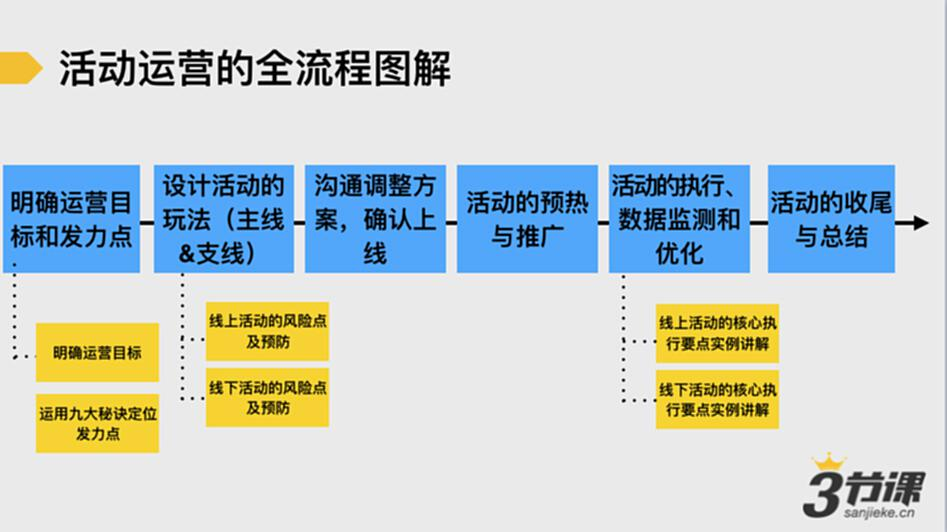

# S7.01：本章内容核心线索

## 课程导读

### 常见工作场景

运营工作中，你是否经常遇到以下情景：

- 老板要求："马上国庆节了，搞个活动吸粉，目标1万粉丝，但没有预算"
- 老板要求："马上中秋节了，搞个活动……"
- 老板要求："马上双十一了，搞个活动……"

面对**低预算、高收益**的活动效果预期，你是否感到压力？

### 本章学习目标

本章节的核心目标是帮助你：

1. 掌握活动运营的基本工作流程
2. 快速设计出可落地的活动策划方案

## 课程核心线索

一份可落地的活动策划方案应包含以下核心要素：

### 活动策划方案核心要素

1. **活动目标** - 明确要达成的具体目标
2. **活动发力点与外在包装形式** - 确定核心驱动因素和呈现方式
3. **活动玩法** - 设计主线和支线玩法机制
4. **用户参与流程** - 规划用户从接触到完成活动的全流程
5. **预热和推广计划** - 制定活动前期的宣传推广策略
6. **活动执行SOP** - 建立标准化的执行流程
7. **活动风险预警** - 识别潜在风险并制定应对预案
8. **活动复盘** - 总结经验教训，形成优化迭代

## 学习路径

本章节将围绕**如何产出可落地的活动策划方案**，带领你逐步学习：

- 活动运营的基本工作流程
- 如何明确活动目标与发力点
- 如何设计活动的主线和支线玩法
- 如何制定活动执行计划
- 如何进行活动预热和推广
- 如何做好活动执行与监控
- 如何进行活动复盘与优化

接下来，让我们进入本章内容——**活动运营：工作方法、流程设计与执行要点**。
